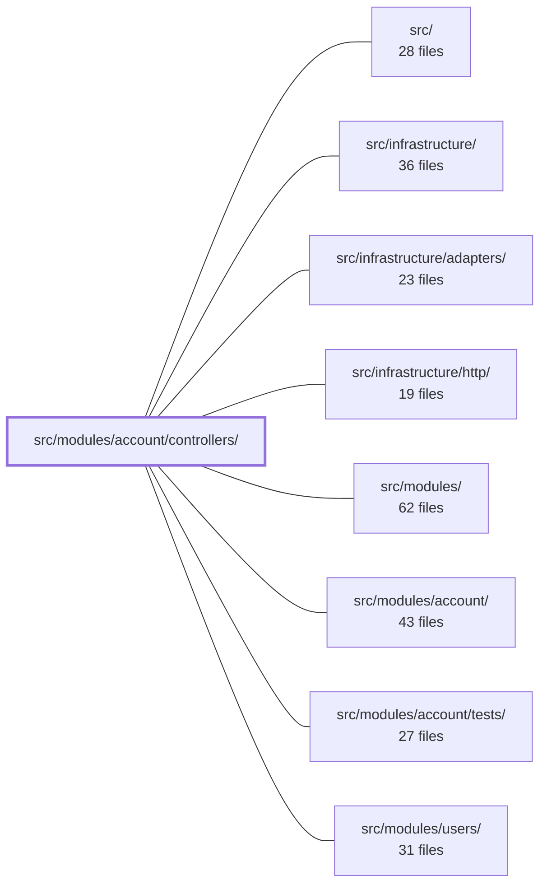

---
tags:
  - 2brain
  - 2brain/module
  - project/boilerplate-node-backend
type: module
module: src/modules/account/controllers/
files: 33
updated: 2026-09-23T20:35:45.772990+00:00
---

# src/modules/account/controllers/

## Purpose

This directory holds every Express route handler (controller) for the account module. Each file is a thin HTTP adapter: it parses and validates incoming requests, delegates all business logic to the account or two-factor service layer, and shapes the response (status code, i18n messages, cookies, metrics). No domain logic lives here.

## Key parts

- **Authentication & sessions** — `post-login.ts`, `post-login-2fa.ts`, `post-login-2fa-send.ts` (two-step login with MFA), `post-logout.ts`, `post-logout-everywhere.ts`, `get-refresh-token.ts` (token rotation), `post-reauth.ts` (step-up re-auth), `get-sessions.ts` / `delete-session.ts` (session list & per-device revoke).
- **Two-factor management** — `get-2fa.ts` (status), `post-2fa-setup.ts` / `post-2fa-confirm.ts` (arm a new method), `delete-2fa-method.ts` / `delete-2fa.ts` (remove methods or all 2FA), `post-2fa-backup-codes.ts` (regenerate codes).
- **Account lifecycle** — `post-signup.ts`, `post-verify-request.ts` / `post-verify-confirm.ts` (email verification), `post-email-change-confirm.ts`, `delete-account-request.ts` / `delete-account-confirm.ts` (two-step hard delete).
- **Password & reset** — `post-password-change.ts`, `post-password-check.ts` (advisory breach check), `post-reset-request.ts` / `post-reset-confirm.ts` (token-based reset flow).
- **OAuth** — `get-oauth-providers.ts`, `get-oauth-start.ts` (302 to provider), `get-oauth-callback.ts` (code exchange, session mint, or MFA redirect).
- **Profile & data access** — `get-account.ts`, `put-account.ts` (self-service profile edit), `post-account-export.ts`, `get-my-abilities.ts` (publish CASL rules to the client).
- **Admin utility** — `delete-expired-tokens.ts` (bulk token cleanup).

## How it connects

- **`src/modules/account/`** (parent): every controller delegates to service functions defined here (`accountService`, `twoFactorService`, `exportOwnData`). The controllers never query the database directly.
- **`src/infrastructure/http/`**: provides shared response helpers, error formatting, and cookie utilities that the controllers import to keep response shaping consistent.
- **`src/infrastructure/` / `src/infrastructure/adapters/`**: supplies cross-cutting concerns (Zod schemas, i18n, metrics/Prometheus counters, audit logging) that controllers invoke at the I/O boundary.
- **`src/modules/users/`**: the `put-account.ts` controller exists so a regular user can edit their own profile without the `users.*` permission that the `/users` write routes require; the two modules share the users collection but operate at different privilege levels.
- **`src/modules/account/tests/`**: unit and integration tests for the controllers in this directory.

## Where to start

Read **`post-login.ts`** first — it is the richest controller in the directory and shows the full pattern (validation, service delegation, dual-credential 2FA gating, metrics, audit, and response shaping) in one place. Then read **`get-oauth-callback.ts`**, which demonstrates the module's one non-JSON flow (302 redirects for browser mid-navigation errors) and how session minting and the MFA challenge hand-off work at the HTTP boundary.

## Connected modules

[[boilerplate-node-backend_src|src/]] · [[boilerplate-node-backend_src_infrastructure|src/infrastructure/]] · [[boilerplate-node-backend_src_infrastructure_adapters|src/infrastructure/adapters/]] · [[boilerplate-node-backend_src_infrastructure_http|src/infrastructure/http/]] · [[boilerplate-node-backend_src_modules|src/modules/]] · [[boilerplate-node-backend_src_modules_account|src/modules/account/]] · [[boilerplate-node-backend_src_modules_account_tests|src/modules/account/tests/]] · [[boilerplate-node-backend_src_modules_users|src/modules/users/]]

## Files
- `src/modules/account/controllers/delete-2fa-method.ts` — Thin HTTP adapter for `DELETE /account/2fa/methods/{method}`. Validates the path parameter and request body (which must include a valid 2FA code), then delegates to `twoFactorService.removeTwoFactorMethod`. Enforces the same dual-credential requirement (fresh auth session + one-time code) as full 2FA disable to prevent a stolen session from peeling off factors one at a time.
- `src/modules/account/controllers/delete-2fa.ts` — Thin HTTP adapter for `DELETE /account/2fa`. Validates the request body against the `DisableTwoFactorBody` zod schema, then delegates to `twoFactorService.disableTwoFactor` to drop all armed factors and backup codes. Emits a Prometheus counter and returns an i18n-localised success or error response.
- `src/modules/account/controllers/delete-account-confirm.ts` — Controller for the `DELETE /account/delete-confirm` endpoint. It validates and spends a one-time account-deletion token, then hard-deletes the account. After a successful delete it clears session cookies and returns a localized success message.
- `src/modules/account/controllers/delete-account-request.ts` — Controller for `DELETE /account`. Given an authenticated user, it triggers the account-deletion confirmation flow (email with a one-time token) by delegating to `accountService`. The token itself is never exposed to the caller.
- `src/modules/account/controllers/delete-expired-tokens.ts` — Thin HTTP adapter for `DELETE /account/tokens/expired`. Translates the request into a call to `accountService.adminTokenCleanup`, increments a cleanup metric on success, and shapes the response into the `MessageResponse` contract. Exists to keep the service layer free of Express-specific concerns.
- `src/modules/account/controllers/delete-session.ts` — Thin HTTP adapter that exposes `DELETE /account/sessions/:sessionId`, allowing an authenticated user to revoke one of their own refresh-token sessions ("log out that device"). It delegates all business logic to `accountService.sessionRevoke` and maps the result to a success or 404 JSON response.
- `src/modules/account/controllers/get-2fa.ts` — Thin HTTP adapter that exposes a `GET /account/2fa` endpoint, returning the caller's own second-factor authentication status and any additional methods they could enable. Delegates all business logic to `twoFactorService.twoFactorStatus` and maps the result onto an Express response.
- `src/modules/account/controllers/get-account.ts` — Express controller for `GET /account`. Returns the authenticated user's full profile by reading fresh from the users collection, rather than echoing the (intentionally minimal) JWT claims, so fields like `verifiedAt` and `locale` are always present for the client's verify banner and saved-language flows.
- `src/modules/account/controllers/get-my-abilities.ts` — Express handler for `GET /account/abilities`. It serialises the server's CASL ability rules (for both the tenant and platform scopes) and sends them to the client so the UI can decide what to *render* without maintaining its own copy of the policy. It does not grant or revoke anything server-side; it is a read-only publication of the rules the server already enforces on every request.
- `src/modules/account/controllers/get-oauth-callback.ts` — Express route handler for `GET /account/oauth/:provider/callback`. Validates the CSRF `state` and PKCE verifier against cookies, exchanges the authorization code with the resolved provider, then finds-or-creates the account and either mints a session or bounces the browser into the MFA challenge flow. Every failure after the provider is known is communicated via a `302` redirect carrying `?error=<code>`, because the browser is mid-navigation and a JSON body is unreadable.
- `src/modules/account/controllers/get-oauth-providers.ts` — Thin HTTP adapter for `GET /account/oauth/providers`. It exposes the set of enabled OAuth providers for the current deployment so the frontend can render the correct "Continue with…" buttons without hardcoding a list.
- `src/modules/account/controllers/get-oauth-start.ts` — Express controller for `GET /account/oauth/:provider`. It is the single route in the account module that responds with a `Location` redirect (302) rather than a JSON envelope, sending the browser to the provider's consent screen after minting CSRF `state` and PKCE credentials.
- `src/modules/account/controllers/get-refresh-token.ts` — Express controller for `GET /account/refresh`. It reads the refresh token from the `jwt` cookie, optionally runs a collection-wide token-cleanup sweep, then delegates to `accountService.refreshAccessToken` to mint a new access token and rotate the refresh cookie. It is a thin HTTP adapter: all business logic lives in the account service layer.
- `src/modules/account/controllers/get-sessions.ts` — Thin HTTP adapter for the `GET /account/sessions` endpoint. It extracts the authenticated user ID and the current refresh-token cookie from the request, delegates to `accountService.sessionsList`, and shapes the result into a standard JSON response. All business logic (which token types count as a session, marking the current token, suppressing token values) lives in the service layer.
- `src/modules/account/controllers/post-2fa-backup-codes.ts` — Thin HTTP adapter for `POST /account/2fa/backup-codes`. Validates the incoming body, delegates to `twoFactorService.regenerateBackupCodes`, and maps the service result (or a database error) onto an HTTP response. Exists to keep route wiring, validation, metrics, and response shaping separate from the domain service.
- `src/modules/account/controllers/post-2fa-confirm.ts` — Thin HTTP adapter for `POST /account/2fa/methods/{method}/confirm`. Validates path and body parameters, delegates to `twoFactorService.confirmTwoFactorMethod`, and translates the service result into a standard HTTP response. Exists to keep Express routing concerns (parsing, status codes, i18n) separate from domain logic.
- `src/modules/account/controllers/post-2fa-setup.ts` — Thin HTTP adapter for `POST /account/2fa/methods/{method}/setup`. It validates the `method` path parameter via a Zod schema, delegates to `twoFactorService.setupTwoFactorMethod`, and maps the service result onto a standard HTTP response. It exists to keep Express plumbing out of the service layer.
- `src/modules/account/controllers/post-account-export.ts` — Thin HTTP adapter for `POST /account/export`. It extracts the authenticated caller's identity from the request, delegates the actual data assembly to `exportOwnData`, and returns the result through the standard response helpers. All business logic lives in the service; this file only bridges Express I/O.
- `src/modules/account/controllers/post-email-change-confirm.ts` — HTTP controller for `POST /account/email-change-confirm`. It validates a one-time email-change token from the request body, spends it atomically (find-then-spend to avoid races), and promotes the caller's `pendingEmail` to `email`. The endpoint is intentionally public—the token itself is the credential, mirroring the design of the email-verify-confirm endpoint.
- `src/modules/account/controllers/post-login-2fa-send.ts` — HTTP adapter for `POST /account/login/2fa/send`. Validates the incoming request, resolves a two-factor challenge token (from body or cookie), and delegates to `twoFactorService.sendLoginCode` to mail or text a one-time code. It is intentionally thin: no business logic beyond parsing and error mapping.
- `src/modules/account/controllers/post-login-2fa.ts` — Second step of the 2FA login flow. Receives the `challenge` + `code` pair returned by `POST /account/login` when `mfaRequired` is true, delegates verification to the two-factor service, and on success mints a full session with `amr` augmented by `'otp'`.
- `src/modules/account/controllers/post-login.ts` — Controller for `POST /account/login`. Verifies credentials, mints a session (refresh-token cookie + short-lived access token), and emits success/failure observability signals (metrics, audit, analytics). Observability lives here rather than in the service layer so that pre-credential validation failures (e.g. a malformed `remember` value) can be excluded from the login-failure trail, while genuine credential rejections are still recorded.
- `src/modules/account/controllers/post-logout-everywhere.ts` — Thin HTTP adapter for the `POST /account/logout-all` endpoint. It delegates the actual token-removal logic to `accountService.tokenRemoveAll`, then clears the session cookies on the response and returns a 200.
- `src/modules/account/controllers/post-logout.ts` — Thin HTTP adapter for `POST /account/logout`. It revokes the current session's refresh token, clears the session cookies, and always returns **200** — a missing or already-revoked token is treated as "not logged in here," not an error. Only the current session is affected; other devices remain signed in.
- `src/modules/account/controllers/post-password-change.ts` — HTTP controller for `POST /account/password`. Accepts a password-change request, validates the body shape, delegates the actual credential swap to `accountService.passwordChangeWithCurrent`, then re-mints the caller's session token. It exists as the thin Express adapter between the route and the account service.
- `src/modules/account/controllers/post-password-check.ts` — Controller for `POST /account/password/check`. It returns a candidate password's breach-status report as an **advisory** signal. It is unauthenticated by design (signup needs it before an account exists) and never blocks any operation — the four password-SET endpoints remain the authoritative server-side gate.
- `src/modules/account/controllers/post-reauth.ts` — Thin Express handler for `POST /account/reauth`. It re-proves the caller's password (responding to a `401 REAUTH_REQUIRED` step-up challenge issued by `requireFreshAuth`) and re-mints the existing session with a fresh `auth_time`, without terminating it.
- `src/modules/account/controllers/post-reset-confirm.ts` — Handles `POST /account/reset-confirm`. Validates a one-time reset token (delivered in a URL from the reset email), verifies the new password, atomically spends the token, changes the password via the account service, and invalidates the user's active sessions.
- `src/modules/account/controllers/post-reset-request.ts` — HTTP controller for `POST /account/reset-request`. It is a thin adapter that validates the request body, delegates to `accountService.requestPasswordReset`, and returns the same 200 response regardless of whether the email belongs to a real account — the sole purpose being to prevent user enumeration.
- `src/modules/account/controllers/post-signup.ts` — Thin HTTP controller for `POST /account/signup`. Delegates business logic to `accountService.signup`, then shapes the three possible outcomes (genuine success, rung-2 antibot refusal, or validation/DB failure) into consistent HTTP responses, ensuring uploaded images are cleaned up on every path where no account is persisted.
- `src/modules/account/controllers/post-verify-confirm.ts` — Handles `POST /account/verify-confirm`: validates a one-time email-verification token from the request body, atomically spends it, and marks the account's email as verified. The endpoint is deliberately public (no session required) because the token in the body is the credential.
- `src/modules/account/controllers/post-verify-request.ts` — Thin HTTP adapter for `POST /account/verify-request`. It re-sends an email-verification link for an already-signed-up user (e.g. when the original mail never arrived). All domain logic lives in the service layer; this file only extracts auth context, delegates, and shapes the HTTP response.
- `src/modules/account/controllers/put-account.ts` — HTTP controller for `PUT /account`. It lets an authenticated user edit their **own** profile (email, username, locale, image, phone, website, analytics consent) by delegating to `accountService.updateProfile` and handling the uploaded-image cleanup that accompanies a self-service edit. It exists so that a regular user can update their profile without needing the `users.*` permission that the `/users` write routes require.

---
[[boilerplate-node-backend_INDEX|← boilerplate-node-backend index]]
