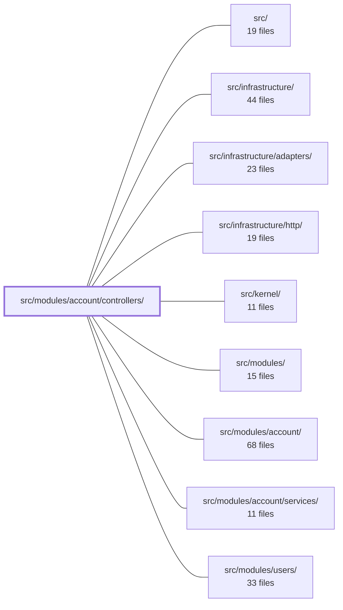

---
tags:
  - 2brain
  - 2brain/module
  - project/boilerplate-node-backend
type: module
module: src/modules/account/controllers/
files: 34
updated: 2026-09-27T16:18:13.800874+00:00
---

# src/modules/account/controllers/

## Purpose

HTTP adapter layer for every account endpoint. Each file is a thin Express handler that extracts request context (auth identity, cookies, path/body params), delegates all business logic to the service layer, and shapes the result into the project's standard JSON or redirect response. No domain rules live here—only protocol concerns: validation, cookie handling, metric emission, and status-code mapping.

## Key parts

- **Authentication & sessions** — `post-login`, `post-logout`, `post-logout-everywhere`, `get-refresh-token`, `post-reauth`, `delete-session`, `get-sessions`. Cover the full sign-in/sign-out cycle, token refresh & rotation, step-up re-auth, and per-device session management.
- **Two-factor (2FA)** — `get-2fa`, `post-2fa-setup`, `post-2fa-confirm`, `post-2fa-backup-codes`, `delete-2fa`, `delete-2fa-method`, `post-login-2fa`, `post-login-2fa-send`. Encompass the 2FA lifecycle (setup → confirm → backup codes → disable) plus the two login-time 2FA steps.
- **OAuth** — `get-oauth-start` (302 redirect to provider), `get-oauth-callback` (code exchange, find-or-create, session mint), `get-oauth-providers` (enabled-provider list for the UI).
- **Account lifecycle** — `post-signup`, `delete-account-request` / `delete-account-confirm`, `post-email-change-confirm`, `cancel-pending-email`, `post-verify-request` / `post-verify-confirm`. Handle creation, deletion (two-step token flow), email verification, and email change.
- **Password** — `post-password-change`, `post-password-check` (advisory breach check), `post-reset-request` / `post-reset-confirm` (token-based reset flow).
- **Profile & misc** — `get-account`, `update-account` (PUT/PATCH), `get-my-abilities` (CASL rule publication), `post-account-export`, `delete-expired-tokens` (admin sweep).

## How it connects

- **`src/modules/account/services/`** — The primary delegation target. Nearly every controller calls into `accountService`, `twoFactorService`, or `exportOwnData`; business rules, token issuance, and data assembly live there, keeping these files free of domain logic.
- **`src/modules/account/`** (parent) — `routes.ts` in the parent directory registers the Express routes and wires each controller function to its path and HTTP verb; the controllers are the handlers it invokes.
- **`src/infrastructure/http/`** — Provides the shared response helpers (`success`, `rejection`, `MessageResponse` contract) and middleware (auth guards, `requireFreshAuth`) that controllers rely on for protocol shaping and request validation.
- **`src/infrastructure/adapters/`** — Cookie utilities (reading/writing refresh-token and OAuth state/verifier cookies) and image-upload handling used by several controllers (e.g. `get-refresh-token`, `post-signup`, `get-oauth-start`).
- **`src/kernel/`** — Core utilities such as metric emission (Prometheus counters on success/refusal), config access, and shared error types referenced across the controllers.
- **`src/modules/users/`** — `get-account` reads fresh profile data from the users collection rather than echoing JWT claims; other controllers indirectly depend on the users repository through the service layer.

## Where to start

1. **`post-login.ts`** — The most representative "happy path" controller: it shows the typical pattern of body validation → service delegation → branching (2FA challenge vs. full session) → metric emission → response shaping. Reading it first makes every other file feel like a variation on the same shape.
2. **`routes.ts`** (in the parent `src/modules/account/` directory) — Maps each endpoint path to its controller, giving an at-a-glance table of the entire account API surface and making it easy to see which controller handles which route.

## Connected modules

```mermaid
flowchart LR
    m_src_modules_account_controllers["src/modules/account/controllers/"]
    m_src["src/<br/>19 files"]
    m_src_infrastructure["src/infrastructure/<br/>44 files"]
    m_src_infrastructure_adapters["src/infrastructure/adapters/<br/>23 files"]
    m_src_infrastructure_http["src/infrastructure/http/<br/>19 files"]
    m_src_kernel["src/kernel/<br/>11 files"]
    m_src_modules["src/modules/<br/>15 files"]
    m_src_modules_account["src/modules/account/<br/>68 files"]
    m_src_modules_account_services["src/modules/account/services/<br/>11 files"]
    m_src_modules_users["src/modules/users/<br/>33 files"]
    m_src_modules_account_controllers --- m_src
    m_src_modules_account_controllers --- m_src_infrastructure
    m_src_modules_account_controllers --- m_src_infrastructure_adapters
    m_src_modules_account_controllers --- m_src_infrastructure_http
    m_src_modules_account_controllers --- m_src_kernel
    m_src_modules_account_controllers --- m_src_modules
    m_src_modules_account_controllers --- m_src_modules_account
    m_src_modules_account_controllers --- m_src_modules_account_services
    m_src_modules_account_controllers --- m_src_modules_users
    style m_src_modules_account_controllers stroke-width:3px
```

[[boilerplate-node-backend_src|src/]] · [[boilerplate-node-backend_src_infrastructure|src/infrastructure/]] · [[boilerplate-node-backend_src_infrastructure_adapters|src/infrastructure/adapters/]] · [[boilerplate-node-backend_src_infrastructure_http|src/infrastructure/http/]] · [[boilerplate-node-backend_src_kernel|src/kernel/]] · [[boilerplate-node-backend_src_modules|src/modules/]] · [[boilerplate-node-backend_src_modules_account|src/modules/account/]] · [[boilerplate-node-backend_src_modules_account_services|src/modules/account/services/]] · [[boilerplate-node-backend_src_modules_users|src/modules/users/]]

## Files
- `src/modules/account/controllers/cancel-pending-email.ts` — Thin HTTP adapter for `DELETE /account/pending-email`. It extracts the authenticated user ID and caller context from the request, delegates to `accountService.cancelPendingEmailChange`, and maps the service result (or a refusal) to an HTTP response.
- `src/modules/account/controllers/delete-2fa-method.ts` — Thin HTTP controller for `DELETE /account/2fa/methods/{method}`. Validates the path parameter and request body, delegates to `twoFactorService.removeTwoFactorMethod`, records a metric, and formats the response. It exists to keep route registration (in `routes.ts`) separate from the HTTP-protocol concerns of this single endpoint.
- `src/modules/account/controllers/delete-2fa.ts` — Single-handler controller for `DELETE /account/2fa`. Validates the incoming code (or backup code) from the request body, then delegates to `twoFactorService.disableTwoFactor` to remove all armed two-factor factors and their backup codes for the authenticated user.
- `src/modules/account/controllers/delete-account-confirm.ts` — Express controller for `DELETE /account/delete-confirm`. It validates (and consumes) a one-time account-deletion token, then hard-deletes the account, destroys the session cookies, and returns a localized success or error message.
- `src/modules/account/controllers/delete-account-request.ts` — Controller for `DELETE /account`. Given an authenticated user, it triggers the account-deletion confirmation flow (email with a one-time token) by delegating to `accountService`. The token itself is never exposed to the caller.
- `src/modules/account/controllers/delete-expired-tokens.ts` — Thin HTTP adapter for `DELETE /account/tokens/expired`. Translates the request into a call to `accountService.adminTokenCleanup`, increments a cleanup metric on success, and shapes the response into the `MessageResponse` contract. Exists to keep the service layer free of Express-specific concerns.
- `src/modules/account/controllers/delete-session.ts` — Thin HTTP adapter that exposes `DELETE /account/sessions/:sessionId`, allowing an authenticated user to revoke one of their own refresh-token sessions ("log out that device"). It delegates all business logic to `accountService.sessionRevoke` and maps the result to a success or 404 JSON response.
- `src/modules/account/controllers/get-2fa.ts` — Thin HTTP adapter for `GET /account/2fa`. It reads the authenticated caller's current second-factor status (active methods and available options) by delegating to `twoFactorService.twoFactorStatus`, then formats the result into a standard success or rejection response.
- `src/modules/account/controllers/get-account.ts` — Express controller for `GET /account`. Returns the authenticated user's full profile by reading fresh from the users collection, rather than echoing the (intentionally minimal) JWT claims, so fields like `verifiedAt` and `locale` are always present for the client's verify banner and saved-language flows.
- `src/modules/account/controllers/get-my-abilities.ts` — Express handler for `GET /account/abilities`. It serialises the server's CASL ability rules (for both the tenant and platform scopes) and sends them to the client so the UI can decide what to _render_ without maintaining its own copy of the policy. It does not grant or revoke anything server-side; it is a read-only publication of the rules the server already enforces on every request.
- `src/modules/account/controllers/get-oauth-callback.ts` — Controller for `GET /account/oauth/:provider/callback` — the endpoint a third-party OAuth provider's consent screen redirects the browser back to. It validates the CSRF `state` and PKCE `verifier` against their cookies, exchanges the authorization code, finds-or-creates the account, then either mints a session or issues an MFA challenge. All failures after the state check redirect the browser to the paired frontend with `?error=<code>` because the response is a 302 navigation, not a JSON API call.
- `src/modules/account/controllers/get-oauth-providers.ts` — Thin HTTP adapter for `GET /account/oauth/providers`. It exposes the set of enabled OAuth providers for the current deployment so the frontend can render the correct "Continue with…" buttons without hardcoding a list.
- `src/modules/account/controllers/get-oauth-start.ts` — Express controller for `GET /account/oauth/:provider`. It is the single account route that responds with a `Location` redirect (302) rather than a JSON envelope: it mints the OAuth `state` and PKCE verifier, stores both (plus an optional `continue` path) as cookies, and sends the browser to the provider's consent screen.
- `src/modules/account/controllers/get-refresh-token.ts` — HTTP controller for `GET /account/refresh`. It reads the refresh token from a cookie, conditionally runs a housekeeping sweep of expired tokens, then calls `accountService.refreshAccessToken` to mint a new short-lived access token **and** rotate the refresh token. The rotated refresh value is written back into the client's cookie in the same response.
- `src/modules/account/controllers/get-sessions.ts` — Thin HTTP adapter for `GET /account/sessions`. Reads the caller's refresh cookie, delegates to `accountService.sessionsList`, and shapes the result into a JSON response. All token-classification and redaction logic lives in the service layer.
- `src/modules/account/controllers/post-2fa-backup-codes.ts` — Thin HTTP adapter for `POST /account/2fa/backup-codes`. It validates the request body, delegates to `twoFactorService.regenerateBackupCodes`, and formats the success/failure response. Requires both critical auth and a valid 2FA code before allowing backup-code regeneration.
- `src/modules/account/controllers/post-2fa-confirm.ts` — Thin HTTP adapter for `POST /account/2fa/methods/{method}/confirm`. Validates the path parameter (`method`) and body (`code`) via Zod, delegates to `twoFactorService.confirmTwoFactorMethod`, records a Prometheus metric, and returns a `TwoFactorConfirmed` payload (which includes backup codes when this was the account's first factor).
- `src/modules/account/controllers/post-2fa-setup.ts` — Thin HTTP adapter for `POST /account/2fa/methods/{method}/setup`. Validates the URL parameter, delegates to `twoFactorService.setupTwoFactorMethod`, and formats the service result into a standard HTTP response. Exists to keep route wiring (in `routes.ts`) decoupled from business logic.
- `src/modules/account/controllers/post-account-export.ts` — Thin HTTP adapter for `POST /account/export`. It extracts the authenticated caller's identity from the request, delegates the actual data assembly to `exportOwnData`, and returns the result through the standard response helpers. All business logic lives in the service; this file only bridges Express I/O.
- `src/modules/account/controllers/post-email-change-confirm.ts` — Handles `POST /account/email-change-confirm`. It validates a one-time `email-change` token in the body, spends it via `accountService.redeemLiveToken`, and then commits the pending email to the user's `email` field via `accountService.completeEmailChange`. The endpoint is deliberately public: the token itself is the credential, not an authenticated session.
- `src/modules/account/controllers/post-login-2fa-send.ts` — Thin HTTP adapter for `POST /account/login/2fa/send`. Validates the request body, resolves a 2FA challenge token (from body or cookie), delegates to `twoFactorService.sendLoginCode`, and shapes the HTTP response. The endpoint is intentionally public — the challenge token itself is the credential, consistent with the rest of the login flow.
- `src/modules/account/controllers/post-login-2fa.ts` — HTTP adapter for `POST /account/login/2fa` — the second step of a two-factor login. It validates the request, resolves the pending challenge (from the body or an OAuth-originated cookie), delegates code verification to the two-factor service, and on success mints a session with `amr: [...amr, 'otp']` so downstream guards can see a second factor was satisfied.
- `src/modules/account/controllers/post-login.ts` — Controller for `POST /account/login`. Validates the `remember` tier, delegates credential checking to `accountService.login`, then either returns a 2FA challenge or mints a full session (refresh cookie + short-lived access token). All login success/failure observability is emitted here, deliberately outside the service layer, so that malformed-body 422s raised by the service still land in the audit trail.
- `src/modules/account/controllers/post-logout-everywhere.ts` — Thin HTTP adapter for the `POST /account/logout-all` endpoint. It delegates the actual token-removal logic to `accountService.tokenRemoveAll`, then clears the session cookies on the response and returns a 200.
- `src/modules/account/controllers/post-logout.ts` — Thin HTTP adapter for `POST /account/logout`. It logs out **only the current session** by revoking the refresh token associated with the caller's cookie and clearing the session cookies. Other devices remain signed in. The endpoint always responds 200 — a missing or already-revoked token is treated as "already logged out," not an error.
- `src/modules/account/controllers/post-password-change.ts` — HTTP controller for `POST /account/password`. Accepts a verified caller's current password and a new one, delegates the actual change and cross-session revocation to `accountService.passwordChangeWithCurrent`, then re-mints the caller's own session token so they remain signed in to the tab they are typing in.
- `src/modules/account/controllers/post-password-check.ts` — Handler for `POST /account/password/check`. An advisory, unauthenticated endpoint that reports whether a candidate password appears in a breach database. It is designed for the signup flow (before an account exists) and **never blocks** anything — the four password-SET endpoints remain the authoritative server-side gate.
- `src/modules/account/controllers/post-reauth.ts` — Thin HTTP adapter for `POST /account/reauth`. When `requireFreshAuth` issues a `401 REAUTH_REQUIRED` step-up challenge, the client calls this endpoint to re-prove the password and obtain a freshly minted session (with an updated `auth_time`) without terminating the existing one. The controller delegates the actual password check to `accountService.reauth` and session re-minting to `issueSession`.
- `src/modules/account/controllers/post-reset-confirm.ts` — Handles `POST /account/reset-confirm`: validates the user-supplied new password, redeems the one-time reset token (arriving from the emailed link), sets the new password, and invalidates all active sessions. It is the final step in the password-reset flow.
- `src/modules/account/controllers/post-reset-request.ts` — Thin HTTP adapter for `POST /account/reset-request`. It validates the request body, delegates to `accountService.requestPasswordReset`, and always returns the same `200` response regardless of whether the email belongs to a real account — the core mechanism for preventing user enumeration.
- `src/modules/account/controllers/post-signup.ts` — Thin HTTP adapter for `POST /account/signup`. It extracts and defaults the request body, reads any uploaded image metadata, delegates validation and registration to `accountService.signup`, then handles the three distinct outcome paths (genuine 201, rung-2 antibot refusal that must be byte-identical to a real 201, and failure) including uploaded-image cleanup, session issuance, and metrics on every path.
- `src/modules/account/controllers/post-verify-confirm.ts` — Handles `POST /account/verify-confirm`: validates a one-time email-verification token submitted in the request body, redeems it, and marks the account's email as verified. The endpoint is intentionally public (no auth middleware) — the token in the body *is* the credential, following the same convention as `reset-confirm` and `delete-confirm`.
- `src/modules/account/controllers/post-verify-request.ts` — Thin HTTP adapter for `POST /account/verify-request`. It re-sends an email-verification link for an already-signed-up user (e.g. when the original mail never arrived). All domain logic lives in the service layer; this file only extracts auth context, delegates, and shapes the HTTP response.
- `src/modules/account/controllers/update-account.ts` — Defines the `PUT /account` (replace) and `PATCH /account` (merge) handlers for the caller's own account record. Both delegate to `accountService.updateProfile` via the shared `createUpdateController` factory, so this file is purely wiring—no business logic lives here.

---
[[boilerplate-node-backend_INDEX|← boilerplate-node-backend index]]
