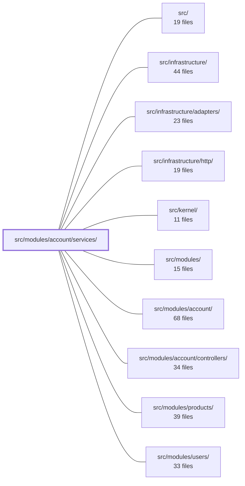

---
tags:
  - 2brain
  - 2brain/module
  - project/boilerplate-node-backend
type: module
module: src/modules/account/services/
files: 11
updated: 2026-09-27T16:18:29.452883+00:00
---

# src/modules/account/services/

## Purpose

The service layer of the account module. It owns all account-level business logic: proving identity (auth flows), maintaining a profile, managing non-password tokens, orchestrating two-factor authentication, resolving OAuth identities, verifying emails, sweeping stale tokens, and assembling the GDPR data export. Controllers above it stay thin; sibling modules never import each other's services directly.

## Key parts

- **Identity & sessions** — `authentication.ts` (signup, login, logout, refresh rotation, session revocation), `tokens.ts` (reset/verification/delete/refresh token lifecycle; single source of truth for expiry, hashing, spend/redeem), `token-cleanup.ts` (expired-token sweep, both fire-and-forget and admin-triggered), `profile.ts` (password change, self-deletion, profile reads).
- **Two-factor** — `two-factor.ts` (enroll, remove, backup-code regeneration, verification sequence, `buildLoginChallenge`); delegates method-specific logic to handlers registered under `../two-factor/registry`.
- **OAuth** — `oauth.ts` resolves a provider identity to a user document (login / link / signup) and handles role assignment, audit, and analytics. Sits above the provider mechanics in `../oauth/`.
- **Email verification** — `verification.ts` — single entry point for issuing + dispatching verification tokens for both existing-address proof and `pendingEmail` changes.
- **GDPR export** — `export.ts` assembles the final JSON envelope; `personal-data-registry.ts` holds the in-memory list of `PersonalDataSection` entries that sibling modules register so this module can read their data without importing them.
- **Cross-cutting glue** — `mail.ts` (one-function wrapper over `enqueueEmail` to satisfy the "side-effects live in the service layer" rule); `index.ts` (barrel that re-exports everything as `accountService` and `twoFactorService` namespaces, keeping 2FA types out of the 1FA call-surface).

## How it connects

- **`src/modules/account/controllers/`** — the primary caller. Controllers (e.g. `post-login-2fa.ts`, the confirm controllers, the export endpoint) invoke the functions exported through `index.ts`. The service layer deliberately stops short of minting sessions or issuing 2FA challenges in OAuth; those steps live in the controller that orchestrates the full response.
- **`src/modules/account/`** (parent) — the service layer consumes sibling sub-directories such as `../oauth/` (provider adapters) and `../two-factor/registry` (method handlers) for lower-level mechanics, while owning the account-level decision logic.
- **`src/infrastructure/` / `src/infrastructure/adapters/`** — `mail.ts` wraps `enqueueEmail` (an infrastructure adapter) so that the "one layer for side-effects" rule is satisfied without any controller or non-service file touching the mail queue directly.
- **`src/modules/products/`, `src/modules/users/`** (and any other enabled module) — each registers a `PersonalDataSection` into `personal-data-registry.ts` at bootstrap, allowing `export.ts` to collect their data without a direct import. This is the same isolation pattern as the locales translatables registry.
- **`src/kernel/`** — provides the shared abstractions (document models, error types, audit helpers) that the service functions operate on.

## Where to start

1. **`index.ts`** — read the barrel first to see the full surface area and the deliberate `accountService` / `twoFactorService` split; it doubles as a table of contents for the module.
2. **`authentication.ts`** — the file with the most moving parts (signup → login → refresh → revoke) and the clearest statement of what the service layer does and explicitly does *not* do (credential hashing, JWT signing, password changes). Tracing one login call through it will anchor every other file in this directory.

## Connected modules

[[boilerplate-node-backend_ROOT|/ (repository root)]] · [[boilerplate-node-backend_src|src/]] · [[boilerplate-node-backend_src_infrastructure|src/infrastructure/]] · [[boilerplate-node-backend_src_infrastructure_adapters|src/infrastructure/adapters/]] · [[boilerplate-node-backend_src_infrastructure_http|src/infrastructure/http/]] · [[boilerplate-node-backend_src_kernel|src/kernel/]] · [[boilerplate-node-backend_src_modules|src/modules/]] · [[boilerplate-node-backend_src_modules_account|src/modules/account/]] · [[boilerplate-node-backend_src_modules_account_controllers|src/modules/account/controllers/]] · [[boilerplate-node-backend_src_modules_products|src/modules/products/]] · [[boilerplate-node-backend_src_modules_users|src/modules/users/]]

## Files
- `src/modules/account/services/authentication.ts` — Handles the full "proving who you are" flow: signup, login, password-reset token issuance, account-deletion token issuance, session revocation, logout, and refresh-token rotation. It is the write-path for everything that issues or revokes a token on a user document. Deliberately excluded: credential hashing (model pre-save hook), JWT signing (`../session/jwt`), and password *changes* (`./profile`).
- `src/modules/account/services/export.ts` — Implements the `POST /account/export` service (GDPR Art. 15/20): assembles the caller's personal data from every registered `PersonalDataSection` into a single JSON envelope. It deliberately has no data reads of its own—each section's shape is produced by the owning module's `collect`, keeping this file decoupled from sibling modules.
- `src/modules/account/services/index.ts` — Service-layer barrel for the account module. It re-exports functions from the sub-module files (`authentication`, `profile`, `verification`, `tokens`, `token-cleanup`, `oauth`, `two-factor`) into two named-namespace objects—`accountService` and `twoFactorService`—and also re-exports a curated set of individual functions for callers that need only one or two names. The split into two objects is deliberate: 2FA is kept separate so that a caller of, say, `accountService.login` has no TypeScript-level coupling to two-factor.
- `src/modules/account/services/mail.ts` — A single-function service-layer wrapper around `enqueueEmail`. It exists purely to satisfy the layering rule that all `enqueueEmail` calls originate from the service layer (enforced by `tests/cross-cutting/side-effects-have-one-layer.test.ts`). It is deliberately kept as its own one-function file — not folded into a larger service — so that `two-factor/methods/email.ts`, which is not itself a service, can import a mail-sending capability without pulling in an unrelated service's full surface.
- `src/modules/account/services/oauth.ts` — Resolves an `OAuthIdentity` (provider + providerId) to a `UserDocument` via one of three mutually exclusive outcomes: **login** (identity already linked), **link** (email matches an existing verified account, new provider attached), or **signup** (fresh password-less account created). Sits one layer above the provider mechanics in `../oauth/` and handles the account-level decisions: security checks, role assignment, audit, and analytics. It does **not** mint sessions or issue 2FA challenges — that is the callback controller's job.
- `src/modules/account/services/personal-data-registry.ts` — A module-scoped, in-memory store for the list of `PersonalDataSection` entries. It exists because the `account` module cannot import sibling modules to collect their manifest entries (the same isolation wall that constrains `@modules/locales/services/translatables.ts`), so the sections must be supplied from outside once the full set of enabled modules is known.
- `src/modules/account/services/profile.ts` — Service layer for the "maintain my own account" side of the account module: reading the caller's profile, changing the password (via reset link or with current-password verification), and self-deleting the account. It is deliberately split from `./authentication` on the proving-vs-maintaining boundary—authentication answers "who is this," this file answers "change something about the account I'm already in."
- `src/modules/account/services/token-cleanup.ts` — Sweeps expired (and rotated-away) entries from the `tokens` array across all user documents. Exposes two entry points: a fire-and-forget pre-flight step run on every login/refresh request, and an admin-triggered action behind `DELETE /account/tokens/expired` that returns an HTTP outcome and writes an audit record.
- `src/modules/account/services/tokens.ts` — Single owner of every non-password token flow on a user account (reset, verification, delete-confirmation, refresh sessions). Defines what "live" means in one place and exposes find / spend / redeem primitives plus the `GET /account/sessions` listing. Keeping the semantics here means `two-factor.ts` and the four confirm controllers all agree on expiry, hashing, and race-handling without duplicating the rules.
- `src/modules/account/services/two-factor.ts` — Implements the account-level 2FA lifecycle: enrolling a method, removing it, regenerating backup codes, and verifying a code (from any armed method or the backup list) against a live account. Method-specific logic lives in handlers registered under `../two-factor/registry`; this file owns the cross-cutting concerns—entry loading order, verification sequence, the `twoFactorEnabledAt` flag, and when backup codes are minted or discarded. It also builds the login challenge (`buildLoginChallenge`) and verifies it, stopping short of minting a session (that belongs to `../controllers/post-login-2fa.ts`).
- `src/modules/account/services/verification.ts` — Centralises email-verification token issuance and mail dispatch for two distinct flows that must not drift: proving the address an account already has (signup, explicit re-send) and proving the address a `PUT/PATCH /account` change has requested (`pendingEmail`). Every flow that starts either kind calls this module and nothing else.

---
[[boilerplate-node-backend_INDEX|← boilerplate-node-backend index]]
