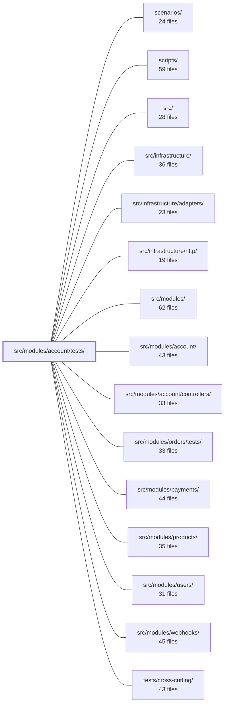

---
tags:
    - 2brain
    - 2brain/module
    - project/boilerplate-node-backend
type: module
module: src/modules/account/tests/
files: 27
updated: 2026-09-23T20:36:06.453726+00:00
---

# src/modules/account/tests/

## Purpose

The test suite for the account module, organised into three tiers — **unit**, **integration**, and **contract** — that collectively lock down the security invariants (token lifecycles, rate-limit budgets, enumeration resistance, middleware ordering) and the observable API behaviour (self-service endpoints, OAuth round-trips, ability publishing) that the rest of the system and its clients depend on.

## Key parts

- **Contract tests** (`contract/`)
    - `abilities.test.ts` — asserts the published CASL rules match what the server actually enforces, catching policy drift.
    - `api.contract.test.ts` — scenario-level API tests for profile, password, session, and email-verification endpoints that require specific pre-existing state.
    - `oauth.contract.test.ts` — full start → callback OAuth round-trip against real routes, cookies, and the `fake` provider.

- **Integration tests** (`integration/`) — run against a real database via `setupTestDb`.
    - `service.test.ts` / `service-flows.test.ts` — security invariants (indistinguishable login failures, no plaintext passwords, soft-delete auth) and the ordinary signup/login/token/password flows those invariants sit on.
    - `self-service.test.ts` — profile-update, password-change, and email-verification invariants at the service/repository layer.
    - `jwt.test.ts` / `session-jwt.test.ts` (unit counterpart) — access-token statelessness vs. refresh-token statefulness, revocation, and key-ring rotation.
    - `identity-rate-limit.test.ts` — the three budget dimensions (identity, IP, address-block) and MFA-challenge limiter, verified both in isolation and on live routes.
    - `oauth-link.test.ts` — the three `loginOrCreateFromOAuth` branches (link, email-match, new signup).
    - `persisted-locale.test.ts` / `probes.test.ts` — locale capture/fallback/edit and machine-checked HTTP probe status codes.

- **Unit tests** (`unit/`) — collaborators mocked or stubbed; focus on pure logic and security invariants.
    - **Session & tokens** — `session-jwt.test.ts`, `tokens.test.ts`, `key-ring.test.ts`, `token-cleanup.test.ts`, `token-cleanup-job.test.ts`.
    - **OAuth** — `oauth-state.test.ts` (CSRF/PKCE math), `oauth-google.test.ts`, `oauth-github.test.ts`, `oauth-providers.test.ts` (registry visibility).
    - **Routing & rate-limiting** — `routes.test.ts` (middleware ordering, `noStore` placement), `rate-limits.test.ts` (budget ordering).
    - **Misc invariants** — `cookies.test.ts` (flag correctness), `delete-account.test.ts` (enumeration prevention), `emails.test.ts` (template/copy accuracy), `two-factor.test.ts` (TOTP/backup-code/delivered-code), `audit.test.ts` (wire-contract action strings).

## How it connects

- **`src/modules/account/`** — the code under test: controllers, services, session helpers, OAuth providers, rate-limiters, and routes all live here; every file in this directory exercises some slice of that surface.
- **`src/modules/users/`** — the account service performs identity lookups, `$push` into `oauthAccounts`, and user-document writes; `session-jwt.test.ts` explicitly replaces (not drives) `@modules/users` to isolate token logic, while `oauth-link.test.ts` and `service-flows.test.ts` run against the real users store.
- **`tests/support/`** — provides the `setupTestDb` helper used by every integration and most contract tests to spin up a real database.
- **`tests/cross-cutting/`** — a cross-cutting suite asserts the _shape_ of audit-action constants across all modules; `unit/audit.test.ts` here pins the _specific values_ for the account domain.
- **`src/infrastructure/http/`** — contract and integration tests hit the real HTTP layer (routing, cookie handling, response headers) that this infrastructure module provides.
- **`scenarios/`** — the `fake` OAuth provider activated via `enableDemoProfile()` gives contract tests a deterministic end-to-end OAuth path without external network calls.

## Where to start

1. **`unit/routes.test.ts`** — it encodes the security architecture of the account router (middleware ordering, cache directives, public-vs-authenticated boundaries) in a single readable file, giving you the map of _what_ the other tests are guarding.
2. **`integration/service-flows.test.ts`** — it walks the four core flows (signup, login, tokenAdd, passwordChange) against a real database, so you see the happy-path shape that the invariant tests in `service.test.ts` and the unit suite are designed to defend.

## Connected modules

[[boilerplate-node-backend_scenarios|scenarios/]] · [[boilerplate-node-backend_scripts|scripts/]] · [[boilerplate-node-backend_src|src/]] · [[boilerplate-node-backend_src_infrastructure|src/infrastructure/]] · [[boilerplate-node-backend_src_infrastructure_adapters|src/infrastructure/adapters/]] · [[boilerplate-node-backend_src_infrastructure_http|src/infrastructure/http/]] · [[boilerplate-node-backend_src_modules|src/modules/]] · [[boilerplate-node-backend_src_modules_account|src/modules/account/]] · [[boilerplate-node-backend_src_modules_account_controllers|src/modules/account/controllers/]] · [[boilerplate-node-backend_src_modules_orders_tests|src/modules/orders/tests/]] · [[boilerplate-node-backend_src_modules_payments|src/modules/payments/]] · [[boilerplate-node-backend_src_modules_products|src/modules/products/]] · [[boilerplate-node-backend_src_modules_users|src/modules/users/]] · [[boilerplate-node-backend_src_modules_webhooks|src/modules/webhooks/]] · [[boilerplate-node-backend_tests_cross-cutting|tests/cross-cutting/]] · … and 2 more

## Files

- `src/modules/account/tests/contract/abilities.test.ts` — Contract test for `GET /account/abilities`. It verifies that the endpoint publishes the _same_ rules the server enforces, by unpacking the wire payload with CASL's own `unpackRules` and asserting specific allow/deny decisions per role and scope. The goal is to catch drift between server-side policy and what a client can actually act on — not to assert response shape.
- `src/modules/account/tests/contract/api.contract.test.ts` — Contract tests for the self-service `/account` API surface (profile update, password change, session management, email verification). They target scenario-level branches that require specific state — a second account holding the email, a revoked cookie, a spent one-time token — which random-payload unit sweeps cannot produce. Assertions check concrete values (IDs, messages, cookie attributes), not just lengths or status codes.
- `src/modules/account/tests/contract/oauth.contract.test.ts` — Contract tests for the OAuth surface (`GET /account/oauth/providers`, `GET /account/oauth/:provider`, and the full start → callback round-trip). They exercise the real routes, real CSRF/PKCE cookies, and a real database via the `fake` provider (enabled through `enableDemoProfile()`), mirroring what a Cypress spec would verify against a browser.
- `src/modules/account/tests/integration/identity-rate-limit.test.ts` — Integration tests verifying that the account module's rate limiters enforce three independent budget dimensions — identity (submitted email), single address (IP), and address block (IPv4 /24 or IPv6 /64) — and that the MFA-challenge limiter correctly keys by challenge or falls back to the caller's block. The tests exercise the limiters in isolation (via trivial handlers) and also confirm they are actually mounted on the real `/account/signup` and `/account/reset` routes.
- `src/modules/account/tests/integration/jwt.test.ts` — Integration test suite for the JWT session lifecycle in `session/jwt.ts`. It exercises the full round-trip of access and refresh token creation, verification, and revocation against a real database, guarding the security-critical contract that access tokens are stateless (signature + expiry only) while refresh tokens are stateful (checked against the user document so that logout can actually end a session).
- `src/modules/account/tests/integration/oauth-link.test.ts` — Integration test for `loginOrCreateFromOAuth` (from `services/oauth.ts`), covering its three branches — already-linked login, email-match link, and new signup. Runs against a real test database because the logic performs identity lookups, an `oauthAccounts` `$push`, and a user insertion that pure unit tests cannot exercise.
- `src/modules/account/tests/integration/persisted-locale.test.ts` — Integration tests verifying that the `locale` field on the user document is (1) captured from the request language at signup, (2) falls back to the boot default outside a request, (3) editable after signup via the users service, (4) unaffected by partial updates that omit it, and (5) serialised to the client as part of the public `User` contract.
- `src/modules/account/tests/integration/probes.test.ts` — Integration test that verifies each HTTP probe defined in `account/probes.ts` actually returns the status code its own name claims (e.g. a probe named _"Probe: 409 on a signup that already exists"_ must genuinely yield 409). It exists so the probe definitions shipped in generated API-client collections are machine-checked against the running app rather than trusted by their description alone.
- `src/modules/account/tests/integration/self-service.test.ts` — Integration tests for the self-service account surface (profile update, password change, email verification, session revocation) exercised at the service/repository layer. Tests are grouped by the invariant each one defends: a profile update cannot alter role/state/password; a wrong current password yields 422 (never 401, which would kill a valid session); and at most one verification link is active, always the newest.
- `src/modules/account/tests/integration/service-flows.test.ts` — Integration tests for the four ordinary flows of `accountService` — signup, login, `tokenAdd`, and `passwordChange` — exercising both the success paths and the argument-level rejections in front of them. Drives a **real database** via `setupTestDb`. Lives here (not under `users`) because the code under test is `account`'s service. A sibling `service.test.ts` covers the security invariants; this file covers the paths those invariants sit on.
- `src/modules/account/tests/integration/service.test.ts` — Integration tests that verify the **security invariants** of the account service (signup, login, password change, bulk token removal). Tests are grouped by the invariant each defends rather than by function — e.g., the two login failure paths must be indistinguishable, a soft-deleted account must not authenticate, and a password must never be stored in plaintext. Each case is designed to survive a regression that a happy-path assertion alone would miss.
- `src/modules/account/tests/unit/audit.test.ts` — Unit test that pins the exact string values of every account-domain audit action constant. The strings are a **wire contract** consumed by dashboards and alert rules outside this repository, so renaming a key or changing a value silently breaks external tooling. A cross-cutting test elsewhere verifies only the _shape_ (uniqueness, lower snake_case) across all modules; this file is where the account owner asserts the actual values.
- `src/modules/account/tests/unit/cookies.test.ts` — Unit tests for the four auth-cookie helpers in `session/cookies.ts`. Each test locks down a security invariant: `jwt` must be `httpOnly` (stealable = account takeover), `isAuth` must _not_ be (frontend reads it), `secure` must track `NODE_ENV`, and destroy calls must repeat the exact flags used at creation or the browser silently keeps the cookie alive.
- `src/modules/account/tests/unit/delete-account.test.ts` — Unit tests for the two-step account-deletion controllers (`deleteAccountRequest`, `deleteAccountConfirm`) at the wiring level. All collaborators are mocked; the file's core job is to **pin the enumeration-prevention invariant** (unknown email → 200, spent/unknown/expired token → identical 422) and to verify the controller's error-routing and metric-emission paths without exercising mail or database logic.
- `src/modules/account/tests/unit/emails.test.ts` — Unit tests for the six account email builders in `emails.ts`. Because the builders produce data (template names, URLs, i18n copy) rather than throwing on misconfiguration, the tests assert on the _built content itself_—correct template key, correct `frontendLink` kind, resolved copy, and correct interpolation—rather than on error paths.
- `src/modules/account/tests/unit/key-ring.test.ts` — Unit tests for the pure key-identification math in `key-ring.ts`. Covers the two exported helpers (`keyId` and `keyForId`) that `jwt.ts` relies on to map a token's `kid` claim to the correct secret, ensuring no accidental key collisions, no positional dependence, and no silent fallback to the newest key.
- `src/modules/account/tests/unit/oauth-github.test.ts` — Unit tests for the GitHub OAuth provider. Verifies that `isOAuthProviderConfigured` reflects environment state, that `authorizeUrl` produces a correct GitHub consent URL (client id, redirect, state, PKCE), and that `exchangeCode` correctly maps GitHub's three-API-call token exchange into a normalized identity — including error paths (missing `id`, unverified email, no primary email, token-exchange failure, hung requests).
- `src/modules/account/tests/unit/oauth-google.test.ts` — Unit tests for the Google OAuth provider. They verify the authorization-URL construction, the "is this provider configured" gate, and the full set of claim validations (`aud`, `iss`, `exp`, `sub`) performed during code-to-token exchange. `fetch` is stubbed throughout because the network boundary belongs to the provider under test, not to this file.
- `src/modules/account/tests/unit/oauth-providers.test.ts` — Unit tests for the OAuth provider registry's visibility logic (which providers are listed/resolved given the current environment) and for the `fake` provider's authorize/exchange round-trip. The file deliberately tests "which providers show up at all," not per-provider token-exchange parsing (that belongs to separate test files for Google and GitHub).
- `src/modules/account/tests/unit/oauth-state.test.ts` — Unit tests for the pure functions in `oauth/state.ts` that implement the OAuth 2.0 CSRF state parameter and the PKCE (RFC 7636) code-verifier / code-challenge handshake. Cookie plumbing is deliberately excluded here (covered by integration/contract suites); this file verifies the comparison logic, token shape, entropy, and determinism in isolation.
- `src/modules/account/tests/unit/rate-limits.test.ts` — Unit tests that pin the **ordering relationships** among the account module's rate-limit budgets (credential, signup, reset, MFA) without asserting any single absolute value. They exist to catch configuration regressions where a sub-budget accidentally exceeds or collapses into the one it was layered beneath.
- `src/modules/account/tests/unit/routes.test.ts` — Unit tests that verify the **middleware arrangement** of the account router — the security-critical ordering and presence of guards, rate limiters, cache directives, and upload handlers that TypeScript cannot type-check. Each assertion encodes a specific security invariant (e.g., "limiter before auth", "noStore above every route", "token-bearing routes stay public") so that regressions in `routes.ts` are caught at the router level rather than at the HTTP-header level.
- `src/modules/account/tests/unit/session-jwt.test.ts` — Unit test suite for the JWT token layer (`session/jwt.ts`). Asserts the security invariants that keep the layer safe: access/refresh secrets never cross-verify, refresh tokens are only valid while still stored in the user document, `jwtid: randomUUID()` prevents same-second mutual revocation, and the signing-key ring rotates without mass-logging-out existing tokens. `@modules/users` is replaced (not driven) so the suite tests token logic in isolation.
- `src/modules/account/tests/unit/token-cleanup-job.test.ts` — Unit tests for the `runTokenCleanup` scheduled job and its admin-triggered counterpart `adminTokenCleanup`. Because the job runs unattended, its log output is the only operator-visible signal; every assertion therefore targets `logger.info` / `logger.error` calls rather than return values, and the success/failure branches are verified as mutually exclusive.
- `src/modules/account/tests/unit/token-cleanup.test.ts` — Unit test suite that verifies the `runTokenCleanup` pre-flight sweep is invoked at the correct point in the `postLogin` and `getRefreshToken` controller flows: it must run **before** credential/token validation, and it must be **skipped** in the refresh flow when no `jwt` cookie is present (since such a request cannot succeed, and a full-table user sweep would be wasted work).
- `src/modules/account/tests/unit/tokens.test.ts` — Unit tests for the token-configuration module (`session/config.ts`). They verify that every env-var-backed setting—JWT lifetimes, signing-secret rings, and the grace/reuse-window boot check—parses correctly, falls back to safe defaults, and never yields `NaN` or `undefined` in a way that would silently produce broken sessions.
- `src/modules/account/tests/unit/two-factor.test.ts` — Unit tests for the pure (database-free) layers of the two-factor authentication module. Covers TOTP secret encryption round-trip, TOTP code verification with fixed clocks, backup-code generation/hash, and the shared delivered-code machinery (arm, consume, TTL, cooldown, attempt ceiling) that sits behind email and any future delivery channel.

---

[[boilerplate-node-backend_INDEX|← boilerplate-node-backend index]]
