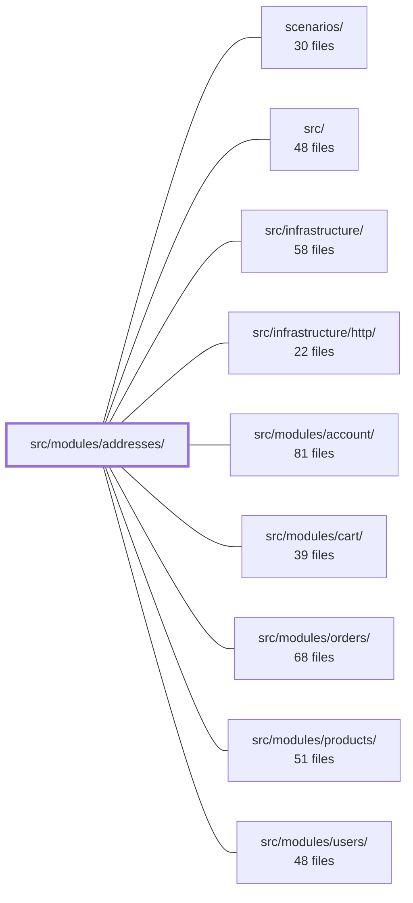

---
tags:
  - 2brain
  - 2brain/module
  - project/boilerplate-node-backend
type: module
module: src/modules/addresses/
files: 21
updated: 2026-10-01T14:26:12.804887+00:00
---

# src/modules/addresses/

## Purpose

The addresses module implements a per-user address book: CRUD over a list of shipping/billing addresses, enforcement of the "exactly one default" invariant, PII encryption at rest, and a public wire format that other modules (primarily cart at checkout) can consume to resolve the shipping destination.

## Key parts

- **HTTP surface** — `routes.ts` defines the Express router (mounted at `/account`); the `controllers/` directory holds one thin adapter per verb (`get-addresses`, `post-address`, `update-address`, `delete-address`, `put-address-default`). Each extracts auth context and delegates to the service; none contain domain logic.
- **Service & repository** — `service.ts` translates controller intents into repository calls and shapes the `AddressesView` response. `repository.ts` owns read-modify-write access to the Mongoose document, enforces the single-default invariant, and wraps PII encryption/decryption so callers always see plaintext.
- **Persistence model** — `model.ts` defines the Mongoose schema (one document per user, array of sub-document entries each with its own `_id`). `pii.ts` centralises per-field encrypt/decrypt for the six PII columns.
- **Module wiring & contract** — `module.ts` registers routes, personal-data lifecycle hooks, and locale path with the app kernel. `index.ts` is the sole public import surface (strategic-DDD boundary). `openapi.yaml` is the API contract. `presenter.ts` and `factories.ts` handle view-shaping and test-fixture construction respectively.
- **Tests** — `tests/unit/` pins the schema shape, factory output, and route/middleware contract. `tests/integration/` verifies cross-cutting invariants (single default, cross-tenant 404, checkout resolution, PII round-trip).

## How it connects

- **`src/modules/cart/`** — The only sibling consumer. Cart's checkout resolver calls into this module (via the `index.ts` barrel) to fetch the default or a named address when the user has not pinned one explicitly at checkout.
- **`src/modules/users/`** — Triggers this module's `personalData.erase` hook (registered in `module.ts`) when an account is deleted, causing the address document to be hard-deleted.
- **`src/modules/account/`** — The addresses router is mounted alongside the account router under the same `/account` prefix; `account` does not import `addresses` directly—`cart` and `users` go through this module's barrel instead.
- **`src/infrastructure/http/`** — Provides the Express app, auth middleware, and no-cache guards that `routes.ts` applies per-route.
- **`src/modules/orders/`** — Indirectly coupled: an order's shipping address is resolved from this module at checkout time before the order is created.

## Where to start

1. **`service.ts`** — Reading this first gives you the full request-to-response flow (intent → repository → `AddressesView`) and makes the invariant handling visible in one place.
2. **`openapi.yaml`** — A compact, normative description of every endpoint, the default-address rule, and the module's public contract; pairs naturally with the service code to close the loop.

## Connected modules

[[boilerplate-node-backend_ROOT|/ (repository root)]] · [[boilerplate-node-backend_scenarios|scenarios/]] · [[boilerplate-node-backend_src|src/]] · [[boilerplate-node-backend_src_infrastructure|src/infrastructure/]] · [[boilerplate-node-backend_src_infrastructure_http|src/infrastructure/http/]] · [[boilerplate-node-backend_src_modules_account|src/modules/account/]] · [[boilerplate-node-backend_src_modules_cart|src/modules/cart/]] · [[boilerplate-node-backend_src_modules_orders|src/modules/orders/]] · [[boilerplate-node-backend_src_modules_products|src/modules/products/]] · [[boilerplate-node-backend_src_modules_users|src/modules/users/]]

## Files
- `src/modules/addresses/controllers/delete-address.ts` — Thin HTTP adapter for `DELETE /account/addresses/:addressId`. Extracts the authenticated user ID and target address ID from the request, delegates all business logic to the `addressRemove` service, and translates the result into an Express response.
- `src/modules/addresses/controllers/get-addresses.ts` — Express controller that handles `GET /account/addresses`. It is a thin HTTP adapter: it extracts the caller's id from the auth context, delegates to the service layer, and serialises the result. It exists to separate transport concerns (Express request/response) from domain logic in the addresses service.
- `src/modules/addresses/controllers/post-address.ts` — HTTP handler for `POST /account/addresses`. Validates the request body, delegates to the address service, and shapes the JSON response. It is the "create" half of the address-book CRUD set (sibling files handle read, update, delete).
- `src/modules/addresses/controllers/put-address-default.ts`
- `src/modules/addresses/controllers/update-address.ts` — Defines the two HTTP handlers for `/account/addresses/:addressId` — a full **PUT** (replace) and a partial **PATCH** (merge) — by calling the shared `createUpdateController` factory once and destructuring the two resulting handlers.
- `src/modules/addresses/factories.ts` — Builds address-book fixtures (the row shape passed to `addressBookRepository.create`) from a small set of caller-supplied overrides. The file exists to centralise the mapping from a domain-level `Address` (with a string `id`) into the Mongoose document shape (`_id` as `ObjectId`) so callers never assemble the persistence object by hand.
- `src/modules/addresses/index.ts` — Public barrel (module facade) for the **Addresses** module. It is the _only_ import surface a sibling module is allowed to use, enforcing the strategic-DDD boundary described in `docs/theory/strategic-ddd.md` §5. It re-exports the service's values and the model's types so consumers never reach into sub-paths directly.
- `src/modules/addresses/model.ts` — Defines the Mongoose schema and model for a user's address book: one document per user (keyed by `userId`), holding an array of address entries as subdocuments. The design intentionally gives each entry its own `_id` so two entries with identical fields are still distinct ("home" vs. "office"), in contrast to cart/wishlist line items which are identified by their content.
- `src/modules/addresses/module.ts` — Registers the **addresses** module with the application kernel: declares its HTTP routes, personal-data lifecycle hooks, and locale path. It exists as a standalone module so that `cart` (the only sibling consumer) and `users` (via the `personalData.erase` hook) never need to import `account` to reach address data.
- `src/modules/addresses/openapi.yaml` — OpenAPI 3.0.3 contract for the **addresses** module. It specifies the REST surface for managing a per-user address book (list, add, replace, patch, remove) and encodes the module's core invariant: a non-empty book always has exactly one entry flagged `default`, which is the slot checkout ships to when no explicit `addressId` is supplied.
- `src/modules/addresses/pii.ts` — Centralizes per-field PII encryption and decryption for address-book entries (`fullName`, `street`, `city`, `zip`, `country`, `phone`). It exists so `./repository` can encrypt whole entries on write and decrypt them on read without duplicating six-field logic at each call site.
- `src/modules/addresses/presenter.ts`
- `src/modules/addresses/repository.ts` — Read-modify-write repository for a user's address book. It owns the full CRUD surface (find, add, update, remove, hard-delete), enforces the "exactly one default" invariant across the entire `items` array, and handles PII encryption on write / decryption on read so that every caller sees plaintext.
- `src/modules/addresses/routes.ts` — Defines the Express router for the address-book CRUD endpoints. It is mounted at `/account` alongside the account module's own router (see `module.ts`) and wires each HTTP verb to a thin controller, guarded by auth and no-cache middleware.
- `src/modules/addresses/service.ts` — Service layer for the address book. It translates controller intents into repository calls, maps stored documents to the public `AddressesView` wire format, and wraps results in standardized success/reject responses. All endpoints answer the whole book (never a single entry) because the "exactly one default" invariant is a property of the list.
- `src/modules/addresses/tests/integration/addresses.test.ts` — Integration test suite for the address book module. It verifies four cross-cutting invariants: (1) a non-empty book always has exactly one default, (2) another user's entry is indistinguishable from a non-existent one (404), (3) the checkout resolver's three-way answer (default, named, or absent) and its failure modes, and (4) PII fields are stored encrypted and round-trip correctly through the repository.
- `src/modules/addresses/tests/integration/checkout.test.ts`
- `src/modules/addresses/tests/integration/fixtures.ts`
- `src/modules/addresses/tests/unit/factories.test.ts` — Unit tests for the `makeAddressBook` fixture builder. Verifies that the factory produces address-book documents with correct `ObjectId` handling, proper omission of absent optional fields, and faithful pass-through of deliverable fields — ensuring test fixtures seeded into the DB are edit- and delete-able.
- `src/modules/addresses/tests/unit/routes.test.ts` — Unit test that pins the addresses router's contract: the exact set of endpoints (and their order), the middleware/guards applied at the router level and per-route, and the absence of middleware that must not be present. It exists to catch silent regressions where a route is reordered, a guard is dropped, or an unwanted cache/rate-limit middleware sneaks in.
- `src/modules/addresses/tests/unit/schema-contract.test.ts` — Unit test that pins the public contract of `addressBookSchema` — its required fields, indexes, defaults, references, and the shape of its `items` sub-document — so that schema drift is caught in CI. It mirrors the structure of the cart and wishlist schema-contract tests while asserting the one way the address book differs: its line items keep an Mongoose `_id`.

---
[[boilerplate-node-backend_INDEX|← boilerplate-node-backend index]]
