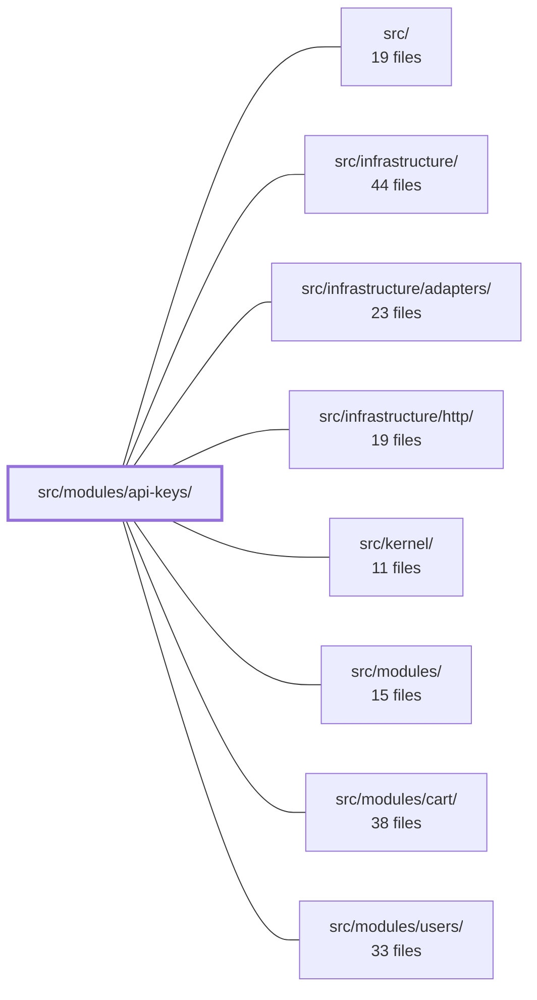

---
tags:
  - 2brain
  - 2brain/module
  - project/boilerplate-node-backend
type: module
module: src/modules/api-keys/
files: 18
updated: 2026-09-27T16:19:02.746622+00:00
---

# src/modules/api-keys/

## Purpose

This module owns the full lifecycle of machine-to-machine (M2M) API-key credentials: minting, listing, and revoking them for human-admin operations, and resolving a presented `sk_…` bearer token into a request-scoped `Caller` at authentication time. It enforces the invariant that a credential's permissions are always a subset of the minter's *current* ability set, re-evaluated on every use.

## Key parts

- **Credential mechanics** — `credentials.ts` (mint / parse / SHA-256-verify), `model.ts` (Mongoose schema; only the hash is stored), `repository.ts` (CRUD plus active-key lookup by prefix, `lastUsedAt` stamp, bulk delete by owner).
- **Service layer** — `services/api-keys.ts` (tenant-scoped list/mint/revoke with permission checks and audit logging), `services/resolver.ts` (parses a presented token, verifies it, re-floors the minter's permissions into a `Caller`), `services/index.ts` (stable barrel export).
- **HTTP surface** — `routes.ts` (Express router for `GET/POST /api-keys` and `DELETE /api-keys/:id`), `controllers/` (three thin handlers: `list-api-keys.ts`, `mint-api-key.ts`, `revoke-api-key.ts`), `openapi.yaml` (3.0.3 contract).
- **Module wiring** — `module.ts` (manifest: routes, permission keys, personal-data hooks, and the deferred registration of the credential resolver into the kernel), `index.ts` (public barrel enforcing the module boundary), `audit.ts` (type-only augmentation of the app-wide `AuditActionMap`).
- **Tests** — `tests/unit/` (credential hashing, schema shape), `tests/contract/` (response conformance to `openapi.yaml`), `tests/integration/` (real-DB enforcement of mint-time subset and use-time re-flooring, revocation, expiry, cascading delete).

## How it connects

- **`src/kernel/`** — `module.ts` registers the `sk_…` credential resolver into `kernel/authentication.ts` at registration time (not import time), making the resolver part of the kernel's authentication pipeline without side effects on import.
- **`src/infrastructure/`** — `repository.ts` delegates to the shared `createRepository` CRUD factory; the HTTP controllers and router rely on the infrastructure HTTP layer for middleware, response shaping, and session/permission middleware.
- **`src/modules/users/`** — the resolver re-derives the minter's *current* permission set from the users module's ability data on every token verification; admin-route permission checks (`apikeys.any.*`) are also evaluated against that ability set.
- **`src/modules/`** (sibling boundary) — `index.ts` is the only file other modules may import from, per the strategic-DDD boundary rule; sibling modules like `cart` interact with the api-keys module solely through this barrel.

## Where to start

Read **`credentials.ts`** first to understand the token format, the one-way hashing, and why bcrypt/argon2 are intentionally omitted. Then read **`services/resolver.ts`** to see how a presented token becomes a request-scoped `Caller` with re-floored permissions — that single file captures the security model the rest of the module exists to protect.

## Connected modules

[[boilerplate-node-backend_ROOT|/ (repository root)]] · [[boilerplate-node-backend_src|src/]] · [[boilerplate-node-backend_src_infrastructure|src/infrastructure/]] · [[boilerplate-node-backend_src_infrastructure_adapters|src/infrastructure/adapters/]] · [[boilerplate-node-backend_src_infrastructure_http|src/infrastructure/http/]] · [[boilerplate-node-backend_src_kernel|src/kernel/]] · [[boilerplate-node-backend_src_modules|src/modules/]] · [[boilerplate-node-backend_src_modules_cart|src/modules/cart/]] · [[boilerplate-node-backend_src_modules_users|src/modules/users/]]

## Files
- `src/modules/api-keys/audit.ts` — Declares the audit-action vocabulary for the API-keys module (mint and revoke) and registers it into the app-wide `AuditActionMap` type via TypeScript module augmentation. The file contains no runtime logic — it exists so that the two credential-lifecycle events carry a strongly-typed, discoverable action identifier wherever the audit logger is invoked.
- `src/modules/api-keys/controllers/list-api-keys.ts` — HTTP controller for `GET /api-keys`. Returns the calling tenant's API-key credentials in newest-first order, with pagination. Secrets are never included in the response.
- `src/modules/api-keys/controllers/mint-api-key.ts` — HTTP controller for `POST /api-keys`. Validates the request body against a Zod schema, extracts the tenant/caller context, delegates to the API-keys service to mint a new credential, and shapes the HTTP response (201 on success, 422 on refusal).
- `src/modules/api-keys/controllers/revoke-api-key.ts` — Controller handler for `DELETE /api-keys/:id`. It performs a **revoke** — a soft state change on an API key credential — which is distinct from the soft/hard-delete triplet that the generic `createDeleteController` factory handles. Revoking an already-revoked key is idempotent (still returns 200).
- `src/modules/api-keys/credentials.ts` — Implements the one-way hashing half of the API-key credential lifecycle: minting a new high-entropy token, parsing the public prefix out of a presented token, and verifying a presented plaintext against a stored SHA-256 digest. Deliberately avoids bcrypt/argon2 because `randomBytes(32)` leaves no search space for a stretch function to exploit, so the per-request cost buys nothing.
- `src/modules/api-keys/index.ts` — Barrel (public surface) for the `api-keys` module. Sibling modules are only permitted to import from this file, enforcing the module boundary defined in `docs/theory/strategic-ddd.md` §5. It re-exports the service API and the type definitions so consumers never reach into the module's internals.
- `src/modules/api-keys/model.ts` — Defines the Mongoose schema and model for the `apikeys` collection — one document per minted machine-to-machine credential. The file is the single source of truth for the credential's shape, indexes, and wire serialization, and enforces the invariant that the secret itself is never persisted (only its sha256 hash).
- `src/modules/api-keys/module.ts` — The module manifest (entry point) for the **api-keys** module. It declares the module's routes, permission keys, and personal-data lifecycle hooks, and—crucially—wires the `sk_…` bearer-token credential resolver into the kernel at registration time (not import time) so that merely importing the file does not silently enable M2M authentication app-wide.
- `src/modules/api-keys/openapi.yaml` — OpenAPI 3.0.3 contract for the api-keys module. Defines the three machine-to-machine credential endpoints (list, mint, revoke), their request/response schemas, and the envelope wrappers that the module's runtime must produce.
- `src/modules/api-keys/repository.ts` — Data-access layer for the `apikeys` collection. It wraps the shared `createRepository` CRUD factory and adds three domain-specific queries that the generic factory cannot express: active-key resolution by prefix, a fire-and-forget `lastUsedAt` stamp, and bulk deletion by owner.
- `src/modules/api-keys/routes.ts` — Defines the Express router for the `/api-keys` admin surface. It wires three CRUD-adjacent routes (list, mint, revoke) to their respective controllers and enforces that every request is session-authenticated by a human with the appropriate `apikeys.any.*` permission.
- `src/modules/api-keys/services/api-keys.ts` — Implements the credential CRUD operations (list, mint, revoke) for the API-keys module. Every function is tenant-scoped through `context.caller.tenantId`, validates permissions against the caller's current ability set, and records audit events on state-changing actions. This file is the service layer that the module's route handlers call into.
- `src/modules/api-keys/services/index.ts` — Barrel file for the `api-keys` module's service layer. It gives controllers and the module index a single, stable import surface (`apiKeysService`) rather than exposing the individual CRUD functions directly, and it re-exports the credential resolver under a domain-specific name.
- `src/modules/api-keys/services/resolver.ts` — Implements the credential-resolution logic for `sk_…` API-key bearer tokens. Given a presented token, it parses, verifies, and re-derives the minter's **current** permissions to produce a fully-floored `Caller`. The result is registered into `kernel/authentication.ts` by `module.ts` at import time, making this file the single runtime path through which machine-to-machine credentials become a request-scoped identity.
- `src/modules/api-keys/tests/contract/api-keys.test.ts` — Contract tests for the `/api-keys` admin surface (list, mint, revoke). Each response is asserted both for expected status/body **and** for conformance to the bundled `openapi.yaml` via `toSatisfyApiSpec()`. Credentials minted here are intentionally _not_ reused against other routes in this file; cross-cutting usage lives in `tests/cross-cutting/`.
- `src/modules/api-keys/tests/integration/api-keys.test.ts` — Integration test suite (real database, no mocked repository) that proves the two enforcement halves of "a credential holds a subset of the minter's permissions, never more": the mint-time subset check in `services/api-keys.ts` and the use-time re-flooring in `module.ts`'s `CredentialResolver`. It also covers revocation, expiry, hard-delete cascading, and the `touchLastUsed` stamp path.
- `src/modules/api-keys/tests/unit/credentials.test.ts` — Unit tests for the one-way hashing half of the API-key credential lifecycle: minting, parsing, verifying, and formatting. Each test exercises a single exported function from `credentials.ts` in isolation, covering both happy paths and rejection/edge cases.
- `src/modules/api-keys/tests/unit/schema-contract.test.ts` — Unit test that pins the **declarative contract** of `apiKeySchema` — which fields are `required`, which indexes exist with which options, and which fields are intentionally _absent_ (lifecycle timestamps). It exists because integration tests that only insert valid documents cannot catch a silently dropped `required`, a `unique` constraint removed from `publicPrefix`, or a new index sneaking in; this file asserts the schema's shape in isolation.

---
[[boilerplate-node-backend_INDEX|← boilerplate-node-backend index]]
