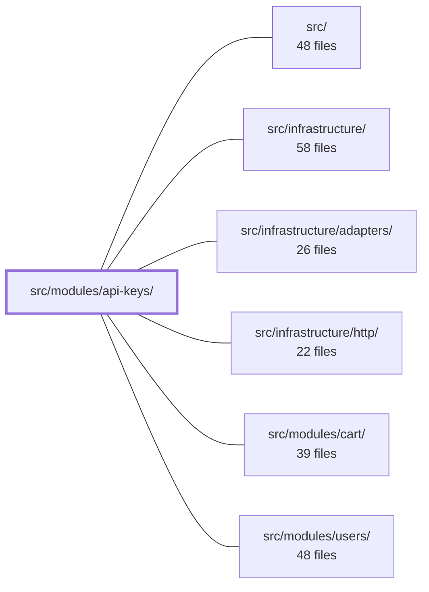

---
tags:
  - 2brain
  - 2brain/module
  - project/boilerplate-node-backend
type: module
module: src/modules/api-keys/
files: 19
updated: 2026-10-01T14:26:26.931812+00:00
---

# src/modules/api-keys/

## Purpose

The `api-keys` module owns the full lifecycle of machine-to-machine credentials: minting a high-entropy `sk_…` token, listing and revoking existing keys, and resolving a presented bearer token back into a fully-floored caller identity. It enforces a strict module boundary (consumers import only from the barrel) and guarantees that the secret itself is never persisted—only its SHA-256 digest.

## Key parts

- **Credential core** — `credentials.ts` handles minting, prefix parsing, and one-way verification; `model.ts` defines the Mongoose schema and the invariant that no plaintext secret is stored; `repository.ts` adds domain-specific queries (active-key lookup by prefix, `lastUsedAt` stamping, bulk delete-by-owner) on top of the shared CRUD factory.
- **Service layer** — `services/api-keys.ts` performs tenant-scoped list/mint/revoke with permission checks and audit logging; `services/resolver.ts` is the single runtime path that turns a presented `sk_…` token into a request-scoped `Caller` with re-floored permissions; `services/index.ts` is the stable import surface for both.
- **HTTP surface** — `routes.ts` mounts the `/api-keys` admin routes; `controllers/` contains the three thin handlers (list, mint, revoke) that validate input and delegate to the service.
- **Module wiring** — `module.ts` is the manifest: it declares routes, permission keys, personal-data hooks, and registers the credential resolver into the kernel at registration time. `index.ts` is the public barrel that sibling modules must import from.
- **Audit & contract** — `audit.ts` contributes the strongly-typed `mint`/`revoke` action identifiers to the app-wide `AuditActionMap`; `openapi.yaml` is the OpenAPI 3.0.3 contract that contract tests assert against.
- **Tests** — split into unit (credential hashing, schema shape), integration (enforcement halves, revocation, expiry, cascading), and contract (status/body + `toSatisfyApiSpec()` conformance).

## How it connects

- **`src/infrastructure/` & `src/infrastructure/adapters/`** — `repository.ts` wraps the shared `createRepository` CRUD factory, and the audit actions declared in `audit.ts` are consumed by the infrastructure-level audit logger.
- **`src/infrastructure/http/`** — `routes.ts` builds on the shared Express router and response-envelope utilities; controllers rely on the infrastructure's error-serialization and pagination conventions.
- **`src/modules/users/`** — `services/resolver.ts` re-derives the minter's *current* permission set from the users module at resolution time, so a revoked user or changed role is reflected immediately in every subsequent M2M request.
- **Repository root** — `index.ts` enforces the module-boundary rule defined in `docs/theory/strategic-ddd.md` §5; `audit.ts` augments a root-level `AuditActionMap` type via TypeScript module augmentation.

## Where to start

1. **`services/api-keys.ts`** — reading the three CRUD functions first gives you the domain invariants (tenant scoping, permission subset check, audit events) before you look at any HTTP plumbing.
2. **`services/resolver.ts`** — understanding how a presented token becomes a `Caller` clarifies the security model (one-way hash, re-flooring, idempotent revocation) that the rest of the module is designed around.

## Connected modules

[[boilerplate-node-backend_ROOT|/ (repository root)]] · [[boilerplate-node-backend_src|src/]] · [[boilerplate-node-backend_src_infrastructure|src/infrastructure/]] · [[boilerplate-node-backend_src_infrastructure_adapters|src/infrastructure/adapters/]] · [[boilerplate-node-backend_src_infrastructure_http|src/infrastructure/http/]] · [[boilerplate-node-backend_src_modules_cart|src/modules/cart/]] · [[boilerplate-node-backend_src_modules_users|src/modules/users/]]

## Files
- `src/modules/api-keys/audit.ts` — Declares the audit-action vocabulary for the API-keys module (mint and revoke) and registers it into the app-wide `AuditActionMap` type via TypeScript module augmentation. The file contains no runtime logic — it exists so that the two credential-lifecycle events carry a strongly-typed, discoverable action identifier wherever the audit logger is invoked.
- `src/modules/api-keys/controllers/list-api-keys.ts` — HTTP controller for `GET /api-keys`. Returns the calling tenant's API-key credentials in newest-first order, with pagination. Secrets are never included in the response.
- `src/modules/api-keys/controllers/mint-api-key.ts` — HTTP controller for `POST /api-keys`. Validates the request body against a Zod schema, extracts the tenant/caller context, delegates to the API-keys service to mint a new credential, and shapes the HTTP response (201 on success, 422 on refusal).
- `src/modules/api-keys/controllers/revoke-api-key.ts` — Controller handler for `DELETE /api-keys/:id`. It performs a **revoke** — a soft state change on an API key credential — which is distinct from the soft/hard-delete triplet that the generic `createDeleteController` factory handles. Revoking an already-revoked key is idempotent (still returns 200).
- `src/modules/api-keys/credentials.ts` — Implements the one-way hashing half of the API-key credential lifecycle: minting a new high-entropy token, parsing the public prefix out of a presented token, and verifying a presented plaintext against a stored SHA-256 digest. Deliberately avoids bcrypt/argon2 because `randomBytes(32)` leaves no search space for a stretch function to exploit, so the per-request cost buys nothing.
- `src/modules/api-keys/index.ts` — Barrel (public surface) for the `api-keys` module. Sibling modules are only permitted to import from this file, enforcing the module boundary defined in `docs/theory/strategic-ddd.md` §5. It re-exports the service API and the type definitions so consumers never reach into the module's internals.
- `src/modules/api-keys/model.ts` — Defines the Mongoose schema and model for the `apikeys` collection — one document per minted machine-to-machine credential. The file is the single source of truth for the credential's shape, indexes, and wire serialization, and enforces the invariant that the secret itself is never persisted (only its sha256 hash).
- `src/modules/api-keys/module.ts` — The module manifest (entry point) for the **api-keys** module. It declares the module's routes, permission keys, and personal-data lifecycle hooks, and—crucially—wires the `sk_…` bearer-token credential resolver into the kernel at registration time (not import time) so that merely importing the file does not silently enable M2M authentication app-wide.
- `src/modules/api-keys/openapi.yaml` — OpenAPI 3.0.3 contract for the api-keys module. Defines the three machine-to-machine credential endpoints (list, mint, revoke), their request/response schemas, and the envelope wrappers that the module's runtime must produce.
- `src/modules/api-keys/presenter.ts`
- `src/modules/api-keys/repository.ts` — Data-access layer for the `apikeys` collection. It wraps the shared `createRepository` CRUD factory and adds three domain-specific queries that the generic factory cannot express: active-key resolution by prefix, a fire-and-forget `lastUsedAt` stamp, and bulk deletion by owner.
- `src/modules/api-keys/routes.ts` — Defines the Express router for the `/api-keys` admin surface. It wires three CRUD-adjacent routes (list, mint, revoke) to their respective controllers and enforces that every request is session-authenticated by a human with the appropriate `apikeys.any.*` permission.
- `src/modules/api-keys/services/api-keys.ts` — Implements the credential CRUD operations (list, mint, revoke) for the API-keys module. Every function is tenant-scoped through `context.caller.tenantId`, validates permissions against the caller's current ability set, and records audit events on state-changing actions. This file is the service layer that the module's route handlers call into.
- `src/modules/api-keys/services/index.ts` — Barrel file for the `api-keys` module's service layer. It gives controllers and the module index a single, stable import surface (`apiKeysService`) rather than exposing the individual CRUD functions directly, and it re-exports the credential resolver under a domain-specific name.
- `src/modules/api-keys/services/resolver.ts` — Implements the credential-resolution logic for `sk_…` API-key bearer tokens. Given a presented token, it parses, verifies, and re-derives the minter's **current** permissions to produce a fully-floored `Caller`. The result is registered into `kernel/authentication.ts` by `module.ts` at import time, making this file the single runtime path through which machine-to-machine credentials become a request-scoped identity.
- `src/modules/api-keys/tests/contract/api-keys.test.ts` — Contract tests for the `/api-keys` admin surface (list, mint, revoke). Each response is asserted both for expected status/body **and** for conformance to the bundled `openapi.yaml` via `toSatisfyApiSpec()`. Credentials minted here are intentionally _not_ reused against other routes in this file; cross-cutting usage lives in `tests/cross-cutting/`.
- `src/modules/api-keys/tests/integration/api-keys.test.ts` — Integration test suite (real database, no mocked repository) that proves the two enforcement halves of "a credential holds a subset of the minter's permissions, never more": the mint-time subset check in `services/api-keys.ts` and the use-time re-flooring in `module.ts`'s `CredentialResolver`. It also covers revocation, expiry, hard-delete cascading, and the `touchLastUsed` stamp path.
- `src/modules/api-keys/tests/unit/credentials.test.ts` — Unit tests for the one-way hashing half of the API-key credential lifecycle: minting, parsing, verifying, and formatting. Each test exercises a single exported function from `credentials.ts` in isolation, covering both happy paths and rejection/edge cases.
- `src/modules/api-keys/tests/unit/schema-contract.test.ts` — Unit test that pins the **declarative contract** of `apiKeySchema` — which fields are `required`, which indexes exist with which options, and which fields are intentionally _absent_ (lifecycle timestamps). It exists because integration tests that only insert valid documents cannot catch a silently dropped `required`, a `unique` constraint removed from `publicPrefix`, or a new index sneaking in; this file asserts the schema's shape in isolation.

---
[[boilerplate-node-backend_INDEX|← boilerplate-node-backend index]]
