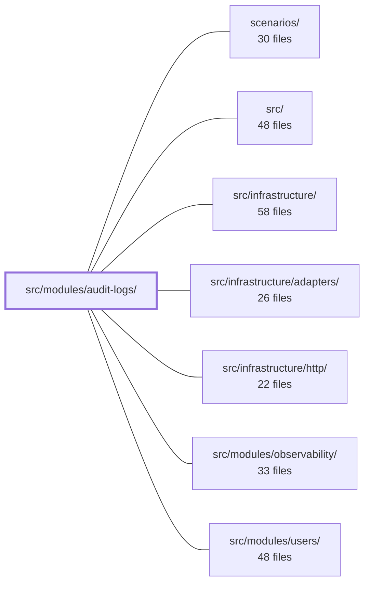

---
tags:
  - 2brain
  - 2brain/module
  - project/boilerplate-node-backend
type: module
module: src/modules/audit-logs/
files: 15
updated: 2026-10-01T14:26:39.747368+00:00
---

# src/modules/audit-logs/

## Purpose

The audit-logs module owns the **read-only, append-only trail of tenant actions**. It is the persistence sink that receives audit events emitted by the platform (via the observability audit logger) and the read path behind the tenant-facing `GET /audit` endpoint. It enforces immutability (no update/delete), configurable retention via a Mongo TTL index, and a deliberate fail-open policy on writes so that a database outage never blocks business operations.

## Key parts

- **Data layer** — `model.ts` (Mongoose schema, indexes, TTL, serialization) and `repository.ts` (append-and-read only; `create` + `search` with a `since` helper; no mutation methods).
- **Business logic** — `service.ts`: the single persistence sink called by the observability module's `emitAuditEvent`. Exposes `record` (fail-open, swallows write errors into a log line) and `search` (fail-closed, propagates errors). Applies scope, sort, and pagination policies.
- **HTTP surface** — `routes.ts` (Express router, tenant-key auth, `audit.any.read` permission gate) and `controllers/get-audit.ts` (the single `GET /audit` handler).
- **Module wiring** — `module.ts` (manifest: name, base path, routes, permissions, personal-data hook; `onRegistered` hook wires the persistence sink so `emitAuditEvent` calls land in this collection) and `index.ts` (barrel export; sibling modules must import through this file only).
- **Config & observability** — `config.ts` (module-level settings, e.g. retention days) and `metrics.ts` (Prometheus counter for entries that reached the compliance log but failed to persist — the signal for the fail-open path).
- **API contract** — `openapi.yaml` (OpenAPI 3.0.3 spec for `GET /audit` and shared component schemas).
- **Tests** — `tests/contract/` (wire-contract lock on the endpoint), `tests/integration/` (repository against in-memory Mongo), `tests/unit/` (retention config, schema shape, service failure contracts).

## How it connects

- **`src/modules/observability/`** — The primary producer. The observability audit logger decides *what* to record and calls into this module's `service.record`. The observability module also exposes a platform-wide `GET /observability/audit` endpoint that reads through the same `auditLogService.search`, differing only in authentication scope (platform key vs. tenant key).
- **`src/modules/users/`** — Provides the tenant-identity and role-permission primitives that `routes.ts` uses to authenticate the caller and enforce the `audit.any.read` gate.
- **`src/infrastructure/http/`** — Supplies the Express router utilities and middleware pipeline that `routes.ts` builds on.
- **`src/infrastructure/`** (adapters, etc.) — Underlying MongoDB connection and observability/logging facilities consumed by the model and service.
- **`scenarios/`** — End-to-end test scenarios that exercise the audit-log endpoints as part of broader platform flows.

## Where to start

1. **`service.ts`** — Reading this first makes the module's two asymmetric contracts (fail-open `record`, fail-closed `search`) and its position between the repository and controllers immediately clear.
2. **`module.ts`** — Shows how the module declares its identity, registers its routes, and wires the persistence sink, giving a newcomer the "how it all plugs together" picture before diving into any single file.

## Connected modules

[[boilerplate-node-backend_ROOT|/ (repository root)]] · [[boilerplate-node-backend_scenarios|scenarios/]] · [[boilerplate-node-backend_src|src/]] · [[boilerplate-node-backend_src_infrastructure|src/infrastructure/]] · [[boilerplate-node-backend_src_infrastructure_adapters|src/infrastructure/adapters/]] · [[boilerplate-node-backend_src_infrastructure_http|src/infrastructure/http/]] · [[boilerplate-node-backend_src_modules_observability|src/modules/observability/]] · [[boilerplate-node-backend_src_modules_users|src/modules/users/]]

## Files
- `src/modules/audit-logs/config.ts`
- `src/modules/audit-logs/controllers/get-audit.ts` — Single-export controller that handles `GET /audit`, returning a filtered, paginated list of the tenant's own action-history entries. It mirrors the read path used by the `observability` module's `getObservabilityAuditLogs`, differing only in authentication scope (tenant key vs. platform key) — both ultimately query the same collection via `auditLogService`.
- `src/modules/audit-logs/index.ts` — Public barrel (single import surface) for the audit-logs module. Sibling modules must import only through this file rather than reaching into `service.ts` or `model.ts` directly, enforcing the strategic DDD encapsulation rule.
- `src/modules/audit-logs/metrics.ts` — Defines the domain-owned Prometheus counter for the audit-logs module. The counter tracks audit entries that made it into the compliance log but failed to persist into the queryable trail, giving operators a signal for the deliberate fail-open path in `record()`.
- `src/modules/audit-logs/model.ts` — Mongoose schema, model, and serialization transform for the persisted audit-log collection. It is the durable half of the audit pipeline: the logger in `@infrastructure/observability/audit` decides *what* to record, and this file defines the shape, indexes, TTL, and read-path serialization so `GET /observability/audit` can answer "what has actor X done" from the API.
- `src/modules/audit-logs/module.ts` — Module manifest for the read-only audit trail. It declares the module's identity (name, base path, routes, locales, permissions, personal-data hook) and, via its `onRegistered` hook, wires the persistence sink so that `emitAuditEvent` calls flow into this module's collection. The module provides two read surfaces: `GET /audit` (own shop, gated on `audit.any.read`) and, through the observability module, `GET /observability/audit` (platform-wide).
- `src/modules/audit-logs/openapi.yaml` — OpenAPI 3.0.3 contract for the **audit-logs** module. It declares the single `GET /audit` endpoint (shop-scoped, role-gated action history) and the component schemas that endpoint—and the shared `POST /account/export` route—reference. It exists so consumers and code-gen tools have a machine-readable, module-local contract without reaching into another module's spec.
- `src/modules/audit-logs/repository.ts` — Append-and-read repository for audit log entries. It exposes only `create` and `search` (plus a `since` scope helper), deliberately omitting update and delete to enforce immutability at the type level. Record expiry is delegated to a Mongo TTL index defined on the model, not handled here.
- `src/modules/audit-logs/routes.ts` — Defines the Express router for the tenant-facing `GET /audit` endpoint. It exposes a shop's own action history, restricted to roles that hold the `audit.any.read` permission (a tenant key, not a platform-operator key). The file exists to wire authentication, credential-type validation, and permission gating in front of the single audit-reading controller.
- `src/modules/audit-logs/service.ts` — The audit-log service. It is the persistence sink that the observability audit module calls when an entry is emitted, and the read path behind two HTTP endpoints: `GET /observability/audit` (platform operator) and `GET /audit` (tenant staff, gated on `audit.any.read`). It sits between the domain model/repository and the controllers, applying collection-specific policies (scope, sort, pagination) that don't belong in the generic repository.
- `src/modules/audit-logs/tests/contract/audit.test.ts` — Contract tests for the single route this module exposes — `GET /audit`. Covers authentication, role-based authorization, query-parameter filtering, and response-shape validation against the API spec. Exists to lock the observable behavior of the endpoint so refactors inside the module cannot silently change the wire contract.
- `src/modules/audit-logs/tests/integration/repository.test.ts` — Integration tests for `auditLogRepository` run against an in-memory MongoDB instance. They verify `create`, `search` (filtering, `since` semantics, pagination metadata, serialization), and a deep-paging scenario that fails against any implementation that caps reads instead of truly paginating.
- `src/modules/audit-logs/tests/unit/retention.test.ts` — Unit test that verifies the audit-log collection's TTL index is configured with the correct `expireAfterSeconds` value derived from the `NODE_AUDIT_RETENTION_DAYS` environment variable, including the 90-day default used when the variable is unset.
- `src/modules/audit-logs/tests/unit/schema-contract.test.ts` — Contract tests that lock down the Mongoose schema for audit-log entries: which fields are required, which fields are restricted to closed enum sets, which Mongoose options are set (`timestamps`, `bufferCommands`), and which indexes exist with what options (including the single TTL index). The file exists to make schema drift visible as a test failure rather than a silent production gap.
- `src/modules/audit-logs/tests/unit/service.test.ts` — Unit tests for `auditLogService` verifying its two intentionally asymmetric failure contracts: `record` is fail-open (swallows write failures into a log line, never throws) and `search` is fail-closed (propagates failures to the caller). The repository is mocked because a real one cannot be made to fail on demand.

---
[[boilerplate-node-backend_INDEX|← boilerplate-node-backend index]]
