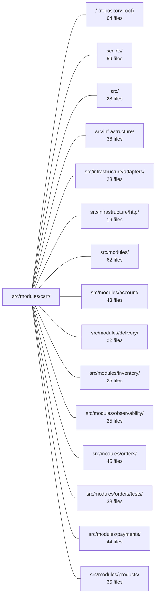

---
tags:
    - 2brain
    - 2brain/module
    - project/boilerplate-node-backend
type: module
module: src/modules/cart/
files: 37
updated: 2026-09-23T20:36:24.772560+00:00
---

# src/modules/cart/

## Purpose

The cart module owns the full lifecycle of a per-user shopping basket: reading, adding, updating, removing, and clearing line items; validating and executing a checkout into an order; and copying a prior order's lines back into the cart (reorder). It is a DDD bounded context that exposes a single service façade to the rest of the application while keeping its Mongoose model, repository, and HTTP wiring internal.

## Key parts

- **Domain rules** (`domain/`) — Pure, framework-free decision functions (`evaluateCheckout`, `basketWeight`) that answer "can this cart check out?" and "how much does it weigh?" with no side effects.
- **Service layer** (`services/`) — The business-logic core. `items.ts` handles all line-level CRUD (add, set-quantity, remove, clear); `checkout.ts` orchestrates the multi-step order placement with concurrency guards; `reorder.ts` copies an order's lines into the cart; `cleanup.ts` reacts to user/product deletion events; `view.ts` projects stored documents into API-ready shapes.
- **Controllers & routes** (`controllers/`, `routes.ts`) — Thin Express adapters that bridge HTTP to the service layer. `routes.ts` declares the full endpoint table, auth middleware, and the step-up re-authentication on checkout.
- **Persistence** (`model.ts`, `repository.ts`, `factories.ts`) — The Mongoose schema (one document per `userId`, TTL retention), the six write operations a cart needs, and a fixture factory for seeds/tests.
- **Module wiring & observability** (`module.ts`, `index.ts`, `analytics.ts`, `audit.ts`, `metrics.ts`) — Registers routes, events, permissions, and locale into the app registry; declares the typed analytics/audit event names and Prometheus counters owned by this module.
- **API contract** (`openapi.yaml`, `probes.ts`) — OpenAPI 3.0 spec plus concrete probe requests for edge cases the spec cannot express (404 bodies, zero-quantity rejection, catalogue-gate bypass).
- **Tests** (`tests/`) — Unit tests for domain rules, schema shape, retention, factories, and routes; integration tests for service mutations, stock reservation, and schema contracts; contract tests verifying every declared response envelope.

## How it connects

- **products** — Every single-product mutation in `items.ts` runs a catalogue gate (`productService.findPublicById`) to reject stale or private lines. `cleanup.ts` also reacts to product-deletion domain events to remove orphaned references.
- **orders** — `checkout.ts` is the only cart service that writes into the orders collection (via `placeOrder`). Conversely, `reorder.ts` reads an order's lines and writes them into the cart, preserving the one-way `cart → orders` dependency.
- **inventory** — Checkout reserves stock units (held, not sold) between order creation and payment. Domain rules cross-validate availability arithmetic against the inventory module's `availabilityOf`.
- **wishlist** — Shares the "move-to-cart" path; the schema boundary (cart lines carry `quantity`, wishlist lines do not) is pinned in the schema contract tests.
- **users** — The cart is addressed solely by `userId`; `cleanup.ts` handles permanent user deletion to prevent dangling references.
- **delivery / payments** — Checkout pre-flight validates shipping address and payment method before delegating to order placement.
- **observability** — Emits analytics events, audit actions, and Prometheus counters declared in `analytics.ts`, `audit.ts`, and `metrics.ts`; the observability module reads them from the shared registry.
- **infrastructure** — Uses the shared repository factory for CRUD and the HTTP adapter layer for middleware (auth, step-up, response-cache invalidation).
- **scripts / tests (root-level)** — Seed scripts consume `factories.ts`; cross-cutting and integration test suites at the repo root exercise cart endpoints end-to-end.

## Where to start

1. **`services/items.ts`** — This is the operational heart of the module. Reading its five public methods (`cartGetForView`, `cartItemAdd`, `cartItemUpdateQuantity`, `cartItemRemoveById`, `cartRemove`) shows the full read/write surface, the catalogue gate pattern, and the `ResponseSuccess | ResponseReject` envelope that every controller returns.
2. **`domain/rules.ts`** — A short, dependency-free file that makes the two core business questions explicit. It's the quickest way to understand _what_ the cart guarantees before touching the service or persistence layers.

## Connected modules

[[boilerplate-node-backend_ROOT|/ (repository root)]] · [[boilerplate-node-backend_scripts|scripts/]] · [[boilerplate-node-backend_src|src/]] · [[boilerplate-node-backend_src_infrastructure|src/infrastructure/]] · [[boilerplate-node-backend_src_infrastructure_adapters|src/infrastructure/adapters/]] · [[boilerplate-node-backend_src_infrastructure_http|src/infrastructure/http/]] · [[boilerplate-node-backend_src_modules|src/modules/]] · [[boilerplate-node-backend_src_modules_account|src/modules/account/]] · [[boilerplate-node-backend_src_modules_delivery|src/modules/delivery/]] · [[boilerplate-node-backend_src_modules_inventory|src/modules/inventory/]] · [[boilerplate-node-backend_src_modules_observability|src/modules/observability/]] · [[boilerplate-node-backend_src_modules_orders|src/modules/orders/]] · [[boilerplate-node-backend_src_modules_orders_tests|src/modules/orders/tests/]] · [[boilerplate-node-backend_src_modules_payments|src/modules/payments/]] · [[boilerplate-node-backend_src_modules_products|src/modules/products/]] · … and 6 more

## Files

- `src/modules/cart/analytics.ts` — Declares the analytics event names emitted by the cart module and registers them into the application-wide `AnalyticsEventMap` via TypeScript module augmentation. It exists so that event-name strings live alongside the code that emits them, keeping the global catalogue self-documenting and typed.
- `src/modules/cart/audit.ts` — Declares the audit action names the cart module emits and registers them into the app-wide `AuditActionMap` via TypeScript module augmentation. The actions exist to create an auditable trail of customer-initiated cart mutations (item removal, bulk reorder) that serve as the authoritative record for support disputes about cart contents.
- `src/modules/cart/controllers/delete-cart-all.ts` — Thin HTTP adapter that handles the `DELETE /cart/all` endpoint. It delegates to `cartService.cartRemove` to remove every item from the authenticated user's cart. It lives on a dedicated URL (not `DELETE /cart`) so that a missing or stripped request body can never accidentally trigger a full cart wipe.
- `src/modules/cart/controllers/delete-cart-item.ts` — Single exported controller that handles both `DELETE /cart/:productId` (canonical) and `DELETE /cart` (alias) by delegating to `cartService.cartItemRemoveById`. It resolves `productId` from whichever surface the route provides, validates it, and returns the updated cart or an appropriate HTTP error.
- `src/modules/cart/controllers/get-cart-summary.ts` — Thin HTTP controller for the `GET /cart/summary` endpoint. It extracts the authenticated user's ID, delegates to `cartService.cartGetForBadge`, and sends back only the `summary` portion of the result. All business logic lives in the service layer; this file exists solely to bridge the HTTP boundary.
- `src/modules/cart/controllers/get-cart.ts` — Thin HTTP adapter that exposes the current user's cart over `GET /cart`. It exists solely to bridge the Express request/response cycle to `cartService.cartGetForView`, keeping business logic in the service layer.
- `src/modules/cart/controllers/post-cart.ts` — Thin HTTP adapter that handles `POST /cart`. It validates the incoming request body, extracts the caller identity, and delegates the actual "add-or-replace cart line" logic to `cartService.cartItemAdd`. The controller itself contains no business rules; eligibility checks live in the service layer so they stay consistent across `PUT /cart/{productId}` and the wishlist's move-to-cart path.
- `src/modules/cart/controllers/post-checkout.ts` — Thin HTTP adapter for `POST /cart/checkout`. It validates the request body, delegates to `cartService.orderConfirm`, records the `cart_checkout_total` metric on every outcome, and on success transforms the resulting order document into its wire shape before sending a `201` response.
- `src/modules/cart/controllers/post-reorder.ts` — Thin HTTP adapter for `POST /cart/reorder/:orderId`. Translates the Express request into a call to `cartService.reorderIntoCart`, then maps the result (or refusal) back to an HTTP response. Exists so the route layer stays declarative and the business logic stays in the service.
- `src/modules/cart/controllers/put-cart-item.ts` — Thin HTTP adapter that handles `PUT /cart/:productId`. It validates the incoming request, extracts the product ID and desired quantity, and delegates the actual cart-mutation logic to `cartService.cartItemUpdateQuantity`. Exists to keep Express plumbing (parsing, auth, error mapping) separate from cart domain logic.
- `src/modules/cart/domain/index.ts` — Barrel entry point for the cart domain layer. It re-exports the pure business rules so that consumers can import from a stable, framework-free path without reaching into individual rule files.
- `src/modules/cart/domain/rules.ts` — Pure decision logic for the cart: given cart lines already joined to their products, it answers two questions — _can this cart check out?_ and _how much does it weigh?_ — returning structured verdicts with no status codes, i18n, or side effects. The service layer (`services/checkout.ts`) maps those verdicts into HTTP responses.
- `src/modules/cart/factories.ts` — Factory for building cart fixtures ready to pass to `cartRepository.create`. It centralises the string-to-`ObjectId` conversion and the partial-document shape so that seed scripts and test setup don't each re-implement that logic. A cart is addressed solely by its owner (`userId`); no separate cart `_id` is produced here.
- `src/modules/cart/index.ts` — Public barrel file for the Cart module. It is the **only** import surface available to sibling modules (enforced by the strategic DDD boundary rule in `docs/theory/strategic-ddd.md` §5). It re-exports the service, domain, and type-level model APIs while deliberately keeping the repository and the model's runtime implementation internal, so sibling modules cannot bypass the service's business rules.
- `src/modules/cart/metrics.ts` — Declares the domain-owned Prometheus counters for the cart module. Metrics live here (rather than in `infrastructure`) so the module is the single source of truth for what it tracks; the overview endpoint reads them from the shared registry without needing to import this file.
- `src/modules/cart/model.ts` — Defines the Mongoose schema and model for the per-user cart document (one document per `userId`, stored in Mongo as the sole durable copy). It establishes the stored shape, validation bounds, indexes (including TTL-based retention), and the serialization transform that the repository layer needs for lean reads.
- `src/modules/cart/module.ts` — Module manifest for the shopping cart. Registers the cart's routes, domain-event subscriptions, permission keys, personal-data collection, and locale path into the application's module registry so the cart participates in the app's lifecycle without the rest of the codebase needing to know its internals.
- `src/modules/cart/openapi.yaml` — OpenAPI 3.0.3 contract for the cart module. Defines the full REST surface for reading, mutating, and checking out a user's cart, and serves as the single source of truth that both the server implementation and API consumers (or generated clients) agree on.
- `src/modules/cart/probes.ts` — Declares the cart module's list of "probes" — concrete API requests that the OpenAPI contract can describe but cannot express on its own (e.g., a 404-earning body, a forbidden zero quantity, a catalogue-gate bypass). These probes are consumed by the runnable-collections pipeline to exercise edge cases the spec alone cannot capture.
- `src/modules/cart/repository.ts` — The cart domain's repository layer. It wraps the standard CRUD provided by the shared repository factory with the six write operations a cart actually needs (line upsert/remove, full clear, version-guarded clear, and two cleanup writes), each keyed by `userId` since a unique index makes that a complete address.
- `src/modules/cart/routes.ts` — Express route table for all cart operations (view, add, update, remove, clear, checkout, reorder). It wires every route to its controller handler and applies the authentication/authorization middleware chain. The entire router sits behind `isAuth`; the checkout route adds step-up re-authentication, a module-specific permission, and response-cache invalidation.
- `src/modules/cart/services/checkout.ts` — The single cart operation that writes into the orders module's collection. It performs all pre-flight validation (payment method, address, shipping, stock, domain rules), delegates the actual order write to `placeOrder`, handles lost-race cleanup (retracting a briefly-created order on concurrent checkout), and emits analytics. It is the only cart service where a race can cost a customer money, so it carries explicit concurrency semantics.
- `src/modules/cart/services/cleanup.ts` — Domain-event handler entry points that other modules invoke when a user or product is permanently deleted. A cart holds references to a user and a product it does not own; without these handlers, stale references would remain after either entity disappears.
- `src/modules/cart/services/index.ts` — Barrel (index) file for the cart service folder. It aggregates the individual service sub-modules (`items`, `checkout`, `reorder`, `cleanup`) into a single entry point so that controllers and other modules can import one object (`cartService`) rather than reaching into each sub-file. The folder exists because the combined surface exceeded the ~300-line threshold described in `docs/theory/layers.md`.
- `src/modules/cart/services/items.ts` — Cart item read/write service. Provides the operations to read a user's cart lines, add or set quantities, remove a single line, or clear the entire cart. Every single-product mutation runs a catalogue gate (`productService.findPublicById`) and returns a `ResponseSuccess | ResponseReject` envelope; `cartRemove` is the exception — it is idempotent and returns a bare `CartView` because an already-empty cart is a valid success state.
- `src/modules/cart/services/reorder.ts` — Implements the "reorder" action: reads an existing order's line items and copies them back into the caller's cart. It lives in the cart module (not orders) because it _writes_ to the cart; the order is only read. Placing it here preserves the `cart → orders` dependency direction declared by the module manifests and avoids the cycle that a cart-reaching-into-orders path would create.
- `src/modules/cart/services/view.ts` — Cart projection layer: turns a stored `CartDocument` into the shapes callers read (joined lines, API response). Shared by the other three cart service files (`checkout`, `items`, `reorder`); none of them owns this module.
- `src/modules/cart/tests/contract/api.contract.test.ts` — Contract tests for every `/cart` route. All six endpoints share a single `CartResponseEnvelope` shape, making serialization drift easy to hide. The cart is built through real API calls (not fixtures) because `CartResponse` is a computed view, not a document serialization—hand-written fixtures would assert a shape the app never produces. The suite's goal is to guarantee each declared contract branch (200, 201, 404, 409, 422) is actually reached.
- `src/modules/cart/tests/integration/schema-contract.test.ts` — Integration test that verifies Mongoose schema-level declarations for the cart model (unique index, defaults, `required`, `select: false`) against a **real** MongoDB instance. It exists because these constraints live in the schema, not in repository logic, and would not be exercised by sibling transform tests.
- `src/modules/cart/tests/integration/service.test.ts` — Integration test suite for the cart service layer (`src/modules/cart/services/`). It exercises the highest-risk seam in the module — the shared private `upsertCartItem` behind `set` (absolute quantity via `$set`) and `add` (increment via `$inc`) — against a real MongoDB instance, because a mock cannot reproduce the guarded-write semantics of `cartRepository.upsertLine`. It also pins two contract invariants: the cart is a single per-user document with no per-line `_id`, and `CartItem` serialises to exactly `{ productId, quantity }` with no extra keys.
- `src/modules/cart/tests/integration/stock.test.ts` — Integration test suite for the reservation-based stock model. Verifies the core invariant that units are _held_ (reserved) between checkout and payment rather than _sold_, and are recoverable by cancellation or expiry sweep. Runs against a real MongoDB instance because the guarantees under test are conditional writes that a mock cannot demonstrate.
- `src/modules/cart/tests/unit/audit.test.ts` — Guards the cart audit action strings as a **wire contract**. These values are consumed by external log-query tooling and alert rules, not merely by in-repo consumers, so renaming a constant would compile cleanly yet silently break downstream observability. This test pins every value verbatim and uses whole-object equality to catch additions or removals of actions.
- `src/modules/cart/tests/unit/domain-rules.test.ts` — Pure unit tests for the cart domain rules (`evaluateCheckout` and `basketWeight`) in `rules.ts`. No mocks, no database — the rules are plain functions, so the tests call them directly with hand-built fixtures. A third describe block cross-validates the availability subtraction that `rules.ts` duplicates internally against the inventory module's `availabilityOf`, since the domain layer is not allowed to import a sibling module.
- `src/modules/cart/tests/unit/factories.test.ts` — Unit tests for the `makeCart` factory builder. They verify the factory's one critical transformation—converting string product/user IDs into real `Types.ObjectId` instances—and that it handles the absence vs. explicit empty-cart distinction correctly, ensuring seeded carts actually join against the catalogue rather than silently matching nothing.
- `src/modules/cart/tests/unit/retention.test.ts` — Unit test that verifies the cart collection's TTL (time-to-live) index is created with the correct `expireAfterSeconds` value derived from the `NODE_CART_RETENTION_DAYS` environment variable. Because the model reads that variable only once at import time, the test must force a fresh module evaluation for each scenario.
- `src/modules/cart/tests/unit/routes.test.ts` — Unit test that locks down the cart router's observable contract: the exact set of endpoints, their declaration order, per-route authorization, and caching behavior. It exists so that a future reordering or guard removal is caught immediately rather than in production.
- `src/modules/cart/tests/unit/schema-contract.test.ts` — Contract test that pins the exact shape, indexes, and options of `cartSchema`. It encodes the boundary between cart and wishlist (a cart line carries `quantity`; a wishlist line does not) and asserts that "one cart per user" is enforced by a unique index rather than application logic.

---

[[boilerplate-node-backend_INDEX|← boilerplate-node-backend index]]
