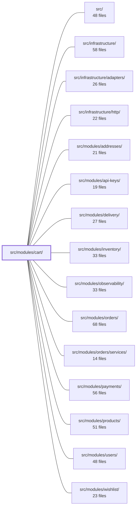

---
tags:
  - 2brain
  - 2brain/module
  - project/boilerplate-node-backend
type: module
module: src/modules/cart/
files: 39
updated: 2026-10-01T14:26:57.463280+00:00
---

# src/modules/cart/

## Purpose

The cart module owns a user's shopping basket: adding, removing, and re-quantifying line items, selecting a shipping method, and converting the basket into a placed order at checkout. It enforces the invariant of exactly one cart document per user (keyed by `userId`), keeps all business rules in a pure domain layer, and exposes a single service facade so that sibling modules never bypass validation.

## Key parts

- **HTTP boundary** — `routes.ts` declares the six `/cart` endpoints and their middleware chains (auth, idempotency, cache invalidation). The `controllers/` directory holds one thin adapter per endpoint; none contain business logic.
- **Service layer** (`services/`) — `items.ts` handles read/mutate operations; `checkout.ts` sequences the order-write-before-cart-clear race guard; `reorder.ts` copies a past order's lines into the current cart; `cleanup.ts` exposes external hooks for user/product deletion; `view.ts` (internal) performs the shared product-join projection. `services/index.ts` is the barrel that exposes a single `cartService` object.
- **Domain rules** (`domain/`) — Pure, framework-free validation (checkout eligibility, basket weight, shipping gating) that return typed verdicts without any HTTP or i18n coupling.
- **Persistence** — `model.ts` defines the Mongoose schema (one document per user, unique index on `userId`); `repository.ts` wraps the six write operations and bumps `__v` on every mutation for the checkout version guard.
- **Module wiring & public API** — `module.ts` registers routes, permissions, GDPR hooks, and domain-event subscriptions with the kernel. `index.ts` is the *only* import surface available to sibling modules, deliberately hiding the repository and model internals.
- **Observability** — `analytics.ts` and `audit.ts` register event/action names into app-wide TypeScript maps; `metrics.ts` declares the module's Prometheus counters.
- **Contract & tests** — `openapi.yaml` is the source of truth for client codegen; `probes.ts` lists edge-case requests the spec can't express. The `tests/` tree spans unit (domain rules, schema, factories, retention, routes), integration (service, stock, checkout-version, schema-contract), and contract (API shape vs. OpenAPI) levels.

## How it connects

- **products** — Every cart read performs a product join to compute line pricing and availability. Domain rules depend on the products module having resolved each line's `available` flag before they evaluate checkout eligibility. Checkout also invalidates the product cache.
- **orders** — Checkout *writes* a new order (the only cart→orders write). Reorder *reads* a past order's lines to repopulate the cart. This preserves the `cart → orders` dependency direction.
- **wishlist** — The wishlist module calls the cart service's `cartItemAdd` on its "move to cart" path, so eligibility checks stay consistent across both entry points.
- **users** — The cart is addressed solely by `userId`. The `cleanup` service is invoked by the users module when an account is permanently deleted.
- **inventory / payments** — Checkout coordinates stock reservation and payment-method validation before committing the order-write, then clears the cart only on success.
- **delivery / addresses** — The shipping-method endpoint and checkout pricing depend on the delivery module's rate calculation; address data flows through checkout.
- **infrastructure / observability** — Controllers sit on the shared Express adapter layer; metrics and audit events are published to the shared registry consumed by the observability module.

## Where to start

1. **`routes.ts`** — A single file that shows every endpoint, its auth level, and its middleware chain. Reading it first gives you the full API surface before diving into any controller or service.
2. **`services/items.ts`** — The core read/write logic (add, set, remove, clear, shipping). It shows how the service layer validates, writes via the repository, joins products, and returns the priced cart view—all without any Express or Mongoose leakage into the domain rules.

## Connected modules

```mermaid
flowchart LR
    m_src_modules_cart["src/modules/cart/"]
    m_src["src/<br/>48 files"]
    m_src_infrastructure["src/infrastructure/<br/>58 files"]
    m_src_infrastructure_adapters["src/infrastructure/adapters/<br/>26 files"]
    m_src_infrastructure_http["src/infrastructure/http/<br/>22 files"]
    m_src_modules_addresses["src/modules/addresses/<br/>21 files"]
    m_src_modules_api_keys["src/modules/api-keys/<br/>19 files"]
    m_src_modules_delivery["src/modules/delivery/<br/>27 files"]
    m_src_modules_inventory["src/modules/inventory/<br/>33 files"]
    m_src_modules_observability["src/modules/observability/<br/>33 files"]
    m_src_modules_orders["src/modules/orders/<br/>68 files"]
    m_src_modules_orders_services["src/modules/orders/services/<br/>14 files"]
    m_src_modules_payments["src/modules/payments/<br/>56 files"]
    m_src_modules_products["src/modules/products/<br/>51 files"]
    m_src_modules_users["src/modules/users/<br/>48 files"]
    m_src_modules_wishlist["src/modules/wishlist/<br/>23 files"]
    m_src_modules_cart --- m_src
    m_src_modules_cart --- m_src_infrastructure
    m_src_modules_cart --- m_src_infrastructure_adapters
    m_src_modules_cart --- m_src_infrastructure_http
    m_src_modules_cart --- m_src_modules_addresses
    m_src_modules_cart --- m_src_modules_api_keys
    m_src_modules_cart --- m_src_modules_delivery
    m_src_modules_cart --- m_src_modules_inventory
    m_src_modules_cart --- m_src_modules_observability
    m_src_modules_cart --- m_src_modules_orders
    m_src_modules_cart --- m_src_modules_orders_services
    m_src_modules_cart --- m_src_modules_payments
    m_src_modules_cart --- m_src_modules_products
    m_src_modules_cart --- m_src_modules_users
    m_src_modules_cart --- m_src_modules_wishlist
    style m_src_modules_cart stroke-width:3px
```

[[boilerplate-node-backend_ROOT|/ (repository root)]] · [[boilerplate-node-backend_src|src/]] · [[boilerplate-node-backend_src_infrastructure|src/infrastructure/]] · [[boilerplate-node-backend_src_infrastructure_adapters|src/infrastructure/adapters/]] · [[boilerplate-node-backend_src_infrastructure_http|src/infrastructure/http/]] · [[boilerplate-node-backend_src_modules_addresses|src/modules/addresses/]] · [[boilerplate-node-backend_src_modules_api-keys|src/modules/api-keys/]] · [[boilerplate-node-backend_src_modules_delivery|src/modules/delivery/]] · [[boilerplate-node-backend_src_modules_inventory|src/modules/inventory/]] · [[boilerplate-node-backend_src_modules_observability|src/modules/observability/]] · [[boilerplate-node-backend_src_modules_orders|src/modules/orders/]] · [[boilerplate-node-backend_src_modules_orders_services|src/modules/orders/services/]] · [[boilerplate-node-backend_src_modules_payments|src/modules/payments/]] · [[boilerplate-node-backend_src_modules_products|src/modules/products/]] · [[boilerplate-node-backend_src_modules_users|src/modules/users/]] · … and 1 more

## Files
- `src/modules/cart/analytics.ts` — Declares the analytics event names emitted by the cart module and registers them into the application-wide `AnalyticsEventMap` via TypeScript module augmentation. It exists so that event-name strings live alongside the code that emits them, keeping the global catalogue self-documenting and typed.
- `src/modules/cart/audit.ts` — Declares the audit action names the cart module emits and registers them into the app-wide `AuditActionMap` via TypeScript module augmentation. The actions exist to create an auditable trail of customer-initiated cart mutations (item removal, bulk reorder) that serve as the authoritative record for support disputes about cart contents.
- `src/modules/cart/config.ts`
- `src/modules/cart/controllers/delete-cart-all.ts` — Thin HTTP adapter that handles the `DELETE /cart/all` endpoint. It delegates to `cartService.cartRemove` to remove every item from the authenticated user's cart. It lives on a dedicated URL (not `DELETE /cart`) so that a missing or stripped request body can never accidentally trigger a full cart wipe.
- `src/modules/cart/controllers/delete-cart-item.ts` — Single exported controller that handles both `DELETE /cart/:productId` (canonical) and `DELETE /cart` (alias) by delegating to `cartService.cartItemRemoveById`. It resolves `productId` from whichever surface the route provides, validates it, and returns the updated cart or an appropriate HTTP error.
- `src/modules/cart/controllers/get-cart-summary.ts` — Thin HTTP controller for the `GET /cart/summary` endpoint. It extracts the authenticated user's ID, delegates to `cartService.cartGetForBadge`, and sends back only the `summary` portion of the result. All business logic lives in the service layer; this file exists solely to bridge the HTTP boundary.
- `src/modules/cart/controllers/get-cart.ts` — Thin HTTP adapter that exposes the current user's cart over `GET /cart`. It exists solely to bridge the Express request/response cycle to `cartService.cartGetForView`, keeping business logic in the service layer.
- `src/modules/cart/controllers/post-cart.ts` — Thin HTTP adapter that handles `POST /cart`. It validates the incoming request body, extracts the caller identity, and delegates the actual "add-or-replace cart line" logic to `cartService.cartItemAdd`. The controller itself contains no business rules; eligibility checks live in the service layer so they stay consistent across `PUT /cart/{productId}` and the wishlist's move-to-cart path.
- `src/modules/cart/controllers/post-checkout.ts` — HTTP adapter for `POST /cart/checkout`. It validates the request body, delegates to `cartService.orderConfirm` to convert the cart into an order, records the `cart_checkout_total` metric on every outcome (success, business-rejection, or thrown error), and shapes the success response via `orderService.withActions`.
- `src/modules/cart/controllers/post-reorder.ts` — Thin HTTP adapter for `POST /cart/reorder/:orderId`. Translates the Express request into a call to `cartService.reorderIntoCart`, then maps the result (or refusal) back to an HTTP response. Exists so the route layer stays declarative and the business logic stays in the service.
- `src/modules/cart/controllers/put-cart-item.ts` — Thin HTTP adapter that handles `PUT /cart/:productId`. It validates the incoming request, extracts the product ID and desired quantity, and delegates the actual cart-mutation logic to `cartService.cartItemUpdateQuantity`. Exists to keep Express plumbing (parsing, auth, error mapping) separate from cart domain logic.
- `src/modules/cart/controllers/put-cart-shipping-method.ts` — Thin HTTP adapter for `PUT /cart/shipping-method`. It validates the request body, delegates to the cart service to set (or clear with `null`) the shipping method, and returns the re-priced cart. Contains no business logic itself.
- `src/modules/cart/domain/index.ts` — Barrel file for the cart domain layer. It re-exports the public API of the domain (pure business rules and their associated types) from `./rules`, giving consumers a single import path while keeping the domain layer free of framework dependencies.
- `src/modules/cart/domain/rules.ts` — Pure cart-validation rules that take joined cart-line data and return a typed verdict (ok / specific refusal reason). No HTTP status codes, no i18n strings — the services layer is responsible for mapping these verdicts into responses. Keeps the "may this cart become an order?" logic isolated from any transport or presentation concern.
- `src/modules/cart/factories.ts` — Factory for building cart fixtures ready to pass to `cartRepository.create`. It centralises the string-to-`ObjectId` conversion and the partial-document shape so that seed scripts and test setup don't each re-implement that logic. A cart is addressed solely by its owner (`userId`); no separate cart `_id` is produced here.
- `src/modules/cart/index.ts` — Public barrel file for the Cart module. It is the **only** import surface available to sibling modules (enforced by the strategic DDD boundary rule in `docs/theory/strategic-ddd.md` §5). It re-exports the service, domain, and type-level model APIs while deliberately keeping the repository and the model's runtime implementation internal, so sibling modules cannot bypass the service's business rules.
- `src/modules/cart/metrics.ts` — Declares the domain-owned Prometheus counters for the cart module. Metrics live here (rather than in `infrastructure`) so the module is the single source of truth for what it tracks; the overview endpoint reads them from the shared registry without needing to import this file.
- `src/modules/cart/model.ts` — Defines the Mongoose schema, document interfaces, and model for the cart collection. One document per user (enforced by a unique index on `userId`), storing cart lines and an optional shipping-method id. It exists to be the sole durable copy of a user's cart — deliberately Mongo rather than Redis, which is cache-only and fails open.
- `src/modules/cart/module.ts` — Module manifest for the shopping cart. Registers the cart's routes, permission key, personal-data lifecycle hooks, and domain-event subscription with the kernel so the module participates in routing, authorization, GDPR compliance, and cross-module reactivity without creating circular imports.
- `src/modules/cart/openapi.yaml` — OpenAPI 3.0.3 contract for the Cart module (v2.0.0). Defines the full REST surface for reading, mutating, and clearing a user's cart, choosing a shipping method, and converting the cart into an order at checkout. Serves as the single source of truth for client codegen and API documentation for this module.
- `src/modules/cart/probes.ts` — Declares the cart module's list of "probes" — concrete API requests that the OpenAPI contract can describe but cannot express on its own (e.g., a 404-earning body, a forbidden zero quantity, a catalogue-gate bypass). These probes are consumed by the runnable-collections pipeline to exercise edge cases the spec alone cannot capture.
- `src/modules/cart/repository.ts` — Cart repository that extends the shared `createRepository` factory with the six cart-specific write operations (upsert line, remove line, clear all, version-guarded clear, set shipping method, and the two cleanup deletes). All writes are keyed by `userId` alone, since the schema's unique index makes that a complete document address. Every mutating write bumps `__v` so the checkout version guard (`clearLinesIfUnchanged`) sees each change.
- `src/modules/cart/routes.ts` — Defines the Express route table for the cart module. Every route is behind authentication; `POST /checkout` additionally enforces a fresh re-auth session, a specific permission, idempotency, and cache invalidation. The file exists to declare route paths, mount ordering, and middleware chains in one place, delegating all business logic to individual controllers.
- `src/modules/cart/services/checkout.ts` — The cart module's sole write-to-another-module operation: it turns a basket into a placed order. It is the only cart service where a race can cost a customer money, so it front-loads all validation (payment method, shipping, stock) before any write, and sequences the order-write-before-cart-clear so a losing racer can retract rather than double-charge.
- `src/modules/cart/services/cleanup.ts` — Provides two cleanup entry points that **other** modules call when a user or a product is permanently deleted. A cart holds references to both a user and a product but owns neither, so without these calls stale cart data would linger. Neither function is reachable from a cart route; they exist purely as external hooks.
- `src/modules/cart/services/index.ts` — Barrel (facade) file for the cart service layer. It re-exports the individual service functions from `items.ts`, `checkout.ts`, `cleanup.ts`, and `reorder.ts` both as named exports and as a single `cartService` object, giving controllers and sibling modules one import point for all cart operations. It exists as a folder-plus-index rather than a single file because the service exceeded ~300 lines (see `docs/theory/layers.md`).
- `src/modules/cart/services/items.ts` — Service layer for reading and mutating cart contents: fetching lines, adding/setting/removing items, clearing the cart, and selecting a shipping method. Each mutating operation is a single write plus a priced join; operations that name a specific product return a response envelope because the product may not exist, while `cartRemove` cannot fail and returns the view directly.
- `src/modules/cart/services/reorder.ts` — Implements the "reorder" feature: copies the line items of a past order back into the caller's current cart. It lives in the **cart** module (not orders) because it *writes* to the cart while only *reading* the order, preserving the declared `cart → orders` dependency direction and avoiding a circular import.
- `src/modules/cart/services/view.ts` — The cart projection layer: it turns a stored `CartDocument` into the `CartResponse` shape the API contract declares, and provides the shared product-join helper that the three sibling service files (`items`, `checkout`, `reorder`) all rely on. It is internal to `services/` — no controller or external module imports it directly.
- `src/modules/cart/tests/contract/api.contract.test.ts` — Contract tests for all six `/cart` endpoints. Each test verifies that a real API response (success or error) satisfies the declared OpenAPI spec via `toSatisfyApiSpec()`. The cart is built exclusively through API calls—never through a fixture builder—because `CartResponse` is a computed view, not a direct serialization of a stored document, so a hand-written fixture would assert a shape the application never produces.
- `src/modules/cart/tests/integration/checkout-version.test.ts` — Integration test (tagged **B4**) that verifies every write a shopper can make to their own cart bumps the MongoDB `__v` field. This guarantees the version-check guard used by checkout (`clearLinesIfUnchanged`) will detect any concurrent mutation. Tests run against a real MongoDB instance because the correctness depends on the driver's `$inc` behavior, which a mock cannot faithfully reproduce.
- `src/modules/cart/tests/integration/schema-contract.test.ts` — Integration test that verifies schema-level guarantees (unique index, defaults, `required`, `select: false`) against a real MongoDB instance. It exists because these are Mongoose/Mongo behaviours—not application logic—and a mock would only assert its own opinion rather than the actual schema contract.
- `src/modules/cart/tests/integration/service.test.ts` — Integration test suite for the cart service layer (`src/modules/cart/services/`). It exercises the highest-risk seam in the module — the shared `upsertCartItem` behind `set` vs `add` — against a **real MongoDB** (`setupTestDb`), because the guarded `$set` vs `$inc` writes in `cartRepository.upsertLine` cannot be faithfully exercised by a mock. It also pins the CartItem shape contract (no subdocument `_id`), the per-user single-document invariant, the over-serialization guard on the badge view, and the checkout flow's email-dispatch side effect.
- `src/modules/cart/tests/integration/stock.test.ts` — Integration test suite for the stock reservation model across the full order lifecycle. Verifies the core invariant that units leave the shop only once PAID: between checkout and payment they are held (reserved), not sold, and recoverable via cancel or expiry sweep. Every case asserts `onHand` and `reserved` together to catch a shop that merely decrements stock. Runs against real MongoDB because the guarantees under test (conditional/atomic writes) cannot be demonstrated with mocks.
- `src/modules/cart/tests/unit/domain-rules.test.ts` — Unit tests for the three pure cart-domain rules in `rules.ts` — checkout eligibility, basket weight, and shipping-requirement gating. The file exists to pin down edge-case semantics (deleted products, reserved stock, absent `available`, digital vs. physical lines) without any mocks or database, relying on the functions' stated pre-conditions (the caller has already resolved `available` via the products module).
- `src/modules/cart/tests/unit/factories.test.ts` — Unit tests for the `makeCart` factory builder. They verify the factory's one critical transformation—converting string product/user IDs into real `Types.ObjectId` instances—and that it handles the absence vs. explicit empty-cart distinction correctly, ensuring seeded carts actually join against the catalogue rather than silently matching nothing.
- `src/modules/cart/tests/unit/retention.test.ts` — Unit test that verifies the cart collection's TTL (time-to-live) index is created with the correct `expireAfterSeconds` value derived from the `NODE_CART_RETENTION_DAYS` environment variable. Because the model reads that variable only once at import time, the test must force a fresh module evaluation for each scenario.
- `src/modules/cart/tests/unit/routes.test.ts` — Unit test for the cart router that pins down three invariants: the exact set and order of mounted routes, universal `isAuth` guarding, and the caching contract (checkout invalidates the product cache; no route *sets* a cache). It exists to catch regressions where a new route is added in the wrong position, an auth guard is dropped, or a shared cache is accidentally introduced for per-caller cart state.
- `src/modules/cart/tests/unit/schema-contract.test.ts` — Asserts the full Mongoose schema contract for the cart collection: which fields are required, what indexes exist, what the `items` sub-schema looks like, and where the cart/wishlist boundary lies (the `quantity` field). It pins the schema so that a refactor of `model.ts` that silently drops an index, changes a default, or adds a field to a cart line fails immediately.

---
[[boilerplate-node-backend_INDEX|← boilerplate-node-backend index]]
