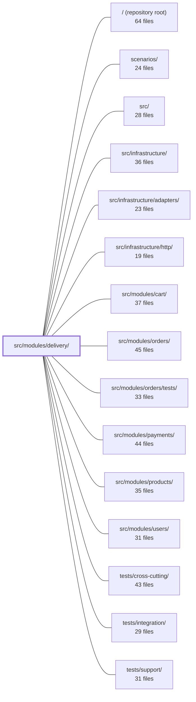

---
tags:
    - 2brain
    - 2brain/module
    - project/boilerplate-node-backend
type: module
module: src/modules/delivery/
files: 22
updated: 2026-09-23T20:36:41.395806+00:00
---

# src/modules/delivery/

## Purpose

The delivery module owns the shipment lifecycle after an order is paid: it exposes the shop's shipping-method catalog, records a parcel's handover to a carrier (`processing → shipped`), records its arrival (`shipped → delivered`), and sends the customer a tracking email. It encapsulates the Shipment aggregate, the pure rate-pricing rules, and all HTTP/audit/observability wiring for that domain.

## Key parts

- **Domain layer** — `domain/rates.ts` holds the static shipping-rate table and the weight/threshold pricing functions; `domain/index.ts` is the barrel that lets consumers import these pure functions without touching the HTTP or service layer.
- **Service** — `service.ts` is the only writer for the Shipment collection. It performs `recordShipment` and `recordDelivery` and delegates every order-status change to the `orders` module.
- **HTTP layer** — `routes.ts` mounts four endpoints (methods list, shipment read, ship, deliver) with per-route auth guards. Each controller in `controllers/` handles one route: Zod validation, delegation to the service, and response formatting.
- **Data layer** — `model.ts` defines the Mongoose `Shipment` schema (unique on `orderId`, `shipped`/`delivered` status, tracking code) and its serialization transform. `repository.ts` adds domain-specific queries (find-by-order, idempotent upsert, atomic status transition) on top of the shared repository factory.
- **Emails** — `emails.ts` returns a fully resolved, locale-specific `EmailContent` object for the shipping-notification email, separated from template rendering.
- **Module manifest & public API** — `module.ts` registers identity, permissions, routes, personal-data contract, and locale directory with the kernel. `index.ts` is the single import surface other modules may use (re-exports service, domain rules, emails, and model types). `audit.ts` registers this module's action IDs in the shared `AuditActionMap`.
- **API contract** — `openapi.yaml` is the machine-readable spec for the four endpoints and their schemas; it is the source of truth that `module.ts` must implement.
- **Tests** — Unit tests cover rates (fixed-point + property-based), email rendering, route guards, and schema shape. Integration tests exercise the full service lifecycle against a real MongoDB. Contract tests assert each route's responses match the OpenAPI spec across public/owner/staff audiences.

## How it connects

- **`src/modules/orders/`** — The delivery service delegates all order-status mutations (`processing → shipped`, `shipped → delivered`) to the orders module; delivery never writes order status directly.
- **`src/modules/cart/`** — Cart's checkout flow imports the delivery module through its public barrel (`index.ts`) to price a shipping method without reaching into internal files.
- **`src/infrastructure/http/`** — Provides the Express app, router utilities, and guard infrastructure that `routes.ts` and the controllers build on.
- **`src/infrastructure/adapters/`** — Supplies the email-sending adapter that consumes the `EmailContent` objects produced by `emails.ts`.
- **`scenarios/`** — End-to-end scenario scripts drive the four delivery endpoints as part of full order-to-delivery flows.
- **`tests/cross-cutting/`, `tests/integration/`, `tests/support/`** — Shared test harnesses and cross-module integration suites that exercise the delivery module alongside orders, payments, and products.
- **`src/modules/payments/`, `src/modules/products/`, `src/modules/users/`** — Appear in the dependency graph as peers whose flows (payment completion, product weight data, user locale) feed into or are fed by delivery's pricing and notification logic.

## Where to start

1. **`domain/rates.ts`** — A small, dependency-free file that defines the entire pricing table and the `quoteForTotal` / `isFree` rules. Reading it gives you the module's core business logic in five minutes with no framework in sight.
2. **`service.ts`** — The two functions `recordShipment` and `recordDelivery` are the heart of the module. They show how the service validates, writes the Shipment, calls orders for status, and triggers the email, giving you the full lifecycle in one pass.

## Connected modules

[[boilerplate-node-backend_ROOT|/ (repository root)]] · [[boilerplate-node-backend_scenarios|scenarios/]] · [[boilerplate-node-backend_src|src/]] · [[boilerplate-node-backend_src_infrastructure|src/infrastructure/]] · [[boilerplate-node-backend_src_infrastructure_adapters|src/infrastructure/adapters/]] · [[boilerplate-node-backend_src_infrastructure_http|src/infrastructure/http/]] · [[boilerplate-node-backend_src_modules_cart|src/modules/cart/]] · [[boilerplate-node-backend_src_modules_orders|src/modules/orders/]] · [[boilerplate-node-backend_src_modules_orders_tests|src/modules/orders/tests/]] · [[boilerplate-node-backend_src_modules_payments|src/modules/payments/]] · [[boilerplate-node-backend_src_modules_products|src/modules/products/]] · [[boilerplate-node-backend_src_modules_users|src/modules/users/]] · [[boilerplate-node-backend_tests_cross-cutting|tests/cross-cutting/]] · [[boilerplate-node-backend_tests_integration|tests/integration/]] · [[boilerplate-node-backend_tests_support|tests/support/]] · … and 1 more

## Files

- `src/modules/delivery/audit.ts` — Declares the delivery module's audit action identifiers and registers them into the shared `AuditActionMap` so that the observability layer can type-check which actions belong to this domain.
- `src/modules/delivery/controllers/get-shipment-by-order.ts` — Controller for `GET /delivery/order/:orderId`. Returns the parcel associated with a given order — its tracking code and arrival status — consumed by the order page's shipping panel once the order status is `shipped`.
- `src/modules/delivery/controllers/get-shipping-methods.ts` — Express route handler for `GET /delivery/methods`. Exposes the shop's available shipping methods (flat rates, free-above thresholds) as a public, unauthenticated endpoint so that guests can evaluate shipping costs before signing up. Accepts an optional `weight` query parameter to filter the list.
- `src/modules/delivery/controllers/post-deliver-order.ts` — HTTP controller for `POST /delivery/order/:orderId/deliver`. Validates the request body against a Zod schema, then delegates to the delivery service to record a parcel's arrival — the sole transition that moves an order from `shipped` to `delivered`.
- `src/modules/delivery/controllers/post-ship-order.ts` — HTTP handler for `POST /delivery/order/:orderId/ship`. It validates the inbound request body, delegates the actual state transition (`processing → shipped`) to the delivery service, and formats the success or rejection response. It exists so the route layer can stay thin and this single concern (shipping an order) lives in one testable function.
- `src/modules/delivery/domain/index.ts` — Barrel file that exposes the delivery domain rules (shipping rates and pricing logic) as a clean import surface. It lets consumers pull in pure domain functions without importing the module's HTTP/service layer, per the domain-layer convention documented in `docs/theory/domain-layer.md`.
- `src/modules/delivery/domain/rates.ts` — Pure, side-effect-free shipping-rate logic kept in the delivery domain layer so that every quote in the system (checkout, delivery service, API responses) derives from a single static table. The module doubles as the source-of-truth schema for `GET /delivery/methods`.
- `src/modules/delivery/emails.ts` — Provides the resolved, locale-specific email content for delivery notifications. It exists to separate _what text is sent_ from _how it is rendered_: the function returns a fully-translated `EmailContent` object, and whatever email template engine consumes it later performs no further resolution. This follows the same convention as `src/modules/account/emails.ts`.
- `src/modules/delivery/index.ts` — Public barrel for the delivery module. It is the **only** import surface allowed for sibling modules (enforced by the DDD boundary rule in `docs/theory/strategic-ddd.md` §5). It re-exports the service, domain rules, email templates, and model types so that consumers like cart's checkout can price a shipping method without reaching into internal files.
- `src/modules/delivery/model.ts` — Defines the Mongoose schema and compiled model for the **Shipment** collection — one document per order, enforced by a `unique` index on `orderId`. It captures carrier-specific facts (tracking code, delivered timestamp) that the Order model does not carry, and provides the serialization transform used when the repository returns lean reads.
- `src/modules/delivery/module.ts` — Module manifest (entry point) for the delivery module. It declares the module's identity, permission keys, route table, personal-data collection contract, and locale directory to the kernel registry. It exists so the rest of the application can discover and mount the delivery feature without knowing its internals.
- `src/modules/delivery/openapi.yaml` — OpenAPI 3.0.3 contract for the delivery module. It defines the four HTTP endpoints that expose shipping-method selection and the shipment lifecycle (record handover, record arrival), plus the request/response schemas and the shared-envelope wrapper every response uses. It is the machine-readable source of truth for what the delivery module's `module.ts` must implement.
- `src/modules/delivery/repository.ts` — Exports `shipmentRepository` — the data-access layer for the delivery domain. It layers domain-specific lookups (order-based find, idempotent upsert, atomic status transition) on top of the shared CRUD surface provided by the repository factory.
- `src/modules/delivery/routes.ts` — Defines the Express route table for the delivery module. It wires four endpoints (shipping-methods lookup, shipment read, ship, deliver) to their controller handlers and attaches per-route authorization guards. The file exists to centralize URL patterns, guard selection, and handler binding so `module.ts` can mount a single router.
- `src/modules/delivery/service.ts` — Service layer for the delivery lifecycle: records a parcel's handover to a carrier (`recordShipment`) and its arrival (`recordDelivery`). It owns all shipment/parcel writes and delegates every order-status mutation to the `orders` module — delivery never writes order status directly.
- `src/modules/delivery/tests/contract/api.contract.test.ts` — Contract (schema) tests for the four `/delivery` HTTP routes. Each test asserts that the response matches the declared API spec (via `toSatisfyApiSpec`) for both success and error branches, across three audiences: public (methods list), owner (shipment read), and staff (ship / deliver writes). The file does **not** test business-rule logic — it pins that each contract branch is reachable over HTTP.
- `src/modules/delivery/tests/integration/service.test.ts` — Integration tests for the delivery service: the rate-pricing rules and the shipment→delivery lifecycle. Exercises `recordShipment`, `recordDelivery`, and `getForOrder` against a real MongoDB instance, asserting that order status transitions, parcel writes, and the outbound tracking email all happen in the expected combination (or are correctly refused).
- `src/modules/delivery/tests/unit/emails.test.ts` — Unit test for the `shipmentShippedEmail` builder. It verifies that the dispatch email renders correctly: the tracking code is interpolated (never left as a raw `{{…}}` token), the customer's name appears in the greeting, every copy slot is resolved to real text rather than an i18n key, and locale selection drives actual translation differences.
- `src/modules/delivery/tests/unit/rates.property.test.ts` — Property-based tests (via `fast-check`) for the shipping-rate domain module. Where `rates.test.ts` pins three fixed points around the free-shipping threshold, this file checks invariants across _all_ valid item totals, using a fixed seed so any counterexample is reproducible and can be promoted back to a concrete example in the fixed-point suite.
- `src/modules/delivery/tests/unit/rates.test.ts` — Unit tests for the pure shipping-rate functions in `domain/rates.ts`. No database, no mocks — it exercises the pricing table and the weight/threshold rules in isolation. The doc header explicitly separates this from `tests/integration/service.test.ts`, which exists because _persistence_ of a shipment needs a real DB; the pricing rule itself does not.
- `src/modules/delivery/tests/unit/routes.test.ts` — Unit tests for the delivery module's route table. Verifies that the four documented endpoints are mounted in the expected order and that each carries the correct authentication/authorization guard. The final "sweep" test acts as a safety net: any future route added without a guard will fail this suite rather than shipping open.
- `src/modules/delivery/tests/unit/schema-contract.test.ts` — Unit test that pins down the structural contract of `shipmentSchema`: which fields are required, the database-level uniqueness guarantee on `orderId`, the ObjectId reference to `Order`, the `ShipmentStatus` enum with its `shipped` default, and the intentional absence of a `deliveredAt` default. It exists so that schema changes that would break exactly-once dispatch semantics are caught immediately.

---

[[boilerplate-node-backend_INDEX|← boilerplate-node-backend index]]
