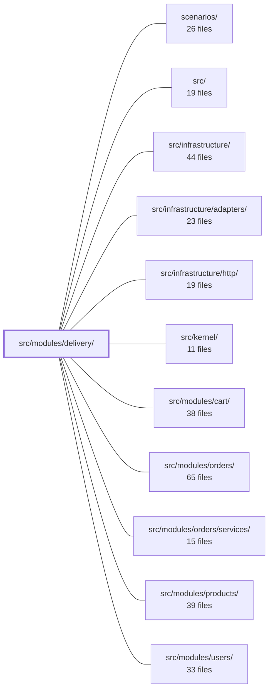

---
tags:
  - 2brain
  - 2brain/module
  - project/boilerplate-node-backend
type: module
module: src/modules/delivery/
files: 24
updated: 2026-09-27T16:19:58.443078+00:00
---

# src/modules/delivery/

## Purpose

The delivery module owns the shipment domain for the shop: it defines the shipping-rate pricing rules, manages the Shipment record (tracking code, delivery status), and drives the physical-fulfilment portion of the order lifecycle (`paid → processing → shipped → delivered`) as well as the digital-only shortcut (`processing → delivered`). It also supplies the locale-resolved copy for dispatch notifications and exposes a small public HTTP surface for looking up shipping methods and tracking parcels.

## Key parts

- **Domain layer** (`domain/rates.ts`, `domain/index.ts`) — Pure, side-effect-free pricing logic over a static three-method rate table. Independently importable by any consumer (checkout, tests) without pulling in HTTP or service code.
- **Service** (`service.ts`) — Orchestrates the three status "doors" (start, ship+deliver, digital-fulfil), writes the parcel record, then delegates every order-status write to the orders module. Also serves the shipping-method list and enforces the forced-override permission gate.
- **Controllers** (`controllers/*.ts`) — One thin file per endpoint. Each validates its input (Zod or similar), delegates to the service, and shapes the response. No domain logic lives here.
- **Model & repository** (`model.ts`, `repository.ts`) — Mongoose schema for the Shipment collection (unique on `orderId`) and the persistence boundary: CRUD via a shared factory plus domain-specific lookups (by-order retrieval, idempotent creation, atomic conditional status transitions).
- **Module wiring** (`module.ts`, `routes.ts`, `index.ts`, `audit.ts`) — `module.ts` is the manifest the kernel registers (routes, permissions, locale path). `routes.ts` maps endpoints to controllers with per-route auth chains. `index.ts` is the sole public barrel for sibling modules. `audit.ts` augments the global `AuditActionMap` with delivery's action constants.
- **Emails** (`emails.ts`) — Returns a fully-translated `EmailContent` object for the "shipment shipped" notification; the rendering engine downstream performs no further resolution.
- **API contract** (`openapi.yaml`) — OpenAPI 3.0.3 spec for all six endpoints; the source of truth for shapes, auth, and error semantics shared with the UI and external consumers.
- **Tests** (`tests/`) — Contract tests (wire-level, three audiences), integration tests (real Mongo, lifecycle + rates), and unit tests (pure rates, email copy, route-table guards, schema structure, property-based rate invariants).

## How it connects

- **`src/modules/orders/` & `src/modules/orders/services/`** — The delivery service is the *writer* of shipment state but never mutates the Order document itself; it delegates every status transition (`startFulfilment`, `recordShipment`, `recordDelivery`, `fulfillOrder`) to the orders module, which owns the Order aggregate.
- **`src/modules/cart/`** — Cart's checkout imports the shipping-rate domain (via `index.ts` → `domain/`) to price a selected method before the order is placed. This is the only cross-module import allowed into delivery's internals.
- **`src/kernel/`** — Consumes the `AppModule` exported by `module.ts` to register the delivery module's routes, permissions, and locale path during application boot.
- **`src/infrastructure/http/`** — Provides the Express plumbing, middleware, and authorization-chain utilities that `routes.ts` composes per endpoint.
- **`src/infrastructure/`** — Supplies the shared repository factory used by `repository.ts`, the audit-event map that `audit.ts` augments, and the email-sending pipeline that consumes the `EmailContent` objects from `emails.ts`.

## Where to start

1. **`domain/rates.ts`** — ~50 lines of pure functions over a static table. No imports from the rest of the codebase, no I/O. Reading it tells you exactly how a shipping quote is computed and what a `ShippingMethod` looks like.
2. **`service.ts`** — Once the pricing rules are clear, this file shows the three lifecycle transitions, how the Shipment record is created/updated, and where the boundary with the orders module sits. It is the single place to trace "what happens when a warehouse ships a parcel."

## Connected modules

```mermaid
flowchart LR
    m_src_modules_delivery["src/modules/delivery/"]
    m_scenarios["scenarios/<br/>26 files"]
    m_src["src/<br/>19 files"]
    m_src_infrastructure["src/infrastructure/<br/>44 files"]
    m_src_infrastructure_adapters["src/infrastructure/adapters/<br/>23 files"]
    m_src_infrastructure_http["src/infrastructure/http/<br/>19 files"]
    m_src_kernel["src/kernel/<br/>11 files"]
    m_src_modules_cart["src/modules/cart/<br/>38 files"]
    m_src_modules_orders["src/modules/orders/<br/>65 files"]
    m_src_modules_orders_services["src/modules/orders/services/<br/>15 files"]
    m_src_modules_products["src/modules/products/<br/>39 files"]
    m_src_modules_users["src/modules/users/<br/>33 files"]
    m_src_modules_delivery --- m_scenarios
    m_src_modules_delivery --- m_src
    m_src_modules_delivery --- m_src_infrastructure
    m_src_modules_delivery --- m_src_infrastructure_adapters
    m_src_modules_delivery --- m_src_infrastructure_http
    m_src_modules_delivery --- m_src_kernel
    m_src_modules_delivery --- m_src_modules_cart
    m_src_modules_delivery --- m_src_modules_orders
    m_src_modules_delivery --- m_src_modules_orders_services
    m_src_modules_delivery --- m_src_modules_products
    m_src_modules_delivery --- m_src_modules_users
    style m_src_modules_delivery stroke-width:3px
```

[[boilerplate-node-backend_ROOT|/ (repository root)]] · [[boilerplate-node-backend_scenarios|scenarios/]] · [[boilerplate-node-backend_src|src/]] · [[boilerplate-node-backend_src_infrastructure|src/infrastructure/]] · [[boilerplate-node-backend_src_infrastructure_adapters|src/infrastructure/adapters/]] · [[boilerplate-node-backend_src_infrastructure_http|src/infrastructure/http/]] · [[boilerplate-node-backend_src_kernel|src/kernel/]] · [[boilerplate-node-backend_src_modules_cart|src/modules/cart/]] · [[boilerplate-node-backend_src_modules_orders|src/modules/orders/]] · [[boilerplate-node-backend_src_modules_orders_services|src/modules/orders/services/]] · [[boilerplate-node-backend_src_modules_products|src/modules/products/]] · [[boilerplate-node-backend_src_modules_users|src/modules/users/]]

## Files
- `src/modules/delivery/audit.ts` — Declares the four audit-action string constants that the delivery domain emits and registers them into the shared `AuditActionMap` interface via TypeScript module augmentation. This keeps the audit vocabulary colocated with the domain that produces it while remaining visible to the global observability infrastructure.
- `src/modules/delivery/controllers/get-shipment-by-order.ts` — Controller for `GET /delivery/order/:orderId`. Returns the parcel associated with a given order — its tracking code and arrival status — consumed by the order page's shipping panel once the order status is `shipped`.
- `src/modules/delivery/controllers/get-shipping-methods.ts` — Express route handler for `GET /delivery/methods`. Returns the shop's full list of available shipping methods (flat rates and free-above-threshold tiers). It is intentionally public so that guests can see shipping costs before signing up.
- `src/modules/delivery/controllers/post-deliver-order.ts` — HTTP controller for `POST /delivery/order/:orderId/deliver`. Validates the request body against a Zod schema, then delegates to the delivery service to record a parcel's arrival — the sole transition that moves an order from `shipped` to `delivered`.
- `src/modules/delivery/controllers/post-fulfill-order.ts` — Handles `POST /delivery/order/:orderId/fulfill`. Marks a digital-only order as fulfilled, transitioning it from `processing` to `delivered` without creating any parcel record. This is the fulfillment path for orders that have nothing physical to ship (e.g. software, licenses), as an alternative to the `ship`/`deliver` flow.
- `src/modules/delivery/controllers/post-ship-order.ts` — HTTP handler for `POST /delivery/order/:orderId/ship`. It validates the inbound request body, delegates the actual state transition (`processing → shipped`) to the delivery service, and formats the success or rejection response. It exists so the route layer can stay thin and this single concern (shipping an order) lives in one testable function.
- `src/modules/delivery/controllers/post-start-order.ts` — Thin HTTP controller for `POST /delivery/order/:orderId/start`. It is the single entry point that transitions an order from `paid` to `processing` before any parcel record exists. All domain logic is delegated to the delivery service; this file only wires the request context through and shapes the response.
- `src/modules/delivery/domain/index.ts` — Barrel file for the delivery **domain** layer. It re-exports the rate-related API from `./rates` so that consumers can import shipping rules without pulling in the module's HTTP/service surface. This keeps the domain layer independently importable (see `docs/theory/domain-layer.md`).
- `src/modules/delivery/domain/rates.ts` — Pure, side-effect-free shipping-rate logic over a static three-method table. It lives in the `domain/` layer so that every consumer—checkout, the delivery service, tests—derives quotes from exactly one place. `ShippingMethod` (the API schema) is this table plus a runtime `currency` field the service stamps on per call.
- `src/modules/delivery/emails.ts` — Provides the resolved, locale-specific email content for delivery notifications. It exists to separate _what text is sent_ from _how it is rendered_: the function returns a fully-translated `EmailContent` object, and whatever email template engine consumes it later performs no further resolution. This follows the same convention as `src/modules/account/emails.ts`.
- `src/modules/delivery/index.ts` — Public barrel for the delivery module. It is the **only** import surface allowed for sibling modules (enforced by the DDD boundary rule in `docs/theory/strategic-ddd.md` §5). It re-exports the service, domain rules, email templates, and model types so that consumers like cart's checkout can price a shipping method without reaching into internal files.
- `src/modules/delivery/model.ts` — Defines the Mongoose schema and compiled model for the **Shipment** collection — one document per order, enforced by a `unique` index on `orderId`. It captures carrier-specific facts (tracking code, delivered timestamp) that the Order model does not carry, and provides the serialization transform used when the repository returns lean reads.
- `src/modules/delivery/module.ts` — Module manifest (entry point) for the **delivery** module. It declares the module's identity, HTTP routes, permission keys, personal-data collection entry, and locale path, then exports the whole thing as an `AppModule` so the kernel can register it. The file is a wiring file — no business logic lives here.
- `src/modules/delivery/openapi.yaml` — OpenAPI 3.0.3 contract for the delivery module. It defines the six HTTP endpoints that expose shipping-method catalogue, per-order shipment tracking, and the order-lifecycle transitions the warehouse performs (`paid → processing → shipped → delivered`, plus a digital-only shortcut). It exists so that API consumers, the UI, and the module's implementation agree on shapes, auth, and error semantics without reading the code.
- `src/modules/delivery/repository.ts` — Defines the shipment repository: standard CRUD (delegated to the shared factory) plus the domain-specific lookups the carrier service performs — single/batch retrieval by order, idempotent shipment creation, and an atomic conditional status transition. It is the persistence boundary for the delivery module.
- `src/modules/delivery/routes.ts` — Defines the Express route table for the delivery module. Each endpoint is wired to a controller handler and given a per-route authorization chain, distinguishing public pre-purchase lookups, caller-scoped reads, and staff-only write transitions (start, ship, deliver, fulfill).
- `src/modules/delivery/service.ts` — Service layer for the delivery module. Orchestrates the three status doors — `startFulfilment` (paid → processing), `recordShipment`/`recordDelivery` (processing → shipped → delivered), and `fulfillOrder` (processing → delivered, digital-only) — by writing the parcel record first and then delegating every status change to the `orders` module. It also owns the shipping-method list endpoint and the shared "forced override" permission gate.
- `src/modules/delivery/tests/contract/api.contract.test.ts` — Contract tests for the five `/delivery` HTTP routes across three authentication audiences (public, owner, staff). Each test asserts the response satisfies the API spec (`toSatisfyApiSpec`) and pins the correct status code and audience-level access. Business-logic rules are intentionally left to unit and integration suites; this file only verifies the wire-level contract is reachable and well-formed.
- `src/modules/delivery/tests/integration/service.test.ts` — Integration tests for the delivery module covering two concerns: the rates domain (pricing rules and method metadata) and the shipment lifecycle service (`recordShipment`, `recordDelivery`, `getForOrder`). Runs against a real Mongo instance (`setupTestDb`) so that repository writes and cross-module order-status transitions are exercised end-to-end; only the mailer and (in one case) the logger are mocked.
- `src/modules/delivery/tests/unit/emails.test.ts` — Unit test for the `shipmentShippedEmail` builder. It verifies that the dispatch email renders correctly: the tracking code is interpolated (never left as a raw `{{…}}` token), the customer's name appears in the greeting, every copy slot is resolved to real text rather than an i18n key, and locale selection drives actual translation differences.
- `src/modules/delivery/tests/unit/rates.property.test.ts` — Property-based tests (via `fast-check`) for the shipping-rate domain module. Where `rates.test.ts` pins three fixed points around the free-shipping threshold, this file checks invariants across _all_ valid item totals, using a fixed seed so any counterexample is reproducible and can be promoted back to a concrete example in the fixed-point suite.
- `src/modules/delivery/tests/unit/rates.test.ts` — Unit tests for the pure-function pricing and weight logic in the delivery domain. The file header explicitly separates these from the integration-level `service.test.ts` (which requires a database): here there are no mocks, no DB — only assertions over a static table and three small functions.
- `src/modules/delivery/tests/unit/routes.test.ts` — Unit tests that pin the delivery route table to its documented contract: the exact set and order of endpoints, and the authentication/permission guard attached to each. The file exists so that adding or modifying a route in `routes.ts` without the correct guard is caught immediately rather than discovered in production.
- `src/modules/delivery/tests/unit/schema-contract.test.ts` — Unit test that pins down the structural contract of `shipmentSchema`: which fields are required, the database-level uniqueness guarantee on `orderId`, the ObjectId reference to `Order`, the `ShipmentStatus` enum with its `shipped` default, and the intentional absence of a `deliveredAt` default. It exists so that schema changes that would break exactly-once dispatch semantics are caught immediately.

---
[[boilerplate-node-backend_INDEX|← boilerplate-node-backend index]]
