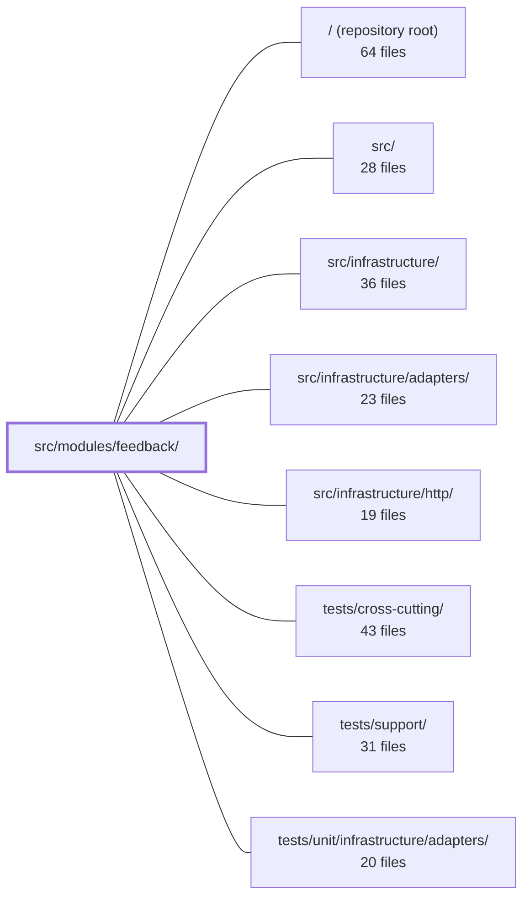

---
tags:
    - 2brain
    - 2brain/module
    - project/boilerplate-node-backend
type: module
module: src/modules/feedback/
files: 25
updated: 2026-09-23T20:36:55.278227+00:00
---

# src/modules/feedback/

## Purpose

The feedback module implements the application's public contact form and the associated admin triage queue. It handles the full lifecycle of an anonymous visitor's feedback ticket—submission, notification to the support operator, status tracking, and hard deletion. Because the form is account-agnostic (no user reference), this module is a leaf node in the dependency graph and carries its own rate-limiting, audit, and anti-bot concerns.

## Key parts

- **Domain & data layer** — `model.ts` (Mongoose schema, document/entity bridge, serialization transform), `repository.ts` (wires the model into the shared `createRepository` factory for CRUD + search), `service.ts` (business logic: creation with anti-bot screening, paginated search, status/notes updates, hard delete, data export).
- **API surface** — `routes.ts` (Express route table; a positional auth gate splits a public half from an admin half), `controllers/` (thin HTTP handlers: `post-feedback-contact` for the sole public write, `get-feedback` for the admin search queue, `put-feedback-status`, `delete-feedback`), `openapi.yaml` (OpenAPI 3.0.3 contract that drives orval code generation and API docs).
- **Cross-cutting concerns** — `audit.ts` (registers read-and-write audit actions into the app-wide `AuditActionMap`; reads are audited here because feedback rows carry a stranger's email and free text), `emails.ts` (builds the operator notification email), `rate-limits.ts` (three budget tiers keyed by IP, submitted email, and address block; converted to Express middleware via `buildRateLimiter`).
- **Module plumbing** — `module.ts` (manifest registering identity, routes, permissions, rate limits, and personal-data hooks with the kernel), `index.ts` (public barrel; the only import entry point allowed by the DDD import rule).
- **Tests** — `tests/` spans unit (route shape, audit strings, email construction, rate-limit numerics, schema contract), integration (service behavior, model serialization, schema semantics, rate-limit wiring), and contract (every route validated against the OpenAPI spec, with specific guards that the public endpoint leaks no admin fields).

## How it connects

- **`src/infrastructure/http/`** provides the shared factories this module consumes: `createSearchController` (used by `get-feedback.ts`), `createRepository` (used by `repository.ts`), and the `buildRateLimiter` helper (used by `rate-limits.ts`). The module does not re-implement these; it supplies its own configuration and delegates.
- **`src/infrastructure/`** and **`src/infrastructure/adapters/`** supply the underlying Mongoose connection, the mailer adapter invoked by `service.ts` for operator notifications, and the audit port that `audit.ts` registers into. The feedback module is a consumer, not a provider, of these infrastructure concerns.
- **`/` (repository root)** is the application shell that discovers and mounts the module via its `module.ts` manifest, wiring routes, permissions, and rate-limit middleware into the running Express app generically.
- **`tests/support/`** provides shared test helpers (e.g., `setupTestDb`) used by the feedback integration tests. **`tests/cross-cutting/`** contains the app-wide audit-registry shape check; the feedback module's own `tests/unit/audit.test.ts` complements it by pinning the exact string values. **`tests/unit/infrastructure/adapters/`** covers the mailer adapter contract that `emails.ts` and `service.ts` rely on.

## Where to start

1. **`module.ts`** — it is the single manifest that lists the module's routes, permissions, rate limits, and data-export hooks in one place, giving a newcomer the full shape of what the module exposes to the rest of the app before diving into internals.
2. **`service.ts`** — it contains the core business rules (anti-bot checks, status transitions, pagination, hard delete) without HTTP or Mongoose noise, making it the clearest place to understand _what_ the module actually does.

## Connected modules

[[boilerplate-node-backend_ROOT|/ (repository root)]] · [[boilerplate-node-backend_src|src/]] · [[boilerplate-node-backend_src_infrastructure|src/infrastructure/]] · [[boilerplate-node-backend_src_infrastructure_adapters|src/infrastructure/adapters/]] · [[boilerplate-node-backend_src_infrastructure_http|src/infrastructure/http/]] · [[boilerplate-node-backend_tests_cross-cutting|tests/cross-cutting/]] · [[boilerplate-node-backend_tests_support|tests/support/]] · [[boilerplate-node-backend_tests_unit_infrastructure_adapters|tests/unit/infrastructure/adapters/]]

## Files

- `src/modules/feedback/audit.ts` — Declares the feedback module's audit-action vocabulary and registers it into the app-wide `AuditActionMap` via TypeScript module augmentation. Feedback rows carry a stranger's email address and free text, so _reads_ (not just mutations) are audit-relevant here — a data-protection concern that does not apply to, e.g., the public product catalogue.
- `src/modules/feedback/controllers/delete-feedback.ts` — Controller for `DELETE /feedback/:id`. Permanently removes a feedback ticket via `feedbackRequestService.remove`. Hand-written rather than built on the shared `createDeleteController` factory because the feedback module has no soft-delete tier.
- `src/modules/feedback/controllers/get-feedback.ts` — Controller for `GET /feedback` and `POST /feedback/search`, the admin triage queue for feedback tickets. It builds a cacheable search endpoint (query form) and a filter-rich endpoint (body form) using the shared `createSearchController` factory also used by the products, users, and orders modules.
- `src/modules/feedback/controllers/post-feedback-contact.ts` — Implements the sole public write endpoint in the feedback module — `POST /feedback/contact` — which creates a feedback ticket and (via the service) sends a support notification email. Mounted above the admin gate in `../routes` rather than exempted from it.
- `src/modules/feedback/controllers/put-feedback-status.ts` — Controller handler for `PUT /feedback/:id` (admin). Validates the request body, delegates the status/notes update to the feedback service, and serialises the result into an HTTP response. It exists to keep HTTP concerns (parsing, error mapping, response shaping) separate from the domain logic in the service layer.
- `src/modules/feedback/emails.ts` — Builds the finished email content (subject + rendered data object) for the feedback module's operator notification. Follows the same convention as `@modules/account/emails`: the caller passes a locale, the function returns a ready-to-send `EmailContent`. Emails go to the support mailbox, so they are rendered in `NODE_DEFAULT_LOCALE` and the customer's own submitted text is passed through untranslated.
- `src/modules/feedback/index.ts` — Public barrel for the `feedback` module. It is the **only** entry point sibling modules may import from (enforced by the strategic DDD import rule, `docs/theory/strategic-ddd.md §5`). It re-exports the module's public API so consumers never reach into internal files directly.
- `src/modules/feedback/model.ts` — Defines the Mongoose schema, document type, and model for the `FeedbackRequest` collection. It bridges the API-generated `FeedbackRequest` type (ISO-string dates) with Mongoose's native `Date` fields, wires up the indexes the feedback admin UI relies on, and exposes a serialization transform so lean query results can be shaped the same as hydrated documents.
- `src/modules/feedback/module.ts` — Module manifest for the public contact/feedback form. Registers the module's identity, routes, permissions, rate limits, and personal-data export hooks with the kernel so the application can wire it up generically. The form is intentionally account-agnostic (no user reference), making this a leaf node in the module graph.
- `src/modules/feedback/openapi.yaml` — OpenAPI 3.0.3 contract for the feedback module. It declares the REST endpoints (submit, list, search, update, delete feedback requests), their request/response shapes, and the shared component references, serving as the single source of truth for code generation (orval) and API documentation.
- `src/modules/feedback/rate-limits.ts` — Defines the rate-limit budgets that govern the feedback contact form (`POST /feedback/contact`). It declares three `RateLimitBudget` configurations—keyed by client address, submitted email, and address block—and converts them into Express middleware via `buildRateLimiter`. This isolates the feedback module's limits so they are tunable, auditable, and independently testable from the middleware infrastructure.
- `src/modules/feedback/repository.ts` — Declares the feedback-request repository instance for the feedback module. It wires the module's Mongoose model, a document-to-entity transform, and a search spec into the shared `createRepository` factory, producing a single ready-to-use CRUD + search repository export.
- `src/modules/feedback/routes.ts` — Defines the Express route table for the feedback/contact module: one public visitor-submission endpoint (`POST /contact`) and a set of admin-only routes for reading, searching, updating, and deleting submitted feedback. The file's central structural concern is that auth is enforced **positionally** — a single `router.use` gate splits the router into a public half (above) and an admin half (below).
- `src/modules/feedback/service.ts` — Service layer for the feedback (contact-request) module. Owns the business logic for creating tickets (including anti-bot screening and operator email notification), paginated search, status/notes updates, hard deletion, and per-caller data export. Controllers in `./controllers` are thin wrappers that validate input and hand the payload to these functions.
- `src/modules/feedback/tests/contract/api.contract.test.ts` — Contract tests for every `/feedback` route, asserting that each response satisfies the OpenAPI spec (`toSatisfyApiSpec()`). Because feedback is the only resource with a genuinely public write endpoint (`POST /feedback/contact`, `security: []`) beside admin-only routes, the tests specifically guard that the public response carries no admin fields and that admin routes return 401/403 rather than leaking data. Records are created through the public endpoint itself (no fixture builder exists), so the payload under assertion is exactly what the app produces.
- `src/modules/feedback/tests/integration/contact-identity-rate-limit.test.ts` — Integration test for the identity-keyed dimension of the contact-form rate limiter (`contactLimiters`). It verifies that the submitted-email budget (`NODE_SUBMISSION_RATE_LIMIT_EMAIL_MAX`) is enforced independently of the per-address budget, and that the limiter is actually wired into the `POST /feedback/contact` route. The per-address-only case is covered in `submission-rate-limit.test.ts`.
- `src/modules/feedback/tests/integration/model.test.ts` — Integration test that enforces the serialization contract for feedback requests: the internal MongoDB fields `_id` and `__v` must never appear in a consumer-facing payload, whether the data arrives as a hydrated Mongoose document (`toJSON`) or as a `.lean()` list mapped through the service layer.
- `src/modules/feedback/tests/integration/schema-contract.test.ts` — Integration test that verifies behaviors declared by the Mongoose schema itself (serialization, defaults, required fields, `select: false`) rather than application-level transforms covered by sibling specs. It runs against a real MongoDB instance because a mocked model would only assert the mock's opinion of Mongoose semantics.
- `src/modules/feedback/tests/integration/service.test.ts` — Integration test suite for the feedback request service. Pins down normalisation rules on `create`, honeypot and disposable-email anti-bot disposition, `search` filtering/pagination, `updateStatus` semantics (including `respondedAt` stamping), and `remove`. Runs against a real test database via `setupTestDb` with the mailer and audit ports mocked.
- `src/modules/feedback/tests/integration/submission-rate-limit.test.ts` — Integration test for `submissionLimiter` that verifies the contact-form budget is consumed by **every** request (success or failure) and that each 429 refusal is logged. It guards the regression where someone accidentally mounts `credentialLimiters` (which use `skipSuccessfulRequests`) on `POST /feedback/contact`, where every abusive submission returns `201` and would therefore spend zero of the budget.
- `src/modules/feedback/tests/unit/audit.test.ts` — Locks in the exact string values of the feedback module's audit action constants. These strings are a wire contract consumed by external log queries and alerts; a rename would pass type-checking but could silently break alerting. This test is the single owner of the value assertions—the cross-cutting suite only verifies the object's shape.
- `src/modules/feedback/tests/unit/emails.test.ts` — Unit tests for the `contactRequestEmail` function — the notification email sent to an OPERATOR (not a customer) when a contact request / ticket is submitted. The suite pins down subject construction, data pass-through, name fallback, field labeling, and locale translation so that regressions in any of those behaviors are caught at the function boundary.
- `src/modules/feedback/tests/unit/rate-limits.test.ts` — Unit tests that pin the _numerical relationships_ between the contact-form rate-limit budgets declared in the feedback module. They assert that per-identity and per-address budgets stay well below the global browsing budget, and that the address-block budget exceeds the per-address budget it widens. The file explicitly does **not** exercise the middleware at runtime; that concern is delegated to the integration tests.
- `src/modules/feedback/tests/unit/routes.test.ts` — Unit tests that pin the feedback route table's shape: which endpoints exist, their order, where the auth/permission gate sits, how caching keys and invalidation are wired, and where the rate-limit and human-challenge guards are placed on `POST /contact`. Assertions are deliberately **positional** (order in the chain matters) because the routes below the gate are distinguished only by position, not by route-level middleware identity.
- `src/modules/feedback/tests/unit/schema-contract.test.ts` — Pins the social contract of `feedbackRequestSchema` — the one surface where an anonymous stranger writes to the database. It asserts which fields are required, which are optional, which carry defaults, which are indexed, and how long documents are retained, so that a schema refactor cannot silently change what a reporter must provide or how the operator queue behaves.

---

[[boilerplate-node-backend_INDEX|← boilerplate-node-backend index]]
