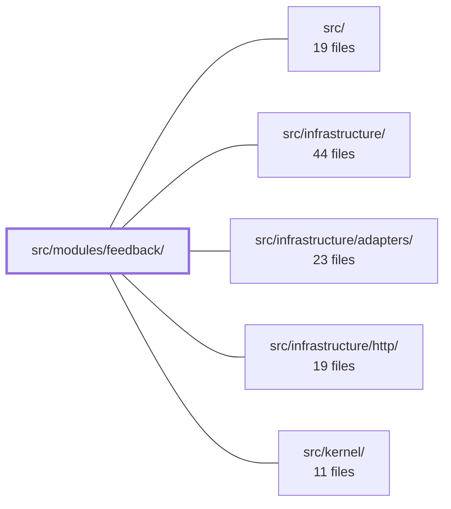

---
tags:
  - 2brain
  - 2brain/module
  - project/boilerplate-node-backend
type: module
module: src/modules/feedback/
files: 24
updated: 2026-09-27T16:20:13.388035+00:00
---

# src/modules/feedback/

## Purpose

The feedback module implements the visitor contact form and the admin triage workflow behind it. It accepts anonymous submissions (email + free text, no account required), notifies an operator via email, and exposes a read/update/delete surface for support staff to work tickets. Because every record carries a stranger's personal data, the module treats even read access as audit-relevant.

## Key parts

- **Public entry point** — `index.ts` is the only file sibling modules may import (strategic-DDD rule); `openapi.yaml` is the single source of truth for endpoint shapes and error semantics.
- **Module registration** — `module.ts` mounts routes, permissions, rate-limit budgets, and the personal-data export hook into the app's `AppModule` contract; `routes.ts` defines the Express route table with a positional auth gate separating the one public route from all admin routes; `audit.ts` declares the feedback audit-action vocabulary and augments the app-wide `AuditActionMap`.
- **Domain & persistence** — `model.ts` defines the Mongoose schema, indexes, and serialization transform for `FeedbackRequest`; `repository.ts` is a thin `createRepository` instantiation that the service layer uses for all CRUD access.
- **Business logic** — `service.ts` owns the ticket lifecycle (create + notify, paginated search, status/notes update, hard delete, caller-scoped data export) and is the single point where "persist + email" stays atomic.
- **HTTP controllers** (`controllers/`) — `post-feedback-contact.ts` (public write), `get-feedback.ts` (admin queue + search), `update-feedback-status.ts` (PUT/PATCH triage), `delete-feedback.ts` (hard delete). Most are generated from shared controller factories to keep the HTTP layer thin.
- **Supporting concerns** — `emails.ts` builds the operator notification email (locale-aware, customer text passed through untranslated); `rate-limits.ts` declares three budget tiers (per-address, per-email, per-address-block) and converts them into Express middleware.
- **Tests** (`tests/`) — Unit tests pin schema shape, route order, email construction, and rate-limit numerics; integration tests run against a real database to verify service invariants, serialization, and rate-limit wiring; contract tests assert every response conforms to the OpenAPI spec.

## How it connects

- **`src/kernel/`** — Provides the shared factories this module consumes (`createRepository`, `createUpdateController`, the search-controller factory) and the `AppModule` contract that `module.ts` registers into. The app-wide `AuditActionMap` augmented by `audit.ts` also lives here.
- **`src/infrastructure/http/`** — Supplies the Express middleware utilities the module relies on: `buildRateLimiter` (used by `rate-limits.ts`), the shared `getAuth` gate (positionally mounted in `routes.ts`), and the `createDeleteController` factory whose absence from `delete-feedback.ts` is a deliberate choice (feedback has no soft-delete tier).
- **`src/infrastructure/adapters/`** — Hosts the Mongoose adapter that `model.ts` and `repository.ts` sit on, translating between the API's ISO-string types and MongoDB's native `Date` fields.
- **`src/infrastructure/`** — Broader infrastructure (email dispatch, persistence plumbing) that the service layer calls indirectly through the repository and the email-building helper.
- **`src/`** — The top-level barrel that re-exports the feedback module's public API (via `index.ts`) to the rest of the application.

## Where to start

Read **`service.ts`** first — it is the single file that captures the full business lifecycle (create, search, update, delete, export) and makes the module's invariants (spam filtering, `respondedAt` stamp-once, email normalization) concrete. Then skim **`routes.ts`** to see how the one public endpoint is separated from the admin surface purely by mount position, which explains the whole auth model in about twenty lines.

## Connected modules

```mermaid
flowchart LR
    m_src_modules_feedback["src/modules/feedback/"]
    m_src["src/<br/>19 files"]
    m_src_infrastructure["src/infrastructure/<br/>44 files"]
    m_src_infrastructure_adapters["src/infrastructure/adapters/<br/>23 files"]
    m_src_infrastructure_http["src/infrastructure/http/<br/>19 files"]
    m_src_kernel["src/kernel/<br/>11 files"]
    m_src_modules_feedback --- m_src
    m_src_modules_feedback --- m_src_infrastructure
    m_src_modules_feedback --- m_src_infrastructure_adapters
    m_src_modules_feedback --- m_src_infrastructure_http
    m_src_modules_feedback --- m_src_kernel
    style m_src_modules_feedback stroke-width:3px
```

[[boilerplate-node-backend_ROOT|/ (repository root)]] · [[boilerplate-node-backend_src|src/]] · [[boilerplate-node-backend_src_infrastructure|src/infrastructure/]] · [[boilerplate-node-backend_src_infrastructure_adapters|src/infrastructure/adapters/]] · [[boilerplate-node-backend_src_infrastructure_http|src/infrastructure/http/]] · [[boilerplate-node-backend_src_kernel|src/kernel/]]

## Files
- `src/modules/feedback/audit.ts` — Declares the feedback module's audit-action vocabulary and registers it into the app-wide `AuditActionMap` via TypeScript module augmentation. Feedback rows carry a stranger's email address and free text, so _reads_ (not just mutations) are audit-relevant here — a data-protection concern that does not apply to, e.g., the public product catalogue.
- `src/modules/feedback/controllers/delete-feedback.ts` — Controller for `DELETE /feedback/:id`. Permanently removes a feedback ticket via `feedbackRequestService.remove`. Hand-written rather than built on the shared `createDeleteController` factory because the feedback module has no soft-delete tier.
- `src/modules/feedback/controllers/get-feedback.ts` — Controller for the admin feedback triage queue (`GET /feedback` and `POST /feedback/search`). It validates and coerces query/pagination params, then delegates to the feedback service via the shared search-controller factory. Exists to keep the admin search surface thin and consistent with other search endpoints while enforcing that the result is per-admin (never cached).
- `src/modules/feedback/controllers/post-feedback-contact.ts` — Implements the sole public write endpoint in the feedback module — `POST /feedback/contact` — which creates a feedback ticket and (via the service) sends a support notification email. Mounted above the admin gate in `../routes` rather than exempted from it.
- `src/modules/feedback/controllers/update-feedback-status.ts` — Defines the handler pair for `PUT /feedback/:id` (full replace) and `PATCH /feedback/:id` (partial merge) — the admin-triage endpoints for changing a feedback ticket's status and notes. Both handlers are generated from the shared `createUpdateController` factory and delegate to `feedbackRequestService.updateStatusById`, which performs the audit and persistence.
- `src/modules/feedback/emails.ts` — Builds the finished email content (subject + rendered data object) for the feedback module's operator notification. Follows the same convention as `@modules/account/emails`: the caller passes a locale, the function returns a ready-to-send `EmailContent`. Emails go to the support mailbox, so they are rendered in `NODE_DEFAULT_LOCALE` and the customer's own submitted text is passed through untranslated.
- `src/modules/feedback/index.ts` — Public barrel for the `feedback` module. It is the **only** entry point sibling modules may import from (enforced by the strategic DDD import rule, `docs/theory/strategic-ddd.md §5`). It re-exports the module's public API so consumers never reach into internal files directly.
- `src/modules/feedback/model.ts` — Defines the Mongoose schema, document type, and model for the `FeedbackRequest` collection. It bridges the API-generated `FeedbackRequest` type (ISO-string dates) with Mongoose's native `Date` fields, wires up the indexes the feedback admin UI relies on, and exposes a serialization transform so lean query results can be shaped the same as hydrated documents.
- `src/modules/feedback/module.ts` — Module manifest for the **feedback** (contact-form) module. It registers the module's routes, permissions, rate-limit budgets, personal-data export hook, and locale path into the app's `AppModule` contract. The form is deliberately open to people with no account, so records store an email address rather than a user ID.
- `src/modules/feedback/openapi.yaml` — OpenAPI 3.0.3 contract for the feedback module (v2.0.0). Defines the REST surface for user-submitted contact requests and the admin CRUD/triage workflow over them. Serves as the single source of truth for endpoint shapes, shared error semantics, and schema references consumed by the module's implementation and any generated client code.
- `src/modules/feedback/rate-limits.ts` — Defines the rate-limit budgets that govern the feedback contact form (`POST /feedback/contact`). It declares three `RateLimitBudget` configurations—keyed by client address, submitted email, and address block—and converts them into Express middleware via `buildRateLimiter`. This isolates the feedback module's limits so they are tunable, auditable, and independently testable from the middleware infrastructure.
- `src/modules/feedback/repository.ts` — Declares `feedbackRequestRepository`, the CRUD access layer for feedback requests. It is a thin instantiation of the shared `createRepository` factory, wired to the feedback domain model and a search spec. The file exists so the service layer can query and persist feedback documents without touching the persistence infrastructure directly.
- `src/modules/feedback/routes.ts` — Defines the Express route table for the feedback/contact module. It exposes exactly one public endpoint (the visitor contact form) and a set of admin-only endpoints for reading, updating, and deleting submitted feedback. Security is enforced positionally: the public route is mounted above a shared auth gate, so everything below it is automatically admin-gated without per-route repetition.
- `src/modules/feedback/service.ts` — Business-logic service for the feedback (contact-request) module. It owns the full lifecycle of a feedback ticket — creation with operator notification, paginated search, status/notes triage, hard deletion, and a caller-scoped data export — and is the single place where the "one event" of a customer reaching out (persist + notify) stays atomic. Controllers above it handle HTTP concerns; the repository below handles persistence.
- `src/modules/feedback/tests/contract/api.contract.test.ts` — Contract tests for every `/feedback` route, asserting that both success and error responses conform to the OpenAPI spec (`toSatisfyApiSpec()`). Covers the single public write endpoint (`POST /feedback/contact`), two admin-only read/search endpoints (`GET /feedback`, `POST /feedback/search`), and two admin mutation endpoints (`PUT`/`PATCH /feedback/{id}`). Also guards that the public response leaks no admin fields and that admin routes reject unauthenticated callers.
- `src/modules/feedback/tests/integration/contact-identity-rate-limit.test.ts` — Integration test for the identity-keyed dimension of the contact-form rate limiter (`contactLimiters`). It verifies that the submitted-email budget (`NODE_SUBMISSION_RATE_LIMIT_EMAIL_MAX`) is enforced independently of the per-address budget, and that the limiter is actually wired into the `POST /feedback/contact` route. The per-address-only case is covered in `submission-rate-limit.test.ts`.
- `src/modules/feedback/tests/integration/model.test.ts` — Integration test that enforces the serialization contract for feedback requests: the internal MongoDB fields `_id` and `__v` must never appear in a consumer-facing payload, whether the data arrives as a hydrated Mongoose document (`toJSON`) or as a `.lean()` list mapped through the service layer.
- `src/modules/feedback/tests/integration/schema-contract.test.ts` — Schema contract tests for the feedback-request Mongoose schema. Unlike sibling transform specs, this file asserts what Mongoose itself enforces at the schema level (serialization shape, defaults, required fields, `select: false`). It runs against a real MongoDB because a mocked model would only restate the mock's assumptions about Mongoose semantics.
- `src/modules/feedback/tests/integration/service.test.ts` — Integration test suite for the feedback request service (`create`, `search`, `updateStatus`, `remove`). Runs against a real test database to pin service-level invariants: input normalisation (lowercase email, trimmed fields, blank name → `undefined`), honeypot and disposable-email spam detection, `respondedAt` stamp-once semantics, pagination meta coherence, and status narrowing via `toFeedbackStatus`.
- `src/modules/feedback/tests/integration/submission-rate-limit.test.ts` — Integration test for `submissionLimiter` that verifies the contact-form budget is consumed by **every** request (success or failure) and that each 429 refusal is logged. It guards the regression where someone accidentally mounts `credentialLimiters` (which use `skipSuccessfulRequests`) on `POST /feedback/contact`, where every abusive submission returns `201` and would therefore spend zero of the budget.
- `src/modules/feedback/tests/unit/emails.test.ts` — Unit tests for the `contactRequestEmail` function — the notification email sent to an OPERATOR (not a customer) when a contact request / ticket is submitted. The suite pins down subject construction, data pass-through, name fallback, field labeling, and locale translation so that regressions in any of those behaviors are caught at the function boundary.
- `src/modules/feedback/tests/unit/rate-limits.test.ts` — Unit tests that pin the _numerical relationships_ between the contact-form rate-limit budgets declared in the feedback module. They assert that per-identity and per-address budgets stay well below the global browsing budget, and that the address-block budget exceeds the per-address budget it widens. The file explicitly does **not** exercise the middleware at runtime; that concern is delegated to the integration tests.
- `src/modules/feedback/tests/unit/routes.test.ts` — Pins the structural contract of the feedback router: exactly which routes exist, their order, and the middleware/guard chain attached to each. The tests are deliberately **positional** because the auth gate (`router.use(getAuth, …)`) is mounted by position, not by name—so asserting "this route has a guard" alone would pass even if the gate were mis-ordered. This file exists so a refactor that silently moves the gate, drops a limiter, or reorders routes fails immediately.
- `src/modules/feedback/tests/unit/schema-contract.test.ts` — Pins the social contract of `feedbackRequestSchema` — the one surface where an anonymous stranger writes to the database. It asserts which fields are required, which are optional, which carry defaults, which are indexed, and how long documents are retained, so that a schema refactor cannot silently change what a reporter must provide or how the operator queue behaves.

---
[[boilerplate-node-backend_INDEX|← boilerplate-node-backend index]]
