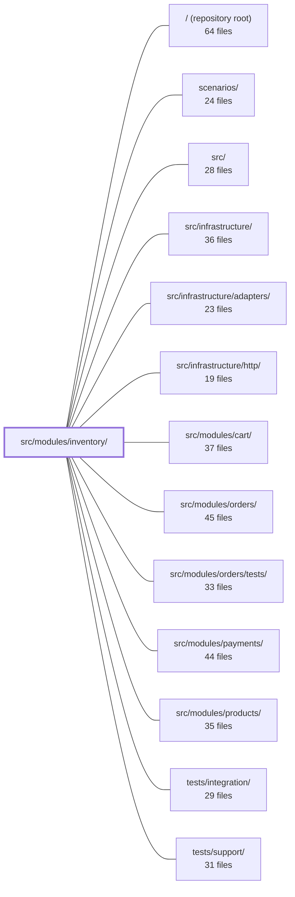

---
tags:
    - 2brain
    - 2brain/module
    - project/boilerplate-node-backend
type: module
module: src/modules/inventory/
files: 25
updated: 2026-09-23T20:37:09.620893+00:00
---

# src/modules/inventory/

## Purpose

The inventory module owns the two product stock counters (`onHand` and `reserved`), the append-only stock-movement ledger, and the reservation lifecycle (hold → committed | released). It is the single chokepoint through which every stock counter change in the application passes, guaranteeing that a counter move and its corresponding ledger row always happen together without relying on Mongo transactions.

## Key parts

- **Domain rules** — `domain/transitions.ts` defines the six stock transitions as pure functions (delta table + availability calculation). `domain/index.ts` barrel-exports them so consumers never reach into individual files.
- **Service layer** — `service.ts` is the sole public API for reads and writes (receipts, adjustments, reservation claims/commits/releases, sweep). It couples each counter update to its ledger append atomically.
- **Persistence** — `model.ts` declares the three Mongoose schemas (StockLevel, StockMovement, Reservation) and their indexes. `repository.ts` owns the collection-level queries and conditional writes the service calls.
- **HTTP surface** — `routes.ts` wires five admin endpoints (stock levels, movements, receipts, adjustments, reservation sweep) with permission guards. The `controllers/` directory holds the thin handlers that validate input and delegate to the service.
- **Module wiring & cross-cutting** — `module.ts` registers the module identity, permission keys, routes, and subscribes to `PRODUCT_CREATED` / `PRODUCT_DELETED` events. `index.ts` is the **only** entry point siblings may import from. `events.ts` declares the `inventory.reservation_expired` domain event. `metrics.ts` registers two Prometheus gauges. `audit.ts` defines the module's audit-action vocabulary. `config.ts` centralises the reservation TTL and low-stock threshold.
- **Contract & tests** — `openapi.yaml` pins the wire-level API. The `tests/` directory spans unit (transitions, routes, schema), integration (service, repository, property-based ledger replay), and contract (API status/shape) suites.

## How it connects

- **`src/modules/products/`** — `module.ts` subscribes to `PRODUCT_CREATED` and `PRODUCT_DELETED` to create or remove the mirrored stock-level document. Customer-facing availability is read off the product document itself; siblings import from `index.ts` to request a named transition rather than touching counters directly.
- **`src/modules/orders/`** — `events.ts` emits `inventory.reservation_expired` so the orders module can release a hold or finalise an order without importing inventory internals (avoids a circular dependency). Orders call into the inventory service to commit or release reservations as part of their lifecycle.
- **`src/modules/cart/`** — The cart module is a consumer of the reservation claim path exposed through `index.ts`; it holds units before the order is confirmed.
- **`src/modules/payments/`** — Payment completion drives the reservation commit transition through the inventory service.
- **`src/infrastructure/http/`** — Provides the Express app, auth middleware (`getAuth`, `requirePermissionGuard`), and API-key support that `routes.ts` mounts onto.

## Where to start

1. **`service.ts`** — Read this first to understand the invariants the module guarantees (atomic counter + ledger pairing, reservation lifecycle, sweep semantics). Every other file either feeds into it or calls out of it.
2. **`domain/transitions.ts`** — A short, dependency-free file that lays out the six transitions and the availability formula. It makes the "what can happen to the two counters" question concrete before you wade into the service logic.

## Connected modules

[[boilerplate-node-backend_ROOT|/ (repository root)]] · [[boilerplate-node-backend_scenarios|scenarios/]] · [[boilerplate-node-backend_src|src/]] · [[boilerplate-node-backend_src_infrastructure|src/infrastructure/]] · [[boilerplate-node-backend_src_infrastructure_adapters|src/infrastructure/adapters/]] · [[boilerplate-node-backend_src_infrastructure_http|src/infrastructure/http/]] · [[boilerplate-node-backend_src_modules_cart|src/modules/cart/]] · [[boilerplate-node-backend_src_modules_orders|src/modules/orders/]] · [[boilerplate-node-backend_src_modules_orders_tests|src/modules/orders/tests/]] · [[boilerplate-node-backend_src_modules_payments|src/modules/payments/]] · [[boilerplate-node-backend_src_modules_products|src/modules/products/]] · [[boilerplate-node-backend_tests_integration|tests/integration/]] · [[boilerplate-node-backend_tests_support|tests/support/]]

## Files

- `src/modules/inventory/audit.ts` — Defines the inventory module's audit action vocabulary and registers it into the application-wide `AuditActionMap` type. The four actions cover admin-level stock operations and one module-owned invariant-failure case (`ADMIN_COMMIT_ORPHANED`) that cannot be attributed to a caller's lifecycle audit.
- `src/modules/inventory/config.ts` — Centralizes two deployment-tunable numbers (reservation TTL and low-stock threshold) in a single read point so that independent consumers—the admin stock board and the public gauge—cannot drift apart on what "low" or "expired" means.
- `src/modules/inventory/controllers/get-inventory-levels.ts` — Thin HTTP controller that exposes `GET /inventory/levels` — a paginated, sorted (scarcest-first) stock-board listing. It validates query-string parameters and delegates to the inventory service, keeping routing logic out of the service layer.
- `src/modules/inventory/controllers/get-stock-movements.ts` — Defines the HTTP controller for `GET /inventory/movements`, which returns a paginated list of stock-movement ledger entries (newest first), optionally filtered by `productId` and `reason`. It exists to decouple the route wiring from the query logic by delegating to `inventoryService.listMovements`.
- `src/modules/inventory/controllers/post-adjustment.ts` — Express controller for `POST /inventory/adjustments`. Handles a stocktake correction — the module's primary audited endpoint, recording the admin identity, a signed quantity delta, and a typed reason for the change.
- `src/modules/inventory/controllers/post-receipt.ts` — Handles `POST /inventory/receipts`. Validates the incoming stock-receipt payload, delegates the state change to the inventory service, and returns the updated inventory level. This is an audited entry point: a receipt is one of only two ways units can enter the shop, and the resulting row records which admin added how many.
- `src/modules/inventory/controllers/post-reservations-sweep.ts` — Express handler for `POST /inventory/reservations/sweep`. It triggers a one-shot reservation-expiry sweep by delegating to the inventory service, then returns the count of expired reservations. The app ships no internal scheduler; this endpoint is meant to be invoked by an external cron entry, a platform scheduled job, or an operator.
- `src/modules/inventory/domain/index.ts` — Barrel file for the inventory **domain layer**. It re-exports the pure, tier-free business rules (the reason→delta table and availability logic) so that consumers import from a single stable entry point rather than reaching into individual domain modules.
- `src/modules/inventory/domain/transitions.ts` — Defines the six inventory stock transitions as pure data-in / verdict-out functions. A product carries two counters (`onHand`, `reserved`); this file is the single source of truth for what each transition does to those counters and for computing customer-visible availability. No side effects, no i18n, no database access.
- `src/modules/inventory/events.ts` — Declares the single domain event emitted by the inventory module (`inventory.reservation_expired`) by augmenting the kernel's `DomainEventMap` interface. It exists to let the `orders` module react to a hold expiring without creating a circular import back into inventory.
- `src/modules/inventory/index.ts` — Public barrel (re-export) for the inventory module. Per the strategic-DDBD rule in `docs/theory/strategic-ddd.md` §5, this is the **only** entry point a sibling module may import from. It intentionally exposes just the service, domain, and events surfaces plus type-only model exports, while withholding repositories, concrete model values, and all counter primitives so that siblings can request a named transition and receive a boolean without touching internal stock mechanics.
- `src/modules/inventory/metrics.ts` — Declares the two domain gauges the inventory module owns and registers them with the shared Prometheus registry. The file has no exported API; importing it for its side effects is the entire point.
- `src/modules/inventory/model.ts` — Defines the three Mongoose schemas, document interfaces, and models that back the inventory module: the append-only **StockMovement** ledger, the **StockLevel** counter (source of truth for `onHand`/`reserved`/`available`), and the **Reservation** hold (per-order product claims with a `held → committed | released` lifecycle). This file owns the storage shape and index strategy; queries live in `repository.ts` and business rules in `service.ts`.
- `src/modules/inventory/module.ts` — Module manifest entry for the **inventory** module. It declares the module's identity, permission keys, HTTP routes, locale path, and — most importantly — wires up the two domain-event subscriptions (`PRODUCT_CREATED`, `PRODUCT_DELETED`) that keep the stock-level collection and the mirrored copy on the product document in sync. It also triggers side-effect imports of `./events` and `./metrics` so those registries are populated at load time.
- `src/modules/inventory/openapi.yaml` — OpenAPI 3.0.3 contract for the inventory module (v2.0.0). It defines the sole write surface for the two product counters `onHand` and `reserved`, the append-only stock-movement ledger, and the reservation-sweep endpoint. Every endpoint is bearer-authenticated and admin-facing; customers read availability off the product itself.
- `src/modules/inventory/repository.ts` — The data-access layer for the inventory module. It owns three Mongoose collections (stock levels, stock movements, reservations) and exposes typed repository objects that the service layer calls to read and write counters, append ledger entries, and drive reservation lifecycle transitions. Business rules and transition conditions live in `./service.ts`; this file only executes the database operations.
- `src/modules/inventory/routes.ts` — Defines the Express route table for the inventory module. It wires five staff-facing endpoints (stock levels, movement ledger, receipts, adjustments, and the reservation-sweep cron) to their respective controllers, applying the module's permission tier (`read` / `create` / `sweep`) and allowing both session auth and `sk_…` API keys. The customer-facing half of inventory is intentionally _not_ routed here.
- `src/modules/inventory/service.ts` — The single chokepoint through which every stock counter change in the application passes. It guarantees that a counter move and its corresponding ledger row always happen together (or neither does) without relying on Mongo transactions. All public read and write paths for inventory levels, stock movements, reservations, receipts, and adjustments live here.
- `src/modules/inventory/tests/contract/api.contract.test.ts` — HTTP contract tests for the inventory module. Pins every contract branch reachable over the API surface—the two read endpoints, the two write transitions with their 200/404/409/422 responses, the reservation sweep, and the 401/403 auth guard—by asserting both the status/body and the `toSatisfyApiSpec()` shape. Business-rule logic for transitions is deferred to the unit suite; this file only verifies the wire-level contract.
- `src/modules/inventory/tests/integration/ledger.property.test.ts` — Property-based integration test that verifies the core invariant of the inventory module: replaying every stock-movement ledger row for a product reproduces its stored `onHand` and `reserved` counters exactly, for _all_ generated sequences of transitions rather than a fixed set of examples. It runs against a real MongoDB instance so that the conditional-write coupling between ledger rows and counter updates is exercised end-to-end.
- `src/modules/inventory/tests/integration/repository.test.ts` — Integration tests for `stockLevelRepository`'s aggregate read methods (`sumReserved`, `stockBoard`, `lowAvailabilityProductIds`) against a real MongoDB instance. Its primary concern is asserting the `.at(0)` fallback path: a `$group`/`$facet` pipeline on an empty collection yields zero rows rather than a zeroed row, so the guard the calling code relies on is verified explicitly. Transition-path methods (`applyDelta`, `ensure`) are intentionally out of scope here — they belong to the service tests.
- `src/modules/inventory/tests/integration/service.test.ts` — Integration tests for the inventory module's own service guarantees: exactly-once reservation claims, atomic all-or-nothing holds, the two admin transitions (commit, release) and their refusal paths, the reservation sweep, and receive/adjust. Cross-module lifecycle (cart → stock) and replay invariants are covered elsewhere; this file uses real MongoDB because every guarantee under test is a conditional write.
- `src/modules/inventory/tests/unit/routes.test.ts` — Unit test that pins the inventory module's route table to a documented set of five endpoints and asserts every one is gated behind `getAuth` + `requirePermissionGuard`. It exists to catch the two failure modes the module's security model depends on: a route accidentally mounted above the auth middleware, or a mount losing its permission check — either of which would expose internal counters and the movement ledger to unauthenticated callers.
- `src/modules/inventory/tests/unit/schema-contract.test.ts` — Validates that the two inventory Mongoose schemas (`stockMovementSchema` and `reservationSchema`) declare the correct database-level guarantees: required fields, enum values, defaults, type references, and index specifications. These assertions exist because the guarantees (exactly-once reservation, replayable ledger, terminal-state integrity) are enforced by the database, not by code paths — a silent schema drift would break invariants with no runtime error.
- `src/modules/inventory/tests/unit/transitions.test.ts` — Pure unit tests for the inventory transition table. Rather than restating the delta table, the suite asserts three structural invariants: (1) only `receive` or `adjust` changes total unit count, (2) `commit` moves `onHand` and `reserved` by equal amounts so availability is unaffected, and (3) `release`/`expire` are exact inverses of `reserve`. A second block pins the `availabilityOf` calculation and its edge cases (missing counters, negative clamp).

---

[[boilerplate-node-backend_INDEX|← boilerplate-node-backend index]]
