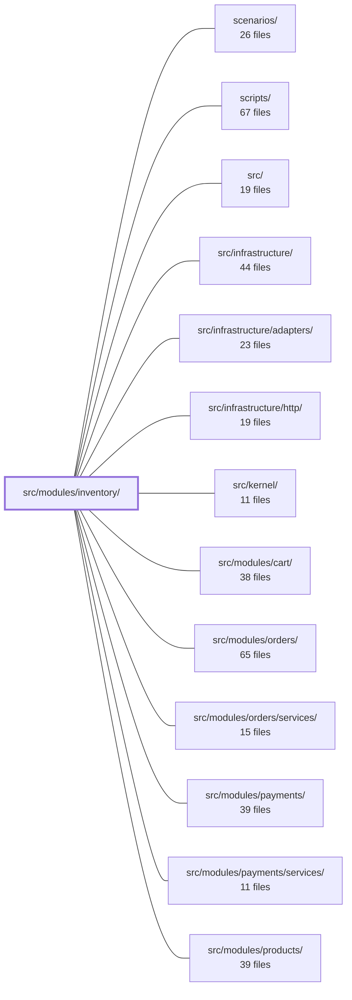

---
tags:
  - 2brain
  - 2brain/module
  - project/boilerplate-node-backend
type: module
module: src/modules/inventory/
files: 25
updated: 2026-09-27T16:20:26.921565+00:00
---

# src/modules/inventory/

## Purpose

The inventory module is the sole authority over two per-product counters — `onHand` and `reserved` — and the append-only ledger that records every unit movement. It owns the full reservation lifecycle (reserve → release / commit / expire), admin stock intake (receipts, adjustments, restocks), and the read paths (stock board, movement history) that power the admin UI. Every counter change is guaranteed to produce a matching ledger row and vice-versa.

## Key parts

- **Domain layer** (`domain/`) — A pure, dependency-free transition table (`transitions.ts`) maps each `StockMovementReason` to signed deltas for `onHand` and `reserved`. Re-exported through `domain/index.ts` as the single import path.
- **Service** (`service.ts`) — The single chokepoint for all stock mutations. Every reserve/release/commit/receive/adjust flows through one private `applyTransition` method, coupling the counter write to a ledger row atomically.
- **Persistence** (`model.ts`, `repository.ts`) — Three Mongoose schemas (stock levels, movements, reservations) plus three typed repositories that translate domain operations into conditional Mongoose writes.
- **HTTP surface** (`routes.ts`, `controllers/`, `openapi.yaml`) — Five staff-only endpoints (read levels/movements, post receipts/adjustments, trigger sweep) behind a permission guard. The OpenAPI spec is the wire contract.
- **Module wiring** (`module.ts`, `index.ts`, `config.ts`, `audit.ts`) — Manifest, public barrel (the *only* entry point siblings may import from), shared tunables (TTL, low-stock threshold), and the audit-action vocabulary.
- **Cross-module surface** (`events.ts`, `metrics.ts`) — Emits `inventory.reservation_expired` for the orders module; registers two Prometheus gauges as a side-effect import.
- **Tests** (`tests/`) — Layered from unit (transition rules, route security, schema invariants) through integration (service edges, repository reads, ledger replay) to contract (wire-format conformance against the OpenAPI spec).

## How it connects

- **products** — Inventory is the sole writer of `Product.onHand` and `Product.reserved`. It subscribes to `PRODUCT_CREATED` / `PRODUCT_DELETED` to create or clean up the stock-level document.
- **orders / orders/services** — Orders react to the `inventory.reservation_expired` event (emitted when a hold lapses) to roll back any dependent state. Order fulfilment paths call back into the service to commit or release reservations.
- **cart** — The cart module triggers reservation holds when a shopper proceeds to checkout; its integration tests exercise the cross-module stock guarantees that the inventory service provides.
- **payments / payments/services** — Payment success is the upstream trigger for a reservation commit (units leave `reserved` and stay in `onHand` as sold).
- **kernel** — Provides the `DomainEventMap`, `AuditActionMap`, and the module-manifest system that `module.ts` plugs into.
- **infrastructure** — Supplies the Mongoose connection, Express app factory, and the shared Prometheus registry that `metrics.ts` registers against.

## Where to start

1. **`domain/transitions.ts`** — Seven lines of pure logic that define every counter move in the system. Reading this first makes the service, repository, and test names immediately legible.
2. **`service.ts`** — Follow `applyTransition` and the five public methods around it to see how the transition table, the repository, and the audit log are stitched together in one transactional path.

## Connected modules

```mermaid
flowchart LR
    m_src_modules_inventory["src/modules/inventory/"]
    m_scenarios["scenarios/<br/>26 files"]
    m_scripts["scripts/<br/>67 files"]
    m_src["src/<br/>19 files"]
    m_src_infrastructure["src/infrastructure/<br/>44 files"]
    m_src_infrastructure_adapters["src/infrastructure/adapters/<br/>23 files"]
    m_src_infrastructure_http["src/infrastructure/http/<br/>19 files"]
    m_src_kernel["src/kernel/<br/>11 files"]
    m_src_modules_cart["src/modules/cart/<br/>38 files"]
    m_src_modules_orders["src/modules/orders/<br/>65 files"]
    m_src_modules_orders_services["src/modules/orders/services/<br/>15 files"]
    m_src_modules_payments["src/modules/payments/<br/>39 files"]
    m_src_modules_payments_services["src/modules/payments/services/<br/>11 files"]
    m_src_modules_products["src/modules/products/<br/>39 files"]
    m_src_modules_inventory --- m_scenarios
    m_src_modules_inventory --- m_scripts
    m_src_modules_inventory --- m_src
    m_src_modules_inventory --- m_src_infrastructure
    m_src_modules_inventory --- m_src_infrastructure_adapters
    m_src_modules_inventory --- m_src_infrastructure_http
    m_src_modules_inventory --- m_src_kernel
    m_src_modules_inventory --- m_src_modules_cart
    m_src_modules_inventory --- m_src_modules_orders
    m_src_modules_inventory --- m_src_modules_orders_services
    m_src_modules_inventory --- m_src_modules_payments
    m_src_modules_inventory --- m_src_modules_payments_services
    m_src_modules_inventory --- m_src_modules_products
    style m_src_modules_inventory stroke-width:3px
```

[[boilerplate-node-backend_ROOT|/ (repository root)]] · [[boilerplate-node-backend_scenarios|scenarios/]] · [[boilerplate-node-backend_scripts|scripts/]] · [[boilerplate-node-backend_src|src/]] · [[boilerplate-node-backend_src_infrastructure|src/infrastructure/]] · [[boilerplate-node-backend_src_infrastructure_adapters|src/infrastructure/adapters/]] · [[boilerplate-node-backend_src_infrastructure_http|src/infrastructure/http/]] · [[boilerplate-node-backend_src_kernel|src/kernel/]] · [[boilerplate-node-backend_src_modules_cart|src/modules/cart/]] · [[boilerplate-node-backend_src_modules_orders|src/modules/orders/]] · [[boilerplate-node-backend_src_modules_orders_services|src/modules/orders/services/]] · [[boilerplate-node-backend_src_modules_payments|src/modules/payments/]] · [[boilerplate-node-backend_src_modules_payments_services|src/modules/payments/services/]] · [[boilerplate-node-backend_src_modules_products|src/modules/products/]]

## Files
- `src/modules/inventory/audit.ts` — Defines the inventory module's audit action vocabulary and registers it into the application-wide `AuditActionMap` type. The four actions cover admin-level stock operations and one module-owned invariant-failure case (`ADMIN_COMMIT_ORPHANED`) that cannot be attributed to a caller's lifecycle audit.
- `src/modules/inventory/config.ts` — Centralizes two deployment-tunable numbers (reservation TTL and low-stock threshold) in a single read point so that independent consumers—the admin stock board and the public gauge—cannot drift apart on what "low" or "expired" means.
- `src/modules/inventory/controllers/get-inventory-levels.ts` — Thin HTTP controller that exposes `GET /inventory/levels` — a paginated, sorted (scarcest-first) stock-board listing. It validates query-string parameters and delegates to the inventory service, keeping routing logic out of the service layer.
- `src/modules/inventory/controllers/get-stock-movements.ts` — Defines the HTTP controller for `GET /inventory/movements`, which returns a paginated list of stock-movement ledger entries (newest first), optionally filtered by `productId` and `reason`. It exists to decouple the route wiring from the query logic by delegating to `inventoryService.listMovements`.
- `src/modules/inventory/controllers/post-adjustment.ts` — Express controller for `POST /inventory/adjustments`. Handles a stocktake correction — the module's primary audited endpoint, recording the admin identity, a signed quantity delta, and a typed reason for the change.
- `src/modules/inventory/controllers/post-receipt.ts` — Handles `POST /inventory/receipts`. Validates the incoming stock-receipt payload, delegates the state change to the inventory service, and returns the updated inventory level. This is an audited entry point: a receipt is one of only two ways units can enter the shop, and the resulting row records which admin added how many.
- `src/modules/inventory/controllers/post-reservations-sweep.ts` — HTTP handler for `POST /inventory/reservations/sweep` — an on-demand trigger for the reservation-expiry sweep. It exists so operators or platform schedulers can invoke the sweep via HTTP; the actual recurring schedule (`npm run sweep:reservations` / crontab) calls the service directly and never hits this route.
- `src/modules/inventory/domain/index.ts` — Barrel (re-export) file for the inventory **domain layer**. It gives the rest of the module a single import path for the pure business rules—specifically the reason→delta transition table—while keeping those rules free of Express, Mongoose, or any other tier dependency.
- `src/modules/inventory/domain/transitions.ts` — Single source of truth for the seven inventory transitions: given a `StockMovementReason` and a quantity, it returns the signed deltas to apply to the `onHand` and `reserved` counters. The file is deliberately pure (no DB, no status codes, no i18n) so the ledger can be replayed deterministically.
- `src/modules/inventory/events.ts` — Declares the single domain event emitted by the inventory module (`inventory.reservation_expired`) by augmenting the kernel's `DomainEventMap` interface. It exists to let the `orders` module react to a hold expiring without creating a circular import back into inventory.
- `src/modules/inventory/index.ts` — Public barrel (re-export) for the inventory module. Per the strategic-DDBD rule in `docs/theory/strategic-ddd.md` §5, this is the **only** entry point a sibling module may import from. It intentionally exposes just the service, domain, and events surfaces plus type-only model exports, while withholding repositories, concrete model values, and all counter primitives so that siblings can request a named transition and receive a boolean without touching internal stock mechanics.
- `src/modules/inventory/metrics.ts` — Declares the two domain gauges the inventory module owns and registers them with the shared Prometheus registry. The file has no exported API; importing it for its side effects is the entire point.
- `src/modules/inventory/model.ts` — Defines the three Mongoose schemas, document interfaces, and models that the inventory module persists: the append-only stock-movement ledger, the per-product stock-level counters, and the per-order reservation (hold). This file is the single source of truth for document shape, indexes, and serialization transforms; it contains no query logic and no business rules.
- `src/modules/inventory/module.ts` — Module manifest entry for the **inventory** module. It declares the module's identity, permission keys, HTTP routes, locale path, and — most importantly — wires up the two domain-event subscriptions (`PRODUCT_CREATED`, `PRODUCT_DELETED`) that keep the stock-level collection and the mirrored copy on the product document in sync. It also triggers side-effect imports of `./events` and `./metrics` so those registries are populated at load time.
- `src/modules/inventory/openapi.yaml` — OpenAPI 3.0.3 contract for the inventory module (v2.0.0). It defines the admin-facing API surface for reading stock levels, auditing the movement ledger, and performing the three counter mutations (receive, adjust, sweep). The inventory module is the sole writer of `Product.onHand` and `Product.reserved`; this spec is the single source of truth for how those counters are read and changed.
- `src/modules/inventory/repository.ts` — Persistence layer for the inventory module. It exposes three typed repositories (stock levels, stock movements, reservations) that translate the service layer's domain operations into conditional Mongoose writes. All guard logic for counter transitions lives here so the service never touches raw Mongo filters.
- `src/modules/inventory/routes.ts` — Express route table for the inventory module. Defines five staff-only endpoints (read stock levels/movements, post receipts/adjustments, trigger a reservations sweep) and wires the permission model that gates each one. No customer-facing routes exist here by design — shoppers see stock via the `available` field on products.
- `src/modules/inventory/service.ts` — The single service through which every stock counter change in the application flows. It owns the reserve/release/commit/receive/adjust transitions, the reservation hold lifecycle, and the read paths for inventory levels and stock-movement history. All mutations funnel through one private chokepoint (`applyTransition`) so that a counter never moves without a matching ledger row and vice-versa.
- `src/modules/inventory/tests/contract/api.contract.test.ts` — Contract tests for the `/inventory` HTTP surface. Each test drives a real request through the app and asserts both the business-level response (status, body shape, counters) and that the entire payload conforms to the published API spec via `toSatisfyApiSpec()`. The file covers the two read endpoints, the two write transitions (receipts, adjustments) with their success and error branches (404, 409, 422), and the reservations sweep. Transition *rules* (e.g. how `onHand` is computed) are delegated to the unit suite; this file only pins the wire contract.
- `src/modules/inventory/tests/integration/ledger.property.test.ts` — Property-based integration test that verifies the core invariant of the inventory module: replaying every stock-movement ledger row for a product reproduces its stored `onHand` and `reserved` counters exactly, for _all_ generated sequences of transitions rather than a fixed set of examples. It runs against a real MongoDB instance so that the conditional-write coupling between ledger rows and counter updates is exercised end-to-end.
- `src/modules/inventory/tests/integration/repository.test.ts` — Integration tests for `stockLevelRepository`'s aggregate read methods (`sumReserved`, `stockBoard`, `lowAvailabilityProductIds`) against a real MongoDB instance. Its primary concern is asserting the `.at(0)` fallback path: a `$group`/`$facet` pipeline on an empty collection yields zero rows rather than a zeroed row, so the guard the calling code relies on is verified explicitly. Transition-path methods (`applyDelta`, `ensure`) are intentionally out of scope here — they belong to the service tests.
- `src/modules/inventory/tests/integration/service.test.ts` — Integration tests for the inventory service's own module edges: exactly-once reservation claims, admin transitions (receive/adjust) and their refusals, and the reservation sweep. Cross-module lifecycle is delegated to `cart/tests/integration/stock.test.ts` and replay invariants to `ledger.property.test.ts`. All tests run against a real Mongo instance because every guarantee under test is a conditional write.
- `src/modules/inventory/tests/unit/routes.test.ts` — Unit test that pins the inventory module's route table to a documented set of five endpoints and asserts every one is gated behind `getAuth` + `requirePermissionGuard`. It exists to catch the two failure modes the module's security model depends on: a route accidentally mounted above the auth middleware, or a mount losing its permission check — either of which would expose internal counters and the movement ledger to unauthenticated callers.
- `src/modules/inventory/tests/unit/schema-contract.test.ts` — Unit tests that assert the database-level invariants of the two inventory schemas (`stockMovementSchema` and `reservationSchema`). These rules (unique indexes, zero-defaulted deltas, enum constraints, index shapes) are enforced by MongoDB, not by application code, so they can silently disappear without any runtime failure. This file pins them down so a schema refactor that weakens a constraint is caught in CI.
- `src/modules/inventory/tests/unit/transitions.test.ts` — Unit tests for the `counterDeltaFor` transition table. Rather than asserting that the function returns what it returns, the suite pins three domain invariants: only receipts/adjustments/restocks (and commit) change unit count, commit shifts both counters equally so availability (`onHand − reserved`) is unaffected, and release/expire are exact inverses of reserve.

---
[[boilerplate-node-backend_INDEX|← boilerplate-node-backend index]]
