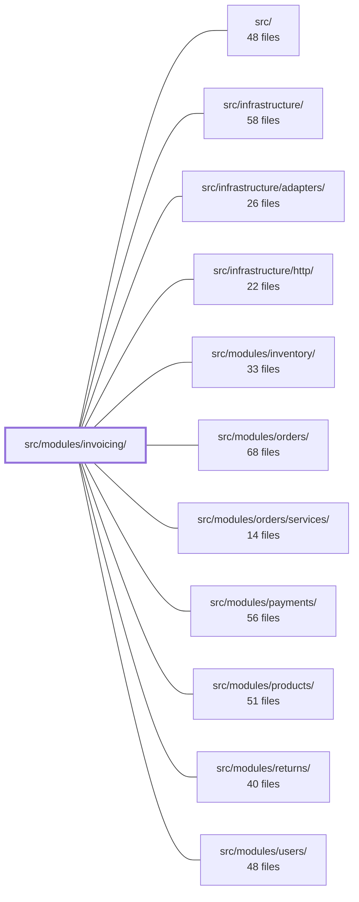

---
tags:
  - 2brain
  - 2brain/module
  - project/boilerplate-node-backend
type: module
module: src/modules/invoicing/
files: 27
updated: 2026-10-01T14:27:57.746189+00:00
---

# src/modules/invoicing/

## Purpose

The invoicing module handles the full lifecycle of generating, numbering, storing, and serving invoices and credit notes for completed orders. It orchestrates the creation of a document from order, product, and payment data, renders it to PDF, persists it, and exposes download endpoints to consumers.

## Key parts

- **`services/`** – Core business logic. `issue-invoice.ts` and `issue-credit-note.ts` orchestrate document creation; `numbering.ts` assigns sequential identifiers; `partial-credit.ts` handles credit notes that cover only a subset of an order; `personal-data.ts` manages customer details required on the document; `render.ts` assembles the final document content.
- **`providers/pdf.ts`** – Pluggable PDF generation backend used by the render step.
- **`controllers/` + `routes.ts`** – HTTP layer exposing endpoints to fetch a single invoice, list credit notes for an order, and download rendered PDFs.
- **`repository.ts`** – Persistence for issued documents (creation, lookup by order/id).
- **`model.ts`** – Domain types shared across the module (invoice, credit note, line-item shapes).
- **`emails.ts`** – Composes and dispatches notification emails when a document is issued.
- **`presenter.ts`** – Formats raw document data into the shape expected by the PDF provider.
- **`rate-limits.ts`** – Per-route rate-limit configuration to guard expensive PDF downloads.
- **`config.ts` / `module.ts` / `index.ts`** – Module wiring: dependency-injection registration, provider bindings, and the public entry point.

## How it connects

- **orders** – Invoices and credit notes are generated from an order's line items and status; the module reads order data and references the order id on every document.
- **payments** – Issue operations pull payment/tender information so the document reflects how the order was paid.
- **products** – Line-item descriptions, prices, and SKUs are resolved from product data.
- **returns** – Credit notes are triggered by or linked to return records; `partial-credit.ts` handles the subset-of-order case that returns produce.
- **users** – Billing and contact details required on the document come from the user/customer record.
- **infrastructure / http / adapters** – The module consumes the shared HTTP server, adapter patterns for external services (e.g., the PDF engine), and common middleware (auth, rate-limiting hooks).

## Where to start

1. **`services/issue-invoice.ts`** – Reading this top-level service call gives you the full happy path: gathering order/product/payment data, calling numbering, rendering, persisting, and emailing.
2. **`routes.ts`** – Maps the exposed endpoints back to the controllers so you can trace a request from URL through to the service layer.

## Connected modules

[[boilerplate-node-backend_ROOT|/ (repository root)]] · [[boilerplate-node-backend_src|src/]] · [[boilerplate-node-backend_src_infrastructure|src/infrastructure/]] · [[boilerplate-node-backend_src_infrastructure_adapters|src/infrastructure/adapters/]] · [[boilerplate-node-backend_src_infrastructure_http|src/infrastructure/http/]] · [[boilerplate-node-backend_src_modules_inventory|src/modules/inventory/]] · [[boilerplate-node-backend_src_modules_orders|src/modules/orders/]] · [[boilerplate-node-backend_src_modules_orders_services|src/modules/orders/services/]] · [[boilerplate-node-backend_src_modules_payments|src/modules/payments/]] · [[boilerplate-node-backend_src_modules_products|src/modules/products/]] · [[boilerplate-node-backend_src_modules_returns|src/modules/returns/]] · [[boilerplate-node-backend_src_modules_users|src/modules/users/]]

## Files
- `src/modules/invoicing/config.ts`
- `src/modules/invoicing/controllers/get-order-credit-note.ts`
- `src/modules/invoicing/controllers/get-order-credit-notes.ts`
- `src/modules/invoicing/controllers/get-order-invoice.ts`
- `src/modules/invoicing/emails.ts`
- `src/modules/invoicing/index.ts`
- `src/modules/invoicing/model.ts`
- `src/modules/invoicing/module.ts`
- `src/modules/invoicing/presenter.ts`
- `src/modules/invoicing/providers/index.ts`
- `src/modules/invoicing/providers/pdf.ts`
- `src/modules/invoicing/rate-limits.ts`
- `src/modules/invoicing/repository.ts`
- `src/modules/invoicing/routes.ts`
- `src/modules/invoicing/services/index.ts`
- `src/modules/invoicing/services/issue-credit-note.ts`
- `src/modules/invoicing/services/issue-invoice.ts`
- `src/modules/invoicing/services/numbering.ts`
- `src/modules/invoicing/services/partial-credit.ts`
- `src/modules/invoicing/services/personal-data.ts`
- `src/modules/invoicing/services/render.ts`
- `src/modules/invoicing/tests/integration/download.test.ts`
- `src/modules/invoicing/tests/integration/issue-credit-note.test.ts`
- `src/modules/invoicing/tests/integration/issue-invoice.test.ts`
- `src/modules/invoicing/tests/unit/emails.test.ts`
- `src/modules/invoicing/tests/unit/partial-credit.test.ts`
- `src/modules/invoicing/tests/unit/routes.test.ts`

---
[[boilerplate-node-backend_INDEX|← boilerplate-node-backend index]]
