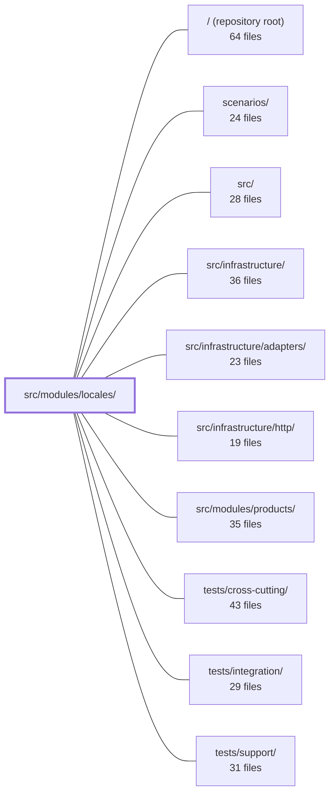

---
tags:
    - 2brain
    - 2brain/module
    - project/boilerplate-node-backend
type: module
module: src/modules/locales/
files: 38
updated: 2026-09-23T20:37:28.061295+00:00
---

# src/modules/locales/

## Purpose

The `locales` module owns all internationalization (i18n) management for the platform: registering supported languages, maintaining per-tenant dictionary entries, and providing entity-level translations (e.g. product names). It enforces a two-tier separation — a filesystem-backed tier for the API's own messages and a database-backed tier for client-editable overrides — so that a database outage degrades gracefully rather than blocking every request.

## Key parts

- **HTTP layer** (`controllers/`, `routes.ts`) — Thin Express adapters for every admin and public endpoint under `/locales`. Controllers validate input (Zod), extract params, delegate to `localeService`, and shape responses. `routes.ts` composes middleware ordering, cache tags, and permission guards per route.
- **Service layer** (`services/`) — All business logic, aggregated behind a single `localeService` facade (`services/index.ts`). Sub-modules cover language CRUD (`languages`), entry CRUD and bulk import (`entries`), message-tree reads (`messages`), entity translations with all-or-nothing PATCH (`translations`), the language capability manifest (`capabilities`), key validation and tree building (`keys`), tenant classification (`translatables`), and more.
- **Data layer** (`model.ts`, `repository.ts`) — Three Mongoose schemas (locale, localeEntry, translation) and a single repository that centralises every read/write. The repository is the one place that enforces the invariant: every entry mutation bumps the locale's `revision` counter.
- **Configuration & contracts** (`tenants.ts`, `audit.ts`, `openapi.yaml`) — `tenants.ts` declares the tenant keyspaces from environment variables (pure configuration, no DB rows). `audit.ts` defines the audit-action string vocabulary. `openapi.yaml` is the authoritative API spec and documents the two-tier model.
- **Module wiring** (`module.ts`, `index.ts`) — `module.ts` is the single entry point that registers the service, repository, and routes with the app and exposes the locale-override provider to `@infrastructure/i18n`. `index.ts` is the barrel file enforcing that sibling modules import only through it.
- **Tests** (`tests/`) — Layered suites: unit tests for pure logic (keys, tenants, audit strings, route structure, schema contracts), integration tests against real MongoDB (repository, translations, model serialization), and contract tests verifying the OpenAPI spec and the two-tier boundary.
- **Fixtures** (`factories.ts`) — Schema-conformant seed documents for tests.

## How it connects

- **`src/infrastructure/` (i18n)** — The primary consumer. `@infrastructure/i18n` reads the three collections (at boot, on a timer, and after each write) to build its in-memory translation overlay. `module.ts` registers a locale-override provider and a translation port so the infrastructure layer can pull data without importing locales internals.
- **`src/modules/products/`** — Provides its `TranslatableTarget` manifest to the locales module at boot. Locales is architecturally barred from importing sibling modules (circular-dependency rule), so the app tier injects the entity→target lookup into `services/translatables.ts`.
- **`src/infrastructure/http/`** — Supplies the Express app, routing utilities, and shared HTTP middleware that `routes.ts` and the controllers build on.
- **`tests/integration/`, `tests/cross-cutting/`, `tests/support/`** — Shared test harnesses (Mongo lifecycle, HTTP test client, fixtures) that the locales test suites import.
- **`scenarios/`** — End-to-end scenario scripts that exercise the locales API surface as part of broader deployment flows.

## Where to start

1. **`openapi.yaml`** — Read this first. It is the authoritative description of every endpoint, the two-tier locale model, and the data shapes. It tells you _what_ the module does before you need to know _how_.
2. **`module.ts`** — Shows how the service, repository, and routes are wired into the app and how the locale-override provider is handed to `@infrastructure/i18n`. Reading it gives you the dependency direction and the single public surface of the module.

## Connected modules

[[boilerplate-node-backend_ROOT|/ (repository root)]] · [[boilerplate-node-backend_scenarios|scenarios/]] · [[boilerplate-node-backend_src|src/]] · [[boilerplate-node-backend_src_infrastructure|src/infrastructure/]] · [[boilerplate-node-backend_src_infrastructure_adapters|src/infrastructure/adapters/]] · [[boilerplate-node-backend_src_infrastructure_http|src/infrastructure/http/]] · [[boilerplate-node-backend_src_modules_products|src/modules/products/]] · [[boilerplate-node-backend_tests_cross-cutting|tests/cross-cutting/]] · [[boilerplate-node-backend_tests_integration|tests/integration/]] · [[boilerplate-node-backend_tests_support|tests/support/]]

## Files

- `src/modules/locales/audit.ts` — Declares the set of audit-action identifiers that the locales module emits when an admin performs a write operation (create, update, delete, import). These strings are the sole historical record of locale/translation changes—reads are deliberately not audited. The file also augments the app-wide `AuditActionMap` so TypeScript recognizes these values as valid audit actions.
- `src/modules/locales/controllers/delete-locale-entry.ts` — Thin HTTP adapter for the `DELETE /locales/:locale/entries/:entryId` admin endpoint. It extracts route params, delegates all business logic to `localeService.deleteEntry`, and handles the HTTP response lifecycle (success, refusal, error). It exists to keep the service layer transport-agnostic.
- `src/modules/locales/controllers/delete-locale.ts` — Thin HTTP adapter for the `DELETE /locales/:locale` admin endpoint. It translates the Express request into a `localeService.deleteLanguage` call, handles the 409 refusal (active language) via a shared guard, and fires a locale-override refresh on success. All business logic and the "still active" check live in the service layer.
- `src/modules/locales/controllers/get-entity-translations.ts` — Thin HTTP adapter for the admin endpoint `GET /locales/translations/:entityType/:id`. It extracts the two path parameters, delegates to `localeService.getEntityTranslations`, and maps the service result onto an HTTP response (success or refusal). Contains no business logic.
- `src/modules/locales/controllers/get-locale-entries.ts` — Thin HTTP adapter for `GET /locales/:locale/entries` (admin). It validates query parameters, delegates to `localeService.searchEntries`, and formats the paginated result into a standard success response. It exists to keep the service layer free of Express concerns while exposing one language's flat dictionary rows for a translation-editing screen.
- `src/modules/locales/controllers/get-locale-messages.ts` — Thin HTTP adapter that exposes `GET /locales/:locale/messages`. It delegates all business logic to `localeService.readMessages` and only handles parameter extraction, response shaping, and error forwarding.
- `src/modules/locales/controllers/get-locale-tenants.ts` — Thin HTTP adapter for the `GET /locales/tenants` endpoint. It resolves the list of tenants for which this deployment holds locale data and returns it as a standard success envelope, delegating all data-access logic to `localeService`.
- `src/modules/locales/controllers/get-locales.ts` — Express controllers for the two locale endpoints: a manifest of every language the deployment offers (`GET /locales`) and the API's own filesystem-backed dictionary for a single language (`GET /locales/:locale`). They separate the database-backed "what can we do?" tier from the filesystem "here are our own messages" tier, so a database outage degrades gracefully rather than failing both.
- `src/modules/locales/controllers/upsert-entity-translations.ts` — Thin HTTP adapter for the `PATCH /locales/translations/:entityType/:id` (admin) endpoint. Parses and validates the request body, delegates to `localeService.upsertEntityTranslations`, and shapes the HTTP response. Contains no business logic.
- `src/modules/locales/controllers/write-locale-entries.ts` — HTTP handler layer for the four write routes on a language's locale entries: single-key create and update, plus bulk replace (PUT) and merge (PATCH). Each handler validates the body with a Zod schema, delegates to `localeService`, and refreshes the i18n override cache on success.
- `src/modules/locales/controllers/write-locales.ts` — Admin-only controller handlers for the two write endpoints on the locales resource: **POST /locales** (register a language in the dynamic tier) and **PUT /locales/:locale** (edit a language's display names, direction, or visibility). Each handler validates the request body with Zod, delegates to `localeService`, and shapes the HTTP response. The file exists to keep validation, authorization-context extraction, and wire-format concerns out of the service layer.
- `src/modules/locales/factories.ts` — Builds minimal, schema-conformant fixtures for the two locale collections (language and entry) so that integration and contract tests can seed deterministic data without hand-constructing full documents. It exists to separate fixture construction from the persistence layer, keeping test setup readable and ensuring only explicitly stated fields (plus schema defaults) appear in the seeded record.
- `src/modules/locales/index.ts` — Barrel file (public API surface) for the `locales` module. Enforces the strategic-DDB rule (§5) that sibling modules may only import through this file, not directly from internal subfolders.
- `src/modules/locales/model.ts` — Defines the three Mongoose schemas and models behind the **OVERRIDE tier** of i18n: registered languages, per-tenant dictionary entries, and per-entity translated fields. These collections hold the runtime-editable rows that `@infrastructure/i18n` reads (at boot, on a timer, and after a write) to build its in-memory overlay. Nothing in this file is ever awaited on the request path; a Mongo outage or malformed key degrades the overlay to stale, never blocks a request.
- `src/modules/locales/module.ts` — Module entry point for the `locales` module. At import time it wires the module's services, repository, and routes into the app's registries (translation port, locale-override provider) and exposes the manifest that `app.ts` consumes. It is the single file outside the module that may import its internals, enforcing the "reaches i18n only through `@infrastructure/i18n`" boundary.
- `src/modules/locales/openapi.yaml` — OpenAPI 3.0.3 contract for the locales module. It defines the full HTTP surface for managing supported languages, their dictionaries (two distinct tiers: deployed files and database-backed client copies), and tenant-scoped translation entries. The file is both the authoritative API spec and the primary documentation of the module's two-tier separation model.
- `src/modules/locales/repository.ts` — Data-access layer for the three locales collections (`locale`, `localeentry`, `translation`). It centralises every read and write so that the single invariant—every entry mutation bumps the locale's `revision` counter—lives in one place and cannot be bypassed by a caller.
- `src/modules/locales/routes.ts` — Express router mounted at `/locales` that wires locale discovery (public reads) and translation administration (authenticated writes) to their controllers. It is the single entry point where middleware ordering, cache tags, and permission guards are composed per-route.
- `src/modules/locales/services/capabilities.ts` — Builds the deployment's language manifest — a single list describing every offered language (static file-based and dynamic row-based), what each can do, and which tenant surface serves it. It is the service layer behind `GET /locales`, combining i18n infrastructure metadata with repository reads into a stable, sorted response.
- `src/modules/locales/services/entries.ts` — CRUD and bulk-import operations for locale entries (translated key-value rows) within a single language and tenant. Every function resolves the language by tag first, then performs the operation through the repository layer, emitting an audit record on success. It exists to centralize the validation rules (duplicate-key, key-collision, tenant-allowlist, cross-language ownership) that apply uniformly across all entry mutations.
- `src/modules/locales/services/index.ts` — Barrel/facade for the locales service layer. It aggregates every public function from the sub-modules (`keys`, `capabilities`, `entries`, `languages`, `messages`, `translatables`, `translations`, and `tenants`) into a single `localeService` object, giving controllers, `module.ts`, and tests exactly one import target. The module exists as a folder (not one file) because the service crossed ~300 lines; see `docs/theory/layers.md`.
- `src/modules/locales/services/keys.ts` — Defines every rule that decides whether a translation key can be stored or rendered. It provides pure, database-free key validation (unsafe segments, prefix collisions, duplicates) plus the flat-to-nested tree builder that `GET /locales/{locale}` serves. Internal to `services/`; deliberately not promoted to a `domain/` folder because an i18n admin has no rules worth one.
- `src/modules/locales/services/languages.ts` — Service layer for the dynamic-tier language rows: create, update, and cascade-delete a locale. Also the single home of two cross-file guard rules — refusing writes under an unknown tenant and protecting the deployment's fallback locale from deactivation or deletion — so sibling services (entries, messages) can reuse them without duplicating the check.
- `src/modules/locales/services/messages.ts` — Provides the two read paths for stored locale overrides: one that a frontend client downloads per language, and one that the API's i18n provider calls to rebuild its backend overlay. Both expand flat key-value rows through `buildMessageTree`, differing only in which tenant's keyspace they serve.
- `src/modules/locales/services/translatables.ts` — Holds the process-wide mapping from entity type → `TranslatableTarget` and exposes a minimal getter. It exists as a thin injection point: the `locales` module is architecturally barred from importing other modules to collect manifests (the same circular-dependency wall that motivates the kernel translation port), so the app tier builds the complete lookup and hands it in at boot.
- `src/modules/locales/services/translations.ts` — Service-layer door for reading and merging translations on translatable entities (e.g. `product`). Implements a two-phase **plan → write** pattern for PATCH: every locale slot is validated against the `locales` collection and the `translatables` registry before any row is touched, guaranteeing an all-or-nothing edit. Also exposes a GET handler that returns the full translation set in admin wire shape.
- `src/modules/locales/tenants.ts` — Defines the set of tenants (translation keyspaces) this deployment serves. A tenant is one consumer of the translation service, identified by the `(language, tenant, key)` tuple so that two tenants can share a key while meaning unrelated strings. The tenant list is **configuration** (read from environment variables at call time), not data — no rows are stored or managed in a database.
- `src/modules/locales/tests/contract/api.contract.test.ts` — Contract tests for the `/locales` API surface. The file verifies both the shape of every endpoint (via `toSatisfyApiSpec`) and the semantic boundary between the two locale tiers: languages shipped as deployed files (the API's own dictionaries) versus languages registered at runtime in the database (client-downloadable dictionaries). The central invariant guarded here is that a language existing in the database never implies the API can answer in it.
- `src/modules/locales/tests/integration/model.test.ts` — Integration tests that pin schema-level serialization guarantees for the `locale` and `localeEntry` Mongoose models. They exist because the OpenAPI schema declares `additionalProperties: false` on ~95 schemas, and the `.lean()` query path bypasses Mongoose's `toJSON` entirely — so serialization correctness must be asserted here rather than trusted to a single utility function.
- `src/modules/locales/tests/integration/repository.test.ts` — Integration tests for the locales module's write paths, executed against a real MongoDB instance. Despite requiring a database, they are classified as unit tests in this repo because they skip HTTP and auth. The suite targets properties an in-memory fake would satisfy by construction: revision-counter movement, cross-collection cascades, and import side-effects on rows the caller did not supply.
- `src/modules/locales/tests/integration/translations.test.ts` — Integration tests for `localeService.getEntityTranslations` and `localeService.upsertEntityTranslations` — the two methods a translator uses to read and write per-locale content. Every case runs against a real Mongo database (not mocks) to exercise the full write path: registry validation, locale-existence checks, derived-index-column writes on `products`, and the `sourceDigest` stamping between sibling rows.
- `src/modules/locales/tests/unit/audit.test.ts` — Unit test that pins the exact string values of the locales audit-action vocabulary. Because these strings are a wire contract consumed by external log queries, dashboards, and alert rules, this file acts as the owner-level assertion: if a value is renamed, this test breaks before the string ships.
- `src/modules/locales/tests/unit/routes.test.ts` — Asserts the structural contract of the locales Express router: which endpoints exist and in what order, which guards each route carries, and how caching is configured. The assertions are written as _pinned decisions_—public reads are intentionally unguarded, and admin routes self-declare their guard chain—so that "refactoring" either convention fails the suite rather than silently changing behavior.
- `src/modules/locales/tests/unit/schema-contract.test.ts` — Unit tests that lock down the schema contracts for the locales collections — required paths, unique indexes, field normalisation, defaults, and the `deriveBaseLanguage` helper. They exist to make database-level invariants (e.g. "one row per tag", "one value per locale+tenant+key") explicit, regression-guarded facts rather than implicit assumptions.
- `src/modules/locales/tests/unit/service.test.ts` — Unit tests for the pure decision logic in `localeService`: the message-tree builder, key-collision detection, batch validation, unsafe-segment guarding, capability merging, RTL detection, and language naming. These functions fail silently (dropped keys, phantom capabilities) rather than throwing at the DB layer, so they are asserted here in isolation; the write paths that call them are covered by `repository.test.ts` and the HTTP contract suite.
- `src/modules/locales/tests/unit/tenants.fixture.ts` — Test fixture that supplies the two demo tenant IDs used by unit and integration test suites. The IDs are read live from the locale registry (`tenants.ts`) rather than hardcoded, so a test can never drift from the values the service actually accepts.
- `src/modules/locales/tests/unit/tenants.test.ts` — Unit tests for the tenant registry in `tenants.ts`. Verifies that the six exported readers (`listTenants`, `backendTenant`, `frontendTenant`, `frontendTenantIds`, `isFrontendTenant`, `isKnownTenant`) behave correctly against the three `NODE_LOCALE_TENANT*` environment variables, including default values, custom overrides, extra-tenant parsing, and classification.
- `src/modules/locales/tests/unit/translations.test.ts` — Unit tests for the pure function `deriveSourceDigest`, which computes a deterministic fingerprint of a translation's source fields. This file isolates the digest logic from any database or registry interaction; those concerns live in the sibling integration test.

---

[[boilerplate-node-backend_INDEX|← boilerplate-node-backend index]]
