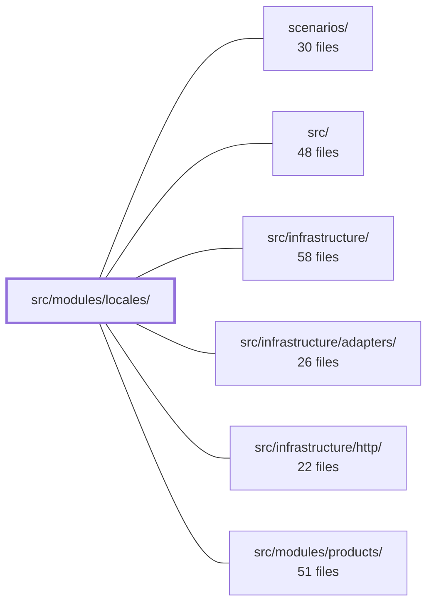

---
tags:
  - 2brain
  - 2brain/module
  - project/boilerplate-node-backend
type: module
module: src/modules/locales/
files: 43
updated: 2026-10-01T14:28:13.236676+00:00
---

# src/modules/locales/

## Purpose

The locales module provides the full internationalization (i18n) service for the platform: registering languages, managing per-tenant translation entries, and storing translations for translatable entities. It exposes two distinct data tiers—a static, filesystem-backed API dictionary and a dynamic, database-backed tier for client-editable overrides—and enforces the boundary between them so that a database outage degrades gracefully.

## Key parts

- **Model & persistence** — `model.ts` defines the Mongoose schemas, indexes, and validation helpers for the three collections (languages, locale entries, entity translations). `repository.ts` wraps every database query and enforces the invariant that each entry-write bumps the language `revision` counter to signal clients to re-fetch.
- **Service layer** — `services/languages.ts` (language CRUD + cascade), `services/entries.ts` (per-key translation CRUD), `services/translations.ts` (entity-translation plan-then-apply writes), `services/messages.ts` (read paths that expand rows into nested trees), `services/capabilities.ts` (merges both tiers into a stable locale manifest), `services/overlay.ts` (post-write overlay refresh), `services/keys.ts` (key validation + tree builder), and `services/translatables.ts` (externally-injected entity-type registry). `services/index.ts` bundles them all into a single `localeService` export.
- **HTTP layer** — `routes.ts` mounts the Express router at `/locales`, applying per-route auth and cache-invalidation middleware. The `controllers/` folder holds thin adapters (one file per endpoint family) that extract params, validate bodies, delegate to `localeService`, and shape responses.
- **Module wiring** — `module.ts` declares the module manifest and installs the two kernel ports (locale-override provider, translation port) at boot. `index.ts` is the barrel that enforces the rule that sibling modules may only import through this file. `tenants.ts` defines the tenant keyspace as environment-derived configuration. `audit.ts` declares the audit-action identifiers emitted on admin writes.
- **Contracts & tests** — `openapi.yaml` documents the REST surface and encodes the two-tier boundary. `tests/` covers unit (schema contracts, router invariants, pure service logic), integration (repository writes, model serialization, translation round-trips), and contract (API shape vs. spec, tier-boundary semantics) levels.

## How it connects

- **`src/modules/products/`** — The translations service writes a derived index column on product documents when an entity's translation is upserted, and `translatables.ts` registers the `products` entity type as a valid translation target. The integration tests in `translations.test.ts` verify this cross-module write path.
- **`src/infrastructure/http/`** — Controllers and `routes.ts` build on the shared Express infrastructure (routing, middleware, response envelopes) provided by this layer.
- **`src/infrastructure/adapters/`** — `repository.ts` issues its MongoDB queries through the persistence adapter defined here, isolating the module from driver specifics.
- **`src/`** — The module lives under the application source tree and participates in the kernel's module-registration lifecycle; `index.ts` is the only import surface other modules under `src/` may use.

## Where to start

Read `model.ts` first—it is the single source of truth for the three collections' shapes, indexes, and the `baseLanguage` derivation hook, and everything else (services, repository, controllers) is organized around it. Then open `services/languages.ts` to see the primary CRUD flow, how cascade deletes work, and where the fallback-locale guard lives; from there the rest of the service layer and the thin controllers become straightforward to follow.

## Connected modules

```mermaid
flowchart LR
    m_src_modules_locales["src/modules/locales/"]
    m_scenarios["scenarios/<br/>30 files"]
    m_src["src/<br/>48 files"]
    m_src_infrastructure["src/infrastructure/<br/>58 files"]
    m_src_infrastructure_adapters["src/infrastructure/adapters/<br/>26 files"]
    m_src_infrastructure_http["src/infrastructure/http/<br/>22 files"]
    m_src_modules_products["src/modules/products/<br/>51 files"]
    m_src_modules_locales --- m_scenarios
    m_src_modules_locales --- m_src
    m_src_modules_locales --- m_src_infrastructure
    m_src_modules_locales --- m_src_infrastructure_adapters
    m_src_modules_locales --- m_src_infrastructure_http
    m_src_modules_locales --- m_src_modules_products
    style m_src_modules_locales stroke-width:3px
```

[[boilerplate-node-backend_ROOT|/ (repository root)]] · [[boilerplate-node-backend_scenarios|scenarios/]] · [[boilerplate-node-backend_src|src/]] · [[boilerplate-node-backend_src_infrastructure|src/infrastructure/]] · [[boilerplate-node-backend_src_infrastructure_adapters|src/infrastructure/adapters/]] · [[boilerplate-node-backend_src_infrastructure_http|src/infrastructure/http/]] · [[boilerplate-node-backend_src_modules_products|src/modules/products/]]

## Files
- `src/modules/locales/audit.ts` — Declares the set of audit-action identifiers that the locales module emits when an admin performs a write operation (create, update, delete, import). These strings are the sole historical record of locale/translation changes—reads are deliberately not audited. The file also augments the app-wide `AuditActionMap` so TypeScript recognizes these values as valid audit actions.
- `src/modules/locales/controllers/create-locale.ts` — Handles `POST /locales` (admin) to register a new language in the dynamic tier. It validates the request body, delegates to `localeService.createLanguage`, and returns the created document. It is the create half of a three-file split (create / update / delete) for locale management.
- `src/modules/locales/controllers/delete-locale-entry.ts` — Thin HTTP adapter that handles `DELETE /locales/:locale/entries/:entryId` (admin). It extracts route params and caller context from the Express request, delegates to `localeService.deleteEntry`, and writes the HTTP response — no business logic lives here.
- `src/modules/locales/controllers/delete-locale.ts` — Thin HTTP adapter for the `DELETE /locales/:locale` (admin) endpoint. It extracts the locale param and caller context from the request, delegates to `localeService.deleteLanguage`, and maps the service result onto an Express response. It contains no business logic.
- `src/modules/locales/controllers/get-entity-translations.ts` — Thin Express controller for the admin route `GET /locales/translations/:entityType/:id`. It reads the two URL params, delegates to `localeService.getEntityTranslations`, and serialises the result (or an error) into an HTTP response. It exists solely to bridge the HTTP layer to the service layer.
- `src/modules/locales/controllers/get-locale-entries.ts` — Thin HTTP adapter that exposes `GET /locales/:locale/entries` (admin). It validates query params, delegates to `localeService.searchEntries`, and shapes the response as `LocaleEntriesResponse`. Exists so the translation-editing screen can list flat, paginated dictionary rows for a single locale — deliberately uncached because a translator is actively typing into this data.
- `src/modules/locales/controllers/get-locale-messages.ts` — Thin HTTP adapter that exposes `GET /locales/:locale/messages`. It delegates all business logic to `localeService.readMessages` and only handles parameter extraction, response shaping, and error forwarding.
- `src/modules/locales/controllers/get-locale-tenants.ts` — Thin HTTP adapter for the `GET /locales/tenants` endpoint. It resolves the list of tenants for which this deployment holds locale data and returns it as a standard success envelope, delegating all data-access logic to `localeService`.
- `src/modules/locales/controllers/get-locales.ts` — Express controllers for the two locale endpoints: a manifest of every language the deployment offers (`GET /locales`) and the API's own filesystem-backed dictionary for a single language (`GET /locales/:locale`). They separate the database-backed "what can we do?" tier from the filesystem "here are our own messages" tier, so a database outage degrades gracefully rather than failing both.
- `src/modules/locales/controllers/update-locale.ts` — Handler pair for `PUT /locales/:locale` (full replace) and `PATCH /locales/:locale` (partial merge), built via the shared `createUpdateController` factory. The locale tag is always sourced from the path parameter — it is the dictionary's identity and cannot be overridden from the request body.
- `src/modules/locales/controllers/write-entity-translations.ts` — Thin HTTP adapter exposing `PUT` and `PATCH /locales/translations/:entityType/:id`. It validates the request body against a Zod schema, delegates to the appropriate `localeService` method (full replace vs. merge/upsert), and formats the success or refusal response. The file exists to keep route wiring in `routes.ts` to a single-line import and to centralize the shared validation/dispatch logic for both verbs.
- `src/modules/locales/controllers/write-locale-entries.ts` — HTTP controller layer for the four mutating locale-entry routes: create one entry, update one entry's value, replace all entries (PUT), and merge/upsert a subset (PATCH). Sits between the Express router and `localeService`, handling body validation, caller-context extraction, and response shaping.
- `src/modules/locales/factories.ts` — Builds minimal, schema-conformant fixtures for the two locale collections (language and entry) so that integration and contract tests can seed deterministic data without hand-constructing full documents. It exists to separate fixture construction from the persistence layer, keeping test setup readable and ensuring only explicitly stated fields (plus schema defaults) appear in the seeded record.
- `src/modules/locales/index.ts` — Barrel file (public API surface) for the `locales` module. Enforces the strategic-DDB rule (§5) that sibling modules may only import through this file, not directly from internal subfolders.
- `src/modules/locales/model.ts` — Defines the Mongoose schemas, models, document types, and shared validation helpers for the three collections behind the i18n OVERRIDE tier: registered languages, per-tenant dictionary entries, and per-entity translations. This file is the single source of truth for shape, indexes, and derivation logic; nothing here is awaited on the request path — `t()` resolves via a boot/timer/after-write overlay.
- `src/modules/locales/module.ts` — Module manifest and boot-time wiring for the **locales** module. It declares the module's identity (name, base path, routes, permissions, locale files, personal-data level) and defines the single `onRegistered` callback that the kernel invokes once all enabled modules are known. That callback is where the module's two kernel ports (locale-override provider and translation port) are actually installed.
- `src/modules/locales/openapi.yaml` — OpenAPI 3.0.3 contract for the **locales** module. It documents the REST surface for managing languages and translation entries, and — more importantly — encodes the architectural split between two tiers of locale data (deployed API dictionary vs. client-editable database rows) so that every consumer knows which capability a given endpoint actually provides.
- `src/modules/locales/presenters.ts`
- `src/modules/locales/repository.ts` — Encapsulates all database queries for the three locales collections (languages, locale entries, translations) and enforces one structural invariant: every write path to `localeentries` goes through a function in this file that also bumps the language's `revision` counter, so no service can mutate an entry without signaling clients to re-fetch.
- `src/modules/locales/routes.ts` — Express router mounted at `/locales` that wires every locale and translation endpoint to its controller. It splits the surface into a small set of public GET reads (open to unauthenticated clients) and a larger set of admin-gated writes, applying per-route authorization middleware and Redis cache invalidation inline rather than via a shared `router.use`.
- `src/modules/locales/services/capabilities.ts` — Builds the locale manifest for a deployment: which languages are available and what each can do. Merges two tiers — statically deployed language files and dynamically registered database rows — into a single, stable `LocaleCapability[]` without conflating their sources. Also exposes the access-control scope that gates which rows a caller may read.
- `src/modules/locales/services/entries.ts` — Service layer for individual locale entries (one language's translated keys). Provides the read (paginated search), create, update, delete, and bulk-import operations that the locale editing surface calls, all scoped to a language tag and a tenant keyspace.
- `src/modules/locales/services/index.ts` — Barrel that bundles every function the locales service layer exposes into a single `localeService` namespace object. It exists so that controllers, `module.ts`, and tests all import one name rather than a list of individual functions, keeping the public surface to a single point of change when the underlying folder (which grew past ~300 lines) is refactored.
- `src/modules/locales/services/keys.ts` — Defines every rule that decides whether a translation key can be stored or rendered. It provides pure, database-free key validation (unsafe segments, prefix collisions, duplicates) plus the flat-to-nested tree builder that `GET /locales/{locale}` serves. Internal to `services/`; deliberately not promoted to a `domain/` folder because an i18n admin has no rules worth one.
- `src/modules/locales/services/languages.ts` — Service layer for language (locale) CRUD — creating, editing, and deleting language rows plus their cascaded entries/translations. Also the shared home for two cross-service validation rules: refusing writes under an unknown tenant and protecting the deployment's fallback locale from deactivation or deletion.
- `src/modules/locales/services/messages.ts` — Provides the two read paths that hand out stored locale copy: `readMessages` serves a frontend tenant's downloadable overrides for one language, and `readApiOverrides` returns the backend tenant's full override set grouped by language. Both expand flat key/value rows into nested trees via `buildMessageTree`; they differ in which tenant's keyspace they serve and how they treat inactive languages.
- `src/modules/locales/services/overlay.ts` — A single-purpose wrapper that triggers a database overlay refresh after any write that may have changed locale overrides. By centralising the refresh call here, every write path in `entries.ts` and `languages.ts` picks it up by construction, so a future write path can't silently forget the refresh.
- `src/modules/locales/services/translatables.ts` — Holds a process-wide, mutable lookup from `entityType` to a `TranslatableTarget`, populated once at boot and read throughout the `locales` services. It exists because `locales` cannot import from `src/modules/*` to gather each module's manifest entry (the same circular-dependency wall the `kernel/translation` port works around), so the registry is assembled externally and injected here.
- `src/modules/locales/services/translations.ts` — Service layer that reads and writes translation data for translatable entities. It enforces a strict **plan-then-apply** pattern: a batch of locale slots is fully validated (field names, locale existence, fallback-locale delete guard) before any single write executes, so a malformed slot can never leave a partial edit. It is generic across whatever the `translatables` registry declares and never touches an entity's own collection except through the derived-index-column write.
- `src/modules/locales/tenants.ts` — Defines the set of tenants (translation keyspaces) this deployment serves. A tenant is one consumer of the translation service, identified by the `(language, tenant, key)` tuple so that two tenants can share a key while meaning unrelated strings. The tenant list is **configuration** (read from environment variables at call time), not data — no rows are stored or managed in a database.
- `src/modules/locales/tests/contract/api.contract.test.ts` — Contract tests for the `/locales` API surface. They assert that responses satisfy the `openapi.yaml` spec (shape) and pin the semantic boundary between two tiers of locale data: **deployed** (static files the API can serve copy from) and **dynamic** (rows in the database that a client can download but the API cannot answer in). The tests exist so that collapsing or blurring that boundary fails here rather than in a downstream client.
- `src/modules/locales/tests/contract/support.ts`
- `src/modules/locales/tests/contract/translations.contract.test.ts`
- `src/modules/locales/tests/factories.ts` — Test-persistence layer for locale fixtures. It wraps the pure builder (`makeLocale`) from the production factories module with a single `repository.create` call so that integration tests get a real row in the test database without repeating that two-step pattern.
- `src/modules/locales/tests/integration/model.test.ts` — Integration tests that pin the serialization contract of the locale and locale-entry Mongoose models against a real database. They verify that neither `_id` nor `__v` leaks on either response path (hydrated `toJSON` or `.lean()` list), that schema defaults are populated on write, and that the `baseLanguage` derivation hook behaves correctly regardless of caller input. These assertions exist because 95 schemas in `openapi.yaml` are `additionalProperties: false`, so a leaked internal field would break every client.
- `src/modules/locales/tests/integration/repository.test.ts` — Integration tests for the locales module's write paths, executed against a real MongoDB instance. They verify behaviors that an in-memory fake would satisfy by construction: the revision counter advancing per write, cascading deletes across two collections, and `importEntries` side-effects on rows not included in the payload. No HTTP or auth is involved.
- `src/modules/locales/tests/integration/translations.test.ts` — Integration tests for `localeService.getEntityTranslations` and `localeService.upsertEntityTranslations`, run against a real MongoDB instance. Covers the full translation write/read path: registry validation, `locales` collection checks, derived-index-column writes on the `products` entity, and source-digest stamping on sibling rows.
- `src/modules/locales/tests/unit/routes.test.ts` — Unit tests for the locales router that lock down three invariants: the exact set and order of mounted routes, the per-route authorization guard chain, and the caching strategy. Each assertion exists so that a well-intentioned "fix" (adding a router-level auth gate, reordering routes, changing cache tags) fails loudly rather than silently breaking anonymous clients, Express first-match routing, or translator feedback loops.
- `src/modules/locales/tests/unit/schema-contract.test.ts` — Unit tests that lock down the schema contracts for the locales collections — required paths, unique indexes, field normalisation, defaults, and the `deriveBaseLanguage` helper. They exist to make database-level invariants (e.g. "one row per tag", "one value per locale+tenant+key") explicit, regression-guarded facts rather than implicit assumptions.
- `src/modules/locales/tests/unit/service.test.ts` — Unit tests for the pure decision logic in `localeService`: the message-tree builder, key-collision detection, batch validation, unsafe-segment guarding, capability merging, RTL detection, and language naming. These functions fail silently (dropped keys, phantom capabilities) rather than throwing at the DB layer, so they are asserted here in isolation; the write paths that call them are covered by `repository.test.ts` and the HTTP contract suite.
- `src/modules/locales/tests/unit/tenants.fixture.ts` — Test fixture that supplies the two demo tenant IDs used by unit and integration test suites. The IDs are read live from the locale registry (`tenants.ts`) rather than hardcoded, so a test can never drift from the values the service actually accepts.
- `src/modules/locales/tests/unit/tenants.test.ts` — Unit tests for the tenant registry in `tenants.ts`. Verifies that the six exported readers (`listTenants`, `backendTenant`, `frontendTenant`, `frontendTenantIds`, `isFrontendTenant`, `isKnownTenant`) behave correctly against the three `NODE_LOCALE_TENANT*` environment variables, including default values, custom overrides, extra-tenant parsing, and classification.
- `src/modules/locales/tests/unit/translations.test.ts` — Unit tests for the pure function `deriveSourceDigest`, which computes a deterministic fingerprint of a translation's source fields. This file isolates the digest logic from any database or registry interaction; those concerns live in the sibling integration test.

---
[[boilerplate-node-backend_INDEX|← boilerplate-node-backend index]]
