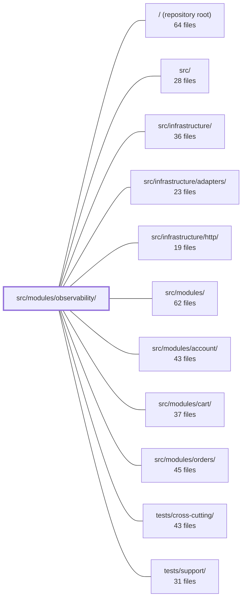

---
tags:
  - 2brain
  - 2brain/module
  - project/boilerplate-node-backend
type: module
module: src/modules/observability/
files: 25
updated: 2026-09-23T20:37:47.441065+00:00
---

# src/modules/observability/

## Purpose

The observability module is the operator-facing read-only surface of the service. It exposes readiness health, a live SSE metrics stream, a Prometheus scrape endpoint, a structured JSON metrics overview, and a filtered audit-log query — all mounted under `/observability`. It owns no data and emits no domain events; its sole job is to project the service's internal state (dependencies, process resources, job queues, domain counters) into consumable wire formats for dashboards, orchestrators, and Prometheus.

## Key parts

- **Module manifest & routing** — `module.ts` declares identity, base path, single permission key, and boot config so the kernel can mount the module. `routes.ts` wires the five endpoints with per-route guards (browser `EventSource`, bearer-token Prometheus, standard API clients each need different auth). `index.ts` is the only legal import entry point for sibling modules.
- **API contracts** — `openapi.yaml` pins the five REST endpoints' schemas; `asyncapi.yaml` specifies the SSE stream and is merged by a bundler into the repo-root AsyncAPI contract.
- **Controllers** — `get-observability-health.ts` assembles the readiness payload; `get-observability-metrics-overview.ts` aggregates domain counters resolved by metric name (no direct imports from sibling modules); `get-observability-audit.ts` provides a filtered, paged view of the shared audit-logs collection.
- **Health & metric services** — `services/dependency-health.ts` reads in-memory connection state for DB, cache, and queue; `services/job-health.ts` and `services/parked-jobs.ts` perform broker/DB I/O for lease and dead-letter counts; `services/process-snapshot.ts` gives a single atomic memory/uptime read shared across three consumers; `services/stream.ts` implements the 5-second SSE push loop.
- **Metrics helpers** — `http-readback.ts` collapses prom-client HTTP histogram buckets into p50/p95/total for UI-facing consumers; `metrics-scraper.ts` guards the Prometheus scrape route with a static bearer credential.
- **Tests** — A contract suite pins the three JSON endpoints against the OpenAPI spec; unit suites lock down state-mapping semantics, percentile math, wire-shape details (e.g. `lastSuccessAt` as ISO string), SSE lifecycle, and the bearer-token guard's security properties.

## How it connects

- **Repository root** — The module's `asyncapi.yaml` is a self-contained slice that a bundler merges into the root-level AsyncAPI contract, keeping the async contract readable per-module while assembling a whole-service view.
- **`src/infrastructure/` & `src/infrastructure/adapters/`** — `dependency-health` reads the in-memory connection state that the database, cache, and queue adapters maintain; `parked-jobs` queries the broker directly; `job-health` issues a `leases` query. These are the module's only I/O paths beyond the HTTP layer.
- **`src/infrastructure/http/`** — `http-readback.ts` consumes the shared prom-client HTTP counters and duration histogram that the HTTP infrastructure layer records on every request.
- **Sibling domain modules (`account`, `cart`, `orders`)** — `get-observability-metrics-overview` resolves their counters **by metric name** off the shared prom-client registry rather than importing their counter objects. The `module-coupling-observability` dependency-cruiser rule enforces that no direct import exists between this module and any domain module.
- **`tests/support/` & `tests/cross-cutting/`** — Shared test utilities and cross-cutting fixtures that the module's contract and unit suites consume.

## Where to start

Read `module.ts` first — it's a single short file that tells you the module's name, base path, permission key, and what the kernel expects to mount. Then read `routes.ts`, which lays out all five endpoints in one file and shows how the three incompatible auth schemes are assigned per-route. Together they give you the full surface and the auth model before you dive into any service or controller.

## Connected modules

[[boilerplate-node-backend_ROOT|/ (repository root)]] · [[boilerplate-node-backend_src|src/]] · [[boilerplate-node-backend_src_infrastructure|src/infrastructure/]] · [[boilerplate-node-backend_src_infrastructure_adapters|src/infrastructure/adapters/]] · [[boilerplate-node-backend_src_infrastructure_http|src/infrastructure/http/]] · [[boilerplate-node-backend_src_modules|src/modules/]] · [[boilerplate-node-backend_src_modules_account|src/modules/account/]] · [[boilerplate-node-backend_src_modules_cart|src/modules/cart/]] · [[boilerplate-node-backend_src_modules_orders|src/modules/orders/]] · [[boilerplate-node-backend_tests_cross-cutting|tests/cross-cutting/]] · [[boilerplate-node-backend_tests_support|tests/support/]]

## Files
- `src/modules/observability/asyncapi.yaml` — Self-contained AsyncAPI 3.0.0 document that specifies the SSE stream served at `/observability/events`. It exists as a lintable, independently readable slice of the service's async contract; a bundler later merges its servers, channels, operations, and components into the repo-root contract.
- `src/modules/observability/controllers/get-observability-audit.ts` — Controller for `GET /observability/audit`. It exposes a filtered, paged view of the shared audit-logs collection, making this the sole point where the observability module reads beyond its own process snapshot. It exists so dashboards or API consumers can query historical audit events (by actor, action, outcome, time range) without coupling directly to the audit-logs module.
- `src/modules/observability/controllers/get-observability-health.ts` — Single-route controller for `GET /observability/health`. It assembles a **readiness** snapshot—dependency status, telemetry-sink configuration, process resources, and per-job/queue health—into one JSON payload. Readiness is deliberately distinct from liveness (`GET /`), so an orchestrator that restarts on liveness failure won't churn the process when the real problem is a downed Redis or Mongo.
- `src/modules/observability/controllers/get-observability-metrics-overview.ts` — Controller for `GET /observability/metrics/overview`. Aggregates HTTP, auth, business, database, and process metrics into a single structured JSON response. It resolves every domain counter **by metric name** off the shared prom-client registry instead of importing the counter objects, which keeps this module decoupled from the domain modules it reports on (enforced by the `module-coupling-observability` dependency-cruiser rule).
- `src/modules/observability/http-readback.ts` — Reads the shared prom-client HTTP counters and duration histogram and collapses them into the simple aggregate numbers (total requests, total errors, p50, p95) consumed by the in-app `GET /observability/metrics/overview` endpoint and the SSE metrics stream. It exists so that UI-facing code never has to interpret raw Prometheus histogram bucket semantics directly.
- `src/modules/observability/index.ts` — Public barrel (re-export) file for the `observability` module. It is the **only** entry point a sibling module may import from, per the strategic DDD convention (`docs/theory/strategic-ddd.md` §5). It currently exposes the module's readiness/telemetry services so that future external callers reach them here rather than via a deep import into `./services`.
- `src/modules/observability/metrics-scraper.ts` — Express middleware that guards the single Prometheus scrape route (`GET /observability/metrics`) with a static bearer credential. It exists as a separate file from the route because Prometheus cannot hold a session token, so the standard `platform.observability.any.read` check used by other observability routes is not applicable here.
- `src/modules/observability/module.ts` — Module manifest for the operator-facing observability module. Declares the module's identity (name, base path), its single permission key, its HTTP router, required boot config, locale path, and personal-data classification so the kernel can mount and govern it. Owns no data and exposes no events — it is purely a URL and permission surface.
- `src/modules/observability/openapi.yaml` — OpenAPI 3.0.3 contract for the observability module. Defines the five endpoints (SSE event stream, readiness health, raw Prometheus metrics, JSON metrics overview, and audit log) along with their request/response schemas. Serves as the single source of truth for what the observability surface exposes, its auth requirements, and its error shapes.
- `src/modules/observability/routes.ts` — Express route table for the operator dashboard under `/observability`. Guards are assigned per-route (not shared) because the five endpoints serve callers with incompatible auth capabilities: a browser `EventSource`, a Prometheus scraper, and standard API clients.
- `src/modules/observability/services/dependency-health.ts` — Provides a **readiness** health snapshot of every backing service (database, cache, queue) by reading their already-tracked in-memory state. It powers `GET /observability/health` and is deliberately decoupled from the liveness check (`GET /`) that drives orchestrator restart decisions, so a degraded dependency reports degraded without killing a healthy container.
- `src/modules/observability/services/index.ts` — Barrel file for the observability services directory. It re-publishes all service exports in a single entry point so consumers (primarily `src/modules/observability/index.ts`) can import from one path instead of reaching into individual files. Contains no logic of its own.
- `src/modules/observability/services/job-health.ts` — Provides the job-health slice of the `GET /observability/health` endpoint. Unlike `dependency-health.ts`, this module performs I/O (a single `leases` query) because no in-memory record of scheduled-job outcomes exists in the process. It translates raw lease summaries into the `ObservabilityHealthJob[]` wire shape.
- `src/modules/observability/services/parked-jobs.ts` — Provides the queue component of `GET /observability/health` by reading each worker queue's current dead-letter (parked) depth live from the broker. Unlike `dependency-health.ts`, this service performs I/O because parked counts exist only on the broker, not in process memory.
- `src/modules/observability/services/process-snapshot.ts` — Provides a single atomic read of process memory and uptime so that three consumers (the SSE stream and two REST endpoints) all publish numbers from the same instant. Without this, independent calls to `process.memoryUsage()` / `process.uptime()` across those consumers could drift and present as a bug. All values are in bytes; uptime is integer seconds.
- `src/modules/observability/services/stream.ts` — Implements a one-way Server-Sent Events (SSE) endpoint that pushes live process and HTTP metrics to a dashboard every 5 seconds. Chosen over WebSockets because the data is server→client only, it uses plain HTTP (no protocol upgrade), and the browser's built-in `EventSource` handles reconnection automatically.
- `src/modules/observability/tests/contract/api.contract.test.ts` — Contract tests for the three JSON `/observability` endpoints (`/health`, `/metrics/overview`, `/audit`) that are hand-assembled rather than serializer-driven. They pin response shapes against the OpenAPI spec (`toSatisfyApiSpec()`) and assert specific field semantics that a pure shape check cannot catch (e.g. database state reflects a live connection, audit entries actually land, out-of-range parameters return 422). `GET /events` (SSE) and `GET /metrics` (token-gated) are intentionally excluded for transport reasons.
- `src/modules/observability/tests/unit/dependency-health.test.ts` — Unit tests for the dependency-health readiness fold. Pins the mapping from each dependency's raw connection state to its semantic word (`ready`, `connecting`, `unavailable`, `disabled`) and verifies the `overallStatus` aggregation rule — specifically that `disabled` never degrades a service while `connecting` and `unavailable` always do. Exists because a contract/integration test can only assert the payload shape; this file is where the *meaning* of each state is locked down.
- `src/modules/observability/tests/unit/http-readback.test.ts` — Unit tests for the `percentileFromHistogramBuckets` helper, verifying that it correctly maps a target percentile to an upper-bound value from a list of histogram buckets.
- `src/modules/observability/tests/unit/job-health.test.ts` — Unit tests for the `jobHealth` service that back the jobs half of `GET /observability/health`. The entire suite guards one wire-shape contract: `lastSuccessAt` must be an ISO-8601 **string** in the response, not a `Date` object. Because `JSON.stringify` produces identical output for both, the failure would be invisible to a passing contract test and only surface when a consumer reads the field directly.
- `src/modules/observability/tests/unit/metrics-overview.test.ts` — Unit test for the `GET /observability/metrics/overview` endpoint. It verifies that each domain row in the response payload carries the actual counter value resolved by metric **name** from the shared Prometheus registry, and that a missing counter (e.g. after a module is deleted) degrades to `0` without breaking the fixed response shape.
- `src/modules/observability/tests/unit/metrics-scraper.test.ts` — Unit tests for `isMetricsScraper`, the bearer-token credential guard on `GET /observability/metrics`. The tests pin down three security properties that each fail silently if broken: default-deny when no token is configured, rejection of tokens without the `Bearer` scheme, and safe handling of length-mismatched tokens (preventing both a 500 and a timing oracle).
- `src/modules/observability/tests/unit/parked-jobs.test.ts` — Unit test for the `queueHealth` function (the queue half of `GET /observability/health`). It verifies that `queueHealth` is a thin pass-through of `parkedCounts()` with no shape transformation, covering both populated and empty results.
- `src/modules/observability/tests/unit/routes.test.ts` — Unit tests for the observability route table and its two inline handlers (`GET /events` SSE stream, `GET /metrics` Prometheus scrape). Because the handlers live inline in `routes.ts` rather than in a separate controller, the tests reach them by walking the Express router's `stack` and verify guard wiring, response behavior, and the critical error path where `/metrics` must still emit a parseable exposition.
- `src/modules/observability/tests/unit/stream.test.ts` — Unit test suite for the SSE metrics stream service (`streamObservabilityMetrics` and `buildObservabilityPayload`). It verifies wire-format correctness, timer cadence, connection lifecycle (open/disconnect counting), permission recheck behavior, and error containment — the three categories of silent failure the service is designed to prevent. All timing is driven by `jest.useFakeTimers` and `getHttpRequestCounters` is mocked, so every frame is deterministic.

---
[[boilerplate-node-backend_INDEX|← boilerplate-node-backend index]]
