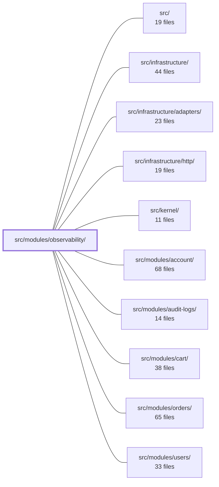

---
tags:
  - 2brain
  - 2brain/module
  - project/boilerplate-node-backend
type: module
module: src/modules/observability/
files: 30
updated: 2026-09-27T16:21:01.937805+00:00
---

# src/modules/observability/

## Purpose

The observability module is the service's read-only operator dashboard. It exposes five endpoints under `/observability`—a detailed health report, a Prometheus scrape target, a JSON metrics summary, a live SSE metrics stream, and a filtered audit-log view—so that dashboards, scrapers, and API consumers can inspect process and backing-service state without coupling directly to business domains.

## Key parts

- **Module manifest & routing** — `module.ts` declares identity, base path, permission, and route table to the kernel registry. `routes.ts` wires each endpoint to its appropriate auth guard (cookie, static bearer, or admin JWT). `index.ts` is the sole public barrel for sibling imports.
- **Controllers** — One thin file per endpoint: `get-observability-health.ts`, `get-observability-metrics.ts`, `get-observability-metrics-overview.ts`, `get-observability-events.ts` (SSE), and `get-observability-audit.ts`. Each delegates to the services layer.
- **Services layer** (`services/`) — The real logic:
  - `health.ts` composes the full health payload.
  - `dependency-health.ts` reports readiness of database, cache, and queue adapters.
  - `job-health.ts` reads last-outcome of crontab jobs from the leases collection.
  - `parked-jobs.ts` reads dead-letter depths live from the broker.
  - `process-snapshot.ts` provides a single atomic memory/uptime read shared across consumers.
  - `stream.ts` implements the 5-second SSE push loop with periodic permission rechecks.
- **Metrics tooling** — `metrics-scraper.ts` (bearer-token guard for Prometheus) and `http-readback.ts` (collapses raw prom-client histogram buckets into p50/p95 for UI-facing consumers).
- **API contracts** — `openapi.yaml` (five REST endpoints) and `asyncapi.yaml` (the SSE channel); a bundler merges both into the repo-root contract.
- **Tests** — A contract test pins JSON response shapes; unit tests cover each service, the SSE stream, the scraper guard, and the router's structural wiring.

## How it connects

- **`src/kernel/`** — `module.ts` registers the module (routes, permission, config) with the kernel so the service can mount and guard it.
- **`src/infrastructure/adapters/`** — `dependency-health.ts` reads the already-tracked connection state of database, cache, and queue adapters; `parked-jobs.ts` reads dead-letter counts from the broker adapter.
- **`src/infrastructure/http/`** — Provides the shared prom-client registry and standard Express response helpers that the controllers and `http-readback.ts` consume.
- **`src/modules/audit-logs/`** — `get-observability-audit.ts` is the sole consumer that reads the shared audit-logs collection, keeping dashboard queries decoupled from that module's internals.
- **Business domain modules** (`cart`, `orders`, `account`, `users`) — Their Prometheus counters are resolved **by name** off the shared registry in `get-observability-metrics-overview.ts`, so this module survives deletion of any single domain.
- **Repository root** — `asyncapi.yaml` is designed to be merged into the root-level async contract by a build bundler.

## Where to start

1. **`module.ts`** — One short file that names the module, its base path, its permission string, and its full route table. Reading it first gives you the endpoint surface and the auth model in under 30 seconds.
2. **`services/health.ts`** — The most substantive service in the module. It shows how dependency-health, job-health, parked-jobs, and process-snapshot are composed into the single `ObservabilityHealth` payload that three endpoints (health, metrics-overview, SSE) all draw from.

## Connected modules

```mermaid
flowchart LR
    m_src_modules_observability["src/modules/observability/"]
    m_src["src/<br/>19 files"]
    m_src_infrastructure["src/infrastructure/<br/>44 files"]
    m_src_infrastructure_adapters["src/infrastructure/adapters/<br/>23 files"]
    m_src_infrastructure_http["src/infrastructure/http/<br/>19 files"]
    m_src_kernel["src/kernel/<br/>11 files"]
    m_src_modules_account["src/modules/account/<br/>68 files"]
    m_src_modules_audit_logs["src/modules/audit-logs/<br/>14 files"]
    m_src_modules_cart["src/modules/cart/<br/>38 files"]
    m_src_modules_orders["src/modules/orders/<br/>65 files"]
    m_src_modules_users["src/modules/users/<br/>33 files"]
    m_src_modules_observability --- m_src
    m_src_modules_observability --- m_src_infrastructure
    m_src_modules_observability --- m_src_infrastructure_adapters
    m_src_modules_observability --- m_src_infrastructure_http
    m_src_modules_observability --- m_src_kernel
    m_src_modules_observability --- m_src_modules_account
    m_src_modules_observability --- m_src_modules_audit_logs
    m_src_modules_observability --- m_src_modules_cart
    m_src_modules_observability --- m_src_modules_orders
    m_src_modules_observability --- m_src_modules_users
    style m_src_modules_observability stroke-width:3px
```

[[boilerplate-node-backend_ROOT|/ (repository root)]] · [[boilerplate-node-backend_src|src/]] · [[boilerplate-node-backend_src_infrastructure|src/infrastructure/]] · [[boilerplate-node-backend_src_infrastructure_adapters|src/infrastructure/adapters/]] · [[boilerplate-node-backend_src_infrastructure_http|src/infrastructure/http/]] · [[boilerplate-node-backend_src_kernel|src/kernel/]] · [[boilerplate-node-backend_src_modules_account|src/modules/account/]] · [[boilerplate-node-backend_src_modules_audit-logs|src/modules/audit-logs/]] · [[boilerplate-node-backend_src_modules_cart|src/modules/cart/]] · [[boilerplate-node-backend_src_modules_orders|src/modules/orders/]] · [[boilerplate-node-backend_src_modules_users|src/modules/users/]]

## Files
- `src/modules/observability/asyncapi.yaml` — Self-contained AsyncAPI 3.0.0 document that specifies the SSE stream served at `/observability/events`. It exists as a lintable, independently readable slice of the service's async contract; a bundler later merges its servers, channels, operations, and components into the repo-root contract.
- `src/modules/observability/controllers/get-observability-audit.ts` — Controller for `GET /observability/audit`. It exposes a filtered, paged view of the shared audit-logs collection, making this the sole point where the observability module reads beyond its own process snapshot. It exists so dashboards or API consumers can query historical audit events (by actor, action, outcome, time range) without coupling directly to the audit-logs module.
- `src/modules/observability/controllers/get-observability-events.ts` — Express handler for `GET /observability/events`. It opens the SSE (Server-Sent Events) stream for observability metrics and attaches a periodic permission recheck (every 30 s) so that a caller whose key is revoked mid-stream has the stream terminated proactively—since there is no subsequent HTTP request to re-trigger auth.
- `src/modules/observability/controllers/get-observability-health.ts` — Thin HTTP controller for `GET /observability/health`. It exists solely to call the readiness builder in the service layer and wrap the result (or error) in the project's standard response helpers. All health-gathering logic lives in `services/health.ts`; this file adds no business logic.
- `src/modules/observability/controllers/get-observability-metrics-overview.ts` — Controller for `GET /observability/metrics/overview`. Aggregates a fixed set of operational counters, gauges, and process stats into a single JSON summary. It resolves every domain metric by **name** off the shared prom-client registry instead of importing the domain counters directly, so this module survives the deletion of any business domain it reports on.
- `src/modules/observability/controllers/get-observability-metrics.ts` — Express controller that serves the `GET /observability/metrics` endpoint (the Prometheus scrape target). It returns metrics in the Prometheus exposition text format, or a valid-but-empty body on collection failure — never an HTML error page — so that a scraper never logs a format parse error on top of the underlying outage.
- `src/modules/observability/http-readback.ts` — Reads the shared prom-client HTTP counters and duration histogram and collapses them into the simple aggregate numbers (total requests, total errors, p50, p95) consumed by the in-app `GET /observability/metrics/overview` endpoint and the SSE metrics stream. It exists so that UI-facing code never has to interpret raw Prometheus histogram bucket semantics directly.
- `src/modules/observability/index.ts` — Public barrel (re-export) file for the `observability` module. It is the **only** entry point a sibling module may import from, per the strategic DDD convention (`docs/theory/strategic-ddd.md` §5). It currently exposes the module's readiness/telemetry services so that future external callers reach them here rather than via a deep import into `./services`.
- `src/modules/observability/metrics-scraper.ts` — Express middleware that guards the single Prometheus scrape route (`GET /observability/metrics`) with a static bearer credential. It exists as a separate file from the route because Prometheus cannot hold a session token, so the standard `platform.observability.any.read` check used by other observability routes is not applicable here.
- `src/modules/observability/module.ts` — The module manifest for the **observability** module. It declares the module's identity, base path, permission, route table, required config, locales, and personal-data posture to the kernel registry so the service can mount and guard it. The file itself contains no runtime logic beyond a `path.join` for the locales directory.
- `src/modules/observability/openapi.yaml` — OpenAPI 3.0.3 contract for the observability module. It documents the five read-only endpoints that expose operational state (SSE event stream, detailed health, Prometheus metrics, JSON metrics summary, and audit logs) and pins the response schemas so clients and generated SDKs have a single source of truth for what the module returns.
- `src/modules/observability/routes.ts` — Defines the Express `Router` (exported as `router`) for all operator-dashboard endpoints under `/observability`. Each route is paired with an authentication guard appropriate to its caller, because the five endpoints are reached by three distinct client types: a browser `EventSource` (cookie auth), a Prometheus scraper (static credential), and standard API clients (admin JWT).
- `src/modules/observability/services/dependency-health.ts` — Readiness (not liveness) reporter for every backing service this process depends on — database, cache, queue. It performs a synchronous memory read of each adapter's already-tracked state and folds the result into a single `ok` / `degraded` verdict. It backs `GET /observability/health` and is explicitly designed to **never** feed the orchestrator's restart decision (that is `GET /` / liveness's job), so a degraded Redis degrades the dashboard dot instead of killing a healthy container.
- `src/modules/observability/services/health.ts` — Assembles the full payload for `GET /observability/health` by composing per-service health checks (jobs, queues, dependencies) with process and system metrics into a single `ObservabilityHealth` object. It lives here rather than in the controller so the payload's shape is co-located with the services whose output it aggregates.
- `src/modules/observability/services/index.ts` — Barrel file for the observability services layer. It re-exports all service modules (health, job-health, dependency-health, parked-jobs, process-snapshot, stream) so that consumers can import from a single path (`.../observability/services`) rather than reaching into individual files.
- `src/modules/observability/services/job-health.ts` — Provides the job-status half of the `GET /observability/health` endpoint. It reports every crontab job's last observed outcome by issuing a single read against the `leases` collection (populated by `scripts/run-script.ts` and, where applicable, `withLease`). It exists because no in-memory copy of "when did `reap:orders` last finish" lives in the process.
- `src/modules/observability/services/parked-jobs.ts` — Provides the queue component of `GET /observability/health` by reading each worker queue's current dead-letter (parked) depth live from the broker. Unlike `dependency-health.ts`, this service performs I/O because parked counts exist only on the broker, not in process memory.
- `src/modules/observability/services/process-snapshot.ts` — Provides a single atomic read of process memory and uptime so that three consumers (the SSE stream and two REST endpoints) all publish numbers from the same instant. Without this, independent calls to `process.memoryUsage()` / `process.uptime()` across those consumers could drift and present as a bug. All values are in bytes; uptime is integer seconds.
- `src/modules/observability/services/stream.ts` — Implements a one-way Server-Sent Events (SSE) endpoint that pushes live process and HTTP metrics to a dashboard every 5 seconds. Chosen over WebSockets because the data is server→client only, it uses plain HTTP (no protocol upgrade), and the browser's built-in `EventSource` handles reconnection automatically.
- `src/modules/observability/tests/contract/api.contract.test.ts` — Contract tests for the three JSON endpoints under `/observability` (health, metrics overview, audit). Because these endpoints assemble their payloads field-by-field rather than through a shared serializer, shape drift goes unnoticed until a client breaks. This file pins the response contracts via `toSatisfyApiSpec()` and also asserts error-body contracts (422, 401/403) that clients code against. The SSE endpoint `GET /events` is explicitly excluded—`stream.test.ts` owns frame content.
- `src/modules/observability/tests/unit/dependency-health.test.ts` — Unit tests for the dependency-health readiness fold. Pins the mapping from each dependency's raw connection state to its semantic word (`ready`, `connecting`, `unavailable`, `disabled`) and verifies the `overallStatus` aggregation rule — specifically that `disabled` never degrades a service while `connecting` and `unavailable` always do. Exists because a contract/integration test can only assert the payload shape; this file is where the _meaning_ of each state is locked down.
- `src/modules/observability/tests/unit/get-observability-events.test.ts` — Unit tests for the `getObservabilityEvents` Express handler. They verify that the handler does not write to the response itself (SSE owns it) and that it hands the streamer a permission-recheck closure wired to the correct key and cookie value.
- `src/modules/observability/tests/unit/get-observability-metrics.test.ts` — Unit tests for the `GET /observability/metrics` Prometheus scrape handler. Covers the happy path (exposition body + registry content type), the failure path (500 + valid empty exposition comment), and the error-logging contract. Exists to guarantee that a collection failure still returns a body a Prometheus scraper can parse, avoiding a secondary format-error log on top of the outage.
- `src/modules/observability/tests/unit/http-readback.test.ts` — Unit tests for the `percentileFromHistogramBuckets` helper, verifying that it correctly maps a target percentile to an upper-bound value from a list of histogram buckets.
- `src/modules/observability/tests/unit/job-health.test.ts` — Unit tests for the `jobHealth` service that back the jobs half of `GET /observability/health`. The entire suite guards one wire-shape contract: `lastSuccessAt` must be an ISO-8601 **string** in the response, not a `Date` object. Because `JSON.stringify` produces identical output for both, the failure would be invisible to a passing contract test and only surface when a consumer reads the field directly.
- `src/modules/observability/tests/unit/metrics-overview.test.ts` — Unit test for the `GET /observability/metrics/overview` endpoint. It verifies that each domain row in the response payload carries the actual counter value resolved by metric **name** from the shared Prometheus registry, and that a missing counter (e.g. after a module is deleted) degrades to `0` without breaking the fixed response shape.
- `src/modules/observability/tests/unit/metrics-scraper.test.ts` — Unit tests for `isMetricsScraper`, the bearer-token credential guard on `GET /observability/metrics`. The tests pin down three security properties that each fail silently if broken: default-deny when no token is configured, rejection of tokens without the `Bearer` scheme, and safe handling of length-mismatched tokens (preventing both a 500 and a timing oracle).
- `src/modules/observability/tests/unit/parked-jobs.test.ts` — Unit test for the `queueHealth` function (the queue half of `GET /observability/health`). It verifies that `queueHealth` is a thin pass-through of `parkedCounts()` with no shape transformation, covering both populated and empty results.
- `src/modules/observability/tests/unit/routes.test.ts` — Structural contract test for the observability router. It verifies **what is mounted, in what order, and which guard chain protects each endpoint**, without exercising any handler logic. It exists so that a refactor of `routes.ts` that accidentally reorders routes, drops a guard, or adds an unguarded endpoint fails immediately.
- `src/modules/observability/tests/unit/stream.test.ts` — Unit test suite for the SSE metrics stream service (`streamObservabilityMetrics` and `buildObservabilityPayload`). It verifies wire-format correctness, timer cadence, connection lifecycle (open/disconnect counting), permission recheck behavior, and error containment — the three categories of silent failure the service is designed to prevent. All timing is driven by `jest.useFakeTimers` and `getHttpRequestCounters` is mocked, so every frame is deterministic.

---
[[boilerplate-node-backend_INDEX|← boilerplate-node-backend index]]
