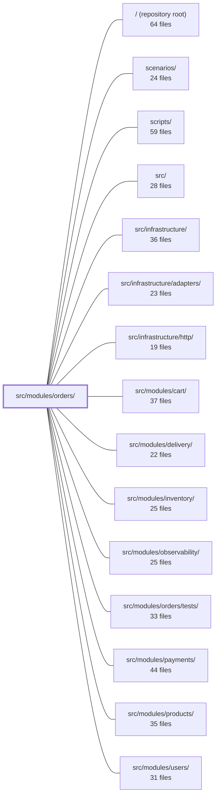

---
tags:
  - 2brain
  - 2brain/module
  - project/boilerplate-node-backend
type: module
module: src/modules/orders/
files: 45
updated: 2026-09-23T20:38:04.816122+00:00
---

# src/modules/orders/

## Purpose

The orders module owns the full order lifecycle: creation (via admin write or cart checkout), status transitions, cancellation with side-effect fan-out, invoice rendering, and the pure business rules around money, tax, and product snapshots. It sits low in the dependency graph—payments, delivery, and other modules depend on it, never the reverse—and signals state changes outward exclusively through typed domain events.

## Key parts

- **Domain layer (`domain/`)** — Pure, side-effect-free business rules. `lifecycle.ts` is the single state-machine definition (allowed transitions per actor). `money.ts` defines the integer-minor-unit `Money` type. `totals.ts`, `tax.ts`, `rules.ts`, and `transfer-reference.ts` compute totals, VAT breakdowns, line validation, and bank-transfer references respectively. `index.ts` is the curated public barrel.
- **Model & persistence** — `model.ts` defines the Mongoose schema (embedded product snapshot, serialization transform). `repository.ts` wraps CRUD plus aggregation-based search and all atomic writes (status transitions, scope-guarded reads).
- **Service layer (`services/`)** — Business orchestration. `place.ts` is the single write path for order creation. `cancel.ts` handles cancellation and its at-least-once side effects. `override.ts` is the admin-only status door. `availability.ts` re-queries live products and cascades cancellation. `invoice.ts` renders PDFs with a disk-backed TTL cache. `notify.ts` sends the post-order email. `crud.ts`, `current.ts`, `status.ts`, and `index.ts` round out reads and the public `orderService` object.
- **HTTP layer** — `routes.ts` wires middleware (auth, permissions, rate-limiting, idempotency) onto each endpoint. `controllers/` contains thin handlers (get-order-item, get-orders, write-orders, post-cancel-order, post-order-status-override, get-order-invoice, delete-orders). `rate-limits.ts` guards the expensive invoice-render endpoint.
- **Cross-cutting declarations** — `events.ts` (domain events via `DomainEventMap` augmentation), `analytics.ts`, `audit.ts`, `metrics.ts` (Prometheus counters). Each file registers typed vocabulary into app-wide maps so the spellings stay in sync.
- **Module wiring & contracts** — `module.ts` / `module.yaml` are the kernel manifests (identity, permissions, event subscriptions, scenario pins). `index.ts` is the sole public import surface for sibling modules. `openapi.yaml` is the REST contract. `emails.ts` centralises all locale-resolved customer-facing copy.
- **Configuration & fixtures** — `config.ts` reads shop identity, bank-transfer rules, and cache knobs from `process.env` per call. `factories.ts` builds test-ready `OrderDocument` instances.

## How it connects

- **cart** — The checkout path in cart funnels its write through this module's `placeOrder`; cart supplies payment-method context, shipping resolution, and cart-clearing, while orders owns the atomic mutation.
- **products** — Orders embed a frozen product snapshot (no `ref`); `availability.ts` re-queries the live catalogue to detect hard-deleted or deactivated products and trigger cascading cancellation. `current.ts` fetches live image URLs at serialization time.
- **inventory** — Order creation holds stock; cancellation and status transitions release it. The inventory module reacts to order domain events.
- **payments** — Orders mints the ISO 11649 bank-transfer reference atomically with the order row; payments reads it back to match incoming transfers. Cancellation emits a refund intent that payments consumes.
- **delivery** — Subscribes to order domain events (status transitions) to trigger parcel shipping and delivery emails. Orders never imports delivery.
- **users** — Scope-guarded reads (non-admins see only their own orders), caller identity for permissions, and GDPR data-export queries all cross this boundary.
- **observability / infrastructure** — The module emits analytics events and audit records through the infrastructure adapters; Prometheus counters are read by the observability module's overview endpoint.
- **scenarios** — The module manifest pins storefront/admin scenario states consumed by the scenario runner.

## Where to start

Read **`domain/lifecycle.ts`** first — it is the one-page state machine that every other piece (services, controllers, event listeners) defers to, and understanding which actor may move which status makes the rest of the module legible. Then read **`services/place.ts`** to see the single atomic write path that both the admin create and cart checkout converge on, which reveals how the module coordinates inventory, payments, numbering, and event emission in one transaction.

## Connected modules

[[boilerplate-node-backend_ROOT|/ (repository root)]] · [[boilerplate-node-backend_scenarios|scenarios/]] · [[boilerplate-node-backend_scripts|scripts/]] · [[boilerplate-node-backend_src|src/]] · [[boilerplate-node-backend_src_infrastructure|src/infrastructure/]] · [[boilerplate-node-backend_src_infrastructure_adapters|src/infrastructure/adapters/]] · [[boilerplate-node-backend_src_infrastructure_http|src/infrastructure/http/]] · [[boilerplate-node-backend_src_modules_cart|src/modules/cart/]] · [[boilerplate-node-backend_src_modules_delivery|src/modules/delivery/]] · [[boilerplate-node-backend_src_modules_inventory|src/modules/inventory/]] · [[boilerplate-node-backend_src_modules_observability|src/modules/observability/]] · [[boilerplate-node-backend_src_modules_orders_tests|src/modules/orders/tests/]] · [[boilerplate-node-backend_src_modules_payments|src/modules/payments/]] · [[boilerplate-node-backend_src_modules_products|src/modules/products/]] · [[boilerplate-node-backend_src_modules_users|src/modules/users/]] · … and 7 more

## Files
- `src/modules/orders/analytics.ts` — Declares the analytics event names the orders module emits and registers them into the app-wide `AnalyticsEventMap` type. This file exists so that event names live in one source-of-truth location and the analytics port's union type stays in sync across modules.
- `src/modules/orders/audit.ts` — Declares the audit-action vocabulary for the orders module and registers it into the app-wide `AuditActionMap` via TypeScript module augmentation. It exists so that every order write-path (create, update, delete, cancel, status-override) records a typed, enumerable action in the audit trail without a shared enum.
- `src/modules/orders/config.ts` — Centralises the shop's invoice identity (legal name, VAT number, country), the bank-transfer payment-method configuration (beneficiary, IBAN, BIC, hold window, per-account open-order cap), and the invoice render-cache knobs (path, TTL). All values are read per call from `process.env` rather than captured at import, so a deployment can correct any of them without a restart. Owned by `orders` because `./emails` is the sole reader of the shop identity, and the transfer business rules (hold, cap) constrain the order entity itself.
- `src/modules/orders/controllers/delete-orders.ts` — Thin wiring layer that instantiates the shared `createDeleteController` factory for the order entity. It exists so the orders module can expose a single, pre-configured `deleteOrders` controller (soft-delete by default, hard-delete on demand) without re-implementing the delete logic.
- `src/modules/orders/controllers/get-order-invoice.ts` — Controller handler for `GET /orders/:id/invoice`. Renders an order's PDF invoice synchronously on the request thread via `orderService.renderInvoicePdf` and streams the raw bytes back. Returns `200` with the PDF, `404` if the order is missing or invisible to the caller, or `500` on render failure. There is no polling or background job: the invoice is a transient view of the order, not a durable artefact.
- `src/modules/orders/controllers/get-order-item.ts` — Handler for `GET /orders/:id`. Returns a single order scoped to the caller's role (admins see any order; others see only their own) and augments the payload with the actions that caller is allowed to perform. It validates the `:id` parameter **before** issuing the query so that a malformed id always yields **404**, regardless of which role branch the service would have taken.
- `src/modules/orders/controllers/get-orders.ts` — Thin controller that wires the `GET /orders` endpoint onto the shared `createSearchController` factory. It validates the search/pagination query, enforces caller-scoped visibility (non-admins see only their own orders), and delegates the actual query to `orderService.search`.
- `src/modules/orders/controllers/post-cancel-order.ts` — Thin HTTP handler for `POST /orders/:id/cancel` — the only order write a customer is permitted to perform. It extracts the caller's identity and optional refund preference from the request, delegates the actual write to `orderService.cancelById`, then returns the updated order with its available actions.
- `src/modules/orders/controllers/post-order-status-override.ts` — Admin controller for `POST /orders/:id/status-override`. It validates the order ID, parses a status-override body, delegates to `orderService.overrideStatus`, enriches the result with allowed actions, and returns the updated order. It is a "status-only door" — no parcel or email side effects are triggered.
- `src/modules/orders/controllers/write-orders.ts` — Admin-side create/update controller for orders. A single exported handler covers both `POST /orders` (create) and `PUT /orders(/:id)` (update), branching on whether an order id is present. It deliberately bypasses the cart flow — items arrive directly in the request body — distinguishing it from the customer checkout path in the cart module.
- `src/modules/orders/domain/index.ts` — Curated barrel for the orders domain layer. It re-exports the public, pure-rule API (totals, rules, lifecycle, tax, transfer-reference) so that consumers import from a single entry point without reaching into individual module files. It intentionally withholds internal helpers to keep the public surface minimal.
- `src/modules/orders/domain/lifecycle.ts` — Centralises the order state machine: which status may transition to which, and which actor (`customer`, `admin`, `system`) is allowed on each edge. Services, payment flows, the delivery module, and client-facing action rendering all consult this file instead of encoding their own status comparisons, so the rules live in exactly one place and a new contract status surfaces as a compile error.
- `src/modules/orders/domain/money.ts` — Defines the `Money` branded type and a small set of arithmetic helpers that perform all order-amount math in **integer minor units** (cents) rather than decimal floats. This eliminates floating-point drift in totals and makes results order-independent. It sits in the domain layer and is the single source of truth for amount representation within the orders module.
- `src/modules/orders/domain/rules.ts` — Pure business-rule validation for order lines. Given candidate lines (already joined to their products), it returns a typed verdict (`ok` or a specific refusal reason). It intentionally contains no status codes, no i18n strings, and no side effects — the service layer is responsible for translating verdicts into HTTP responses.
- `src/modules/orders/domain/tax.ts` — Computes the full VAT breakdown (per-line, per-rate, and order-level) for an order using the **frozen** prices and tax rates captured at checkout. It is a pure derivation step at serialization time—tax figures are never persisted and never re-resolved against a product's current tax class, so a later config change cannot restate what a past order was actually charged.
- `src/modules/orders/domain/totals.ts` — Pure computation of order totals from a list of priced line items (plus optional shipping). It exists so that the cart summary, the order preview, the frozen payment intent, and the confirmation email all derive the same number from a single source rather than each summing independently. All arithmetic is performed in minor units via `money.ts` and converted to a decimal amount exactly once at the boundary.
- `src/modules/orders/domain/transfer-reference.ts` — Mints and validates ISO 11649 "RF" creditor references for `bank_transfer` orders. The reference encodes the order's own ObjectId in base-36 with Mod-97 (ISO 7064 MOD 97-10) check digits so a mistyped code is rejected rather than silently matching the wrong order. It lives in `orders` (not `payments`) because the reference is deterministic from the order id and is written atomically with the order row; `payments` only reads it back.
- `src/modules/orders/emails.ts` — Builds the finished, locale-resolved copy for every customer-facing document the orders module produces (confirmation email, bank-transfer instructions, expiry notice, product-unavailable cancellation, and the invoice's VAT block). Translation keys are resolved here at build time; downstream renderers (EJS for emails, Puppeteer for the PDF) only interpolate the strings they receive and never touch i18n themselves.
- `src/modules/orders/events.ts` — Declares the domain events the orders module emits by augmenting the kernel's `DomainEventMap`, and exports the corresponding string constants so emitters and listeners share a single spelling. Because `orders` sits low in the dependency graph (payments and delivery depend on it, never the reverse), emitting events is the sole mechanism by which it signals state changes to downstream modules.
- `src/modules/orders/factories.ts` — Test-fixture factory that builds an `OrderDocument` ready for `orderRepository.create`. Because an order embeds a product **snapshot** (no `ref`) and several wire fields (totals, `current`, `transferInstructions`) are derived at serialization rather than stored, this module isolates the mapping from caller-friendly overrides to a storable document, stripping anything the schema has no column for.
- `src/modules/orders/index.ts` — Public barrel for the orders module. It is the **only** surface sibling modules may import from (per `docs/theory/strategic-ddd.md` §5). It re-exports the module's services, domain types, events, email helpers, and model types so that internal details (the repository, the collection) stay private.
- `src/modules/orders/metrics.ts` — Defines the Prometheus domain counters owned by the orders module. By co-locating metric definitions with the domain logic (rather than in `infrastructure/observability`), the module self-documents what it measures and the overview endpoint can read them without a direct import into this file.
- `src/modules/orders/model.ts` — Defines the Mongoose schema and TypeScript document interface for order records, plus the serialization transform that derives wire-only fields (`totalItems`, `totalQuantity`, `totalPrice`, `transferInstructions`) at read time. Orders embed a frozen product snapshot (not a `ref`) so that later catalogue edits never rewrite purchase history, and the snapshot is deliberately narrower than the live `productSchema` — no stock counters, no image URLs, and a resolved `taxRate` instead of a `taxClass`.
- `src/modules/orders/module.ts` — Module manifest for the **orders** domain. It registers the module's identity (name, base path, permissions, routes), wires domain-event subscriptions (reservation expiry, user deletion, product removal), declares the GDPR data-export query, and pins the storefront/admin scenario states — all in a single `AppModule` object that the kernel's registry consumes at boot.
- `src/modules/orders/module.yaml` — Declarative module manifest for the **orders** module. It tells the runtime which subdomain the module belongs to and lists the other modules it depends on at the data/transaction level, along with a one-line note explaining *why* each dependency exists.
- `src/modules/orders/openapi.yaml` — OpenAPI 3.0.3 contract (v2.0.0) for the Orders module. It declares the full REST surface—list, create, update, delete, search, and per-id operations—along with local request/response schemas, so that clients, codegen tooling, and the runtime controller share a single source of truth for the module's API.
- `src/modules/orders/probes.ts` — Defines the orders module's "probe" requests—HTTP calls that validate scoping behaviors the OpenAPI contract cannot express on its own. The probes are consumed by the client-collections bundle to generate runnable Postman/Insomnia-style requests that exercise role-based and ownership scoping in the orders API.
- `src/modules/orders/rate-limits.ts` — Declares the orders module's sole rate-limit budget (`INVOICE_RENDER_BUDGET`) for `GET /orders/:id/invoice` and exposes it as a ready-to-use Express middleware (`invoiceLimiter`). It exists because each invoice render spawns a Chromium process (`renderHtmlToPdf`), making the endpoint far more resource-intensive than a typical request handler, and a per-account cap is needed to prevent one signed-in user from exhausting container CPU.
- `src/modules/orders/repository.ts` — Data-access layer for orders. Because an order embeds a product snapshot (filtering on `items.product._id` is a pipeline concern, not a plain-query one), this repository overrides the factory's default `find`-based search with an aggregation-pipeline implementation while still using the factory for plain CRUD. It also concentrates every domain-specific atomic write (status transitions, pending-effect bookkeeping, scope-guarded reads) so that services never issue raw model calls.
- `src/modules/orders/routes.ts` — Defines the Express router for all order-management HTTP endpoints. It wires authentication guards, permission checks, caching, idempotency, and rate-limiting middleware onto each route, and delegates handling to the module's controller functions.
- `src/modules/orders/services/availability.ts` — Determines whether an order's product lines are still sellable by re-querying live product state (rather than trusting the order's frozen snapshot), and executes the consequence when a product has been hard-deleted or deactivated: cancel every still-pending order holding that product and send the buyer an explanatory email.
- `src/modules/orders/services/cancel.ts` — Handles order cancellation as a single conditional status write followed by its side effects (inventory release, refund intent, domain-event broadcast, audit, analytics, and a conditional expiry email). Also exposes the sweep function that discharges refund effects that failed on the happy path, making the cancel at-least-once durable without an in-app scheduler.
- `src/modules/orders/services/crud.ts` — Service-layer CRUD operations for the Orders module: search, fetch, create, and update. It composes repository reads/writes with domain-transition guards, cross-module lookups (product, user, inventory), and the side-effect fan-out (audit, analytics, email) that each successful mutation requires. Cancellation and retraction are deliberately excluded — they live in `./cancel` and `./retract` respectively.
- `src/modules/orders/services/current.ts` — Resolves the live product image (`imageUrl` / `thumbnailUrl`) for every order line at serialization time by querying the product catalogue. It exists because the frozen snapshot on the order no longer carries image fields (removed from `orderLineProductSchema` in `../model`), so the current catalogue value must be fetched on read. All lookups in a single response are batched into one `$in` query to keep cost at one extra round-trip regardless of line count.
- `src/modules/orders/services/index.ts` — Barrel file for the Order service module. It re-exports every public operation from the sub-modules (`crud`, `place`, `cancel`, `status`, `override`, `retention`, `scope`, `availability`, `invoice`, etc.) and bundles them into a single `orderService` object, giving controllers and cross-module callers one import point for all order business logic.
- `src/modules/orders/services/invoice-numbering.ts` — Converts the repository's atomic yearly counter into a formatted invoice number (`{year}-{sequence}`) compliant with EU VAT Directive 2006/112/EC Art. 226. The file handles only the string formatting; atomicity is delegated to the repository.
- `src/modules/orders/services/invoice.ts` — Renders an order's invoice as a PDF on demand — a synchronous, request-scoped view, not a durable document with its own lifecycle. A disk-backed TTL cache and a per-process single-flight map in front of the Chromium render ensure a burst of requests for the same order costs one launch, not one per request. Also owns the cache's lifecycle: per-file deletion, orphan reaping, and TTL-based expiration.
- `src/modules/orders/services/notify.ts` — Sends the "order placed" email (confirmation or bank-transfer instructions) with an attached invoice PDF. It exists so that both the storefront checkout path and the admin `create` path share a single, payment-method-driven email decision, decoupled from the request that placed the order.
- `src/modules/orders/services/override.ts` — Implements the admin override — the sole mechanism that may move an order to a status the normal `ORDER_LIFECYCLE` would refuse, or advance status without the parcel/email side-effects of the regular delivery doors. Two public entry points (`overrideStatus`, `forceMove`) share a single internal write path (`applyOverride`) so that the history row, domain event, and audit record are always produced together and can never drift.
- `src/modules/orders/services/place.ts` — Single write path for creating a new order. Both `crud.ts`'s admin `create` and `cart`'s `checkout` funnel their writes through `placeOrder`, so the actual mutation (freezing lines, allocating an invoice number, minting a bank-transfer reference, holding stock) lives in exactly one place. Caller-specific concerns (payment-method validation, open-transfer caps, cart clearing, shipping resolution) stay with the caller.
- `src/modules/orders/services/retention.ts` — Implements the two-phase PII lifecycle for orders after account erasure. Because an order is an invoice, it is retained under Art. 17(3)(b)/(e) regardless of the account's fate. This file detaches the person from the order immediately, then (via a later sweep) scrubs residual PII once a statutory retention window elapses.
- `src/modules/orders/services/retract.ts` — Exports a single compensation function, `retractOrder`, that undoes an already-written order by releasing its inventory hold and deleting the order document. It exists as a standalone module so that `place.ts` (rollback after a failed stock hold) and the cart's `checkout` flow can both invoke it without importing each other.
- `src/modules/orders/services/scope.ts` — The authorization boundary for the orders module. Before any other service reads or mutates an order, this file answers two questions: *which* orders the caller may see (`callerScope`, `ownerScope`) and *what* the caller may do to a specific order (`actorOf`, `withActions`). It centralises the read-filter compilation and the actor/action assignment so that every read path in the module applies the same rules.
- `src/modules/orders/services/snapshot.ts` — Resolves catalogue product rows into the locale-specific snapshot that an order line freezes at write time, and assembles the final `OrderDocumentItem[]` array. It exists in `services/` (not the domain tier) because it deliberately reaches into `@infrastructure/i18n` and `@kernel/translation` to perform locale-aware field resolution.
- `src/modules/orders/services/status.ts` — The single status-writer for the orders module. Other modules (`payments`, `delivery`) **report** a completed fact to this file; it decides whether that fact still applies to the order's current lifecycle position, applies the transition atomically via the repository, and emits a domain event. It is never called as a "request" — only as a "report" of something another module has already recorded.

---
[[boilerplate-node-backend_INDEX|← boilerplate-node-backend index]]
