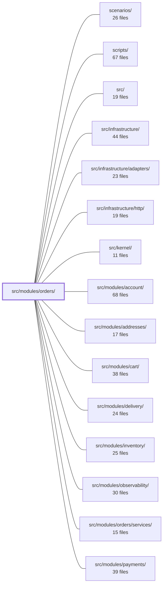

---
tags:
  - 2brain
  - 2brain/module
  - project/boilerplate-node-backend
type: module
module: src/modules/orders/
files: 65
updated: 2026-09-27T16:21:23.036368+00:00
---

# src/modules/orders/

## Purpose

The orders module is the bounded context that owns the full order lifecycle: creation (admin or via cart), status transitions, cancellation, refunds, invoicing, and the domain math (totals, tax, money arithmetic) that underpins every order record. It treats the order as an immutable product snapshot at purchase time, emits domain events for downstream consumers (payments, delivery), and exposes a well-scoped HTTP API for both customer and admin callers.

## Key parts

- **Domain layer (`domain/`)** — Pure, framework-free business logic: `lifecycle.ts` (status state machine + actor constraints), `money.ts` (integer-cents arithmetic), `totals.ts` (order-level sums), `tax.ts` (VAT extraction & apportionment), `rules.ts` (line-item validation), `transfer-reference.ts` (ISO 11649 bank reference). The barrel `domain/index.ts` controls the public surface.
- **Model & persistence** — `model.ts` (Mongoose schema with embedded product snapshots and a serialization transform) and `repository.ts` (aggregation-pipeline search, atomic status transitions, pending-effects for retry sweeps).
- **Controllers (`controllers/`)** — One file per HTTP action: create, read, search, update, delete, restore, cancel, status-override, and invoice render. Shared helpers live in `respond.ts` and `delete-orders.ts` / `restore-orders.ts` reuse factory functions from the kernel.
- **Module wiring** — `module.ts` (kernel manifest: routes, permissions, event subscriptions, GDPR erase), `routes.ts` (Express router + auth guards), `index.ts` (the only import surface allowed for sibling modules), `config.ts` (per-call env getters), `rate-limits.ts` (invoice-render cap).
- **Cross-cutting registrations** — `events.ts` (domain event catalogue), `analytics.ts` / `audit.ts` (app-wide event & audit maps), `metrics.ts` (Prometheus counters), `emails.ts` (i18n copy for all lifecycle emails).
- **Contracts & tests** — `openapi.yaml` (public API contract), `probes.ts` (scoping probes), `tests/` (contract, integration, and factory suites).

## How it connects

- **`src/modules/payments/`** — Consumes order domain events (e.g. order created, status changed) to drive charge and refund flows. Orders never imports payments; the dependency is one-directional via the event channel defined in `events.ts`.
- **`src/modules/delivery/`** — Subscribes to order events to trigger shipping. Same one-directional rule.
- **`src/modules/cart/`** — The cart/checkout path is the *primary* route into order creation for end-customers; the admin `POST /orders` controller explicitly bypasses cart. Cart depends on orders, not vice-versa.
- **`src/modules/inventory/`** — Orders subscribes to the inventory "reservation expiry" domain event (wired in `module.ts`) to auto-expire unpaid orders. The config file follows the same per-call env pattern established in `inventory/config.ts`.
- **`src/modules/products/`** — Orders subscribes to the "product removal" event; the product snapshot embedded at write time makes the order independent of the live catalogue afterwards.
- **`src/kernel/`** — Module registration, `DomainEventMap` augmentation, and the shared controller factories (`createDeleteController`, `createRestoreController`, `createUpdateController`, `createSearchController`) all come from the kernel.
- **`src/infrastructure/`** — HTTP transport, EJS/Puppeteer PDF rendering (`renderHtmlToPdf`), and i18next resolution are provided by the infrastructure layer that orders consumes.
- **`src/modules/orders/services/`** — The service layer (placed in `orderService`) sits between controllers and the repository/domain; it is the only tier that orchestrates a use-case and emits the events and side-effects (audit, analytics, email) declared by the domain.
- **`scenarios/`** — The storefront scenario states listed in `module.ts` are the external surface that drives which order endpoints a shopper can see.

## Where to start

1. **`domain/lifecycle.ts`** — Reading the status state machine first gives you the vocabulary (`pending`, `paid`, `shipped`, …) and the actor-permitted edges that every controller, service, and test refers to. Everything else in the module is an operation *on* this state machine.
2. **`index.ts`** — The public barrel tells you exactly what the module exposes to the rest of the codebase, and what it deliberately hides (repository internals, model runtime values). It is the quickest map of the module's boundary.

## Connected modules

```mermaid
flowchart LR
    m_src_modules_orders["src/modules/orders/"]
    m_scenarios["scenarios/<br/>26 files"]
    m_scripts["scripts/<br/>67 files"]
    m_src["src/<br/>19 files"]
    m_src_infrastructure["src/infrastructure/<br/>44 files"]
    m_src_infrastructure_adapters["src/infrastructure/adapters/<br/>23 files"]
    m_src_infrastructure_http["src/infrastructure/http/<br/>19 files"]
    m_src_kernel["src/kernel/<br/>11 files"]
    m_src_modules_account["src/modules/account/<br/>68 files"]
    m_src_modules_addresses["src/modules/addresses/<br/>17 files"]
    m_src_modules_cart["src/modules/cart/<br/>38 files"]
    m_src_modules_delivery["src/modules/delivery/<br/>24 files"]
    m_src_modules_inventory["src/modules/inventory/<br/>25 files"]
    m_src_modules_observability["src/modules/observability/<br/>30 files"]
    m_src_modules_orders_services["src/modules/orders/services/<br/>15 files"]
    m_src_modules_payments["src/modules/payments/<br/>39 files"]
    m_src_modules_orders --- m_scenarios
    m_src_modules_orders --- m_scripts
    m_src_modules_orders --- m_src
    m_src_modules_orders --- m_src_infrastructure
    m_src_modules_orders --- m_src_infrastructure_adapters
    m_src_modules_orders --- m_src_infrastructure_http
    m_src_modules_orders --- m_src_kernel
    m_src_modules_orders --- m_src_modules_account
    m_src_modules_orders --- m_src_modules_addresses
    m_src_modules_orders --- m_src_modules_cart
    m_src_modules_orders --- m_src_modules_delivery
    m_src_modules_orders --- m_src_modules_inventory
    m_src_modules_orders --- m_src_modules_observability
    m_src_modules_orders --- m_src_modules_orders_services
    m_src_modules_orders --- m_src_modules_payments
    style m_src_modules_orders stroke-width:3px
```

[[boilerplate-node-backend_ROOT|/ (repository root)]] · [[boilerplate-node-backend_scenarios|scenarios/]] · [[boilerplate-node-backend_scripts|scripts/]] · [[boilerplate-node-backend_src|src/]] · [[boilerplate-node-backend_src_infrastructure|src/infrastructure/]] · [[boilerplate-node-backend_src_infrastructure_adapters|src/infrastructure/adapters/]] · [[boilerplate-node-backend_src_infrastructure_http|src/infrastructure/http/]] · [[boilerplate-node-backend_src_kernel|src/kernel/]] · [[boilerplate-node-backend_src_modules_account|src/modules/account/]] · [[boilerplate-node-backend_src_modules_addresses|src/modules/addresses/]] · [[boilerplate-node-backend_src_modules_cart|src/modules/cart/]] · [[boilerplate-node-backend_src_modules_delivery|src/modules/delivery/]] · [[boilerplate-node-backend_src_modules_inventory|src/modules/inventory/]] · [[boilerplate-node-backend_src_modules_observability|src/modules/observability/]] · [[boilerplate-node-backend_src_modules_orders_services|src/modules/orders/services/]] · … and 5 more

## Files
- `src/modules/orders/analytics.ts` — Declares the analytics event names the orders module emits and registers them into the app-wide `AnalyticsEventMap` type. This file exists so that event names live in one source-of-truth location and the analytics port's union type stays in sync across modules.
- `src/modules/orders/audit.ts` — Declares the audit-action vocabulary owned by the orders module and registers it into the app-wide `AuditActionMap` via TypeScript module augmentation. Centralizing the action strings here (instead of scattering them across services and controllers) gives a single source of truth for what "orders did something" means in the audit trail.
- `src/modules/orders/config.ts` — Central configuration surface for the `orders` module. Exposes the shop's invoice identity, bank-transfer payment settings, invoice-render cache knobs, the refund-retry grace window, and the single frontend order-page link. Every getter reads its env var **per call** (not captured at import), following the pattern set by `inventory/config.ts`, so a deployment can correct any value without a restart.
- `src/modules/orders/controllers/create-order.ts` — HTTP handler for `POST /orders`. This is the **admin** order-creation path: it accepts an explicit `items` array directly from the request body, bypassing the cart/checkout flow found in `@modules/cart`. It validates the payload, delegates to `orderService.create`, and returns a `201` response.
- `src/modules/orders/controllers/delete-orders.ts` — Thin wiring layer that instantiates the shared `createDeleteController` factory for the order entity. It exists so the orders module can expose a single, pre-configured `deleteOrders` controller (soft-delete by default, hard-delete on demand) without re-implementing the delete logic.
- `src/modules/orders/controllers/get-order-invoice.ts` — HTTP controller for `GET /orders/:id/invoice`. Synchronously renders an order's PDF invoice on the request thread via `orderService.renderInvoicePdf` and streams the bytes back as a `200` response. Returns `404` when the order is missing or inaccessible, and `500` on a render failure. The invoice is treated as a view of the order, not a durable artifact, so no async job pattern is used.
- `src/modules/orders/controllers/get-order-item.ts` — Single-order read controller for `GET /orders/:id`. It enforces a 404-vs-422 distinction by validating the path id *before* the database query runs, and scopes the lookup to the caller's permissions (non-admins see only their own orders).
- `src/modules/orders/controllers/get-orders.ts` — Thin controller that wires `GET /orders` to the shared `createSearchController` factory. It defines the query schema, enforces caller-based visibility (non-admins see only their own orders), and delegates the actual search to `orderService.search`.
- `src/modules/orders/controllers/post-cancel-order.ts` — HTTP controller for `POST /orders/:id/cancel`. It is a thin wiring layer that translates the incoming Express request into a call to `orderService.cancelById`, handling the caller's authentication scope, the optional `refund` body field, and the success/refusal response.
- `src/modules/orders/controllers/post-order-status-override.ts` — Controller handler for `POST /orders/:id/status-override`. It is a thin admin endpoint that forces an order's status to a new value with a recorded reason, explicitly without triggering any parcel or email side effects. All wiring delegates to `orderService.overrideStatus`.
- `src/modules/orders/controllers/respond.ts` — Shared success-tail helper for every order controller (all write endpoints plus the single-order read). It hydrates the order document returned by the service with the caller's computed `actions`, then sends it as the standard success envelope. It lives in the controller layer (not `services/scope.ts`) so that `withActions` remains framework-free while the HTTP `Response`/status split stays at the call site.
- `src/modules/orders/controllers/restore-orders.ts` — Thin admin controller that exposes the **POST /orders/:id/restore** endpoint for undoing a soft-deleted order. Rather than implementing the handler inline, it delegates all logic (lookup, permission check, audit, response shaping) to the shared `createRestoreController` factory, keeping the orders module consistent with other entities that follow the same restore pattern.
- `src/modules/orders/controllers/update-order.ts` — Thin handler layer for `PUT /orders/:id` (replace) and `PATCH /orders/:id` (merge). It wires the shared `createUpdateController` factory to the order service so the only writable field (`email`) can be set, while `status` changes are intentionally excluded and handled exclusively through a separate action endpoint.
- `src/modules/orders/domain/index.ts` — Selective barrel for the orders domain layer. It re-exports the public surface of the five domain sub-modules (totals, rules, lifecycle, tax, transfer-reference) so that consumers import from a single entry point while the layer remains guaranteed free of Express, Mongoose, and any tier-specific code. It intentionally omits certain symbols to prevent them from being treated as general-purpose utilities.
- `src/modules/orders/domain/lifecycle.ts` — Defines the order-status state machine: which status may follow which, and which actor (`customer`, `admin`, `system`) is permitted on each edge. The status *set* comes from the `OrderStatus` contract in `@types`; this file supplies the edges and actor constraints. It also provides the derived predicates (`isPayable`, `stockCommitted`, `canOverrideTo`) and the helper enumerations that service layers and payment modules use instead of hand-listing status literals.
- `src/modules/orders/domain/money.ts` — Defines the `Money` branded type and a small set of arithmetic helpers that perform all order-amount math in **integer minor units** (cents) rather than decimal floats. This eliminates floating-point drift in totals and makes results order-independent. It sits in the domain layer and is the single source of truth for amount representation within the orders module.
- `src/modules/orders/domain/rules.ts` — Pure validation and classification predicates for order lines. Takes already-joined line data in, returns a verdict or boolean out. No status codes, no i18n — the service layer (`services/place`) maps verdicts to HTTP/i18n responses. Lives in the domain layer per `docs/theory/domain-layer.md`.
- `src/modules/orders/domain/tax.ts` — Computes all VAT figures for an order—per-line net/tax/gross, order-level totals, per-rate summaries, and shipping's own per-rate slice—by extracting tax from each line's **frozen** gross price at serialization time. A config rate change never restates a past order. Also apportions a frozen shipping cost pro-rata across lines and taxes it at each line's own rate (shipping is ancillary, not independently rated).
- `src/modules/orders/domain/totals.ts` — Pure computation of order totals from a list of priced line items (plus optional shipping). It exists so that the cart summary, the order preview, the frozen payment intent, and the confirmation email all derive the same number from a single source rather than each summing independently. All arithmetic is performed in minor units via `money.ts` and converted to a decimal amount exactly once at the boundary.
- `src/modules/orders/domain/transfer-reference.ts` — Implements ISO 11649 "RF" creditor reference generation and validation for `bank_transfer` orders. `buildReference` deterministically mints a checksummed reference from an order's ObjectId at write time; `parseReference` reads one back from an admin's paste-off-the-bank-website input. Lives in the **orders** domain (not payments) because the reference is derived from the order's own id and must be stable across retries.
- `src/modules/orders/emails.ts` — Centralises the copy builders for every order-lifecycle email (confirmation, payment success, bank-transfer instructions, expiration, product-unavailability cancellation) and the invoice metadata/VAT blocks. The design rule is: the caller passes a locale, the function returns **finished strings** via `i18next` — the downstream EJS/Puppeteer template only interpolates and never resolves a key.
- `src/modules/orders/events.ts` — Defines the four domain events the orders module emits by augmenting the kernel's `DomainEventMap` (rather than editing it directly, so the catalogue grows per-module). Because `orders` sits low in the dependency graph and upstream consumers (payments, delivery) can depend on it but not vice-versa, event emission is the only channel for announcing state changes.
- `src/modules/orders/factories.ts` — Builds an order document (ready for `orderRepository.create`) from caller-supplied overrides. Because an order embeds a **product snapshot** (not a reference) and derives its totals at serialization time, constructing a valid order fixture requires non-trivial mapping — contract ids become ObjectIds, ISO dates become `Date`s, `taxClass` becomes a frozen `taxRate`, and several wire-only fields must be excluded. This file centralises that logic so test fixtures don't repeat it.
- `src/modules/orders/index.ts` — Public barrel for the Orders module. It is the **only** import surface that sibling modules are allowed to use (per `docs/theory/strategic-ddd.md` §5). It re-exports the module's services, domain, events, and emails, and re-exports model **types** (not runtime values), keeping `orderRepository` and model internals private to the module.
- `src/modules/orders/metrics.ts` — Defines the Prometheus domain counters owned by the orders module. By co-locating metric definitions with the domain logic (rather than in `infrastructure/observability`), the module self-documents what it measures and the overview endpoint can read them without a direct import into this file.
- `src/modules/orders/model.ts` — Defines the Mongoose schema for the Order document and the serialization transform (`applyOrderTransform`) that derives wire-only fields (totals, transfer instructions) from embedded items at the single serialization choke-point. The schema embeds a frozen product snapshot per line rather than referencing the live catalogue, ensuring purchase history is immutable.
- `src/modules/orders/module.ts` — The module manifest for the **orders** domain. It registers the module with the kernel (name, base path, permissions, routes), declares public webhook event mappings, subscribes to cross-module domain events (reservation expiry, product removal), defines personal-data handling (GDPR erase), and lists the storefront scenario states. It is the single file that ties the orders services, routes, events, and rate limits together as one `AppModule` export.
- `src/modules/orders/module.yaml` — Declarative module manifest for the **orders** module. It tells the runtime which subdomain the module belongs to and lists the other modules it depends on at the data/transaction level, along with a one-line note explaining _why_ each dependency exists.
- `src/modules/orders/openapi.yaml` — OpenAPI 3.0.3 contract (v2.0.0) for the Orders module. It declares every public HTTP endpoint the module exposes—list, create, search, read, replace, patch, delete, and restore—along with their request/response schemas, so that clients, codegen tooling, and the shared contract library have a single source of truth for the API surface.
- `src/modules/orders/probes.ts` — Defines the orders module's "probe" requests—HTTP calls that validate scoping behaviors the OpenAPI contract cannot express on its own. The probes are consumed by the client-collections bundle to generate runnable Postman/Insomnia-style requests that exercise role-based and ownership scoping in the orders API.
- `src/modules/orders/rate-limits.ts` — Declares the orders module's sole rate-limit budget (`INVOICE_RENDER_BUDGET`) for `GET /orders/:id/invoice` and exposes it as a ready-to-use Express middleware (`invoiceLimiter`). It exists because each invoice render spawns a Chromium process (`renderHtmlToPdf`), making the endpoint far more resource-intensive than a typical request handler, and a per-account cap is needed to prevent one signed-in user from exhausting container CPU.
- `src/modules/orders/repository.ts` — The data-access layer for orders. Unlike other collections, orders embed a product snapshot, so reads go through the MongoDB aggregation pipeline rather than a simple `find()`. The file wires a base CRUD repository (from the shared factory) together with an aggregation-based `search`, scoped single-row reads, atomic status transitions, and a small pending-effects subsystem used by the retry sweep.
- `src/modules/orders/routes.ts` — Express router that wires up every order endpoint, enforcing session-based authentication on all routes and splitting access between customer-scoped reads/writes and admin-gated mutations. It exists as the single place where route ordering, middleware chains, and permission guards are declared for the orders domain.
- `src/modules/orders/tests/contract/api.contract.test.ts` — Contract tests for the `/orders` HTTP API. This suite exists because the list endpoint previously returned `totalItems`/`totalQuantity`/`totalPrice` while `openapi.yaml` declared a single `total`, and `GET /orders/{id}` answered a different shape per caller role — neither mismatch was caught until tests exercised the actual HTTP boundary. Every assertion here validates responses against the OpenAPI spec via `toSatisfyApiSpec()` and pins role-specific scoping behavior.
- `src/modules/orders/tests/factories.ts` — Database-touching order factories for the test suite. While `../factories.ts` provides a pure in-memory builder, this file wraps that builder with real persistence operations (create, read, update, count) so integration and contract tests can seed, inspect, and force orders in the test database without touching the service layer.
- `src/modules/orders/tests/integration/cancel.test.ts` — Integration tests for `orderService.cancelById`. Verifies the status gate, permission scoping, refund semantics, and observability side-effects (audit, analytics, email, domain events) that make the single cancel operation safe to expose to callers.
- `src/modules/orders/tests/integration/create-audit.test.ts` — Integration test that verifies the `order_created` audit row always records the real caller's role name (e.g. `moderator`, `admin`) rather than silently forcing a fixed label like "customer." It guards against a regression where any code path in `create` could override `actor_role`/`actor_role_name`.
- `src/modules/orders/tests/integration/invoice-vat.test.ts` — Integration test (over real HTTP) that verifies every order line and the order-level totals carry a correct VAT breakdown — both in the HTML rendered to the invoice PDF and in the JSON published by `GET /orders/{id}`. Complements `api.contract.test.ts`, which covers the invoice route's authorization scope; this file covers what the route actually *renders* and what the order endpoint actually *publishes*.
- `src/modules/orders/tests/integration/model.test.ts` — Integration tests that verify the order serialization contract on every response path: hydrated documents (via `toJSON`) and aggregate results (via the manual mapping in the service layer) must expose `id`, never `_id` or `__v`, and must normalize embedded product snapshots and item entries the same way. A secondary concern is guarding the schema itself (no index smuggling from the embedded product sub-schema, no fabricated `transferInstructions`).
- `src/modules/orders/tests/integration/order-number.test.ts` — Integration test (real HTTP, real database) verifying the "all-or-nothing" invariant for `orderNumber`: an order either exposes both the number **and** its date, or neither. Covers the `GET /orders/{id}` JSON response and the `GET /orders/{id}/invoice` HTML rendering. Mirrors the pattern established in `invoice-vat.test.ts` for the VAT block.
- `src/modules/orders/tests/integration/order-numbering.test.ts` — Integration tests for `allocateOrderNumber` that verify the atomicity guarantee (no duplicate or skipped sequence numbers) against a real MongoDB instance. The atomicity under test lives in a single `findOneAndUpdate` call, which cannot be meaningfully asserted against a mock—hence the integration level.
- `src/modules/orders/tests/integration/pending-effects.test.ts` — Integration test suite verifying that a failed refund during order cancellation leaves a durable `pendingEffects` marker on the order document, and that `retryPendingEffects` correctly re-announces the refund, drains the marker on success, preserves it on repeated failure, and respects a configurable grace window. Runs against real MongoDB because the guarantees under test are properties of the actual writes (conditional `$set`/`$pull`, sparse-index query), not of in-memory logic.
- `src/modules/orders/tests/integration/repository.test.ts` — Integration test suite for `orderRepository` that runs against a real (test) MongoDB instance. It pins three contracts: that `create` persists the full product snapshot, that `aggregate` is a raw pipeline passthrough (no reshaping of Mongo stages), and that `findByIdScoped` always returns a hydrated Mongoose document regardless of whether a scope is supplied.
- `src/modules/orders/tests/integration/retention.test.ts` — Integration tests for the two-phase PII erasure flow: (1) the `USER_DELETED` event cascade that detaches an order from a hard-deleted account and schedules anonymization, and (2) the `anonymizeDueOrders` sweep that scrubs residual PII once the retention window elapses. The tests exercise real module wiring (event subscriptions) rather than calling service functions directly, so they fail if `orders/module.ts` stops listening for the erasure event.
- `src/modules/orders/tests/integration/schema-contract.test.ts` — Verifies the Mongoose schema *declarations* for the order document (defaults, `required` fields, `select: false` on credentials) rather than runtime transform logic. Sibling specs in the same folder cover behaviour; this file asserts only what the schema itself guarantees. It runs against a real MongoDB instance because the properties under test (`default`, `required`, `select`) are Mongoose semantics, not application code.
- `src/modules/orders/tests/integration/service-crud.test.ts` — Integration tests for the **write** half of the order CRUD service (`create`, `update`, `updateById`, `remove`, `removeById`, `restoreById`). The read/aggregation half (`search`) is covered in a sibling `service-search.test.ts`. The suite exercises the service against a real test database while mocking only the external side-effects (mailer, invoice PDF rendering), and pins two load-bearing invariants: product snapshots are frozen at order time, and `scope` acts as a hard authorization boundary.
- `src/modules/orders/tests/integration/service-override.test.ts` — Integration tests for the admin-override service (`overrideStatus` and `forceMove`). Uses a real MongoDB instance rather than mocks because the critical guarantee is the atomic conditional write, and a mock cannot race against itself. Mirrors the rationale already established in `service-status.test.ts`.
- `src/modules/orders/tests/integration/service-search.test.ts` — Integration tests for `orderService.search` that verify filtering, pagination, the three aggregate-derived totals (`totalItems`, `totalQuantity`, `totalPrice`), and live catalogue image resolution (`current.imageUrl`). Complements `service-crud.test.ts`, which covers the write path (`create`, `update`, `remove`).
- `src/modules/orders/tests/integration/service-status.test.ts` — Integration tests for the five order-status transition functions (`markPaid`, `markProcessing`, `markShipped`, `markDelivered`, `markFulfilled`). Runs against a **real MongoDB** instance (not mocks) to verify three guarantees: valid transitions land the write and emit exactly one domain event, invalid transitions return `null` and emit nothing, and concurrent callers racing the same transition produce exactly one successful write.
- `src/modules/orders/tests/unit/config.test.ts` — Unit-test suite for the orders module's runtime configuration readers (shop identity, bank-transfer payment settings, invoice cache TTL, and the order-frontend link template) and for the `assertRequiredConfig` boot gate as applied to the orders module. It verifies pure env-var reading, defaulting, formatting, and the demo-profile / test-env TTL override without booting the full application.
- `src/modules/orders/tests/unit/domain-rules.test.ts` — Unit tests for the order-domain rule functions in `domain/rules.ts`. The tests are pure — no mocks, no database, no fake timers — because the rules under test are plain functions that take arguments and return verdicts.
- `src/modules/orders/tests/unit/emails.test.ts` — Unit tests for the two order-documentation builders (`orderConfirmEmail` and `invoiceDocument`). The focus is on rendering correctness—line counts, per-item field fidelity, total consistency with `orderTotal`, locale propagation, and specific invariants (no `t()` re-resolution of product titles, payment-status language, VAT-block arithmetic)—rather than on the underlying math, which is covered by `totals.property.test.ts`.
- `src/modules/orders/tests/unit/factories.test.ts` — Unit tests for the `makeOrder` fixture builder, verifying that it produces schema-valid Order documents with correct default values, proper ObjectId instantiation, and the embedded product-snapshot semantics (`_id` keying, required `title`/`price`, exclusion of live-stock fields).
- `src/modules/orders/tests/unit/invoice.test.ts` — Unit tests for the invoice PDF render pipeline (`services/invoice.ts`). Covers locale-frozen rendering, the not-found and failed-render paths, the TTL disk cache, single-flight deduplication, and the two reap sweeps (`reapOrphanedInvoices` / `reapExpiredInvoices`). A trailing describe block also pins an unrelated historical concern: the upload chain re-entering the request locale after multer consumes the stream mid-request.
- `src/modules/orders/tests/unit/lifecycle.test.ts` — Pure unit test for the `ORDER_LIFECYCLE` state-transition table and its helper functions in `src/modules/orders/domain/lifecycle.ts`. No mocks, no database. The file asserts the *sentences* the table encodes (invariants, direction, actor restrictions) rather than restating individual rows, so a copy-pasted table with a wrong entry still fails.
- `src/modules/orders/tests/unit/money.property.test.ts` — Property-based tests for the `Money` domain module. The invariant under test is that **no** monetary function can ever produce `NaN`, `Infinity`, or a fractional cent, regardless of input. Arbitraries are deliberately hostile (junk strings, booleans, `undefined`, overflow values) rather than realistic, and the suite is seeded so any counterexample is reproducible and can be pinned as a plain `it()` case.
- `src/modules/orders/tests/unit/notify.test.ts` — Unit tests for the invoice-attachment behaviour of `sendOrderPlacedEmail` (in `services/notify.ts`). This file asserts that the rendered invoice PDF is spooled and passed to `enqueueEmail` as an `{ filename, key }` attachment, that a render failure degrades gracefully (mail still sent, error logged), and that the attachment rides along on both the card-confirmation and bank-transfer-instructions paths. It explicitly does **not** test which email builder fires — that belongs to `emails.test.ts`.
- `src/modules/orders/tests/unit/routes.test.ts` — Pins down the structural contract of the orders router: which endpoints exist and in what order, which guards protect each one, what cache headers each route emits, and which routes carry the invoice rate-limit. Acts as a living spec so that adding or reordering routes, dropping a guard, or changing cache policy requires an explicit test update.
- `src/modules/orders/tests/unit/schema-contract.test.ts` — Unit test that inspects the `orderSchema` Mongoose object *directly* — asserting declarations (required flags, types, defaults, enums, index specs, sub-schema shapes) rather than driving the schema through real saves. It exists to catch declaration defects (a dropped `required`, a flipped `_id: false`, a reversed index direction) that integration tests would miss because they don't change what a valid document looks like.
- `src/modules/orders/tests/unit/serialization-guards.test.ts` — Unit tests that lock in the defensive guards inside `applyOrderTransform`. The transform is the single choke point every order response passes through, so a throw there converts a valid read into a 500. These tests exist to ensure the guards (which handle "cannot happen" shapes like projected documents or non-array `items`) actually prevent that failure.
- `src/modules/orders/tests/unit/service-scope.test.ts` — Unit tests for the order-read authorization boundary: `orderService.callerScope` (how a CASL caller compiles into a MongoDB query filter) and `actorOf` (which lifecycle column a caller's identity resolves to). The file exists to lock down the fail-closed semantics — unrestricted reads, scoped reads, and anonymous reads — so a future rule change cannot silently widen what an unauthenticated or mis-identified caller sees.
- `src/modules/orders/tests/unit/snapshot.test.ts` — Unit tests for the order-line snapshot service. It verifies two contracts without a database: (1) `resolveSnapshotProducts` correctly overlays buyer-language translations onto plain product objects using the fallback-chain, and (2) `freezeOrderLines` resolves `taxClass` to a numeric VAT rate and copies scalar fields (weight, sku) onto the frozen line while stripping the class itself.
- `src/modules/orders/tests/unit/tax.test.ts` — Unit tests for `orderTaxBreakdown`, the pure VAT-arithmetic function that computes per-line net/tax/gross amounts, order-level totals, shipping apportionment, and a per-rate tax summary. The file pins the rounding, apportionment, and reconstruction invariants that the domain implementation must satisfy.
- `src/modules/orders/tests/unit/totals.property.test.ts` — Property-based tests (via `fast-check`) for `sumLineItems` and `orderTotal`. The file's central concern is **totality**: no input—however malformed or nullish—may produce `NaN` or throw. Beyond that it pins the arithmetic invariants (order-independence, additivity, scaling) to the cent, and verifies that `orderTotal` composes line totals with shipping without drift.
- `src/modules/orders/tests/unit/transfer-reference.test.ts` — Unit tests for the transfer-reference domain logic. Verifies that `buildReference` mints a well-formed, deterministic identifier per order and that `parseReference` round-trips valid references while rejecting malformed, mistyped, or non-reference inputs—ensuring a customer-entered reference can never silently resolve to the wrong order.

---
[[boilerplate-node-backend_INDEX|← boilerplate-node-backend index]]
