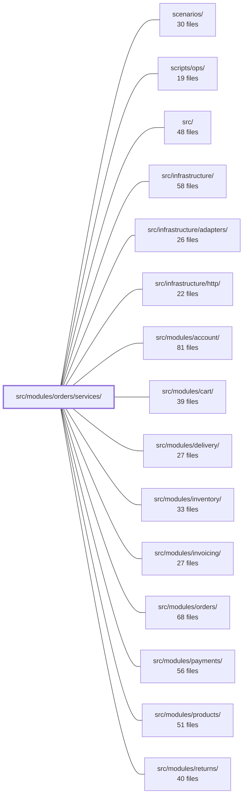

---
tags:
  - 2brain
  - 2brain/module
  - project/boilerplate-node-backend
type: module
module: src/modules/orders/services/
files: 14
updated: 2026-10-01T14:28:56.246189+00:00
---

# src/modules/orders/services/

## Purpose

The service layer of the Orders module. It owns every write path (place, cancel, status transition, override, retract), every read/serialization concern (search, fetch, image hydration, scope narrowing), and the cross-cutting side effects (email, audit, domain events, inventory release, PII retention) that accompany order lifecycle changes. Controllers and other modules never touch the repository directly—they go through this directory's public barrel.

## Key parts

- **Public facade** — `index.ts` re-exports all sub-services and bundles the primary operations into a single `orderService` constant; this is the only surface controllers and cross-module callers see.
- **Order lifecycle writes** — `place.ts` (single insert path shared by admin create and cart checkout), `cancel.ts` (shared cancel write with inventory release, refund tracking, notification), `status.ts` (sole status writer; validates moves against the lifecycle table and emits domain events), `override.ts` (sanctioned out-of-band status moves for admin correction and delivery's forced ship/deliver), `retract.ts` (undo a just-written checkout order).
- **Read & serialization** — `crud.ts` (search, fetch, create, update, partial delete), `current.ts` (batched catalogue-image hydration at the response boundary), `scope.ts` (authorization narrowing: which orders a caller may see, whose lifecycle column applies, which actions are exposed).
- **Order-creation support** — `snapshot.ts` (resolves live catalogue rows into frozen order-line snapshots), `order-numbering.ts` (formats the atomic yearly counter into `{year}-{sequence}`), `availability.ts` (live sellability check; cancels and notifies when a product stops being sellable).
- **Compliance & communication** — `notify.ts` (placed-order email and the shared `mailBuyer` policy), `retention.ts` (two-phase PII scrub after account erasure, treating orders as invoices under GDPR Art. 17(3)(b)/(e)).

## How it connects

- **Products** — `availability.ts` queries the product service for live `active`/`deletedAt` state; `snapshot.ts` and `current.ts` pull catalogue data (images, names) to hydrate order lines.
- **Cart** — `place.ts`'s `placeOrder` is the single insert path that both the cart checkout and the admin `create` endpoint in `crud.ts` delegate to.
- **Delivery** — `override.ts` exposes `forceMove` so delivery can trigger a ship/deliver status change; delivery never writes `order.status` directly.
- **Payments** — `status.ts` is the target for payment-fact reports; it decides whether the lifecycle allows the transition and emits the domain event.
- **Inventory** — `place.ts` reserves stock on creation; `cancel.ts` and `retract.ts` release the hold on teardown.
- **Account / Users** — `retention.ts` coordinates with account-erasure flows to detach and later scrub PII; `notify.ts` and `scope.ts` resolve buyer identity for email and authorization.
- **Invoicing** — `retention.ts` treats retained orders as invoices; the `invoice` sub-service is re-exported through `index.ts` for the invoicing module.
- **Infrastructure** — `snapshot.ts` depends on `@infrastructure/i18n` and `@kernel/translation`, which is why it lives in `services/` rather than the domain tier.

## Where to start

1. **`index.ts`** — shows the full public API surface and which sub-file owns which operation; one read orients you on the module's shape.
2. **`place.ts`** — the shortest "happy-path" write: you see how a new order is assembled (snapshot, stock reservation, order-number allocation, persistence) without the branching complexity of cancel or status logic.

## Connected modules

[[boilerplate-node-backend_ROOT|/ (repository root)]] · [[boilerplate-node-backend_scenarios|scenarios/]] · [[boilerplate-node-backend_scripts_ops|scripts/ops/]] · [[boilerplate-node-backend_src|src/]] · [[boilerplate-node-backend_src_infrastructure|src/infrastructure/]] · [[boilerplate-node-backend_src_infrastructure_adapters|src/infrastructure/adapters/]] · [[boilerplate-node-backend_src_infrastructure_http|src/infrastructure/http/]] · [[boilerplate-node-backend_src_modules_account|src/modules/account/]] · [[boilerplate-node-backend_src_modules_cart|src/modules/cart/]] · [[boilerplate-node-backend_src_modules_delivery|src/modules/delivery/]] · [[boilerplate-node-backend_src_modules_inventory|src/modules/inventory/]] · [[boilerplate-node-backend_src_modules_invoicing|src/modules/invoicing/]] · [[boilerplate-node-backend_src_modules_orders|src/modules/orders/]] · [[boilerplate-node-backend_src_modules_payments|src/modules/payments/]] · [[boilerplate-node-backend_src_modules_products|src/modules/products/]] · … and 2 more

## Files
- `src/modules/orders/services/availability.ts` — Determines whether the product lines on an order are still sellable (hard-deleted, soft-deleted, or deactivated) and, when a product stops being sellable, cancels all still-pending orders that hold it and notifies each buyer. It exists because the `active`/`deletedAt` fields frozen on an order line describe purchase-time state, not current state, so a live query to the product service is required.
- `src/modules/orders/services/cancel.ts` — Implements the order-cancellation write path and its follow-up side effects (inventory release, domain-event emission, refund tracking, audit, analytics, and customer notification). It exists as a single service so that both customer-initiated cancels and system-initiated cancels (reservation expiry, product removal) share one conditional-status-write guarantee and one ordered sequence of consequences.
- `src/modules/orders/services/crud.ts` — CRUD service layer for the Orders module: searching, fetching, creating, updating, and (partially) deleting order records. It composes lower-level operations (`placeOrder`, image resolution, email dispatch, audit/analytics emission) into the endpoints' public API. Cancellation is intentionally excluded—it lives in `./cancel` with its own multi-step sequence.
- `src/modules/orders/services/current.ts` — Attaches live catalogue images (`imageUrl`, `thumbnailUrl`) to each order line at the serialization boundary. The order model's `orderLineProductSchema` intentionally carries no image fields, so this module fetches them from the product catalogue in a single batched `$in` query per response, replacing the frozen (image-less) snapshot with the product's current picture.
- `src/modules/orders/services/index.ts` — Public barrel and service facade for the Order domain. It re-exports every operation from the `./` sub-modules (crud, place, cancel, status, override, retention, scope, availability, invoice, notify, retract, snapshot, order-numbering) and from `../config`, and bundles the primary ones into a single `orderService` object. Controllers and cross-module callers interact with the order domain **only** through this file's named exports or the `orderService` constant.
- `src/modules/orders/services/notify.ts` — Sends the placed-order email (confirmation or bank-transfer instructions) and provides `mailBuyer`, the shared buyer-mail policy consumed by admin confirmations, cancellation notices, and delivery-shipped notices. The email variant is chosen from the order's own `paymentMethod` so callers (`create`, cart checkout) can never pick the wrong template.
- `src/modules/orders/services/order-numbering.ts` — Formats the repository's atomic yearly counter into the order-number string (`{year}-{sequence}`, e.g. `2026-000041`). It is a receipt number, not a tax-invoice number. All atomicity lives in the repository; this file is purely the presentation/formatting layer.
- `src/modules/orders/services/override.ts` — The admin override service — the single sanctioned path for moving an order's status outside `ORDER_LIFECYCLE`'s normal gates. Two public entry points (`overrideStatus` for manual correction, `forceMove` for delivery's forced ship/deliver) both funnel through one private `applyOverride` so that the history row, domain event, and audit record are emitted exactly once and can never drift between callers. `orders` remains the sole status writer even here; `delivery` never touches `order.status` directly.
- `src/modules/orders/services/place.ts` — The single write path for creating a new order row. Both `crud.ts`'s admin `create` and `@modules/cart`'s checkout delegate to `placeOrder`, so the actual insert exists in exactly one place. The function freezes line items, reserves stock, allocates an order number, and persists the document—returning a plain verdict rather than an HTTP envelope.
- `src/modules/orders/services/retention.ts` — Implements the two-phase PII lifecycle for orders after an account is erased. Orders are treated as invoices (retained under GDPR Art. 17(3)(b)/(e)) rather than deleted; this file first detaches the user link, then later scrubs residual PII once a per-order retention window elapses.
- `src/modules/orders/services/retract.ts` — Provides a single-undo path for an order that was written by checkout but must not be kept (e.g. a lost `CART_CHANGED` race). It releases the inventory hold and deletes the order row without ever throwing, because the caller has already decided to refuse the request.
- `src/modules/orders/services/scope.ts` — Defines the authorization boundary for order reads and per-order actions. Every other order service calls into this file before writing: `callerScope` narrows *which* orders a caller may see, `actorOf` picks *whose* lifecycle column applies, and `withActions` attaches the resulting action set to the wire response.
- `src/modules/orders/services/snapshot.ts` — Resolves catalogue product rows into the frozen order-line snapshots that every order writer embeds. It lives in `services/` (not `domain/`) because it deliberately depends on `@infrastructure/i18n` and `@kernel/translation`, which the domain tier is not allowed to touch.
- `src/modules/orders/services/status.ts` — The sole status writer for orders in the application. Other modules (`payments`, `delivery`) call these functions to *report* a fact they have already recorded; this file decides whether the move still applies (via the lifecycle table) and emits the resulting domain event. It is never the one recording the underlying fact.

---
[[boilerplate-node-backend_INDEX|← boilerplate-node-backend index]]
