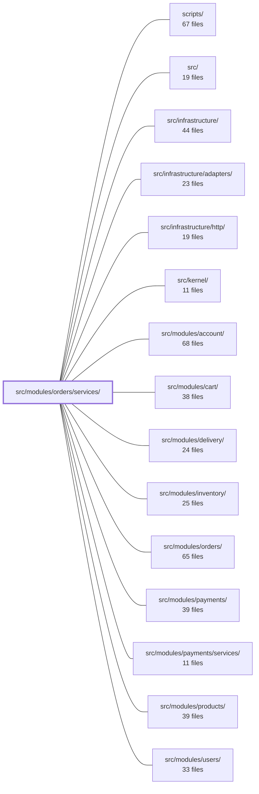

---
tags:
  - 2brain
  - 2brain/module
  - project/boilerplate-node-backend
type: module
module: src/modules/orders/services/
files: 15
updated: 2026-09-27T16:21:35.943034+00:00
---

# src/modules/orders/services/

## Purpose

The `services/` directory is the single application-level write-and-read surface for the Orders domain. Every state mutation (placing, cancelling, status transitions, admin overrides), every read-side enrichment (live images, action scoping), and every cross-module side-effect (inventory release, email, invoice PDF, PII scrubbing) is orchestrated here. Controllers and other modules never touch the repository directly; they go through this layer.

## Key parts

- **Order lifecycle writers** — `place.ts` (single insert path), `cancel.ts` (single cancel path with its side-effect sequence), `status.ts` (sole status-state-machine writer), `override.ts` (admin / delivery force-move), `retract.ts` (post-checkout undo), `availability.ts` (live sellable check that can cascade-cancel pending orders).
- **Read / serialization** — `crud.ts` (search, fetch, admin create/update, partial delete), `current.ts` (batched live-image attachment), `snapshot.ts` (freezes catalogue rows into order-line snapshots), `scope.ts` (authorization boundary: which orders a caller sees and which actions are attached).
- **Supporting services** — `notify.ts` (buyer email templates and shared `mailBuyer` policy), `invoice.ts` (on-demand PDF render with single-flight guard), `order-numbering.ts` (counter → human-readable order number), `retention.ts` (two-phase GDPR PII scrubbing after account erasure).
- **Public facade** — `index.ts` re-exports every operation and bundles the primary ones into the `orderService` object; this is the only entry point other modules import.

## How it connects

- **`src/modules/cart/`** – Checkout delegates the actual order insert to `place.ts` (`placeOrder`), so cart never writes an order row itself.
- **`src/modules/payments/services/`** – After recording a payment fact, payments calls into `status.ts` to report the transition; it never writes `order.status` directly.
- **`src/modules/delivery/`** – Delivery reports ship/deliver facts through `status.ts`; forced moves go through `override.ts` (`forceMove`). Delivery never touches `order.status` on its own.
- **`src/modules/inventory/`** – `place.ts` reserves stock on creation; `cancel.ts` and `retract.ts` release the hold on teardown.
- **`src/modules/products/`** – `availability.ts` queries the product service for live `active`/`deletedAt` state; `current.ts` batch-fetches catalogue images at serialization time.
- **`src/modules/account/`** – Account erasure triggers `retention.ts`, which detaches the user link and later scrubs residual PII.
- **`src/infrastructure/` and `src/kernel/`** – `snapshot.ts` depends on `@infrastructure/i18n` and `@kernel/translation` (which is why it sits in `services/` rather than `domain/`); `invoice.ts` relies on the Chromium adapter under `infrastructure/`.
- **`src/modules/orders/`** (parent) – Domain schemas, the `ORDER_LIFECYCLE` table, and module config live one level up and are consumed by every service here.

## Where to start

1. **`index.ts`** – Skim the barrel to see the full public surface and the shape of the `orderService` facade; it tells you what callers actually import.
2. **`place.ts`** – Read the single write path for a new order. It touches inventory reservation, snapshot freezing, order-numbering, and persistence in one short function, giving you the mental model that every other service reuses (conditional status write → side-effect sequence → domain event).

## Connected modules

[[boilerplate-node-backend_ROOT|/ (repository root)]] · [[boilerplate-node-backend_scripts|scripts/]] · [[boilerplate-node-backend_src|src/]] · [[boilerplate-node-backend_src_infrastructure|src/infrastructure/]] · [[boilerplate-node-backend_src_infrastructure_adapters|src/infrastructure/adapters/]] · [[boilerplate-node-backend_src_infrastructure_http|src/infrastructure/http/]] · [[boilerplate-node-backend_src_kernel|src/kernel/]] · [[boilerplate-node-backend_src_modules_account|src/modules/account/]] · [[boilerplate-node-backend_src_modules_cart|src/modules/cart/]] · [[boilerplate-node-backend_src_modules_delivery|src/modules/delivery/]] · [[boilerplate-node-backend_src_modules_inventory|src/modules/inventory/]] · [[boilerplate-node-backend_src_modules_orders|src/modules/orders/]] · [[boilerplate-node-backend_src_modules_payments|src/modules/payments/]] · [[boilerplate-node-backend_src_modules_payments_services|src/modules/payments/services/]] · [[boilerplate-node-backend_src_modules_products|src/modules/products/]] · … and 1 more

## Files
- `src/modules/orders/services/availability.ts` — Determines whether the product lines on an order are still sellable (hard-deleted, soft-deleted, or deactivated) and, when a product stops being sellable, cancels all still-pending orders that hold it and notifies each buyer. It exists because the `active`/`deletedAt` fields frozen on an order line describe purchase-time state, not current state, so a live query to the product service is required.
- `src/modules/orders/services/cancel.ts` — Implements the order-cancellation write path and its follow-up side effects (inventory release, domain-event emission, refund tracking, audit, analytics, and customer notification). It exists as a single service so that both customer-initiated cancels and system-initiated cancels (reservation expiry, product removal) share one conditional-status-write guarantee and one ordered sequence of consequences.
- `src/modules/orders/services/crud.ts` — CRUD service layer for the Orders module: searching, fetching, creating, updating, and (partially) deleting order records. It composes lower-level operations (`placeOrder`, image resolution, email dispatch, audit/analytics emission) into the endpoints' public API. Cancellation is intentionally excluded—it lives in `./cancel` with its own multi-step sequence.
- `src/modules/orders/services/current.ts` — Attaches live catalogue images (`imageUrl`, `thumbnailUrl`) to each order line at the serialization boundary. The order model's `orderLineProductSchema` intentionally carries no image fields, so this module fetches them from the product catalogue in a single batched `$in` query per response, replacing the frozen (image-less) snapshot with the product's current picture.
- `src/modules/orders/services/index.ts` — Public barrel and service facade for the Order domain. It re-exports every operation from the `./` sub-modules (crud, place, cancel, status, override, retention, scope, availability, invoice, notify, retract, snapshot, order-numbering) and from `../config`, and bundles the primary ones into a single `orderService` object. Controllers and cross-module callers interact with the order domain **only** through this file's named exports or the `orderService` constant.
- `src/modules/orders/services/invoice.ts` — Renders an order's invoice as a PDF on demand — a synchronous, request-scoped view rather than a durable entity with its own lifecycle. A TTL-backed file cache and a single-flight guard in front of the Chromium render prevent redundant launches during bursts of requests for the same order.
- `src/modules/orders/services/notify.ts` — Sends the placed-order email (confirmation or bank-transfer instructions) and provides `mailBuyer`, the shared buyer-mail policy consumed by admin confirmations, cancellation notices, and delivery-shipped notices. The email variant is chosen from the order's own `paymentMethod` so callers (`create`, cart checkout) can never pick the wrong template.
- `src/modules/orders/services/order-numbering.ts` — Formats the repository's atomic yearly counter into the order-number string (`{year}-{sequence}`, e.g. `2026-000041`). It is a receipt number, not a tax-invoice number. All atomicity lives in the repository; this file is purely the presentation/formatting layer.
- `src/modules/orders/services/override.ts` — The admin override service — the single sanctioned path for moving an order's status outside `ORDER_LIFECYCLE`'s normal gates. Two public entry points (`overrideStatus` for manual correction, `forceMove` for delivery's forced ship/deliver) both funnel through one private `applyOverride` so that the history row, domain event, and audit record are emitted exactly once and can never drift between callers. `orders` remains the sole status writer even here; `delivery` never touches `order.status` directly.
- `src/modules/orders/services/place.ts` — The single write path for creating a new order row. Both `crud.ts`'s admin `create` and `@modules/cart`'s checkout delegate to `placeOrder`, so the actual insert exists in exactly one place. The function freezes line items, reserves stock, allocates an order number, and persists the document—returning a plain verdict rather than an HTTP envelope.
- `src/modules/orders/services/retention.ts` — Implements the two-phase PII lifecycle for orders after an account is erased. Orders are treated as invoices (retained under GDPR Art. 17(3)(b)/(e)) rather than deleted; this file first detaches the user link, then later scrubs residual PII once a per-order retention window elapses.
- `src/modules/orders/services/retract.ts` — Provides a single-undo path for an order that was written by checkout but must not be kept (e.g. a lost `CART_CHANGED` race). It releases the inventory hold and deletes the order row without ever throwing, because the caller has already decided to refuse the request.
- `src/modules/orders/services/scope.ts` — Defines the authorization boundary for order reads and per-order actions. Every other order service calls into this file before writing: `callerScope` narrows *which* orders a caller may see, `actorOf` picks *whose* lifecycle column applies, and `withActions` attaches the resulting action set to the wire response.
- `src/modules/orders/services/snapshot.ts` — Resolves catalogue product rows into the frozen order-line snapshots that every order writer embeds. It lives in `services/` (not `domain/`) because it deliberately depends on `@infrastructure/i18n` and `@kernel/translation`, which the domain tier is not allowed to touch.
- `src/modules/orders/services/status.ts` — The sole status writer for orders in the application. Other modules (`payments`, `delivery`) call these functions to *report* a fact they have already recorded; this file decides whether the move still applies (via the lifecycle table) and emits the resulting domain event. It is never the one recording the underlying fact.

---
[[boilerplate-node-backend_INDEX|← boilerplate-node-backend index]]
