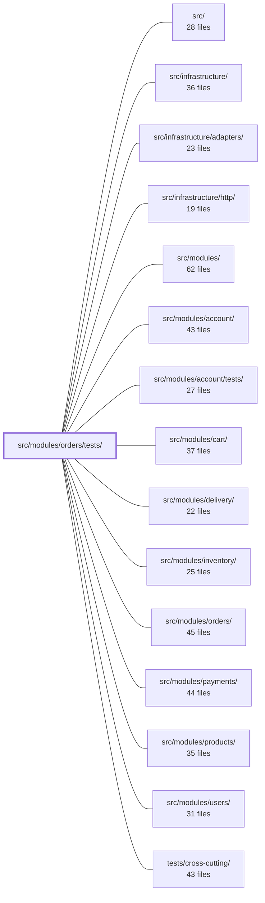

---
tags:
  - 2brain
  - 2brain/module
  - project/boilerplate-node-backend
type: module
module: src/modules/orders/tests/
files: 33
updated: 2026-09-23T20:38:22.551408+00:00
---

# src/modules/orders/tests/

## Purpose

This directory is the complete test suite for the orders module. It spans three tiers—contract, integration, and unit—covering the HTTP response contract, real-database write/read semantics, and pure domain logic. Every file here exists to pin a specific behavioral guarantee that would otherwise regress silently: from OpenAPI compliance and audit-trail fidelity down to the cent-level arithmetic of `orderTotal`.

## Key parts

- **`factories.ts`** — Test-database wrappers that convert a persisted `ProductDocument` into a snapshot line and provide thin CRUD helpers. Every integration test in this directory builds fixtures through it.
- **`contract/api.contract.test.ts`** — Validates every `/orders` HTTP response against the published OpenAPI spec via `toSatisfyApiSpec()`. The only test that crosses the full HTTP boundary to catch spec drift.
- **`integration/`** — Fourteen test files that run against a real MongoDB instance:
  - *Service-level*: `service-crud.test.ts` (write path), `service-search.test.ts` (read/aggregate path), `service-status.test.ts` (state transitions), `service-override.test.ts` (admin overrides), `repository.test.ts` (raw repository contract).
  - *Cross-cutting invariants*: `pending-effects.test.ts` (durability of failed side-effects), `retention.test.ts` (PII anonymization cascade), `cancel.test.ts` (cancellation semantics and events), `create-audit.test.ts` (actor identity in audit).
  - *Invoice & money*: `invoice-number.test.ts` (all-or-nothing invoice fields over HTTP), `invoice-numbering.test.ts` (unique, gap-free numbering under concurrency), `invoice-vat.test.ts` (VAT in rendered PDF + JSON), `model.test.ts` (serialization: no `_id`/`__v` leakage).
  - *Schema & config*: `schema-contract.test.ts` (Mongoose declaration assertions against a live DB).
- **`unit/`** — Seventeen test files covering pure logic with no database:
  - *Money & tax*: `money.property.test.ts`, `totals.property.test.ts` (property-based, fast-check), `tax.test.ts`, `transfer-reference.test.ts`.
  - *Domain rules & lifecycle*: `lifecycle.test.ts`, `domain-rules.test.ts`, `service-scope.test.ts` (authorization boundary).
  - *Rendering & notification*: `emails.test.ts`, `notify.test.ts` (invoice-attachment pipeline), `invoice.test.ts` (render + cache + single-flight).
  - *Wiring & contracts*: `routes.test.ts` (router table), `audit.test.ts` (action-string wire contract), `config.test.ts` (boot-time gates), `serialization-guards.test.ts`, `snapshot.test.ts` (buyer-language freeze), `schema-contract.test.ts` (declaration-level), `factories.test.ts`.

## How it connects

- **`src/modules/orders/`** — The system under test. Every file here imports services (`orderService`, `orderRepository`, `orderTaxBreakdown`, `applyOrderTransform`, etc.), the Mongoose schema, the router table, and the domain rules from that module.
- **`src/modules/products/`** — `factories.ts` and snapshot tests depend on a real `ProductDocument` to build embedded snapshots; `service-search.test.ts` exercises live-image resolution against the catalogue.
- **`src/modules/users/` / `src/modules/account/`** — `retention.test.ts` asserts the `USER_DELETED` event cascade that detaches orders from an account and stamps the anonymization deadline.
- **`src/modules/payments/`** — `cancel.test.ts` and `service-status.test.ts` verify refund semantics and the `markPaid` transition that the payments module triggers.
- **`src/infrastructure/http/`** — `contract/api.contract.test.ts` and `invoice-number.test.ts` exercise the HTTP layer to confirm the full request→response pipeline matches the OpenAPI contract.
- **`tests/support/`** — Shared test helpers (database lifecycle, HTTP client setup, OpenAPI loader) consumed by the integration and contract tiers.
- **`tests/integration/` / `tests/cross-cutting/`** — Higher-level suites that compose the orders module with other modules; the unit/integration tests here keep the orders-side contracts stable so those suites can rely on them.

## Where to start

1. **`factories.ts`** — Reading this first shows how every fixture in the suite is built (persisted product → snapshot line → order document), which makes all the integration tests immediately legible.
2. **`unit/lifecycle.test.ts`** — A short, pure, mock-free file that encodes the state-machine rules (who may move an order where). Understanding the legal transitions makes the `service-status`, `cancel`, and `service-override` integration tests far easier to follow.

## Connected modules

[[boilerplate-node-backend_src|src/]] · [[boilerplate-node-backend_src_infrastructure|src/infrastructure/]] · [[boilerplate-node-backend_src_infrastructure_adapters|src/infrastructure/adapters/]] · [[boilerplate-node-backend_src_infrastructure_http|src/infrastructure/http/]] · [[boilerplate-node-backend_src_modules|src/modules/]] · [[boilerplate-node-backend_src_modules_account|src/modules/account/]] · [[boilerplate-node-backend_src_modules_account_tests|src/modules/account/tests/]] · [[boilerplate-node-backend_src_modules_cart|src/modules/cart/]] · [[boilerplate-node-backend_src_modules_delivery|src/modules/delivery/]] · [[boilerplate-node-backend_src_modules_inventory|src/modules/inventory/]] · [[boilerplate-node-backend_src_modules_orders|src/modules/orders/]] · [[boilerplate-node-backend_src_modules_payments|src/modules/payments/]] · [[boilerplate-node-backend_src_modules_products|src/modules/products/]] · [[boilerplate-node-backend_src_modules_users|src/modules/users/]] · [[boilerplate-node-backend_tests_cross-cutting|tests/cross-cutting/]] · … and 2 more

## Files
- `src/modules/orders/tests/contract/api.contract.test.ts` — Contract tests for the `/orders` resource that validate every HTTP response against the OpenAPI spec via `toSatisfyApiSpec()`. The file exists because the orders API had drifted from its published contract (a list endpoint returned `totalItems`/`totalQuantity`/`totalPrice` where the spec declared a single `total`, and `GET /orders/{id}` returned different shapes per caller role) and no test crossed the HTTP boundary to catch either divergence.
- `src/modules/orders/tests/factories.ts` — Test-database wrappers around the pure order builder in `../factories.ts`. Where the parent factory builds an order payload from in-memory data (suitable for seeds that never persist a product), this file converts a real persisted `ProductDocument` into a snapshot line and adds thin CRUD helpers so order tests can create, read, and assert on documents in the test database without going through `orderService`.
- `src/modules/orders/tests/integration/cancel.test.ts` — Integration tests for `orderService.cancelById`. Verifies the status-gate invariant (only `pending`/`processing` orders are cancellable), the scope gate (a stranger's order is indistinguishable from a missing one), the refund semantics per role, and that cancellation emits the correct domain event, audit entry, and analytics signal — all against a real test database.
- `src/modules/orders/tests/integration/create-audit.test.ts` — Integration test verifying that the order-creation audit trail always reflects the **real** caller's role name (`actor_role_name`), never a hardcoded label like "customer." It guards against a regression where the `create` path could silently overwrite the role with a fixed string.
- `src/modules/orders/tests/integration/invoice-number.test.ts` — Integration tests (over real HTTP) that verify the "all-or-nothing" contract for an order's invoice number and date of supply: both fields appear together on the response, or neither does. Mirrors the same shape already proven for the VAT block in `invoice-vat.test.ts`.
- `src/modules/orders/tests/integration/invoice-numbering.test.ts` — Integration test verifying that `allocateInvoiceNumber` produces unique, gap-free, year-scoped invoice numbers under both serial and concurrent load. It is explicitly integration (not unit) because the atomicity guarantee lives in a single `findOneAndUpdate` against a real MongoDB instance—behavior that is unprovable with a mock.
- `src/modules/orders/tests/integration/invoice-vat.test.ts` — Integration test that verifies VAT figures are correctly computed and exposed in two places: the HTML rendered for the invoice PDF (`GET /orders/{id}/invoice`) and the JSON body of `GET /orders/{id}`. It complements `api.contract.test.ts`, which covers the invoice route's authorization scope, by asserting on the actual rendered content and published fields.
- `src/modules/orders/tests/integration/model.test.ts` — Integration test suite that guards the order serialization contract: `_id` and `__v` must never appear in any response shape (Mongoose `toJSON`, `.aggregate()` results, scoped lookups), embedded product snapshots must be normalized the same way, order items must carry no `_id`, `transferInstructions` must not be fabricated for legacy orders, and product-schema indexes must not leak into the order schema.
- `src/modules/orders/tests/integration/pending-effects.test.ts` — Integration tests for the "pending effects" durability mechanism: when `cancelById` fires `ORDER_CANCELLED` and the refund handler throws, a `pendingEffects: ['refund']` marker must survive in the order document, and `retryPendingEffects` must later re-announce the event to discharge it. All assertions read back from a real Mongo instance to verify actual write semantics (conditional `$set`, conditional `$pull`, sparse-index query) rather than service return values.
- `src/modules/orders/tests/integration/repository.test.ts` — Integration test suite for `orderRepository` that runs against a real (test) database. It verifies three contract areas: `create` (fixture-driven insert), `aggregate` (the repository is a raw passthrough that does **not** reshape MongoDB pipeline stages), and `findByIdScoped` (two structurally different branches — unscoped/hydrated doc vs scoped/aggregate row). The aggregate and scoped-branch tests exist to pin design decisions that TypeScript and response-body assertions alone cannot catch.
- `src/modules/orders/tests/integration/retention.test.ts` — Integration suite that verifies the two halves of order PII retention: (1) the `USER_DELETED` event cascade detaches the order from its account and stamps an `anonymizeAfter` deadline, and (2) the `anonymizeDueOrders` sweep scrubs the remaining PII once that deadline passes. Tests run through real module wiring (`registerModules`) rather than calling service functions directly, so a broken subscription in `orders/module.ts` would cause a failure.
- `src/modules/orders/tests/integration/schema-contract.test.ts` — Integration test that asserts the Mongoose **schema declarations** for orders — `required` fields, `default` values, and `select: false` on credentials — rather than application-level transform behaviour. It runs against a real MongoDB instance because the assertions target Mongoose's own interpretation of those declarations, which a mock would only paraphrase.
- `src/modules/orders/tests/integration/service-crud.test.ts` — Integration tests for the **write** half of the order CRUD service (`create`, `getById`, `update`, `updateById`, `remove`, `removeById`). The read/aggregation half (`search`) is covered in `service-search.test.ts`. Two behaviors carry the most weight here: `create` embeds a full product snapshot (title, price) so later repricing cannot rewrite historical charges, and `getById`'s `scope` argument acts as an authorization boundary — a mismatched scope must return `undefined` with no leak that the order exists.
- `src/modules/orders/tests/integration/service-override.test.ts` — Integration tests for the admin-order-override service (`orders/services/override.ts`). Runs against a real MongoDB instance to verify that the two override doors — `overrideStatus` (forward-only, status-only) and `forceMove` (skip-ahead) — perform correct conditional writes, record the expected `statusOverrides` history entries, and emit the right domain events.
- `src/modules/orders/tests/integration/service-search.test.ts` — Integration tests for `orderService.search` — the read path of the orders service. Covers the three computed totals that only exist because the aggregate pipeline derives them (`totalItems`, `totalQuantity`, `totalPrice`), all supported filter fields, pagination, the raw `scope` parameter, and the live-image resolution (`current`) that depends on the catalogue product still existing. Complements `service-crud.test.ts`, which exercises the write half (`create`, `update`, `remove`).
- `src/modules/orders/tests/integration/service-status.test.ts` — Integration tests for the order status-transition functions (`markPaid`, `markShipped`, `markDelivered`) in `services/status.ts`. They verify correct state moves, illegal-move rejection, domain-event emission, and single-writer correctness under a concurrent race — all against a real MongoDB instance rather than mocks, because the guarantee under test is the conditional `$in` write that only a live database can exercise.
- `src/modules/orders/tests/unit/audit.test.ts` — Contract test that pins the `ordersAuditActions` string vocabulary byte-for-byte. The action strings are a **wire contract** consumed by external log-query dashboards and alert rules (outside this repo), so this test guards against accidental renames, value changes, or silent additions/removals of actions.
- `src/modules/orders/tests/unit/config.test.ts` — Unit test suite for the orders module's deployment configuration. It verifies two concerns: (1) the boot-time gate that `assertRequiredConfig` enforces against the orders module manifest (shop identity is mandatory, VAT/legal name are optional), and (2) the pure environment-reader functions for shop identity, bank-transfer payment settings, and invoice cache TTL. Tests are driven through the real `assertRequiredConfig` entry point so the wiring itself is exercised, not just the manifest data.
- `src/modules/orders/tests/unit/domain-rules.test.ts` — Unit tests for the `checkOrderLines` domain rule. Verifies that the rule correctly accepts or rejects a set of order-line candidates based on whether every product has resolved, without any mocks, database, or fake timers.
- `src/modules/orders/tests/unit/emails.test.ts` — Unit tests for the two customer-facing money renderers — `orderConfirmEmail` and `invoiceDocument` — that must agree with the charge the customer actually sees. The file asserts that these builders *delegate* totals to `orderTotal`, render one line per item with correct per-item fields, respect locale, and never re-resolve product titles through the i18n `t()` function. It deliberately does not re-test arithmetic (that lives in `totals.property.test.ts`).
- `src/modules/orders/tests/unit/factories.test.ts` — Unit tests for the `makeOrder` fixture builder. Verifies that the generated order document satisfies schema constraints (required fields, ObjectId types, array defaults) and that the embedded product snapshot is shaped correctly for downstream consumers (confirmation email, invoice rendering).
- `src/modules/orders/tests/unit/invoice.test.ts` — Unit tests for the invoice-rendering service (`services/invoice.ts`). Covers locale-frozen rendering, the not-found and failed-render paths, the TTL disk cache (hit, miss, expiry, negative-case), single-flight collapsing of concurrent misses, and the two reap sweeps. A final describe block (historically co-located here) exercises the upload chain's locale re-entry after multer consumes the stream.
- `src/modules/orders/tests/unit/lifecycle.test.ts` — Unit tests for the order-lifecycle state table and its derived query functions. The file exists to assert the *rules* the table encodes (who may move an order where, under what conditions) rather than restating individual rows, so that a copy-paste error in the table itself would be caught. All tests are pure — no mocks, no database.
- `src/modules/orders/tests/unit/money.property.test.ts` — Property-based tests for the `Money` domain module. The invariant under test is that **no** monetary function can ever produce `NaN`, `Infinity`, or a fractional cent, regardless of input. Arbitraries are deliberately hostile (junk strings, booleans, `undefined`, overflow values) rather than realistic, and the suite is seeded so any counterexample is reproducible and can be pinned as a plain `it()` case.
- `src/modules/orders/tests/unit/notify.test.ts` — Unit tests for the **invoice-attachment pipeline** inside `sendOrderPlacedEmail` (`services/notify.ts`). The file asserts that a rendered invoice PDF is spooled and attached as `{ filename, key }` to the outgoing mail, that a render failure degrades gracefully (mail still sends, attachment omitted, error logged), and that the attachment rides along with both the card-confirmation and bank-transfer-instructions email variants. It deliberately does **not** test which email builder is selected — that coverage lives in `emails.test.ts`.
- `src/modules/orders/tests/unit/routes.test.ts` — Unit test that pins the orders router's contract: exact endpoint list and order, per-route authorization guards, cache tagging/invalidation policy, and the invoice rate-limit budget. It exists to catch silent route-table regressions (missing guards, wrong cache keys, accidental route shadowing) without spinning up an HTTP server.
- `src/modules/orders/tests/unit/schema-contract.test.ts` — Unit test that asserts the Mongoose schema **declaration** of `orderSchema` directly — required fields, types, defaults, enum bounds, sub-schema shapes, index specs, and schema options. It exists because integration tests that drive real saves cannot catch declaration-level defects (a removed `required`, a flipped `_id: false`, a reversed index direction) since those don't change what a valid document looks like.
- `src/modules/orders/tests/unit/serialization-guards.test.ts` — Unit tests that lock in the defensive guards inside `applyOrderTransform`. The transform is the single choke point every order response passes through, so a throw there converts a valid read into a 500. These tests exist to ensure the guards (which handle "cannot happen" shapes like projected documents or non-array `items`) actually prevent that failure.
- `src/modules/orders/tests/unit/service-scope.test.ts` — Unit tests for the order-read authorization boundary: `orderService.callerScope` (how a CASL caller compiles into a MongoDB query filter) and `actorOf` (which lifecycle column a caller's identity resolves to). The file exists to lock down the fail-closed semantics — unrestricted reads, scoped reads, and anonymous reads — so a future rule change cannot silently widen what an unauthenticated or mis-identified caller sees.
- `src/modules/orders/tests/unit/snapshot.test.ts` — Unit tests for the buyer-language snapshot freezing logic (`resolveSnapshotProducts` and `freezeOrderLines`). A fake `TranslationPort` replaces the real `@modules/locales` dependency so the tests verify the fallback-chain wiring, explicit-locale binding, `_id` preservation, VAT-rate resolution, and weight handling without a database.
- `src/modules/orders/tests/unit/tax.test.ts` — Unit tests for `orderTaxBreakdown`, the pure function that computes per-line and order-level VAT figures (net, tax, gross) from a list of taxable line items and an optional shipping cost. The tests pin down rounding behavior, shipping apportionment rules, and the internal consistency of every output field.
- `src/modules/orders/tests/unit/totals.property.test.ts` — Property-based tests (via `fast-check`) for `sumLineItems` and `orderTotal`. The file's central concern is **totality**: no input—however malformed or nullish—may produce `NaN` or throw. Beyond that it pins the arithmetic invariants (order-independence, additivity, scaling) to the cent, and verifies that `orderTotal` composes line totals with shipping without drift.
- `src/modules/orders/tests/unit/transfer-reference.test.ts` — Unit tests for the transfer-reference domain logic. Verifies that `buildReference` mints a well-formed, deterministic identifier per order and that `parseReference` round-trips valid references while rejecting malformed, mistyped, or non-reference inputs—ensuring a customer-entered reference can never silently resolve to the wrong order.

---
[[boilerplate-node-backend_INDEX|← boilerplate-node-backend index]]
