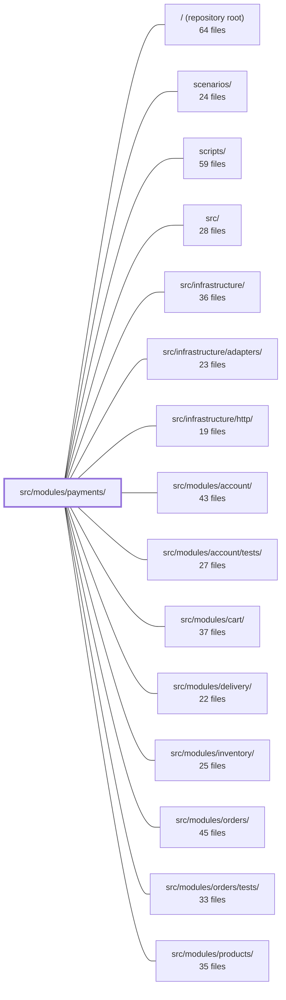

---
tags:
    - 2brain
    - 2brain/module
    - project/boilerplate-node-backend
type: module
module: src/modules/payments/
files: 44
updated: 2026-09-23T20:38:40.407085+00:00
---

# src/modules/payments/

## Purpose

The payments module owns the full monetary lifecycle of a shop order: discovering available methods, creating a provider-side payment intent, confirming or syncing a settlement, ingesting provider webhooks, recording offline payments, issuing refunds, and managing post-transaction retention. It is a bounded context exposed through a single barrel (`index.ts`) so that sibling modules interact only with its public `paymentService` surface.

## Key parts

- **Service layer (`services/`)** — The business core. `intent.ts` opens a payment intent; `settlement.ts` is the single reconciliation funnel for confirm, sync, and webhook paths; `refunds.ts` is the only money-out path; `offline.ts` records non-card payments through the same settlement pipeline; `view.ts` powers the order-page payment panel; `lookup.ts` resolves bank-transfer reference codes; `retention.ts` handles erasure detach and abandoned-intent reaping; `scope.ts` centralises row-level access rules.
- **HTTP layer (`controllers/`, `routes.ts`, `openapi.yaml`)** — Thin Express handlers per endpoint (intent, confirm, sync, webhook, offline, refund, methods, lookup) wired by a router that layers auth, rate-limit, and idempotency middleware per route. The OpenAPI spec is the authoritative wire contract.
- **Provider abstraction (`providers/`)** — The `PaymentProvider` port, a runtime factory (`resolvePaymentProvider`), a `fake` PSP for demos/tests, and a shared HMAC webhook-signature scheme. Swapping providers is a config change, not a code refactor.
- **Data & persistence (`model.ts`, `repository.ts`)** — Mongoose schemas for the payment document and webhook-event ledger, plus the repository that centralises conditional writes, concurrency guards, and unique-index collision handling.
- **Module manifest & cross-cutting (`module.ts`, `config.ts`, `analytics.ts`, `audit.ts`, `events.ts`, `metrics.ts`, `rate-limits.ts`)** — Assembles routes, permissions, event subscriptions, boot-time config validation, Prometheus counters, typed analytics/audit/event registrations, and the three payment-specific rate-limit budgets.
- **Tests (`tests/`)** — Unit, integration, and contract suites covering the intent→settle→refund invariants, rate-limiters, retention guarantees, bank-transfer lookup, and the full HTTP wire contract.

## How it connects

- **`src/modules/orders/`** — Payments are keyed by `orderId`; `config.ts` reads bank-transfer values (IBAN, BIC, hold hours) from the orders module; settlement transitions the order `pending → paid`; `refunds.ts` listens for the orders module's `ORDER_CANCELLED` event to issue compensation refunds.
- **`src/modules/inventory/`** — The settlement pipeline commits stock when a payment transitions to `paid`; reaping abandoned intents never touches settled payments, preserving inventory state.
- **`src/modules/account/`** — `retention.ts` detaches the `userId` field from a payment document when an account is hard-deleted, so the payment survives as an anonymous receipt.
- **`src/modules/cart/`** — The cart checkout flow imports from the `paymentService` barrel to initiate the intent step, keeping cart free of payment-domain logic.
- **`src/infrastructure/`** — Consumes the shared `AnalyticsEventMap`, `AuditActionMap`, `DomainEventMap` (all augmented via TypeScript module augmentation), the shared `buildRateLimiter` factory, and the Prometheus registry for metrics.
- **`scenarios/`** — `module.ts` registers a demo scenario entry so the app's scenario runner can exercise a payment flow end-to-end.

## Where to start

1. **`services/settlement.ts`** — Every payment path (browser confirm, 3-D Secure sync, provider webhook, offline recording) funnels through `settlePayment`. Understanding this single function and its conditional-write guard gives you the module's most critical invariant: money is settled exactly once.
2. **`providers/index.ts`** — The `PaymentProvider` port and `resolvePaymentProvider` factory show the module's external boundary and how a real PSP is swapped for the `fake`. Reading this clarifies what the service layer assumes of the outside world.

## Connected modules

[[boilerplate-node-backend_ROOT|/ (repository root)]] · [[boilerplate-node-backend_scenarios|scenarios/]] · [[boilerplate-node-backend_scripts|scripts/]] · [[boilerplate-node-backend_src|src/]] · [[boilerplate-node-backend_src_infrastructure|src/infrastructure/]] · [[boilerplate-node-backend_src_infrastructure_adapters|src/infrastructure/adapters/]] · [[boilerplate-node-backend_src_infrastructure_http|src/infrastructure/http/]] · [[boilerplate-node-backend_src_modules_account|src/modules/account/]] · [[boilerplate-node-backend_src_modules_account_tests|src/modules/account/tests/]] · [[boilerplate-node-backend_src_modules_cart|src/modules/cart/]] · [[boilerplate-node-backend_src_modules_delivery|src/modules/delivery/]] · [[boilerplate-node-backend_src_modules_inventory|src/modules/inventory/]] · [[boilerplate-node-backend_src_modules_orders|src/modules/orders/]] · [[boilerplate-node-backend_src_modules_orders_tests|src/modules/orders/tests/]] · [[boilerplate-node-backend_src_modules_products|src/modules/products/]] · … and 5 more

## Files

- `src/modules/payments/analytics.ts` — Defines the canonical analytics event names for the payments module and registers them into the shared `AnalyticsEventMap` via TypeScript module augmentation, so that any consumer typing an event name against the `payments` channel gets autocomplete and compile-time safety without importing a duplicated list.
- `src/modules/payments/audit.ts` — Declares the set of audit action strings the payments module can emit and registers them into the infrastructure-wide `AuditActionMap` via TypeScript module augmentation. Keeping the strings in one typed const (rather than scattering literals) gives every consumer a single source of truth and a compile-time check against the audit log schema.
- `src/modules/payments/config.ts` — Centralises the payment-method configuration that belongs to the payments module: the list of methods offered to clients and the boot-time validation of bank-transfer credentials. Values are read per call (not cached at import) so a runtime change to a `NODE_BANK_TRANSFER_*` env var takes effect on the next request without a restart. The actual bank-transfer _values_ (beneficiary, IBAN, BIC, hold hours, enabled flag) live in `@modules/orders`; this file only validates them and derives the method list.
- `src/modules/payments/controllers/get-order-by-reference.ts` — Handler for `GET /payments/order-by-reference`. Given an RF reference code (read from a bank's website), it resolves the corresponding order and returns it with the caller's available next actions. It exists as the read step an admin performs before recording an offline payment via `POST /payments/order/:orderId/offline`.
- `src/modules/payments/controllers/get-payment-by-order.ts` — Single controller for `GET /payments/order/:orderId`. The order page's payment panel calls this on load so that a mid-flow reload can recover the existing payment intent (and its status) rather than starting the payment flow over from scratch.
- `src/modules/payments/controllers/get-payment-methods.ts` — Express controller that answers `GET /payments/methods` with the list of payment methods configured for the shop. It exists so the frontend can discover available checkout options dynamically instead of hard-coding them. The endpoint is intentionally public—guests should be able to see what payment options exist before signing up.
- `src/modules/payments/controllers/post-payment-confirm.ts` — Handler for `POST /payments/:id/confirm` — the final step where the browser submits its tokenised payment-method reference. This is where the payment outcome is resolved (succeeded, declined, or in-flight) and the corresponding events, metrics, and audit trail are produced.
- `src/modules/payments/controllers/post-payment-intent.ts` — Thin Express controller for `POST /payments/intent`. It validates the request body, delegates to the payment service to freeze an order's price and open a payment intent at the provider, and returns the resulting `Payment` object (including a transient `clientSecret`) with a `201`. All business rules—ownership, the `pending` gate, amount resolution—live in the service; this file performs no audit, analytics, or domain logic.
- `src/modules/payments/controllers/post-payment-offline.ts` — Thin Express controller for `POST /payments/order/:orderId/offline`. It validates the request body against a Zod schema, delegates to the payment service to record a payment the card provider never saw (admin-only, enforced at the route), and replies **201** with the persisted `Payment` object.
- `src/modules/payments/controllers/post-payment-refund.ts` — Thin Express controller for `POST /payments/order/:orderId/refund`. It performs a standalone monetary refund on an order without altering the order's status, giving an operator the ability to refund alone (as opposed to the "cancel + refund" flow where the client issues both calls). All business logic is delegated to `paymentService.refundByOrder`; this file only wires the HTTP layer to the service result.
- `src/modules/payments/controllers/post-payment-sync.ts` — HTTP handler for `POST /payments/:id/sync`. When the browser signals that a 3-D Secure challenge or wallet sheet has finished, this endpoint re-reads the provider's record and applies it, making the happy path _feel_ synchronous while the webhook remains the authority. It is idempotent: a payment already settled is answered locally without a provider call.
- `src/modules/payments/controllers/post-payment-webhook.ts` — Express controller for `POST /payments/webhook`. Receives payment-event notifications from an external provider, verifies the raw-body signature (no session auth), delegates the validated event to the payment service, and responds with 200 or 400. It exists to be the single, deliberately minimal entry point through which a payment provider's word becomes actionable in this system.
- `src/modules/payments/events.ts` — Declares the two domain events the payments module emits and registers them into the kernel's app-wide `DomainEventMap` via TypeScript module augmentation. This follows the same pattern as `modules/orders/events.ts` — each module augments the shared interface rather than contributing to a central list, keeping the event namespace distributed alongside the code that owns it.
- `src/modules/payments/index.ts` — Barrel (public entry point) for the payments module. It is the **only** surface a sibling module is allowed to import from, enforcing the strategic-DDD boundary rule (`docs/theory/strategic-ddd.md` §5). It re-exports the services, events, and model types while keeping the runtime model and `paymentRepository` internal.
- `src/modules/payments/metrics.ts` — Defines the Prometheus counters owned by the payments module. The counters live here (in the domain module) rather than in `infrastructure/observability` so that metric ownership follows the business capability. The overview endpoint reads them via the shared registry without needing to import this file directly.
- `src/modules/payments/model.ts` — Defines the Mongoose schemas, interfaces, and serialization transforms for two collections: the **payment document** (one per order, keyed by `orderId`) and the **webhook event ledger** (idempotency guard against provider retries). It is the single source of truth for the persisted data shape of the payments module and the rules around what may leave the server via serialization.
- `src/modules/payments/module.ts` — The manifest entry point for the payments module. It assembles the module's `AppModule` contract — routes, permissions, event subscriptions, config validation, rate limits, personal-data export, and the demo scenario — so the app tier can mount and boot the module as a unit.
- `src/modules/payments/openapi.yaml` — OpenAPI 3.0.3 module contract for the payments service. It defines the full HTTP surface of the payments module — public method discovery, payment-intent lifecycle, order-level payment lookup, RF-reference search, refund, and offline-payment recording — so that client code, gateway configs, and human readers share a single authoritative description of endpoints, schemas, and error semantics.
- `src/modules/payments/providers/fake.ts` — A stub payment-service-provider (PSP) that mirrors the shape of a real provider—returning intent references, async states, and signed webhooks—without ever calling an external service. It exists so demos, e2e suites, and integration tests can exercise the full 3-D Secure and webhook flows without a live PSP account.
- `src/modules/payments/providers/index.ts` — Defines the `PaymentProvider` port — the contract every PSP implementation must satisfy — along with the supporting types that describe a payment's lifecycle state. It also provides the `resolvePaymentProvider` factory that selects an implementation at runtime based on `NODE_PAYMENT_PROVIDER`. The file exists so that swapping or adding a PSP is a one-file, one-registry-line change rather than a code-path refactor.
- `src/modules/payments/providers/webhook-signature.ts` — Defines the shared HMAC-signature scheme for PSP webhooks: an HMAC-SHA256 over `<timestamp>.<raw body>` carried in a single header. It provides both the **sign** half (used by the demo provider and tests to produce valid deliveries) and the **verify** half (used by the controller to reject forgeries and replays). It lives in its own module so the signing side can be imported independently of the verification side and so a real PSP's native verifier can replace the verify half without touching the signing convention.
- `src/modules/payments/rate-limits.ts` — Defines the three rate-limit budgets for the payments module (webhook deliveries, confirm attempts, confirm declines) and turns each into an Express middleware via the shared `buildRateLimiter` factory. It also exports a small gate that escalates to a human challenge once an account has a prior decline on record.
- `src/modules/payments/repository.ts` — Defines the payment repository: the standard CRUD layer (via the shared factory) plus the two scoped reads and the guarded writes that payment services actually perform. It centralises concurrency safety (status-`$in` filters, conditional writes, unique-index collisions) so that service code can rely on a single atomic `findOneAndUpdate` rather than a read-then-write sequence.
- `src/modules/payments/routes.ts` — Express router that wires every payment endpoint to its controller, applying the correct authentication, authorization, idempotency, and rate-limit middleware per route. It enforces the module's security layering: two public routes above the auth wall, step-up-protected money-moving routes below it, and velocity limits on card validation.
- `src/modules/payments/services/index.ts` — Barrel (index) file for the payments services folder. It re-exports every public operation from the sibling service modules (`intent`, `settlement`, `refunds`, `offline`, `view`, `retention`, `lookup`, `scope`) plus `listPaymentMethods` from `../config`, and bundles the core operations into a single `paymentService` object. It exists so that `module.ts` can wire event listeners and downstream consumers (controllers, ops scripts, the cart checkout flow) can import a stable, named surface without reaching into individual service files.
- `src/modules/payments/services/intent.ts` — Entry point for the payment-intent flow: creates (or refreshes) the intent for a given order by freezing the amount, verifying the order is still payable and its lines are available, resolving the payer, and obtaining a `clientSecret` from the configured provider. It is the one response in the module that carries a `clientSecret` on the wire, since that value is never stored.
- `src/modules/payments/services/lookup.ts` — Thin lookup layer that resolves an RF bank-transfer reference to the order it pays. It sits one step in front of the existing `POST /payments/order/{orderId}/offline` settlement endpoint, letting an admin confirm _which_ order a pasted reference maps to before settling it. No settlement logic lives here.
- `src/modules/payments/services/offline.ts` — Records a payment that arrived outside the card provider (cash at the counter, bank transfer from a phone order) and routes it through the exact same `settlePayment` pipeline every card payment uses, so the order transitions `pending → paid`, stock commits, and the standard domain events fire without any branching logic.
- `src/modules/payments/services/refunds.ts` — The single money-out path in the payments module. Provides the operator-initiated refund action (`refundByOrder`) and the `ORDER_CANCELLED` event's compensation (`refundForOrder`), both funneled through one conditional status write (`performRefund`) that guarantees at-most-once semantics. No other file in the module is permitted to move money out.
- `src/modules/payments/services/retention.ts` — Handles the post-transaction lifecycle of payments: detaching payment rows from erased accounts, producing a user's full payment export, and sweeping payment attempts that were abandoned before settling. It is the "cleanup and accountability" counterpart to the core payment-creation flow.
- `src/modules/payments/services/scope.ts` — Single export that centralises the row-level access rule for the payments collection. Every other service in this directory resolves _which_ payments a caller may see by delegating to this one function, so the scoping logic lives in exactly one place.
- `src/modules/payments/services/settlement.ts` — The single reconciliation point for all payment state transitions. Browser-driven confirm, sync, and provider webhook all funnel into `settlePayment`, ensuring money is settled exactly once regardless of which entry point triggered it. Without this funnel, duplicate writes would double-commit inventory or double-refund.
- `src/modules/payments/services/view.ts` — Read-side service for the order page's payment panel: loads a payment for a given order (scoped to the caller) and attaches the `actions` object (`pay`, `refund`) that tells the client what it may do. The actions mirror the `OrderActions` contract so the order page can render one consistent action model across its panels.
- `src/modules/payments/tests/contract/api.contract.test.ts` — HTTP contract tests for every `/payments` route. They assert that each status-code branch the OpenAPI spec declares (201 intent, 200 confirm/sync, the three distinguishable 409s, 404, 422) is actually reachable over the wire and that the response body satisfies the published schema. Business/money rules are left to the unit suite; this file pins only the wire contract.
- `src/modules/payments/tests/integration/lookup.test.ts` — Integration test for the admin's bank-transfer reference lookup (`getOrderByReference`) and its immediate downstream settle step (`recordOfflinePayment`). It pins the contract that a reference minted at checkout resolves to its own order, that any miss (typo, unmatched, malformed) yields a uniform 404 with no oracle, and that the order the lookup returns is the one the existing offline endpoint settles — with no new settlement logic in between.
- `src/modules/payments/tests/integration/payment-velocity.test.ts` — Integration tests for the three payment-confirm rate limiters (`attempt`, `decline`, `challenge gate`) mounted on `POST /payments/:id/confirm`. The tests exercise the limiters directly against trivial Express handlers rather than the real payment route, because the property under test belongs to the limiters themselves and a real route would add a database round-trip to every attempt. Route-mounting correctness is covered separately in `payments/tests/unit/routes.test.ts`.
- `src/modules/payments/tests/integration/retention.test.ts` — Integration test suite covering two retention guarantees of the payments module: (1) **erasure detach** — when an account is hard-deleted, the associated payment's `userId` is unset (the payment survives as a receipt), and (2) **abandoned-intent reaping** — the `reapAbandonedPayments` sweep deletes unsettled intents that exceed a configurable age window, while never touching settled payments. Both paths are exercised through real module wiring rather than unit-level mocks.
- `src/modules/payments/tests/integration/service.test.ts` — Integration test suite for the payments service layer. It pins the invariants of the intent → confirm → (refund) lifecycle against a real Mongo database, using the `fake` payment provider. The guarantees under test are the conditional writes (one payment per order, order-status-conditional confirmation, at-most-once refund) and the stable error codes the public API exposes.
- `src/modules/payments/tests/unit/config.test.ts` — Unit tests for the two pure environment-read functions exported by `src/modules/payments/config.ts`: `listPaymentMethods` (backs `GET /payments/methods` and checkout) and `validateBankTransferConfig` (the boot-time `customCheck`). Because both functions only read `process.env`, no database or server is required.
- `src/modules/payments/tests/unit/module.test.ts` — Unit tests for the provider-selector half of the payments module's `customCheck` manifest entry. Verifies that an unrecognized `NODE_PAYMENT_PROVIDER` value is rejected at boot time (via `assertRequiredConfig`) rather than discovered lazily on the first payment.
- `src/modules/payments/tests/unit/providers.test.ts` — Unit tests for the payment provider port's fake implementation, the shared webhook-signature utilities, and the provider resolver. They verify provider-selection logic, the fake PSP's state machine, and signature verification in isolation—no database, no external service—so they live here rather than in `tests/integration/`.
- `src/modules/payments/tests/unit/rate-limits.test.ts` — Unit test that pins the _structural invariants_ of the confirm-attempt and confirm-decline rate-limit budgets: their relative strictness, shared window, and skip-successful semantics. It validates configuration shape only—no HTTP requests are made—leaving behavioural verification to the integration suite.
- `src/modules/payments/tests/unit/routes.test.ts` — Unit test for the payments router (`@modules/payments/routes`). Verifies the security-critical structure of the route table: which routes sit above vs. below the auth wall, which are admin-gated, guard composition on money-moving endpoints, and declaration order that prevents silent route shadowing.
- `src/modules/payments/tests/unit/schema-contract.test.ts` — Unit test that pins down the payment schema's contract: required fields, the unique index that guarantees at-most-one-payment-per-order, field types and references, numeric bounds, the status enum with its safe default, and timestamp options. It serves as both a regression test and the canonical record of the module's idempotence guarantee.

---

[[boilerplate-node-backend_INDEX|← boilerplate-node-backend index]]
