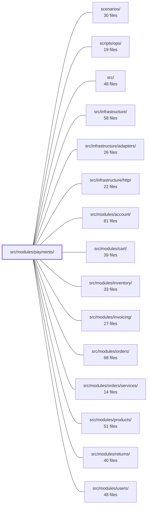

---
tags:
  - 2brain
  - 2brain/module
  - project/boilerplate-node-backend
type: module
module: src/modules/payments/
files: 56
updated: 2026-10-01T14:29:13.648926+00:00
---

# src/modules/payments/

## Purpose

The payments module owns the full monetary lifecycle of a shop order: discovering available payment methods, creating and confirming payment intents at a pluggable payment-service provider (PSP), reconciling provider webhooks, settling or refunding money, and recording offline (non-card) payments. It also centralises the module's observability surface (analytics events, audit actions, Prometheus counters), rate-limit budgets, provider-agnostic error types, and the Mongoose schema for the `Payment` collection.

## Key parts

- **Domain & persistence** — `model.ts` (Mongoose schema, status vocabulary, wire-visibility rules), `domain/` (lifecycle helpers), `events.ts` (two domain events registered via module augmentation), `config.ts` (method list, grace window, Stripe key gate, bank-transfer validation), `repository.ts` (guarded writes, ownership scoping, idempotency).
- **Services (business logic)** — `services/` is split by concern: `intent.ts` (create/refresh/cancel intents), `settlement.ts` (single reconciliation point for all settle triggers), `refunds.ts` (the only path that moves money out), `offline.ts` (non-card settlement), `effects.ts` (crash-recovery sweep), `retention.ts` (data-export, erasure, abandoned-attempt sweep), `scope.ts` (row-level access rule), `lookup.ts` (RF reference → order), `errors.ts` (canonical 409 leaf), and `index.ts` (barrel re-export).
- **HTTP controllers & routing** — `controllers/` (one file per endpoint: methods, intent, confirm, webhook, sync, refund, offline, get-by-order, get-by-reference), `routes.ts` (middleware ordering: auth, step-up, idempotency, rate-limit), `rate-limits.ts` (webhook, confirm-attempt, and decline budgets plus a human-challenge escalation gate).
- **Provider port** — `providers/index.ts` (the `PaymentProvider` interface + registry), `providers/fake.ts` (full-featured stub for tests and demos), `providers/webhook-signature.ts` (shared HMAC scheme), `providers/errors.ts` (port-level error types, split out to break a circular import).
- **Observability & contracts** — `analytics.ts`, `audit.ts`, `metrics.ts` (each registered into a shared map or registry via augmentation), `openapi.yaml` (API contract), `presenter.ts` (response shaping).
- **Module wiring** — `module.ts` (the `AppModule` manifest consumed by the kernel at boot), `index.ts` (the only public import surface, enforcing the strategic-DDD boundary), `globals.d.ts` (payments-local Express request augmentation).

## How it connects

- **`src/modules/orders/`** — A payment intent is tied to a specific order; settlement (`settlement.ts`) fires order domain events and checks the order's `pending` gate before committing.
- **`src/modules/inventory/`** — On successful settlement the module commits stock; on refund or the `orderLost` effect branch it refunds stock.
- **`src/modules/users/` / `src/modules/account/`** — Authentication and step-up authorisation gate the money-moving routes; retention services detach payer identity on account erasure and support data export.
- **`src/infrastructure/`** — Supplies the shared HTTP helper, the `createRepository` factory used by `repository.ts`, the `buildRateLimiter` factory used by `rate-limits.ts`, and the observability registry that `metrics.ts` writes into.
- **`src/modules/webhooks/`** — The module registers its webhook event mappings in `module.ts` so the kernel can route provider notifications.
- **`src/modules/returns/` / `src/modules/invoicing/`** — Refunds and settled-payment records are consumed downstream for return processing and invoice generation.
- **`scenarios/` / `scripts/ops/`** — E2E scenarios exercise the `providers/fake.ts` stub; ops scripts import service operations through the `services/` barrel.

## Where to start

1. **`src/modules/payments/services/index.ts`** — the barrel that re-exports every service operation; reading its exports gives you the full list of business capabilities in one screen and shows how the services are grouped.
2. **`src/modules/payments/model.ts`** — the Mongoose schema and status vocabulary; understanding the `Payment` document shape (statuses, visibility rules, the webhook idempotency ledger) makes every service and controller file much easier to follow.

## Connected modules

```mermaid
flowchart LR
    m_src_modules_payments["src/modules/payments/"]
    m_scenarios["scenarios/<br/>30 files"]
    m_scripts_ops["scripts/ops/<br/>19 files"]
    m_src["src/<br/>48 files"]
    m_src_infrastructure["src/infrastructure/<br/>58 files"]
    m_src_infrastructure_adapters["src/infrastructure/adapters/<br/>26 files"]
    m_src_infrastructure_http["src/infrastructure/http/<br/>22 files"]
    m_src_modules_account["src/modules/account/<br/>81 files"]
    m_src_modules_cart["src/modules/cart/<br/>39 files"]
    m_src_modules_inventory["src/modules/inventory/<br/>33 files"]
    m_src_modules_invoicing["src/modules/invoicing/<br/>27 files"]
    m_src_modules_orders["src/modules/orders/<br/>68 files"]
    m_src_modules_orders_services["src/modules/orders/services/<br/>14 files"]
    m_src_modules_products["src/modules/products/<br/>51 files"]
    m_src_modules_returns["src/modules/returns/<br/>40 files"]
    m_src_modules_users["src/modules/users/<br/>48 files"]
    m_src_modules_payments --- m_scenarios
    m_src_modules_payments --- m_scripts_ops
    m_src_modules_payments --- m_src
    m_src_modules_payments --- m_src_infrastructure
    m_src_modules_payments --- m_src_infrastructure_adapters
    m_src_modules_payments --- m_src_infrastructure_http
    m_src_modules_payments --- m_src_modules_account
    m_src_modules_payments --- m_src_modules_cart
    m_src_modules_payments --- m_src_modules_inventory
    m_src_modules_payments --- m_src_modules_invoicing
    m_src_modules_payments --- m_src_modules_orders
    m_src_modules_payments --- m_src_modules_orders_services
    m_src_modules_payments --- m_src_modules_products
    m_src_modules_payments --- m_src_modules_returns
    m_src_modules_payments --- m_src_modules_users
    style m_src_modules_payments stroke-width:3px
```

[[boilerplate-node-backend_ROOT|/ (repository root)]] · [[boilerplate-node-backend_scenarios|scenarios/]] · [[boilerplate-node-backend_scripts_ops|scripts/ops/]] · [[boilerplate-node-backend_src|src/]] · [[boilerplate-node-backend_src_infrastructure|src/infrastructure/]] · [[boilerplate-node-backend_src_infrastructure_adapters|src/infrastructure/adapters/]] · [[boilerplate-node-backend_src_infrastructure_http|src/infrastructure/http/]] · [[boilerplate-node-backend_src_modules_account|src/modules/account/]] · [[boilerplate-node-backend_src_modules_cart|src/modules/cart/]] · [[boilerplate-node-backend_src_modules_inventory|src/modules/inventory/]] · [[boilerplate-node-backend_src_modules_invoicing|src/modules/invoicing/]] · [[boilerplate-node-backend_src_modules_orders|src/modules/orders/]] · [[boilerplate-node-backend_src_modules_orders_services|src/modules/orders/services/]] · [[boilerplate-node-backend_src_modules_products|src/modules/products/]] · [[boilerplate-node-backend_src_modules_returns|src/modules/returns/]] · … and 2 more

## Files
- `src/modules/payments/analytics.ts` — Defines the canonical analytics event names for the payments module and registers them into the shared `AnalyticsEventMap` via TypeScript module augmentation, so that any consumer typing an event name against the `payments` channel gets autocomplete and compile-time safety without importing a duplicated list.
- `src/modules/payments/audit.ts` — Declares the set of audit action strings the payments module emits and registers them in the global `AuditActionMap` via a module augmentation, so that any audit-log consumer can type-check payments-specific action names against a single source of truth.
- `src/modules/payments/config.ts` — Centralizes the payment-specific configuration values that this module exclusively owns (method listing, effect-sweep grace window, Stripe key gate, bank-transfer validation). Values are read per call rather than captured at import time so that a config change takes effect on the next invocation without a restart, and so no consumer transcribes its own copy of a fallback.
- `src/modules/payments/controllers/get-order-by-reference.ts` — Handler for `GET /payments/order-by-reference`. Given an RF reference code (read from a bank's website), it resolves the corresponding order and returns it with the caller's available next actions. It exists as the read step an admin performs before recording an offline payment via `POST /payments/order/:orderId/offline`.
- `src/modules/payments/controllers/get-payment-by-order.ts` — Single controller for `GET /payments/order/:orderId`. The order page's payment panel calls this on load so that a mid-flow reload can recover the existing payment intent (and its status) rather than starting the payment flow over from scratch.
- `src/modules/payments/controllers/get-payment-methods.ts` — Express controller that answers `GET /payments/methods` with the list of payment methods configured for the shop. It exists so the frontend can discover available checkout options dynamically instead of hard-coding them. The endpoint is intentionally public—guests should be able to see what payment options exist before signing up.
- `src/modules/payments/controllers/post-payment-confirm.ts` — Handler for `POST /payments/:id/confirm` — the final step where the browser submits its tokenised payment-method reference. This is where the payment outcome is resolved (succeeded, declined, or in-flight) and the corresponding events, metrics, and audit trail are produced.
- `src/modules/payments/controllers/post-payment-intent.ts` — Thin Express controller for `POST /payments/intent`. It validates the request body, delegates to the payment service to freeze an order's price and open a payment intent at the provider, and returns the resulting `Payment` object (including a transient `clientSecret`) with a `201`. All business rules—ownership, the `pending` gate, amount resolution—live in the service; this file performs no audit, analytics, or domain logic.
- `src/modules/payments/controllers/post-payment-offline.ts` — Thin Express controller for `POST /payments/order/:orderId/offline`. It validates the request body against a Zod schema, delegates to the payment service to record a payment the card provider never saw (admin-only, enforced at the route), and replies **201** with the persisted `Payment` object.
- `src/modules/payments/controllers/post-payment-refund.ts` — Thin Express controller for `POST /payments/order/:orderId/refund`. It performs a standalone monetary refund on an order without altering the order's status, giving an operator the ability to refund alone (as opposed to the "cancel + refund" flow where the client issues both calls). All business logic is delegated to `paymentService.refundByOrder`; this file only wires the HTTP layer to the service result.
- `src/modules/payments/controllers/post-payment-sync.ts` — HTTP handler for `POST /payments/:id/sync`. When the browser signals that a 3-D Secure challenge or wallet sheet has finished, this endpoint re-reads the provider's record and applies it, making the happy path _feel_ synchronous while the webhook remains the authority. It is idempotent: a payment already settled is answered locally without a provider call.
- `src/modules/payments/controllers/post-payment-webhook.ts` — Express controller for `POST /payments/webhook`. Receives payment-event notifications from an external provider, verifies the raw-body signature (no session auth), delegates the validated event to the payment service, and responds with 200 or 400. It exists to be the single, deliberately minimal entry point through which a payment provider's word becomes actionable in this system.
- `src/modules/payments/domain/index.ts`
- `src/modules/payments/domain/lifecycle.ts`
- `src/modules/payments/events.ts` — Declares the two domain events the payments module emits and registers them into the kernel's app-wide `DomainEventMap` via TypeScript module augmentation. This follows the same pattern as `modules/orders/events.ts` — each module augments the shared interface rather than contributing to a central list, keeping the event namespace distributed alongside the code that owns it.
- `src/modules/payments/globals.d.ts` — Augments Express's `Request` interface with a payments-specific boolean flag via declaration merging. It exists as a separate file (rather than living in infrastructure's `src/globals.d.ts`) because the project's layering rules (`docs/theory/layers.md`) forbid infrastructure's global types file from naming a module, so payments-local fields live here.
- `src/modules/payments/index.ts` — Barrel (public entry point) for the payments module. It is the **only** surface a sibling module is allowed to import from, enforcing the strategic-DDD boundary rule (`docs/theory/strategic-ddd.md` §5). It re-exports the services, events, and model types while keeping the runtime model and `paymentRepository` internal.
- `src/modules/payments/metrics.ts` — Defines the Prometheus counters owned by the payments module. The counters live here (in the domain module) rather than in `infrastructure/observability` so that metric ownership follows the business capability. The overview endpoint reads them via the shared registry without needing to import this file directly.
- `src/modules/payments/model.ts` — Defines the Mongoose schema, model, and serialization contract for the `Payment` collection (one document per order) and the `PaymentWebhookEvent` idempotency ledger. It is the single source of truth for the payment document's shape, status vocabulary, and wire-level visibility rules, sitting below all services and the repository so neither layer can import the other in a cycle.
- `src/modules/payments/module.ts` — The Payments module's registration manifest. It assembles routes, event subscriptions, permission keys, config validation, personal-data hooks, and public-webhook event mappings into a single `AppModule` object consumed by the kernel registry at boot. It exists so the rest of the codebase can discover and wire the module without importing its internals.
- `src/modules/payments/openapi.yaml` — OpenAPI 3.0.3 contract for the payments module. It defines the full API surface a client needs to discover payment methods, create and confirm a payment intent tied to a pending order, look up payment state by order, and (admin-only) refund, record offline payment, or resolve an RF creditor reference back to an order.
- `src/modules/payments/presenter.ts`
- `src/modules/payments/providers/errors.ts` — Houses the error type(s) thrown by the payment provider port, isolated into their own module so implementations can import and throw them without pulling in `index.ts` (the port interface), which itself imports every implementation. This split exists specifically to break a circular-dependency cycle that previously arose when the error lived inside `index.ts`.
- `src/modules/payments/providers/fake.ts` — A stub payment-service-provider (PSP) that implements the full `PaymentProvider` interface without any external network calls. It exists so demos, e2e suites, and integration tests can exercise the 3-D Secure flow, asynchronous settlement states, refund/cancel paths, and webhook signature verification without a real provider account or sandbox.
- `src/modules/payments/providers/index.ts` — Defines the **payment provider port** — the interface every PSP implementation must satisfy — along with the provider registry and two resolution functions. It is the single seam where a real payment service plugs in: a live project adds one implementation file and one line to the `PROVIDERS` record, and no other call-site changes.
- `src/modules/payments/providers/webhook-signature.ts` — Defines the shared HMAC-SHA256 signature scheme for PSP webhook deliveries: sign as `<timestamp>.<raw body>`, transmit in a single header, verify in constant time, and reject stale timestamps. It lives in its own file because the signing half is needed by the demo and test suites while the verifying half is needed by the controller, and because a real provider's own verifier (e.g. `stripe.webhooks.constructEvent`) replaces only the verify side.
- `src/modules/payments/rate-limits.ts` — Defines the three rate-limit budgets for the payments module (webhook deliveries, confirm attempts, confirm declines) and turns each into an Express middleware via the shared `buildRateLimiter` factory. It also exports a small gate that escalates to a human challenge once an account has a prior decline on record.
- `src/modules/payments/repository.ts` — Data-access layer for the payments aggregate. Wraps the shared `createRepository` factory with domain-specific lookups and guarded writes (intent upsert, offline upsert, status transitions, retention sweeps). Exists so service-layer code never touches Mongoose directly and all ownership scoping, idempotency, and duplicate-key semantics live in one place.
- `src/modules/payments/routes.ts` — Express router that wires every payment endpoint to its controller, applying the correct authentication, authorization, idempotency, and rate-limit middleware per route. It enforces the module's security layering: two public routes above the auth wall, step-up-protected money-moving routes below it, and velocity limits on card validation.
- `src/modules/payments/services/announce.ts`
- `src/modules/payments/services/effects.ts` — Crash-recovery sweep that discharges the one effect a `succeeded` payment write may have left owing: either committing stock for the order, or marking a refund owed if the order moved away before settlement's own `orderLost` branch could react. It exists solely to catch the window between writing `succeeded` and completing the side-effect; `settlement.ts` handles the normal path itself.
- `src/modules/payments/services/errors.ts` — Single-leaf module that produces the canonical 409 "order is no longer payable" rejection. It exists as a leaf (no persistence or service imports) so that every file under `services/` can import it without pulling in additional dependency edges.
- `src/modules/payments/services/index.ts` — Barrel file that re-exports every payment-service operation (intent, settlement, refunds, effects, offline, view, retention, scope, lookup) and the `listPaymentMethods` helper from config. It exists so that consumers—controllers, the module's event wiring, and ops scripts—can import from one stable path rather than reaching into individual sibling files. The file was split out of a single 700+-line module (see `docs/theory/layers.md`) and this index is the public seam of the services folder.
- `src/modules/payments/services/intent.ts` — Entry point for the money-moving flow in the payments module. Creates (or refreshes) a payment intent for an order, resolves the payer identity, and handles cancellation of open intents at the provider. All four rules documented in `../index`'s module docblock apply here.
- `src/modules/payments/services/lookup.ts` — Thin lookup layer that resolves an RF bank-transfer reference to the order it pays. It sits one step in front of the existing `POST /payments/order/{orderId}/offline` settlement endpoint, letting an admin confirm _which_ order a pasted reference maps to before settling it. No settlement logic lives here.
- `src/modules/payments/services/offline.ts` — Records a payment that arrived outside the card provider (cash, bank transfer, phone-order payment) and routes it through the same `settlePayment` pipeline as a card payment, so the order transitions `pending → paid`, stock commits, and the usual domain events fire. It exists so that non-card money follows the identical settlement and side-effect path rather than a bespoke one.
- `src/modules/payments/services/refunds.ts` — The single module responsible for moving money out. It exposes two entry points — the operator's `POST /payments/order/:orderId/refund` and the `ORDER_REFUND_OWED` event listener — both of which funnel through one conditional write (`performRefund`) so that a refund is applied at most once. Nothing else in the payments module may move money out.
- `src/modules/payments/services/retention.ts` — Handles the payment lifecycle after money has moved: identity detachment on account erasure, full-payment retrieval for the account's own data export, and a sweep that deletes abandoned (never-settled) payment attempts past a retention window.
- `src/modules/payments/services/scope.ts` — Single export that centralises the row-level access rule for the payments collection. Every other service in this directory resolves _which_ payments a caller may see by delegating to this one function, so the scoping logic lives in exactly one place.
- `src/modules/payments/services/settlement.ts` — The single reconciliation point for payment state. Whether the trigger is a provider webhook, a browser-driven confirm, or a sync poll, every path funnels into `settlePayment` so that inventory is committed (or refunded) at most once. The file exists to prevent two parallel settlement paths from double-committing stock or double-refunding.
- `src/modules/payments/services/view.ts` — Read-side service for payments: retrieves the payment linked to an order and enriches it with the set of actions (`pay`, `refund`) the caller is permitted to take. This is the data contract behind the order page's payment panel, mirroring the `OrderActions` shape the orders module publishes.
- `src/modules/payments/tests/contract/api.contract.test.ts` — HTTP-level contract tests for the `/payments` API. Each test fires a real request through the running server and asserts both the semantic shape of the response and conformance to the OpenAPI spec (`toSatisfyApiSpec()`). The goal is to prove that every documented branch — 201 intent, 200 confirm, the three distinct 409s, 404s, 422s — is actually reachable over the wire, without re-testing the business rules (those live in the unit suite).
- `src/modules/payments/tests/integration/announce.test.ts`
- `src/modules/payments/tests/integration/lookup.test.ts` — Integration test for the admin's bank-transfer reference lookup (`getOrderByReference`) and its immediate downstream settle step (`recordOfflinePayment`). It pins the contract that a reference minted at checkout resolves to its own order, that any miss (typo, unmatched, malformed) yields a uniform 404 with no oracle, and that the order the lookup returns is the one the existing offline endpoint settles — with no new settlement logic in between.
- `src/modules/payments/tests/integration/payment-velocity.test.ts` — Integration tests for the three payment-confirm rate limiters (`attempt`, `decline`, `challenge gate`) mounted on `POST /payments/:id/confirm`. The tests exercise the limiters directly against trivial Express handlers rather than the real payment route, because the property under test belongs to the limiters themselves and a real route would add a database round-trip to every attempt. Route-mounting correctness is covered separately in `payments/tests/unit/routes.test.ts`.
- `src/modules/payments/tests/integration/refunds.test.ts`
- `src/modules/payments/tests/integration/retention.test.ts` — Integration tests for two payment-retention behaviors: (1) **account erasure** — hard-deleting a user detaches `userId` from the associated payment (and order) without deleting the payment record itself, and (2) **abandoned-payment reaping** — the `reapAbandonedPayments` sweep deletes unsettled attempts past a configurable retention window while never touching settled payments. Both suites exercise real module wiring via `registerCheckoutModules([paymentsModule])`.
- `src/modules/payments/tests/integration/service.test.ts` — Integration tests that pin the core invariants of the payments service: an intent freezes the order's published total (shipping included), a confirm transitions the order `pending → paid` before the payment row is marked `succeeded`, a decline leaves the payment retryable, and a refund is at-most-once. The tests run against a real MongoDB instance and the project's `fake` payment provider (not a mock), because the guarantees under test are the conditional database writes themselves.
- `src/modules/payments/tests/integration/settlement-email.test.ts` — Integration test that pins the post-settlement email contract: when `confirmPayment` settles a payment to `succeeded` and stock commits, the buyer receives exactly one `orders.order-paid` email. It also asserts the email is **not** sent on a declined attempt and **not** re-sent when `confirmPayment` is called again for an already-settled payment.
- `src/modules/payments/tests/unit/config.test.ts` — Unit tests for the three pure, environment-driven exports in `src/modules/payments/config.ts` (`listPaymentMethods`, `validateBankTransferConfig`, `validateStripeSecretKey`). These cover the logic behind `GET /payments/methods` and the boot-time `customCheck` validation, requiring no database.
- `src/modules/payments/tests/unit/module.test.ts` — Boot-time validation tests for the payments module's manifest `customCheck`, specifically the provider-selector half (which provider name is accepted) and the single wiring-proof case for the Stripe secret key gate. It verifies that `assertRequiredConfig` throws at boot for misconfigured providers/keys rather than deferring failure to the first payment.
- `src/modules/payments/tests/unit/providers.test.ts` — Unit tests for the payment provider port's **fake** implementation, the shared webhook-signature utilities, and the provider resolver. Deliberately kept out of `tests/integration/` because none of these code paths touch Mongo; `service.test.ts` (which persists a payment document) lives there instead.
- `src/modules/payments/tests/unit/rate-limits.test.ts` — Unit test that pins the _structural invariants_ of the confirm-attempt and confirm-decline rate-limit budgets: their relative strictness, shared window, and skip-successful semantics. It validates configuration shape only—no HTTP requests are made—leaving behavioural verification to the integration suite.
- `src/modules/payments/tests/unit/refunds.test.ts` — Unit test for the corrupted-row guard in `performRefund`: verifies that a `succeeded` payment missing `providerRef` (an impossible state, since nothing succeeds before the provider is called) still transitions to `refunded` but is audited as a **failure**, not a success.
- `src/modules/payments/tests/unit/routes.test.ts` — Unit test for the payments router (`@modules/payments/routes`). Verifies the security-critical structure of the route table: which routes sit above vs. below the auth wall, which are admin-gated, guard composition on money-moving endpoints, and declaration order that prevents silent route shadowing.
- `src/modules/payments/tests/unit/schema-contract.test.ts` — Unit test that pins down the payment schema's contract: required fields, the unique index that guarantees at-most-one-payment-per-order, field types and references, numeric bounds, the status enum with its safe default, and timestamp options. It serves as both a regression test and the canonical record of the module's idempotence guarantee.

---
[[boilerplate-node-backend_INDEX|← boilerplate-node-backend index]]
