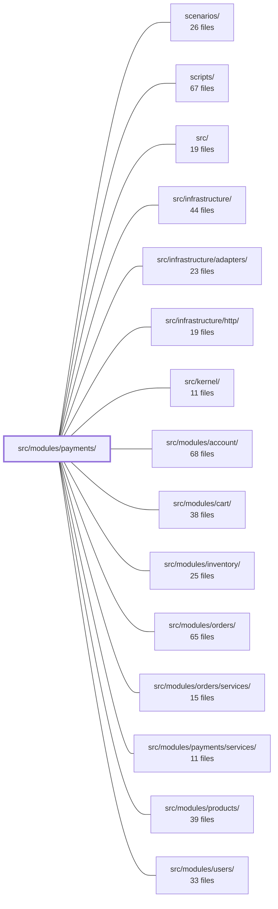

---
tags:
  - 2brain
  - 2brain/module
  - project/boilerplate-node-backend
type: module
module: src/modules/payments/
files: 39
updated: 2026-09-27T16:21:54.240100+00:00
---

# src/modules/payments/

## Purpose

The payments module owns the full monetary lifecycle of a shop order: discovering available payment methods, creating and confirming payment intents with an external provider, settling or declining them via webhooks or explicit sync, recording offline/bank-transfer payments, issuing refunds, and emitting the corresponding audit, analytics, metrics, and domain events. It is a bounded context in the project's strategic-DDD layout, exposed to the rest of the codebase solely through its barrel (`index.ts`).

## Key parts

- **HTTP surface** — `routes.ts` wires every endpoint to its controller and applies auth, rate-limit, and idempotency middleware. The `controllers/` directory holds one file per route (intent, confirm, sync, webhook, refund, offline, lookup, methods, get-payment). `openapi.yaml` is the public contract those routes must satisfy.
- **Provider seam** — `providers/index.ts` defines the `PaymentProvider` port and registry; `providers/fake.ts` is a no-network stub for tests and demos; `providers/webhook-signature.ts` is the shared HMAC verification scheme; `providers/errors.ts` isolates provider-thrown error types to avoid a circular import.
- **Data layer** — `model.ts` declares the Mongoose `Payment` schema, status vocabulary, and `PaymentWebhookEvent` idempotency ledger. `repository.ts` wraps the shared `createRepository` factory with domain-specific lookups and guarded writes (intent upsert, status transitions, retention sweeps).
- **Service & module wiring** — `services/` (sibling directory) holds the business-logic layer. `module.ts` is the boot-time manifest that assembles routes, event subscriptions, permission keys, config validation, and webhook mappings into a single `AppModule` for the kernel registry. `config.ts` centralises payment-specific configuration read per-call.
- **Cross-cutting contracts** — `events.ts`, `analytics.ts`, `audit.ts`, and `metrics.ts` each register this module's names into the kernel's shared TypeScript maps via module augmentation, keeping a single source of truth without a central list.
- **Security & resilience** — `rate-limits.ts` defines the webhook, confirm-attempt, and confirm-decline budgets plus a human-challenge gate. `globals.d.ts` augments Express's `Request` with a payments-local flag (kept separate per the project's layering rules).
- **Tests** — `tests/unit/` covers schema shape, config logic, provider port, route structure, and rate-limit invariants. `tests/integration/` runs against real Mongo + the fake provider to pin service invariants, settlement email, retention/erasure, velocity limits, and bank-transfer lookup. `tests/contract/` asserts every documented HTTP branch against the OpenAPI spec.

## How it connects

- **Orders** (`src/modules/orders/`, `src/modules/orders/services/`) — A payment intent freezes the order's published total; a successful confirm transitions the order `pending → paid`. The offline-payment and refund controllers resolve and mutate order state through the orders service.
- **Inventory** (`src/modules/inventory/`) — Settlement (confirm → succeeded) triggers a stock commit; the `settlement-email` integration test asserts this ordering.
- **Users / Account** (`src/modules/users/`, `src/modules/account/`) — Payment documents carry `userId` for ownership scoping; the account-erasure hook detaches the user reference without deleting the payment record.
- **Kernel** (`src/kernel/`) — The module manifest is discovered and wired at boot; domain events, analytics, and audit names are registered into kernel-level shared maps.
- **Infrastructure** (`src/infrastructure/`, `src/infrastructure/http/`, `src/infrastructure/adapters/`) — Shared HTTP utilities, the Mongoose connection, observability registry, and the `createRepository` factory are consumed by this module.
- **Webhooks** (`src/modules/webhooks/`) — The public webhook event mapping declared in `module.ts` lets the webhooks module route incoming provider notifications to the payments handler.
- **Cart / Products** (`src/modules/cart/`, `src/modules/products/`) — Price resolution at intent-creation time draws on cart totals and product prices.

## Where to start

1. **`module.ts`** — the registration manifest. Reading it gives an at-a-glance map of routes, events, permissions, config checks, and webhook mappings, so you can see how the module plugs into the kernel without having to trace imports.
2. **`model.ts`** — the `Payment` schema and status vocabulary. Every controller, service method, and test ultimately reasons about the document shape defined here, so understanding its fields, the one-payment-per-order unique index, and the status enum (with safe default) is the fastest path to reading the rest of the module with confidence.

## Connected modules

```mermaid
flowchart LR
    m_src_modules_payments["src/modules/payments/"]
    m_scenarios["scenarios/<br/>26 files"]
    m_scripts["scripts/<br/>67 files"]
    m_src["src/<br/>19 files"]
    m_src_infrastructure["src/infrastructure/<br/>44 files"]
    m_src_infrastructure_adapters["src/infrastructure/adapters/<br/>23 files"]
    m_src_infrastructure_http["src/infrastructure/http/<br/>19 files"]
    m_src_kernel["src/kernel/<br/>11 files"]
    m_src_modules_account["src/modules/account/<br/>68 files"]
    m_src_modules_cart["src/modules/cart/<br/>38 files"]
    m_src_modules_inventory["src/modules/inventory/<br/>25 files"]
    m_src_modules_orders["src/modules/orders/<br/>65 files"]
    m_src_modules_orders_services["src/modules/orders/services/<br/>15 files"]
    m_src_modules_payments_services["src/modules/payments/services/<br/>11 files"]
    m_src_modules_products["src/modules/products/<br/>39 files"]
    m_src_modules_users["src/modules/users/<br/>33 files"]
    m_src_modules_payments --- m_scenarios
    m_src_modules_payments --- m_scripts
    m_src_modules_payments --- m_src
    m_src_modules_payments --- m_src_infrastructure
    m_src_modules_payments --- m_src_infrastructure_adapters
    m_src_modules_payments --- m_src_infrastructure_http
    m_src_modules_payments --- m_src_kernel
    m_src_modules_payments --- m_src_modules_account
    m_src_modules_payments --- m_src_modules_cart
    m_src_modules_payments --- m_src_modules_inventory
    m_src_modules_payments --- m_src_modules_orders
    m_src_modules_payments --- m_src_modules_orders_services
    m_src_modules_payments --- m_src_modules_payments_services
    m_src_modules_payments --- m_src_modules_products
    m_src_modules_payments --- m_src_modules_users
    style m_src_modules_payments stroke-width:3px
```

[[boilerplate-node-backend_ROOT|/ (repository root)]] · [[boilerplate-node-backend_scenarios|scenarios/]] · [[boilerplate-node-backend_scripts|scripts/]] · [[boilerplate-node-backend_src|src/]] · [[boilerplate-node-backend_src_infrastructure|src/infrastructure/]] · [[boilerplate-node-backend_src_infrastructure_adapters|src/infrastructure/adapters/]] · [[boilerplate-node-backend_src_infrastructure_http|src/infrastructure/http/]] · [[boilerplate-node-backend_src_kernel|src/kernel/]] · [[boilerplate-node-backend_src_modules_account|src/modules/account/]] · [[boilerplate-node-backend_src_modules_cart|src/modules/cart/]] · [[boilerplate-node-backend_src_modules_inventory|src/modules/inventory/]] · [[boilerplate-node-backend_src_modules_orders|src/modules/orders/]] · [[boilerplate-node-backend_src_modules_orders_services|src/modules/orders/services/]] · [[boilerplate-node-backend_src_modules_payments_services|src/modules/payments/services/]] · [[boilerplate-node-backend_src_modules_products|src/modules/products/]] · … and 2 more

## Files
- `src/modules/payments/analytics.ts` — Defines the canonical analytics event names for the payments module and registers them into the shared `AnalyticsEventMap` via TypeScript module augmentation, so that any consumer typing an event name against the `payments` channel gets autocomplete and compile-time safety without importing a duplicated list.
- `src/modules/payments/audit.ts` — Declares the set of audit action strings the payments module emits and registers them in the global `AuditActionMap` via a module augmentation, so that any audit-log consumer can type-check payments-specific action names against a single source of truth.
- `src/modules/payments/config.ts` — Centralizes the payment-specific configuration values that this module exclusively owns (method listing, effect-sweep grace window, Stripe key gate, bank-transfer validation). Values are read per call rather than captured at import time so that a config change takes effect on the next invocation without a restart, and so no consumer transcribes its own copy of a fallback.
- `src/modules/payments/controllers/get-order-by-reference.ts` — Handler for `GET /payments/order-by-reference`. Given an RF reference code (read from a bank's website), it resolves the corresponding order and returns it with the caller's available next actions. It exists as the read step an admin performs before recording an offline payment via `POST /payments/order/:orderId/offline`.
- `src/modules/payments/controllers/get-payment-by-order.ts` — Single controller for `GET /payments/order/:orderId`. The order page's payment panel calls this on load so that a mid-flow reload can recover the existing payment intent (and its status) rather than starting the payment flow over from scratch.
- `src/modules/payments/controllers/get-payment-methods.ts` — Express controller that answers `GET /payments/methods` with the list of payment methods configured for the shop. It exists so the frontend can discover available checkout options dynamically instead of hard-coding them. The endpoint is intentionally public—guests should be able to see what payment options exist before signing up.
- `src/modules/payments/controllers/post-payment-confirm.ts` — Handler for `POST /payments/:id/confirm` — the final step where the browser submits its tokenised payment-method reference. This is where the payment outcome is resolved (succeeded, declined, or in-flight) and the corresponding events, metrics, and audit trail are produced.
- `src/modules/payments/controllers/post-payment-intent.ts` — Thin Express controller for `POST /payments/intent`. It validates the request body, delegates to the payment service to freeze an order's price and open a payment intent at the provider, and returns the resulting `Payment` object (including a transient `clientSecret`) with a `201`. All business rules—ownership, the `pending` gate, amount resolution—live in the service; this file performs no audit, analytics, or domain logic.
- `src/modules/payments/controllers/post-payment-offline.ts` — Thin Express controller for `POST /payments/order/:orderId/offline`. It validates the request body against a Zod schema, delegates to the payment service to record a payment the card provider never saw (admin-only, enforced at the route), and replies **201** with the persisted `Payment` object.
- `src/modules/payments/controllers/post-payment-refund.ts` — Thin Express controller for `POST /payments/order/:orderId/refund`. It performs a standalone monetary refund on an order without altering the order's status, giving an operator the ability to refund alone (as opposed to the "cancel + refund" flow where the client issues both calls). All business logic is delegated to `paymentService.refundByOrder`; this file only wires the HTTP layer to the service result.
- `src/modules/payments/controllers/post-payment-sync.ts` — HTTP handler for `POST /payments/:id/sync`. When the browser signals that a 3-D Secure challenge or wallet sheet has finished, this endpoint re-reads the provider's record and applies it, making the happy path _feel_ synchronous while the webhook remains the authority. It is idempotent: a payment already settled is answered locally without a provider call.
- `src/modules/payments/controllers/post-payment-webhook.ts` — Express controller for `POST /payments/webhook`. Receives payment-event notifications from an external provider, verifies the raw-body signature (no session auth), delegates the validated event to the payment service, and responds with 200 or 400. It exists to be the single, deliberately minimal entry point through which a payment provider's word becomes actionable in this system.
- `src/modules/payments/events.ts` — Declares the two domain events the payments module emits and registers them into the kernel's app-wide `DomainEventMap` via TypeScript module augmentation. This follows the same pattern as `modules/orders/events.ts` — each module augments the shared interface rather than contributing to a central list, keeping the event namespace distributed alongside the code that owns it.
- `src/modules/payments/globals.d.ts` — Augments Express's `Request` interface with a payments-specific boolean flag via declaration merging. It exists as a separate file (rather than living in infrastructure's `src/globals.d.ts`) because the project's layering rules (`docs/theory/layers.md`) forbid infrastructure's global types file from naming a module, so payments-local fields live here.
- `src/modules/payments/index.ts` — Barrel (public entry point) for the payments module. It is the **only** surface a sibling module is allowed to import from, enforcing the strategic-DDD boundary rule (`docs/theory/strategic-ddd.md` §5). It re-exports the services, events, and model types while keeping the runtime model and `paymentRepository` internal.
- `src/modules/payments/metrics.ts` — Defines the Prometheus counters owned by the payments module. The counters live here (in the domain module) rather than in `infrastructure/observability` so that metric ownership follows the business capability. The overview endpoint reads them via the shared registry without needing to import this file directly.
- `src/modules/payments/model.ts` — Defines the Mongoose schema, model, and serialization contract for the `Payment` collection (one document per order) and the `PaymentWebhookEvent` idempotency ledger. It is the single source of truth for the payment document's shape, status vocabulary, and wire-level visibility rules, sitting below all services and the repository so neither layer can import the other in a cycle.
- `src/modules/payments/module.ts` — The Payments module's registration manifest. It assembles routes, event subscriptions, permission keys, config validation, personal-data hooks, and public-webhook event mappings into a single `AppModule` object consumed by the kernel registry at boot. It exists so the rest of the codebase can discover and wire the module without importing its internals.
- `src/modules/payments/openapi.yaml` — OpenAPI 3.0.3 contract for the payments module. It defines the full API surface a client needs to discover payment methods, create and confirm a payment intent tied to a pending order, look up payment state by order, and (admin-only) refund, record offline payment, or resolve an RF creditor reference back to an order.
- `src/modules/payments/providers/errors.ts` — Houses the error type(s) thrown by the payment provider port, isolated into their own module so implementations can import and throw them without pulling in `index.ts` (the port interface), which itself imports every implementation. This split exists specifically to break a circular-dependency cycle that previously arose when the error lived inside `index.ts`.
- `src/modules/payments/providers/fake.ts` — A stub payment-service-provider (PSP) that implements the full `PaymentProvider` interface without any external network calls. It exists so demos, e2e suites, and integration tests can exercise the 3-D Secure flow, asynchronous settlement states, refund/cancel paths, and webhook signature verification without a real provider account or sandbox.
- `src/modules/payments/providers/index.ts` — Defines the **payment provider port** — the interface every PSP implementation must satisfy — along with the provider registry and two resolution functions. It is the single seam where a real payment service plugs in: a live project adds one implementation file and one line to the `PROVIDERS` record, and no other call-site changes.
- `src/modules/payments/providers/webhook-signature.ts` — Defines the shared HMAC-SHA256 signature scheme for PSP webhook deliveries: sign as `<timestamp>.<raw body>`, transmit in a single header, verify in constant time, and reject stale timestamps. It lives in its own file because the signing half is needed by the demo and test suites while the verifying half is needed by the controller, and because a real provider's own verifier (e.g. `stripe.webhooks.constructEvent`) replaces only the verify side.
- `src/modules/payments/rate-limits.ts` — Defines the three rate-limit budgets for the payments module (webhook deliveries, confirm attempts, confirm declines) and turns each into an Express middleware via the shared `buildRateLimiter` factory. It also exports a small gate that escalates to a human challenge once an account has a prior decline on record.
- `src/modules/payments/repository.ts` — Data-access layer for the payments aggregate. Wraps the shared `createRepository` factory with domain-specific lookups and guarded writes (intent upsert, offline upsert, status transitions, retention sweeps). Exists so service-layer code never touches Mongoose directly and all ownership scoping, idempotency, and duplicate-key semantics live in one place.
- `src/modules/payments/routes.ts` — Express router that wires every payment endpoint to its controller, applying the correct authentication, authorization, idempotency, and rate-limit middleware per route. It enforces the module's security layering: two public routes above the auth wall, step-up-protected money-moving routes below it, and velocity limits on card validation.
- `src/modules/payments/tests/contract/api.contract.test.ts` — HTTP-level contract tests for the `/payments` API. Each test fires a real request through the running server and asserts both the semantic shape of the response and conformance to the OpenAPI spec (`toSatisfyApiSpec()`). The goal is to prove that every documented branch — 201 intent, 200 confirm, the three distinct 409s, 404s, 422s — is actually reachable over the wire, without re-testing the business rules (those live in the unit suite).
- `src/modules/payments/tests/integration/lookup.test.ts` — Integration test for the admin's bank-transfer reference lookup (`getOrderByReference`) and its immediate downstream settle step (`recordOfflinePayment`). It pins the contract that a reference minted at checkout resolves to its own order, that any miss (typo, unmatched, malformed) yields a uniform 404 with no oracle, and that the order the lookup returns is the one the existing offline endpoint settles — with no new settlement logic in between.
- `src/modules/payments/tests/integration/payment-velocity.test.ts` — Integration tests for the three payment-confirm rate limiters (`attempt`, `decline`, `challenge gate`) mounted on `POST /payments/:id/confirm`. The tests exercise the limiters directly against trivial Express handlers rather than the real payment route, because the property under test belongs to the limiters themselves and a real route would add a database round-trip to every attempt. Route-mounting correctness is covered separately in `payments/tests/unit/routes.test.ts`.
- `src/modules/payments/tests/integration/retention.test.ts` — Integration tests for two payment-retention behaviors: (1) **account erasure** — hard-deleting a user detaches `userId` from the associated payment (and order) without deleting the payment record itself, and (2) **abandoned-payment reaping** — the `reapAbandonedPayments` sweep deletes unsettled attempts past a configurable retention window while never touching settled payments. Both suites exercise real module wiring via `registerCheckoutModules([paymentsModule])`.
- `src/modules/payments/tests/integration/service.test.ts` — Integration tests that pin the core invariants of the payments service: an intent freezes the order's published total (shipping included), a confirm transitions the order `pending → paid` before the payment row is marked `succeeded`, a decline leaves the payment retryable, and a refund is at-most-once. The tests run against a real MongoDB instance and the project's `fake` payment provider (not a mock), because the guarantees under test are the conditional database writes themselves.
- `src/modules/payments/tests/integration/settlement-email.test.ts` — Integration test that pins the post-settlement email contract: when `confirmPayment` settles a payment to `succeeded` and stock commits, the buyer receives exactly one `orders.order-paid` email. It also asserts the email is **not** sent on a declined attempt and **not** re-sent when `confirmPayment` is called again for an already-settled payment.
- `src/modules/payments/tests/unit/config.test.ts` — Unit tests for the three pure, environment-driven exports in `src/modules/payments/config.ts` (`listPaymentMethods`, `validateBankTransferConfig`, `validateStripeSecretKey`). These cover the logic behind `GET /payments/methods` and the boot-time `customCheck` validation, requiring no database.
- `src/modules/payments/tests/unit/module.test.ts` — Boot-time validation tests for the payments module's manifest `customCheck`, specifically the provider-selector half (which provider name is accepted) and the single wiring-proof case for the Stripe secret key gate. It verifies that `assertRequiredConfig` throws at boot for misconfigured providers/keys rather than deferring failure to the first payment.
- `src/modules/payments/tests/unit/providers.test.ts` — Unit tests for the payment provider port's **fake** implementation, the shared webhook-signature utilities, and the provider resolver. Deliberately kept out of `tests/integration/` because none of these code paths touch Mongo; `service.test.ts` (which persists a payment document) lives there instead.
- `src/modules/payments/tests/unit/rate-limits.test.ts` — Unit test that pins the _structural invariants_ of the confirm-attempt and confirm-decline rate-limit budgets: their relative strictness, shared window, and skip-successful semantics. It validates configuration shape only—no HTTP requests are made—leaving behavioural verification to the integration suite.
- `src/modules/payments/tests/unit/refunds.test.ts` — Unit test for the corrupted-row guard in `performRefund`: verifies that a `succeeded` payment missing `providerRef` (an impossible state, since nothing succeeds before the provider is called) still transitions to `refunded` but is audited as a **failure**, not a success.
- `src/modules/payments/tests/unit/routes.test.ts` — Unit test for the payments router (`@modules/payments/routes`). Verifies the security-critical structure of the route table: which routes sit above vs. below the auth wall, which are admin-gated, guard composition on money-moving endpoints, and declaration order that prevents silent route shadowing.
- `src/modules/payments/tests/unit/schema-contract.test.ts` — Unit test that pins down the payment schema's contract: required fields, the unique index that guarantees at-most-one-payment-per-order, field types and references, numeric bounds, the status enum with its safe default, and timestamp options. It serves as both a regression test and the canonical record of the module's idempotence guarantee.

---
[[boilerplate-node-backend_INDEX|← boilerplate-node-backend index]]
