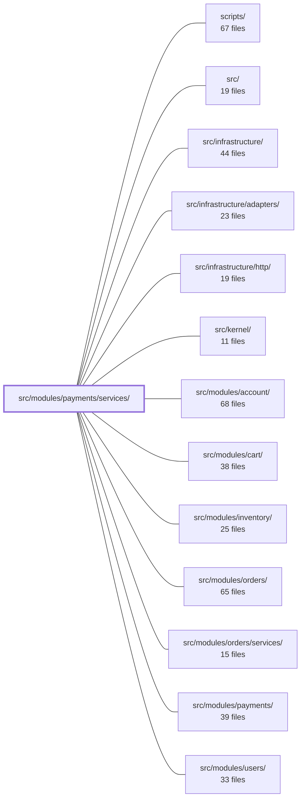

---
tags:
  - 2brain
  - 2brain/module
  - project/boilerplate-node-backend
type: module
module: src/modules/payments/services/
files: 11
updated: 2026-09-27T16:22:11.967520+00:00
---

# src/modules/payments/services/

## Purpose

The services layer of the payments module. It contains every business-logic operation that moves or inspects money: creating and cancelling payment intents, reconciling settlement (card webhook, browser confirm, sync poll, or offline), processing refunds, and managing the post-settlement lifecycle (retention, identity detachment, data export). Controllers, event wiring, and ops scripts all call into this directory rather than implementing payment logic themselves.

## Key parts

- **Money-in & entry points**
  - `intent.ts` — Creates or refreshes a payment intent, resolves payer identity, and cancels open intents at the provider. The primary entry for the card-payment flow.
  - `offline.ts` — Records non-card payments (cash, bank transfer, phone) and routes them through the same `settlePayment` pipeline so stock commits and domain events fire identically.
  - `lookup.ts` — Thin resolver that maps an RF bank-transfer reference to an order before an admin settles it offline.

- **Settlement & reconciliation**
  - `settlement.ts` — The single funnel (`settlePayment`) every settlement trigger passes through, guaranteeing stock is committed or refunded at most once.
  - `effects.ts` — Crash-recovery sweep that discharges the one side-effect (stock commit or refund-owed mark) a `succeeded` write may have left incomplete.

- **Money-out**
  - `refunds.ts` — The only place in the module that moves money out; funnels both the operator endpoint and the `ORDER_REFUND_OWED` event through one conditional write so a refund applies at most once.

- **Read & access control**
  - `view.ts` — Read-side retrieval of the payment linked to an order, enriched with the caller's permitted actions (`pay`, `refund`).
  - `scope.ts` — Single centralised row-level access rule; every other service delegates to it for "which payments can this caller see?"

- **Lifecycle & housekeeping**
  - `retention.ts` — Post-settlement duties: identity detachment on account erasure, data-export retrieval, and deletion of abandoned payment attempts past a retention window.

- **Cross-cutting**
  - `errors.ts` — Leaf module producing the canonical 409 "order no longer payable" rejection, importable by every sibling without extra dependency edges.
  - `index.ts` — Barrel re-exporting all service operations so consumers import from one stable path.

## How it connects

- **`src/modules/payments/`** (parent) — Owns the HTTP controllers and event-wiring that delegate to these services; `index.ts` is the public seam they import from.
- **`src/modules/orders/services/`** — Settlement and refund operations trigger order status transitions (`pending → paid`, refund-owed); the `ORDER_REFUND_OWED` event originates from the orders side and is consumed here.
- **`src/modules/inventory/`** — `settlement.ts` and `effects.ts` commit or reverse stock as the primary side-effect of a successful payment.
- **`src/modules/account/`** — `retention.ts` detaches payer identity on account erasure and supplies payment data for the account's own export.
- **`src/modules/users/`** — `intent.ts` resolves payer identity from the user record before creating an intent.
- **`src/infrastructure/adapters/`** — Provider adapters (card gateway, bank-transfer reference service) that `intent.ts`, `settlement.ts`, and `lookup.ts` call through.
- **`src/infrastructure/http/`** — Webhook and endpoint plumbing that invokes `settlement.ts` and the refund operator endpoint.
- **`scripts/`** — Ops and maintenance scripts import service operations via `index.ts` (e.g., retention sweeps, intent cleanup).
- **`src/kernel/`** — Shared framework utilities (event bus, persistence helpers) used across the service files.

## Where to start

Read **`settlement.ts`** first: it is the single reconciliation point every payment path funnels through, and understanding `settlePayment` makes the surrounding files (effects, offline, refunds) read as variations on a theme. Then skim **`index.ts`** to see the full public surface and confirm which file owns which responsibility before diving into any individual service.

## Connected modules

[[boilerplate-node-backend_ROOT|/ (repository root)]] · [[boilerplate-node-backend_scripts|scripts/]] · [[boilerplate-node-backend_src|src/]] · [[boilerplate-node-backend_src_infrastructure|src/infrastructure/]] · [[boilerplate-node-backend_src_infrastructure_adapters|src/infrastructure/adapters/]] · [[boilerplate-node-backend_src_infrastructure_http|src/infrastructure/http/]] · [[boilerplate-node-backend_src_kernel|src/kernel/]] · [[boilerplate-node-backend_src_modules_account|src/modules/account/]] · [[boilerplate-node-backend_src_modules_cart|src/modules/cart/]] · [[boilerplate-node-backend_src_modules_inventory|src/modules/inventory/]] · [[boilerplate-node-backend_src_modules_orders|src/modules/orders/]] · [[boilerplate-node-backend_src_modules_orders_services|src/modules/orders/services/]] · [[boilerplate-node-backend_src_modules_payments|src/modules/payments/]] · [[boilerplate-node-backend_src_modules_users|src/modules/users/]]

## Files
- `src/modules/payments/services/effects.ts` — Crash-recovery sweep that discharges the one effect a `succeeded` payment write may have left owing: either committing stock for the order, or marking a refund owed if the order moved away before settlement's own `orderLost` branch could react. It exists solely to catch the window between writing `succeeded` and completing the side-effect; `settlement.ts` handles the normal path itself.
- `src/modules/payments/services/errors.ts` — Single-leaf module that produces the canonical 409 "order is no longer payable" rejection. It exists as a leaf (no persistence or service imports) so that every file under `services/` can import it without pulling in additional dependency edges.
- `src/modules/payments/services/index.ts` — Barrel file that re-exports every payment-service operation (intent, settlement, refunds, effects, offline, view, retention, scope, lookup) and the `listPaymentMethods` helper from config. It exists so that consumers—controllers, the module's event wiring, and ops scripts—can import from one stable path rather than reaching into individual sibling files. The file was split out of a single 700+-line module (see `docs/theory/layers.md`) and this index is the public seam of the services folder.
- `src/modules/payments/services/intent.ts` — Entry point for the money-moving flow in the payments module. Creates (or refreshes) a payment intent for an order, resolves the payer identity, and handles cancellation of open intents at the provider. All four rules documented in `../index`'s module docblock apply here.
- `src/modules/payments/services/lookup.ts` — Thin lookup layer that resolves an RF bank-transfer reference to the order it pays. It sits one step in front of the existing `POST /payments/order/{orderId}/offline` settlement endpoint, letting an admin confirm _which_ order a pasted reference maps to before settling it. No settlement logic lives here.
- `src/modules/payments/services/offline.ts` — Records a payment that arrived outside the card provider (cash, bank transfer, phone-order payment) and routes it through the same `settlePayment` pipeline as a card payment, so the order transitions `pending → paid`, stock commits, and the usual domain events fire. It exists so that non-card money follows the identical settlement and side-effect path rather than a bespoke one.
- `src/modules/payments/services/refunds.ts` — The single module responsible for moving money out. It exposes two entry points — the operator's `POST /payments/order/:orderId/refund` and the `ORDER_REFUND_OWED` event listener — both of which funnel through one conditional write (`performRefund`) so that a refund is applied at most once. Nothing else in the payments module may move money out.
- `src/modules/payments/services/retention.ts` — Handles the payment lifecycle after money has moved: identity detachment on account erasure, full-payment retrieval for the account's own data export, and a sweep that deletes abandoned (never-settled) payment attempts past a retention window.
- `src/modules/payments/services/scope.ts` — Single export that centralises the row-level access rule for the payments collection. Every other service in this directory resolves _which_ payments a caller may see by delegating to this one function, so the scoping logic lives in exactly one place.
- `src/modules/payments/services/settlement.ts` — The single reconciliation point for payment state. Whether the trigger is a provider webhook, a browser-driven confirm, or a sync poll, every path funnels into `settlePayment` so that inventory is committed (or refunded) at most once. The file exists to prevent two parallel settlement paths from double-committing stock or double-refunding.
- `src/modules/payments/services/view.ts` — Read-side service for payments: retrieves the payment linked to an order and enriches it with the set of actions (`pay`, `refund`) the caller is permitted to take. This is the data contract behind the order page's payment panel, mirroring the `OrderActions` shape the orders module publishes.

---
[[boilerplate-node-backend_INDEX|← boilerplate-node-backend index]]
