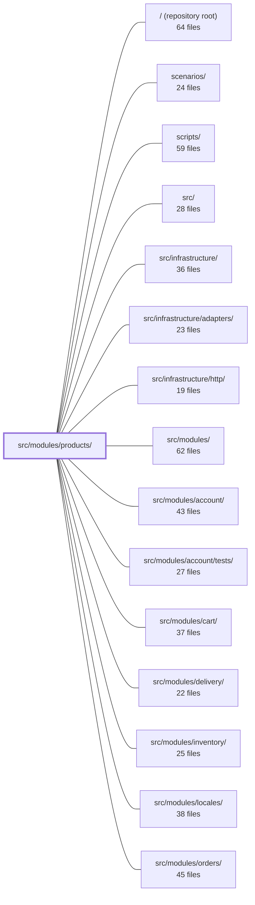

---
tags:
    - 2brain
    - 2brain/module
    - project/boilerplate-node-backend
type: module
module: src/modules/products/
files: 35
updated: 2026-09-23T20:38:59.059857+00:00
---

# src/modules/products/

## Purpose

The products module owns the catalogue entity end-to-end: defining the Product schema and its i18n translation rows, enforcing access-scoped visibility, resolving tax-class to VAT rate, and exposing both the public storefront read API (listing, search, facets) and the admin write API (create, update, delete). It is the single authority for "what a product is" and "who can see or change it."

## Key parts

- **Domain & data** — `model.ts` (Mongoose schema, Zod validation, serialization transform that derives `available` from stock counters); `repository.ts` (CRUD surface plus facet aggregation and two write-through mirrors consumed by inventory and the image-digest pipeline); `tax.ts` (resolves a product's `taxClass` to a concrete decimal VAT rate).
- **Business logic** — `service.ts` — the sole entry point controllers use; owns validation, caller-scoped visibility, i18n-aware search, domain-event emission, and analytics/audit side-effects for every catalogue mutation.
- **HTTP layer** — `routes.ts` (Express router wiring auth, permissions, caching, rate-limiting, and upload middleware per route); `controllers/` (thin decode-and-delegate handlers for create, update, delete, item read, admin read, search, and facet listing).
- **Module plumbing** — `module.ts` (the `AppModule` manifest: identity, permissions, routes, config gates, translatable fields, image pipeline, test subjects); `index.ts` (public barrel enforcing the strategic-DDD import boundary); `events.ts`, `analytics.ts`, `audit.ts` (type-level registrations of domain events, analytics event names, and audit-action identifiers via TypeScript module augmentation); `config.ts` (VAT rate boot gate read from env vars per call).
- **Contract & documentation** — `openapi.yaml` (OpenAPI 3.0.3 spec for the full REST surface); `probes.ts` (hand-written API requests for cases the generated contract cannot express).
- **Fixtures** — `factories.ts` (the `makeProduct` builder used by the `shop` scenario catalogue and by cross-module tests).
- **Tests** — `tests/unit/` (schema contract, validation messages, tax resolution, config gate, route-table integrity, audit-string stability, factory contract); `tests/integration/` (repository CRUD + facets, service flows with real DB, model serialization, schema contract); `tests/contract/` (wire-shape validation against `openapi.yaml` for every auth/branch/filter variant).

## How it connects

- **`src/infrastructure/`** — The module builds on shared factories (`createRepository`, `createItemController`, `createSearchController`, `createDeleteController`), registers into the shared analytics port's type map, and augments the app-wide `AuditActionMap`. The `AppModule` contract in `module.ts` is defined by the kernel in `src/`.
- **`src/modules/inventory/`** — `productRepository` exposes two write-through mirrors that the inventory module calls into to keep stock counters in sync; `tax.ts` is consumed downstream when orders are priced.
- **`src/modules/cart/`** — The service's create/update/remove flows emit side-effects that affect carts (e.g., removing a product invalidates cart lines).
- **`src/modules/orders/`** — Orders freeze the VAT rate returned by `resolveTaxRate` at purchase time; the products module is the sole owner of that resolution.
- **`src/modules/locales/`** — Product translations are stored as language rows on the same document; validation messages, search, and serialization all consult the locale context provided by the locales module.
- **`scenarios/`** — `factories.ts` is imported by `scenarios/products.ts` to seed the shipped demo catalogue, so a regression in the fixture propagates into the production fixture set.
- **`scripts/`** — `probes.ts` complements the generated client-collection bundle owned by `scripts/contracts/client-collections-bundle.ts`.

## Where to start

1. **`module.ts`** — One object that tells you the module's name, base path, permission keys, routes, config gates, and translatable fields. Reading it first gives you the full registration surface before diving into any implementation.
2. **`service.ts`** — The single business-logic entry point. It shows how validation, access scoping, i18n search, event emission, and side-effects compose, and it is the file every controller funnels through. Pairing it with `model.ts` (for the schema and serialization rules) gives a newcomer a complete picture of "what a product is and what happens when someone reads or writes one."

## Connected modules

[[boilerplate-node-backend_ROOT|/ (repository root)]] · [[boilerplate-node-backend_scenarios|scenarios/]] · [[boilerplate-node-backend_scripts|scripts/]] · [[boilerplate-node-backend_src|src/]] · [[boilerplate-node-backend_src_infrastructure|src/infrastructure/]] · [[boilerplate-node-backend_src_infrastructure_adapters|src/infrastructure/adapters/]] · [[boilerplate-node-backend_src_infrastructure_http|src/infrastructure/http/]] · [[boilerplate-node-backend_src_modules|src/modules/]] · [[boilerplate-node-backend_src_modules_account|src/modules/account/]] · [[boilerplate-node-backend_src_modules_account_tests|src/modules/account/tests/]] · [[boilerplate-node-backend_src_modules_cart|src/modules/cart/]] · [[boilerplate-node-backend_src_modules_delivery|src/modules/delivery/]] · [[boilerplate-node-backend_src_modules_inventory|src/modules/inventory/]] · [[boilerplate-node-backend_src_modules_locales|src/modules/locales/]] · [[boilerplate-node-backend_src_modules_orders|src/modules/orders/]] · … and 8 more

## Files

- `src/modules/products/analytics.ts` — Declares the analytics event names emitted by the products module and registers them into the shared analytics port's type map. It is a type-level extension (plus a small const object) that lets the products module fire typed discovery events—product search and product view—without modifying the observability layer directly.
- `src/modules/products/audit.ts` — Defines the audit-action vocabulary owned by the products module (three admin write events) and registers those actions into the app-wide `AuditActionMap` via TypeScript module augmentation. It exists so that compliance/audit consumers can query product-mutation events by a stable, typed identifier without importing a shared enum.
- `src/modules/products/config.ts` — Defines the two VAT rates a deployment charges (default and reduced) and validates their configuration at boot. Rates are read from environment variables on every call rather than captured at import, so a rate change takes effect on the next resolve instead of requiring a restart. This mirrors the pattern set by `inventory/config.ts`.
- `src/modules/products/controllers/create-product.ts` — Admin-facing HTTP handler for `POST /products`. It decodes the request body (JSON or multipart) and the image upload into a flat, typed payload, then delegates validation and persistence to `productService.writeCreate`, which writes the product and all its language translations in a single operation.
- `src/modules/products/controllers/delete-products.ts` — Admin-facing delete endpoint for the product catalogue. It is a thin, one-line wiring of the shared `createDeleteController` factory to the product domain, delegating all delete logic to the service layer so the controller itself contains no business logic.
- `src/modules/products/controllers/get-catalogue-facets.ts` — Thin Express controller that exposes the catalogue's category and tag facet counts (storefront filter chips) as a public `GET /products/categories` endpoint. It adds no business logic — it simply calls the service and maps the result into the project's standard response shapes.
- `src/modules/products/controllers/get-product-admin.ts` — Handler for `GET /products/:id/admin`. Returns a product with **every language row it has**, shaped for the admin editor's multi-language form. It exists as a standalone controller (rather than a product of the shared `createItemController` factory) because the factory's fixed `get<Entity>Item` naming does not fit this operation's route, even though the error-handling logic is identical to `get-product-item.ts`.
- `src/modules/products/controllers/get-product-item.ts` — Thin controller for `GET /products/:id`. It delegates all real work to the shared `createItemController` factory and the product service, wiring together the caller's auth scope so that row visibility (active vs. inactive/deleted) is enforced per role.
- `src/modules/products/controllers/get-products.ts` — Builds the shared query schema and cache-key parameters for the product catalogue, then hands both to the `createSearchController` factory so that `GET /products` and `POST /products/search` validate against identical rules and share one cached response.
- `src/modules/products/controllers/update-product.ts` — Admin handler for `PATCH /products/:id`. It decodes a multipart or JSON request body (including a JSON-encoded `translations` string) and an uploaded image, then delegates to `productService.writeUpdate` for validation and merge. The controller is purely a transport/decoding layer; all business logic lives in the service.
- `src/modules/products/events.ts` — Declares the domain events the products module emits and exports their name constants. It augments the kernel's `DomainEventMap` via TypeScript module declaration so the event catalogue grows with each owning module rather than living in a shared enumeration file.
- `src/modules/products/factories.ts` — Provides a single-purpose fixture builder (`makeProduct`) that produces a minimal product row for the `shop` scenario catalogue and for any test that needs a catalogue entry. It intentionally sets only the schema-required `title` and `price` fields, leaving all other fields to Mongoose defaults so integration tests read real seeded values through the serializer.
- `src/modules/products/index.ts` — Public barrel (the module's single import surface) that enforces the strategic-DDD rule: sibling modules may only import what this file re-exports, never internal files. It curates which symbols are visible externally while keeping the repository, schema, and model runtime private to the module.
- `src/modules/products/model.ts` — Declares the Mongoose schema, Zod validation schemas, and TypeScript type layer for the Product collection. It is the single source of truth for what fields a product has in the database, how incoming create/update payloads are validated (including i18n-aware error messages and the fallback-locale invariant), and how a stored document is transformed into the public `Product` shape — specifically by deriving `available` from `onHand` and `reserved` at serialization time.
- `src/modules/products/module.ts` — Module manifest for the product catalogue. Declares the module's identity (name, base path), its permission keys, routes, configuration gates, translatable fields, image pipeline, and test-scenario subjects in a single object that satisfies the kernel's `AppModule` contract. It is the static registration surface the kernel and downstream tooling read when wiring up the products context.
- `src/modules/products/openapi.yaml` — OpenAPI 3.0.3 specification for the Products module. It declares the full REST surface (list, create, read, edit, delete, catalogue facets) so that tooling, docs, and the module's runtime contract are generated from a single source of truth rather than hand-maintained.
- `src/modules/products/probes.ts` — Holds hand-written API requests for the products module that a generated contract cannot express — validation-failure payloads, headers the generator omits, optional-parameter combinations, and visibility-rule edge cases. It complements the generated collection owned by `scripts/contracts/client-collections-bundle.ts`.
- `src/modules/products/repository.ts` — Exports the single `productRepository` object for the catalogue: the standard CRUD surface produced by the shared `createRepository` factory, extended with product-specific query rules (public scoping, facet counting) and two write-through mirrors that the inventory module and the image-digest pipeline call into. It is the one place that talks to the `productModel` for reads, scoped reads, and the two side-channel writes.
- `src/modules/products/routes.ts` — Defines the Express `Router` for the product catalogue API. It wires public read endpoints (storefront) and admin write endpoints (create, update, delete) to their respective controllers, attaching authentication, permission, caching, rate-limiting, and file-upload middleware per route.
- `src/modules/products/service.ts` — The business-logic layer for the product (catalogue) entity. It is the single entry point controllers call into; all raw database access is delegated to `productRepository`. The service owns validation, access scoping, i18n-aware search, domain-event emission, and analytics/audit side-effects for every catalogue mutation.
- `src/modules/products/tax.ts` — Resolves a product's `taxClass` into the concrete decimal VAT rate it is charged. It lives in the products module (not orders) because "every product resolves to a rate" is a catalogue invariant; orders merely freeze whatever this function returns.
- `src/modules/products/tests/contract/api.contract.test.ts` — Contract tests for the `/products` endpoints that validate the **shape** of HTTP responses (status code, headers, body schema including `additionalProperties: false`) against `openapi.yaml`. They do not assert _which_ products a role sees (that lives in unit/service suites); their job is to guarantee the wire contract is exercised on every branch—anonymous, admin, empty list, paginated, error, and each filter variant—so a silently added or removed field is caught in CI.
- `src/modules/products/tests/factories.ts` — Test-database persistence helpers for the Products module. The in-memory _builder_ (`makeProduct`) lives one level up in `../factories.ts`; this file wraps that builder with repository calls that actually write to (and read from) the test MongoDB instance, so cross-module tests can fixture, assert against, and tear down products without importing the product service or the inventory module.
- `src/modules/products/tests/integration/facets.test.ts` — Integration tests for `productRepository.facets`, the storefront's filter-chip data. The tests pin the contract that facet counts reflect **only public, active, non-deleted products**, that results are deterministically sorted, and that an empty catalogue yields empty arrays rather than an error. They exist to catch visibility-drift that a passing listing query would not surface (a chip pointing at zero results).
- `src/modules/products/tests/integration/model.test.ts` — Integration test suite that guarantees the Products API never leaks MongoDB internals (`_id`, `__v`) in any response path. It covers the two distinct serialization mechanisms: hydrated Mongoose documents (which rely on the `toJSON` virtual) and `.lean()` query results (which bypass `toJSON` and must be mapped manually).
- `src/modules/products/tests/integration/repository.test.ts` — Integration tests for `productRepository` run against a real MongoDB instance. They pin CRUD behavior (`create`, `findById`, `findOne`, `findAll`, `count`, `save`, `deleteOne`) and the `facets` aggregate read, including the degenerate case where the collection is empty and `$group`/`$facet` pipelines return no row at all rather than a zeroed one.
- `src/modules/products/tests/integration/schema-contract.test.ts` — Verifies Mongoose schema-level contracts on the Product model — `required` semantics, `toJSON` serialization shape — against a **real** Mongo instance. It exists as a separate integration spec so that Mongoose's own behaviour (not application transforms) is tested, which a mocked model could not faithfully represent.
- `src/modules/products/tests/integration/service.test.ts` — Integration tests for the `productService` module, exercising validation (`validateCreateData`, `validateUpdateData`), caller-scoped visibility rules on `search`/`getById`, and the create/update/remove flows including their side effects on the image store and on carts. Runs against a real test database with all domain modules registered, rather than in isolation.
- `src/modules/products/tests/unit/audit.test.ts` — Guarantees that the audit action strings exported by the products module remain byte-for-byte stable. These strings are a wire contract consumed by log queries and alerting rules outside this repository, so a rename or silent add/remove of an action key would break external tooling. The test asserts the entire object to catch both value drift and structural changes.
- `src/modules/products/tests/unit/config.test.ts` — Unit tests for the products module's VAT-rate boot gate. Verifies that `assertRequiredConfig` rejects missing or malformed `NODE_VAT_RATE_DEFAULT` / `NODE_VAT_RATE_REDUCED` values, accepts valid ones, and that the public readers (`vatRateDefault`, `vatRateReduced`) resolve per-call with correct fallbacks.
- `src/modules/products/tests/unit/factories.test.ts` — Unit tests for the `makeProduct` fixture builder. They pin down the factory's contract: which fields are always present, how overrides interact with Mongoose schema defaults, how `undefined` values are stripped, and how falsy-but-meaningful values are preserved. Because the same factory is used by `scenarios/products.ts` to seed the shipped demo catalogue, a regression here propagates beyond the test suite into production fixtures.
- `src/modules/products/tests/unit/routes.test.ts` — Guards the product catalogue's Express route table against regressions that the TypeScript compiler cannot detect: a silently dropped admin guard, a static path shadowed by a later `/:id` param, a cache tag renamed on the writer but not the reader, or an upload field rename that makes multer ignore the file. The assertions are written as whole-table checks rather than per-route spot checks so that an _unexpected extra_ mount or a _reordered_ guard is also caught.
- `src/modules/products/tests/unit/schema-contract.test.ts` — Unit tests that pin down the product schema's field contract (required fields, defaults, min constraints, indexes, timestamps) and the `applyProductTransform` function that derives an `available` count from the `onHand` / `reserved` stock counters. They exist to make the _intent_ behind each default explicit and to prevent regressions that would silently break downstream consumers (cart, facet, storefront).
- `src/modules/products/tests/unit/tax.test.ts` — Unit tests for `resolveTaxRate`, verifying that every product tax class (`undefined`, `"reduced"`, `"zero"`) resolves to a concrete numeric rate and never yields `undefined`. Also guards against env-var state leaking between cases by restoring the two VAT rate variables after every test.
- `src/modules/products/tests/unit/validation-messages.test.ts` — Verifies that the products module's Zod schemas emit locale-specific validation copy (Italian) instead of Zod's built-in default messages. It exists to guard the i18n wiring for the catalogue schema and its thunks, ensuring translation keys are resolved at parse time.

---

[[boilerplate-node-backend_INDEX|← boilerplate-node-backend index]]
