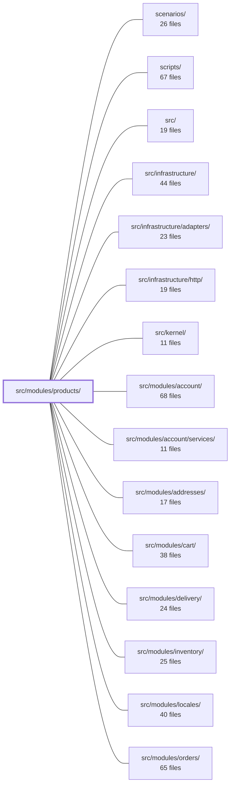

---
tags:
  - 2brain
  - 2brain/module
  - project/boilerplate-node-backend
type: module
module: src/modules/products/
files: 39
updated: 2026-09-27T16:22:31.879307+00:00
---

# src/modules/products/

## Purpose

The products module owns the product catalogue: the entity's shape, its CRUD and search API, tax-rate resolution, stock-availability derivation, and the admin/storefront HTTP surface. It is a leaf domain context — it emits domain events and exposes read/write ports rather than importing sibling business logic, so that other modules (orders, cart, inventory) conform to it rather than the reverse.

## Key parts

- **Domain logic & invariants** — `tax.ts` (tax-class → VAT-rate resolution), `domain/stock.ts` (available-to-buy derivation from inventory counters), `events.ts` (domain-event vocabulary), `audit.ts` (write-action audit vocabulary), `analytics.ts` (typed discovery-event names).
- **Data & persistence** — `model.ts` (Mongoose schema, Zod API schemas, `ProductRecord`/`ProductSnapshot` type split), `repository.ts` (CRUD, caller-scoped reads, facet aggregate, derived-write ports for stock/image/translations).
- **Business logic** — `service.ts` — single entry point for all product operations; adds validation, locale-aware translation resolution, access scoping, and event/audit emission on top of the repository.
- **HTTP layer** — `routes.ts` (router, auth, caching, rate-limiting, uploads), `controllers/` (thin handlers per endpoint, each delegating to shared factories in `src/infrastructure/http`).
- **Module registration & public API** — `module.ts` (kernel manifest: routes, permissions, config gates, translatable fields), `index.ts` (the only import surface for sibling modules), `domain/index.ts` (pure-domain barrel).
- **Configuration** — `config.ts` (VAT rates and currency, read per-call from env vars).
- **API contract & tooling** — `openapi.yaml` (full OpenAPI 3.0 spec), `probes.ts` (hand-written contract probes for edge cases), `factories.ts` (test/demo row fixtures).
- **Tests** — `tests/unit/` (pure functions, schema contracts, route structure, i18n), `tests/integration/` (repository, service, facets, translation fallback, serialization), `tests/contract/` (wire-shape conformance to `openapi.yaml`).

## How it connects

- **`src/kernel/`** — `module.ts` registers the module's identity (routes, permissions, config gates) with the kernel; `events.ts` and `audit.ts` augment the kernel's `DomainEventMap` and `AuditActionMap` via declaration merging; `analytics.ts` registers event names into the shared analytics port's type map.
- **`src/infrastructure/http/`** — controllers delegate to shared factories (`createItemController`, `createSearchController`, `createUpdateController`, `createDeleteController`, `createRestoreController`) and to `createRepository`, keeping per-module files thin.
- **`src/modules/inventory/`** — inventory writes `onHand`/`reserved` counters onto product documents; products derives the customer-facing `available` value from those counters at serialization time.
- **`src/modules/orders/`** — orders freeze the tax rate that `tax.ts` resolves; the module is the source of truth for "what rate does this product carry."
- **`src/modules/cart/`** — a hard-delete of a product cascades into carts that hold it (exercised in `tests/integration/service.test.ts`).
- **`src/modules/locales/`** — provides the translation port the product service calls to resolve language rows; the service degrades gracefully when the port is absent.
- **`scenarios/`** — seeds the `shop` demo catalogue using the module's `factories.ts`.
- **`scripts/`** — the generated contract client bundle is complemented by `probes.ts` for cases a generator cannot express.

## Where to start

1. **`model.ts`** — defines the product's field set, the `ProductRecord`/`ProductSnapshot` split, and the Zod schemas that shape every API operation. Reading this first tells you what a product *is* before you see how it's served.
2. **`service.ts`** — the single choke-point for all create/read/search/update/delete flows. Tracing one method (e.g. `writeCreate`) from validation → repository → event emission gives you the full vertical slice of the module's behavior.

## Connected modules

```mermaid
flowchart LR
    m_src_modules_products["src/modules/products/"]
    m_scenarios["scenarios/<br/>26 files"]
    m_scripts["scripts/<br/>67 files"]
    m_src["src/<br/>19 files"]
    m_src_infrastructure["src/infrastructure/<br/>44 files"]
    m_src_infrastructure_adapters["src/infrastructure/adapters/<br/>23 files"]
    m_src_infrastructure_http["src/infrastructure/http/<br/>19 files"]
    m_src_kernel["src/kernel/<br/>11 files"]
    m_src_modules_account["src/modules/account/<br/>68 files"]
    m_src_modules_account_services["src/modules/account/services/<br/>11 files"]
    m_src_modules_addresses["src/modules/addresses/<br/>17 files"]
    m_src_modules_cart["src/modules/cart/<br/>38 files"]
    m_src_modules_delivery["src/modules/delivery/<br/>24 files"]
    m_src_modules_inventory["src/modules/inventory/<br/>25 files"]
    m_src_modules_locales["src/modules/locales/<br/>40 files"]
    m_src_modules_orders["src/modules/orders/<br/>65 files"]
    m_src_modules_products --- m_scenarios
    m_src_modules_products --- m_scripts
    m_src_modules_products --- m_src
    m_src_modules_products --- m_src_infrastructure
    m_src_modules_products --- m_src_infrastructure_adapters
    m_src_modules_products --- m_src_infrastructure_http
    m_src_modules_products --- m_src_kernel
    m_src_modules_products --- m_src_modules_account
    m_src_modules_products --- m_src_modules_account_services
    m_src_modules_products --- m_src_modules_addresses
    m_src_modules_products --- m_src_modules_cart
    m_src_modules_products --- m_src_modules_delivery
    m_src_modules_products --- m_src_modules_inventory
    m_src_modules_products --- m_src_modules_locales
    m_src_modules_products --- m_src_modules_orders
    style m_src_modules_products stroke-width:3px
```

[[boilerplate-node-backend_ROOT|/ (repository root)]] · [[boilerplate-node-backend_scenarios|scenarios/]] · [[boilerplate-node-backend_scripts|scripts/]] · [[boilerplate-node-backend_src|src/]] · [[boilerplate-node-backend_src_infrastructure|src/infrastructure/]] · [[boilerplate-node-backend_src_infrastructure_adapters|src/infrastructure/adapters/]] · [[boilerplate-node-backend_src_infrastructure_http|src/infrastructure/http/]] · [[boilerplate-node-backend_src_kernel|src/kernel/]] · [[boilerplate-node-backend_src_modules_account|src/modules/account/]] · [[boilerplate-node-backend_src_modules_account_services|src/modules/account/services/]] · [[boilerplate-node-backend_src_modules_addresses|src/modules/addresses/]] · [[boilerplate-node-backend_src_modules_cart|src/modules/cart/]] · [[boilerplate-node-backend_src_modules_delivery|src/modules/delivery/]] · [[boilerplate-node-backend_src_modules_inventory|src/modules/inventory/]] · [[boilerplate-node-backend_src_modules_locales|src/modules/locales/]] · … and 5 more

## Files
- `src/modules/products/analytics.ts` — Declares the analytics event names emitted by the products module and registers them into the shared analytics port's type map. It is a type-level extension (plus a small const object) that lets the products module fire typed discovery events—product search and product view—without modifying the observability layer directly.
- `src/modules/products/audit.ts` — Declares the audit-action vocabulary for the products module and registers it into the app-wide `AuditActionMap` via TypeScript declaration merging. Only write operations (create, update, delete, restore) are audited; catalogue reads are public and unauthenticated, so there is no actor to record.
- `src/modules/products/config.ts` — Defines the two VAT rates (default and reduced) and the deployment's single currency code for the products module. All values are read per call via environment variables rather than captured at import, so a rate change takes effect on the next resolve without a restart. This file owns those reads because `products/tax.ts` is the sole consumer of a product's tax class → rate mapping.
- `src/modules/products/controllers/create-product.ts` — Admin "create product" HTTP controller for the catalogue. Decodes the typed request body (JSON or multipart) and the image upload, then delegates to `productService.writeCreate` so that the product and all its language translations are validated and persisted in a single atomic operation.
- `src/modules/products/controllers/delete-products.ts` — Admin-facing delete endpoint for the product catalogue. It is a thin, one-line wiring of the shared `createDeleteController` factory to the product domain, delegating all delete logic to the service layer so the controller itself contains no business logic.
- `src/modules/products/controllers/get-catalogue-facets.ts` — Thin Express controller that exposes the catalogue's category and tag facet counts (storefront filter chips) as a public `GET /products/categories` endpoint. It adds no business logic — it simply calls the service and maps the result into the project's standard response shapes.
- `src/modules/products/controllers/get-product-admin.ts` — Admin-only read controller that returns a product together with every language row it has, used by the editor's form to populate its language tabs. It is a thin wrapper around the `createItemController` factory, differing from the public `get-product-item` controller only in its fetch method and handler name.
- `src/modules/products/controllers/get-product-item.ts` — Thin controller for `GET /products/:id`. It delegates all real work to the shared `createItemController` factory and the product service, wiring together the caller's auth scope so that row visibility (active vs. inactive/deleted) is enforced per role.
- `src/modules/products/controllers/get-products.ts` — Defines the list/search controller for the products catalogue. It builds a Zod query-validation schema (shared by `GET /products` and `POST /products/search`), derives the cache-key parameter list from that schema, and wires both routes onto the shared `createSearchController` factory.
- `src/modules/products/controllers/restore-products.ts` — Thin wiring module that exposes the admin **restore** endpoint (`POST /products/:id/restore`) for the catalogue. It delegates all HTTP-handling logic to the shared `createRestoreController` factory and simply supplies product-specific collaborators (service, audit action, i18n key). The file exists to keep the module boundary clean so `routes.ts` can import a single named export without re-implementing restore semantics.
- `src/modules/products/controllers/update-product.ts` — Handler pair for `PUT /products/:id` (full replace) and `PATCH /products/:id` (partial merge), built on the shared `createUpdateController` factory. All actual writing delegates to `productService.writeUpdate`; the controller's job is body validation (via product-specific Zod schemas), multipart input decoding, and image-upload handling before the service call.
- `src/modules/products/domain/index.ts` — Barrel file that exposes the products domain layer's public API. It lets consumers import pure domain logic (e.g. stock calculations) without pulling in the module's HTTP surface or other infrastructure.
- `src/modules/products/domain/stock.ts` — Derives a customer-facing "available to buy" count from the two inventory counters (`onHand`, `reserved`) that `@modules/inventory` writes onto every product. It lives in the products domain (not in inventory or cart) because a product's catalogue availability is the product module's own invariant, following the same layering rationale as `tax.ts`'s `resolveTaxRate`.
- `src/modules/products/events.ts` — Declares the domain events the products module emits and exports their name constants. It augments the kernel's `DomainEventMap` via TypeScript module declaration so the event catalogue grows with each owning module rather than living in a shared enumeration file.
- `src/modules/products/factories.ts` — Builds product row fixtures for the `shop` scenario catalogue and for any test that needs a catalogue row. It deliberately sets only the required `title` and `price` fields (as placeholders), leaving every other field to the Mongoose schema's own `default:` values, so integration tests read seeded rows back through the real serializer rather than a guessed shape.
- `src/modules/products/index.ts` — Public barrel for the Products module and the **only** entry point a sibling module may import from (per `docs/theory/strategic-ddd.md` §5). It curates which symbols are exposed externally while keeping the repository, runtime schema, and transform functions strictly internal.
- `src/modules/products/model.ts` — Defines the Mongoose schema and document types for the `products` collection, the Zod validation schemas for the create/replace/update API operations, and the `ProductRecord` / `ProductSnapshot` type split that separates "what the shop stores" from "what an order line remembers." It owns the collection's shape but delegates stock mutations to `@modules/inventory` and derives `available` at serialization time so it can never drift.
- `src/modules/products/module.ts` — The manifest (registration) file for the **products** domain module. It declares the module's identity to the kernel — routes, permissions, config gates, translatable fields, image targets, and test scenarios — so the rest of the application can discover and branch on the product catalogue without importing its internals. Products is a leaf module: it emits events rather than importing sibling domains (cart, orders, inventory), making it the one reference point other contexts conform to.
- `src/modules/products/openapi.yaml` — OpenAPI 3.0.3 specification (v2.0.0) defining the full HTTP contract for the Products module: routes, parameters, request/response schemas, and error semantics. It exists as the single source of truth for what the products API exposes, enabling codegen, client typing, and documentation without reading the controllers.
- `src/modules/products/probes.ts` — Holds hand-written API requests for the products module that a generated contract cannot express — validation-failure payloads, headers the generator omits, optional-parameter combinations, and visibility-rule edge cases. It complements the generated collection owned by `scripts/contracts/client-collections-bundle.ts`.
- `src/modules/products/repository.ts` — Defines and exports `productRepository`, the product catalogue's persistence layer. It composes the generic CRUD provided by `createRepository` with product-specific concerns: caller-scoped reads, public-visibility filtering, a single-snapshot facet aggregate, and three "derived write" ports (stock cache, translated fields, image digest) that other modules call to mirror already-decided state onto a product document without performing an admin edit.
- `src/modules/products/routes.ts` — Express router that wires every HTTP endpoint for the product catalogue: public storefront reads (search, list, single item, category facets) and admin/supplier writes (create, replace, update, delete, restore, hard-delete). It centralizes the cross-cutting concerns—authentication, permission checks, caching, rate-limiting, and image uploads—so controllers stay focused on business logic.
- `src/modules/products/service.ts` — Business-logic layer for the Product catalogue entity. It is the single entry point controllers call for all product operations (create, read, search, update, delete). Raw database access is delegated to `productRepository`; this module adds validation, locale-aware translation resolution, access scoping, analytics/audit emission, and domain-event dispatch.
- `src/modules/products/tax.ts` — Resolves a product's `taxClass` into the concrete decimal VAT rate it is charged. It lives in the products module (not orders) because "every product resolves to a rate" is a catalogue invariant; orders merely freeze whatever this function returns.
- `src/modules/products/tests/contract/api.contract.test.ts` — Contract tests for the `/products` API. They assert that every wire response (and error shape) conforms to the schema declared in `openapi.yaml`, including `additionalProperties: false` guards that catch accidental field leaks. Behavioural logic (visibility by role, pagination math) is deferred to unit/service suites; this file only ensures each contract branch is actually exercised and the response *shape* is correct.
- `src/modules/products/tests/factories.ts` — Test-database-persisting helpers for the `products` module. It re-exports the pure in-memory builder from `../factories` and adds thin wrappers around `productRepository` so integration and contract tests across many modules can create, read, mutate, and delete product fixtures without importing the repository directly.
- `src/modules/products/tests/integration/facets.test.ts` — Integration tests for `productRepository.facets`, the storefront's filter-chip data. The tests pin the contract that facet counts reflect **only public, active, non-deleted products**, that results are deterministically sorted, and that an empty catalogue yields empty arrays rather than an error. They exist to catch visibility-drift that a passing listing query would not surface (a chip pointing at zero results).
- `src/modules/products/tests/integration/model.test.ts` — Integration test suite that guarantees the Products API never leaks MongoDB internals (`_id`, `__v`) in any response path. It covers the two distinct serialization mechanisms: hydrated Mongoose documents (which rely on the `toJSON` virtual) and `.lean()` query results (which bypass `toJSON` and must be mapped manually).
- `src/modules/products/tests/integration/no-translation-provider.test.ts` — Integration test suite that verifies the `products` service degrades gracefully when no translation port is registered (i.e. the `locales` module is absent). It proves that the fallback locale still reads and writes successfully, and that any other locale produces a field-specific 422 rather than the 500 that the missing port used to throw before the kernel-level fallback was added.
- `src/modules/products/tests/integration/repository.test.ts` — Integration tests for `productRepository` CRUD operations and aggregate reads (`facets`) executed against a real MongoDB instance. The file also pins the empty-catalogue behavior of aggregate pipelines (which return *no* row rather than a zeroed one) and the idempotency/staleness semantics of `writebackImage`.
- `src/modules/products/tests/integration/schema-contract.test.ts` — Verifies that the Mongoose schema *declarations* for the Product model (the `required` constraint, `select: false` on `_id`/`__v`, `toJSON` serialization) behave as intended against a real Mongo instance. It exists to pin down driver-level semantics that sibling specs (which cover application transforms) intentionally leave out.
- `src/modules/products/tests/integration/service.test.ts` — Integration tests for the `productService` module, exercising validation (`validateCreateData`, `validateUpdateData`), caller-scoped `search`/`getById` visibility rules, and the create/update/remove flows including their side effects on the image store and (on hard delete) the carts holding the product. Runs against a real test database with port-level doubles for external collaborators.
- `src/modules/products/tests/unit/config.test.ts` — Unit tests for the products module's VAT-rate boot gate. Verifies that `assertRequiredConfig` rejects missing or malformed `NODE_VAT_RATE_DEFAULT` / `NODE_VAT_RATE_REDUCED` values, accepts valid ones, and that the public readers (`vatRateDefault`, `vatRateReduced`) resolve per-call with correct fallbacks.
- `src/modules/products/tests/unit/factories.test.ts` — Unit tests for the `makeProduct` fixture builder. They pin down the factory's contract: which fields are always present, how overrides interact with Mongoose schema defaults, how `undefined` values are stripped, and how falsy-but-meaningful values are preserved. Because the same factory is used by `scenarios/products.ts` to seed the shipped demo catalogue, a regression here propagates beyond the test suite into production fixtures.
- `src/modules/products/tests/unit/routes.test.ts` — Structural contract tests for the product catalogue's Express router. They verify that the route table is mounted exactly as documented (no extra or missing endpoints), that static paths are ordered before parameterised ones, that authorization guards are present and correctly sequenced, that cache tags are consistent between readers and writers, and that upload/validation and route-flag middleware are in the right places. The file exists to catch regressions a type checker cannot: a dropped guard, a shadowed path, a renamed cache tag, or a misapplied upload field.
- `src/modules/products/tests/unit/schema-contract.test.ts` — Locks down the product schema's contract — required fields, validation bounds, defaults, and index declarations — and pins the behavior of `applyProductTransform`'s derived `available` value. It exists so that any change to the schema or transform must consciously update these expectations, making the "what a product means when a field was never set" contract explicit and regression-safe.
- `src/modules/products/tests/unit/stock.test.ts` — Unit tests for the pure `availableStock(onHand, reserved)` function. Exercises every input combination callers (`@modules/inventory`, `@modules/cart`) can pass, including `undefined` counters and the edge case where reserved exceeds on-hand.
- `src/modules/products/tests/unit/tax.test.ts` — Unit tests for `resolveTaxRate`, verifying that every product tax class (`undefined`, `"reduced"`, `"zero"`) resolves to a concrete numeric rate and never yields `undefined`. Also guards against env-var state leaking between cases by restoring the two VAT rate variables after every test.
- `src/modules/products/tests/unit/validation-messages.test.ts` — Verifies that the products module's Zod schemas emit locale-specific validation copy (Italian) instead of Zod's built-in default messages. It exists to guard the i18n wiring for the catalogue schema and its thunks, ensuring translation keys are resolved at parse time.

---
[[boilerplate-node-backend_INDEX|← boilerplate-node-backend index]]
