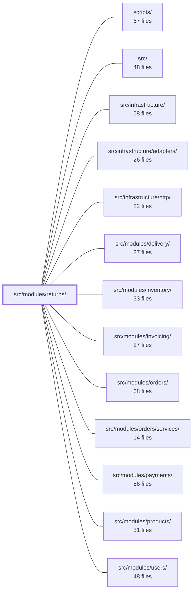

---
tags:
  - 2brain
  - 2brain/module
  - project/boilerplate-node-backend
type: module
module: src/modules/returns/
files: 40
updated: 2026-10-01T14:29:42.107748+00:00
---

# src/modules/returns/

## Purpose

The returns module implements the full lifecycle of customer product returns: creating a return request, approving or rejecting it (decision), recording physical receipt of returned items, computing refund amounts, and notifying the customer. It owns the return entity, its status transitions, and the business rules that govern quantities and lifecycle state.

## Key parts

- **Domain rules** (`domain/`): `lifecycle.ts` defines valid status transitions; `status-projection.ts` maps internal state to the public status a client sees; `quantities.ts` enforces rules on how many items may be returned. `model.ts` at the module root holds the core Return entity/schema.
- **Services** (`services/`): One file per business operation — `create.ts` (initiate a return), `decide.ts` (approve/reject), `receive.ts` (record physical arrival), `close.ts` (finalize), `refund-amount.ts` (calculate the monetary refund), `notify.ts` (dispatch notifications), `read.ts` (query returns), `projection.ts` (derive read-model state), and `personal-data.ts` (GDPR-style access/erasure).
- **Controllers & routes** (`controllers/`, `routes.ts`): Thin HTTP handlers (`post-return.ts`, `post-return-decision.ts`, `post-return-receive.ts`, `get-returns.ts`, `get-return-by-id.ts`) wired through `routes.ts`. `presenter.ts` shapes API responses.
- **Cross-cutting concerns**: `events.ts` (domain events published on state changes), `emails.ts` (email templates/dispatch), `audit.ts` (append-only audit log), `rate-limits.ts` (per-endpoint throttling), `config.ts` (tunable parameters).
- **Persistence & wiring**: `repository.ts` for data access; `module.ts` and `index.ts` register the module in the application container.
- **Tests** (`tests/`): Unit tests for domain logic, config, emails, refund math, routes, and status projection; integration tests for the receive flow and service layer; a contract test validating the public API schema.

## How it connects

- **`src/modules/orders/` / `src/modules/orders/services/`** — A return always references an order; the create and read services pull order and line-item data from the orders module.
- **`src/modules/payments/`** — `refund-amount.ts` and the close/decide flow coordinate with payments to issue or schedule a refund.
- **`src/modules/products/`** — Returned items are matched against product definitions (variants, pricing) for validation and refund calculation.
- **`src/modules/inventory/`** — `receive.ts` triggers inventory adjustments when goods are physically checked back in.
- **`src/modules/delivery/`** — The receive flow may record or verify a delivery/shipment record for the returned parcel.
- **`src/modules/invoicing/`** — Refund decisions can emit adjustments or credit notes through the invoicing module.
- **`src/modules/users/`** — Returns are scoped to a customer; `personal-data.ts` and email dispatch use user contact/identity data.
- **`src/infrastructure/` / `adapters/` / `http/`** — General HTTP transport, database adapters, and external-service adapters consumed by controllers, the repository, and notification services.

## Where to start

1. **`src/modules/returns/domain/lifecycle.ts`** — Reading the status machine first gives you the vocabulary (states, allowed transitions) that every other file assumes.
2. **`src/modules/returns/services/create.ts`** — Walking through the "create a return" service shows how domain rules, the repository, order lookups, events, and audit logging fit together in one concrete flow.

## Connected modules

[[boilerplate-node-backend_ROOT|/ (repository root)]] · [[boilerplate-node-backend_scripts|scripts/]] · [[boilerplate-node-backend_src|src/]] · [[boilerplate-node-backend_src_infrastructure|src/infrastructure/]] · [[boilerplate-node-backend_src_infrastructure_adapters|src/infrastructure/adapters/]] · [[boilerplate-node-backend_src_infrastructure_http|src/infrastructure/http/]] · [[boilerplate-node-backend_src_modules_delivery|src/modules/delivery/]] · [[boilerplate-node-backend_src_modules_inventory|src/modules/inventory/]] · [[boilerplate-node-backend_src_modules_invoicing|src/modules/invoicing/]] · [[boilerplate-node-backend_src_modules_orders|src/modules/orders/]] · [[boilerplate-node-backend_src_modules_orders_services|src/modules/orders/services/]] · [[boilerplate-node-backend_src_modules_payments|src/modules/payments/]] · [[boilerplate-node-backend_src_modules_products|src/modules/products/]] · [[boilerplate-node-backend_src_modules_users|src/modules/users/]]

## Files
- `src/modules/returns/audit.ts`
- `src/modules/returns/config.ts`
- `src/modules/returns/controllers/get-return-by-id.ts`
- `src/modules/returns/controllers/get-returns.ts`
- `src/modules/returns/controllers/post-return-decision.ts`
- `src/modules/returns/controllers/post-return-receive.ts`
- `src/modules/returns/controllers/post-return.ts`
- `src/modules/returns/domain/index.ts`
- `src/modules/returns/domain/lifecycle.ts`
- `src/modules/returns/domain/quantities.ts`
- `src/modules/returns/domain/status-projection.ts`
- `src/modules/returns/emails.ts`
- `src/modules/returns/events.ts`
- `src/modules/returns/index.ts`
- `src/modules/returns/model.ts`
- `src/modules/returns/module.ts`
- `src/modules/returns/presenter.ts`
- `src/modules/returns/rate-limits.ts`
- `src/modules/returns/repository.ts`
- `src/modules/returns/routes.ts`
- `src/modules/returns/services/close.ts`
- `src/modules/returns/services/create.ts`
- `src/modules/returns/services/decide.ts`
- `src/modules/returns/services/index.ts`
- `src/modules/returns/services/notify.ts`
- `src/modules/returns/services/personal-data.ts`
- `src/modules/returns/services/projection.ts`
- `src/modules/returns/services/read.ts`
- `src/modules/returns/services/receive.ts`
- `src/modules/returns/services/refund-amount.ts`
- `src/modules/returns/tests/contract/api.contract.test.ts`
- `src/modules/returns/tests/integration/receive.test.ts`
- `src/modules/returns/tests/integration/service.test.ts`
- `src/modules/returns/tests/unit/config.test.ts`
- `src/modules/returns/tests/unit/domain.test.ts`
- `src/modules/returns/tests/unit/emails.test.ts`
- `src/modules/returns/tests/unit/refund-amount.test.ts`
- `src/modules/returns/tests/unit/routes.test.ts`
- `src/modules/returns/tests/unit/schema-contract.test.ts`
- `src/modules/returns/tests/unit/status-projection.test.ts`

---
[[boilerplate-node-backend_INDEX|← boilerplate-node-backend index]]
