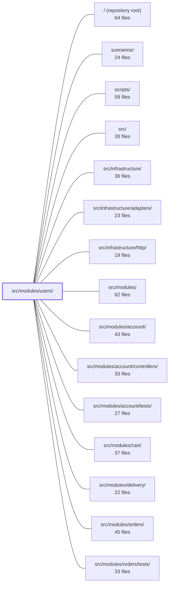

---
tags:
  - 2brain
  - 2brain/module
  - project/boilerplate-node-backend
type: module
module: src/modules/users/
files: 31
updated: 2026-09-23T20:39:12.852314+00:00
---

# src/modules/users/

## Purpose

The **users** module is the bounded context that owns the user record: its Mongoose schema, admin-facing CRUD and search, identity primitives (password hashing, token lifecycle, 2FA enable/disable, OAuth identity lookup), and the audit/analytics vocabulary for every mutation. It deliberately separates domain logic from HTTP orchestration—sessions, emails, rate-limiting, and anti-automation live in the `account` module—and enforces a strategic-DDD boundary so that no sibling module may import internals directly.

## Key parts

- **Domain core** — `model.ts` (Mongoose schema, Zod wire schema, token subdocument helpers, bcrypt pre-save hook), `service.ts` (admin CRUD, search, and the named identity operations `account` delegates to), `repository.ts` (persistence layer: CRUD, credential reads, token lifecycle, soft-delete queries).
- **HTTP layer** — `routes.ts` (admin-only Express router: auth, permissions, caching, upload limits) and `controllers/` (thin adapters: `write-users.ts` for create/update, `delete-users.ts` for soft/hard delete, `get-users.ts` for list/search, `get-user-item.ts` for single fetch, `delete-user-two-factor.ts` for 2FA strip).
- **Public surface & wiring** — `index.ts` (the *only* import surface permitted for sibling modules, re-exporting service, events, and narrow helpers while keeping the repository and model private), `module.ts` (kernel manifest: router, service, repository, permissions, config).
- **Cross-cutting declarations** — `analytics.ts`, `audit.ts`, `events.ts` (TypeScript declaration-merging into the kernel's `AnalyticsEventMap`, `AuditActionMap`, and `DomainEventMap`; purely declarative, no runtime logic).
- **Supporting artifacts** — `factories.ts` (fixture builder that defers to schema defaults), `openapi.yaml` (v2.0.0 REST contract for all endpoints).
- **Tests** (`tests/`) — layered unit → integration → contract suites covering schema security, service flows, repository semantics, OAuth regression (bug B24), token lifecycle, validation/i18n ordering, route mount order, and OpenAPI conformance.

## How it connects

- **`src/modules/account/`** — the primary consumer. `account` delegates all identity operations (auth, signup, verification, 2FA protect, OAuth callback lookup) to `userService` and imports only what `index.ts` re-exports. The reverse direction (users → account) is absent; users never orchestrates sessions or emails.
- **`src/` kernel** — the module augments three kernel type maps (`AnalyticsEventMap`, `AuditActionMap`, `DomainEventMap`) via declaration merging, and registers itself through `module.ts` into the kernel's `AppModule` collection.
- **`src/infrastructure/`** — the shared repository factory (wrapped by `repository.ts`) and HTTP adapters (middleware, response shaping) referenced by `routes.ts` and the controllers.
- **Other sibling modules** (`cart`, `orders`, `products`, etc.) — no direct dependency; they interact with user data only through the `account` module or through read-only context passed by the kernel.

## Where to start

1. **`index.ts`** — five lines that define exactly what the rest of the codebase may touch; reading it tells you the module's contract in one glance.
2. **`service.ts`** — the single file where admin CRUD, search, token consumption, 2FA toggling, and OAuth identity lookup all live; once you understand its method surface, the controllers and `account`-side delegates become self-evident adapters.

## Connected modules

[[boilerplate-node-backend_ROOT|/ (repository root)]] · [[boilerplate-node-backend_scenarios|scenarios/]] · [[boilerplate-node-backend_scripts|scripts/]] · [[boilerplate-node-backend_src|src/]] · [[boilerplate-node-backend_src_infrastructure|src/infrastructure/]] · [[boilerplate-node-backend_src_infrastructure_adapters|src/infrastructure/adapters/]] · [[boilerplate-node-backend_src_infrastructure_http|src/infrastructure/http/]] · [[boilerplate-node-backend_src_modules|src/modules/]] · [[boilerplate-node-backend_src_modules_account|src/modules/account/]] · [[boilerplate-node-backend_src_modules_account_controllers|src/modules/account/controllers/]] · [[boilerplate-node-backend_src_modules_account_tests|src/modules/account/tests/]] · [[boilerplate-node-backend_src_modules_cart|src/modules/cart/]] · [[boilerplate-node-backend_src_modules_delivery|src/modules/delivery/]] · [[boilerplate-node-backend_src_modules_orders|src/modules/orders/]] · [[boilerplate-node-backend_src_modules_orders_tests|src/modules/orders/tests/]] · … and 8 more

## Files
- `src/modules/users/analytics.ts` — Declares the analytics event names for the user module's administrative actions and registers them into the app-wide `AnalyticsEventMap` type so that emitters (e.g. `service.ts`) can reference them in a type-safe, stringly-typed-free way. The events distinguish operator-initiated account actions from the self-signup path (`USER_SIGNED_UP`) so that dashboards can sum or split them independently.
- `src/modules/users/audit.ts` — Declares the audit-action vocabulary for admin-facing user-record mutations (create, update, soft-delete, erase, 2FA strip, ban/unban) and registers those actions into the app-wide `AuditActionMap` via a TypeScript module augmentation. It is purely declarative — no runtime logic beyond the `as const` export.
- `src/modules/users/controllers/delete-user-two-factor.ts` — HTTP controller for `DELETE /users/:id/2fa`, an admin-only endpoint that strips a user's second factor of authentication without requiring the 2FA code. It is a thin adapter that delegates all business logic to `userService.adminDisableTwoFactor` and translates the result into an HTTP response.
- `src/modules/users/controllers/delete-users.ts` — Thin controller that wires the `DELETE /users` and `DELETE /users/:id` admin endpoints to the user service. It delegates actual deletion logic to `userService` and records the correct audit action (soft vs. hard/erasure) so the audit trail can later satisfy Art. 17 compliance questions.
- `src/modules/users/controllers/get-user-item.ts` — Controller for `GET /users/:id` — resolves a single user document by path id and returns it under the user contract shape. Admin-only. Exists as a thin adapter between the route layer and `userService`.
- `src/modules/users/controllers/get-users.ts` — Implements the `GET /users` and `POST /users/search` admin endpoints. It is a thin controller that validates query/body parameters, delegates the actual search to `userService.search()`, and post-processes the returned rows by attaching each user's current role via a single batched lookup.
- `src/modules/users/controllers/write-users.ts` — Single controller handler for `POST /users`, `PUT /users`, and `PUT /users/:id`. It reads the request body (JSON or multipart), validates it, and dispatches to `userService.create` or `userService.updateById` depending on whether an `id` is present. The file exists to isolate all HTTP-layer concerns (input parsing, upload cleanup, response shaping) from the domain logic in the service.
- `src/modules/users/events.ts` — Declares the two domain events the users module emits by augmenting the kernel's `DomainEventMap` via TypeScript declaration merging. This keeps the event catalogue distributed—each module contributes its own payloads without a single shared registry file—and provides one canonical string per event name for emitters and listeners to share.
- `src/modules/users/factories.ts` — Builds user document fixtures (seed accounts and test personas) by supplying only the fields a caller explicitly pins, leaving everything else to the Mongoose schema's defaults. It exists so that seeded rows reflect what the schema actually stores rather than duplicating or guessing at defaults.
- `src/modules/users/index.ts` — Public barrel for the `users` module. It is the **only** import surface a sibling module (in practice, `account`) is permitted to use, enforcing the strategic-DDD boundary described in `docs/theory/strategic-ddd.md` §5. It re-exports the service, domain events, and a narrow set of model helpers while keeping `userRepository` and the model's runtime internals private to the module.
- `src/modules/users/model.ts` — Defines the Mongoose schema, Zod wire-validation schema, token subdocument helpers, and TypeScript interfaces for the user record. Kept as a single file deliberately so the bcrypt pre-save hook stays collocated with the `select: false` that hides the password hash from every read.
- `src/modules/users/module.ts` — Module manifest that registers the **users** module with the kernel: wires the router, service, repository, and events into a single `AppModule` export, and declares the module's permissions, personal-data export sections, image writeback target, and required configuration.
- `src/modules/users/openapi.yaml` — OpenAPI 3.0.3 contract (v2.0.0) defining the REST endpoints for the **users** module. It specifies the request/response shapes, authentication, and error semantics for every user-facing route so that clients, tests, and documentation can be generated or validated against a single source of truth.
- `src/modules/users/repository.ts` — Persistence layer for the user collection. Wraps the shared repository factory with standard CRUD, then adds the credential reads, token lifecycle operations, and soft-delete/inactivity queries that the `account` module needs across the shared-kernel boundary.
- `src/modules/users/routes.ts` — Defines the admin-only `/users` Express router, wiring authentication, per-route permission checks, response caching, upload rate-limiting, and file-upload handling to the user CRUD controllers. It is the single entry point that maps HTTP verbs/paths to the module's controller functions.
- `src/modules/users/service.ts` — The user-document service: admin-facing CRUD and search, plus the named identity operations that `account` delegates to for authenticating, registering, verifying, and 2FA-protecting a user. It enforces only what the user document itself requires; all HTTP orchestration, sessions, emails, rate-limiting, and anti-automation logic live in `account`.
- `src/modules/users/tests/contract/api.contract.test.ts` — Contract tests for the user-facing endpoints (`/users`, `/users/{id}`, `/account`, `/account/signup`). Every response is validated against `openapi.yaml` via the `toSatisfyApiSpec()` matcher, and a string-level guard (`assertNoCredentials`) ensures no password, token, or bcrypt hash ever appears in a serialized body—regardless of field name.
- `src/modules/users/tests/factories.ts` — Test-only database factory for the `users` module. It wraps the plain-payload builder in `../factories` with a persistence step (`userRepository.create`) and role assignment, giving integration and contract tests a single `createUser` / `createAdminUser` entry point that returns a live Mongoose document. It also centralises the full password vocabulary (minimal, legacy, weak, replacement) so policy tests and flow tests share the same fixtures.
- `src/modules/users/tests/integration/model.test.ts` — Integration test that verifies credentials (bcrypt hash, live tokens) can never leak into a serialized user response. It asserts two independent guards: the Mongoose `select: false` option prevents loading, and the `applyUserTransform` allowlist (exposed via `toJSON`) strips them at serialization time—including for `.lean()` documents that bypass `toJSON` hooks.
- `src/modules/users/tests/integration/repository.test.ts` — Integration test suite for `userRepository` that exercises the full CRUD surface (create, findById, findOne, findAll, count, save, deleteOne, updateMany) plus the token-facing methods (`tokenRemoveAll`, `tokenRemoveExpired`) against an in-memory MongoDB instance. It verifies repository-level behavior—persistence semantics, lean vs. hydrated documents, pagination options, and token lifecycle—without depending on an external database.
- `src/modules/users/tests/integration/schema-contract.test.ts` — Integration tests that verify Mongoose schema-level guarantees (field visibility via `select: false`, password hashing, JSON serialization shape, and the unique email index) by running against a real MongoDB instance. These test Mongoose's own built-in behaviours rather than application-level transforms, so a mocked model would be meaningless.
- `src/modules/users/tests/integration/service-oauth.test.ts` — Integration tests for `userService.findByOAuthIdentity`, the first lookup `account/services/oauth.ts` runs on every OAuth callback. The file exists as a regression guard for bug **B24**: the method previously matched on the `oauthAccounts` link alone, so a deactivated or soft-deleted account still resolved and walked straight into a session. These tests assert the lookup is now filtered the same way `findForLogin` already is.
- `src/modules/users/tests/integration/service-tokens.test.ts` — Integration tests covering the two token-facing lookups on the users service — `findByEmail` and `consumeToken`. They verify that tokens are returned as a populated array (not `undefined`), that consumption removes exactly the targeted token, that removal is persisted to the database, and that unknown tokens are a safe no-op.
- `src/modules/users/tests/integration/service.test.ts` — Integration test suite for `userService` covering data validation, search/filter/pagination, and admin create/update/delete flows. Runs against a real in-memory MongoDB instance (via `setupTestDb`) rather than mocks, exercising the repository and model layers as the service would see them in production.
- `src/modules/users/tests/unit/audit.test.ts` — Pin-tests the audit action string map so that any accidental addition, removal, or rewording of an action constant is caught immediately. The strings are a wire contract consumed by external log queries, dashboards, and alerting, so drift would silently break downstream tooling.
- `src/modules/users/tests/unit/factories.test.ts` — Unit tests for the `makeUser` fixture builder and the shared password vocabulary constants. Ensures the factory produces valid, insertable user objects with correct defaults/overrides, and that each password constant fulfills its designated role (settable, legacy, minimal, weak) against the *real* Zod policy and the bundled breach list.
- `src/modules/users/tests/unit/routes.test.ts` — Structural contract test for the user-administration router. It asserts that every endpoint is mounted in the documented order, that the full authorization guard chain is present on each route in the correct sequence, that caching tags/keys are shared correctly across the two listing endpoints, that mutations invalidate both serving modules' caches, and that upload and hard-delete middleware are attached exactly where they belong. It exists so a regressed mount order, a dropped guard, or a missing cache invalidation fails loudly in CI rather than silently exposing an admin-only directory.
- `src/modules/users/tests/unit/schema-contract.test.ts` — Unit tests that pin down the security-critical contract of `userSchema`: which fields are required, how `password`/`tokens`/`oauthAccounts` are hidden from accidental reads and serialization, what defaults a new user receives, the exact index set and uniqueness invariants, and that the `pre('save')` bcrypt hook fires only when `password` is actually modified.
- `src/modules/users/tests/unit/token-methods.test.ts` — Unit tests for the `tokenAdd` and `tokenRemoveAll` instance methods on the user schema. These two methods are where a session is created or destroyed; the tests verify the database-first write order, the in-memory mirror (only when the `tokens` array was loaded), expiry semantics, and that unrelated token types are unaffected. The model is a double—no database is needed.
- `src/modules/users/tests/unit/validation-messages.test.ts` — Guards against a specific i18n ordering bug: if `t()` is called at module scope before `i18next.init()`, Zod falls back to its built-in English messages. This test asserts the **exact shipped strings** (not merely "not a dotted key") to catch that silent fallback, and verifies the schema's thunk-based message resolution follows live locale changes without a rebuild.
- `src/modules/users/tests/unit/validation.test.ts` — Exercises the ten message thunks in `zodUserSchema` at **parse time**, which is the only moment they actually run. Because a Zod schema is a declaration, import-time coverage reports 100 % whether or not a thunk ever fires; this file closes that gap. It also pins the distinction between `error: t('…')` (resolves at import, before `i18next.init()`, silently falling back to English) and the correct `error: () => t('…')`, and guards against a message being attached to the wrong rule.

---
[[boilerplate-node-backend_INDEX|← boilerplate-node-backend index]]
