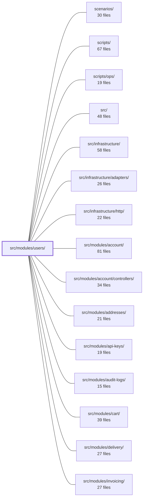

---
tags:
  - 2brain
  - 2brain/module
  - project/boilerplate-node-backend
type: module
module: src/modules/users/
files: 48
updated: 2026-10-01T14:29:59.562210+00:00
---

# src/modules/users/

## Purpose

The `users` module owns the full user-identity lifecycle: creating, reading, updating, restoring, and deleting accounts, plus the sensitive material attached to each one (credentials, refresh tokens, two-factor methods, OAuth links). It exposes the admin-facing `/users` REST surface and provides the typed service, repository, and event vocabulary that the `account` module and other siblings rely on for session management, sign-up, and personal-data compliance.

## Key parts

- **Model & persistence** — `model.ts` (Mongoose schema, password pre-save hash, `select: false` casters, token/OAuth subdocuments) and `repository.ts` (CRUD plus credential, token, and OAuth-link operations; the only sanctioned place to re-select hidden fields).
- **Services (business logic)** — `services/` split by concern: `create`, `update`, `remove`, `signup`, `tokens`, `credentials`, `image`, `lookups`, `reaper`, `validation`, `admin-two-factor`, re-exported through `services/index.ts`.
- **HTTP layer** — `controllers/` (one thin file per action) and `routes.ts` (Express `Router` wiring middleware, auth, and rate-limiting to those controllers).
- **Module wiring & contracts** — `module.ts` (the `AppModule` manifest: routes, permissions, locales, erasure hooks, config), `openapi.yaml` (OpenAPI 3.0.3 spec consumed by codegen and client SDKs), `index.ts` (public barrel; the only surface sibling modules may import).
- **Cross-cutting registries** — `analytics.ts` (typed event names), `audit.ts` (typed audit action constants), `events.ts` (domain-event map augmentation), `erasure-registry.ts` (personal-data erase manifest, supplied at boot to avoid circular imports).
- **Testing** — `tests/contract/` (OpenAPI-driven API contract tests, especially the "no undeclared field leaks" invariant), `tests/integration/` (schema, repository, model, and service-oauth tests against in-memory MongoDB), `tests/factories.ts` (persistence-aware fixture builder).
- **Misc** — `factories.ts` (seed/test document builder), `config.ts`, `presenter.ts`.

## How it connects

- **`src/modules/account/`** — the primary consumer. The account module calls `userService.findByOAuthIdentity` on every OAuth callback, relies on the repository's credential/token operations across the shared-kernel edge, and participates in the personal-data erasure registry that `erasure-registry.ts` exposes.
- **`src/modules/audit-logs/`** — consumes the `AuditActionMap` entries declared in `audit.ts` to filter, query, and export audit trails by the exact action names this module emits.
- **`src/modules/observability/`** — consumes the `AnalyticsEventMap` entries from `analytics.ts` to build dashboards that split operator-initiated actions from self-signup.
- **`src/infrastructure/http/`** — `routes.ts` builds on the shared Express router and middleware utilities provided by the HTTP infrastructure layer.
- **All sibling modules** (`orders`, `payments`, `products`, etc.) — import the users module exclusively through `index.ts` (enforced by the strategic-DDD barrel rule); they never reach into `model.ts`, `repository.ts`, or `services/` directly.

## Where to start

1. **`model.ts`** — reading the Mongoose schema first gives you the shape of a user, the `select: false` invariants, and the password-hash hook; everything else (repository, services, contract tests) builds on those guarantees.
2. **`module.ts`** — the manifest shows how routes, permissions, erasure hooks, and config are assembled into a single `AppModule`, giving you the "wiring diagram" before diving into individual services or controllers.

## Connected modules

```mermaid
flowchart LR
    m_src_modules_users["src/modules/users/"]
    m_scenarios["scenarios/<br/>30 files"]
    m_scripts["scripts/<br/>67 files"]
    m_scripts_ops["scripts/ops/<br/>19 files"]
    m_src["src/<br/>48 files"]
    m_src_infrastructure["src/infrastructure/<br/>58 files"]
    m_src_infrastructure_adapters["src/infrastructure/adapters/<br/>26 files"]
    m_src_infrastructure_http["src/infrastructure/http/<br/>22 files"]
    m_src_modules_account["src/modules/account/<br/>81 files"]
    m_src_modules_account_controllers["src/modules/account/controllers/<br/>34 files"]
    m_src_modules_addresses["src/modules/addresses/<br/>21 files"]
    m_src_modules_api_keys["src/modules/api-keys/<br/>19 files"]
    m_src_modules_audit_logs["src/modules/audit-logs/<br/>15 files"]
    m_src_modules_cart["src/modules/cart/<br/>39 files"]
    m_src_modules_delivery["src/modules/delivery/<br/>27 files"]
    m_src_modules_invoicing["src/modules/invoicing/<br/>27 files"]
    m_src_modules_users --- m_scenarios
    m_src_modules_users --- m_scripts
    m_src_modules_users --- m_scripts_ops
    m_src_modules_users --- m_src
    m_src_modules_users --- m_src_infrastructure
    m_src_modules_users --- m_src_infrastructure_adapters
    m_src_modules_users --- m_src_infrastructure_http
    m_src_modules_users --- m_src_modules_account
    m_src_modules_users --- m_src_modules_account_controllers
    m_src_modules_users --- m_src_modules_addresses
    m_src_modules_users --- m_src_modules_api_keys
    m_src_modules_users --- m_src_modules_audit_logs
    m_src_modules_users --- m_src_modules_cart
    m_src_modules_users --- m_src_modules_delivery
    m_src_modules_users --- m_src_modules_invoicing
    style m_src_modules_users stroke-width:3px
```

[[boilerplate-node-backend_ROOT|/ (repository root)]] · [[boilerplate-node-backend_scenarios|scenarios/]] · [[boilerplate-node-backend_scripts|scripts/]] · [[boilerplate-node-backend_scripts_ops|scripts/ops/]] · [[boilerplate-node-backend_src|src/]] · [[boilerplate-node-backend_src_infrastructure|src/infrastructure/]] · [[boilerplate-node-backend_src_infrastructure_adapters|src/infrastructure/adapters/]] · [[boilerplate-node-backend_src_infrastructure_http|src/infrastructure/http/]] · [[boilerplate-node-backend_src_modules_account|src/modules/account/]] · [[boilerplate-node-backend_src_modules_account_controllers|src/modules/account/controllers/]] · [[boilerplate-node-backend_src_modules_addresses|src/modules/addresses/]] · [[boilerplate-node-backend_src_modules_api-keys|src/modules/api-keys/]] · [[boilerplate-node-backend_src_modules_audit-logs|src/modules/audit-logs/]] · [[boilerplate-node-backend_src_modules_cart|src/modules/cart/]] · [[boilerplate-node-backend_src_modules_delivery|src/modules/delivery/]] · … and 9 more

## Files
- `src/modules/users/analytics.ts` — Declares the analytics event names for the user module's administrative actions and registers them into the app-wide `AnalyticsEventMap` type so that emitters (e.g. `service.ts`) can reference them in a type-safe, stringly-typed-free way. The events distinguish operator-initiated account actions from the self-signup path (`USER_SIGNED_UP`) so that dashboards can sum or split them independently.
- `src/modules/users/audit.ts` — Declares the audit action string constants owned by the users module and registers them into the app-wide `AuditActionMap` type via TypeScript declaration merging. It exists so that every audit event the users module emits uses a single, typed vocabulary, and so downstream consumers (query UIs, compliance exports) can filter by these exact action names.
- `src/modules/users/config.ts`
- `src/modules/users/controllers/create-user.ts` — Handles the `POST /users` endpoint (staff-initiated user creation). It parses the incoming request (JSON or multipart), validates the payload via the users service, delegates persistence to `userService.create`, and shapes the HTTP response. The update half of this controller pair lives in `update-user.ts`.
- `src/modules/users/controllers/delete-user-two-factor.ts` — Thin HTTP adapter for `DELETE /users/:id/2fa` — the admin-assisted path that strips a user's second factor without requiring a verification code. All business logic lives in the service; this file only maps the request to a service call and the result to an HTTP response.
- `src/modules/users/controllers/delete-users.ts` — Thin controller that maps the two admin delete endpoints (`DELETE /users` and `DELETE /users/:id`) to the user service, delegating the actual deletion and selecting the correct audit action name. It exists so route registration stays decoupled from the deletion logic and the audit trail records *which* kind of delete (soft vs. hard) occurred.
- `src/modules/users/controllers/get-user-item.ts` — Controller for `GET /users/:id` — resolves a single user document by path id and returns it under the user contract shape. Admin-only. Exists as a thin adapter between the route layer and `userService`.
- `src/modules/users/controllers/get-users.ts` — Controller for `GET /users` (and `POST /users/search`) that lists or searches users via query parameters. It wraps the shared search-controller factory, validates the request with a Zod schema, delegates to `userService.search`, and enriches each returned user with their current role before responding.
- `src/modules/users/controllers/restore-users.ts` — Thin controller for `POST /users/:id/restore` that undoes an admin soft-delete of a user. It exists to keep the route layer declarative while delegating business logic to the users service and reusing the shared restore-controller factory.
- `src/modules/users/controllers/update-user.ts` — Defines the HTTP handlers for `PUT /users/:id` (full replace) and `PATCH /users/:id` (partial merge) by wiring the shared `createUpdateController` factory to `userService.updateById`. All business logic (field merging, audit, ban/unban split) lives in the service layer; this file only handles transport concerns.
- `src/modules/users/erasure-registry.ts` — Holds the `users` module's view of the DDD-D6 `personalData.erase` registry. Because `users` cannot import sibling modules under `src/modules/*` to collect their manifest entries itself (the same circular-dependency wall that motivates `@modules/account/services/personal-data-registry.ts`), the list is **supplied in once at boot** by the `onRegistered` hook rather than assembled here.
- `src/modules/users/events.ts` — Declares the domain events owned by the users module by augmenting the kernel's `DomainEventMap` interface, so the event catalogue grows per-module without a shared enumeration file.
- `src/modules/users/factories.ts` — Builds user document fixtures (seed accounts and test personas) by supplying only the fields a caller explicitly pins, leaving everything else to the Mongoose schema's defaults. It exists so that seeded rows reflect what the schema actually stores rather than duplicating or guessing at defaults.
- `src/modules/users/index.ts` — Public barrel for the `users` module — the sole import surface available to sibling modules (enforced per `docs/theory/strategic-ddd.md` §5). It re-exports the service, events, and selected model members so that external code never reaches into internal files directly.
- `src/modules/users/model.ts` — Defines the Mongoose schema and TypeScript interfaces for the user record, its token subdocuments, two-factor method records, and OAuth account links. Deliberately kept as a single file so the password pre-save hash hook stays colocated with the `select: false` casters that keep the hash off every read. Also re-exports `normalizeEmail` and provides the `hashToken` / `isLiveRefreshSession` helpers that other modules depend on for token comparison and session listing.
- `src/modules/users/module.ts` — The module manifest for the `users` module. It declares everything the kernel needs to wire up the module—routes, permissions, locales, image writeback targets, personal-data export sections, and required configuration—into a single `AppModule` object. It also resolves cross-module personal-data erasure hooks at registration time.
- `src/modules/users/openapi.yaml` — OpenAPI 3.0.3 contract (v2.0.0) that defines the full REST surface for the **users** module: list, create, delete, get-by-id, full-replace, and partial-update operations. It serves as the single source of truth for the module's request/response shapes, parameter semantics, and error responses, and is the document other tooling (codegen, client SDKs, docs) consumes.
- `src/modules/users/presenter.ts`
- `src/modules/users/repository.ts` — Persistence layer for the user collection. Wraps the shared `createRepository` factory with standard CRUD, then layers on the credential, token, OAuth-link, and inactivity-sweep operations that the `account` module needs across the shared-kernel edge. All sensitive fields (`password`, `tokens`, 2FA material, `oauthAccounts`, `pendingEmail`) are `select: false` on the schema; this file is the single sanctioned place to re-select them.
- `src/modules/users/routes.ts` — Defines the Express `Router` for the admin-only `/users` API surface (search, list, read, create, update, delete, restore, 2FA removal). It wires each endpoint to the appropriate authorization key, caching policy, rate-limit, upload, and route-flag middleware, then delegates to the per-action controllers.
- `src/modules/users/services/admin-two-factor.ts`
- `src/modules/users/services/create.ts`
- `src/modules/users/services/credentials.ts`
- `src/modules/users/services/image.ts`
- `src/modules/users/services/index.ts`
- `src/modules/users/services/lookups.ts`
- `src/modules/users/services/read.ts`
- `src/modules/users/services/reaper.ts`
- `src/modules/users/services/remove.ts`
- `src/modules/users/services/signup.ts`
- `src/modules/users/services/tokens.ts`
- `src/modules/users/services/update.ts`
- `src/modules/users/services/validation.ts`
- `src/modules/users/tests/contract/api.contract.test.ts` — Contract tests for the `/users` and `/account` endpoints. Because `openapi.yaml` declares `additionalProperties: false` on the `User` schema, these tests verify that **no** undeclared field (password, tokens, a bcrypt hash) can leak into any user response — not just the ones a developer thought to name. They also pin endpoint-specific behavior: cache headers, HTTP status codes for error cases, PUT replace-vs-PATCH merge semantics, and password-provisioning rules on admin create.
- `src/modules/users/tests/factories.ts` — Test-only database factory for the `users` module. It wraps the plain-payload builder in `../factories` with a persistence step (`userRepository.create`) and role assignment, giving integration and contract tests a single `createUser` / `createAdminUser` entry point that returns a live Mongoose document. It also centralises the full password vocabulary (minimal, legacy, weak, replacement) so policy tests and flow tests share the same fixtures.
- `src/modules/users/tests/integration/image-clear.test.ts`
- `src/modules/users/tests/integration/model.test.ts` — Integration test that verifies two invariants of the user model: (1) email addresses are stored and looked up case-insensitively via a unique index, and (2) credential fields (`password`, `tokens`) can never leak into a serialised response. The second invariant is checked at two independent layers — Mongoose `select: false` at the query level and the `toJSON` allowlist at the serialisation boundary — including `.lean()` results that bypass `toJSON` entirely.
- `src/modules/users/tests/integration/repository.test.ts` — Integration test suite for `userRepository`, exercising the full CRUD surface and the token-facing methods (`tokenRemoveAll`, `tokenRemoveExpired`) against an in-memory MongoDB instance. It verifies repository behavior end-to-end (including Mongoose pre-save hooks, lean queries, and pagination options) without requiring a real database.
- `src/modules/users/tests/integration/schema-contract.test.ts` — Integration tests that verify Mongoose schema-level guarantees (field visibility via `select: false`, password hashing, JSON serialization shape, and the unique email index) by running against a real MongoDB instance. These test Mongoose's own built-in behaviours rather than application-level transforms, so a mocked model would be meaningless.
- `src/modules/users/tests/integration/service-oauth.test.ts` — Integration tests for `userService.findByOAuthIdentity`, the first lookup `account/services/oauth.ts` runs on every OAuth callback. The file exists as a regression guard for bug **B24**: the method previously matched on the `oauthAccounts` link alone, so a deactivated or soft-deleted account still resolved and walked straight into a session. These tests assert the lookup is now filtered the same way `findForLogin` already is.
- `src/modules/users/tests/integration/service-tokens.test.ts` — Integration tests covering the two token-facing lookups on the users service — `findByEmail` and `consumeToken`. They verify that tokens are returned as a populated array (not `undefined`), that consumption removes exactly the targeted token, that removal is persisted to the database, and that unknown tokens are a safe no-op.
- `src/modules/users/tests/integration/service.test.ts` — Integration test suite for `userService` (validation, search, create, update, delete) running against an in-memory MongoDB via `setupTestDb`. It verifies end-to-end service behaviour — validation rules, query filters, pagination, audit emission, event dispatch, erasure-registry callbacks, and access-role assignment — without hitting a real database or filesystem.
- `src/modules/users/tests/unit/factories.test.ts` — Unit tests for the `makeUser` fixture builder and the shared password vocabulary constants. Ensures the factory produces valid, insertable user objects with correct defaults/overrides, and that each password constant fulfills its designated role (settable, legacy, minimal, weak) against the _real_ Zod policy and the bundled breach list.
- `src/modules/users/tests/unit/routes.test.ts` — Unit tests that verify the user-administration router (`@modules/users/routes`) is mounted correctly: the exact endpoint set and order, per-endpoint authorization guard ordering, cache-header semantics, and upload-middleware attachment. The file exists to catch regressions where a route is added without the identity guard + key assertion, mounted above the shared `router.use(getAuth, isAuthOrCredential)` gate, or accidentally exposed to public or shared-cache paths.
- `src/modules/users/tests/unit/schema-contract.test.ts` — Unit tests that pin down the security-critical contract of `userSchema`: which fields are required, how `password`/`tokens`/`oauthAccounts` are hidden from accidental reads and serialization, what defaults a new user receives, the exact index set and uniqueness invariants, and that the `pre('save')` bcrypt hook fires only when `password` is actually modified.
- `src/modules/users/tests/unit/token-methods.test.ts` — Unit tests for the `tokenAdd` and `tokenRemoveAll` instance methods on the user schema. These two methods are where a session is created or destroyed; the tests verify the database-first write order, the in-memory mirror (only when the `tokens` array was loaded), expiry semantics, and that unrelated token types are unaffected. The model is a double—no database is needed.
- `src/modules/users/tests/unit/validation-messages.test.ts` — Guards against a specific i18n ordering bug: if `t()` is called at module scope before `i18next.init()`, Zod falls back to its built-in English messages. This test asserts the **exact shipped strings** (not merely "not a dotted key") to catch that silent fallback, and verifies the schema's thunk-based message resolution follows live locale changes without a rebuild.
- `src/modules/users/tests/unit/validation.test.ts` — Exercises the ten message thunks in `zodUserSchema` at **parse time**, which is the only moment they actually run. Because a Zod schema is a declaration, import-time coverage reports 100 % whether or not a thunk ever fires; this file closes that gap. It also pins the distinction between `error: t('…')` (resolves at import, before `i18next.init()`, silently falling back to English) and the correct `error: () => t('…')`, and guards against a message being attached to the wrong rule.

---
[[boilerplate-node-backend_INDEX|← boilerplate-node-backend index]]
