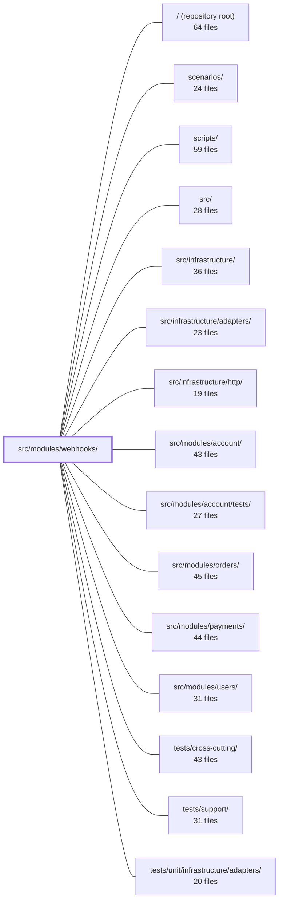

---
tags:
    - 2brain
    - 2brain/module
    - project/boilerplate-node-backend
type: module
module: src/modules/webhooks/
files: 45
updated: 2026-09-23T20:39:31.319922+00:00
---

# src/modules/webhooks/

## Purpose

The webhooks module implements outbound webhooks: tenants subscribe to platform events (orders, payments), and the module signs, delivers, retries, and logs HTTP POSTs to their subscriber URLs. It also exposes the admin REST surface for managing subscriptions, inspecting the delivery log, and replaying a single delivery. All public events, REST contracts, and internal queue contracts are declared in AsyncAPI / OpenAPI files that serve as the single source of truth for code generation and drift detection.

## Key parts

- **Contracts & specs** — `openapi.yaml` (full REST contract consumed by orval/Zod and audit tooling), `asyncapi.yaml` (public event catalogue served at `GET /webhooks/events`), `asyncapi.internal.yaml` (private RabbitMQ delivery-queue shape, excluded from public bundles).
- **Domain rules** — `domain/backoff.ts` (retry schedule, max attempts, auto-disable threshold) and `domain/event-filter.ts` (exact/wildcard event-type matching), both pure and I/O-free.
- **Data layer** — `model.ts` (Mongoose schemas, interfaces, indexes for `webhooksubscriptions` and `webhookdeliveries`) and `repository.ts` (lease-based claiming, streak recording, conditional disable, sweep reads).
- **Service layer** (`services/`) — `publish.ts` (subscribes to kernel domain events, fans out pending deliveries), `attempt.ts` (signs + POSTs + records outcome), `subscriptions.ts` (tenant CRUD + secret-ring lifecycle + cap enforcement), `sweep.ts` (finds due rows, enqueues retry jobs), `deliveries.ts` (list + replay), `catalogue.ts` (event list sourced from `asyncapi.yaml`).
- **HTTP layer** — `routes.ts` (Express router, all routes permission-protected), `controllers/` (one file per endpoint), `secrets.ts` (AES-256-GCM secret-ring mint/rotate/drop).
- **Module wiring & cross-cutting** — `module.ts` (registers routes, permissions, event listeners, queue consumer, config gates into the kernel `AppModule`), `index.ts` (sole public barrel for sibling modules), `config.ts` (env-derived accessors read at call time), `audit.ts` (registers audit actions into the global map), `metrics.ts` (Prometheus metrics for fleet-wide alerts), `emails.ts` (auto-disable notification copy).
- **Tests** — unit (backoff, event-filter, config gate, schema-contract), integration (delivery pipeline, subscription cap race, sweep), contract (OpenAPI response validation, schema-drift guard), and fuzz (SSRF-adjacent delivery behaviors).

## How it connects

- **`src/modules/orders/` and `src/modules/payments/`** — publish domain events onto the kernel event bus; `services/publish.ts` subscribes to those events. The webhooks module never imports orders or payments directly; the dependency is strictly event-bus (prescribed by the module-boundary rules).
- **`src/infrastructure/adapters/`** — the queue adapter used to enqueue delivery jobs (`sweep.ts` publishes, the consumer in `module.ts` claims via `attempt.ts`).
- **`src/infrastructure/http/`** — provides the Express framework, Zod schema generation from `openapi.yaml`, and shared middleware that `routes.ts` and `controllers/` rely on.
- **`src/infrastructure/`** — shared `metricsRegistry` that `metrics.ts` registers its counters/gauges on.
- **`src/modules/account/`** — the email-copy convention (`emails.ts` mirrors `@modules/account/emails`): language as argument, complete `EmailContent` output.
- **`src/modules/users/`** — subscription rows carry an `ownerUserId` that references the users module.
- **`tests/support/`** — provides `https-test-server.ts` used by `tests/integration/delivery.test.ts` to spin up a real local HTTPS listener.
- **`tests/cross-cutting/`** — houses the generic SSRF-guard fuzz tests; the webhooks module deliberately does not re-test the guard itself (see `tests/fuzz/webhook-ssrf.fuzz.test.ts` doc comment).
- **`scripts/`** — the per-minute ops script that calls `sweepDueWebhookDeliveries` to keep retries moving between nightly `reap:*` jobs.
- **Repository root** — `npm run contracts:bundle` merges `asyncapi.internal.yaml` into the public `asyncapi.yaml` and produces the bundled spec consumed by `services/catalogue.ts`.

## Where to start

1. **`module.ts`** — the single manifest that shows every route, permission key, domain-event subscription, queue consumer, and config gate the module registers with the kernel. Reading this first gives you the full wiring map.
2. **`openapi.yaml`** — the complete REST contract (subscription CRUD, delivery log, replay, event catalogue). Combined with `routes.ts` and the controllers, it tells you exactly what the module exposes externally and what shapes flow over the wire.

## Connected modules

[[boilerplate-node-backend_ROOT|/ (repository root)]] · [[boilerplate-node-backend_scenarios|scenarios/]] · [[boilerplate-node-backend_scripts|scripts/]] · [[boilerplate-node-backend_src|src/]] · [[boilerplate-node-backend_src_infrastructure|src/infrastructure/]] · [[boilerplate-node-backend_src_infrastructure_adapters|src/infrastructure/adapters/]] · [[boilerplate-node-backend_src_infrastructure_http|src/infrastructure/http/]] · [[boilerplate-node-backend_src_modules_account|src/modules/account/]] · [[boilerplate-node-backend_src_modules_account_tests|src/modules/account/tests/]] · [[boilerplate-node-backend_src_modules_orders|src/modules/orders/]] · [[boilerplate-node-backend_src_modules_payments|src/modules/payments/]] · [[boilerplate-node-backend_src_modules_users|src/modules/users/]] · [[boilerplate-node-backend_tests_cross-cutting|tests/cross-cutting/]] · [[boilerplate-node-backend_tests_support|tests/support/]] · [[boilerplate-node-backend_tests_unit_infrastructure_adapters|tests/unit/infrastructure/adapters/]]

## Files

- `src/modules/webhooks/asyncapi.internal.yaml` — Declares the webhooks module's **private** RabbitMQ delivery-queue contract (channel, operations, and message shape) in AsyncAPI. It is a `backend`-only fragment that is merged into `./asyncapi.yaml` but deliberately excluded from any public bundle, so the paired frontend never sees the internal worker queue.
- `src/modules/webhooks/asyncapi.yaml` — The public event catalogue for the webhooks module: a self-contained AsyncAPI 3.0.0 document that defines exactly which events a webhook subscriber can receive. It is the single source of truth served by `GET /webhooks/events`, so the catalogue a subscriber reads and the events the module actually fires cannot drift apart.
- `src/modules/webhooks/audit.ts` — Declares the webhooks module's audit-action vocabulary and registers it into the application-wide `AuditActionMap` via TypeScript module augmentation. Every write against a subscription (URL, secret) is audited—not just destructive ones—because data-protection questions later need a complete trail.
- `src/modules/webhooks/config.ts` — Env-derived configuration accessors for the webhooks module. Every value is read at call time (not captured at import) so a deployment can change limits or keys without restarting the process. This mirrors the pattern set by `inventory/config.ts`.
- `src/modules/webhooks/controllers/create-subscription.ts` — HTTP controller that handles `POST /webhooks/subscriptions`. It parses and validates the request body against the generated Zod schema, delegates to the webhooks service to create the subscription, and returns the new subscription along with its one-time `secret`.
- `src/modules/webhooks/controllers/delete-subscription.ts` — Handles `DELETE /webhooks/subscriptions/:id`. It permanently removes a webhook subscription (delivery log is left in place). Hand-written rather than built on `createDeleteController`, which is designed for the soft/hard delete triplet and doesn't fit this single-permanent-delete use case.
- `src/modules/webhooks/controllers/list-deliveries.ts` — HTTP controller for `GET /webhooks/deliveries`. Returns the calling tenant's webhook delivery log (newest first) with optional filtering by subscription and/or status and standard pagination. It is a thin adapter that validates query params and delegates the actual query to the webhooks service.
- `src/modules/webhooks/controllers/list-events.ts` — Express controller for the `GET /webhooks/events` endpoint. It returns the full webhook event catalogue (sourced from `asyncapi.yaml`) as a JSON array, giving API consumers a list of every event a subscription can filter on.
- `src/modules/webhooks/controllers/list-subscriptions.ts` — Defines the `GET /webhooks/subscriptions` controller. It returns the calling tenant's webhook subscriptions (newest first) with pagination, and guarantees no secret material is exposed.
- `src/modules/webhooks/controllers/replay-delivery.ts` — Controller for `POST /webhooks/deliveries/:id/replay`. It re-sends a previously recorded webhook delivery synchronously against the subscription's **current** URL and secret ring (not the original ones at delivery time). Documented as the single most-requested support action in `docs/modules/webhooks.md`.
- `src/modules/webhooks/controllers/update-subscription.ts` — Controller handler for `PATCH /webhooks/subscriptions/:id`. Accepts a partial-update body (including the `rotateSecret` and `removeSecretId` secret-ring actions), delegates to the webhooks service, and returns the updated subscription along with a `newSecret` when a rotation occurred.
- `src/modules/webhooks/domain/backoff.ts` — Pure, dependency-free retry-backoff rules for webhook deliveries. Defines the delay schedule, the max-attempt count, and the auto-disable threshold so that the sweep worker, the attempt service, and unit tests all share a single source of truth for "when is the next try" and "when do we give up on a subscription."
- `src/modules/webhooks/domain/event-filter.ts` — Pure, I/O-free decision logic that answers one question: _does a given event type belong to a subscription's `eventTypes` filter?_ Matching is exact-membership or the `'*'` wildcard—no glob or prefix matching. The module exists to keep the "should this subscriber receive this event?" check in the domain layer, independent of transport or storage concerns.
- `src/modules/webhooks/domain/index.ts` — Barrel file for the webhooks domain layer. It re-exports the pure rules (retry/backoff constants and helpers, event-filtering logic) from two sibling modules so that consumers can import from a single entry point without reaching into sub-paths.
- `src/modules/webhooks/emails.ts` — Resolves the email copy for every notification the webhooks module sends into finished, locale-ready strings. Follows the same convention as `@modules/account/emails`: language is an argument, the output is a complete `EmailContent` object, and the template only interpolates. Currently contains a single email — the auto-disable notice delivered to the subscription owner when repeated failures switch the endpoint off.
- `src/modules/webhooks/index.ts` — Public barrel for the webhooks module. It is the **only** import surface permitted to sibling modules (enforced per `docs/theory/strategic-ddd.md` §5). It re-exports the module's public API without executing any side-effects.
- `src/modules/webhooks/metrics.ts` — Defines the webhooks module's domain-level Prometheus metrics and registers them on the shared `metricsRegistry`. The metrics exist to power two fleet-wide alerts — `WebhookDeliveriesFailingEverywhere` and `WebhookRetriesStalled` — that detect our-side outages (all deliveries failing, retry sweep stalled) as distinct from a single subscriber's endpoint being down.
- `src/modules/webhooks/model.ts` — Defines the two Mongoose collections the webhooks module owns — `webhooksubscriptions` (a tenant's standing subscription to event types) and `webhookdeliveries` (one row per event×subscription, tracking retry attempts through to success or exhaustion) — including their schemas, interfaces, index definitions, and serialization transforms for the HTTP wire shape.
- `src/modules/webhooks/module.ts` — Module manifest for the outbound-webhooks feature. It registers the module's HTTP routes, permission keys, domain-event subscriptions, queue consumer, and required/forbidden config into the kernel registry (`AppModule`). By owning its queue consumer declaration here (rather than in `app/workers.ts`), deleting this file is sufficient to make the delivery queue inert.
- `src/modules/webhooks/openapi.yaml` — OpenAPI 3.0.3 module contract that defines the full REST surface of the webhooks service: subscription CRUD, the delivery log, single-delivery replay, and the public event catalogue. It serves as the single source of truth that code generators (orval/zod) and audit tooling consume.
- `src/modules/webhooks/repository.ts` — Repository layer for the two webhook MongoDB collections (subscriptions and deliveries). Wraps the generic `createRepository` factory with domain-specific atomic operations—lease-based claiming, streak recording, conditional disable, and sweep reads—that the shapeless factory cannot express on its own.
- `src/modules/webhooks/routes.ts` — Defines the Express router for the `/webhooks` admin surface: subscription CRUD, delivery log inspection, delivery replay, and the public event catalogue. Every route is protected by a `webhooks.*` permission key; there are no unauthenticated routes in this module.
- `src/modules/webhooks/secrets.ts` — Implements the webhook secret-ring lifecycle (mint, rotate, drop) on top of versioned AES-256-GCM encryption. It is the single place where plaintext webhook signing secrets are created, encrypted for persistence, and decrypted for use during a delivery attempt. The plaintext is never stored in `WebhookSubscriptionDocument.secrets`; it exists in memory only long enough to be returned in an HTTP response or to sign an outgoing webhook.
- `src/modules/webhooks/services/attempt.ts` — Implements the core webhook delivery attempt: signs the payload, performs the SSRF-guarded POST to the subscriber's URL, and records the outcome (succeeded / pending-retry / exhausted) on the delivery row and the subscription's consecutive-failure streak. Shared by the queued job processor (`processDeliveryJob`) and the synchronous admin replay path so both agree on what "recording an outcome" means.
- `src/modules/webhooks/services/catalogue.ts` — Exposes a static list of webhook event names and descriptions, sourced from the module's own `asyncapi.yaml` fragment. Because the public endpoint and the fireable events both derive from the same file (which is also the source for `asyncapi.public.yaml` via `npm run contracts:bundle`), the catalogue and the actual capability can never drift apart.
- `src/modules/webhooks/services/deliveries.ts` — Implements the two operations on the webhook delivery log: **list** (paged, filterable read) and **replay** (synchronous re-send of a single delivery against the subscription's _current_ URL and secret ring). It is the service layer that HTTP handlers call for `GET /webhooks/deliveries` and `POST /webhooks/deliveries/:id/replay`.
- `src/modules/webhooks/services/index.ts` — Barrel (re-export) file for the webhooks `services/` directory. It is the single import surface that controllers and the module wiring use to reach the service layer, so that callers never import bare functions from individual sibling files. The doc comment points to `docs/theory/layers.md#when-service-ts-becomes-services-` for the rationale behind splitting into multiple service files.
- `src/modules/webhooks/services/publish.ts` — Domain-event subscriber for the webhooks module. It registers listeners on the kernel's event bus for order and payment events, matches each incoming event against every enabled webhook subscription's filter, and fans out by writing a `pending` delivery row and enqueuing a fast-path delivery attempt per match. It is the sole bridge that lets the webhooks module react to order/payment activity without importing those modules directly (the dependency direction is domain-event-only, as prescribed by the module boundary rules).
- `src/modules/webhooks/services/subscriptions.ts` — Implements tenant-scoped CRUD for webhook subscriptions (list, create, update, remove). Handles secret-ring lifecycle (mint on create, rotate/remove on update), enforces a per-tenant subscription cap with race-safe two-phase checking, and emits audit records for every mutation.
- `src/modules/webhooks/services/sweep.ts` — Implements the webhook retry sweep: finds every delivery row that is due for another attempt (including stranded `in-flight` rows whose lease has expired) and publishes a job to the worker queue. It deliberately does **not** claim the row — idempotency is guaranteed downstream by the worker's lease/claim in `attempt.ts`. The per-minute ops script calls this to keep retries moving without waiting for the nightly `reap:*` jobs.
- `src/modules/webhooks/tests/contract/schema-drift.test.ts` — Guards against schema drift between `WebhookSubscription` and `WebhookSubscriptionCreated` in the module's local `openapi.yaml`. Because the two schemas must be written as flat, closed (`additionalProperties: false`) objects—rather than composed with `allOf`—their property lists are duplicated by hand with nothing else enforcing consistency. This test is that enforcement: it fails the moment a field is added, removed, or renamed in one schema but not the other.
- `src/modules/webhooks/tests/contract/webhooks.test.ts` — Contract tests for the `/webhooks` admin HTTP surface (subscriptions CRUD, delivery log, replay, and the public event catalogue). Each assertion is paired with a `toSatisfyApiSpec()` check that validates the response body against the bundled `openapi.yaml`, ensuring the live API never drifts from its published spec.
- `src/modules/webhooks/tests/fuzz/webhook-ssrf.fuzz.test.ts` — Fuzz tests for the SSRF-adjacent behaviors that live inside `deliverWebhook` itself — the shared timeout budget (DNS + POST), the hard refusal of 3xx redirects, and the single plain-HTTP exemption path. It deliberately does **not** re-test the generic SSRF guard; that hostile-URL table belongs to `tests/fuzz/ssrf-guard.fuzz.test.ts` so that deleting the `webhooks` module never deletes the guard's only coverage.
- `src/modules/webhooks/tests/integration/delivery.test.ts` — End-to-end integration test for the webhook delivery pipeline. It spins up a real local HTTPS listener (via `tests/support/https-test-server.ts`) and a real test database, then exercises the full path: signed delivery arrival, 500 → retry scheduling, sustained-failure auto-disable, replay re-send, and delivery-log bookkeeping. Everything in the pipeline runs for real except the SSRF guard (loopback would be correctly refused) and the mailer/audit sinks (replaced with mocks).
- `src/modules/webhooks/tests/integration/subscriptions.test.ts` — Integration test for `services/subscriptions.ts`'s `create` function, specifically targeting behaviors that only manifest against a **real database**: the subscription-cap race guard (two concurrent writers at cap = 1) and the persistence of `ownerUserId`. It exists because a mocked repository cannot reproduce two inserts landing at the same instant, which is the sole reason the post-insert rank re-check in `create` exists.
- `src/modules/webhooks/tests/integration/sweep.test.ts` — Integration test for `sweepDueWebhookDeliveries` run against a real database, with the queue adapter mocked. It verifies exactly what the sweep enqueues and which rows it skips — a code path that `delivery.test.ts` never exercises (that suite calls `processDeliveryJob` directly, bypassing the sweep-to-queue handoff).
- `src/modules/webhooks/tests/unit/backoff.test.ts` — Unit tests for the pure retry-backoff rules of the webhooks module: the per-tier delay schedule, the max-attempt invariant, next-attempt timestamp calculation, and the auto-disable threshold. It exists to lock down the "when do we retry / when do we give up" contract without any I/O or framework coupling.
- `src/modules/webhooks/tests/unit/event-filter.test.ts` — Unit tests for the `matchesEventFilter` function and the `ALL_EVENTS` constant, verifying that event-name filtering (exact match, wildcard, and empty-filter edge cases) behaves as specified in the webhook domain.
- `src/modules/webhooks/tests/unit/module.test.ts` — Unit tests for the webhooks module's boot-time config gate. Verifies two real rules: `NODE_WEBHOOK_SECRET_ENCRYPTION_KEY` must be present (and not a placeholder), and `NODE_WEBHOOK_DEMO_SINK_URL` must be unset in production. Exercises `assertRequiredConfig` against the actual webhooks manifest rather than a synthetic one.
- `src/modules/webhooks/tests/unit/schema-contract.test.ts` — Schema-contract tests for the two webhook Mongoose schemas (`webhookSubscriptionSchema`, `webhookDeliverySchema`). Instead of saving valid documents, these tests read the schema objects directly, so regressions in `required` flags, defaults, enum sets, index specs, index options (TTL, uniqueness), and sub-schema options are caught even when every integration fixture remains valid.
- `src/modules/webhooks/tests/unit/secrets.test.ts` — Unit tests for the secret-ring operations (`encryptRingSecret`, `decryptRingSecret`, `mintRingSecret`, `activeRingSecrets`, `removeRingSecret`) exposed by the webhooks secrets module. It verifies wiring and ring semantics (ordering, uniqueness, removal) without re-testing the underlying crypto, which lives in `versioned-secret.ts`.
- `src/modules/webhooks/tests/unit/webhook-signing.test.ts` — Unit tests for the webhook signing and verification path. The primary goal is interop conformance: one test asserts a byte-for-byte match against the published test vector from the [Standard Webhooks](https://github.com/standard-webhooks/standard-webhooks) reference implementation. The remaining tests cover round-trip sign→verify, edge cases (Buffer vs. string body, missing/prefixed secret, tolerance windows), and multi-secret ring rotation.
- `src/modules/webhooks/tests/verify-signature.fixture.ts` — A test-only Standard Webhooks signature verifier. It intentionally does **not** reuse the production signer's private helpers (`../transport/webhook-signing.ts`); instead it implements the spec independently so a passing round-trip test demonstrates interop with the Standard Webhooks format, not merely self-consistency. The codebase only _sends_ webhooks, so no production code depends on this module.
- `src/modules/webhooks/transport/webhook-delivery.ts` — Implements a single outbound webhook delivery attempt — SSRF-validate the target, sign the payload, POST it over HTTP/HTTPS, and enforce a hard timeout. It is the one function a worker calls to turn a queued delivery into an HTTP request and a recorded outcome. It never rejects; every failure path resolves to a `WebhookDeliveryResult` with `success: false`, so a caller can always write a delivery-log row without a `try/catch`.
- `src/modules/webhooks/transport/webhook-signing.ts` — Implements Standard Webhooks (v1) outbound signing using `node:crypto` directly, avoiding a third-party dependency for a ~15-line HMAC routine. It produces the three required delivery headers (`webhook-id`, `webhook-timestamp`, `webhook-signature`) and supports a multi-secret "ring" for zero-downtime key rotation. This file signs only; no production verification path lives here.

---

[[boilerplate-node-backend_INDEX|← boilerplate-node-backend index]]
