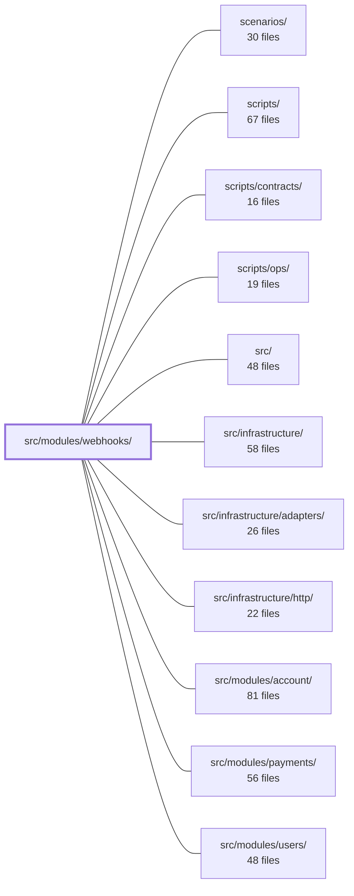

---
tags:
  - 2brain
  - 2brain/module
  - project/boilerplate-node-backend
type: module
module: src/modules/webhooks/
files: 49
updated: 2026-10-01T14:30:20.357428+00:00
---

# src/modules/webhooks/

## Purpose

The webhooks module lets external subscribers register an HTTPS endpoint to receive signed HTTP POST notifications about domain events (order placed, payment succeeded, etc.). It owns the full lifecycle: subscription CRUD with a versioned secret-ring for signing, event fan-out from the domain-event bus, queued delivery with retry/backoff, a delivery log with replay, and the public event catalogue. It is the only module that performs outbound HTTP calls to third-party endpoints on behalf of the platform.

## Key parts

- **Domain rules** (`domain/`) — Pure, I/O-free logic: retry-backoff schedule and auto-disable threshold (`backoff.ts`), and the exact-membership / `*`-wildcard event-type filter (`event-filter.ts`). Shared by the sweep worker, the attempt service, and unit tests.
- **Models & repository** (`model.ts`, `repository.ts`) — Mongoose schemas for `webhooksubscriptions` and `webhookdeliveries` (indexes, TTL, serialization transforms), plus the data-access layer with domain-specific queries (atomic lease claims, streak tracking, tenant-scoped lookups, due-row reads for the sweep).
- **Services** (`services/`) — The business-logic layer:
  - `publish.ts` subscribes to domain events and fans out one delivery row + queue message per matching subscription.
  - `attempt.ts` signs the payload, performs the SSRF-guarded POST, and records the outcome.
  - `sweep.ts` finds due/expired rows and enqueues them for retry.
  - `enqueue.ts` publishes a delivery-row `_id` to the RabbitMQ queue (Claim Check pattern).
  - `subscriptions.ts` / `deliveries.ts` — Tenant-scoped CRUD, secret-ring management, log listing, and replay.
  - `catalogue.ts` — Reads the local `asyncapi.yaml` to build the in-memory event list.
- **Secrets** (`secrets.ts`) — Single point for minting, rotating, and dropping signing secrets via versioned AES-256-GCM. Plaintext exists only in memory.
- **HTTP surface** (`routes.ts`, `controllers/`) — Express router under `/webhooks` exposing subscription CRUD, secret rotation/removal, delivery log, replay, and the public event catalogue.
- **Contracts** (`asyncapi.yaml`, `asyncapi.internal.yaml`, `openapi.yaml`) — Public AsyncAPI event catalogue (served at `GET /webhooks/events`), private internal queue contract, and the OpenAPI REST spec.
- **Module wiring** (`module.ts`, `config.ts`, `index.ts`) — `AppModule` manifest (event listeners, queue consumer, routes, permissions), env-derived config accessors, and the public barrel (the only import surface for sibling modules).
- **Cross-cutting** (`audit.ts`, `metrics.ts`, `emails.ts`) — Audit-action vocabulary, two fleet-wide Prometheus alerts, and the auto-disable notice email.
- **Tests** (`tests/`) — Contract tests against `openapi.yaml`, schema-drift guards, SSRF fuzz tests, and integration tests (delivery pipeline, subscription race guard, sweep handoff) run against a real database.

## How it connects

- **`src/` (kernel)** — `module.ts` registers the module's `AppModule` (event listeners, queue consumer, routes, permissions) with the application bootstrap. `audit.ts` augments the shared `AuditActionMap`. `publish.ts` consumes domain events dispatched by feature modules through the kernel event bus.
- **`src/modules/payments/`, `src/modules/account/`** — These are upstream event *producers*: they dispatch domain events (e.g., payment succeeded) that `publish.ts` listens to. The dependency is strictly one-directional via the kernel; webhooks never imports from them. `emails.ts` follows the same `EmailContent` convention established by `account/emails`.
- **`src/infrastructure/` & `src/infrastructure/adapters/`** — Provide the shared RabbitMQ queue adapter (used by `enqueue.ts` and the worker in `module.ts`), the SSRF-guarded `deliverWebhook` HTTP helper called by `attempt.ts`, the `metricsRegistry` for Prometheus metrics, and the email-sending transport.
- **`scripts/contracts/`** — Generates or validates the `openapi.yaml` / `asyncapi.yaml` contract files so that the served catalogue and the implementation stay in lockstep.
- **`scenarios/`** — End-to-end scenario tests that exercise webhook delivery through the full application stack (subscription → event → signed POST → subscriber endpoint).

## Where to start

1. **`module.ts`** — The single `AppModule` object shows every wire: which events are subscribed, which queue is consumed, which routes are mounted, and which permissions gate access. Reading it first gives you the full map of the module's surface area.
2. **`services/publish.ts`** → **`services/attempt.ts`** — These two files together tell the entire delivery story: a domain event arrives, gets matched against subscription filters, a row is written and enqueued; then the worker picks it up, signs the payload, fires the POST, and records the outcome. Tracing that path from event to HTTP response covers the module's core responsibility in one read.

## Connected modules

```mermaid
flowchart LR
    m_src_modules_webhooks["src/modules/webhooks/"]
    m_scenarios["scenarios/<br/>30 files"]
    m_scripts["scripts/<br/>67 files"]
    m_scripts_contracts["scripts/contracts/<br/>16 files"]
    m_scripts_ops["scripts/ops/<br/>19 files"]
    m_src["src/<br/>48 files"]
    m_src_infrastructure["src/infrastructure/<br/>58 files"]
    m_src_infrastructure_adapters["src/infrastructure/adapters/<br/>26 files"]
    m_src_infrastructure_http["src/infrastructure/http/<br/>22 files"]
    m_src_modules_account["src/modules/account/<br/>81 files"]
    m_src_modules_payments["src/modules/payments/<br/>56 files"]
    m_src_modules_users["src/modules/users/<br/>48 files"]
    m_src_modules_webhooks --- m_scenarios
    m_src_modules_webhooks --- m_scripts
    m_src_modules_webhooks --- m_scripts_contracts
    m_src_modules_webhooks --- m_scripts_ops
    m_src_modules_webhooks --- m_src
    m_src_modules_webhooks --- m_src_infrastructure
    m_src_modules_webhooks --- m_src_infrastructure_adapters
    m_src_modules_webhooks --- m_src_infrastructure_http
    m_src_modules_webhooks --- m_src_modules_account
    m_src_modules_webhooks --- m_src_modules_payments
    m_src_modules_webhooks --- m_src_modules_users
    style m_src_modules_webhooks stroke-width:3px
```

[[boilerplate-node-backend_ROOT|/ (repository root)]] · [[boilerplate-node-backend_scenarios|scenarios/]] · [[boilerplate-node-backend_scripts|scripts/]] · [[boilerplate-node-backend_scripts_contracts|scripts/contracts/]] · [[boilerplate-node-backend_scripts_ops|scripts/ops/]] · [[boilerplate-node-backend_src|src/]] · [[boilerplate-node-backend_src_infrastructure|src/infrastructure/]] · [[boilerplate-node-backend_src_infrastructure_adapters|src/infrastructure/adapters/]] · [[boilerplate-node-backend_src_infrastructure_http|src/infrastructure/http/]] · [[boilerplate-node-backend_src_modules_account|src/modules/account/]] · [[boilerplate-node-backend_src_modules_payments|src/modules/payments/]] · [[boilerplate-node-backend_src_modules_users|src/modules/users/]]

## Files
- `src/modules/webhooks/asyncapi.internal.yaml` — Declares the webhooks module's **private** RabbitMQ delivery-queue contract (channel, operations, and message shape) in AsyncAPI. It is a `backend`-only fragment that is merged into `./asyncapi.yaml` but deliberately excluded from any public bundle, so the paired frontend never sees the internal worker queue.
- `src/modules/webhooks/asyncapi.yaml` — The public AsyncAPI 3.0.0 event catalogue for the webhooks module. It is the single source of truth for which events a webhook subscriber can receive, what their payloads look like, and which Standard Webhooks headers accompany every delivery. Served verbatim by `GET /webhooks/events`, it guarantees the catalogue a subscriber reads can never drift from the events the module actually fires.
- `src/modules/webhooks/audit.ts` — Declares the webhook module's audit-action vocabulary and registers it into the app-wide `AuditActionMap` via TypeScript module augmentation. Every write against a subscription (not just destructive ones) is audited, because the subscription URL and signing secret are exactly the data a data-protection inquiry will later ask about.
- `src/modules/webhooks/config.ts` — Env-derived configuration accessors for the webhooks module. Every value is read at call time (not captured at import) so a deployment can change limits or keys without restarting the process. This mirrors the pattern set by `inventory/config.ts`.
- `src/modules/webhooks/controllers/create-subscription.ts` — HTTP controller that handles `POST /webhooks/subscriptions`. It parses and validates the request body against the generated Zod schema, delegates to the webhooks service to create the subscription, and returns the new subscription along with its one-time `secret`.
- `src/modules/webhooks/controllers/delete-subscription.ts` — Handles `DELETE /webhooks/subscriptions/:id`. It permanently removes a webhook subscription (delivery log is left in place). Hand-written rather than built on `createDeleteController`, which is designed for the soft/hard delete triplet and doesn't fit this single-permanent-delete use case.
- `src/modules/webhooks/controllers/list-deliveries.ts` — Controller for `GET /webhooks/deliveries`. It exposes a tenant's webhook delivery log (newest first) with optional filtering by subscription and/or status, delegating the actual query to the webhooks service.
- `src/modules/webhooks/controllers/list-events.ts` — Express controller that handles `GET /webhooks/events`. It returns the full list of webhook event catalogue entries (sourced from `../asyncapi.yaml` upstream) so that clients and API consumers can discover every event a subscription may filter on.
- `src/modules/webhooks/controllers/list-subscriptions.ts` — Controller for `GET /webhooks/subscriptions`. Returns the calling tenant's webhook subscriptions (newest first) with pagination, and guarantees no secret material is included in the response.
- `src/modules/webhooks/controllers/remove-subscription-secret.ts` — Controller handler for `DELETE /webhooks/subscriptions/:id/secrets/:secretId`. It drops a single secret (ring entry) from a webhook subscription as the second half of a key rotation, once all consumers have switched. It guards against removing the last secret in the ring (422) and unknown ids (404), then returns the updated subscription document.
- `src/modules/webhooks/controllers/replay-delivery.ts` — Controller for `POST /webhooks/deliveries/:id/replay`. It re-sends a previously recorded webhook delivery synchronously against the subscription's **current** URL and secret ring (not the original ones at delivery time). Documented as the single most-requested support action in `docs/modules/webhooks.md`.
- `src/modules/webhooks/controllers/rotate-subscription-secret.ts` — Controller for `POST /webhooks/subscriptions/:id/rotate-secret`. Validates the path ID, delegates to the webhooks service to mint a new ring secret, and returns the subscription along with the new plaintext secret (which is shown only once). The old secret remains active until explicitly deleted.
- `src/modules/webhooks/controllers/update-subscription.ts` — Defines the two HTTP handlers for `PUT /webhooks/subscriptions/:id` (full replace) and `PATCH /webhooks/subscriptions/:id` (partial merge). Both delegate to a single service method and are generated by the shared `createUpdateController` factory. Secret-ring mutations are explicitly excluded and handled by separate action routes.
- `src/modules/webhooks/domain/backoff.ts` — Pure, dependency-free retry-backoff rules for webhook deliveries. Defines the delay schedule, the max-attempt count, and the auto-disable threshold so that the sweep worker, the attempt service, and unit tests all share a single source of truth for "when is the next try" and "when do we give up on a subscription."
- `src/modules/webhooks/domain/event-filter.ts` — Pure, I/O-free decision logic that answers one question: _does a given event type belong to a subscription's `eventTypes` filter?_ Matching is exact-membership or the `'*'` wildcard—no glob or prefix matching. The module exists to keep the "should this subscriber receive this event?" check in the domain layer, independent of transport or storage concerns.
- `src/modules/webhooks/domain/index.ts` — Barrel file for the webhooks domain layer. It re-exports the pure rules (retry/backoff constants and helpers, event-filtering logic) from two sibling modules so that consumers can import from a single entry point without reaching into sub-paths.
- `src/modules/webhooks/emails.ts` — Resolves the email copy for every notification the webhooks module sends into finished, locale-ready strings. Follows the same convention as `@modules/account/emails`: language is an argument, the output is a complete `EmailContent` object, and the template only interpolates. Currently contains a single email — the auto-disable notice delivered to the subscription owner when repeated failures switch the endpoint off.
- `src/modules/webhooks/index.ts` — Public barrel for the webhooks module. It is the **only** import surface permitted to sibling modules (enforced per `docs/theory/strategic-ddd.md` §5). It re-exports the module's public API without executing any side-effects.
- `src/modules/webhooks/metrics.ts` — Defines the webhooks module's domain-level Prometheus metrics and registers them on the shared `metricsRegistry`. The metrics exist to power two fleet-wide alerts — `WebhookDeliveriesFailingEverywhere` and `WebhookRetriesStalled` — that detect our-side outages (all deliveries failing, retry sweep stalled) as distinct from a single subscriber's endpoint being down.
- `src/modules/webhooks/model.ts` — Defines the two Mongoose collections the webhooks module owns — `webhooksubscriptions` and `webhookdeliveries` — including their schemas, document interfaces, indexes, TTL, and the serialization transforms that shape API responses. Every other file in the webhooks module reads or writes through the models exported here.
- `src/modules/webhooks/module.ts` — The module manifest for the webhooks module. It wires the module into the application's domain-event bus, declares its queue consumer, routes, permissions, and runtime-config requirements — all in one `AppModule` object. This is the single file that makes "webhooks" a first-class module: deleting it removes the consumer, the routes, the permissions, and the event subscriptions without any cleanup needed elsewhere.
- `src/modules/webhooks/openapi.yaml` — OpenAPI 3.0.3 module contract for the webhooks subsystem. It defines the full REST surface for managing webhook subscriptions (CRUD), the secret-ring lifecycle (rotate / drop), and the delivery log, serving as the single source of truth for the API shape that both the server implementation and clients (SDKs, UIs) must conform to.
- `src/modules/webhooks/presenters.ts`
- `src/modules/webhooks/repository.ts` — Data-access layer for the two webhook collections (`webhooksubscriptions`, `webhookdeliveries`). Extends the generic `createRepository` factory with domain-specific queries that have no generic shape: atomic lease-based claims, streak-tracking outcome writes, tenant-scoped lookups, and the sweep's due-row read.
- `src/modules/webhooks/routes.ts` — Express router for the `/webhooks` admin surface. Wires subscription CRUD, delivery log inspection/replay, and the public event catalogue to their respective controllers, gated behind `webhooks.*` permission keys. Exists so that machine consumers (holding `sk_…` API keys) can manage their webhook subscriptions without a human session.
- `src/modules/webhooks/secrets.ts` — Implements the webhook secret-ring lifecycle (mint, rotate, drop) on top of versioned AES-256-GCM encryption. It is the single place where plaintext webhook signing secrets are created, encrypted for persistence, and decrypted for use during a delivery attempt. The plaintext is never stored in `WebhookSubscriptionDocument.secrets`; it exists in memory only long enough to be returned in an HTTP response or to sign an outgoing webhook.
- `src/modules/webhooks/services/attempt.ts` — Implements the single shared code path for "attempt one webhook delivery and record the outcome." It signs the payload, performs the SSRF-guarded POST via `deliverWebhook`, then writes the result (success, retryable failure, or exhaustion) onto the delivery row and the subscription's failure streak. Both the queued worker path (`processDeliveryJob` in `module.ts`) and the synchronous admin replay path (`deliveries.ts`) funnel through `attemptDelivery` so the two cannot drift on what recording an outcome means.
- `src/modules/webhooks/services/catalogue.ts` — Provides a static, in-memory list of the webhook events this module can emit, sourced directly from the local `asyncapi.yaml` fragment. By reading the same file that `asyncapi.public.yaml` is generated from, the public event endpoint and the module's actual capabilities cannot drift apart.
- `src/modules/webhooks/services/deliveries.ts` — Service layer for the webhook delivery log. Provides the two read-and-write operations surfaced by the API: `list` (paged, filterable log of deliveries) and `replay` (synchronous re-send of a single delivery against the subscription's *current* URL and secret ring).
- `src/modules/webhooks/services/enqueue.ts` — Single shared function that publishes a delivery-row's next attempt onto the worker queue. Both the fast path (`publish.ts`, right after a row is created) and the retry sweep (`sweep.ts`, for a row already due) call this same helper. It implements the **Claim Check** pattern: the message carries only the delivery row's `_id`, because the row itself is the source of truth for everything an attempt needs.
- `src/modules/webhooks/services/index.ts` — Barrel/index file for the webhooks module's service layer. It re-exports the public functions and types from the individual service files and assembles the admin-facing operations (`subscriptions.*`, `deliveries.*`) into a single `webhooksService` object, giving controllers one stable import point.
- `src/modules/webhooks/services/publish.ts` — Domain-event subscriber for the webhooks module. It registers one `onDomainEvent` listener per public-event target declared by any enabled module, projects each incoming domain-event payload into a public event, matches it against every enabled subscription's filter, and fans out one delivery row plus one queue message per match. It exists so that `webhooks` never imports from feature modules like `orders` or `payments`; the reverse edge is a domain event dispatched through the kernel.
- `src/modules/webhooks/services/subscriptions.ts` — Tenant-scoped CRUD and secret-ring management for webhook subscriptions. Handles listing, creation (with a race-safe per-tenant cap), state updates, secret rotation/removal, and deletion. The secret ring is the core abstraction: each subscription carries one or more signing secrets, and the plaintext is returned exactly once at creation or rotation time.
- `src/modules/webhooks/services/sweep.ts` — Implements the periodic retry sweep for webhook deliveries: it finds every delivery row that is due for another attempt (including stranded `in-flight` rows whose lease has expired) and enqueues them for processing. It deliberately publishes *without* claiming a lease, so overlapping or duplicate sweeps are safe—only the worker in `attempt.ts` claims and performs the actual HTTP call.
- `src/modules/webhooks/tests/contract/schema-drift.test.ts` — Guards against schema drift between `WebhookSubscription` and `WebhookSubscriptionCreated` in the module's local `openapi.yaml`. Because the two schemas must be written as flat, closed (`additionalProperties: false`) objects—rather than composed with `allOf`—their property lists are duplicated by hand with nothing else enforcing consistency. This test is that enforcement: it fails the moment a field is added, removed, or renamed in one schema but not the other.
- `src/modules/webhooks/tests/contract/webhooks.test.ts` — Contract tests that exercise every `/webhooks` admin endpoint (subscriptions CRUD, secret rotation, delivery log, replay, and the public event catalogue) and assert the responses conform to the bundled `openapi.yaml`. They exist to catch API-shape drift before it reaches consumers.
- `src/modules/webhooks/tests/fuzz/webhook-ssrf.fuzz.test.ts` — Fuzz-style test suite that pins down the SSRF-adjacent behaviour living *inside* `deliverWebhook` (timeout budget, redirect refusal, plain-HTTP exemption) as distinct from the generic SSRF guard's own hostile-URL table (covered by `ssrf-guard.fuzz.test.ts`). It exists so that deleting the `webhooks` module does not accidentally delete the guard's only tests, and so that delivery-path-specific security invariants have dedicated, deterministic coverage.
- `src/modules/webhooks/tests/integration/delivery.test.ts` — End-to-end integration test for the webhook delivery pipeline. It runs against a real database and a self-managed local HTTPS listener (`tests/support/https-test-server.ts`), covering the full lifecycle: signed delivery, 500-triggered retry scheduling, sustained-failure auto-disable, replay re-send, and delivery-log state at each step. It deliberately does **not** use the Compose `webhook-tester` service.
- `src/modules/webhooks/tests/integration/subscriptions.test.ts` — Integration test for `services/subscriptions.ts`'s `create` function, specifically targeting behaviors that only manifest against a **real database**: the subscription-cap race guard (two concurrent writers at cap = 1) and the persistence of `ownerUserId`. It exists because a mocked repository cannot reproduce two inserts landing at the same instant, which is the sole reason the post-insert rank re-check in `create` exists.
- `src/modules/webhooks/tests/integration/sweep.test.ts` — Integration test for `sweepDueWebhookDeliveries` run against a real database, with the queue adapter mocked. It verifies exactly what the sweep enqueues and which rows it skips — a code path that `delivery.test.ts` never exercises (that suite calls `processDeliveryJob` directly, bypassing the sweep-to-queue handoff).
- `src/modules/webhooks/tests/unit/backoff.test.ts` — Unit tests for the pure retry-backoff rules of the webhooks module: the per-tier delay schedule, the max-attempt invariant, next-attempt timestamp calculation, and the auto-disable threshold. It exists to lock down the "when do we retry / when do we give up" contract without any I/O or framework coupling.
- `src/modules/webhooks/tests/unit/event-filter.test.ts` — Unit tests for the `matchesEventFilter` function and the `ALL_EVENTS` constant, verifying that event-name filtering (exact match, wildcard, and empty-filter edge cases) behaves as specified in the webhook domain.
- `src/modules/webhooks/tests/unit/module.test.ts` — Unit tests for the webhooks module's boot-time config gate. Verifies two real rules: `NODE_WEBHOOK_SECRET_ENCRYPTION_KEY` must be present (and not a placeholder), and `NODE_WEBHOOK_DEMO_SINK_URL` must be unset in production. Exercises `assertRequiredConfig` against the actual webhooks manifest rather than a synthetic one.
- `src/modules/webhooks/tests/unit/schema-contract.test.ts` — Schema-contract tests for the two webhook Mongoose schemas (`webhookSubscriptionSchema`, `webhookDeliverySchema`). Instead of saving valid documents, these tests read the schema objects directly, so regressions in `required` flags, defaults, enum sets, index specs, index options (TTL, uniqueness), and sub-schema options are caught even when every integration fixture remains valid.
- `src/modules/webhooks/tests/unit/secrets.test.ts` — Unit tests for the secret-ring operations (`encryptRingSecret`, `decryptRingSecret`, `mintRingSecret`, `activeRingSecrets`, `removeRingSecret`) exposed by the webhooks secrets module. It verifies wiring and ring semantics (ordering, uniqueness, removal) without re-testing the underlying crypto, which lives in `versioned-secret.ts`.
- `src/modules/webhooks/tests/unit/webhook-signing.test.ts` — Unit tests for the webhook signing and verification path. The primary goal is interop conformance: one test asserts a byte-for-byte match against the published test vector from the [Standard Webhooks](https://github.com/standard-webhooks/standard-webhooks) reference implementation. The remaining tests cover round-trip sign→verify, edge cases (Buffer vs. string body, missing/prefixed secret, tolerance windows), and multi-secret ring rotation.
- `src/modules/webhooks/tests/verify-signature.fixture.ts` — A test-only Standard Webhooks signature verifier. It intentionally does **not** reuse the production signer's private helpers (`../transport/webhook-signing.ts`); instead it implements the spec independently so a passing round-trip test demonstrates interop with the Standard Webhooks format, not merely self-consistency. The codebase only _sends_ webhooks, so no production code depends on this module.
- `src/modules/webhooks/transport/webhook-delivery.ts` — Implements a single outbound webhook delivery attempt — SSRF-validate the target, sign the payload, POST it over HTTP/HTTPS, and enforce a hard timeout. It is the one function a worker calls to turn a queued delivery into an HTTP request and a recorded outcome. It never rejects; every failure path resolves to a `WebhookDeliveryResult` with `success: false`, so a caller can always write a delivery-log row without a `try/catch`.
- `src/modules/webhooks/transport/webhook-signing.ts` — Implements Standard Webhooks (v1) outbound signing using `node:crypto` directly, avoiding a third-party dependency for a ~15-line HMAC routine. It produces the three required delivery headers (`webhook-id`, `webhook-timestamp`, `webhook-signature`) and supports a multi-secret "ring" for zero-downtime key rotation. This file signs only; no production verification path lives here.

---
[[boilerplate-node-backend_INDEX|← boilerplate-node-backend index]]
