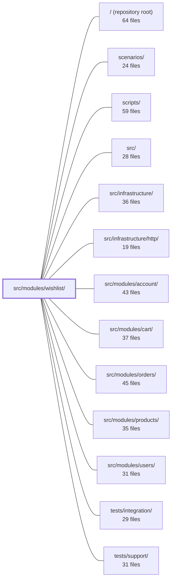

---
tags:
    - 2brain
    - 2brain/module
    - project/boilerplate-node-backend
type: module
module: src/modules/wishlist/
files: 21
updated: 2026-09-23T20:39:45.503709+00:00
---

# src/modules/wishlist/

## Purpose

The wishlist module lets an authenticated user bookmark a set of product IDs without committing to a quantity. It exposes four HTTP operations (list, add, remove, move-to-cart), enforces cross-module invariants (product visibility, cart capacity), and cleans up wishlist references when a product or user is hard-deleted. The module deliberately keeps the data shape minimal — one document per user, a flat array of `productId` refs — so that the moment quantity or order state matters, the item belongs in the cart instead.

## Key parts

- **Domain model & persistence** — `model.ts` defines the Mongoose schema (per-user document, `items: [{ productId }]`, no per-line `_id`, no quantity). `repository.ts` wraps the standard CRUD factory with the three domain writes the wishlist actually performs (add line, remove line, bulk cleanup) as single atomic operations.
- **Business logic** — `service.ts` is the sole entry point for controllers. It shapes repository output into the OpenAPI `WishlistResponse`, enforces cross-module rules (product visibility, cart capacity), and emits analytics events. Controllers never touch the repository directly.
- **HTTP layer** — `controllers/` holds four thin adapters (get, post, delete, move-to-cart) that validate input, extract the authenticated user, and delegate to `wishlistService`. `routes.ts` wires the Express table with authentication on every route.
- **Module wiring & contract** — `module.ts` registers routes, domain-event subscriptions (product/user deletion cleanup), a personal-data collector for exports, and locale files. `module.yaml` declares runtime dependencies for the resolver. `openapi.yaml` is the 3.0.3 spec both the implementation and any SDK generator consume.
- **Analytics** — `analytics.ts` freezes event-name strings and registers them into the app-wide `AnalyticsEventMap` via TS module augmentation, giving type-safe funnel tracking (save → exit-to-purchase).
- **Fixtures** — `factories.ts` builds ready-to-insert wishlist documents from minimal caller input, keyed by `userId` with no `_id` override.
- **Tests** — `tests/unit/` covers schema invariants, route table, factory output, and analytics strings. `tests/integration/service.test.ts` exercises the full service → repository → DB path including the "write cart before dropping line" ordering. `tests/contract/api.contract.test.ts` verifies every HTTP response conforms to the OpenAPI spec over a real call.

## How it connects

- **`src/modules/cart/`** — The `move-to-cart` operation must write the item into the cart _before_ removing it from the wishlist (ordering guarantee). The service also checks cart capacity before allowing the move.
- **`src/modules/products/`** — The service validates that a product is visible before it can be saved. A domain event subscription in `module.ts` removes the product ref from every wishlist when a product is hard-deleted.
- **`src/modules/users/`** — A domain-event subscription cleans up the user's wishlist document on hard-deletion. The personal-data collector registered in `module.ts` feeds the user's wishlist into account-export payloads.
- **`src/modules/account/`** — Consumes the wishlist's personal-data collector to include saved items in account data exports.
- **`src/infrastructure/http/`** — Provides the Express app, authentication middleware, and response-formatting helpers that the controllers and routes rely on.
- **`tests/support/` / `tests/integration/`** — Shared test harness (database setup, HTTP client) used by the wishlist's integration and contract suites.

## Where to start

1. **`model.ts`** — In ~50 lines you'll see the entire data shape (one document per user, a list of product refs, no quantity). Every other file in the module is built around this constraint.
2. **`service.ts`** — Read the four public methods (`wishlistGet`, `wishlistAdd`, `wishlistRemove`, `wishlistMoveToCart`) to see the business rules, the cross-module checks, and the response shape that the controllers and OpenAPI spec both target.

## Connected modules

[[boilerplate-node-backend_ROOT|/ (repository root)]] · [[boilerplate-node-backend_scenarios|scenarios/]] · [[boilerplate-node-backend_scripts|scripts/]] · [[boilerplate-node-backend_src|src/]] · [[boilerplate-node-backend_src_infrastructure|src/infrastructure/]] · [[boilerplate-node-backend_src_infrastructure_http|src/infrastructure/http/]] · [[boilerplate-node-backend_src_modules_account|src/modules/account/]] · [[boilerplate-node-backend_src_modules_cart|src/modules/cart/]] · [[boilerplate-node-backend_src_modules_orders|src/modules/orders/]] · [[boilerplate-node-backend_src_modules_products|src/modules/products/]] · [[boilerplate-node-backend_src_modules_users|src/modules/users/]] · [[boilerplate-node-backend_tests_integration|tests/integration/]] · [[boilerplate-node-backend_tests_support|tests/support/]]

## Files

- `src/modules/wishlist/analytics.ts` — Defines the wishlist module's analytics event names and registers them into the app-wide `AnalyticsEventMap` via TypeScript module augmentation. This gives the wishlist a type-safe set of funnel events (save → exit-to-purchase) without the consuming code needing to know the literal strings.
- `src/modules/wishlist/controllers/delete-wishlist-item.ts` — Thin HTTP adapter for the `DELETE /wishlist/:productId` endpoint. Validates the product ID, extracts the authenticated user, delegates to `wishlistService.wishlistRemove`, and maps the service result (or rejection) onto the HTTP response. Exists to keep route wiring in `routes.ts` declarative and to isolate Express-specific concerns from the service layer.
- `src/modules/wishlist/controllers/get-wishlist.ts` — Thin HTTP adapter for the `GET /wishlist` endpoint. It extracts the authenticated user's ID from the request, delegates to `wishlistService.wishlistGet`, and formats the result as a standard success/error response. Contains no business logic.
- `src/modules/wishlist/controllers/post-move-to-cart.ts` — Thin HTTP adapter for the `POST /wishlist/:productId/move-to-cart` endpoint. Extracts the caller's identity and product ID from the request, validates the ID, delegates to `wishlistService.wishlistMoveToCart`, and formats the HTTP response. It contains no business logic.
- `src/modules/wishlist/controllers/post-wishlist.ts` — Thin HTTP adapter for the `POST /wishlist` endpoint. It validates the incoming request body, extracts the authenticated user and product identifiers, delegates to `wishlistService.wishlistAdd`, and maps the result to an HTTP response. Exists so the service layer stays transport-agnostic.
- `src/modules/wishlist/factories.ts` — Builds wishlist fixtures (ready for `wishlistRepository.create`) from minimal caller input. Follows the same owner-addressed pattern as cart factories: the document is keyed by `userId` and no wishlist `_id` is generated or transmitted, so no `_id` override is accepted.
- `src/modules/wishlist/index.ts` — Barrel (public entry point) for the `wishlist` module. It re-exports the module's API so that sibling modules import from this single file rather than reaching into internal paths. Enforces the "single surface" rule described in `docs/theory/strategic-ddd.md` §5.
- `src/modules/wishlist/model.ts` — Defines the Mongoose schema, document interfaces, and model for the wishlist collection. A wishlist is a per-user document (`userId` → `{ items: [{ productId }] }`) with no quantity — it exists solely to track "which products does this user want?" so that the moment an amount matters the item moves to the cart. All persistence shape (indexes, serialization, uniqueness guarantees) is established here.
- `src/modules/wishlist/module.ts` — Module manifest for the wishlist feature. It wires the wishlist's HTTP routes, domain-event subscriptions (cleanup on product/user deletion), a personal-data collector for account exports, and locale files into the application's module registry. The wishlist itself is a single document per user holding product references; this file contains no business logic beyond that wiring.
- `src/modules/wishlist/module.yaml` — Module manifest for the **wishlist** subdomain (`supporting`). Declares the module's runtime dependencies so the build system and runtime resolver know which other modules must be initialised before wishlist code executes.
- `src/modules/wishlist/openapi.yaml` — OpenAPI 3.0.3 contract (v2.0.0) that defines the wishlist module's HTTP API surface: four operations over `/wishlist` for listing, saving, removing, and moving-to-cart a user's saved product ids. It serves as the machine-readable and human-readable specification that both the implementation and any client SDK generator consume.
- `src/modules/wishlist/probes.ts` — Exports a fixed set of wishlist HTTP probes — requests that exercise edge cases the OpenAPI contract structurally cannot describe (e.g. "save a product that will 404 on read"). The probes exist so automated collections can hit those gaps; they are intentionally kept separate from the contract bundle.
- `src/modules/wishlist/repository.ts` — Repository layer for the wishlist module. Exposes the standard CRUD surface (inherited from the shared factory) plus the three domain writes a wishlist actually takes — add a line, remove a line, and the two cleanup writes owed to product and user deletion. All writes are single atomic Mongoose operations; there is no retry loop.
- `src/modules/wishlist/routes.ts` — Defines the Express route table for the wishlist module. It wires HTTP verbs and paths to the wishlist controllers, enforces authentication on every route, and handles the one ordering constraint that would otherwise cause silent mis-routing.
- `src/modules/wishlist/service.ts` — Business-logic layer for all wishlist operations. It translates repository reads/writes into the OpenAPI-declared `WishlistResponse` shape (`{ items: [{ productId }] }`), enforces cross-module rules (product visibility, cart capacity), and emits analytics events. Controllers never call the repository directly; they go through the `wishlistService` barrel export defined here.
- `src/modules/wishlist/tests/contract/api.contract.test.ts` — Contract tests for every HTTP branch of the `/wishlist` API (GET, POST, DELETE, POST move-to-cart). Each assertion confirms that a declared response shape is actually reachable over a real HTTP call and conforms to the OpenAPI spec. Behavioural logic is intentionally left to the unit suite; this file only proves "the contract is held."
- `src/modules/wishlist/tests/integration/service.test.ts` — Integration tests for the wishlist service, exercising the full request path (service → repository → DB) against a real test database. Covers the four core operations (add, remove, move-to-cart), their error contracts, the "write cart before dropping line" ordering guarantee, and the event-driven cleanup subscriptions that fire on product/user hard-deletion.
- `src/modules/wishlist/tests/unit/analytics.test.ts` — Guarantees that the wishlist module's analytics event strings are frozen to the exact values Umami dashboards key on, and that those events are properly registered in the app-wide `AnalyticsEventMap` union. It exists to make a silent string rename (or a dropped module augmentation) a compile/test failure rather than a dashboard gap that goes unnoticed.
- `src/modules/wishlist/tests/unit/factories.test.ts` — Unit tests for the `makeWishlist` factory. Verifies that the factory correctly converts string IDs into Mongoose `ObjectId` instances, that wishlist line items contain **only** a `productId` (no quantity), and that an absent `items` field is kept distinct from an explicitly empty one so schema defaults apply.
- `src/modules/wishlist/tests/unit/routes.test.ts` — Unit test suite that pins down the wishlist route table: exact endpoint signatures, declaration order, authentication requirements, and the absence of admin guards. It exists to catch regressions where a route is added, reordered, or mis-guarded without updating the documented contract.
- `src/modules/wishlist/tests/unit/schema-contract.test.ts` — Contract test that pins the structural invariants of `wishlistSchema` — the index, defaults, types, refs, and sub-schema shape that make the "one wishlist per user" and "no per-line identity" design enforceable at the database level. It asserts _what the schema declares_, not _what operations do_, so a silent schema change breaks the build before it breaks a query.

---

[[boilerplate-node-backend_INDEX|← boilerplate-node-backend index]]
