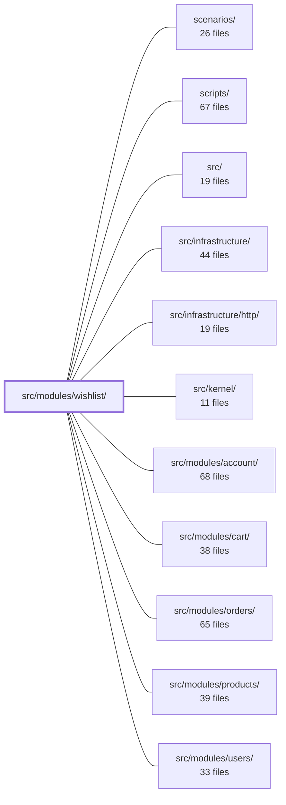

---
tags:
  - 2brain
  - 2brain/module
  - project/boilerplate-node-backend
type: module
module: src/modules/wishlist/
files: 22
updated: 2026-09-27T16:23:23.917273+00:00
---

# src/modules/wishlist/

## Purpose

The wishlist module tracks **which** products a user has bookmarked, with no quantity or order semantics. It is a per-user document (`userId → items: [{ productId }]`) whose sole job is to remember intent; the moment an amount matters, the item is promoted into the cart. It exposes four HTTP operations (list, save, remove, move-to-cart) and keeps its persistence, service, and transport layers strictly separated.

## Key parts

- **Data & persistence** — `model.ts` defines the Mongoose schema and the "one document per user, no per-line identity" invariant. `repository.ts` extends the shared `createRepository` factory with the four writes and one targeted read the wishlist actually needs. `factories.ts` builds test/seed fixtures from minimal input.
- **Service & HTTP surface** — `service.ts` translates high-level operations into repository calls and cross-module interactions, shaping every result into the `WishlistView` envelope. `routes.ts` wires verbs to controllers with auth on every route. `controllers/` (four thin adapters) extract identity and IDs from the request and delegate to the service; none contain business logic.
- **Module wiring** — `module.ts` registers routes, a `personalData` erasure hook, and a domain-event subscription (product deletion → purge from all wishlists). `module.yaml` declares runtime dependencies. `index.ts` is the barrel that enforces the single-surface import rule. `analytics.ts` registers the module's funnel event names into the app-wide `AnalyticsEventMap` for type-safe tracking.
- **Specification & probes** — `openapi.yaml` is the machine-readable API contract (v2.0.0). `probes.ts` holds edge-case HTTP requests the contract structurally cannot express (e.g., saving a product that 404s on read).
- **Tests** — `tests/unit/` pins schema shape, route table, factory output, and analytics strings. `tests/integration/` exercises the full service→repository→DB path and concurrent-write races (line duplication, upsert collisions). `tests/contract/` verifies every documented response is reachable over the wire.

## How it connects

- **cart** — the `move-to-cart` operation delegates to the cart module to create the line item *before* removing it from the wishlist, guaranteeing no product is lost if the cart write fails.
- **products** — the module subscribes to a "product deleted" domain event so that every wishlist referencing that product is cleaned up without a manual sweep.
- **users / account** — a `personalData` hook registered in `module.ts` ensures the wishlist document is destroyed when a user's account is erased, satisfying data-erasure obligations.
- **src/kernel** — `module.ts` plugs into the kernel's module lifecycle (initialisation order, route mounting, event-bus subscription).
- **src/infrastructure/http** — Express-specific concerns (routing, middleware, response formatting) live here; the wishlist module consumes it through `routes.ts` and the controllers.
- **src/infrastructure** — `repository.ts` builds on the generic `createRepository` factory provided by the infrastructure layer.

## Where to start

1. **`model.ts`** — reading the schema first makes the "per-user document, no quantity, no per-line identity" design obvious, and every other file in the module is shaped around it.
2. **`service.ts`** — once you know the data shape, the service file shows the four real operations, the `move-to-cart` ordering guarantee, and the one cross-module call (cart), giving you the module's full behavioural surface in a single read.

## Connected modules

```mermaid
flowchart LR
    m_src_modules_wishlist["src/modules/wishlist/"]
    m_scenarios["scenarios/<br/>26 files"]
    m_scripts["scripts/<br/>67 files"]
    m_src["src/<br/>19 files"]
    m_src_infrastructure["src/infrastructure/<br/>44 files"]
    m_src_infrastructure_http["src/infrastructure/http/<br/>19 files"]
    m_src_kernel["src/kernel/<br/>11 files"]
    m_src_modules_account["src/modules/account/<br/>68 files"]
    m_src_modules_cart["src/modules/cart/<br/>38 files"]
    m_src_modules_orders["src/modules/orders/<br/>65 files"]
    m_src_modules_products["src/modules/products/<br/>39 files"]
    m_src_modules_users["src/modules/users/<br/>33 files"]
    m_src_modules_wishlist --- m_scenarios
    m_src_modules_wishlist --- m_scripts
    m_src_modules_wishlist --- m_src
    m_src_modules_wishlist --- m_src_infrastructure
    m_src_modules_wishlist --- m_src_infrastructure_http
    m_src_modules_wishlist --- m_src_kernel
    m_src_modules_wishlist --- m_src_modules_account
    m_src_modules_wishlist --- m_src_modules_cart
    m_src_modules_wishlist --- m_src_modules_orders
    m_src_modules_wishlist --- m_src_modules_products
    m_src_modules_wishlist --- m_src_modules_users
    style m_src_modules_wishlist stroke-width:3px
```

[[boilerplate-node-backend_ROOT|/ (repository root)]] · [[boilerplate-node-backend_scenarios|scenarios/]] · [[boilerplate-node-backend_scripts|scripts/]] · [[boilerplate-node-backend_src|src/]] · [[boilerplate-node-backend_src_infrastructure|src/infrastructure/]] · [[boilerplate-node-backend_src_infrastructure_http|src/infrastructure/http/]] · [[boilerplate-node-backend_src_kernel|src/kernel/]] · [[boilerplate-node-backend_src_modules_account|src/modules/account/]] · [[boilerplate-node-backend_src_modules_cart|src/modules/cart/]] · [[boilerplate-node-backend_src_modules_orders|src/modules/orders/]] · [[boilerplate-node-backend_src_modules_products|src/modules/products/]] · [[boilerplate-node-backend_src_modules_users|src/modules/users/]]

## Files
- `src/modules/wishlist/analytics.ts` — Defines the wishlist module's analytics event names and registers them into the app-wide `AnalyticsEventMap` via TypeScript module augmentation. This gives the wishlist a type-safe set of funnel events (save → exit-to-purchase) without the consuming code needing to know the literal strings.
- `src/modules/wishlist/controllers/delete-wishlist-item.ts` — Thin HTTP adapter for the `DELETE /wishlist/:productId` endpoint. Validates the product ID, extracts the authenticated user, delegates to `wishlistService.wishlistRemove`, and maps the service result (or rejection) onto the HTTP response. Exists to keep route wiring in `routes.ts` declarative and to isolate Express-specific concerns from the service layer.
- `src/modules/wishlist/controllers/get-wishlist.ts` — Thin HTTP adapter for the `GET /wishlist` endpoint. It extracts the authenticated user's ID from the request, delegates to `wishlistService.wishlistGet`, and formats the result as a standard success/error response. Contains no business logic.
- `src/modules/wishlist/controllers/post-move-to-cart.ts` — Thin HTTP adapter for the `POST /wishlist/:productId/move-to-cart` endpoint. Extracts the caller's identity and product ID from the request, validates the ID, delegates to `wishlistService.wishlistMoveToCart`, and formats the HTTP response. It contains no business logic.
- `src/modules/wishlist/controllers/post-wishlist.ts` — Thin HTTP adapter for the `POST /wishlist` endpoint. It validates the incoming request body, extracts the authenticated user and product identifiers, delegates to `wishlistService.wishlistAdd`, and maps the result to an HTTP response. Exists so the service layer stays transport-agnostic.
- `src/modules/wishlist/factories.ts` — Builds wishlist fixtures (ready for `wishlistRepository.create`) from minimal caller input. Follows the same owner-addressed pattern as cart factories: the document is keyed by `userId` and no wishlist `_id` is generated or transmitted, so no `_id` override is accepted.
- `src/modules/wishlist/index.ts` — Barrel (public entry point) for the `wishlist` module. It re-exports the module's API so that sibling modules import from this single file rather than reaching into internal paths. Enforces the "single surface" rule described in `docs/theory/strategic-ddd.md` §5.
- `src/modules/wishlist/model.ts` — Defines the Mongoose schema, document interfaces, and model for the wishlist collection. A wishlist is a per-user document (`userId` → `{ items: [{ productId }] }`) with no quantity — it exists solely to track "which products does this user want?" so that the moment an amount matters the item moves to the cart. All persistence shape (indexes, serialization, uniqueness guarantees) is established here.
- `src/modules/wishlist/module.ts` — Module manifest and wiring for the wishlist feature. Registers routes, a `personalData` hook for account erasure, and a domain-event subscription so that deleted products are cleaned out of every wishlist. It is deliberately thin — no domain logic lives here, only the glue that connects the wishlist service to the kernel lifecycle.
- `src/modules/wishlist/module.yaml` — Module manifest for the **wishlist** subdomain (`supporting`). Declares the module's runtime dependencies so the build system and runtime resolver know which other modules must be initialised before wishlist code executes.
- `src/modules/wishlist/openapi.yaml` — OpenAPI 3.0.3 contract (v2.0.0) that defines the wishlist module's HTTP API surface: four operations over `/wishlist` for listing, saving, removing, and moving-to-cart a user's saved product ids. It serves as the machine-readable and human-readable specification that both the implementation and any client SDK generator consume.
- `src/modules/wishlist/probes.ts` — Exports a fixed set of wishlist HTTP probes — requests that exercise edge cases the OpenAPI contract structurally cannot describe (e.g. "save a product that will 404 on read"). The probes exist so automated collections can hit those gaps; they are intentionally kept separate from the contract bundle.
- `src/modules/wishlist/repository.ts` — Domain-specific persistence layer for the Wishlist module. It extends the generic `createRepository` factory with the four writes a wishlist actually takes (add line, remove line, delete-by-user, remove-product-from-all) and a targeted read (`findByUserId`). Every document is addressed by `userId` (the unique index key), so no caller ever reads before writing.
- `src/modules/wishlist/routes.ts` — Defines the Express route table for the wishlist module. It wires HTTP verbs and paths to the wishlist controllers, enforces authentication on every route, and handles the one ordering constraint that would otherwise cause silent mis-routing.
- `src/modules/wishlist/service.ts` — Service layer for the wishlist module. Translates high-level wishlist operations (get, add, remove, move-to-cart, bulk delete) into repository calls and cross-module interactions, and shapes every result into the `WishlistView` envelope (`{ items: [{ productId }] }`) that the OpenAPI contract requires.
- `src/modules/wishlist/tests/contract/api.contract.test.ts` — Contract tests for the `/wishlist` HTTP surface. They assert that every declared response shape (success and each error branch) is actually reachable over the wire, so the API cannot silently drop a documented response. Behavioural logic lives in the unit suite; this file only verifies the wire contract.
- `src/modules/wishlist/tests/integration/service.test.ts` — Integration tests for the wishlist service, exercising the full request path (service → repository → DB) against a real test database. Covers the four core operations (add, remove, move-to-cart), their error contracts, the "write cart before dropping line" ordering guarantee, and the event-driven cleanup subscriptions that fire on product/user hard-deletion.
- `src/modules/wishlist/tests/integration/wishlist-races.test.ts` — Integration tests for concurrent (raced) writes against the wishlist endpoints. They pin down two specific race classes — line duplication (RW1) and duplicate-document creation via `upsert` (RW2) — plus a mixed save-and-move-to-cart race. The file exists to enforce the invariants that `wishlist/repository.ts` claims from its write shape (`$addToSet`, exact-equality filter) rather than from application-level retries.
- `src/modules/wishlist/tests/unit/analytics.test.ts` — Guarantees that the wishlist module's analytics event strings are frozen to the exact values Umami dashboards key on, and that those events are properly registered in the app-wide `AnalyticsEventMap` union. It exists to make a silent string rename (or a dropped module augmentation) a compile/test failure rather than a dashboard gap that goes unnoticed.
- `src/modules/wishlist/tests/unit/factories.test.ts` — Unit tests for the `makeWishlist` factory. Verifies that the factory correctly converts string IDs into Mongoose `ObjectId` instances, that wishlist line items contain **only** a `productId` (no quantity), and that an absent `items` field is kept distinct from an explicitly empty one so schema defaults apply.
- `src/modules/wishlist/tests/unit/routes.test.ts` — Unit test suite that pins down the wishlist route table: exact endpoint signatures, declaration order, authentication requirements, and the absence of admin guards. It exists to catch regressions where a route is added, reordered, or mis-guarded without updating the documented contract.
- `src/modules/wishlist/tests/unit/schema-contract.test.ts` — Contract test that pins the structural invariants of `wishlistSchema` — the index, defaults, types, refs, and sub-schema shape that make the "one wishlist per user" and "no per-line identity" design enforceable at the database level. It asserts _what the schema declares_, not _what operations do_, so a silent schema change breaks the build before it breaks a query.

---
[[boilerplate-node-backend_INDEX|← boilerplate-node-backend index]]
