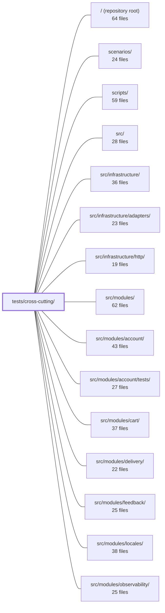

---
tags:
  - 2brain
  - 2brain/module
  - project/boilerplate-node-backend
type: module
module: tests/cross-cutting/
files: 43
updated: 2026-09-23T20:40:05.696902+00:00
---

# tests/cross-cutting/

## Purpose

This module is a collection of cross-cutting invariant tests that validate properties no single per-module or per-file test can enforce on its own. It sweeps across all `src/modules/*` directories and shared infrastructure to catch global uniqueness, naming conventions, structural consistency, and bidirectional agreement between "source of truth" locations (e.g. OpenAPI fragments and infrastructure constants, permission registries and module manifests, crontab and `package.json` scripts). It acts as the safety net for the module-split architecture: because the codebase deliberately avoids cross-module imports, these tests are the only place where the whole is checked against itself.

## Key parts

- **Contract & schema integrity** — `contract-aliases`, `contract-bundles`, `contract-error-declarations`, `contract-scalars`, `contract-search-parity` validate the OpenAPI/AsyncAPI bundles, alias equivalence, 422 completeness, scalar bound lock-step, and query-vs-body parity. `process-snapshot` pins the REST/SSE memory-and-uptime schema in one place.
- **Auth & authorization** — `api-key-authentication`, `authenticated-controllers`, `step-up-auth-routes` prove the runtime auth chain and step-up guards; `authorization-conformance` and `authorization-keys` validate the shared CASL evaluator and the permission-key registry it reads.
- **Audit, analytics & side-effects** — `audit-actions-registered`, `audit-actions`, `analytics-events` enforce global uniqueness and well-formedness of event/action vocabularies. `side-effects-have-one-layer` ensures the four domain side-effects are only emitted from the service layer.
- **Module registration & structure** — `modules-are-enabled`, `module-descriptors`, `module-permissions`, `module-subscriptions`, `probes-are-wired`, `frontend-pairing` guard the bidirectional link between directories on disk, the `enabledModules` list, `module.yaml` descriptors, the permission registry, and the paired frontend repo.
- **Search, pagination & serialization** — `search-regex`, `search.property`, `search-pagination`, `paginated-sort-is-total` protect the user-input → `$regex` pipeline and pagination contract. `serialize.property` locks in `applySerialization` invariants for arbitrary document shapes.
- **Locales & email** — `locale-namespaces`, `locale-parity`, `scenario-fixtures` enforce key uniqueness, cross-locale completeness, and fixture referential integrity. `mail-copy` and `outbox-names` verify EJS template variables and outbox naming conventions.
- **Infra, CI & production hardening** — `ci-covers-the-gate`, `production-topology`, `scheduled-jobs`, `coverage-thresholds`, `rate-limit-budgets`, `raw-body-paths` pin the local-gate ↔ CI parity, Dockerfile/compose security properties, crontab ↔ script sync, Jest coverage globs, rate-limit field uniqueness, and raw-body path correctness.
- **Money & metrics** — `money-reconciliation.property` exercises `orderTotal` + `priceShipping` composition; `metric-names` validates Prometheus naming by reading source text.

## How it connects

- **`src/modules/` (all sub-modules)** — nearly every test in this directory imports, reads, or regex-scans files inside one or more `src/modules/<name>/` directories (`analytics.ts`, `audit.ts`, `locale.yaml`, `module.yaml`, `emails.ts`, `metrics.ts`, `probes.ts`, controller and service source). The tests do not replace per-module unit tests; they add the *global* invariants that require seeing two or more modules at once.
- **`src/infrastructure/`** — `contract-scalars` reads `infrastructure/http/schemas.ts`; `search-pagination` and `search-regex` target `infrastructure` helpers; `rate-limit-budgets` and `process-snapshot` check infrastructure-owned budgets and schemas.
- **`src/kernel/permissions.ts`** (via `src/`) — `authorization-keys` and `module-permissions` directly import the registry and preset-role exports to validate internal consistency.
- **`tests/support/`** — shared test fixtures and helpers (e.g. the YAML conformance case file under `shared/`) are consumed by `authorization-conformance` and `scenario-fixtures`.
- **`scenarios/`** — `scenario-fixtures` operates on locale scenario fixture arrays that live in or are generated by this area.
- **Root (`jest.config.js`, `.github/workflows/`, `docker-compose.production.yml`, `package.json`)** — `coverage-thresholds`, `ci-covers-the-gate`, `production-topology`, and `scheduled-jobs` read these files directly from disk to enforce their respective invariants.
- **`tests/unit/` and `tests/integration/`** — sibling suites that cover per-module behaviour; this module complements them by checking properties that only emerge when all modules are considered together (uniqueness, parity, bidirectional registration).

## Where to start

1. **`tests/cross-cutting/modules-are-enabled.test.ts`** — the shortest test in the directory; it reads `enabledModules` and the `src/modules/` directory listing and asserts they match. Reading it shows the fundamental pattern every other test follows: a structural, cross-module check that produces a fast, targeted failure.
2. **`tests/cross-cutting/authorization-conformance.test.ts`** — a slightly larger example that demonstrates how a shared YAML case file bridges two backends and how "floor" assertions prevent an empty suite from passing silently. It also shows how the module connects to `tests/support/` and to the shared data in `src/`.

## Connected modules

[[boilerplate-node-backend_ROOT|/ (repository root)]] · [[boilerplate-node-backend_scenarios|scenarios/]] · [[boilerplate-node-backend_scripts|scripts/]] · [[boilerplate-node-backend_src|src/]] · [[boilerplate-node-backend_src_infrastructure|src/infrastructure/]] · [[boilerplate-node-backend_src_infrastructure_adapters|src/infrastructure/adapters/]] · [[boilerplate-node-backend_src_infrastructure_http|src/infrastructure/http/]] · [[boilerplate-node-backend_src_modules|src/modules/]] · [[boilerplate-node-backend_src_modules_account|src/modules/account/]] · [[boilerplate-node-backend_src_modules_account_tests|src/modules/account/tests/]] · [[boilerplate-node-backend_src_modules_cart|src/modules/cart/]] · [[boilerplate-node-backend_src_modules_delivery|src/modules/delivery/]] · [[boilerplate-node-backend_src_modules_feedback|src/modules/feedback/]] · [[boilerplate-node-backend_src_modules_locales|src/modules/locales/]] · [[boilerplate-node-backend_src_modules_observability|src/modules/observability/]] · … and 10 more

## Files
- `tests/cross-cutting/analytics-events.test.ts` — Cross-cutting guard that sweeps every `src/modules/*/analytics.ts` file to ensure the analytics event vocabulary remains globally unique and well-formed. Because all names flow into a single Umami website keyed by string, a name claimed by two modules produces indistinguishable rows; the paired frontend emits no custom events, so this test is the sole enforcement mechanism.
- `tests/cross-cutting/api-key-authentication.test.ts` — Proves the middle link in the credential-authentication chain: that a real `sk_...` secret, sent as a Bearer token, actually clears the identity guard on the mounted Express chain and reaches (or is refused by) the permission check on the other side. It also enforces, at the source level, that no module accidentally mounts both identity guards (`isAuth` and `isAuthOrCredential`), which would make credential-acceptance a per-route accident rather than a module-level property.
- `tests/cross-cutting/audit-actions-registered.test.ts` — Verifies at compile time that every auditing module's `declare module` augmentation actually contributes its actions to the app-wide `AuditAction` union. It imports one representative action per module and asserts each equals its expected wire-value string, so a missing or broken augmentation is caught as a type error rather than surfacing later at `emitAuditEvent` call sites.
- `tests/cross-cutting/audit-actions.test.ts` — A cross-cutting integration test that validates the audit-action vocabulary across **all** modules in a single sweep. It enforces four invariants that no per-module unit test can catch on its own: global uniqueness of action strings, the dotted naming convention, reachability of every module's `audit.ts`, and an explicit accounting of modules that intentionally emit no actions. It does this structurally (dynamic import + shape inspection) rather than by hard-coding a list of action names, deliberately avoiding the cross-module coupling the module split was designed to remove.
- `tests/cross-cutting/authenticated-controllers.test.ts` — Cross-cutting integration test that catches a class of runtime `TypeError` before it ships: a controller that non-null-asserts `request.authContext` (i.e. assumes the caller is a resolved human session) while its route is not actually guarded by `isAuth`. It also enforces that every `requirePermission` key mounted behind the dual `isAuthOrCredential` guard uses the tenant-scoped `.any.` breadth, not `.self.`.
- `tests/cross-cutting/authorization-conformance.test.ts` — Cross-cutting conformance test that validates the TypeScript/CASL evaluator against a shared YAML case file (`shared/authorization-conformance.yaml`) committed byte-identical in both backends. It ensures the TS side answers every allow/deny case the same way the PHP/Laravel side (Gate + Policies) does, and includes "floor" assertions so a missing or empty case file cannot masquerade as a passing suite.
- `tests/cross-cutting/authorization-keys.test.ts` — Validates the internal consistency of the permission-key registry and preset roles exported by `src/kernel/permissions.ts`. It ensures the data is well-formed (unique, correctly scoped, properly named) and that no preset role references a key no module declares. It complements the neighboring conformance suite (which proves two backends agree) by proving the shared data they both read is not nonsense in the first place.
- `tests/cross-cutting/ci-covers-the-gate.test.ts` — Cross-cutting guard that asserts every check in the `npm run complete` chain (the pre-commit local gate) has a corresponding job in `.github/workflows/`. It exists to close the bypass path where `--no-verify`, a missing Husky hook, or a fork PR lets a contributor skip local checks while CI stays green.
- `tests/cross-cutting/contract-aliases.test.ts` — Validates the `x-alias-of` OpenAPI extension in `openapi.yaml`, ensuring that every alias operation is a true interchangeable spelling of its canonical counterpart. It exists because the contract deliberately ships multiple operations for the same intent (e.g. `DELETE /users` vs `DELETE /users/{id}` vs `DELETE /users/{id}/hard`), and without enforcement the "switchable" claim would silently rot as responses drift apart.
- `tests/cross-cutting/contract-bundles.test.ts` — Cross-cutting test suite that validates the structural integrity of every contract bundle (OpenAPI, AsyncAPI, and API client collections) from the perspective of the *sources* and *registry* rather than a single module. It asserts invariants that no individual source file can check on its own: fragment completeness, shared-file alignment, path ownership, channel/message/operation reachability, and server-channel binding. It exists as the single place where the whole-bundle shape is pinned without duplicating the byte-for-byte regeneration check that `check:contracts-bundle --check` already performs in CI.
- `tests/cross-cutting/contract-error-declarations.test.ts` — Ensures every OpenAPI operation whose route takes an id parameter declares a `422` response. The `databaseErrorInterpreter` returns 422 for any malformed id on any such route, so a fragment that omits it describes an API that cannot fail the way it actually does. The test guards against the recurring copy-paste gap where a new endpoint inherits an incomplete responses block from a neighbor.
- `tests/cross-cutting/contract-scalars.test.ts` — Guarantees that the scalar bounds declared in `infrastructure/http/schemas.ts` (page-size max, page max, hard-delete default) stay in lock-step with the per-operation constants orval emits from `openapi.yaml`. Because orval duplicates each shared component into one constant per endpoint, infrastructure cannot import a single "the" constant without leaking a domain name into the shared layer; this test substitutes for the compile-time check an import would otherwise provide.
- `tests/cross-cutting/contract-search-parity.test.ts` — Verifies that the two spellings of a search endpoint (e.g. `GET /products?text=x` and `POST /products/search {text}`) declare **identical validation constraints** on every shared filter. It exists because the two spellings live in different parts of the OpenAPI document (query parameters vs. request-body schema), so a constraint can be added to one without touching the other — a structural drift the sibling test `contract-aliases.test.ts` (response parity) does not catch.
- `tests/cross-cutting/coverage-thresholds.test.ts` — Guards against the silent failure mode where a `coverageThreshold` glob key in `jest.config.js` matches zero files after a directory rename. Jest's CoverageReporter silently skips such keys, leaving a run green while the intended coverage gate no longer applies. This test expands each key with the same `glob` instance the reporter uses and fails the suite if any key resolves to nothing (or only to files excluded from measurement).
- `tests/cross-cutting/credential-fields.test.ts` — A cross-cutting invariant test that asserts no credential-shaped key (matching `password|token|secret|salt|apikey|api_key|credential|privatekey|otp`) appears anywhere in the `toJSON()` output of any Mongoose model registered under `src/modules/`. It exists because the only thing preventing a hash or live token from reaching a response body is a manual `omit` entry; this test makes that a checked property rather than a remembered one.
- `tests/cross-cutting/frontend-pairing.test.ts` — Cross-repo pairing test that verifies the hand-written mapping between every enabled backend module and its counterpart module(s) in the `boilerplate-vue-frontend` repository. It exists because the name correspondence is asymmetric (routeless modules, one-screen-multiple-endpoints, frontend-only modules), so a simple name-matcher would produce wrong answers. The test guards both directions: local completeness of the map, and—when the sibling checkout is present—that every claimed frontend name actually exists and every frontend module is accounted for.
- `tests/cross-cutting/locale-namespaces.test.ts` — Validates that locale keys remain namespace-unique across the codebase. The deep last-writer-wins merge that `infrastructure` performs at boot silently drops or shadows strings on collision, producing wrong copy with no error. This test makes those two failure modes (module shadowing a shared key, two modules claiming the same key) plus a structural invariant (each module stays under its own top-level key) explicit and fast-failing.
- `tests/cross-cutting/locale-parity.test.ts` — Cross-cutting parity test that asserts every supported locale declares **exactly the same set of keys** across the merged dictionaries (shared file + all per-module locale files). It catches the silent failure mode where a key exists in one locale but not another, which would otherwise surface to users as the raw key string in the wrong language. It is deliberately domain-agnostic: it checks a structural property that must hold regardless of how many modules exist.
- `tests/cross-cutting/mail-copy.test.ts` — Static cross-cutting test that verifies every EJS mail template under `shared/templates/emails/` only interpolates variables that its corresponding builder (in `src/modules/*/emails.ts`) actually supplies in the `data` object. It exists because both EJS (render-throw) and Blade's `__()` (returns the key itself) fail silently in practice — the mail sends, the user sees garbled copy, and the template author never notices. The check is purely text-based (regex scan of template source + depth-aware parse of builder source), so it runs with no booted framework, no SMTP, and no translator.
- `tests/cross-cutting/metric-names.test.ts` — Cross-cutting test that validates Prometheus metric names by reading the **source text** of every `metrics.ts` file and the overview controller, rather than importing them (which would boot Mongoose). It exists because a renamed counter compiles, lints, and passes unit tests silently — the only failure is a dashboard line going flat weeks later.
- `tests/cross-cutting/module-descriptors.test.ts` — Validates that every module's `module.yaml` descriptor is well-formed and internally consistent. It is the "hygiene" counterpart to `.dependency-cruiser.cjs` (which fails closed on bad descriptors): this test catches the bad descriptor itself—missing file, unparseable YAML, self-reference, phantom sibling, duplicate, or unsorted edge list—before anything trusts the data.
- `tests/cross-cutting/module-permissions.test.ts` — Cross-cutting consistency test that enforces bidirectional agreement between the shared permission-key registry and each module's manifest. It guarantees that no key points at a nonexistent module, no module claims keys the registry doesn't attribute to it, and the union of all claims equals the full key set—so that deleting a module also deletes its keys (and vice versa).
- `tests/cross-cutting/module-subscriptions.test.ts` — Verifies that every module declaring a `subscribe` hook actually registers at least one valid event handler, with no duplicates per event. This exists because `subscribe` is pure side-effect behaviour — unlike `routes`, `locales`, or `seeds` (which are values other tests can read), a silently emptied or malformed subscription produces no visible failure elsewhere in the suite.
- `tests/cross-cutting/modules-are-enabled.test.ts` — Cross-cutting consistency guard that enforces a bidirectional invariant: every directory under `src/modules/` appears in `enabledModules`, and every entry in `enabledModules` corresponds to an existing directory. Catches the silent-failure mode where a module exists on disk but is never registered, surfacing the problem in CI rather than as a missing endpoint in production.
- `tests/cross-cutting/money-reconciliation.property.test.ts` — Property-based test proving that the composition of `orders.orderTotal` and `delivery.priceShipping` preserves money invariants — i.e. `total = lines + shipping` down to the cent, and free-shipping methods add nothing. Each module has its own isolated property test; this file fills the gap by exercising the two functions together the way checkout, payment freeze, and the confirmation email each do independently.
- `tests/cross-cutting/outbox-names.test.ts` — Guards the **outbox name** convention: every email template identifier published by this backend must be a stable, backend-agnostic string (`<module>.<event>`, kebab-case) that the paired PHP/Blade twin can match verbatim, and that resolves to a real template file at send time.
- `tests/cross-cutting/paginated-sort-is-total.test.ts` — Cross-cutting guard that asserts every `$sort` stage in a paginated (i.e. `$skip`-using) pipeline ends with a unique key (`_id` or `id`). Without a total order, MongoDB's non-deterministic tie-breaking between the count query and the page query can duplicate or skip documents across pages. The test is deliberately syntactic (regex over source) rather than integration-based, so it also catches pipelines that don't exist yet.
- `tests/cross-cutting/probes-are-wired.test.ts` — Cross-cutting guard that verifies every module shipping a `probes.ts` is registered in the `PROBED_SECTIONS` map, and vice-versa. The static import in the bundle file already catches *deletion* (compile error); this test catches *omission* — a new module that writes probes but never edits the map, which would silently drop its probes from the generated collections.
- `tests/cross-cutting/process-snapshot.test.ts` — A cross-cutting guard that enforces two invariants for the process-observability surface: (1) `process.memoryUsage()` and `process.uptime()` may only be called from a small, explicitly allowlisted set of source files, and (2) the memory and uptime fields declared in `openapi.yaml` and `asyncapi.yaml` stay structurally identical. Without it, a fourth independent reader or a silent schema drift between the REST and SSE contracts would go undetected.
- `tests/cross-cutting/production-topology.test.ts` — Asserts four production-security properties that no other gate (type-check, lint, unit tests) would catch: read-only hardened containers, no data-port publishing, no surviving `--inspect` debugger, and no lifecycle-script execution during image build. It reads `docker-compose.production.yml` and `docker/Dockerfile.production` from disk on every push so that the checks survive refactors that preserve behavior but not the reviewer's one-time attention.
- `tests/cross-cutting/rate-limit-budgets.test.ts` — Cross-cutting integrity test that treats every rate-limit budget in the app (module-owned and infrastructure-owned) as a single set and asserts no field collides, no budget is declared in two places, and every non-exempt budget's env var is raised in both test-setup surfaces. It exists so that adding a budget to one module silently passing while duplicating or missing a raise-site is caught immediately.
- `tests/cross-cutting/raw-body-paths.test.ts` — Cross-cutting validation that every module's `rawBodyPaths` entries correspond to a route actually mounted on that module's own router. It exists to catch typos that would silently disable signature verification: a wrong path never matches the raw-body allowlist, `express.json()` re-encodes the body, and every downstream signature check fails against bytes that are no longer the ones the caller signed — with no explicit error.
- `tests/cross-cutting/scenario-fixtures.test.ts` — Validates two structural invariants of the locale scenario fixtures that no other test in the repo covers: referential integrity (every entry's `locale` is a registered language tag) and non-prefix uniqueness (no key is a dot-prefix of another key within the same `(locale, tenant)` tree). Operates directly on the fixture arrays — no database, no seeding.
- `tests/cross-cutting/scheduled-jobs.test.ts` — Cross-cutting integrity test that verifies `docker/crontab` and the `reap:*`/`sweep:*` scripts in `package.json` reference each other correctly in **both** directions, and that every scheduled script points to a file that still exists on disk. It exists because nothing else in the codebase enforces that the two "source of truth" locations (crontab + package.json) stay in sync, and a silent drift (dangling cron entry or unscheduled cleanup) would otherwise go unnoticed.
- `tests/cross-cutting/search-pagination.test.ts` — Jest test suite for `normalizePagination`, the single authority on pagination **defaults** (page, pageSize, skip). The file exists to lock in the contract that this function decides defaults but deliberately does **not** decide bounds — out-of-range values are rejected upstream by the HTTP schema layer with a 422, and silently clamping here would make that 422 unreachable.
- `tests/cross-cutting/search-regex.test.ts` — Cross-cutting tests for the user-text → MongoDB `$regex` pipeline. It verifies that arbitrary client input (unescaped metacharacters, catastrophic backtracking patterns, NUL/control bytes) is safely transformed into a pattern that matches the literal text only, without 500-ing a public endpoint or silently matching every document.
- `tests/cross-cutting/search.property.test.ts` — Property-based (fast-check) tests for the search module's security-critical helpers. Two functions are treated as security controls rather than mere utilities: `escapeRegex` (prevents catastrophic-backtracking DoS via user-supplied `$regex` patterns on public endpoints) and `normalizePagination` (prevents negative/`NaN` skips that surface as 500 errors). Both are asserted as universal properties over arbitrary input, which a table of examples cannot express.
- `tests/cross-cutting/serialize.property.test.ts` — Property-based tests (fast-check) that verify the universal invariants of `applySerialization` for *any* document shape, not just the five model shapes that exist today. Because 95 of `openapi.yaml`'s schemas declare `additionalProperties: false`, a single leaked `_id` or `__v` is a contract violation. The transform also serves two very different inputs (Mongoose `toJSON` vs. raw `.lean()`/`.aggregate()` BSON), and these tests cover the second case where Mongoose provides no help.
- `tests/cross-cutting/side-effects-have-one-layer.test.ts` — A cross-cutting structural test that enforces a single publishing layer (the service layer) for four domain side effects—`enqueueEmail`, `recordAudit`, `emitAnalyticsEvent`, and `emitDomainEvent`—across all of `src/modules`. It exists because the violation is a *set-level* property (the same fact emitted from different layers in different files) that no per-file lint rule can detect.
- `tests/cross-cutting/step-up-auth-routes.test.ts` — Cross-cutting test that asserts the step-up (re-authentication) guards on money and identity routes in the account, cart, and payments modules are applied at exactly the tiers declared in a single `STEP_UP_ROUTES` table. It checks the mapping in both directions so that a stale table entry, a silently removed guard, or a quiet tier change all fail the suite.
- `tests/cross-cutting/translatable-targets.test.ts` — Validates that every entry in the resolved `translatables` manifest references a real Mongoose collection and real fields declared on that collection's schema. This catches typos or renamed fields at test time rather than letting them surface as a 500 error on a user's first translation edit.
- `tests/cross-cutting/webhook-event-producers.test.ts` — Proves, by execution rather than source-text inspection, that the webhook event catalogue (`asyncapi.yaml`) and the actual event producers are in exact lockstep: every declared channel has a real producer, and no producer emits a channel the catalogue does not declare. A second assertion pins the v1 event set to exactly six names, preventing silent additions or removals.
- `tests/cross-cutting/write-routes-are-guarded.test.ts` — Enforces the app-wide invariant that every write route (POST/PUT/PATCH/DELETE) on every routed module is authenticated and gated behind a `requirePermission` key, unless explicitly exempted. It exists so the guarantee is stated once globally rather than re-asserted per-module, meaning a newly added module inherits the check automatically without needing its own `routes.test.ts`.

---
[[boilerplate-node-backend_INDEX|← boilerplate-node-backend index]]
