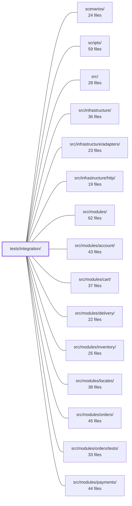

---
tags:
    - 2brain
    - 2brain/module
    - project/boilerplate-node-backend
type: module
module: tests/integration/
files: 29
updated: 2026-09-23T20:40:23.628179+00:00
---

# tests/integration/

## Purpose

`tests/integration/` holds tests that exercise **cross-module invariants**, end-to-end HTTP behavior, concurrency guarantees, and security properties that no single module's own test suite can validate. Every test drives the real Express app (or a real database) through the shared supertest harness, so the middleware stack, routing, serialization, and persistence layer all execute as in production.

## Key parts

- **App & system-level** — `app-health.test.ts`, `bad-bodies.test.ts`, `cors.test.ts`, `security-middleware.test.ts`, `auth-hardening.test.ts`: pin the middleware order, error-sanitization contract, CORS rejection, helmet/forwarded-for behavior, and attack-shaped rate-limiting on the fully-wired app.
- **Concurrency** — `concurrency/auth-races.test.ts`, `concurrency/cart-races.test.ts`, `concurrency/wishlist-races.test.ts`: fire N simultaneous requests at account, cart, checkout, and wishlist endpoints to lock in invariants (exactly-one-write, no duplicate lines, safe token rotation) behind the conditional-write and retry-with-compensation designs.
- **Cross-module product/translation** — `product-write.test.ts`, `product-multipart-write.test.ts`, `product-removal-protects-orders.test.ts`, `translation-cascades.test.ts`, `translation-resolution.test.ts`, `translation-cache-invalidation.test.ts`, `order-snapshot-locale.test.ts`: verify invariants that span the `products` and `locales` modules (multilingual writes, cache-tag invalidation, cascade deletes, snapshot locale freezing) as well as the four-module event chain triggered by product removal.
- **Locales & caching** — `locale.test.ts`, `locale-cache-invalidation.test.ts`: confirm per-request locale negotiation through Zod thunks and that admin writes evict the public cache tag.
- **Auth & account** — `access.test.ts`, `signup-grant-compensation.test.ts`, `two-factor.test.ts`, `upload-security.test.ts`: validate the role-storage invariant, compensating deletes on failed grants, the full TOTP/email 2FA lifecycle, and filesystem-level upload security.
- **Demo & scenarios** — `app/demo-restore.test.ts`, `app/demo-routes.test.ts`, `scenarios/apply.test.ts`, `scenarios/shop.test.ts`: exercise the demo restore path, the two `installDemo` routes, the CLI `apply` command (via subprocess), and the full `shop` scenario built through real HTTP endpoints.
- **Observability & infrastructure** — `observability-auth.test.ts`, `persistence/lease.test.ts`, `scripts/db/access-grant.test.ts`, `scripts/db/index-sync.test.ts`: auth-gate the `/observability/*` endpoints, verify Mongo lease semantics against a real database, and test the `access:grant` and `db:sync` console helpers.

## How it connects

- **`src/`** — the real application (`src/app.ts`) and its services are the primary subject; tests import and drive them directly rather than mocking.
- **`src/modules/`** (account, cart, products, locales, orders, users, wishlist, inventory, delivery, payments) — the invariants under test span two or more of these modules; this suite is the place where those cross-module contracts are asserted.
- **`src/infrastructure/http/`** — the middleware stack (locale attachment, security headers, rate limiting, error handler) is exercised in its real mounting order.
- **`src/infrastructure/adapters/`** — the Mongo adapter and translation port run against `mongodb-memory-server` and a real translation backend.
- **`tests/support/`** — provides the shared supertest harness, tenant/DB lifecycle helpers, and seeding utilities that every file here relies on.
- **`scenarios/` / `scripts/`** — the `scenarios/` and `scripts/db/` subdirectories test the application's own scenario-building and DB-migration scripts.

## Where to start

1. **`app-health.test.ts`** — the shortest, most self-contained file; it shows the shared harness setup, how the real app is mounted, and what a typical assertion looks like (status codes, headers, 404 behavior). Reading it first gives you the structural template for every other file.
2. **`access.test.ts`** — a single-invariant test that makes the _reason_ this module exists obvious: a role lives only in the membership row and never on the user document, an invariant that neither `src/modules/users/tests/` nor `src/modules/account/tests/` can assert alone.

## Connected modules

[[boilerplate-node-backend_scenarios|scenarios/]] · [[boilerplate-node-backend_scripts|scripts/]] · [[boilerplate-node-backend_src|src/]] · [[boilerplate-node-backend_src_infrastructure|src/infrastructure/]] · [[boilerplate-node-backend_src_infrastructure_adapters|src/infrastructure/adapters/]] · [[boilerplate-node-backend_src_infrastructure_http|src/infrastructure/http/]] · [[boilerplate-node-backend_src_modules|src/modules/]] · [[boilerplate-node-backend_src_modules_account|src/modules/account/]] · [[boilerplate-node-backend_src_modules_cart|src/modules/cart/]] · [[boilerplate-node-backend_src_modules_delivery|src/modules/delivery/]] · [[boilerplate-node-backend_src_modules_inventory|src/modules/inventory/]] · [[boilerplate-node-backend_src_modules_locales|src/modules/locales/]] · [[boilerplate-node-backend_src_modules_orders|src/modules/orders/]] · [[boilerplate-node-backend_src_modules_orders_tests|src/modules/orders/tests/]] · [[boilerplate-node-backend_src_modules_payments|src/modules/payments/]] · … and 5 more

## Files

- `tests/integration/access.test.ts` — Validates the cross-module authorization invariant of the demo seed: a role is stored **only** in the membership row (owned by the access module) and is never mirrored onto the user document (owned by the users module). This file exists because the invariant spans two modules, so it cannot be tested from within either module's own test suite.
- `tests/integration/app-health.test.ts` — Integration tests for the system routes (`/`, unknown-path 404, `x-request-id` handling) and the `/observability/*` routes (Prometheus metrics, SSE event stream, auth-gated sub-paths). They exercise the real application exported from `src/app.ts` through the shared supertest harness, ensuring the middleware stack actually mounted on the production app is what gets tested.
- `tests/integration/app/demo-restore.test.ts` — Integration test for `restoreScenario('blank')` from `src/app/demo.ts`. Verifies three invariants of the restore path against a real database: (1) the blank scenario seeds only the named accounts, memberships, and locales with no shop data; (2) the restore preserves the unique email index; (3) repeated restores keep the process-lifetime tenant cache consistent with the database. Exercises `restoreScenario` as a direct function call, then drives the resulting state over real HTTP to confirm the invariants hold at the API boundary.
- `tests/integration/app/demo-routes.test.ts` — Integration tests for the two routes exposed by `installDemo` (`POST /__test/restore` and `GET /__test/emails`). Each test mounts those routes on a throwaway Express app (or the real app, for the mount-gate case) and asserts the HTTP status codes, body validation, and side-effects a caller actually sees—complementing the boolean-level unit tests in `demo-outbox.test.ts`.
- `tests/integration/auth-hardening.test.ts` — Integration tests for three auth-hardening properties: per-identity and per-address rate limiting on credential endpoints, the anti-bot challenge gate that engages once the identity budget is half-spent, and the global 500 handler's error-sanitization contract. Each property is invisible under normal use and only observable under attack-shaped load, hence "hardening."
- `tests/integration/bad-bodies.test.ts` — Integration test suite that pins the server's responses to request bodies the parser cannot or does not handle: oversized (413), malformed (400), unreadable charset/encoding (415), and the Express 5 edge case where no parser matched so `request.body` is `undefined`. Its core invariant is that a malformed body never produces a 5xx, and that the response to a bodyless/malformed login is identical whether or not the account exists (no information leakage via status code or body).
- `tests/integration/concurrency/auth-races.test.ts` — Integration tests that fire N genuinely concurrent HTTP requests at the account endpoints (signup, login, refresh, reset) and assert **invariants** (exactly one user exists, all tokens survive, distinct token values) rather than request orderings. They exist as regression guards for three real bugs (R1, R4) and one explicit design guarantee (R5: refresh-token rotation under same-instant contention must not look like theft).
- `tests/integration/concurrency/cart-races.test.ts` — Integration tests that fire concurrent HTTP requests against the cart and checkout endpoints to verify the invariants behind two specific race conditions: **R2** (double-checkout producing duplicate orders) and **R3** (concurrent cart upserts producing duplicate lines or lost writes). The tests exist to lock in the conditional-write and retry-with-compensation designs in the cart repository and checkout flow, and to serve as the reference implementation for how concurrency bugs are exercised end-to-end.
- `tests/integration/concurrency/wishlist-races.test.ts` — Integration tests that verify the wishlist endpoints under concurrent access, ensuring race conditions cannot produce duplicate wishlist documents, duplicate product lines, or server errors. It is the wishlist counterpart to `cart-races.test.ts`; together they pin down the two repositories' claims about contention from the shape of their writes.
- `tests/integration/cors.test.ts` — Integration test that pins the app's CORS behavior for disallowed origins: the `Access-Control-Allow-Origin` header must be **omitted**, never replaced with a 500. It drives the real Express app (correct middleware order, real `cors` package callback) through the shared HTTP harness to catch the class of bug where a rejected origin throws into the error chain and turns a valid request into a generic server fault.
- `tests/integration/locale-cache-invalidation.test.ts` — Integration test that drives the real app end-to-end to verify the locale cache-invalidation contract: after an admin write, the cached public dictionary response is actually removed, so the next anonymous reader gets fresh data. It exists because the cache tag string used by reads and the tag cleared by writes are not type-checked against each other; a mismatch would look fine in development (30 s TTL) but silently serve hour-stale translations in production.
- `tests/integration/locale.test.ts` — Integration tests that verify per-request locale negotiation end-to-end through the real middleware stack (`attachLocale` → routes → Zod thunks → `rejectResponse`). They exercise two validation paths—`POST /account/signup` (service-level Zod with per-field `t(...)`) and `POST /feedback/contact` (orval-generated schema with no custom messages)—to confirm that every 422 response speaks the language the client asked for, including under concurrent mixed-language load.
- `tests/integration/observability-auth.test.ts` — Integration tests that verify the two observability endpoints enforce their respective authentication schemes. `/observability/events` (SSE) must require a valid, unrevoked admin refresh cookie; `/observability/metrics` must require the configured `NODE_METRICS_TOKEN` bearer token and deny all traffic when that token is unset.
- `tests/integration/order-snapshot-locale.test.ts` — Integration test verifying that order line snapshots freeze the **buyer's** stored locale at creation time, not the caller's or request's locale. Covers both the `orderService.create` (admin/operator path) and `cartService.orderConfirm` (self-checkout path) entry points.
- `tests/integration/persistence/lease.test.ts` — Integration test for `withLease` (the Mongo-based lease acquisition primitive) against a real database. It verifies the four safety properties a scaled-up cron container depends on: mutual exclusion, expiry is not permanent, a crash frees the lease immediately (no `ttlMs` wait), and a lost contended acquisition resolves `undefined` rather than rejecting. Real Mongo is required because the property under test is MongoDB's own concurrent `findOneAndUpdate` upsert semantics, which a mock cannot exercise.
- `tests/integration/product-multipart-write.test.ts` — Integration test verifying that product create/update requests sent as multipart form bodies (the only way to attach an image) correctly decode string-transported fields — `price` and `active` — into their native types before zod validation. It exists because no other suite covers this combination: the contract suite posts JSON (types already correct), the upload-security suite hits a route with no numeric field, and the frontend mock coerces values before dispatch.
- `tests/integration/product-removal-protects-orders.test.ts` — Integration test for the cross-module cascade triggered when a product is hard-deleted, deactivated, or soft-deleted: the product module announces the event, inventory drops (or keeps) the stock-level row, orders cancels pending orders and emails the buyer, and a racing payment intent is refused. It also verifies that an admin offline-payment recording still succeeds when the product is gone. Because the scenario wires four modules' real `subscribe()` hooks together, it lives in `tests/integration/` rather than inside any single module's test directory.
- `tests/integration/product-write.test.ts` — Integration tests for `productService.writeCreate` and `productService.writeUpdate`, exercising the multilingual product write path against a real database and a real translation port. Because the trigger lives in the `products` module while the translation rows and locale validation live in the `locales` module, the suite sits at the top-level `tests/integration/` rather than under either module's own `tests/` directory.
- `tests/integration/scenarios/apply.test.ts` — Integration test for `scenarios/apply.ts`. It exercises three gates — production-env refusal, non-empty-database refusal, and `--reset` — by spawning the real CLI entry point as an asynchronous subprocess against a fresh database on the shared test Mongo instance.
- `tests/integration/scenarios/shop.test.ts` — Integration test that builds the full `shop` scenario through the application's own HTTP endpoints (checkout, payment, shipping, refund, admin) into a live database, then verifies four guarantee classes: (1) every module's `scenario.shop` subjects resolve with no orphans, (2) each subject id names an existing row, (3) each row carries the property its name claims _where the consumer reads it_, and (4) a produced row is valid input to the contract's own response schema. It is the only suite in the repo that builds once and reads that single state across all cases.
- `tests/integration/scripts/db/access-grant.test.ts` — Integration test for the `grantAccess` function — the core logic behind the `access:grant` console command used to create the first owner in a fresh deployment. It exercises the function directly (not the CLI wrapper) because the wrapper parses `process.argv` and connects on import, making it undrivable per test case.
- `tests/integration/scripts/db/index-sync.test.ts` — Integration tests that prove `db:sync` reconciles a database's stored indexes with what the Mongoose schemas declare—both building missing indexes and dropping undeclared ones. It exists because no other test suite can construct a database whose indexes _disagree_ with the schemas (they all run against a fresh `mongodb-memory-server` where `autoIndex` builds everything unopposed), so this file is the only place that state is exercised.
- `tests/integration/security-middleware.test.ts` — Integration test that verifies two security behaviors of `src/app/security.ts` which no other test asserts: that helmet headers reach an ordinary (non-static) API response, and that a spoofed `X-Forwarded-For` header cannot obtain a fresh rate-limit bucket when `NODE_TRUST_PROXY_HOPS=0` (the deployment default). Both tests drive the fully-wired real app.
- `tests/integration/signup-grant-compensation.test.ts` — Integration test verifying that when the starting role/membership grant fails after a `User` row has already been written, the account module compensates by deleting that row — so the email or OAuth identity can retry signup. Covers both the self-service signup path and the OAuth login-or-create path. Lives in `tests/integration/` (not in either module's own `tests/`) because the failure is forced in the access module while the compensating delete is in the account module.
- `tests/integration/translation-cache-invalidation.test.ts` — End-to-end integration test proving that a successful `PATCH /locales/translations/product/:id` invalidates the `products` cache tag so the next anonymous `GET /products/:id` re-renders. It exists because the locales module and the products module each declare their cache tag independently; nothing type-checks the two strings against each other, so a silent typo would let stale products serve indefinitely. The test drives the real app over HTTP and asserts on `x-cache` response headers rather than on mock call counts.
- `tests/integration/translation-cascades.test.ts` — Integration test verifying that translation (locale) rows cascade correctly with product deletion. It exists at the top level rather than under `products/tests/` or `locales/tests/` because the invariant spans two modules: the trigger lives in the product service, the rows live in the locales repository.
- `tests/integration/translation-resolution.test.ts` — Integration test that verifies the read-side of the translation system: product titles are resolved to the caller's negotiated `Accept-Language`, untranslated items fall back to the source title (never blank), region tags resolve to their base language, a full page of products is translated in a single batched query, and free-text search unions across both the product's own columns and its translation rows. Placed at the top-level `tests/integration/` (not under either module's `tests/`) because it exercises the cross-module path between `products` and `locales`.
- `tests/integration/two-factor.test.ts` — End-to-end integration test for the full two-factor authentication lifecycle: enrolling a TOTP device factor, enrolling an email-delivered factor, logging in through the two-step challenge with either method, removing a factor, and disabling the remainder. All requests go through the real Express app so routing, auth guards, and serialization execute as in production. A dedicated bypass test verifies that a challenge token alone can never satisfy a request.
- `tests/integration/upload-security.test.ts` — Integration test suite that verifies the `POST /account/signup` upload path enforces server-side content validation and that the static-file serving layer is secure. It asserts against the **filesystem** (what actually landed on disk) and the **response headers** (what a browser would do with the bytes), not merely against HTTP status codes.

---

[[boilerplate-node-backend_INDEX|← boilerplate-node-backend index]]
