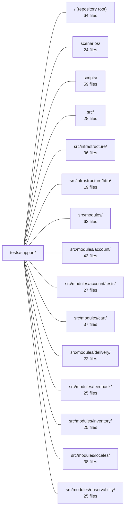

---
tags:
  - 2brain
  - 2brain/module
  - project/boilerplate-node-backend
type: module
module: tests/support/
files: 31
updated: 2026-09-23T20:40:44.610775+00:00
---

# tests/support/

## Purpose

`tests/support/` is the shared infrastructure layer for the entire test suite. It owns Jest lifecycle management (shared MongoDB, file sandbox, environment bootstrapping), provides HTTP and route-level testing harnesses, generates contract/conformance test data from `openapi.yaml` and Zod schemas, and supplies small assertion and fixture helpers that individual test files import rather than reimplementing.

## Key parts

- **Jest lifecycle & isolation** — `global-setup.ts` / `global-teardown.ts` start and stop a single shared `mongod` and manage the instance-scoped temp directory; `setup.ts` pre-sets `process.env` before any module import; `setup-file-sandbox.ts` + `file-sandbox.ts` redirect all file writes into a per-file sandbox; `database.ts` + `setup-test-db.ts` hand each test file a clean, uniquely-named database; `environment.ts` and `test-environment.ts` guard against env-leak and timer/observer memory leaks.

- **HTTP & route harnesses** — `http.ts` drives the full mounted Express app via supertest; `express.ts` offers a lightweight `Response` stub for middleware unit tests; `routed-modules.ts` + `routes.ts` expose every module router and its middleware chain for configuration assertions; `contract-routes.ts` gives a flat, side-effect-free endpoint inventory; `rate-limit-harness.ts` isolates `express-rate-limit`; `race.ts` fires N truly-parallel requests; `https-test-server.ts` provides a local TLS listener for webhook delivery tests.

- **Contract & schema tooling** — `contract.ts` registers `jest-openapi` so any test can call `toSatisfyApiSpec()`; `contract-data.ts` walks a Zod schema to produce valid or single-violation payloads; `spec-walk.ts` derives the operation list and body schemas from `openapi.yaml` with tripwire checks; `pattern-samples.ts` supplies known-good values for regex patterns the generator cannot synthesize; `schema.ts` inspects a Mongoose `Schema` object's declared contract (required paths, indexes, defaults, enums) without a database.

- **Identity, assertion & typing helpers** — `callers.ts` provides role-based `Caller`/`CallerContext` fixtures; `cookies.ts` normalises `Set-Cookie` extraction; `response.ts` narrows the `ResponseSuccess | ResponseReject` union at the assertion site; `stub.ts` centralises the one sanctioned `as unknown as T` cast; `ports.ts` works around CJS/swc `jest.spyOn` limitations for observability ports; `knobs.ts` exposes env-tunable depth parameters for property/fuzz/race suites.

- **Framework workarounds** — `puppeteer-core.stub.ts` maps the ESM-only package to a CJS-compatible stub under Jest; `i18n-boot.ts` reproduces production import ordering so specs can test a fresh, un-initialised i18next.

## How it connects

- **`src/` and `src/modules/*`** — This module's harnesses (`http.ts`, `routed-modules.ts`, `routes.ts`) import the production Express app, module routers, middleware factories, and Mongoose schemas under test. `schema.ts` reads Mongoose schema objects directly; `contract-routes.ts` inspects the mounted route table without triggering side-effectful module initialisation.
- **`tests/unit/`, `tests/integration/`, `tests/cross-cutting/`** — Every test file in those directories imports helpers from `tests/support/` (database setup, HTTP harness, response narrowing, caller fixtures). The Jest config in the repository root wires `global-setup`, `global-teardown`, `setup.ts`, `setup-file-sandbox.ts`, and `test-environment.ts` as suite-wide hooks.
- **`src/modules/*/tests/`** — Per-module unit suites pull `callers.ts`, `response.ts`, `schema.ts`, `rate-limit-budgets.ts`, and `ports.ts` for their focused assertions, while the shared harnesses in `tests/support/` remain the single source of HTTP-level and contract-level infrastructure.
- **`scenarios/` and `scripts/`** — Scenario and build scripts reference the same `openapi.yaml` that `contract.ts` and `spec-walk.ts` consume, keeping contract assertions in lockstep with any spec changes made outside the test run.

## Where to start

1. **`tests/support/setup.ts` + `tests/support/global-setup.ts`** — Reading these two first shows the order in which the test environment is built (env vars → shared Mongo → sandbox), which explains why so many other helpers in the directory exist.
2. **`tests/support/http.ts`** — This is the single entry point through which contract, integration, and race tests exercise the real app. Understanding its supertest wiring makes the surrounding `contract.ts`, `contract-routes.ts`, and `callers.ts` helpers immediately legible.

## Connected modules

[[boilerplate-node-backend_ROOT|/ (repository root)]] · [[boilerplate-node-backend_scenarios|scenarios/]] · [[boilerplate-node-backend_scripts|scripts/]] · [[boilerplate-node-backend_src|src/]] · [[boilerplate-node-backend_src_infrastructure|src/infrastructure/]] · [[boilerplate-node-backend_src_infrastructure_http|src/infrastructure/http/]] · [[boilerplate-node-backend_src_modules|src/modules/]] · [[boilerplate-node-backend_src_modules_account|src/modules/account/]] · [[boilerplate-node-backend_src_modules_account_tests|src/modules/account/tests/]] · [[boilerplate-node-backend_src_modules_cart|src/modules/cart/]] · [[boilerplate-node-backend_src_modules_delivery|src/modules/delivery/]] · [[boilerplate-node-backend_src_modules_feedback|src/modules/feedback/]] · [[boilerplate-node-backend_src_modules_inventory|src/modules/inventory/]] · [[boilerplate-node-backend_src_modules_locales|src/modules/locales/]] · [[boilerplate-node-backend_src_modules_observability|src/modules/observability/]] · … and 12 more

## Files
- `tests/support/callers.ts` — Provides role-based `AuthContext`, `Caller`, and `CallerContext` fixtures for the test suite. By organizing actors around the **role** string (rather than individual permission flags), test code reads as intent (`asWarehouse()`) and role-name typos surface at import time instead of failing deep inside an integration test. Every factory fills in a complete identity so services receive a well-formed context even though only `roles` and `tenantId` drive authorization.
- `tests/support/contract-data.ts` — A Zod-schema-driven payload generator that walks a `ZodType` and produces request bodies that either satisfy the schema (`validPayload`) or violate exactly one constraint (`invalidPayloads`). It exists to let the contract test suite answer "does the API honour its contract for *any* legal input?" as a complement to the hand-written scenario factories in each module's `tests/factories.ts`.
- `tests/support/contract-routes.ts` — Provides a flat, app-wide inventory of every mounted endpoint (method, absolute path, effective guard chain) from the perspective of enabled modules. It exists as a separate test-support module so that contract-level assertions can inspect the full route surface without paying the side-effect cost (event subscriptions, demo seeding) that `enabledModules` incurs and that per-module route unit tests don't need.
- `tests/support/contract.ts` — Registers `jest-openapi` with the repository's `openapi.yaml` so that any test can assert an HTTP response conforms to the OpenAPI spec via the `toSatisfyApiSpec()` matcher. It exists to catch **over-serialization** (fields like `password`, `_id`, `__v` leaking into responses) — a class of bug that Zod's non-strict schemas silently mask by stripping unknown keys.
- `tests/support/cookies.ts` — Small helper module that normalises reading `Set-Cookie` values off a supertest/superagent response. Superagent types the header bag as a flat `Record<string, string>`, but Node delivers `set-cookie` as an **array** (or a bare string when only one cookie was set). These helpers hide that shape ambiguity so contract tests can extract and forward cookies without casting or branching.
- `tests/support/database.ts` — Provides per-file database connection lifecycle (connect, disconnect, clear) for the test suite. It connects to a single shared in-memory MongoDB started by `globalSetup`, assigning each test file a uniquely named database to preserve isolation while bounding disk and process costs (one server for all files instead of one per file).
- `tests/support/environment.ts` — Provides test-scoped helpers for safely mutating `process.env` and guaranteeing restoration, so that config-driven behavior (read lazily at use time) can be varied per test case without leaking state into subsequent cases or files.
- `tests/support/express.ts` — Provides a chainable Express `Response` stub for unit tests that verify what a middleware, controller, or error responder *attempts* to write (status code, JSON body) without spinning up a server. It exists so tests can assert on call arguments, order, and count rather than needing a real HTTP round-trip.
- `tests/support/file-sandbox.ts` — Redirects every file-writing application setting (`public/`, `quarantine/`, staging, etc.) into a per-test-file directory under a jest-instance sandbox root, so integration tests never write onto the developer's real directories. It also provides the scan-and-report primitives that global teardown uses to fail a run when a test left files behind.
- `tests/support/global-setup.ts` — Jest `globalSetup` hook that runs once per jest instance before any worker starts. It starts a **single** ephemeral `mongod` process shared by all test suites, publishes the connection URI and per-instance data roots via `process.env`, and claims a file-sandbox directory. It also sweeps data directories left behind by previously SIGKILLed instances (Stryker's normal shutdown mode) to prevent unbounded disk growth in the repo's `tmp/test/`.
- `tests/support/global-teardown.ts` — Jest's `globalTeardown` hook: runs once per Jest instance after the last worker exits. It stops the shared in-memory Mongo server started by `global-setup.ts`, deletes the instance-scoped temp directories, and verifies the test sandbox is empty. Exists so that each Jest instance owns and fully cleans up its own runtime artifacts.
- `tests/support/http.ts` — HTTP-level test harness that drives the mounted Express app through its full request pipeline (routing, middleware, auth, serialization, error handling) via **supertest**. This is the only layer where a response can be compared against `openapi.yaml`, complementing the unit suites that call services and repositories directly.
- `tests/support/https-test-server.ts` — A self-contained local HTTPS listener that integration tests start and tear down themselves. It exists so the webhooks delivery suite can verify a signed HTTP request actually arrived over TLS without depending on the Docker Compose `webhook-tester` service, and without requiring `openssl` on the machine running tests.
- `tests/support/i18n-boot.ts` — Test-support helper that reproduces the production import ordering in `app.ts` (module evaluated first, `i18next.init()` second). Without it, Jest's `setupFiles` (via `tests/support/setup.ts`) initialises i18next before any spec module loads, so a `t()` call made at module scope silently returns a string under test but `undefined` in production. This file lets a spec deliberately load a target module against a **fresh, un-initialised** i18next, then initialise afterwards.
- `tests/support/knobs.ts` — Centralizes the tunable "depth" parameters (how many cases a property test explores, how many fuzz requests per operation, how many race participants fire) for the generative test suites. Each value is read from an environment variable, floored to a minimum so a suite can never silently run zero cases, and defaulted to a committed constant when the variable is unset or unparseable. Exists so that a developer on a constrained machine can dial rigor down or hunt a specific bug by dialing it up without editing test files.
- `tests/support/pattern-samples.ts` — Provides a single lookup table of known-good string values for OpenAPI `pattern` constraints that no generator can synthesize automatically (notably lookahead-based patterns). By keying samples on the regex source exactly as written in the contract, every generator that walks the spec shares one registration point instead of each hard-coding its own fallback.
- `tests/support/ports.ts` — Provides a portable `observePort` helper for asserting on observability port calls (audit, analytics) in tests. It exists because `jest.spyOn` on namespace-imported port functions throws under CommonJS/swc transforms (non-configurable getters) and inside Stryker's instrumented sandbox, so the recommended pattern is module-level `jest.mock` + this helper to restore per-assertion spy semantics.
- `tests/support/puppeteer-core.stub.ts` — Test-time stub that replaces `puppeteer-core` via Jest's `moduleNameMapper`. It exists because puppeteer-core v25 ships ESM-only (`type: module`), which cannot be parsed under this project's CJS Jest setup. Without the stub, any test that transitively reaches `adapters/pdf.ts` would fail at the parse stage rather than at an assertion.
- `tests/support/race.ts` — Concurrency test harness that fires N identical HTTP requests truly in parallel and provides assertion helpers for the outcomes. It exists because "does this operation work?" and "does it still work when ten of them land at once?" are different questions, and mutation testing cannot answer the second.
- `tests/support/rate-limit-budgets.ts` — A small test-support helper that lets unit-test suites retrieve a named `RateLimitBudget` from a module's declared budget array. It exists so the three rate-limit relationship tests (account, feedback, payments) can reference budgets by `namespace` without repeating a find-and-check pattern, and so a missing budget fails loudly instead of propagating `undefined`.
- `tests/support/rate-limit-harness.ts` — A minimal Express app harness for exercising `express-rate-limit` middleware in isolation over real HTTP (via supertest). It exists because neither the stub app in `tests/support/express.ts` (no real middleware runs) nor the fully mounted app in `tests/support/http.ts` (routing, auth, serialization) provides the right level of fidelity: a rate limiter's behaviour is a property of the middleware itself, and `no-restricted-imports` classifies that as an integration concern.
- `tests/support/response.ts` — Test helper that narrows a service's `ResponseSuccess<T> | ResponseReject` union at runtime. Each helper asserts the expected arm via `expect` *before* casting, so a response that took the wrong branch fails on the assertion line itself rather than surfacing later as a confusing `undefined` read.
- `tests/support/routed-modules.ts` — Central registry of every Express router mounted under `src/modules/`, exposed as a single `Record<string, Router>` map for test consumption. It exists as a separate file (not folded into `@tests/routes`) so that `jest.requireActual('@tests/routes')` never transitively loads the real middlewares (`rate-limit`, `cache`, `upload`, `route-flag`) while a `jest.mock` factory is still being evaluated. It also enforces completeness: a module added to `src/modules/` without a line here fails the "imports one router per module directory" check in `write-routes-are-guarded.test.ts`.
- `tests/support/routes.ts` — Test-support utility that reads an Express router's mounted route table (method, path, middleware chain) and provides drop-in mock factories for middleware that are *closures* (cache, rate-limit, upload, step-up-auth). Because Express stores the function it was given, not the factory call, these mocks label the returned middleware with the factory's arguments so a test can assert the full configuration of every route in a module.
- `tests/support/schema.ts` — A suite of pure, database-free readers that inspect a Mongoose `Schema` object's declared contract—required paths, index names/directions/options, defaults, enums, nested schemas, and schema-level flags—so that unit tests can assert the schema *as declared* rather than inferring it from saved documents. It exists because document-shape integration tests cannot detect mutations that leave valid documents unchanged (dropped `required`, lost `_id: false`, flipped index direction, removed `timestamps`).
- `tests/support/setup-file-sandbox.ts` — Per-test-file Jest bootstrap that redirects all application file writes into a sandbox directory named after the running test file. It exists as a standalone `setupFilesAfterEnv` entry (rather than living in `setup.ts`) because Jest only exposes the current test file path at that lifecycle stage.
- `tests/support/setup-test-db.ts` — Provides a one-liner test-setup function that wires up the shared in-memory MongoDB connection for any test suite that persists data. It ensures each test starts against an empty database so assertions can rely on absolute document counts.
- `tests/support/setup.ts` — Global Jest bootstrap (wired via `setupFiles`) that runs **once per worker, before any test module is imported**. It pre-sets environment variables — rate-limit budgets, JWT/TOTP secrets, locale resources, payment-method config — so that modules which capture their configuration at import time see test-appropriate values. Setting any of this in a `beforeAll` would be too late; the modules under test would already have locked in production defaults.
- `tests/support/spec-walk.ts` — Derives the list of HTTP operations and their request-body schemas from `openapi.yaml` so that the fuzz test suite always covers every declared endpoint without a hand-maintained list. It also provides tripwire checks (`unsupportedKeywords`, `ungeneratablePatterns`) that fail loudly when the spec grows a keyword or regex pattern the fuzzer cannot handle, preventing silent coverage gaps.
- `tests/support/stub.ts` — Provides the single sanctioned type-cast helper (`asStub`) for hand-built test stubs that cannot structurally satisfy their framework type (e.g., Express `Request`/`Response`, Mongoose `CastError`). It exists so that the one unavoidable `as unknown as T` conversion lives in a single named, searchable location instead of being scattered as inline double-casts across every test suite.
- `tests/support/test-environment.ts` — Custom Jest environment (extends `jest-environment-node`) that tracks every `setTimeout`/`setInterval` timer and every `PerformanceObserver` a test file creates, then clears/disconnects them at teardown. It exists because a live callback pins the entire VM context (app, models, all loaded modules) to memory—35–80 MB per file. Jest's worker recycling hides the leak in normal runs, but Stryker's `runInBand` mode has no recycling, so an unmanaged dry run grows until the heap limit kills it.

---
[[boilerplate-node-backend_INDEX|← boilerplate-node-backend index]]
