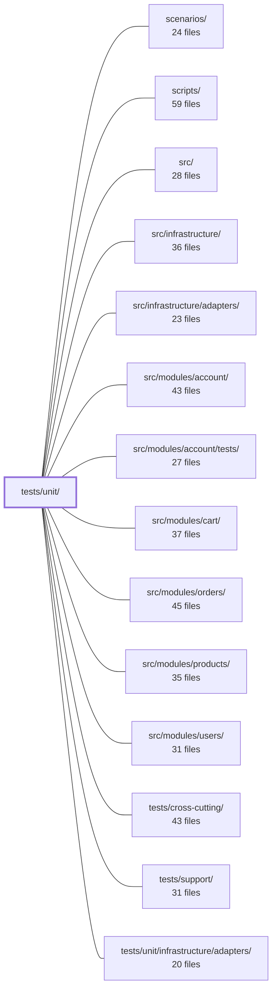

---
tags:
  - 2brain
  - 2brain/module
  - project/boilerplate-node-backend
type: module
module: tests/unit/
files: 56
updated: 2026-09-23T20:41:00.503783+00:00
---

# tests/unit/

## Purpose

`tests/unit/` is the project-wide unit-test layer. It exercises individual functions, pure helpers, and isolated subsystems from `src/`, `scenarios/`, and `scripts/` without spinning up an Express app, a real database, or external network services. Each test file mirrors the directory it tests, so a change in `src/kernel/` has its contract pinned in `tests/unit/kernel/`.

## Key parts

- **`app/`** — Boot-time and process-level contracts: status-resolution in the uncaught-error handler, `uncaughtException`/`unhandledRejection` handlers, required-config entries, and Slowloris-defence server timeouts.
- **`kernel/`** — The authorization and composition spine: access-query filtering, the three auth middlewares, the domain event bus, Zod permission schemas, module registry flattening, the boot-gate mechanism, step-up re-authentication, the one-shop tenant invariant, and the translation port's unregistered/registered contracts.
- **`infrastructure/i18n/`** — Locale-discovery caching, `AsyncLocalStorage`-scoped translation context, and the locale-override refresh pipeline.
- **`infrastructure/observability/`** — Analytics provider wire payloads, the audit-event sink pipeline, Prometheus metrics registration, and OpenTelemetry span helpers (against an in-memory exporter).
- **`infrastructure/persistence/`** — Pure Mongo-query compilation, shared factory helpers, duplicate-key / bad-ObjectId predicates, and the paginated `readAll` stopping rule.
- **`infrastructure/security/`** — Breached-password two-tier check and the versioned AES-256-GCM crypto round-trip.
- **`infrastructure/runtime/`** — Environment-variable coercion edge cases, the demo-profile flag, and OTel SDK processor construction.
- **`scenarios/`** — Seed account passwords, scenario-guarantee matching, ephemeral Mongo resolver priority, image-path integrity, and `insertIfAbsent` idempotency.
- **`scripts/`** — OpenAPI bundle merge rules, `host` hostname-only redirection, and the `runScript` cleanup/exit-code contract.

## How it connects

- **`src/` (and its sub-paths `src/infrastructure/`, `src/modules/*`, `src/infrastructure/adapters/`)** — Every file here imports and asserts behaviour of exactly one (or a few) exported functions from the corresponding `src/` path. They are the safety net that catches regressions before integration or cross-cutting suites run.
- **`scenarios/` and `scripts/`** — The `scenarios/` and `scripts/` test files verify pure helpers and seed data in those directories without launching Mongo, Redis, or a browser.
- **`tests/support/`** — Shared fixtures and test utilities consumed across these unit suites (e.g., in-memory OTel exporter, mocked fetch).
- **`tests/cross-cutting/`** — Sibling suite that covers multi-module interaction flows; the unit tests here deliberately do not overlap that scope (e.g., express-level error propagation is left to `tests/cross-cutting/` / integration tests).
- **`tests/unit/infrastructure/adapters/`** — A sub-directory of this module covering adapter-specific unit tests; listed separately in the dependency graph to reflect its own import surface.

## Where to start

1. **`tests/unit/kernel/authorizations.test.ts`** — It exercises the three auth middlewares end-to-end (real Express response, stubbed DB/JWT) and shows the testing conventions the rest of the suite follows: real response layer, minimal stubs, and assertions on the status code a client would actually see.
2. **`tests/unit/infrastructure/runtime/environment.test.ts`** — A compact, self-contained file that demonstrates how the suite pins "silent-failure" contracts (the cases where a naive implementation would not throw but would produce wrong data), a pattern that repeats across persistence, i18n, and security tests.

## Connected modules

[[boilerplate-node-backend_scenarios|scenarios/]] · [[boilerplate-node-backend_scripts|scripts/]] · [[boilerplate-node-backend_src|src/]] · [[boilerplate-node-backend_src_infrastructure|src/infrastructure/]] · [[boilerplate-node-backend_src_infrastructure_adapters|src/infrastructure/adapters/]] · [[boilerplate-node-backend_src_modules_account|src/modules/account/]] · [[boilerplate-node-backend_src_modules_account_tests|src/modules/account/tests/]] · [[boilerplate-node-backend_src_modules_cart|src/modules/cart/]] · [[boilerplate-node-backend_src_modules_orders|src/modules/orders/]] · [[boilerplate-node-backend_src_modules_products|src/modules/products/]] · [[boilerplate-node-backend_src_modules_users|src/modules/users/]] · [[boilerplate-node-backend_tests_cross-cutting|tests/cross-cutting/]] · [[boilerplate-node-backend_tests_support|tests/support/]] · [[boilerplate-node-backend_tests_unit_infrastructure_adapters|tests/unit/infrastructure/adapters/]]

## Files
- `tests/unit/app/error-handling.test.ts` — Unit tests for the status-resolution branch of `handleUncaughtError`. The file drives the handler directly (no express app, no throwing route) to isolate `clientErrorStatus`'s decision logic: how it picks between `error.status` and `error.statusCode`, and when it rejects both in favor of the 500 fallback. The express-level integration (a synchronous throw actually reaching this handler) is covered separately in `tests/integration/auth-hardening.test.ts`.
- `tests/unit/app/process-error-handlers.test.ts` — Unit-tests the process-level `uncaughtException` and `unhandledRejection` handlers installed by `installErrorHandling`. It verifies the critical two-way contract: under a test runner no handler is installed (so Jest's own reporting remains intact), and under `development`/`production` a handler is installed that audits the event via the logger (and, for `uncaughtException` only, calls `process.exit(1)`).
- `tests/unit/app/required-config.test.ts` — Asserts the **content** of `APP_NON_MODULE_CHECKS` — the app-tier boot-time entries that `src/app.ts` folds into `assertRequiredConfig`. It does not test the gate's own collect/report/skip machinery (that belongs to `tests/unit/kernel/required-config.test.ts`); it only verifies which environment variables each entry requires, under which `NODE_ENV`, and how grouped variables (SMTP, provider selectors) interact.
- `tests/unit/app/server-timeouts.test.ts` — Verifies that `applyServerTimeouts` (from the security module) sets header, request, and keep-alive timeouts on the HTTP server to values that defend against Slowloris and slow-POST attacks. These values are the *only* defence against that class of denial-of-service (the rate limiter counts requests, not bytes-in-flight), and a silent regression to Node defaults would not be caught by any other suite.
- `tests/unit/i18n/email-locale.test.ts` — Guards the email i18n contract: the producer must fully resolve translated copy before a job hits the queue, and the downstream worker must render whatever copy it receives without consulting any ambient locale store. The tests also cover the worker's nack/retry semantics for malformed jobs and SMTP failures.
- `tests/unit/infrastructure/i18n/catalog.test.ts` — Unit tests for the locale-discovery and dictionary-loading layer of the i18n catalog. Verifies that supported-locale listing is cached (so it cannot drift from the resources `i18next.init()` registered), that per-locale dictionaries correctly merge the shared file with every registered module's contribution, and that `localeCandidatesFor` builds the expected exact → base → fallback chain without duplicates.
- `tests/unit/infrastructure/i18n/context.test.ts` — Unit tests for the request-scoped i18n context built on `AsyncLocalStorage`. Verifies that the ambient `t` resolves against the correct locale inside a scope, falls back to the global instance outside one, survives async boundaries, and keeps concurrent scopes isolated from each other.
- `tests/unit/infrastructure/i18n/overrides.test.ts` — Unit tests for the locale-override layer. Validates three invariants the override mechanism must preserve: deployed files remain usable when no provider is registered, deleted overrides actually stop resolving, and languages without a deployed dictionary are skipped. Also covers the periodic refresh timer that propagates edits across workers.
- `tests/unit/infrastructure/observability/analytics.test.ts` — Unit tests for the analytics provider port (`src/infrastructure/observability/analytics/`) and its Umami and PostHog implementations. Because the emit contract is fire-and-forget (no return value), every assertion inspects the decoded wire payload (`fetch` call or PostHog `capture` argument) rather than a return value. The file also pins non-obvious external behaviors (e.g. Umami silently dropping events without a `User-Agent` header) that are invisible from the source code.
- `tests/unit/infrastructure/observability/audit.test.ts` — Unit tests for the core audit-event pipeline. Verifies that `emitAuditEvent` selects the correct log level and forwards all fields, that the registered-sink pattern delivers stamped entries without letting sink failures escape into the request path, that `extractRequestContext` and `buildAuditEvent` produce the expected shapes, and that the three app-level security actions carry stable string values.
- `tests/unit/infrastructure/observability/metrics-http.test.ts` — Unit tests for the HTTP metrics module (`metrics-http.ts`). Validates that route-label extraction produces bounded cardinality, that request and error counters are recorded correctly, and that in-flight gauges are registered in the Prometheus registry.
- `tests/unit/infrastructure/observability/metrics-registry.test.ts` — Unit tests for the `getPrometheusMetrics` export from the observability metrics registry. Verifies that the rendered Prometheus exposition text includes expected default metric families, guarding against accidental removal of `prom-client` defaults.
- `tests/unit/infrastructure/observability/tracer.test.ts` — Unit tests for the four public tracing helpers (`getTracer`, `withSpan`, `getActiveSpanContext`, `recordErrorOnActiveSpan`). They verify span lifecycle behavior—creation, attribute tagging, error recording, re-throw semantics, and active-context retrieval—against an in-memory OpenTelemetry exporter so no real backend is required.
- `tests/unit/infrastructure/persistence/create-repository.test.ts` — Unit tests for `buildWhere`, the pure filter-bag-to-Mongo-query compiler that every module's `search()` method relies on. The tests verify id-coercion, blank/empty handling, and per-kind compilation rules without touching a real database or Mongoose model.
- `tests/unit/infrastructure/persistence/factories.test.ts` — Unit tests for the four shared factory helpers (`toObjectId`, `stripUndefined`, `toDate`, `identityOf`) that every module's `factories.ts` composes. The tests exist to pin down the *silent-failure* contracts of each helper — the cases where a wrong type or a missing key would not throw but would instead produce a record that matches nothing, skips a schema default, or carries a null timestamp.
- `tests/unit/infrastructure/persistence/mongo-errors.test.ts` — Unit tests for the two predicate helpers (`isDuplicateKey`, `isBadObjectId`) exported from `src/infrastructure/persistence/mongo-errors.ts`. They pin down the exact discrimination logic (numeric `code` property, `instanceof` check) so that callers can safely narrow a widened `unknown` catch without accidentally matching messages or duck-typed shapes.
- `tests/unit/infrastructure/persistence/search.test.ts` — Unit tests for the shared `readAll` pager that all `personalData.collect` exports use to fetch paginated data. The suite exists to pin down the loop's stopping rule — a short page is the *only* signal to stop — so that no module regresses to a per-module page-size cap that silently truncates results.
- `tests/unit/infrastructure/runtime/demo-profile.test.ts` — Unit tests for the demo-profile runtime flag. Verifies that `isDemoMode()` reflects the state toggled by `enableDemoProfile()`, and that the flag is forcibly denied (with a logged error) when `NODE_ENV` is `production`.
- `tests/unit/infrastructure/runtime/environment.test.ts` — Exhaustive unit test suite for the three environment-variable coercion helpers in `src/infrastructure/runtime/environment.ts` (`environmentNumber`, `environmentDecimal`, `environmentFlag`). It focuses on the silent failure modes—inputs that a naive `Number()`, `parseInt()`, or string comparison would misread—rather than the happy path, because the helpers exist to prevent those misreads from propagating as `NaN`, truncated integers, or inverted booleans.
- `tests/unit/infrastructure/runtime/otel-sdk.test.ts` — Unit tests for `buildProcessors()` specifically — deliberately excluding `startTracing()` because that function monkey-patches express, mongoose, redis, and http globally, which is unsafe inside a shared Jest worker. The tests verify the no-op path and that a finished span actually reaches a real `OTLPTraceExporter.export()` at flush time.
- `tests/unit/infrastructure/security/breached-passwords/index.test.ts` — Unit tests for the two-tier breached-password check (bundled list + HIBP k-anonymity API) and the combined `assertPasswordNotBreached` guard. Validates correct routing between the two rungs, the HIBP request format, fail-open semantics, and the shape of the user-facing validation error.
- `tests/unit/infrastructure/security/versioned-secret.test.ts` — Unit tests for the versioned AES-256-GCM secret encryption module. Validates the core crypto contract—round-trip, IV freshness, tamper detection, version stamping, and key-rotation semantics—once at the infrastructure level, so that higher-level wrappers (TOTP, webhooks) can rely on it without re-testing the crypto itself.
- `tests/unit/infrastructure/surfaces/create-search-controller.test.ts` — Unit tests for the `createSearchController` factory that pin the contract: the `id` query parameter is always forwarded to `runSearch` as an **array** (batch filter), whether the client sends a repeated key (`id=a&id=b`) or a single value (`id=a`). This is the one place in the codebase where that normalization guarantee is asserted.
- `tests/unit/kernel/access-query.test.ts` — Unit tests for `accessibleFilter` (from `@kernel/access/query`), the compiled access-control filter a Mongoose collection is actually read with. The suite pins two invariants that were previously implicit in four hand-written query fragments: an unrestricted role produces `{}` (narrows nothing), and a caller with no applicable rule produces CASL's `EMPTY_RESULT_QUERY` (matches nothing) rather than `undefined` (no restriction at all).
- `tests/unit/kernel/authorizations.test.ts` — Unit tests for the three authorization middlewares exported from `src/kernel/middlewares/authorizations.ts` — `getAuth` (optional identification, fails open), `isAuth` (required identification, 401), and `requirePermission` (required elevation, 401 or 403). The response layer is kept real (not mocked) so that asserted status codes are the ones a client actually receives; only the audit sink and JWT/DB boundaries are stubbed.
- `tests/unit/kernel/events.test.ts` — Unit tests for the domain event bus (`src/kernel/events.ts`). They lock in two safety properties the product-delete → cart-empty flow depends on: handlers are fully awaited before `emitDomainEvent` resolves, and a single failing handler neither rejects the emission nor prevents remaining handlers from running.
- `tests/unit/kernel/permissions.test.ts` — Unit tests for the Zod schemas and derived exports in `@kernel/permissions`. Verifies that the authorization keys/roles documents are validated strictly (not merely cast), that the real shared YAML files loaded successfully at import, that the `admin` preset role is correctly tenant-scoped, and that the `permissionModelVersion` fingerprint changes on key swaps but not on reorders.
- `tests/unit/kernel/registry.test.ts` — Unit tests for the three public functions exported by `@kernel/registry` — `registerModules`, `resolveTranslatables`, and `resolvePersonalDataSections`. Each test focuses on the contract visible from the `AppModule` array input: what gets called, what gets flattened, and how the `'none'` sentinel is handled.
- `tests/unit/kernel/required-config.test.ts` — Unit tests for the kernel-level boot-gate mechanism: `assertRequiredConfig` (collect-and-report required-config violations before the process can start) and `checkSelector` (validate enum-style provider selectors). The file exists to pin down the *mechanism* the kernel owns—placeholder detection, multi-offender reporting, ring validation, environment bypasses, forbidden-in-production, and caller-supplied checks—while deliberately leaving app-tier and module-specific variable names to their own test files.
- `tests/unit/kernel/step-up.test.ts` — Unit tests for the step-up (re-authentication) path inside `requirePermission`. When a permission key in `shared/authorization-keys.yaml` carries a `stepUp` flag, a stale session must be challenged (401) while a caller who never held the permission at all must be flatly refused (403). The file also asserts that every challenge is recorded via the audit pipeline so the demand is reconstructable after the fact.
- `tests/unit/kernel/tenant-caller.test.ts` — Verifies the **one-shop invariant**: every tenant-scope `Caller` (anonymous stranger, `SYSTEM_ACTOR`, and any caller resolved via `callerInScope`) must carry the fixed `DEPLOYMENT_TENANT_ID`, and `null` for `tenantId` is reserved exclusively for platform scope. The file exists to lock this discriminated-union contract against accidental regression.
- `tests/unit/kernel/translation.test.ts` — Unit-test suite for every public function of the translation port in `@kernel/translation`. It verifies two invariants for each function: (1) an **unregistered** port yields a safe, no-throw default (empty map/list, zero count, or a failure result), and (2) a **registered** port receives its arguments verbatim and its return value is passed through unchanged. A separate block covers `applyTranslations`, which overlays resolved fields onto already-wire-shaped page items.
- `tests/unit/scenarios/accounts.test.ts` — Unit tests for the seed/demo account identities defined in `scenarios/accounts.ts`. Verifies that the two hardcoded fallback passwords satisfy the same Zod policy every password-setting endpoint enforces, that `NODE_SEED_*_PASSWORD` env vars correctly override (or leave alone) each account's password, and that the `seedCredentials` export and `hasFallbackSeedPassword()` helper report the right values under each configuration.
- `tests/unit/scenarios/check.test.ts` — Unit tests for the pure-list comparison in `scenarios/check.ts`. They prove that `findUnmetGuarantees` and `assertScenarioGuarantees` correctly detect mismatches between a scenario's declared guarantees and the subjects a built scenario offers — using hand-made subject maps so no scenario build (and therefore no database) is required.
- `tests/unit/scenarios/ephemeral-mongo.test.ts` — Unit tests for the `startEphemeralMongo` three-way resolver. Verifies the priority chain (external URI → pre-installed binary → in-process boot) using a mocked `startInProcess`, so no real `mongodb-memory-server` is ever launched.
- `tests/unit/scenarios/scenario-images.test.ts` — Guards every `imageUrl` in the scenario seed dataset: asserts each value is a forward-slash URL path rooted at `/images/seed/` that resolves to a file actually shipped under `public/`. Without this check, a Windows-style backslash or a missing file surfaces only as "images are broken" in the browser, with no build or CI signal.
- `tests/unit/scenarios/seed.test.ts` — Unit test for the `insertIfAbsent` policy in `scenarios/seed.ts`. It verifies both return arms (`'created'` and `'skipped'`) so that the idempotent boot path is locked in at the unit level, independent of integration suites that always seed into a fresh (dropped) database.
- `tests/unit/scripts/contracts/openapi-bundle.test.ts` — Unit tests for the `withAppLevelResponses` post-bundle merge step in the OpenAPI contract pipeline. They verify that app-level error responses (429, and 400/413 for body-carrying operations) are injected into every operation that no individual module fragment declares, using a minimal hand-built YAML document rather than the real `openapi.yaml` to isolate the merge rule itself.
- `tests/unit/scripts/db/host-scripts.test.ts` — Guards two invariants that make `npm run host -- <script>` work correctly: the `host` wrapper in `package.json` must redirect only the hostname (never a full URI or database name), and `getDatabaseUri()` must fall through to fragment-level env vars when `NODE_DB_URI` is empty (not merely undefined). Without these, renaming the database in `.env` silently seeds the wrong database, and on dual-stack machines the `localhost` name can resolve to IPv6 while the container only listens on IPv4.
- `tests/unit/scripts/db/run-script.test.ts` — Unit tests for the `runScript` wrapper, verifying its three contract guarantees: the body runs before cleanup, the process exit code is set to 1 on failure, and the failure reason is logged. A dedicated test also confirms cleanup still executes when the body throws — the scenario that previously hung `scenario:apply` by leaving Mongo/Redis sockets open.
- `tests/unit/scripts/eslint/barrel-allowed-sources.test.ts` — Unit test for the `barrelAllowedSources` ESLint rule. Verifies that barrel files (`index.ts`) never re-export repository or wiring modules in any form, that models may only leave a barrel as types, and that the narrow `tax`-file allowance is scoped to the products module specifically. Each check (star export, named export, model-name heuristic) gets exactly one representative case rather than a table.
- `tests/unit/scripts/eslint/comment-links.test.ts` — A liveness check for the `comment-links` ESLint rule. Rather than an exhaustive case table, it supplies a single known-bad input to prove the rule still fires. The rationale: the rule runs against ~1,000 repo files on every `npm run lint`, so false positives surface naturally; this test guards the opposite failure mode — a rule that has silently stopped matching anything, which would look identical to a clean run.
- `tests/unit/scripts/eslint/controller-chain-must-catch.test.ts` — Minimal regression test for the `controller-chain-must-catch` ESLint rule. It verifies that the rule still fires on its canonical bad pattern (a `.then` without a `.catch` in an exported handler). The comment at the top notes this is one of four rule tests that deliberately carry a single known-bad input instead of a full case table, for the reasons documented in `comment-links.test.ts`.
- `tests/unit/scripts/eslint/no-factories-import-in-production.test.ts` — Verifies that the `no-restricted-imports` block in `eslint.config.ts` correctly rejects any `import` of a module's own `factories.ts` from production code. It does so by writing a temporary probe file into the real `src/modules/products/` tree, running the actual `eslint` CLI against it, and asserting a `no-restricted-imports` diagnostic is produced.
- `tests/unit/scripts/eslint/no-hardcoded-user-text.test.ts` — Unit test for the `no-hardcoded-user-text` ESLint rule. It is deliberately minimal: zero valid cases and a single invalid case. The header comment explains this is because the rule still fires on some inputs, and this file follows the same "one known-bad input, no case table" pattern as `comment-links.test.ts`.
- `tests/unit/scripts/eslint/no-persistence-imports.test.ts` — Unit test for the `noPersistenceImports` ESLint rule, focused exclusively on the **binding-name** detection path. It exists to verify that a barrel import (e.g. `@modules/users`) is still flagged when the imported identifier matches a configured binding, even though the specifier path itself is non-descriptive.
- `tests/unit/scripts/eslint/self-barrel-import.test.ts` — Liveness probe for the `boundaries/dependencies` ESLint policy: verifies that a same-module self-barrel import is actually *evaluated* (and refused) rather than silently skipped. Guards against a regression where `checkInternals` is unset, making the policy a no-op that looks identical to a passing lint run.
- `tests/unit/scripts/mutation/baseline.test.ts` — Unit tests for the per-file mutation ratchet gate (`scripts/mutation/baseline.ts`). They pin the core asymmetry — improvements move the baseline up, regressions never move it down — and the partial-run guards, using synthetic Stryker-shaped reports so the suite runs in milliseconds rather than requiring a full mutation run.
- `tests/unit/scripts/mutation/local-policy.test.ts` — Unit tests for `selectShards`, the pure decision function that determines which mutation shards to run in a given evening sweep versus which are already completed. It exists so the logic can be verified without invoking the CLI (`run-shards.ts`), which is intentionally kept as a thin, untested wrapper.
- `tests/unit/scripts/mutation/mutate-scope.test.ts` — Unit tests for the two exported helpers in `mutate-scope.ts`: `isMutable` (does a path fall inside Stryker's mutate globs?) and `changedMutable` (intersection of a diff's changed-file list with that scope). The file keeps these pure path-filtering functions covered in isolation so the CLI wrapper in `run-diff.ts` stays thin and untested.
- `tests/unit/scripts/mutation/sharding.test.ts` — Unit tests for `packIntoShards`, the function that partitions a list of files (by line count) into evenly-sized shards for the mutation-testing CI matrix. Tests run against synthetic file lists only—no directory walks—mirroring the thin-CLI-wrapper / testable-core split used elsewhere in this project.
- `tests/unit/scripts/pairing/spec-identity.test.ts` — Unit tests for the cross-repo contract check in `scripts/pairing/spec-identity.ts`. Validates that the shared-file comparison logic correctly detects matches, drifts, and missing files between a backend and a frontend checkout, using synthetic temp-directory roots so the tests run on any CI runner without a sibling repo. Also asserts the structural invariants of the `SHARED_FILES` list itself.
- `tests/unit/scripts/testing/machine-budget.test.ts` — Unit tests for the sizing arithmetic in `scripts/testing/machine-budget.ts`. Every assertion guards one of two failure modes: a budget too high (OOM killer terminates a worker mid-file) or too low (a fast machine pays unnecessary sharding overhead). The suite asserts both directions for each function.
- `tests/unit/support/contract-data.test.ts` — Regression test that pins the `format: email` behavior of the payload generator in `tests/support/contract-data.ts`. It exists because a single hand-picked sample shape (`word@example.com`) had previously masked two bugs (plus-tags and 8+ character TLDs being rejected by the email regex). By drawing 200 samples, it guarantees the generator's random selection actually exercises every shape it claims to support.
- `tests/unit/support/file-sandbox.test.ts` — Unit tests for the file-sandbox support module. Verifies that `applyFileSandbox` redirects file-writing environment variables into a per-test-directory under a temp root, that `emptyFileSandbox` removes only files inside that sandbox, and that `leftoverFiles` / `describeLeftovers` correctly detect and report files left on disk. Uses real temp directories rather than a mocked `fs`, because the contract is about what ends up on the filesystem.
- `tests/unit/support/test-environment.test.ts` — Unit tests for the Jest environment (`tests/support/test-environment.ts`). Each case starts a real environment, registers a timer or observer through it, tears the environment down, and asserts the registered callback never fires again — verifying the environment's core guarantee that nothing a test file registered keeps running (and pinning the VM context) after teardown.

---
[[boilerplate-node-backend_INDEX|← boilerplate-node-backend index]]
