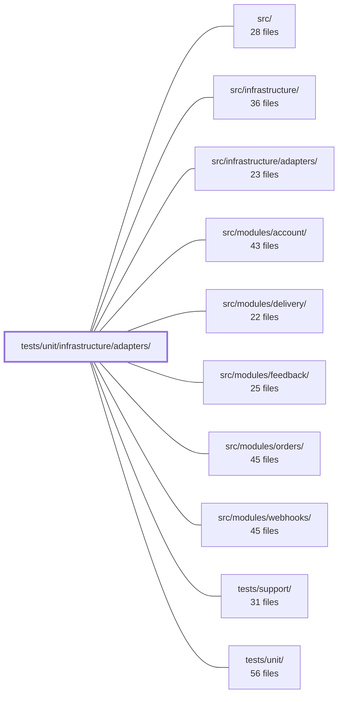

---
tags:
    - 2brain
    - 2brain/module
    - project/boilerplate-node-backend
type: module
module: tests/unit/infrastructure/adapters/
files: 20
updated: 2026-09-23T20:41:13.830561+00:00
---

# tests/unit/infrastructure/adapters/

## Purpose

Unit tests for every adapter in `src/infrastructure/adapters/`. Each test file isolates a single adapter (or a tightly coupled pair of adapters) and verifies its observable contract—decision logic, security invariants, and I/O boundaries—using mocks or real temp files where the property under test _is_ the filesystem interaction.

## Key parts

- **Antibot** (`antibot-providers/altcha.test.ts`, `antibot-providers/index.test.ts`, `antibot.test.ts`) — Covers the ALTCHA challenge/solve/verify round-trip, provider selection rules (default, named, unknown-name throw), and the `checkEmailPolicy` resolver (off / disposable / mx postures).
- **Mailer & email workers** (`mailer-*.test.ts`, `email.worker.test.ts`, `mail-spool.test.ts`, `demo-outbox.test.ts`) — The largest cluster. Guards SMTP transport config, the three-branch dispatch decision, template rendering across locales, spool-key-to-path resolution (traversal safety), attachment resolution, the worker's ack/dead-letter/requeue contract, and the demo-profile recording sink.
- **Image pipeline** (`image.test.ts`, `image-signatures.test.ts`, `image-store.test.ts`, `image.worker.test.ts`) — Magic-byte identification, sharp digest/thumbnail output, the `imageUrl`→path translation, and the digest worker's promotion/removal decision logic.
- **Filesystem & storage** (`filesystem.test.ts`, `cache.test.ts`) — Cross-device move, path normalization, directory reaping; Redis fail-open, key-prefixing, and `clearCache` exit-code semantics.
- **Infrastructure plumbing** (`logger.test.ts`, `managed-connection.test.ts`, `queue.test.ts`, `pdf.test.ts`) — Sensitive-field redaction and winston wiring; connection state-machine guarantees (single-flight, once-per-outage warning, shutdown close); RabbitMQ publish/confirm/consume topology; Puppeteer sandbox flags and teardown.

## How it connects

- **`src/infrastructure/adapters/`** is the module under test; every file here imports (or re-exports) one or more of its functions to assert behavior.
- **`src/infrastructure/`** and **`src/`** provide the port interfaces and shared types that the adapters implement; the tests exercise those contracts through the adapter surface.
- **`src/modules/account/`, `src/modules/delivery/`, `src/modules/feedback/`, `src/modules/orders/`, `src/modules/webhooks/`** are downstream consumers whose integration tests (in their own `tests/unit/…` directories) depend on the adapter contracts locked here. For example, the account module's email-verification spec relies on the `demo-outbox` recording behavior, and the delivery module's upload pipeline depends on the `filesystem` and `image-*` adapters.
- **`tests/support/`** supplies shared fakes (fake amqplib handle, mock sharp buffers, temp-directory helpers) that many of these test files import to keep assertions focused.
- **`tests/unit/`** is the parent directory; this module sits alongside `tests/unit/modules/…` and `tests/unit/infrastructure/…` as the adapter-specific slice.

## Where to start

1. **`mailer-dispatch.test.ts`** — It is the clearest example of the "decision-logic only" testing pattern used throughout this directory: three branches, explicit mocks, no I/O. Reading it first shows the idioms (fake broker, inline vs. enqueue, attachment cleanup) that recur in `email.worker.test.ts`, `image.worker.test.ts`, and `queue.test.ts`.
2. **`logger.test.ts`** — Security-critical and self-contained. It demonstrates how the suite pins down a security invariant (redaction) that is invisible to the type system, and the mutation-testing context explains _why_ the tests look the way they do. Useful mental model for evaluating the other adapter tests' rigor.

## Connected modules

[[boilerplate-node-backend_src|src/]] · [[boilerplate-node-backend_src_infrastructure|src/infrastructure/]] · [[boilerplate-node-backend_src_infrastructure_adapters|src/infrastructure/adapters/]] · [[boilerplate-node-backend_src_modules_account|src/modules/account/]] · [[boilerplate-node-backend_src_modules_delivery|src/modules/delivery/]] · [[boilerplate-node-backend_src_modules_feedback|src/modules/feedback/]] · [[boilerplate-node-backend_src_modules_orders|src/modules/orders/]] · [[boilerplate-node-backend_src_modules_webhooks|src/modules/webhooks/]] · [[boilerplate-node-backend_tests_support|tests/support/]] · [[boilerplate-node-backend_tests_unit|tests/unit/]]

## Files

- `tests/unit/infrastructure/adapters/antibot-providers/altcha.test.ts` — Unit tests for the self-hosted ALTCHA anti-bot provider. Exercises the full browser-equivalent flow (issue challenge → solve with the library's own solver → verify payload) and pins down the two critical refusal paths: replay of an already-consumed solution and verification against a mismatched or absent signing secret.
- `tests/unit/infrastructure/adapters/antibot-providers/index.test.ts` — Unit tests for the antibot provider selection logic. They verify the port's three selection rules—default to the no-op provider, pick a named implementation when the environment names one, and throw (not silently fall back) on an unrecognized name—plus the behavioral contract of the `none` provider itself.
- `tests/unit/infrastructure/adapters/antibot.test.ts` — Unit tests for `checkEmailPolicy` (the `NODE_ANTIBOT_EMAIL_POLICY` resolver). Verifies the three postures — off-by-default, `disposable`, and `mx` — including the allowlist / extra-denylist overrides and the DNS-MX lookup path, all without touching the network.
- `tests/unit/infrastructure/adapters/cache.test.ts` — Unit tests for the cache adapter (`@infrastructure/adapters/cache`). The file verifies the two invariants the adapter must uphold — **fail open** (every path resolves, never rejects, when Redis is unreachable) and **key prefixing** (every Redis key is namespaced so co-tenant deployments cannot collide) — and, critically, that `clearCache` distinguishes "nothing to clear" from "could not clear" so the `db:cache:clear` CLI can exit non-zero. It also covers the `getCacheValue` / `setCacheValue` read-write path and the tag-index bookkeeping that makes group invalidation possible.
- `tests/unit/infrastructure/adapters/demo-outbox.test.ts` — Unit tests for the demo profile's email sink (`demo-outbox` adapter). They pin down the recording, ordering, token-extraction, and attachment behaviour that the demo frontend's password-reset and verification specs depend on across repo boundaries.
- `tests/unit/infrastructure/adapters/email.worker.test.ts` — Unit tests for `handleEmailJob`, the email queue consumer. The SMTP side-effect is fully mocked so the tests exercise only the **decision logic**: which payloads are refused (→ `false`, dead-lettered), which failures are allowed to reject (→ requeued), and whether spooled attachments are discarded or preserved accordingly.
- `tests/unit/infrastructure/adapters/filesystem.test.ts` — Unit tests for the three exports of `@infrastructure/adapters/filesystem`: `moveFile`, `toPosixPath`, and `reapDirectory`. The suite exists to lock down filesystem-adapter behavior that the upload pipeline depends on—correct cross-device moves, path normalization, and safe directory cleanup—without requiring a real multi-device host.
- `tests/unit/infrastructure/adapters/image-signatures.test.ts` — Unit tests for the magic-byte image identification module. The file verifies that `identifyImage` and `identifyImageFile` recognise real image formats (PNG, JPEG, WebP) by their header bytes while rejecting everything else — including disguised payloads, RIFF-adjacent formats, truncated buffers, and corrupted headers. It also pins the file-I/O contract: only the header is read, and the filename/extension is never consulted.
- `tests/unit/infrastructure/adapters/image-store.test.ts` — Unit tests for `filesystemImageStore`, the sole module that translates `imageUrl` strings into filesystem paths. Tests use real files in a real temp directory (via `mkdtemp`) rather than mocking `node:fs`, because the critical property under test is _which_ path string gets passed to `unlink`/`writeFile`, not merely that a call was made.
- `tests/unit/infrastructure/adapters/image.test.ts` — Unit tests for the `digestImage` and `thumbnailImage` functions from the sharp adapter. Instead of mocking sharp, the tests generate real encoded buffers (via sharp's `create` pipeline) and assert on the actual output format, dimensions, and metadata presence. This ensures the adapter truly produces valid images rather than merely calling the right sharp methods.
- `tests/unit/infrastructure/adapters/image.worker.test.ts` — Unit tests for the image digest pipeline (`digestQuarantinedImage`, `handleImageDigestJob`, `enqueueImageDigest`) in `image.worker.ts`. It verifies the pipeline's **decision logic** — which files get promoted, removed, acked, dead-lettered, or requeued — while mocking out all I/O (sharp, store, queue, cache). The framing mirrors `email.worker.test.ts`: a three-outcome contract (ack / dead-letter / requeue) plus a fourth case unique to this pipeline (writeback mismatch requires file cleanup on both the queued and inline path).
- `tests/unit/infrastructure/adapters/logger.test.ts` — Unit tests for the shared logger adapter (`src/infrastructure/adapters/logger.ts`). This is the security-critical test suite that verifies sensitive-field redaction, error serialization, winston format wiring, and log-level/console-format resolution. A failure here means credentials leak into a log aggregator; the tests are written to close the specific gaps found by mutation testing (73 survivors at 25.74% kill rate).
- `tests/unit/infrastructure/adapters/mail-spool.test.ts` — Unit tests for the mail-spool adapter. The central concern is verifying that `resolveSpooled` acts as the single choke-point where a caller-supplied key is turned into a filesystem path, and that any traversal, absolute-path, or otherwise malformed key resolves to `undefined` rather than a path outside the spool root. Remaining tests cover the basic write/read/discard/reap lifecycle.
- `tests/unit/infrastructure/adapters/mailer-attachments.test.ts` — Unit tests for the attachment-resolving half of `nodemailer()` in the mailer adapter. Verifies that `{ filename, key }` attachment references are resolved to `{ filename, path }` via the mail spool, that absent/unresolvable attachments are omitted rather than passed as broken paths, and that `nodemailer()` itself never deletes the spooled file after a send.
- `tests/unit/infrastructure/adapters/mailer-dispatch.test.ts` — Unit tests for `enqueueEmail` in `mailer.ts`, covering the three-branch dispatch decision (no broker → send inline; broker OK → enqueue only; broker publish fails → fall back to inline) plus two edge cases: a _rejecting_ publish (contract violation, not a designed path) and attachment cleanup on inline sends. The file exists because the three-branch behavior was previously unasserted and a silent drop in any branch would be invisible to callers (the function always resolves `void`).
- `tests/unit/infrastructure/adapters/mailer-templates.test.ts` — Guards the email-template pipeline end-to-end: verifies that the EJS template directory and its files actually exist on disk, and that every template renders for every supported locale without leaking unresolved i18next keys. It exists because a wrong `EMAIL_TEMPLATES_DIR` or a missing translation key is invisible to the type system and to tests that mock the filesystem away.
- `tests/unit/infrastructure/adapters/mailer-transport.test.ts` — Unit tests for the SMTP transport configuration and transport-selection logic in the mailer adapter. The file exists to pin down security-critical invariants (TLS mode, test-environment isolation, demo-profile outbox protection) that are easy to regress silently and dangerous to get wrong.
- `tests/unit/infrastructure/adapters/managed-connection.test.ts` — Unit tests for the `manageConnection` adapter's state machine and lifecycle guarantees. The file exists to pin four load-bearing properties—never rejecting to callers, never opening a second connection while one is in flight, warning exactly once per outage, and closing on shutdown even when a handle is mid-open—against a fake handle, so they are verified once without Redis or a broker.
- `tests/unit/infrastructure/adapters/pdf.test.ts` — Unit tests for `renderHtmlToPdf` from the PDF adapter. The file verifies four externally observable contracts of the adapter—call-time env-var resolution, sandbox-flag configuration, `waitUntil: 'load'` on content injection, and guaranteed browser teardown—without launching a real browser. `puppeteer-core` is fully mocked.
- `tests/unit/infrastructure/adapters/queue.test.ts` — Unit tests for the RabbitMQ queue adapter (`@infrastructure/adapters/queue`). Verifies the enabled/disabled gate, publish confirm semantics, dead-letter topology wiring, consume/ack/nack flow, parked-counts reporting, and connection recovery—entirely against a hand-built `amqplib` mock with no real broker.

---

[[boilerplate-node-backend_INDEX|← boilerplate-node-backend index]]
