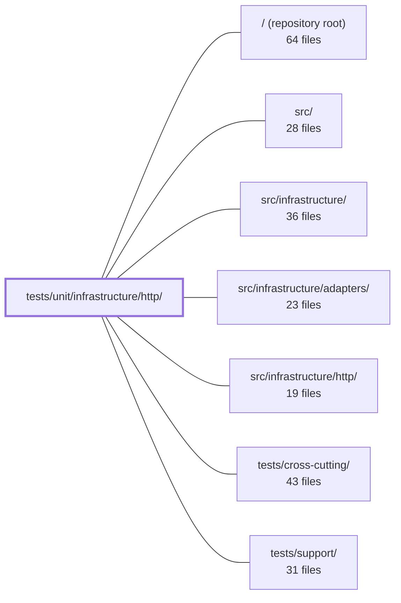

---
tags:
    - 2brain
    - 2brain/module
    - project/boilerplate-node-backend
type: module
module: tests/unit/infrastructure/http/
files: 19
updated: 2026-09-23T20:41:26.123262+00:00
---

# tests/unit/infrastructure/http/

## Purpose

This directory is the unit-test suite for the HTTP infrastructure layer (`src/infrastructure/http/`). It pins the contract of every middleware, helper, and error-mapping function that sits between a raw Express request and the application's domain logic, using only in-process mocks and no external services. Its goal is to catch regressions in the fast `npm test` cycle before they surface as incorrect status codes, leaked driver prose, or broken URLs in a live request.

## Key parts

- **Core request/response plumbing** — `request.test.ts` (the `readInput` funnel every controller uses), `response.test.ts` (success/reject envelope shape and status lockstep), `errors.test.ts` (driver/Mongoose error → `[httpCode, message]` mapping and `rejectDatabaseError` behaviour), `schemas.test.ts` (shared scalar query-param schemas), and `validation-messages.test.ts` (Zod global error-map i18n copy).
- **Middleware contracts** — one test file per Express middleware in `middlewares/`: `cache`, `human-challenge`, `idempotency` (fingerprint canonicalisation), `locale` (negotiation + AsyncLocalStorage), `quarantine-uploaded-images`, `rate-limit` (budget constants), `rate-limit-store` (single-`connect` invariant), `rate-limit-store-selection` (factory / fail-open), `request-logger`, `route-flag`, and `upload` (five security helpers).
- **Upload & link helpers** — `uploads.test.ts` (multer-shape collapse, no filesystem-path leakage) and `frontend-link.test.ts` (the single builder behind every confirmation URL the app emails).
- **Test-infrastructure guard** — `router-internals.test.ts` pins the undocumented Express `Router.stack` structures that `tests/support/routes.ts` relies on, so an Express upgrade fails one test instead of cascading.

## How it connects

- **`src/infrastructure/http/`** — the module under test; every file here imports and exercises its public exports.
- **`src/infrastructure/adapters/`** — stubbed at the boundary in middleware tests (e.g., Redis cache transport, `RedisStore` class-level mock) so the suite runs without a live adapter.
- **`tests/support/`** — `router-internals.test.ts` exists specifically to protect the Express internals that `tests/support/routes.ts` unpacks; if that helper breaks, this test fails first with a clear message.
- **`tests/cross-cutting/`** — complementary contract and cluster suites (real-database idempotency 409/422/replay, Redis-backed rate-limiting) that this directory intentionally does not duplicate; the unit files here scope to pure logic and the HTTP contract, leaving I/O to those suites.

## Where to start

Read **`request.test.ts`** first — it documents the single entry point (`readInput`) that every controller calls, so understanding its source-precedence and edge-case rules gives you the shape of "how a request arrives." Then read **`response.test.ts`** to see the matching exit contract (envelope shape, status-to-code mapping, the "status written twice" invariant). Together they frame the full request→response lifecycle that every other test in this directory extends.

## Connected modules

[[boilerplate-node-backend_ROOT|/ (repository root)]] · [[boilerplate-node-backend_src|src/]] · [[boilerplate-node-backend_src_infrastructure|src/infrastructure/]] · [[boilerplate-node-backend_src_infrastructure_adapters|src/infrastructure/adapters/]] · [[boilerplate-node-backend_src_infrastructure_http|src/infrastructure/http/]] · [[boilerplate-node-backend_tests_cross-cutting|tests/cross-cutting/]] · [[boilerplate-node-backend_tests_support|tests/support/]]

## Files

- `tests/unit/infrastructure/http/errors.test.ts` — Unit tests for the HTTP error-interpretation layer (`databaseErrorInterpreter` and `rejectDatabaseError`). The suite pins the mapping from driver/Mongoose error shapes to `[httpCode, message]` tuples and verifies that `rejectDatabaseError` sends the correct status, a safe response body, and a developer-facing log line. Each branch is motivated by a real incident where a client error was reported as a 500 or the response body leaked driver prose and user data.
- `tests/unit/infrastructure/http/frontend-link.test.ts` — Unit tests for the `frontendLink` builder — the single function that produces every confirmation URL the app emails (verify, reset, delete, email-change, order). Because all flows share this one builder, a regression here breaks every outbound link simultaneously, which is why coverage is thorough across kinds, locales, and configuration paths.
- `tests/unit/infrastructure/http/middlewares/cache.test.ts` — Unit tests for the HTTP response-cache middleware. The file exercises key generation, header emission, envelope parsing, TTL clamping, the size gate, and the refresh-ahead path against the **real** middleware implementations, stubbing only the Redis transport (`@infrastructure/adapters/cache`) and the logger so the tests stay quiet.
- `tests/unit/infrastructure/http/middlewares/human-challenge.test.ts` — Unit tests for the `humanChallengeGate` Express middleware (rung 3 of the anti-bot stack). This suite owns the **HTTP contract** around provider delegation: which header is inspected, what status a refusal returns, and the invariant that when the gate is off the middleware is a zero-cost pass-through (not even a header lookup). Provider-selection logic is explicitly out of scope here.
- `tests/unit/infrastructure/http/middlewares/idempotency.test.ts` — Unit tests for the `idempotencyKey` middleware's body-fingerprint (canonicalization) logic. Verifies that logically-equal request bodies produce the same fingerprint and different bodies do not, exercised through the middleware's public call with the database model fully mocked. Real-database outcomes (409 conflict, 422 rejection, replay delivery) are intentionally left to the contract test suite.
- `tests/unit/infrastructure/http/middlewares/locale.test.ts` — Unit tests for the `attachLocale` Express middleware. Verifies that locale negotiation, AsyncLocalStorage context propagation, response header setting, and `Vary` header behaviour all work correctly, including edge cases around malformed `Accept-Language` headers and deliberate behavioural differences from a previous hand-rolled parser.
- `tests/unit/infrastructure/http/middlewares/quarantine-uploaded-images.test.ts` — Unit tests for the `quarantineUploadedImages` Express middleware. They verify that a multer-staged upload is either committed to the image store (broker ready) or digested inline (broker not ready), and that every failure path—store rejection, partial multi-file failure, cleanup rejection, digest rejection—resolves through `next()` with an error rather than hanging the request.
- `tests/unit/infrastructure/http/middlewares/rate-limit-store-selection.test.ts` — Unit tests for the `rateLimitStore` factory, verifying which store is selected (in-process `MemoryStore` vs. `RedisStore`), URL-resolution priority, lazy construction, the missing-configuration alert, and the init-failure fail-open path. It is deliberately split from `rate-limit-store.test.ts` because this file mocks `RedisStore` at the class level, while the sibling drives a real `RedisStore` against a fake low-level redis client to exercise the `connecting`-promise handshake.
- `tests/unit/infrastructure/http/middlewares/rate-limit-store.test.ts` — Unit test that guards the "one `connect()` per socket" invariant on the rate-limiter's Redis client. It reproduces the exact race that `RedisStore.init()` triggers (two back-to-back Lua script loads before the handshake resolves) and asserts that concurrent commands share a single connection rather than destroying the shared client. Runs with no Redis, no container, and no cluster — the fast gate a contributor hits in `npm test`, complementing the slower `tests/cluster/rate-limit.test.ts`.
- `tests/unit/infrastructure/http/middlewares/rate-limit.test.ts` — Unit test that pins the four global rate-limit budget constants (browsing window, browsing max, API-key max, upload max) and asserts their relative sizing. It exists so that any future change to these shared defaults is caught at the unit level, independent of the behavioral (request-through-middleware) tests.
- `tests/unit/infrastructure/http/middlewares/request-logger.test.ts` — Unit tests for the `requestLogger` Express middleware. They verify that the middleware calls `next()` synchronously, defers logging until the `finish` event fires, selects the correct log level by status code, emits a fixed set of slim metadata fields (no sensitive data), and guards against duplicate logging if `finish` is emitted more than once.
- `tests/unit/infrastructure/http/middlewares/route-flag.test.ts` — Unit tests for the `routeFlag` middleware, which writes a flag value onto `request.params` so that route patterns differing only in how they express a boolean (path segment vs. query param) can share a single controller input declaration. The file pins the middleware's own contract in isolation; the broader "express carries the mutated `params` through the handler chain" behaviour is covered by the products/users integration suites.
- `tests/unit/infrastructure/http/middlewares/upload.test.ts` — Unit tests for the five exported helpers in the upload middleware (`maxUploadBytes`, `resolveUploadDestination`, `resolveUploadFilename`, `fileFilter`, `validateUploadedImages`). They pin down the upload security guarantees—field whitelisting, server-generated filenames, MIME filtering, and content-type verification—by asserting observable behaviour rather than implementation details, so a refactor that preserves the guarantees keeps these green.
- `tests/unit/infrastructure/http/request.test.ts` — Unit tests for `readInput` (and its sibling helpers) in `@infrastructure/http/request`. Every controller funnels through `readInput`, yet integration/contract suites never exercise its edge cases in isolation. This file pins each rule the function encodes—source precedence per surface, ID extraction semantics, multipart-only transport decoding, and the express-5 "body is `undefined`" path—so regressions are caught at the unit level rather than surfacing as a 500 in a real request.
- `tests/unit/infrastructure/http/response.test.ts` — Unit tests for the response-envelope helpers in `src/infrastructure/http/response.ts`. They pin the public API contract: the shape of success/reject payloads, the status-to-code mapping, the guarantee that `errors` is never empty on a failure, and the "status written twice" convention that keeps the HTTP status and body status in lockstep.
- `tests/unit/infrastructure/http/router-internals.test.ts` — Pins the shape of undocumented Express router internals (`Router.stack`, `layer.route.methods`, `route.stack[].handle`) that `tests/support/routes.ts` depends on. If Express ever changes these private structures, this single test fails with clear context instead of letting all twelve `routes.test.ts` suites cascade into cryptic `undefined` errors.
- `tests/unit/infrastructure/http/schemas.test.ts` — Unit tests for the shared scalar schemas in `@infrastructure/http/schemas`. Each schema exists to guarantee that the same query-string input yields one consistent answer across every endpoint—preventing divergence where, for example, `?hardDelete=false` could be read as "present → true" on one route and "explicitly false" on another.
- `tests/unit/infrastructure/http/uploads.test.ts` — Unit tests for the two upload-helper functions exported by `src/infrastructure/http/uploads.ts`. The file exists to lock in two invariants: (1) `getFormFiles` collapses all three multer shapes into one uniform array-or-undefined result, and (2) `readUploadedImage` returns only store-recorded URLs and never leaks a filesystem path into `imageUrl`.
- `tests/unit/infrastructure/http/validation-messages.test.ts` — Verifies that Zod's global error map — installed once via `registerValidationMessages` — emits the project's English i18n copy for every validation failure it handles. The file drives real schema parses (not the mapper directly) because that is the only path a request takes, and its central concern is catching the silent case where a message falls back to Zod's built-in English and looks like a valid message rather than a bug.

---

[[boilerplate-node-backend_INDEX|← boilerplate-node-backend index]]
