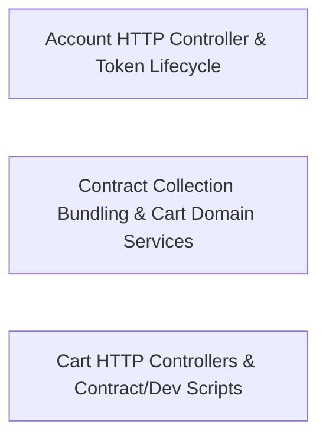

---
tags:
  - 2repo
  - 2repo/arch
  - project/boilerplate-node-backend
type: architecture
component: App_Assembly_Core_Global_Error_Pipeline
---

## Details

The composition root of the Express application. Mounts the global error handler after all routes, registers process-level uncaughtException / unhandledRejection audit hooks, and exposes the contract-bundling configuration that drives the generated Bruno/Insomnia/Mockoon/Postman collections. This is the wiring half of the subsystem — the place where the app is assembled and where the safety net for the synchronous request path is installed.

### Account HTTP Controller & Token Lifecycle
The account module's synchronous request path. A set of thin HTTP controllers (signup, login/logout, session & address reads, password reset, verification, profile update, account deletion) that delegate to the account services and the users token model. This is the primary 'safety-net' surface for the synchronous request path — every handler funnels through the shared error pipeline and token lifecycle (tokenAdd / tokenRemoveAll).

**Related Classes/Methods**:

- `src.modules.account.controllers.post-signup.postSignup`:17-69
- `src.modules.account.controllers.post-logout.postLogout`:21-33
- `src.modules.account.controllers.delete-account-confirm.deleteAccountConfirm`:22-52
- `src.modules.users.model.tokenAdd`:346-366
- `src.modules.account.controllers.get-sessions.getSessions`:16-28

**Source Files:**

- `src/app/system-routes.ts`
  - `src.app.system-routes.router.get('/') callback` (L7-L9) - Function
- `src/globals.d.ts`
  - `src.globals.d.'express-serve-static-core'.Request` (L5-L23) - Interface
- `src/infrastructure/http/controller.ts`
  - `src.infrastructure.http.controller.ServiceResult` (L33-L39) - Interface
- `src/infrastructure/observability/dependency-health.ts`
  - `src.infrastructure.observability.dependency-health.DependencyHealth` (L52-L56) - Interface
- `src/modules/account/analytics.ts`
  - `src.modules.account.analytics.'@infrastructure/observability/analytics'.AnalyticsEventMap` (L28-L30) - Interface
- `src/modules/account/audit.ts`
  - `src.modules.account.audit.'@infrastructure/observability/audit'.AuditActionMap` (L32-L34) - Interface
- `src/modules/account/controllers/delete-account-confirm.ts`
  - `src.modules.account.controllers.delete-account-confirm.deleteAccountConfirm` (L22-L52) - Class
  - `src.modules.account.controllers.delete-account-confirm.deleteAccountConfirm.then() callback` (L33-L50) - Function
  - `src.modules.account.controllers.delete-account-confirm.deleteAccountConfirm.then() callback.then() callback` (L45-L49) - Function
  - `src.modules.account.controllers.delete-account-confirm.deleteAccountConfirm.catch() callback` (L51-L51) - Function
- `src/modules/account/controllers/get-account.ts`
  - `src.modules.account.controllers.get-account.getAccount` (L16-L30) - Class
  - `src.modules.account.controllers.get-account.getAccount.then() callback` (L24-L28) - Function
  - `src.modules.account.controllers.get-account.getAccount.catch() callback` (L29-L29) - Function
- `src/modules/account/controllers/get-addresses.ts`
  - `src.modules.account.controllers.get-addresses.getAddresses` (L14-L24) - Class
  - `src.modules.account.controllers.get-addresses.getAddresses.then() callback` (L20-L22) - Function
- `src/modules/account/controllers/get-sessions.ts`
  - `src.modules.account.controllers.get-sessions.getSessions` (L16-L28) - Class
  - `src.modules.account.controllers.get-sessions.getSessions.then() callback` (L23-L26) - Function
- `src/modules/account/controllers/post-logout.ts`
  - `src.modules.account.controllers.post-logout.postLogout` (L21-L33) - Class
  - `src.modules.account.controllers.post-logout.postLogout.then() callback` (L26-L31) - Function
- `src/modules/account/controllers/post-reset-request.ts`
  - `src.modules.account.controllers.post-reset-request.postResetRequest` (L32-L62) - Class
  - `src.modules.account.controllers.post-reset-request.postResetRequest.catch() callback` (L46-L46) - Function
  - `src.modules.account.controllers.post-reset-request.postResetRequest.then() callback` (L47-L60) - Function
- `src/modules/account/controllers/post-signup.ts`
  - `src.modules.account.controllers.post-signup.postSignup` (L17-L69) - Class
  - `src.modules.account.controllers.post-signup.postSignup.then() callback` (L45-L63) - Function
  - `src.modules.account.controllers.post-signup.postSignup.then() callback.then() callback` (L47-L50) - Function
  - `src.modules.account.controllers.post-signup.postSignup.catch() callback` (L64-L68) - Function
- `src/modules/account/controllers/post-verify-confirm.ts`
  - `src.modules.account.controllers.post-verify-confirm.postVerifyConfirm` (L22-L66) - Class
  - `src.modules.account.controllers.post-verify-confirm.postVerifyConfirm.then() callback` (L42-L61) - Function
  - `src.modules.account.controllers.post-verify-confirm.postVerifyConfirm.then() callback.then() callback` (L48-L60) - Function
  - `src.modules.account.controllers.post-verify-confirm.postVerifyConfirm.then() callback.then() callback.then() callback` (L56-L59) - Function
  - `src.modules.account.controllers.post-verify-confirm.postVerifyConfirm.catch() callback` (L62-L65) - Function
- `src/modules/account/controllers/post-verify-request.ts`
  - `src.modules.account.controllers.post-verify-request.postVerifyRequest` (L15-L26) - Class
  - `src.modules.account.controllers.post-verify-request.postVerifyRequest.then() callback` (L21-L24) - Function
- `src/modules/account/controllers/put-account.ts`
  - `src.modules.account.controllers.put-account.putAccount` (L20-L66) - Class
  - `src.modules.account.controllers.put-account.putAccount.then() callback` (L45-L61) - Function
  - `src.modules.account.controllers.put-account.putAccount.then() callback.then() callback` (L47-L49) - Function
  - `src.modules.account.controllers.put-account.putAccount.catch() callback` (L62-L65) - Function
- `src/modules/account/controllers/write-addresses.ts`
  - `src.modules.account.controllers.write-addresses.postAddress` (L30-L47) - Class
  - `src.modules.account.controllers.write-addresses.postAddress.then() callback` (L42-L45) - Function
- `src/modules/account/services/addresses.ts`
  - `src.modules.account.services.addresses.addressUpdate` (L60-L68) - Class
  - `src.modules.account.services.addresses.addressUpdate.then() callback` (L65-L68) - Function
- `src/modules/account/services/profile.ts`
  - `src.modules.account.services.profile.removeOwnAccount` (L167-L204) - Class
  - `src.modules.account.services.profile.removeOwnAccount.then() callback` (L178-L203) - Function
  - `src.modules.account.services.profile.updateProfile` (L240-L273) - Class
  - `src.modules.account.services.profile.passwordChangeWithCurrent` (L287-L324) - Class
  - `src.modules.account.services.profile.outcome.then() callback` (L302-L312) - Function
- `src/modules/account/services/tokens.ts`
  - `src.modules.account.services.tokens.sessionsList` (L120-L133) - Class
  - `src.modules.account.services.tokens.sessionsList.then() callback` (L125-L133) - Function
  - `src.modules.account.services.tokens.sessionsList.then() callback.sessions.user.tokens.filter() callback` (L129-L129) - Function
  - `src.modules.account.services.tokens.sessionsList.then() callback.sessions.map() callback` (L130-L130) - Function
- `src/modules/account/services/verification.ts`
  - `src.modules.account.services.verification.sendVerificationEmail` (L46-L66) - Class
  - `src.modules.account.services.verification.sendVerificationEmail.then() callback` (L50-L66) - Function
  - `src.modules.account.services.verification.requestEmailVerification` (L76-L87) - Class
  - `src.modules.account.services.verification.requestEmailVerification.then() callback` (L80-L87) - Function
  - `src.modules.account.services.verification.requestEmailVerificationFor` (L103-L115) - Class
  - `src.modules.account.services.verification.requestEmailVerificationFor.then() callback` (L108-L115) - Function
  - `src.modules.account.services.verification.requestEmailVerificationFor.then() callback.then() callback` (L112-L113) - Function
  - `src.modules.account.services.verification.completeEmailVerification` (L125-L141) - Class
  - `src.modules.account.services.verification.completeEmailVerification.then() callback` (L130-L140) - Function
- `src/modules/audit-logs/repository.ts`
  - `src.modules.audit-logs.repository.AuditLogSearchFilters` (L14-L22) - Interface
- `src/modules/cart/analytics.ts`
  - `src.modules.cart.analytics.'@infrastructure/observability/analytics'.AnalyticsEventMap` (L39-L41) - Interface
- `src/modules/cart/audit.ts`
  - `src.modules.cart.audit.'@infrastructure/observability/audit'.AuditActionMap` (L18-L20) - Interface
- `src/modules/delivery/audit.ts`
  - `src.modules.delivery.audit.'@infrastructure/observability/audit'.AuditActionMap` (L14-L16) - Interface
- `src/modules/delivery/model.ts`
  - `src.modules.delivery.model.ShipmentDocument` (L18-L26) - Interface
- `src/modules/feedback/audit.ts`
  - `src.modules.feedback.audit.'@infrastructure/observability/audit'.AuditActionMap` (L17-L19) - Interface
- `src/modules/feedback/model.ts`
  - `src.modules.feedback.model.FeedbackRequestDocument` (L9-L14) - Interface
- `src/modules/inventory/audit.ts`
  - `src.modules.inventory.audit.'@infrastructure/observability/audit'.AuditActionMap` (L22-L24) - Interface
- `src/modules/inventory/domain/transitions.ts`
  - `src.modules.inventory.domain.transitions.CounterDelta` (L22-L25) - Interface
- `src/modules/inventory/events.ts`
  - `src.modules.inventory.events.'@kernel/events'.DomainEventMap` (L15-L27) - Interface
- `src/modules/locales/audit.ts`
  - `src.modules.locales.audit.'@infrastructure/observability/audit'.AuditActionMap` (L37-L39) - Interface
- `src/modules/observability/controllers/get-observability-metrics-overview.ts`
  - `src.modules.observability.controllers.get-observability-metrics-overview.getObservabilityMetricsOverview.then() callback.inFlight` (L74-L74) - Class
  - `src.modules.observability.controllers.get-observability-metrics-overview.getObservabilityMetricsOverview.then() callback.inFlight.inflightMetric.values.reduce() callback` (L74-L74) - Function
- `src/modules/observability/routes.ts`
  - `src.modules.observability.routes.router.get('/metrics') callback` (L28-L38) - Function
- `src/modules/orders/analytics.ts`
  - `src.modules.orders.analytics.'@infrastructure/observability/analytics'.AnalyticsEventMap` (L35-L37) - Interface
- `src/modules/orders/audit.ts`
  - `src.modules.orders.audit.'@infrastructure/observability/audit'.AuditActionMap` (L27-L29) - Interface
- `src/modules/orders/events.ts`
  - `src.modules.orders.events.'@kernel/events'.DomainEventMap` (L15-L33) - Interface
- `src/modules/payments/analytics.ts`
  - `src.modules.payments.analytics.'@infrastructure/observability/analytics'.AnalyticsEventMap` (L28-L30) - Interface
- `src/modules/payments/audit.ts`
  - `src.modules.payments.audit.'@infrastructure/observability/audit'.AuditActionMap` (L19-L21) - Interface
- `src/modules/payments/model.ts`
  - `src.modules.payments.model.PaymentDocument` (L26-L40) - Interface
- `src/modules/payments/providers/card.ts`
  - `src.modules.payments.providers.card.CardDetails` (L8-L10) - Interface
- `src/modules/products/analytics.ts`
  - `src.modules.products.analytics.'@infrastructure/observability/analytics'.AnalyticsEventMap` (L26-L28) - Interface
- `src/modules/products/audit.ts`
  - `src.modules.products.audit.'@infrastructure/observability/audit'.AuditActionMap` (L16-L18) - Interface
- `src/modules/products/events.ts`
  - `src.modules.products.events.'@kernel/events'.DomainEventMap` (L9-L18) - Interface
- `src/modules/users/analytics.ts`
  - `src.modules.users.analytics.'@infrastructure/observability/analytics'.AnalyticsEventMap` (L29-L31) - Interface
- `src/modules/users/audit.ts`
  - `src.modules.users.audit.'@infrastructure/observability/audit'.AuditActionMap` (L16-L18) - Interface
- `src/modules/users/events.ts`
  - `src.modules.users.events.'@kernel/events'.DomainEventMap` (L9-L22) - Interface
- `src/modules/users/model.ts`
  - `src.modules.users.model.tokenAdd` (L346-L366) - Function
  - `src.modules.users.model.tokenRemoveAll` (L371-L381) - Function
- `src/modules/wishlist/analytics.ts`
  - `src.modules.wishlist.analytics.'@infrastructure/observability/analytics'.AnalyticsEventMap` (L27-L29) - Interface
- `src/types/auth-context.ts`
  - `src.types.auth-context.AuthContext` (L6-L12) - Interface

### Contract Collection Bundling & Cart Domain Services
The contract-bundling configuration that drives the generated client collections, coupled with the cart module's domain service/repository layer. client-collections-bundle.ts reads the OpenAPI section paths and the seed dataset to produce usable, value-populated request bodies for Bruno/Insomnia/Mockoon/Postman. Alongside it, the cart services (checkout, items, reorder) and repository (upsertLine) implement the cart's business rules, with cross-module seams into wishlist (wishlistMoveToCart), inventory (postReceipt), and locales (derivesBaseLanguage).

**Related Classes/Methods**:

- `scripts.contracts.client-collections-bundle.values`:76-206
- `src.modules.cart.repository.upsertLine`:31-65
- `src.modules.inventory.controllers.post-receipt.postReceipt`:13-25

**Source Files:**

- `scripts/contracts/client-collections-bundle.ts`
  - `scripts.contracts.client-collections-bundle.values` (L76-L206) - Class
  - `scripts.contracts.client-collections-bundle.values.pathParam` (L169-L179) - Method
  - `scripts.contracts.client-collections-bundle.values.tokens.seedSoftDeletedProductId.seedProducts.find() callback` (L201-L201) - Function
  - `scripts.contracts.client-collections-bundle.values.tokens.seedInactiveProductId.seedProducts.find() callback` (L203-L203) - Function
  - `scripts.contracts.client-collections-bundle.values.tokens.seedDeletedOrderId.seedOrders.find() callback` (L204-L204) - Function
- `src/modules/cart/repository.ts`
  - `src.modules.cart.repository.upsertLine` (L31-L65) - Class
  - `src.modules.cart.repository.upsertLine.then() callback` (L51-L59) - Function
  - `src.modules.cart.repository.upsertLine.catch() callback` (L61-L64) - Function
- `src/modules/cart/services/checkout.ts`
  - `src.modules.cart.services.checkout.then() callback` (L93-L268) - Function
  - `src.modules.cart.services.checkout.<function>.then() callback.then() callback.then() callback.then() callback.then() callback` (L255-L255) - Function
- `src/modules/cart/services/items.ts`
  - `src.modules.cart.services.items.upsertCartItem` (L87-L100) - Class
  - `src.modules.cart.services.items.upsertCartItem.then() callback` (L93-L100) - Function
  - `src.modules.cart.services.items.upsertCartItem.then() callback.then() callback` (L99-L99) - Function
- `src/modules/cart/services/reorder.ts`
  - `src.modules.cart.services.reorder.reorderIntoCart` (L67-L139) - Class
  - `src.modules.cart.services.reorder.reorderIntoCart.<function>` (L74-L121) - Function
  - `src.modules.cart.services.reorder.reorderIntoCart.<function>.then() callback` (L98-L120) - Function
  - `src.modules.cart.services.reorder.reorderIntoCart.<function>.then() callback.then() callback` (L119-L119) - Function
  - `src.modules.cart.services.reorder.reorderIntoCart.catch() callback` (L122-L122) - Function
- `src/modules/inventory/controllers/post-receipt.ts`
  - `src.modules.inventory.controllers.post-receipt.postReceipt` (L13-L25) - Class
  - `src.modules.inventory.controllers.post-receipt.postReceipt.then() callback` (L20-L23) - Function
- `src/modules/locales/model.ts`
  - `src.modules.locales.model.derivesBaseLanguage` (L131-L133) - Function
- `src/modules/locales/module.ts`
  - `src.modules.locales.module.registerLocaleOverrideProvider() callback` (L70-L70) - Function
- `src/modules/observability/controllers/get-observability-metrics-overview.ts`
  - `src.modules.observability.controllers.get-observability-metrics-overview.MetricSample` (L13-L16) - Interface
  - `src.modules.observability.controllers.get-observability-metrics-overview.sumByLabel` (L40-L41) - Class
  - `src.modules.observability.controllers.get-observability-metrics-overview.sumByLabel.reduce() callback` (L41-L41) - Function
  - `src.modules.observability.controllers.get-observability-metrics-overview.sumByLabel.values.filter() callback` (L41-L41) - Function
  - `src.modules.observability.controllers.get-observability-metrics-overview.getObservabilityMetricsOverview` (L47-L121) - Class
  - `src.modules.observability.controllers.get-observability-metrics-overview.getObservabilityMetricsOverview.then() callback` (L62-L119) - Function
  - `src.modules.observability.controllers.get-observability-metrics-overview.getObservabilityMetricsOverview.then() callback.data.business.ordersCreated.orderValues.reduce() callback` (L91-L91) - Function
  - `src.modules.observability.controllers.get-observability-metrics-overview.getObservabilityMetricsOverview.then() callback.data.business.lowStockProducts.lowStockValues.reduce() callback` (L92-L92) - Function
  - `src.modules.observability.controllers.get-observability-metrics-overview.getObservabilityMetricsOverview.then() callback.data.business.reservedUnits.reservedValues.reduce() callback` (L93-L93) - Function
- `src/modules/users/controllers/get-users.ts`
  - `src.modules.users.controllers.get-users.queryBoolean` (L26-L29) - Class
  - `src.modules.users.controllers.get-users.queryBoolean.z.preprocess() callback` (L27-L27) - Function
- `src/modules/users/model.ts`
  - `src.modules.users.model.zodUserSchema.email.error` (L137-L137) - Method
  - `src.modules.users.model.zodUserSchema.username.error` (L142-L142) - Method
  - `src.modules.users.model.zodUserSchema.password.error` (L147-L147) - Method
- `src/modules/wishlist/controllers/delete-wishlist-item.ts`
  - `src.modules.wishlist.controllers.delete-wishlist-item.deleteWishlistItem` (L13-L27) - Class
  - `src.modules.wishlist.controllers.delete-wishlist-item.deleteWishlistItem.then() callback` (L21-L25) - Function
- `src/modules/wishlist/controllers/get-wishlist.ts`
  - `src.modules.wishlist.controllers.get-wishlist.getWishlist` (L12-L19) - Class
  - `src.modules.wishlist.controllers.get-wishlist.getWishlist.then() callback` (L15-L17) - Function
- `src/modules/wishlist/controllers/post-move-to-cart.ts`
  - `src.modules.wishlist.controllers.post-move-to-cart.postMoveToCart` (L14-L28) - Class
  - `src.modules.wishlist.controllers.post-move-to-cart.postMoveToCart.then() callback` (L22-L26) - Function
- `src/modules/wishlist/controllers/post-wishlist.ts`
  - `src.modules.wishlist.controllers.post-wishlist.postWishlist` (L15-L36) - Class
  - `src.modules.wishlist.controllers.post-wishlist.postWishlist.then() callback` (L30-L34) - Function

### Cart HTTP Controllers & Contract/Dev Scripts
The cart module's HTTP controller surface (read cart/summary, add/update/delete items, checkout, reorder) plus the developer/contract tooling scripts that regenerate artifacts, check the mutation baseline, and report heap summaries. This group pairs the synchronous cart request path with the pipeline scripts that keep the generated contract artifacts and quality baselines in sync — the 'regenerate & validate' half of the contract-first workflow.

**Related Classes/Methods**:

- `src.modules.cart.controllers.post-cart.postCart`:18-43
- `src.modules.cart.controllers.post-checkout.postCheckout`:23-49
- `src.modules.cart.controllers.get-cart-summary.getCartSummary`:11-18
- `scripts.regenerate-artifacts.Step`:31-36

**Source Files:**

- `scripts/check-mutation-baseline.ts`
  - `scripts.check-mutation-baseline.counts.held.comparisons.filter() callback` (L40-L40) - Function
  - `scripts.check-mutation-baseline.counts.improved.comparisons.filter() callback` (L41-L41) - Function
  - `scripts.check-mutation-baseline.counts.regressed.comparisons.filter() callback` (L42-L42) - Function
  - `scripts.check-mutation-baseline.counts.added.comparisons.filter() callback` (L43-L43) - Function
  - `scripts.check-mutation-baseline.counts.removed.comparisons.filter() callback` (L44-L44) - Function
  - `scripts.check-mutation-baseline.map() callback` (L70-L70) - Function
  - `scripts.check-mutation-baseline.comparisons.filter() callback` (L94-L94) - Function
- `scripts/regenerate-artifacts.ts`
  - `scripts.regenerate-artifacts.Step` (L31-L36) - Interface
- `scripts/report-heap-summary.ts`
  - `scripts.report-heap-summary.streamArray('strings') callback` (L174-L181) - Function
- `src/modules/cart/controllers/delete-cart-item.ts`
  - `src.modules.cart.controllers.delete-cart-item.deleteCartItem` (L19-L42) - Class
  - `src.modules.cart.controllers.delete-cart-item.deleteCartItem.then() callback` (L37-L40) - Function
- `src/modules/cart/controllers/delete-cart.ts`
  - `src.modules.cart.controllers.delete-cart.deleteCart` (L11-L20) - Class
  - `src.modules.cart.controllers.delete-cart.deleteCart.then() callback` (L16-L18) - Function
- `src/modules/cart/controllers/get-cart-summary.ts`
  - `src.modules.cart.controllers.get-cart-summary.getCartSummary` (L11-L18) - Class
  - `src.modules.cart.controllers.get-cart-summary.getCartSummary.then() callback` (L14-L16) - Function
- `src/modules/cart/controllers/get-cart.ts`
  - `src.modules.cart.controllers.get-cart.getCart` (L12-L19) - Class
  - `src.modules.cart.controllers.get-cart.getCart.then() callback` (L15-L17) - Function
- `src/modules/cart/controllers/post-cart.ts`
  - `src.modules.cart.controllers.post-cart.postCart` (L18-L43) - Class
  - `src.modules.cart.controllers.post-cart.postCart.then() callback` (L37-L41) - Function
- `src/modules/cart/controllers/post-checkout.ts`
  - `src.modules.cart.controllers.post-checkout.postCheckout` (L23-L49) - Class
  - `src.modules.cart.controllers.post-checkout.postCheckout.then() callback` (L32-L41) - Function
  - `src.modules.cart.controllers.post-checkout.postCheckout.catch() callback` (L42-L48) - Function
- `src/modules/cart/controllers/post-reorder.ts`
  - `src.modules.cart.controllers.post-reorder.postReorder` (L15-L27) - Class
  - `src.modules.cart.controllers.post-reorder.postReorder.then() callback` (L21-L25) - Function
- `src/modules/cart/controllers/put-cart-item.ts`
  - `src.modules.cart.controllers.put-cart-item.putCartItem` (L23-L49) - Class
  - `src.modules.cart.controllers.put-cart-item.putCartItem.then() callback` (L43-L47) - Function
- `src/modules/orders/controllers/post-cancel-order.ts`
  - `src.modules.orders.controllers.post-cancel-order.postCancelOrder` (L20-L43) - Class
  - `src.modules.orders.controllers.post-cancel-order.postCancelOrder.then() callback` (L33-L42) - Function
- `src/modules/orders/controllers/write-orders.ts`
  - `src.modules.orders.controllers.write-orders.writeOrders` (L23-L89) - Class
  - `src.modules.orders.controllers.write-orders.then() callback` (L55-L66) - Function
  - `src.modules.orders.controllers.write-orders.writeOrders.then() callback` (L83-L87) - Function
- `src/modules/orders/service.ts`
  - `src.modules.orders.service.remove` (L365-L390) - Class
  - `src.modules.orders.service.remove.then() callback` (L389-L389) - Function
  - `src.modules.orders.service.removeById` (L399-L406) - Class
  - `src.modules.orders.service.removeById.then() callback` (L403-L406) - Function
- `src/modules/payments/controllers/post-payment-confirm.ts`
  - `src.modules.payments.controllers.post-payment-confirm.postPaymentConfirm.then() callback.declined` (L30-L31) - Class
  - `src.modules.payments.controllers.post-payment-confirm.postPaymentConfirm.then() callback.declined.result.errors.some() callback` (L31-L31) - Function
- `src/modules/payments/controllers/post-payment-intent.ts`
  - `src.modules.payments.controllers.post-payment-intent.postPaymentIntent` (L15-L26) - Class
  - `src.modules.payments.controllers.post-payment-intent.postPaymentIntent.then() callback` (L21-L24) - Function
- `src/modules/payments/controllers/post-payment-refund.ts`
  - `src.modules.payments.controllers.post-payment-refund.postPaymentRefund` (L13-L20) - Class
  - `src.modules.payments.controllers.post-payment-refund.postPaymentRefund.then() callback` (L16-L19) - Function
- `src/modules/products/controllers/get-products.ts`
  - `src.modules.products.controllers.get-products.searchProductsQuerySchema.minPrice.z.preprocess() callback` (L34-L34) - Function
  - `src.modules.products.controllers.get-products.searchProductsQuerySchema.maxPrice.z.preprocess() callback` (L38-L38) - Function
  - `src.modules.products.controllers.get-products.searchProductsQuerySchema.active.z.preprocess() callback` (L43-L43) - Function
  - `src.modules.products.controllers.get-products.getProducts` (L63-L92) - Class
  - `src.modules.products.controllers.get-products.getProducts.then() callback` (L88-L90) - Function
- `src/modules/users/model.ts`
  - `src.modules.users.model.email.error` (L136-L136) - Method
  - `src.modules.users.model.username.error` (L141-L141) - Method
  - `src.modules.users.model.password.error` (L146-L146) - Method
- `src/modules/wishlist/service.ts`
  - `src.modules.wishlist.service.wishlistMoveToCart` (L101-L124) - Class
  - `src.modules.wishlist.service.wishlistMoveToCart.then() callback` (L106-L124) - Function
  - `src.modules.wishlist.service.wishlistMoveToCart.then() callback.then() callback` (L110-L123) - Function
