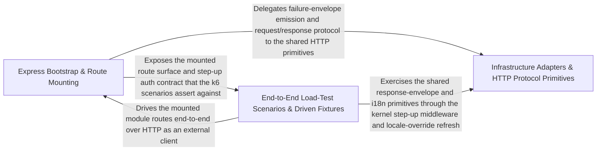

---
tags:
  - 2repo
  - 2repo/arch
  - project/boilerplate-node-backend
type: architecture
component: App_Assembly_HTTP_Entry
---

## Details

The application bootstrap and HTTP entry layer that installs routes (walking enabledModules), error handling, request context, security (CORS, rate-limit), telemetry (OpenTelemetry), and static assets onto the Express app; also hosts the k6 load-test scenarios (browse, checkout) that exercise the full request path end-to-end.

### Express Bootstrap & Route Mounting [[Expand]](./Express_Bootstrap_Route_Mounting.md)
The application assembly surface: a set of install* functions that configure the Express app in a load-bearing order. installRoutes walks enabledModules and mounts each module's router at its manifest-declared basePath, then mounts system-routes and the 404 catch-all. installErrorHandling mounts the global error handler last and registers process-level auditors. installTelemetry installs Prometheus latency/in-flight middleware before routes. installRequestContext attaches correlation id, access log, OTel context and locale negotiation. installStatic serves public/uploaded assets with hardened headers.

**Related Classes/Methods**:

- `src.app.error-handling.installErrorHandling`:94-125
- `src.app.telemetry.installTelemetry`:22-42
- `src.app.request-context.installRequestContext`:28-53
- `src.app.static-assets.installStatic`:14-41

**Source Files:**

- `eslint/rules/no-persistence-imports.ts`
  - `eslint.rules.no-persistence-imports.noPersistenceImports` (L58-L118) - Class
  - `eslint.rules.no-persistence-imports.noPersistenceImports.create` (L89-L117) - Method
  - `eslint.rules.no-persistence-imports.noPersistenceImports.create.ImportDeclaration` (L95-L115) - Method
- `src/app/error-handling.ts`
  - `src.app.error-handling.installErrorHandling` (L94-L125) - Class
  - `src.app.error-handling.installErrorHandling.process.on('unhandledRejection') callback` (L100-L108) - Function
  - `src.app.error-handling.installErrorHandling.process.on('uncaughtException') callback` (L114-L124) - Function
- `src/app/request-context.ts`
  - `src.app.request-context.installRequestContext` (L28-L53) - Class
  - `src.app.request-context.installRequestContext.app.use() callback` (L32-L41) - Function
- `src/app/static-assets.ts`
  - `src.app.static-assets.installStatic` (L14-L41) - Class
  - `src.app.static-assets.installStatic.setHeaders` (L36-L38) - Method
- `src/app/system-routes.ts`
  - `src.app.system-routes.router.get('/') callback` (L15-L17) - Function
- `src/app/telemetry.ts`
  - `src.app.telemetry.installTelemetry` (L22-L42) - Class
  - `src.app.telemetry.installTelemetry.app.use() callback` (L26-L41) - Function
  - `src.app.telemetry.installTelemetry.app.use() callback.response.once('finish') callback` (L29-L39) - Function
- `src/cluster.ts`
  - `src.cluster.scheduleRespawn.timer` (L74-L77) - Class
  - `src.cluster.scheduleRespawn.timer.setTimeout() callback` (L74-L77) - Function
- `src/infrastructure/http/controller.ts`
  - `src.infrastructure.http.controller.ServiceResult` (L22-L28) - Interface
- `src/infrastructure/http/errors.ts`
  - `src.infrastructure.http.errors.databaseErrorInterpreter` (L89-L108) - Function
- `src/infrastructure/i18n/negotiate.ts`
  - `src.infrastructure.i18n.negotiate.negotiateLocale.candidates.map() callback.declared` (L37-L39) - Class
  - `src.infrastructure.i18n.negotiate.negotiateLocale.candidates.map() callback.declared.parameters.map() callback` (L38-L38) - Function
- `src/infrastructure/observability/audit.ts`
  - `src.infrastructure.observability.audit.AuditActionMap` (L39-L39) - Interface
- `src/infrastructure/observability/dependency-health.ts`
  - `src.infrastructure.observability.dependency-health.overallStatus` (L59-L62) - Class
  - `src.infrastructure.observability.dependency-health.overallStatus.every() callback` (L60-L60) - Function
- `src/infrastructure/observability/metrics-http.ts`
  - `src.infrastructure.observability.metrics-http._processUptimeGauge` (L35-L42) - Class
  - `src.infrastructure.observability.metrics-http._processUptimeGauge.collect` (L39-L41) - Method
  - `src.infrastructure.observability.metrics-http.sumMetricValues` (L190-L191) - Class
  - `src.infrastructure.observability.metrics-http.sumMetricValues.values.reduce() callback` (L191-L191) - Function
  - `src.infrastructure.observability.metrics-http.getHttpRequestCounters` (L277-L283) - Class
  - `src.infrastructure.observability.metrics-http.getHttpRequestCounters.then() callback` (L279-L282) - Function
  - `src.infrastructure.observability.metrics-http.getLatencyPercentiles` (L300-L309) - Class
  - `src.infrastructure.observability.metrics-http.getLatencyPercentiles.then() callback` (L301-L309) - Function
- `src/infrastructure/observability/process-snapshot.ts`
  - `src.infrastructure.observability.process-snapshot.ProcessMemorySnapshot` (L11-L23) - Interface
  - `src.infrastructure.observability.process-snapshot.ProcessSnapshot` (L26-L33) - Interface
- `src/infrastructure/observability/stream.ts`
  - `src.infrastructure.observability.stream.buildObservabilityPayload` (L63-L84) - Class
  - `src.infrastructure.observability.stream.buildObservabilityPayload.then() callback` (L67-L83) - Function
  - `src.infrastructure.observability.stream.writeMetricsEvent` (L92-L99) - Class
  - `src.infrastructure.observability.stream.writeMetricsEvent.then() callback` (L95-L97) - Function
  - `src.infrastructure.observability.stream.writeMetricsEvent.catch() callback` (L98-L98) - Function
  - `src.infrastructure.observability.stream.streamObservabilityMetrics.updatesInterval` (L126-L128) - Class
  - `src.infrastructure.observability.stream.streamObservabilityMetrics.updatesInterval.setInterval() callback` (L126-L128) - Function
  - `src.infrastructure.observability.stream.streamObservabilityMetrics.heartbeatInterval` (L132-L134) - Class
  - `src.infrastructure.observability.stream.streamObservabilityMetrics.heartbeatInterval.setInterval() callback` (L132-L134) - Function
- `src/infrastructure/observability/tracer.ts`
  - `src.infrastructure.observability.tracer.tracer.startActiveSpan() callback.then() callback` (L50-L56) - Function
- `src/infrastructure/surfaces/create-delete-controller.ts`
  - `src.infrastructure.surfaces.create-delete-controller.RemoveResult` (L30-L35) - Interface
  - `src.infrastructure.surfaces.create-delete-controller.createDeleteController.handler` (L75-L121) - Class
  - `src.infrastructure.surfaces.create-delete-controller.createDeleteController.handler.[operation]` (L76-L120) - Method
  - `src.infrastructure.surfaces.create-delete-controller.createDeleteController.handler.[operation].then() callback` (L95-L112) - Function
  - `src.infrastructure.surfaces.create-delete-controller.createDeleteController.handler.[operation].catch() callback` (L113-L119) - Function
- `src/infrastructure/surfaces/create-item-controller.ts`
  - `src.infrastructure.surfaces.create-item-controller.createItemController.handler` (L46-L65) - Class
  - `src.infrastructure.surfaces.create-item-controller.createItemController.handler.[operation]` (L47-L64) - Method
  - `src.infrastructure.surfaces.create-item-controller.createItemController.handler.[operation].then() callback` (L50-L56) - Function
  - `src.infrastructure.surfaces.create-item-controller.createItemController.handler.[operation].catch() callback` (L57-L63) - Function
- `src/infrastructure/surfaces/create-list-controller.ts`
  - `src.infrastructure.surfaces.create-list-controller.ListControllerSpec` (L17-L41) - Interface
  - `src.infrastructure.surfaces.create-list-controller.createListController.handler` (L60-L79) - Class
  - `src.infrastructure.surfaces.create-list-controller.createListController.handler.[operation]` (L61-L78) - Method
  - `src.infrastructure.surfaces.create-list-controller.createListController.handler.[operation].then() callback` (L74-L76) - Function
- `src/infrastructure/surfaces/create-search-controller.ts`
  - `src.infrastructure.surfaces.create-search-controller.createSearchController.handler` (L53-L74) - Class
  - `src.infrastructure.surfaces.create-search-controller.createSearchController.handler.[operation]` (L54-L73) - Method
  - `src.infrastructure.surfaces.create-search-controller.createSearchController.handler.[operation].then() callback` (L69-L71) - Function
- `src/modules/cart/controllers/delete-cart-all.ts`
  - `src.modules.cart.controllers.delete-cart-all.clearCart` (L19-L28) - Class
  - `src.modules.cart.controllers.delete-cart-all.clearCart.then() callback` (L24-L26) - Function
- `src/modules/cart/controllers/delete-cart-item.ts`
  - `src.modules.cart.controllers.delete-cart-item.deleteCartItem` (L28-L50) - Class
  - `src.modules.cart.controllers.delete-cart-item.deleteCartItem.then() callback` (L45-L48) - Function
- `src/modules/cart/controllers/get-cart-summary.ts`
  - `src.modules.cart.controllers.get-cart-summary.getCartSummary` (L16-L23) - Class
  - `src.modules.cart.controllers.get-cart-summary.getCartSummary.then() callback` (L19-L21) - Function
- `src/modules/cart/controllers/get-cart.ts`
  - `src.modules.cart.controllers.get-cart.getCart` (L17-L24) - Class
  - `src.modules.cart.controllers.get-cart.getCart.then() callback` (L20-L22) - Function
- `src/modules/cart/controllers/post-cart.ts`
  - `src.modules.cart.controllers.post-cart.postCart` (L21-L46) - Class
  - `src.modules.cart.controllers.post-cart.postCart.then() callback` (L40-L44) - Function
- `src/modules/cart/controllers/post-checkout.ts`
  - `src.modules.cart.controllers.post-checkout.postCheckout` (L21-L45) - Class
  - `src.modules.cart.controllers.post-checkout.postCheckout.then() callback` (L30-L39) - Function
  - `src.modules.cart.controllers.post-checkout.postCheckout.catch() callback` (L40-L44) - Function
- `src/modules/cart/controllers/post-reorder.ts`
  - `src.modules.cart.controllers.post-reorder.postReorder` (L18-L30) - Class
  - `src.modules.cart.controllers.post-reorder.postReorder.then() callback` (L24-L28) - Function
- `src/modules/cart/controllers/put-cart-item.ts`
  - `src.modules.cart.controllers.put-cart-item.putCartItem` (L26-L52) - Class
  - `src.modules.cart.controllers.put-cart-item.putCartItem.then() callback` (L46-L50) - Function
- `src/modules/cart/repository.ts`
  - `src.modules.cart.repository.upsertLine` (L33-L67) - Class
  - `src.modules.cart.repository.upsertLine.then() callback` (L53-L61) - Function
  - `src.modules.cart.repository.upsertLine.catch() callback` (L63-L66) - Function
- `src/modules/delivery/controllers/post-courier-advance.ts`
  - `src.modules.delivery.controllers.post-courier-advance.postCourierAdvance` (L16-L22) - Class
  - `src.modules.delivery.controllers.post-courier-advance.postCourierAdvance.then() callback` (L19-L21) - Function
- `src/modules/feedback/controllers/delete-feedback.ts`
  - `src.modules.feedback.controllers.delete-feedback.deleteFeedback` (L25-L36) - Class
  - `src.modules.feedback.controllers.delete-feedback.deleteFeedback.then() callback` (L28-L31) - Function
  - `src.modules.feedback.controllers.delete-feedback.deleteFeedback.catch() callback` (L32-L36) - Function
- `src/modules/feedback/controllers/put-feedback-status.ts`
  - `src.modules.feedback.controllers.put-feedback-status.putFeedbackStatus` (L30-L46) - Class
  - `src.modules.feedback.controllers.put-feedback-status.putFeedbackStatus.then() callback` (L41-L44) - Function
- `src/modules/inventory/controllers/get-inventory-levels.ts`
  - `src.modules.inventory.controllers.get-inventory-levels.getInventoryLevels` (L13-L22) - Class
  - `src.modules.inventory.controllers.get-inventory-levels.getInventoryLevels.runList` (L21-L21) - Method
- `src/modules/inventory/controllers/get-stock-movements.ts`
  - `src.modules.inventory.controllers.get-stock-movements.getStockMovements` (L13-L21) - Class
  - `src.modules.inventory.controllers.get-stock-movements.getStockMovements.runList` (L20-L20) - Method
- `src/modules/inventory/controllers/post-reservations-sweep.ts`
  - `src.modules.inventory.controllers.post-reservations-sweep.postReservationsSweep` (L17-L23) - Class
  - `src.modules.inventory.controllers.post-reservations-sweep.postReservationsSweep.then() callback` (L20-L22) - Function
- `src/modules/locales/controllers/get-locale-messages.ts`
  - `src.modules.locales.controllers.get-locale-messages.getLocaleMessages` (L17-L29) - Class
  - `src.modules.locales.controllers.get-locale-messages.getLocaleMessages.then() callback` (L24-L27) - Function
- `src/modules/locales/controllers/write-locale-entries.ts`
  - `src.modules.locales.controllers.write-locale-entries.updateLocaleEntry` (L67-L89) - Class
  - `src.modules.locales.controllers.write-locale-entries.updateLocaleEntry.then() callback` (L81-L87) - Function
  - `src.modules.locales.controllers.write-locale-entries.importEntries` (L92-L108) - Class
  - `src.modules.locales.controllers.write-locale-entries.importEntries.then() callback` (L101-L107) - Function
  - `src.modules.locales.controllers.write-locale-entries.importEntries.catch() callback` (L108-L108) - Function
- `src/modules/observability/controllers/get-observability-audit.ts`
  - `src.modules.observability.controllers.get-observability-audit.getObservabilityAuditLogs` (L22-L60) - Class
  - `src.modules.observability.controllers.get-observability-audit.getObservabilityAuditLogs.then() callback` (L58-L58) - Function
- `src/modules/observability/controllers/get-observability-metrics-overview.ts`
  - `src.modules.observability.controllers.get-observability-metrics-overview.MetricSample` (L23-L26) - Interface
  - `src.modules.observability.controllers.get-observability-metrics-overview.sumByLabel` (L51-L52) - Class
  - `src.modules.observability.controllers.get-observability-metrics-overview.sumByLabel.reduce() callback` (L52-L52) - Function
  - `src.modules.observability.controllers.get-observability-metrics-overview.sumByLabel.values.filter() callback` (L52-L52) - Function
  - `src.modules.observability.controllers.get-observability-metrics-overview.getObservabilityMetricsOverview` (L58-L124) - Class
  - `src.modules.observability.controllers.get-observability-metrics-overview.getObservabilityMetricsOverview.then() callback` (L75-L122) - Function
  - `src.modules.observability.controllers.get-observability-metrics-overview.getObservabilityMetricsOverview.then() callback.inFlight` (L89-L89) - Class
  - `src.modules.observability.controllers.get-observability-metrics-overview.getObservabilityMetricsOverview.then() callback.inFlight.inflightMetric.values.reduce() callback` (L89-L89) - Function
  - `src.modules.observability.controllers.get-observability-metrics-overview.getObservabilityMetricsOverview.then() callback.data.business.ordersCreated.orderValues.reduce() callback` (L106-L106) - Function
  - `src.modules.observability.controllers.get-observability-metrics-overview.getObservabilityMetricsOverview.then() callback.data.business.lowStockProducts.lowStockValues.reduce() callback` (L107-L107) - Function
  - `src.modules.observability.controllers.get-observability-metrics-overview.getObservabilityMetricsOverview.then() callback.data.business.reservedUnits.reservedValues.reduce() callback` (L108-L108) - Function
  - `src.modules.observability.controllers.get-observability-metrics-overview.getObservabilityMetricsOverview.then() callback.data.database.queriesTotal.databaseQueryValues.reduce() callback` (L111-L111) - Function
  - `src.modules.observability.controllers.get-observability-metrics-overview.getObservabilityMetricsOverview.then() callback.data.database.errorsTotal.databaseErrorValues.reduce() callback` (L112-L112) - Function
- `src/modules/observability/routes.ts`
  - `src.modules.observability.routes.router.get('/events') callback` (L31-L33) - Function
- `src/modules/orders/controllers/write-orders.ts`
  - `src.modules.orders.controllers.write-orders.writeOrders` (L25-L91) - Class
  - `src.modules.orders.controllers.write-orders.then() callback` (L57-L68) - Function
  - `src.modules.orders.controllers.write-orders.writeOrders.then() callback` (L85-L89) - Function
- `src/modules/orders/demo.ts`
  - `src.modules.orders.demo.MediumOrderSeed` (L174-L177) - Interface
- `src/modules/orders/repository.ts`
  - `src.modules.orders.repository.scrubDueForAnonymization` (L200-L229) - Class
  - `src.modules.orders.repository.scrubDueForAnonymization.then() callback` (L219-L227) - Function
  - `src.modules.orders.repository.scrubDueForAnonymization.then() callback.then() callback` (L227-L227) - Function
- `src/modules/orders/service.ts`
  - `src.modules.orders.service.create.resolvedItems` (L163-L167) - Class
  - `src.modules.orders.service.create.resolvedItems.items.map() callback` (L164-L165) - Function
  - `src.modules.orders.service.create.resolvedItems.items.map() callback.then() callback` (L165-L165) - Function
- `src/modules/payments/controllers/post-payment-confirm.ts`
  - `src.modules.payments.controllers.post-payment-confirm.postPaymentConfirm` (L18-L41) - Class
  - `src.modules.payments.controllers.post-payment-confirm.postPaymentConfirm.then() callback` (L30-L39) - Function
- `src/modules/payments/controllers/post-payment-refund.ts`
  - `src.modules.payments.controllers.post-payment-refund.postPaymentRefund` (L16-L27) - Class
  - `src.modules.payments.controllers.post-payment-refund.postPaymentRefund.then() callback` (L23-L26) - Function
- `src/modules/wishlist/controllers/get-wishlist.ts`
  - `src.modules.wishlist.controllers.get-wishlist.getWishlist` (L17-L24) - Class
  - `src.modules.wishlist.controllers.get-wishlist.getWishlist.then() callback` (L20-L22) - Function
- `src/modules/wishlist/controllers/post-wishlist.ts`
  - `src.modules.wishlist.controllers.post-wishlist.postWishlist` (L20-L46) - Class
  - `src.modules.wishlist.controllers.post-wishlist.postWishlist.then() callback` (L40-L44) - Function

### Infrastructure Adapters & HTTP Protocol Primitives [[Expand]](./Infrastructure_Adapters_HTTP_Protocol_Primitives.md)
The domain-agnostic infrastructure layer the entry layer depends on: swappable adapters (image store, image-signature verification, PDF rendering, upload storage resolution) plus the HTTP protocol primitives (request input declarations / CallerContext, response normalization, upload URL resolution). These are the ports/adapters that the bootstrap surface and the domain modules call into — the image-store seam, the storage destination resolver, and the request/response contract helpers.

**Related Classes/Methods**:

- `src.infrastructure.adapters.image-store.readUploadedImage`:273-305
- `src.infrastructure.adapters.storage.resolveUploadDestination`:59-77
- `src.infrastructure.adapters.pdf.renderHtmlToPdf`:48-74
- `src.infrastructure.http.response.normalizeErrors`:155-182

**Source Files:**

- `src/infrastructure/adapters/image-signatures.ts`
  - `src.infrastructure.adapters.image-signatures.ACCEPTED_UPLOAD_MIMETYPES` (L67-L69) - Class
  - `src.infrastructure.adapters.image-signatures.ACCEPTED_UPLOAD_MIMETYPES.SUPPORTED_IMAGE_FORMATS.flatMap() callback` (L68-L68) - Function
  - `src.infrastructure.adapters.image-signatures.CANONICAL_MIME_BY_ALIAS` (L72-L76) - Class
  - `src.infrastructure.adapters.image-signatures.CANONICAL_MIME_BY_ALIAS.SUPPORTED_IMAGE_FORMATS.flatMap() callback` (L73-L74) - Function
  - `src.infrastructure.adapters.image-signatures.CANONICAL_MIME_BY_ALIAS.SUPPORTED_IMAGE_FORMATS.flatMap() callback.map() callback` (L74-L74) - Function
  - `src.infrastructure.adapters.image-signatures.HEADER_LENGTH` (L79-L81) - Class
  - `src.infrastructure.adapters.image-signatures.HEADER_LENGTH.SUPPORTED_IMAGE_FORMATS.map() callback` (L80-L80) - Function
- `src/infrastructure/adapters/image-store.ts`
  - `src.infrastructure.adapters.image-store.RequestImage` (L235-L262) - Interface
  - `src.infrastructure.adapters.image-store.readUploadedImage` (L273-L305) - Class
  - `src.infrastructure.adapters.image-store.deleteUpload` (L287-L287) - Method
  - `src.infrastructure.adapters.image-store.readUploadedImage.deleteUpload` (L303-L303) - Method
- `src/infrastructure/adapters/pdf.ts`
  - `src.infrastructure.adapters.pdf.renderHtmlToPdf` (L48-L74) - Class
  - `src.infrastructure.adapters.pdf.renderHtmlToPdf.then() callback` (L53-L73) - Function
  - `src.infrastructure.adapters.pdf.renderHtmlToPdf.then() callback.then() callback` (L57-L69) - Function
  - `src.infrastructure.adapters.pdf.renderHtmlToPdf.then() callback.then() callback.then() callback` (L69-L69) - Function
  - `src.infrastructure.adapters.pdf.renderHtmlToPdf.then() callback.finally() callback` (L73-L73) - Function
- `src/infrastructure/adapters/pdf.worker.ts`
  - `src.infrastructure.adapters.pdf.worker.handlePdfJob` (L27-L53) - Class
  - `src.infrastructure.adapters.pdf.worker.then() callback` (L44-L44) - Function
  - `src.infrastructure.adapters.pdf.worker.handlePdfJob.then() callback` (L45-L48) - Function
  - `src.infrastructure.adapters.pdf.worker.handlePdfJob.catch() callback` (L49-L52) - Function
- `src/infrastructure/adapters/storage.ts`
  - `src.infrastructure.adapters.storage.resolveUploadDestination` (L59-L77) - Class
  - `src.infrastructure.adapters.storage.resolveUploadDestination.then() callback` (L75-L75) - Function
  - `src.infrastructure.adapters.storage.resolveUploadDestination.catch() callback` (L76-L76) - Function
  - `src.infrastructure.adapters.storage.validateUploadedImages.then() callback.rejected` (L236-L240) - Class
  - `src.infrastructure.adapters.storage.validateUploadedImages.then() callback.rejected.paths.filter() callback` (L237-L239) - Function
  - `src.infrastructure.adapters.storage.validateUploadedImages.then() callback.rejected.map() callback` (L256-L256) - Function
  - `src.infrastructure.adapters.storage.quarantineUploadedImages.then() callback.keys` (L307-L307) - Class
  - `src.infrastructure.adapters.storage.quarantineUploadedImages.then() callback.keys.results.map() callback` (L307-L307) - Function
  - `src.infrastructure.adapters.storage.quarantineUploadedImages.then() callback.keys.map() callback` (L318-L318) - Function
- `src/infrastructure/http/middlewares/request-logger.ts`
  - `src.infrastructure.http.middlewares.request-logger.requestLogger` (L17-L42) - Class
  - `src.infrastructure.http.middlewares.request-logger.requestLogger.response.once('finish') callback` (L21-L39) - Function
- `src/infrastructure/http/request.ts`
  - `src.infrastructure.http.request.RequestInputDeclaration` (L126-L147) - Interface
  - `src.infrastructure.http.request.readInput.undecoded` (L243-L243) - Class
  - `src.infrastructure.http.request.readInput.undecoded.stated.find() callback` (L243-L243) - Function
  - `src.infrastructure.http.request.CallerContext` (L276-L304) - Interface
- `src/infrastructure/http/response.ts`
  - `src.infrastructure.http.response.normalizeErrors` (L155-L182) - Class
  - `src.infrastructure.http.response.normalizeErrors.inputErrors.map() callback` (L164-L181) - Function
- `src/infrastructure/http/uploads.ts`
  - `src.infrastructure.http.uploads.resolveImageUrl` (L62-L65) - Function
  - `src.infrastructure.http.uploads.resolveThumbnailUrl` (L72-L76) - Function
  - `src.infrastructure.http.uploads.resolvePendingImageKey` (L85-L89) - Function
- `src/infrastructure/surfaces/create-delete-controller.ts`
  - `src.infrastructure.surfaces.create-delete-controller.DeleteControllerSpec` (L38-L56) - Interface
- `src/infrastructure/surfaces/create-item-controller.ts`
  - `src.infrastructure.surfaces.create-item-controller.ItemControllerSpec` (L16-L32) - Interface
- `src/infrastructure/surfaces/create-search-controller.ts`
  - `src.infrastructure.surfaces.create-search-controller.SearchControllerSpec` (L17-L34) - Interface
- `src/modules/account/controllers/get-sessions.ts`
  - `src.modules.account.controllers.get-sessions.getSessions` (L18-L30) - Class
  - `src.modules.account.controllers.get-sessions.getSessions.then() callback` (L25-L28) - Function
- `src/modules/account/controllers/post-logout-everywhere.ts`
  - `src.modules.account.controllers.post-logout-everywhere.postLogoutEverywhere` (L19-L29) - Class
  - `src.modules.account.controllers.post-logout-everywhere.postLogoutEverywhere.then() callback` (L22-L27) - Function
- `src/modules/account/controllers/post-signup.ts`
  - `src.modules.account.controllers.post-signup.postSignup` (L22-L76) - Class
  - `src.modules.account.controllers.post-signup.postSignup.then() callback` (L52-L70) - Function
  - `src.modules.account.controllers.post-signup.postSignup.then() callback.then() callback` (L54-L57) - Function
  - `src.modules.account.controllers.post-signup.postSignup.catch() callback` (L71-L75) - Function
- `src/modules/account/controllers/post-verify-request.ts`
  - `src.modules.account.controllers.post-verify-request.postVerifyRequest` (L18-L29) - Class
  - `src.modules.account.controllers.post-verify-request.postVerifyRequest.then() callback` (L24-L27) - Function
- `src/modules/account/controllers/put-account.ts`
  - `src.modules.account.controllers.put-account.putAccount` (L24-L69) - Class
  - `src.modules.account.controllers.put-account.putAccount.then() callback` (L48-L64) - Function
  - `src.modules.account.controllers.put-account.putAccount.then() callback.then() callback` (L50-L52) - Function
  - `src.modules.account.controllers.put-account.putAccount.catch() callback` (L65-L68) - Function
- `src/modules/account/controllers/write-addresses.ts`
  - `src.modules.account.controllers.write-addresses.putAddress` (L49-L67) - Class
  - `src.modules.account.controllers.write-addresses.putAddress.then() callback` (L62-L65) - Function
- `src/modules/delivery/service.ts`
  - `src.modules.delivery.service.shipOrder.user` (L76-L78) - Class
  - `src.modules.delivery.service.shipOrder.user.catch() callback` (L77-L77) - Function
- `src/modules/feedback/controllers/get-feedback.ts`
  - `src.modules.feedback.controllers.get-feedback.getFeedback` (L34-L63) - Class
  - `src.modules.feedback.controllers.get-feedback.getFeedback.then() callback` (L61-L61) - Function
- `src/modules/inventory/controllers/post-adjustment.ts`
  - `src.modules.inventory.controllers.post-adjustment.postAdjustment` (L18-L37) - Class
  - `src.modules.inventory.controllers.post-adjustment.postAdjustment.then() callback` (L32-L35) - Function
- `src/modules/locales/controllers/get-locales.ts`
  - `src.modules.locales.controllers.get-locales.getLocales` (L20-L25) - Class
  - `src.modules.locales.controllers.get-locales.getLocales.then() callback` (L24-L24) - Function
- `src/modules/locales/controllers/write-locales.ts`
  - `src.modules.locales.controllers.write-locales.createLocale` (L31-L49) - Class
  - `src.modules.locales.controllers.write-locales.createLocale.then() callback` (L43-L47) - Function
- `src/modules/locales/repository.ts`
  - `src.modules.locales.repository.EntryInput` (L22-L25) - Interface
  - `src.modules.locales.repository.ImportCounts` (L28-L32) - Interface
  - `src.modules.locales.repository.importEntries.removedKeys` (L205-L205) - Class
  - `src.modules.locales.repository.importEntries.removedKeys.filter() callback` (L205-L205) - Function
- `src/modules/orders/controllers/delete-orders.ts`
  - `src.modules.orders.controllers.delete-orders.deleteOrders` (L16-L21) - Class
  - `src.modules.orders.controllers.delete-orders.deleteOrders.remove` (L18-L18) - Method
- `src/modules/orders/controllers/get-order-invoice.ts`
  - `src.modules.orders.controllers.get-order-invoice.getOrderInvoice` (L22-L73) - Class
  - `src.modules.orders.controllers.get-order-invoice.getOrderInvoice.then() callback` (L32-L71) - Function
  - `src.modules.orders.controllers.get-order-invoice.then() callback.then() callback` (L60-L60) - Function
  - `src.modules.orders.controllers.get-order-invoice.getOrderInvoice.then() callback.then() callback` (L61-L70) - Function
- `src/modules/orders/controllers/get-order-item.ts`
  - `src.modules.orders.controllers.get-order-item.getOrderItem` (L23-L41) - Class
  - `src.modules.orders.controllers.get-order-item.getOrderItem.then() callback` (L31-L39) - Function
- `src/modules/orders/controllers/get-orders.ts`
  - `src.modules.orders.controllers.get-orders.getOrders` (L34-L47) - Class
  - `src.modules.orders.controllers.get-orders.getOrders.extendInput` (L38-L40) - Method
  - `src.modules.orders.controllers.get-orders.getOrders.runSearch` (L41-L46) - Method
- `src/modules/orders/emails.ts`
  - `src.modules.orders.emails.OrderLines` (L20-L24) - Interface
  - `src.modules.orders.emails.InvoiceOrder` (L67-L69) - Interface
- `src/modules/payments/controllers/post-payment-confirm.ts`
  - `src.modules.payments.controllers.post-payment-confirm.postPaymentConfirm.then() callback.declined` (L31-L32) - Class
  - `src.modules.payments.controllers.post-payment-confirm.postPaymentConfirm.then() callback.declined.result.errors.some() callback` (L32-L32) - Function
- `src/modules/payments/service.ts`
  - `src.modules.payments.service.confirmPayment.then() callback.declined` (L232-L233) - Class
  - `src.modules.payments.service.confirmPayment.then() callback.declined.result.errors.some() callback` (L233-L233) - Function
- `src/modules/products/controllers/delete-products.ts`
  - `src.modules.products.controllers.delete-products.deleteProducts` (L16-L21) - Class
  - `src.modules.products.controllers.delete-products.deleteProducts.remove` (L18-L18) - Method
- `src/modules/products/controllers/get-catalogue-facets.ts`
  - `src.modules.products.controllers.get-catalogue-facets.getCatalogueFacets` (L18-L24) - Class
  - `src.modules.products.controllers.get-catalogue-facets.getCatalogueFacets.then() callback` (L21-L23) - Function
- `src/modules/products/controllers/get-product-item.ts`
  - `src.modules.products.controllers.get-product-item.getProductItem` (L16-L26) - Class
  - `src.modules.products.controllers.get-product-item.getProductItem.fetch` (L20-L25) - Method
- `src/modules/products/controllers/get-products.ts`
  - `src.modules.products.controllers.get-products.searchProductsQuerySchema.minPrice.z.preprocess() callback` (L30-L30) - Function
  - `src.modules.products.controllers.get-products.searchProductsQuerySchema.maxPrice.z.preprocess() callback` (L34-L34) - Function
  - `src.modules.products.controllers.get-products.searchProductsQuerySchema.active.z.preprocess() callback` (L39-L39) - Function
  - `src.modules.products.controllers.get-products.getProducts` (L57-L71) - Class
  - `src.modules.products.controllers.get-products.getProducts.extendInput` (L61-L64) - Method
  - `src.modules.products.controllers.get-products.getProducts.runSearch` (L65-L70) - Method
- `src/modules/products/controllers/write-products.ts`
  - `src.modules.products.controllers.write-products.writeProducts` (L30-L167) - Class
  - `src.modules.products.controllers.write-products.catch() callback` (L82-L82) - Function
  - `src.modules.products.controllers.write-products.catch() callback.then() callback` (L137-L139) - Function
  - `src.modules.products.controllers.write-products.writeProducts.then() callback` (L155-L161) - Function
  - `src.modules.products.controllers.write-products.writeProducts.then() callback.then() callback` (L157-L159) - Function
  - `src.modules.products.controllers.write-products.writeProducts.catch() callback` (L162-L165) - Function
  - `src.modules.products.controllers.write-products.writeProducts.catch() callback.then() callback` (L163-L165) - Function
- `src/modules/products/demo-catalog.ts`
  - `src.modules.products.demo-catalog.FILLER_PRODUCTS.ANIMALS.flatMap() callback` (L142-L153) - Function
  - `src.modules.products.demo-catalog.FILLER_PRODUCTS` (L142-L154) - Class
  - `src.modules.products.demo-catalog.FILLER_PRODUCTS.ANIMALS.flatMap() callback.PRODUCT_TYPES.flatMap() callback` (L143-L152) - Function
  - `src.modules.products.demo-catalog.FILLER_PRODUCTS.ANIMALS.flatMap() callback.PRODUCT_TYPES.flatMap() callback.TIERS.map() callback` (L144-L152) - Function
- `src/modules/users/controllers/delete-user-two-factor.ts`
  - `src.modules.users.controllers.delete-user-two-factor.deleteUserTwoFactor` (L21-L36) - Class
  - `src.modules.users.controllers.delete-user-two-factor.deleteUserTwoFactor.then() callback` (L26-L32) - Function
  - `src.modules.users.controllers.delete-user-two-factor.deleteUserTwoFactor.catch() callback` (L33-L34) - Function
- `src/modules/users/controllers/delete-users.ts`
  - `src.modules.users.controllers.delete-users.deleteUsers` (L20-L28) - Class
  - `src.modules.users.controllers.delete-users.deleteUsers.remove` (L22-L22) - Method
  - `src.modules.users.controllers.delete-users.deleteUsers.auditAction` (L23-L26) - Method
- `src/modules/users/controllers/get-user-item.ts`
  - `src.modules.users.controllers.get-user-item.getUserItem` (L15-L19) - Class
  - `src.modules.users.controllers.get-user-item.getUserItem.fetch` (L18-L18) - Method
- `src/modules/users/controllers/get-users.ts`
  - `src.modules.users.controllers.get-users.queryBoolean` (L16-L19) - Class
  - `src.modules.users.controllers.get-users.queryBoolean.z.preprocess() callback` (L17-L17) - Function
  - `src.modules.users.controllers.get-users.getUsers` (L46-L50) - Class
  - `src.modules.users.controllers.get-users.getUsers.runSearch` (L49-L49) - Method
- `src/modules/users/controllers/write-users.ts`
  - `src.modules.users.controllers.write-users.writeUsers` (L31-L159) - Class
  - `src.modules.users.controllers.write-users.catch() callback` (L80-L80) - Function
  - `src.modules.users.controllers.write-users.catch() callback.then() callback` (L134-L136) - Function
  - `src.modules.users.controllers.write-users.writeUsers.then() callback` (L145-L151) - Function
  - `src.modules.users.controllers.write-users.writeUsers.then() callback.then() callback` (L147-L149) - Function
  - `src.modules.users.controllers.write-users.writeUsers.catch() callback` (L152-L157) - Function
  - `src.modules.users.controllers.write-users.writeUsers.catch() callback.then() callback` (L155-L157) - Function

### End-to-End Load-Test Scenarios & Driven Fixtures [[Expand]](./End_to_End_Load_Test_Scenarios_Driven_Fixtures.md)
The k6 load-test scenarios that exercise the full request path end-to-end, plus the cross-cutting fixtures and middlewares they drive. k6/checkout.js is the write-path scenario (login → fill cart → checkout) that validates the stock-reservation logic under concurrency, treating a 409 refusal as a pass. k6/browse.js covers the read path. These scenarios depend on the i18n locale-override refresh, persistence fixtures (FactoryIdentity), the kernel requireFreshAuth middleware, and account fixtures (AddressBookOverrides).

**Related Classes/Methods**:

- `k6.checkout.default`:67-99
- `src.app.routes.installRoutes`:24-47
- `src.infrastructure.i18n.overrides.refreshLocaleOverrides`:95-108
- `src.kernel.middlewares.authorizations.requireFreshAuth`:242-272
- `src.infrastructure.persistence.fixtures.FactoryIdentity`:13-20

**Source Files:**

- `k6/checkout.js`
  - `k6.checkout.login` (L57-L65) - Class
  - `k6.checkout.login.'login answers 200'` (L63-L63) - Method
  - `k6.checkout.default` (L67-L99) - Function
  - `k6.checkout.default.group('fill the cart') callback` (L75-L86) - Function
  - `k6.checkout.default.group('fill the cart') callback.'add to cart accepted'` (L85-L85) - Method
  - `k6.checkout.default.group('check out') callback` (L88-L98) - Function
  - `k6.checkout.default.group('check out') callback.'checkout resolved'` (L96-L96) - Method
- `src/app/routes.ts`
  - `src.app.routes.installRoutes` (L24-L47) - Class
  - `src.app.routes.installRoutes.app.use() callback` (L44-L46) - Function
- `src/infrastructure/i18n/overrides.ts`
  - `src.infrastructure.i18n.overrides.refreshLocaleOverrides` (L95-L108) - Class
  - `src.infrastructure.i18n.overrides.refreshLocaleOverrides.then() callback` (L99-L99) - Function
  - `src.infrastructure.i18n.overrides.refreshLocaleOverrides.catch() callback` (L100-L107) - Function
- `src/infrastructure/persistence/fixtures.ts`
  - `src.infrastructure.persistence.fixtures.FactoryIdentity` (L13-L20) - Interface
- `src/kernel/middlewares/authorizations.ts`
  - `src.kernel.middlewares.authorizations.requireFreshAuth` (L242-L272) - Class
  - `src.kernel.middlewares.authorizations.requireFreshAuth.<function>` (L244-L272) - Function
  - `src.kernel.middlewares.authorizations.requireFreshAuth.<function>.hasRequiredMethods.every() callback` (L253-L254) - Function
  - `src.kernel.middlewares.authorizations.requireFreshAuth.<function>.hasRequiredMethods` (L253-L255) - Class
- `src/modules/account/controllers/delete-2fa.ts`
  - `src.modules.account.controllers.delete-2fa.delete2fa` (L22-L46) - Class
  - `src.modules.account.controllers.delete-2fa.delete2fa.then() callback` (L36-L44) - Function
  - `src.modules.account.controllers.delete-2fa.delete2fa.catch() callback` (L45-L45) - Function
- `src/modules/account/controllers/delete-account-confirm.ts`
  - `src.modules.account.controllers.delete-account-confirm.deleteAccountConfirm` (L24-L65) - Class
  - `src.modules.account.controllers.delete-account-confirm.deleteAccountConfirm.then() callback` (L40-L63) - Function
  - `src.modules.account.controllers.delete-account-confirm.deleteAccountConfirm.then() callback.then() callback` (L46-L62) - Function
  - `src.modules.account.controllers.delete-account-confirm.deleteAccountConfirm.then() callback.then() callback.then() callback` (L57-L61) - Function
  - `src.modules.account.controllers.delete-account-confirm.deleteAccountConfirm.catch() callback` (L64-L64) - Function
- `src/modules/account/controllers/delete-account-request.ts`
  - `src.modules.account.controllers.delete-account-request.deleteAccountRequest` (L21-L45) - Class
  - `src.modules.account.controllers.delete-account-request.deleteAccountRequest.then() callback` (L27-L43) - Function
  - `src.modules.account.controllers.delete-account-request.deleteAccountRequest.then() callback.then() callback` (L34-L42) - Function
  - `src.modules.account.controllers.delete-account-request.deleteAccountRequest.catch() callback` (L44-L44) - Function
- `src/modules/account/controllers/delete-address.ts`
  - `src.modules.account.controllers.delete-address.deleteAddress` (L18-L30) - Class
  - `src.modules.account.controllers.delete-address.deleteAddress.then() callback` (L25-L28) - Function
- `src/modules/account/controllers/delete-expired-tokens.ts`
  - `src.modules.account.controllers.delete-expired-tokens.deleteExpiredTokens` (L19-L33) - Class
  - `src.modules.account.controllers.delete-expired-tokens.deleteExpiredTokens.then() callback` (L22-L31) - Function
- `src/modules/account/controllers/delete-session.ts`
  - `src.modules.account.controllers.delete-session.deleteSession` (L23-L39) - Class
  - `src.modules.account.controllers.delete-session.deleteSession.then() callback` (L30-L37) - Function
- `src/modules/account/controllers/get-account.ts`
  - `src.modules.account.controllers.get-account.getAccount` (L16-L30) - Class
  - `src.modules.account.controllers.get-account.getAccount.then() callback` (L24-L28) - Function
  - `src.modules.account.controllers.get-account.getAccount.catch() callback` (L29-L29) - Function
- `src/modules/account/controllers/get-addresses.ts`
  - `src.modules.account.controllers.get-addresses.getAddresses` (L19-L29) - Class
  - `src.modules.account.controllers.get-addresses.getAddresses.then() callback` (L25-L27) - Function
- `src/modules/account/controllers/get-refresh-token.ts`
  - `src.modules.account.controllers.get-refresh-token.getRefreshToken` (L23-L57) - Class
  - `src.modules.account.controllers.get-refresh-token.getRefreshToken.then() callback` (L33-L48) - Function
  - `src.modules.account.controllers.get-refresh-token.getRefreshToken.then() callback.then() callback` (L36-L44) - Function
  - `src.modules.account.controllers.get-refresh-token.getRefreshToken.then() callback.catch() callback` (L45-L48) - Function
  - `src.modules.account.controllers.get-refresh-token.getRefreshToken.catch() callback` (L50-L56) - Function
- `src/modules/account/controllers/post-2fa-confirm.ts`
  - `src.modules.account.controllers.post-2fa-confirm.post2faConfirm` (L21-L47) - Class
  - `src.modules.account.controllers.post-2fa-confirm.post2faConfirm.then() callback` (L35-L43) - Function
  - `src.modules.account.controllers.post-2fa-confirm.post2faConfirm.catch() callback` (L44-L45) - Function
- `src/modules/account/controllers/post-2fa-setup.ts`
  - `src.modules.account.controllers.post-2fa-setup.post2faSetup` (L17-L30) - Class
  - `src.modules.account.controllers.post-2fa-setup.post2faSetup.then() callback` (L22-L28) - Function
  - `src.modules.account.controllers.post-2fa-setup.post2faSetup.catch() callback` (L29-L29) - Function
- `src/modules/account/controllers/post-account-export.ts`
  - `src.modules.account.controllers.post-account-export.postAccountExport` (L15-L26) - Class
  - `src.modules.account.controllers.post-account-export.postAccountExport.then() callback` (L21-L24) - Function
- `src/modules/account/controllers/post-login-2fa.ts`
  - `src.modules.account.controllers.post-login-2fa.postLoginTwoFactor` (L25-L62) - Class
  - `src.modules.account.controllers.post-login-2fa.postLoginTwoFactor.then() callback` (L38-L57) - Function
  - `src.modules.account.controllers.post-login-2fa.postLoginTwoFactor.then() callback.then() callback` (L52-L56) - Function
  - `src.modules.account.controllers.post-login-2fa.postLoginTwoFactor.catch() callback` (L58-L61) - Function
- `src/modules/account/controllers/post-login.ts`
  - `src.modules.account.controllers.post-login.postLogin` (L29-L97) - Class
  - `src.modules.account.controllers.post-login.then() callback` (L55-L55) - Function
  - `src.modules.account.controllers.post-login.postLogin.then() callback` (L56-L90) - Function
  - `src.modules.account.controllers.post-login.postLogin.then() callback.then() callback` (L86-L89) - Function
  - `src.modules.account.controllers.post-login.postLogin.catch() callback` (L91-L96) - Function
- `src/modules/account/controllers/post-logout.ts`
  - `src.modules.account.controllers.post-logout.postLogout` (L20-L32) - Class
  - `src.modules.account.controllers.post-logout.postLogout.then() callback` (L25-L30) - Function
- `src/modules/account/controllers/post-password-change.ts`
  - `src.modules.account.controllers.post-password-change.postPasswordChange` (L26-L78) - Class
  - `src.modules.account.controllers.post-password-change.postPasswordChange.then() callback` (L50-L73) - Function
  - `src.modules.account.controllers.post-password-change.postPasswordChange.then() callback.then() callback` (L65-L68) - Function
  - `src.modules.account.controllers.post-password-change.postPasswordChange.then() callback.catch() callback` (L69-L72) - Function
  - `src.modules.account.controllers.post-password-change.postPasswordChange.catch() callback` (L74-L77) - Function
- `src/modules/account/controllers/post-reauth.ts`
  - `src.modules.account.controllers.post-reauth.postReauth` (L26-L68) - Class
  - `src.modules.account.controllers.post-reauth.postReauth.then() callback` (L41-L63) - Function
  - `src.modules.account.controllers.post-reauth.postReauth.then() callback.then() callback` (L55-L58) - Function
  - `src.modules.account.controllers.post-reauth.postReauth.then() callback.catch() callback` (L59-L62) - Function
  - `src.modules.account.controllers.post-reauth.postReauth.catch() callback` (L64-L67) - Function
- `src/modules/account/controllers/post-reset-confirm.ts`
  - `src.modules.account.controllers.post-reset-confirm.postResetConfirm` (L21-L82) - Class
  - `src.modules.account.controllers.post-reset-confirm.postResetConfirm.then() callback` (L38-L78) - Function
  - `src.modules.account.controllers.post-reset-confirm.postResetConfirm.then() callback.then() callback` (L58-L77) - Function
  - `src.modules.account.controllers.post-reset-confirm.postResetConfirm.then() callback.then() callback.then() callback` (L70-L76) - Function
  - `src.modules.account.controllers.post-reset-confirm.postResetConfirm.catch() callback` (L79-L81) - Function
- `src/modules/account/controllers/post-reset-request.ts`
  - `src.modules.account.controllers.post-reset-request.postResetRequest` (L34-L64) - Class
  - `src.modules.account.controllers.post-reset-request.postResetRequest.catch() callback` (L48-L48) - Function
  - `src.modules.account.controllers.post-reset-request.postResetRequest.then() callback` (L49-L62) - Function
- `src/modules/account/controllers/post-verify-confirm.ts`
  - `src.modules.account.controllers.post-verify-confirm.postVerifyConfirm` (L24-L68) - Class
  - `src.modules.account.controllers.post-verify-confirm.postVerifyConfirm.then() callback` (L44-L63) - Function
  - `src.modules.account.controllers.post-verify-confirm.postVerifyConfirm.then() callback.then() callback` (L50-L62) - Function
  - `src.modules.account.controllers.post-verify-confirm.postVerifyConfirm.then() callback.then() callback.then() callback` (L58-L61) - Function
  - `src.modules.account.controllers.post-verify-confirm.postVerifyConfirm.catch() callback` (L64-L67) - Function
- `src/modules/account/controllers/write-addresses.ts`
  - `src.modules.account.controllers.write-addresses.postAddress` (L24-L41) - Class
  - `src.modules.account.controllers.write-addresses.postAddress.then() callback` (L36-L39) - Function
- `src/modules/account/fixtures.ts`
  - `src.modules.account.fixtures.AddressBookOverrides` (L19-L24) - Interface
- `src/modules/account/session/jwt.ts`
  - `src.modules.account.session.jwt.TokenData` (L28-L52) - Interface
  - `src.modules.account.session.jwt.then() callback.then() callback` (L264-L264) - Function
  - `src.modules.account.session.jwt.rotateRefreshToken.then() callback.then() callback.then() callback.entry` (L328-L328) - Class
  - `src.modules.account.session.jwt.rotateRefreshToken.then() callback.then() callback.then() callback.entry.user.tokens.find() callback` (L328-L328) - Function
- `src/modules/account/session/session.ts`
  - `src.modules.account.session.session.issueSession` (L23-L33) - Class
  - `src.modules.account.session.session.issueSession.then() callback` (L29-L33) - Function
- `src/modules/cart/fixtures.ts`
  - `src.modules.cart.fixtures.CartOverrides` (L18-L23) - Interface
- `src/modules/delivery/controllers/get-shipment-by-order.ts`
  - `src.modules.delivery.controllers.get-shipment-by-order.getShipmentByOrder` (L14-L21) - Class
  - `src.modules.delivery.controllers.get-shipment-by-order.getShipmentByOrder.then() callback` (L17-L20) - Function
- `src/modules/feedback/controllers/post-feedback-contact.ts`
  - `src.modules.feedback.controllers.post-feedback-contact.postFeedbackContact` (L33-L50) - Class
  - `src.modules.feedback.controllers.post-feedback-contact.postFeedbackContact.then() callback` (L46-L48) - Function
- `src/modules/inventory/controllers/post-receipt.ts`
  - `src.modules.inventory.controllers.post-receipt.postReceipt` (L16-L28) - Class
  - `src.modules.inventory.controllers.post-receipt.postReceipt.then() callback` (L23-L26) - Function
- `src/modules/locales/controllers/delete-locale-entry.ts`
  - `src.modules.locales.controllers.delete-locale-entry.deleteLocaleEntry` (L19-L34) - Class
  - `src.modules.locales.controllers.delete-locale-entry.deleteLocaleEntry.then() callback` (L25-L33) - Function
- `src/modules/locales/controllers/delete-locale.ts`
  - `src.modules.locales.controllers.delete-locale.deleteLocale` (L19-L31) - Class
  - `src.modules.locales.controllers.delete-locale.deleteLocale.then() callback` (L22-L30) - Function
- `src/modules/locales/controllers/get-locale-entries.ts`
  - `src.modules.locales.controllers.get-locale-entries.getLocaleEntries` (L19-L45) - Class
  - `src.modules.locales.controllers.get-locale-entries.getLocaleEntries.then() callback` (L39-L42) - Function
- `src/modules/locales/controllers/write-locale-entries.ts`
  - `src.modules.locales.controllers.write-locale-entries.createLocaleEntry` (L43-L60) - Class
  - `src.modules.locales.controllers.write-locale-entries.createLocaleEntry.then() callback` (L52-L58) - Function
- `src/modules/locales/controllers/write-locales.ts`
  - `src.modules.locales.controllers.write-locales.updateLocale` (L56-L74) - Class
  - `src.modules.locales.controllers.write-locales.updateLocale.then() callback` (L68-L72) - Function
- `src/modules/orders/controllers/post-cancel-order.ts`
  - `src.modules.orders.controllers.post-cancel-order.postCancelOrder` (L21-L44) - Class
  - `src.modules.orders.controllers.post-cancel-order.postCancelOrder.then() callback` (L34-L43) - Function
- `src/modules/orders/service.ts`
  - `src.modules.orders.service.create.orderItems` (L177-L180) - Class
  - `src.modules.orders.service.create.orderItems.resolvedItems.map() callback` (L177-L180) - Function
- `src/modules/payments/controllers/get-payment-by-order.ts`
  - `src.modules.payments.controllers.get-payment-by-order.getPaymentByOrder` (L14-L21) - Class
  - `src.modules.payments.controllers.get-payment-by-order.getPaymentByOrder.then() callback` (L17-L20) - Function
- `src/modules/payments/controllers/post-payment-intent.ts`
  - `src.modules.payments.controllers.post-payment-intent.postPaymentIntent` (L16-L27) - Class
  - `src.modules.payments.controllers.post-payment-intent.postPaymentIntent.then() callback` (L22-L25) - Function
- `src/modules/wishlist/controllers/delete-wishlist-item.ts`
  - `src.modules.wishlist.controllers.delete-wishlist-item.deleteWishlistItem` (L18-L37) - Class
  - `src.modules.wishlist.controllers.delete-wishlist-item.deleteWishlistItem.then() callback` (L31-L35) - Function
- `src/modules/wishlist/controllers/post-move-to-cart.ts`
  - `src.modules.wishlist.controllers.post-move-to-cart.postMoveToCart` (L20-L39) - Class
  - `src.modules.wishlist.controllers.post-move-to-cart.postMoveToCart.then() callback` (L33-L37) - Function
- `src/modules/wishlist/fixtures.ts`
  - `src.modules.wishlist.fixtures.WishlistOverrides` (L14-L22) - Interface
