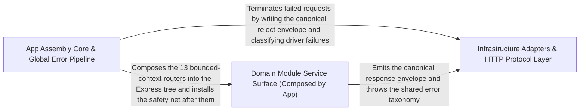

---
tags:
  - 2repo
  - 2repo/arch
  - project/boilerplate-node-backend
type: architecture
component: App_Assembly_Runtime_Bootstrap
---

## Details

Wires the Express application together — mounting domain module routers, installing global error handling, and serving static assets — with secondary support for heap-summary reporting and spec-identity checks.

### App Assembly Core & Global Error Pipeline [[Expand]](./App_Assembly_Core_Global_Error_Pipeline.md)
The composition root of the Express application. Mounts the global error handler after all routes, registers process-level uncaughtException / unhandledRejection audit hooks, and exposes the contract-bundling configuration that drives the generated Bruno/Insomnia/Mockoon/Postman collections. This is the wiring half of the subsystem — the place where the app is assembled and where the safety net for the synchronous request path is installed.

**Related Classes/Methods**:

- `scripts.contracts.client-collections-bundle.values`:76-206

**Source Files:**

- `scripts/check-mutation-baseline.ts`
  - `scripts.check-mutation-baseline.counts.held.comparisons.filter() callback` (L40-L40) - Function
  - `scripts.check-mutation-baseline.counts.improved.comparisons.filter() callback` (L41-L41) - Function
  - `scripts.check-mutation-baseline.counts.regressed.comparisons.filter() callback` (L42-L42) - Function
  - `scripts.check-mutation-baseline.counts.added.comparisons.filter() callback` (L43-L43) - Function
  - `scripts.check-mutation-baseline.counts.removed.comparisons.filter() callback` (L44-L44) - Function
  - `scripts.check-mutation-baseline.map() callback` (L70-L70) - Function
  - `scripts.check-mutation-baseline.comparisons.filter() callback` (L94-L94) - Function
- `scripts/contracts/client-collections-bundle.ts`
  - `scripts.contracts.client-collections-bundle.values` (L76-L206) - Class
  - `scripts.contracts.client-collections-bundle.values.pathParam` (L169-L179) - Method
  - `scripts.contracts.client-collections-bundle.values.tokens.seedSoftDeletedProductId.seedProducts.find() callback` (L201-L201) - Function
  - `scripts.contracts.client-collections-bundle.values.tokens.seedInactiveProductId.seedProducts.find() callback` (L203-L203) - Function
  - `scripts.contracts.client-collections-bundle.values.tokens.seedDeletedOrderId.seedOrders.find() callback` (L204-L204) - Function
- `scripts/regenerate-artifacts.ts`
  - `scripts.regenerate-artifacts.Step` (L31-L36) - Interface
- `scripts/report-heap-summary.ts`
  - `scripts.report-heap-summary.streamArray('strings') callback` (L174-L181) - Function
- `src/app/system-routes.ts`
  - `src.app.system-routes.router.get('/') callback` (L7-L9) - Function
- `src/globals.d.ts`
  - `src.globals.d.'express-serve-static-core'.Request` (L5-L23) - Interface
- `src/infrastructure/http/controller.ts`
  - `src.infrastructure.http.controller.ServiceResult` (L33-L39) - Interface
- `src/infrastructure/observability/dependency-health.ts`
  - `src.infrastructure.observability.dependency-health.DependencyHealth` (L52-L56) - Interface
- `src/modules/account/analytics.ts`
  - `src.modules.account.analytics.'@infrastructure/observability/analytics'.AnalyticsEventMap` (L28-L30) - Interface
- `src/modules/account/audit.ts`
  - `src.modules.account.audit.'@infrastructure/observability/audit'.AuditActionMap` (L32-L34) - Interface
- `src/modules/account/controllers/delete-account-confirm.ts`
  - `src.modules.account.controllers.delete-account-confirm.deleteAccountConfirm` (L22-L52) - Class
  - `src.modules.account.controllers.delete-account-confirm.deleteAccountConfirm.then() callback` (L33-L50) - Function
  - `src.modules.account.controllers.delete-account-confirm.deleteAccountConfirm.then() callback.then() callback` (L45-L49) - Function
  - `src.modules.account.controllers.delete-account-confirm.deleteAccountConfirm.catch() callback` (L51-L51) - Function
- `src/modules/account/controllers/get-account.ts`
  - `src.modules.account.controllers.get-account.getAccount` (L16-L30) - Class
  - `src.modules.account.controllers.get-account.getAccount.then() callback` (L24-L28) - Function
  - `src.modules.account.controllers.get-account.getAccount.catch() callback` (L29-L29) - Function
- `src/modules/account/controllers/get-addresses.ts`
  - `src.modules.account.controllers.get-addresses.getAddresses` (L14-L24) - Class
  - `src.modules.account.controllers.get-addresses.getAddresses.then() callback` (L20-L22) - Function
- `src/modules/account/controllers/get-sessions.ts`
  - `src.modules.account.controllers.get-sessions.getSessions` (L16-L28) - Class
  - `src.modules.account.controllers.get-sessions.getSessions.then() callback` (L23-L26) - Function
- `src/modules/account/controllers/post-logout.ts`
  - `src.modules.account.controllers.post-logout.postLogout` (L21-L33) - Class
  - `src.modules.account.controllers.post-logout.postLogout.then() callback` (L26-L31) - Function
- `src/modules/account/controllers/post-reset-request.ts`
  - `src.modules.account.controllers.post-reset-request.postResetRequest` (L32-L62) - Class
  - `src.modules.account.controllers.post-reset-request.postResetRequest.catch() callback` (L46-L46) - Function
  - `src.modules.account.controllers.post-reset-request.postResetRequest.then() callback` (L47-L60) - Function
- `src/modules/account/controllers/post-signup.ts`
  - `src.modules.account.controllers.post-signup.postSignup` (L17-L69) - Class
  - `src.modules.account.controllers.post-signup.postSignup.then() callback` (L45-L63) - Function
  - `src.modules.account.controllers.post-signup.postSignup.then() callback.then() callback` (L47-L50) - Function
  - `src.modules.account.controllers.post-signup.postSignup.catch() callback` (L64-L68) - Function
- `src/modules/account/controllers/post-verify-confirm.ts`
  - `src.modules.account.controllers.post-verify-confirm.postVerifyConfirm` (L22-L66) - Class
  - `src.modules.account.controllers.post-verify-confirm.postVerifyConfirm.then() callback` (L42-L61) - Function
  - `src.modules.account.controllers.post-verify-confirm.postVerifyConfirm.then() callback.then() callback` (L48-L60) - Function
  - `src.modules.account.controllers.post-verify-confirm.postVerifyConfirm.then() callback.then() callback.then() callback` (L56-L59) - Function
  - `src.modules.account.controllers.post-verify-confirm.postVerifyConfirm.catch() callback` (L62-L65) - Function
- `src/modules/account/controllers/post-verify-request.ts`
  - `src.modules.account.controllers.post-verify-request.postVerifyRequest` (L15-L26) - Class
  - `src.modules.account.controllers.post-verify-request.postVerifyRequest.then() callback` (L21-L24) - Function
- `src/modules/account/controllers/put-account.ts`
  - `src.modules.account.controllers.put-account.putAccount` (L20-L66) - Class
  - `src.modules.account.controllers.put-account.putAccount.then() callback` (L45-L61) - Function
  - `src.modules.account.controllers.put-account.putAccount.then() callback.then() callback` (L47-L49) - Function
  - `src.modules.account.controllers.put-account.putAccount.catch() callback` (L62-L65) - Function
- `src/modules/account/controllers/write-addresses.ts`
  - `src.modules.account.controllers.write-addresses.postAddress` (L30-L47) - Class
  - `src.modules.account.controllers.write-addresses.postAddress.then() callback` (L42-L45) - Function
- `src/modules/account/services/addresses.ts`
  - `src.modules.account.services.addresses.addressUpdate` (L60-L68) - Class
  - `src.modules.account.services.addresses.addressUpdate.then() callback` (L65-L68) - Function
- `src/modules/account/services/profile.ts`
  - `src.modules.account.services.profile.removeOwnAccount` (L167-L204) - Class
  - `src.modules.account.services.profile.removeOwnAccount.then() callback` (L178-L203) - Function
  - `src.modules.account.services.profile.updateProfile` (L240-L273) - Class
  - `src.modules.account.services.profile.passwordChangeWithCurrent` (L287-L324) - Class
  - `src.modules.account.services.profile.outcome.then() callback` (L302-L312) - Function
- `src/modules/account/services/tokens.ts`
  - `src.modules.account.services.tokens.sessionsList` (L120-L133) - Class
  - `src.modules.account.services.tokens.sessionsList.then() callback` (L125-L133) - Function
  - `src.modules.account.services.tokens.sessionsList.then() callback.sessions.user.tokens.filter() callback` (L129-L129) - Function
  - `src.modules.account.services.tokens.sessionsList.then() callback.sessions.map() callback` (L130-L130) - Function
- `src/modules/account/services/verification.ts`
  - `src.modules.account.services.verification.sendVerificationEmail` (L46-L66) - Class
  - `src.modules.account.services.verification.sendVerificationEmail.then() callback` (L50-L66) - Function
  - `src.modules.account.services.verification.requestEmailVerification` (L76-L87) - Class
  - `src.modules.account.services.verification.requestEmailVerification.then() callback` (L80-L87) - Function
  - `src.modules.account.services.verification.requestEmailVerificationFor` (L103-L115) - Class
  - `src.modules.account.services.verification.requestEmailVerificationFor.then() callback` (L108-L115) - Function
  - `src.modules.account.services.verification.requestEmailVerificationFor.then() callback.then() callback` (L112-L113) - Function
  - `src.modules.account.services.verification.completeEmailVerification` (L125-L141) - Class
  - `src.modules.account.services.verification.completeEmailVerification.then() callback` (L130-L140) - Function
- `src/modules/audit-logs/repository.ts`
  - `src.modules.audit-logs.repository.AuditLogSearchFilters` (L14-L22) - Interface
- `src/modules/cart/analytics.ts`
  - `src.modules.cart.analytics.'@infrastructure/observability/analytics'.AnalyticsEventMap` (L39-L41) - Interface
- `src/modules/cart/audit.ts`
  - `src.modules.cart.audit.'@infrastructure/observability/audit'.AuditActionMap` (L18-L20) - Interface
- `src/modules/cart/controllers/delete-cart-item.ts`
  - `src.modules.cart.controllers.delete-cart-item.deleteCartItem` (L19-L42) - Class
  - `src.modules.cart.controllers.delete-cart-item.deleteCartItem.then() callback` (L37-L40) - Function
- `src/modules/cart/controllers/delete-cart.ts`
  - `src.modules.cart.controllers.delete-cart.deleteCart` (L11-L20) - Class
  - `src.modules.cart.controllers.delete-cart.deleteCart.then() callback` (L16-L18) - Function
- `src/modules/cart/controllers/get-cart-summary.ts`
  - `src.modules.cart.controllers.get-cart-summary.getCartSummary` (L11-L18) - Class
  - `src.modules.cart.controllers.get-cart-summary.getCartSummary.then() callback` (L14-L16) - Function
- `src/modules/cart/controllers/get-cart.ts`
  - `src.modules.cart.controllers.get-cart.getCart` (L12-L19) - Class
  - `src.modules.cart.controllers.get-cart.getCart.then() callback` (L15-L17) - Function
- `src/modules/cart/controllers/post-cart.ts`
  - `src.modules.cart.controllers.post-cart.postCart` (L18-L43) - Class
  - `src.modules.cart.controllers.post-cart.postCart.then() callback` (L37-L41) - Function
- `src/modules/cart/controllers/post-checkout.ts`
  - `src.modules.cart.controllers.post-checkout.postCheckout` (L23-L49) - Class
  - `src.modules.cart.controllers.post-checkout.postCheckout.then() callback` (L32-L41) - Function
  - `src.modules.cart.controllers.post-checkout.postCheckout.catch() callback` (L42-L48) - Function
- `src/modules/cart/controllers/post-reorder.ts`
  - `src.modules.cart.controllers.post-reorder.postReorder` (L15-L27) - Class
  - `src.modules.cart.controllers.post-reorder.postReorder.then() callback` (L21-L25) - Function
- `src/modules/cart/controllers/put-cart-item.ts`
  - `src.modules.cart.controllers.put-cart-item.putCartItem` (L23-L49) - Class
  - `src.modules.cart.controllers.put-cart-item.putCartItem.then() callback` (L43-L47) - Function
- `src/modules/cart/repository.ts`
  - `src.modules.cart.repository.upsertLine` (L31-L65) - Class
  - `src.modules.cart.repository.upsertLine.then() callback` (L51-L59) - Function
  - `src.modules.cart.repository.upsertLine.catch() callback` (L61-L64) - Function
- `src/modules/cart/services/checkout.ts`
  - `src.modules.cart.services.checkout.then() callback` (L93-L268) - Function
  - `src.modules.cart.services.checkout.<function>.then() callback.then() callback.then() callback.then() callback.then() callback` (L255-L255) - Function
- `src/modules/cart/services/items.ts`
  - `src.modules.cart.services.items.upsertCartItem` (L87-L100) - Class
  - `src.modules.cart.services.items.upsertCartItem.then() callback` (L93-L100) - Function
  - `src.modules.cart.services.items.upsertCartItem.then() callback.then() callback` (L99-L99) - Function
- `src/modules/cart/services/reorder.ts`
  - `src.modules.cart.services.reorder.reorderIntoCart` (L67-L139) - Class
  - `src.modules.cart.services.reorder.reorderIntoCart.<function>` (L74-L121) - Function
  - `src.modules.cart.services.reorder.reorderIntoCart.<function>.then() callback` (L98-L120) - Function
  - `src.modules.cart.services.reorder.reorderIntoCart.<function>.then() callback.then() callback` (L119-L119) - Function
  - `src.modules.cart.services.reorder.reorderIntoCart.catch() callback` (L122-L122) - Function
- `src/modules/delivery/audit.ts`
  - `src.modules.delivery.audit.'@infrastructure/observability/audit'.AuditActionMap` (L14-L16) - Interface
- `src/modules/delivery/model.ts`
  - `src.modules.delivery.model.ShipmentDocument` (L18-L26) - Interface
- `src/modules/feedback/audit.ts`
  - `src.modules.feedback.audit.'@infrastructure/observability/audit'.AuditActionMap` (L17-L19) - Interface
- `src/modules/feedback/model.ts`
  - `src.modules.feedback.model.FeedbackRequestDocument` (L9-L14) - Interface
- `src/modules/inventory/audit.ts`
  - `src.modules.inventory.audit.'@infrastructure/observability/audit'.AuditActionMap` (L22-L24) - Interface
- `src/modules/inventory/controllers/post-receipt.ts`
  - `src.modules.inventory.controllers.post-receipt.postReceipt` (L13-L25) - Class
  - `src.modules.inventory.controllers.post-receipt.postReceipt.then() callback` (L20-L23) - Function
- `src/modules/inventory/domain/transitions.ts`
  - `src.modules.inventory.domain.transitions.CounterDelta` (L22-L25) - Interface
- `src/modules/inventory/events.ts`
  - `src.modules.inventory.events.'@kernel/events'.DomainEventMap` (L15-L27) - Interface
- `src/modules/locales/audit.ts`
  - `src.modules.locales.audit.'@infrastructure/observability/audit'.AuditActionMap` (L37-L39) - Interface
- `src/modules/locales/model.ts`
  - `src.modules.locales.model.derivesBaseLanguage` (L131-L133) - Function
- `src/modules/locales/module.ts`
  - `src.modules.locales.module.registerLocaleOverrideProvider() callback` (L70-L70) - Function
- `src/modules/observability/controllers/get-observability-metrics-overview.ts`
  - `src.modules.observability.controllers.get-observability-metrics-overview.MetricSample` (L13-L16) - Interface
  - `src.modules.observability.controllers.get-observability-metrics-overview.sumByLabel` (L40-L41) - Class
  - `src.modules.observability.controllers.get-observability-metrics-overview.sumByLabel.reduce() callback` (L41-L41) - Function
  - `src.modules.observability.controllers.get-observability-metrics-overview.sumByLabel.values.filter() callback` (L41-L41) - Function
  - `src.modules.observability.controllers.get-observability-metrics-overview.getObservabilityMetricsOverview` (L47-L121) - Class
  - `src.modules.observability.controllers.get-observability-metrics-overview.getObservabilityMetricsOverview.then() callback` (L62-L119) - Function
  - `src.modules.observability.controllers.get-observability-metrics-overview.getObservabilityMetricsOverview.then() callback.inFlight` (L74-L74) - Class
  - `src.modules.observability.controllers.get-observability-metrics-overview.getObservabilityMetricsOverview.then() callback.inFlight.inflightMetric.values.reduce() callback` (L74-L74) - Function
  - `src.modules.observability.controllers.get-observability-metrics-overview.getObservabilityMetricsOverview.then() callback.data.business.ordersCreated.orderValues.reduce() callback` (L91-L91) - Function
  - `src.modules.observability.controllers.get-observability-metrics-overview.getObservabilityMetricsOverview.then() callback.data.business.lowStockProducts.lowStockValues.reduce() callback` (L92-L92) - Function
  - `src.modules.observability.controllers.get-observability-metrics-overview.getObservabilityMetricsOverview.then() callback.data.business.reservedUnits.reservedValues.reduce() callback` (L93-L93) - Function
- `src/modules/observability/routes.ts`
  - `src.modules.observability.routes.router.get('/metrics') callback` (L28-L38) - Function
- `src/modules/orders/analytics.ts`
  - `src.modules.orders.analytics.'@infrastructure/observability/analytics'.AnalyticsEventMap` (L35-L37) - Interface
- `src/modules/orders/audit.ts`
  - `src.modules.orders.audit.'@infrastructure/observability/audit'.AuditActionMap` (L27-L29) - Interface
- `src/modules/orders/controllers/post-cancel-order.ts`
  - `src.modules.orders.controllers.post-cancel-order.postCancelOrder` (L20-L43) - Class
  - `src.modules.orders.controllers.post-cancel-order.postCancelOrder.then() callback` (L33-L42) - Function
- `src/modules/orders/controllers/write-orders.ts`
  - `src.modules.orders.controllers.write-orders.writeOrders` (L23-L89) - Class
  - `src.modules.orders.controllers.write-orders.then() callback` (L55-L66) - Function
  - `src.modules.orders.controllers.write-orders.writeOrders.then() callback` (L83-L87) - Function
- `src/modules/orders/events.ts`
  - `src.modules.orders.events.'@kernel/events'.DomainEventMap` (L15-L33) - Interface
- `src/modules/orders/service.ts`
  - `src.modules.orders.service.remove` (L365-L390) - Class
  - `src.modules.orders.service.remove.then() callback` (L389-L389) - Function
  - `src.modules.orders.service.removeById` (L399-L406) - Class
  - `src.modules.orders.service.removeById.then() callback` (L403-L406) - Function
- `src/modules/payments/analytics.ts`
  - `src.modules.payments.analytics.'@infrastructure/observability/analytics'.AnalyticsEventMap` (L28-L30) - Interface
- `src/modules/payments/audit.ts`
  - `src.modules.payments.audit.'@infrastructure/observability/audit'.AuditActionMap` (L19-L21) - Interface
- `src/modules/payments/controllers/post-payment-confirm.ts`
  - `src.modules.payments.controllers.post-payment-confirm.postPaymentConfirm.then() callback.declined` (L30-L31) - Class
  - `src.modules.payments.controllers.post-payment-confirm.postPaymentConfirm.then() callback.declined.result.errors.some() callback` (L31-L31) - Function
- `src/modules/payments/controllers/post-payment-intent.ts`
  - `src.modules.payments.controllers.post-payment-intent.postPaymentIntent` (L15-L26) - Class
  - `src.modules.payments.controllers.post-payment-intent.postPaymentIntent.then() callback` (L21-L24) - Function
- `src/modules/payments/controllers/post-payment-refund.ts`
  - `src.modules.payments.controllers.post-payment-refund.postPaymentRefund` (L13-L20) - Class
  - `src.modules.payments.controllers.post-payment-refund.postPaymentRefund.then() callback` (L16-L19) - Function
- `src/modules/payments/model.ts`
  - `src.modules.payments.model.PaymentDocument` (L26-L40) - Interface
- `src/modules/payments/providers/card.ts`
  - `src.modules.payments.providers.card.CardDetails` (L8-L10) - Interface
- `src/modules/products/analytics.ts`
  - `src.modules.products.analytics.'@infrastructure/observability/analytics'.AnalyticsEventMap` (L26-L28) - Interface
- `src/modules/products/audit.ts`
  - `src.modules.products.audit.'@infrastructure/observability/audit'.AuditActionMap` (L16-L18) - Interface
- `src/modules/products/controllers/get-products.ts`
  - `src.modules.products.controllers.get-products.searchProductsQuerySchema.minPrice.z.preprocess() callback` (L34-L34) - Function
  - `src.modules.products.controllers.get-products.searchProductsQuerySchema.maxPrice.z.preprocess() callback` (L38-L38) - Function
  - `src.modules.products.controllers.get-products.searchProductsQuerySchema.active.z.preprocess() callback` (L43-L43) - Function
  - `src.modules.products.controllers.get-products.getProducts` (L63-L92) - Class
  - `src.modules.products.controllers.get-products.getProducts.then() callback` (L88-L90) - Function
- `src/modules/products/events.ts`
  - `src.modules.products.events.'@kernel/events'.DomainEventMap` (L9-L18) - Interface
- `src/modules/users/analytics.ts`
  - `src.modules.users.analytics.'@infrastructure/observability/analytics'.AnalyticsEventMap` (L29-L31) - Interface
- `src/modules/users/audit.ts`
  - `src.modules.users.audit.'@infrastructure/observability/audit'.AuditActionMap` (L16-L18) - Interface
- `src/modules/users/controllers/get-users.ts`
  - `src.modules.users.controllers.get-users.queryBoolean` (L26-L29) - Class
  - `src.modules.users.controllers.get-users.queryBoolean.z.preprocess() callback` (L27-L27) - Function
- `src/modules/users/events.ts`
  - `src.modules.users.events.'@kernel/events'.DomainEventMap` (L9-L22) - Interface
- `src/modules/users/model.ts`
  - `src.modules.users.model.email.error` (L136-L136) - Method
  - `src.modules.users.model.zodUserSchema.email.error` (L137-L137) - Method
  - `src.modules.users.model.username.error` (L141-L141) - Method
  - `src.modules.users.model.zodUserSchema.username.error` (L142-L142) - Method
  - `src.modules.users.model.password.error` (L146-L146) - Method
  - `src.modules.users.model.zodUserSchema.password.error` (L147-L147) - Method
  - `src.modules.users.model.tokenAdd` (L346-L366) - Function
  - `src.modules.users.model.tokenRemoveAll` (L371-L381) - Function
- `src/modules/wishlist/analytics.ts`
  - `src.modules.wishlist.analytics.'@infrastructure/observability/analytics'.AnalyticsEventMap` (L27-L29) - Interface
- `src/modules/wishlist/controllers/delete-wishlist-item.ts`
  - `src.modules.wishlist.controllers.delete-wishlist-item.deleteWishlistItem` (L13-L27) - Class
  - `src.modules.wishlist.controllers.delete-wishlist-item.deleteWishlistItem.then() callback` (L21-L25) - Function
- `src/modules/wishlist/controllers/get-wishlist.ts`
  - `src.modules.wishlist.controllers.get-wishlist.getWishlist` (L12-L19) - Class
  - `src.modules.wishlist.controllers.get-wishlist.getWishlist.then() callback` (L15-L17) - Function
- `src/modules/wishlist/controllers/post-move-to-cart.ts`
  - `src.modules.wishlist.controllers.post-move-to-cart.postMoveToCart` (L14-L28) - Class
  - `src.modules.wishlist.controllers.post-move-to-cart.postMoveToCart.then() callback` (L22-L26) - Function
- `src/modules/wishlist/controllers/post-wishlist.ts`
  - `src.modules.wishlist.controllers.post-wishlist.postWishlist` (L15-L36) - Class
  - `src.modules.wishlist.controllers.post-wishlist.postWishlist.then() callback` (L30-L34) - Function
- `src/modules/wishlist/service.ts`
  - `src.modules.wishlist.service.wishlistMoveToCart` (L101-L124) - Class
  - `src.modules.wishlist.service.wishlistMoveToCart.then() callback` (L106-L124) - Function
  - `src.modules.wishlist.service.wishlistMoveToCart.then() callback.then() callback` (L110-L123) - Function
- `src/types/auth-context.ts`
  - `src.types.auth-context.AuthContext` (L6-L12) - Interface

### Infrastructure Adapters & HTTP Protocol Layer [[Expand]](./Infrastructure_Adapters_HTTP_Protocol_Layer.md)
The swappable adapter seam and the HTTP protocol dialect the app layer speaks. Owns the ImageStore port and its filesystem implementation, the multer-based upload pipeline (staging path, filename policy, MIME validation), PDF rendering, and the canonical response envelope (successResponse / rejectResponse / validationErrors) plus the ExtendedError type and databaseErrorInterpreter that the global error handler consumes. This is the protocol + ports half of the subsystem — the boundary between the app assembly and the concrete backends (disk, PDF engine, image store).

**Related Classes/Methods**:

- `src.infrastructure.adapters.image-store.ImageStore`:21-50
- `src.infrastructure.adapters.storage.resolveUploadDestination`:70-90
- `src.infrastructure.http.errors.ExtendedError`:23-72
- `src.infrastructure.http.response.validationErrors`:227-235
- `src.infrastructure.adapters.pdf.renderHtmlToPdf`:45-71

**Source Files:**

- `src/infrastructure/adapters/filesystem.ts`
  - `src.infrastructure.adapters.filesystem.deleteFile` (L51-L61) - Class
  - `src.infrastructure.adapters.filesystem.deleteFile.toolkitDeleteFile() callback` (L53-L60) - Function
- `src/infrastructure/adapters/image-store.ts`
  - `src.infrastructure.adapters.image-store.ImageStore` (L21-L50) - Interface
  - `src.infrastructure.adapters.image-store.ImageStore.put` (L37-L37) - Method
  - `src.infrastructure.adapters.image-store.ImageStore.remove` (L49-L49) - Method
  - `src.infrastructure.adapters.image-store.filesystemImageStore` (L80-L126) - Class
  - `src.infrastructure.adapters.image-store.filesystemImageStore.put` (L81-L88) - Method
  - `src.infrastructure.adapters.image-store.filesystemImageStore.remove` (L90-L125) - Method
- `src/infrastructure/adapters/pdf.ts`
  - `src.infrastructure.adapters.pdf.renderHtmlToPdf` (L45-L71) - Class
  - `src.infrastructure.adapters.pdf.renderHtmlToPdf.then() callback` (L50-L70) - Function
  - `src.infrastructure.adapters.pdf.renderHtmlToPdf.then() callback.then() callback` (L54-L66) - Function
  - `src.infrastructure.adapters.pdf.renderHtmlToPdf.then() callback.then() callback.then() callback` (L66-L66) - Function
  - `src.infrastructure.adapters.pdf.renderHtmlToPdf.then() callback.finally() callback` (L70-L70) - Function
- `src/infrastructure/adapters/storage.ts`
  - `src.infrastructure.adapters.storage.resolveUploadDestination` (L70-L90) - Class
  - `src.infrastructure.adapters.storage.resolveUploadDestination.then() callback` (L88-L88) - Function
  - `src.infrastructure.adapters.storage.resolveUploadDestination.catch() callback` (L89-L89) - Function
  - `src.infrastructure.adapters.storage.validateUploadedImages` (L268-L315) - Class
  - `src.infrastructure.adapters.storage.validateUploadedImages.paths.map() callback` (L282-L282) - Function
  - `src.infrastructure.adapters.storage.validateUploadedImages.then() callback` (L283-L313) - Function
  - `src.infrastructure.adapters.storage.validateUploadedImages.then() callback.then() callback` (L304-L311) - Function
  - `src.infrastructure.adapters.storage.validateUploadedImages.catch() callback` (L314-L314) - Function
  - `src.infrastructure.adapters.storage.storeUploadedImages` (L338-L371) - Class
  - `src.infrastructure.adapters.storage.storeUploadedImages.staged.map() callback` (L348-L348) - Function
  - `src.infrastructure.adapters.storage.storeUploadedImages.then() callback` (L349-L369) - Function
  - `src.infrastructure.adapters.storage.storeUploadedImages.then() callback.results.map() callback` (L353-L353) - Function
  - `src.infrastructure.adapters.storage.storeUploadedImages.then() callback.staged.map() callback` (L362-L362) - Function
  - `src.infrastructure.adapters.storage.storeUploadedImages.then() callback.results.filter() callback` (L366-L366) - Function
  - `src.infrastructure.adapters.storage.storeUploadedImages.then() callback.map() callback` (L367-L367) - Function
  - `src.infrastructure.adapters.storage.storeUploadedImages.then() callback.then() callback` (L368-L368) - Function
- `src/infrastructure/http/delete-controller.ts`
  - `src.infrastructure.http.delete-controller.DeleteControllerSpec` (L44-L56) - Interface
  - `src.infrastructure.http.delete-controller.createDeleteController.handler` (L72-L121) - Class
  - `src.infrastructure.http.delete-controller.createDeleteController.handler.[operation]` (L73-L120) - Method
  - `src.infrastructure.http.delete-controller.createDeleteController.handler.[operation].catch() callback` (L113-L119) - Function
- `src/infrastructure/http/errors.ts`
  - `src.infrastructure.http.errors.ExtendedError` (L23-L72) - Class
  - `src.infrastructure.http.errors.ExtendedError.constructor` (L42-L71) - Constructor
  - `src.infrastructure.http.errors.databaseErrorInterpreter` (L99-L129) - Function
- `src/infrastructure/http/response.ts`
  - `src.infrastructure.http.response.validationErrors` (L227-L235) - Class
  - `src.infrastructure.http.response.validationErrors.error.issues.map() callback` (L228-L235) - Function
- `src/infrastructure/http/uploads.ts`
  - `src.infrastructure.http.uploads.getFormFiles` (L36-L56) - Function
  - `src.infrastructure.http.uploads.resolveImageUrl` (L73-L76) - Function
- `src/infrastructure/observability/analytics/index.ts`
  - `src.infrastructure.observability.analytics.index.AnalyticsEventMap` (L36-L36) - Interface
  - `src.infrastructure.observability.analytics.index.AnalyticsEvent` (L58-L79) - Interface
- `src/infrastructure/observability/metrics-http.ts`
  - `src.infrastructure.observability.metrics-http.RequestMetricInput` (L162-L168) - Interface
  - `src.infrastructure.observability.metrics-http.LatencyBucket` (L216-L220) - Interface
  - `src.infrastructure.observability.metrics-http.aggregateLatencyBuckets.buckets.toSorted() callback` (L259-L259) - Function
  - `src.infrastructure.observability.metrics-http.aggregateLatencyBuckets.buckets.map() callback` (L260-L260) - Function
- `src/infrastructure/observability/tracer.ts`
  - `src.infrastructure.observability.tracer.withSpan` (L45-L89) - Class
  - `src.infrastructure.observability.tracer.withSpan.tracer.startActiveSpan() callback` (L55-L88) - Function
  - `src.infrastructure.observability.tracer.tracer.startActiveSpan() callback.then() callback` (L64-L70) - Function
  - `src.infrastructure.observability.tracer.withSpan.tracer.startActiveSpan() callback.then() callback` (L71-L86) - Function
- `src/kernel/middlewares/authorizations.ts`
  - `src.kernel.middlewares.authorizations.isAdminViaCookie` (L136-L177) - Class
  - `src.kernel.middlewares.authorizations.isAdminViaCookie.catch() callback` (L172-L175) - Function
- `src/modules/orders/controllers/delete-orders.ts`
  - `src.modules.orders.controllers.delete-orders.deleteOrders` (L14-L19) - Class
  - `src.modules.orders.controllers.delete-orders.deleteOrders.remove` (L16-L16) - Method
- `src/modules/orders/controllers/get-order-invoice.ts`
  - `src.modules.orders.controllers.get-order-invoice.then() callback.then() callback` (L60-L60) - Function
- `src/modules/products/controllers/delete-products.ts`
  - `src.modules.products.controllers.delete-products.deleteProducts` (L13-L18) - Class
  - `src.modules.products.controllers.delete-products.deleteProducts.remove` (L15-L15) - Method
- `src/modules/products/controllers/write-products.ts`
  - `src.modules.products.controllers.write-products.writeProducts` (L28-L162) - Class
  - `src.modules.products.controllers.write-products.writeProducts.then() callback` (L150-L156) - Function
  - `src.modules.products.controllers.write-products.writeProducts.then() callback.then() callback` (L152-L154) - Function
  - `src.modules.products.controllers.write-products.writeProducts.catch() callback` (L157-L160) - Function
  - `src.modules.products.controllers.write-products.writeProducts.catch() callback.then() callback` (L158-L160) - Function
- `src/modules/users/controllers/delete-users.ts`
  - `src.modules.users.controllers.delete-users.deleteUsers` (L13-L18) - Class
  - `src.modules.users.controllers.delete-users.deleteUsers.remove` (L15-L15) - Method

### Domain Module Service Surface (Composed by App) [[Expand]](./Domain_Module_Service_Surface_Composed_by_App_.md)
The domain-module service and repository surface that the app assembly composes into the Express router tree. Covers the account/auth session services, the locales tenant/repository surface, the inventory reservation/stock-movement models, and the cart/orders/wishlist service methods that the app layer wires to routes. This is the what the app serves half of the subsystem — the bounded-context services the composition root mounts.

**Related Classes/Methods**:

- `src.modules.locales.repository.countEntriesByLocale`:107-119
- `src.modules.locales.tenants.isKnownTenant`
- `src.modules.inventory.model.ReservationDocument`:122-129

**Source Files:**

- `eslint/rules/no-hardcoded-user-text.ts`
  - `eslint.rules.no-hardcoded-user-text.noHardcodedUserText` (L19-L67) - Class
  - `eslint.rules.no-hardcoded-user-text.noHardcodedUserText.create` (L30-L66) - Method
  - `eslint.rules.no-hardcoded-user-text.noHardcodedUserText.create.CallExpression` (L32-L64) - Method
- `src/app/error-handling.ts`
  - `src.app.error-handling.installErrorHandling` (L93-L124) - Class
  - `src.app.error-handling.installErrorHandling.process.on('unhandledRejection') callback` (L99-L107) - Function
  - `src.app.error-handling.installErrorHandling.process.on('uncaughtException') callback` (L113-L123) - Function
- `src/modules/account/controllers/delete-session.ts`
  - `src.modules.account.controllers.delete-session.deleteSession` (L21-L37) - Class
  - `src.modules.account.controllers.delete-session.deleteSession.then() callback` (L28-L35) - Function
- `src/modules/account/controllers/get-refresh-token.ts`
  - `src.modules.account.controllers.get-refresh-token.getRefreshToken` (L19-L54) - Class
  - `src.modules.account.controllers.get-refresh-token.getRefreshToken.then() callback` (L35-L45) - Function
  - `src.modules.account.controllers.get-refresh-token.getRefreshToken.then() callback.then() callback` (L38-L41) - Function
  - `src.modules.account.controllers.get-refresh-token.getRefreshToken.then() callback.catch() callback` (L42-L45) - Function
  - `src.modules.account.controllers.get-refresh-token.getRefreshToken.catch() callback` (L47-L53) - Function
- `src/modules/account/controllers/post-logout-everywhere.ts`
  - `src.modules.account.controllers.post-logout-everywhere.postLogoutEverywhere` (L14-L24) - Class
  - `src.modules.account.controllers.post-logout-everywhere.postLogoutEverywhere.then() callback` (L17-L22) - Function
- `src/modules/account/controllers/post-password-change.ts`
  - `src.modules.account.controllers.post-password-change.postPasswordChange` (L21-L59) - Class
  - `src.modules.account.controllers.post-password-change.postPasswordChange.then() callback` (L45-L54) - Function
  - `src.modules.account.controllers.post-password-change.postPasswordChange.catch() callback` (L55-L58) - Function
- `src/modules/account/controllers/post-reset-confirm.ts`
  - `src.modules.account.controllers.post-reset-confirm.postResetConfirm` (L15-L80) - Class
  - `src.modules.account.controllers.post-reset-confirm.postResetConfirm.then() callback` (L32-L76) - Function
  - `src.modules.account.controllers.post-reset-confirm.postResetConfirm.then() callback.then() callback` (L56-L75) - Function
  - `src.modules.account.controllers.post-reset-confirm.postResetConfirm.then() callback.then() callback.then() callback` (L68-L74) - Function
  - `src.modules.account.controllers.post-reset-confirm.postResetConfirm.catch() callback` (L77-L79) - Function
- `src/modules/account/controllers/write-addresses.ts`
  - `src.modules.account.controllers.write-addresses.putAddress` (L55-L73) - Class
  - `src.modules.account.controllers.write-addresses.putAddress.then() callback` (L68-L71) - Function
- `src/modules/account/services/addresses.ts`
  - `src.modules.account.services.addresses.addressRemove` (L71-L78) - Class
  - `src.modules.account.services.addresses.addressRemove.then() callback` (L75-L78) - Function
- `src/modules/account/services/authentication.ts`
  - `src.modules.account.services.authentication.signup.parseResult` (L266-L283) - Class
  - `src.modules.account.services.authentication.signup.parseResult.superRefine() callback` (L270-L276) - Function
  - `src.modules.account.services.authentication.login` (L340-L366) - Class
  - `src.modules.account.services.authentication.login.then() callback` (L356-L363) - Function
  - `src.modules.account.services.authentication.login.then() callback.then() callback` (L359-L362) - Function
  - `src.modules.account.services.authentication.login.catch() callback` (L364-L364) - Function
- `src/modules/account/services/profile.ts`
  - `src.modules.account.services.profile.passwordChange` (L78-L92) - Class
  - `src.modules.account.services.profile.passwordChange.then() callback` (L90-L90) - Function
  - `src.modules.account.services.profile.passwordChange.catch() callback` (L91-L91) - Function
  - `src.modules.account.services.profile.passwordResetChange` (L122-L155) - Class
  - `src.modules.account.services.profile.passwordResetChange.then() callback` (L128-L155) - Function
  - `src.modules.account.services.profile.passwordChangeWithCurrent.outcome` (L296-L313) - Class
  - `src.modules.account.services.profile.passwordChangeWithCurrent.outcome.then() callback.then() callback` (L305-L311) - Function
  - `src.modules.account.services.profile.passwordChangeWithCurrent.outcome.catch() callback` (L313-L313) - Function
  - `src.modules.account.services.profile.passwordChangeWithCurrent.outcome.then() callback` (L315-L323) - Function
- `src/modules/account/services/token-cleanup.ts`
  - `src.modules.account.services.token-cleanup.adminTokenCleanup` (L47-L74) - Class
  - `src.modules.account.services.token-cleanup.adminTokenCleanup.catch() callback` (L61-L74) - Function
- `src/modules/inventory/controllers/get-inventory-levels.ts`
  - `src.modules.inventory.controllers.get-inventory-levels.getInventoryLevels` (L24-L43) - Class
  - `src.modules.inventory.controllers.get-inventory-levels.getInventoryLevels.then() callback` (L39-L41) - Function
- `src/modules/inventory/controllers/get-stock-movements.ts`
  - `src.modules.inventory.controllers.get-stock-movements.getStockMovements` (L24-L41) - Class
  - `src.modules.inventory.controllers.get-stock-movements.getStockMovements.then() callback` (L37-L39) - Function
- `src/modules/inventory/controllers/post-adjustment.ts`
  - `src.modules.inventory.controllers.post-adjustment.postAdjustment` (L15-L38) - Class
  - `src.modules.inventory.controllers.post-adjustment.postAdjustment.then() callback` (L33-L36) - Function
- `src/modules/inventory/controllers/post-reservations-sweep.ts`
  - `src.modules.inventory.controllers.post-reservations-sweep.postReservationsSweep` (L20-L26) - Class
  - `src.modules.inventory.controllers.post-reservations-sweep.postReservationsSweep.then() callback` (L23-L25) - Function
- `src/modules/inventory/model.ts`
  - `src.modules.inventory.model.StockMovementDocument` (L28-L33) - Interface
  - `src.modules.inventory.model.ReservationItem` (L107-L110) - Interface
  - `src.modules.inventory.model.ReservationDocument` (L122-L129) - Interface
- `src/modules/locales/repository.ts`
  - `src.modules.locales.repository.countEntriesByLocale` (L107-L119) - Class
  - `src.modules.locales.repository.countEntriesByLocale.rows.map() callback` (L118-L118) - Function
  - `src.modules.locales.repository.listKeys` (L158-L166) - Class
  - `src.modules.locales.repository.listKeys.rows.map() callback` (L165-L165) - Function
  - `src.modules.locales.repository.importEntries` (L224-L259) - Class
  - `src.modules.locales.repository.importEntries.incoming` (L231-L231) - Class
  - `src.modules.locales.repository.importEntries.incoming.inputs.map() callback` (L231-L231) - Function
  - `src.modules.locales.repository.importEntries.map() callback` (L237-L243) - Function
- `src/modules/locales/services/capabilities.ts`
  - `src.modules.locales.services.capabilities.mergeCapabilities` (L112-L136) - Class
  - `src.modules.locales.services.capabilities.mergeCapabilities.toSorted() callback` (L135-L135) - Function
- `src/modules/locales/services/entries.ts`
  - `src.modules.locales.services.entries.importEntries.inputs` (L217-L217) - Class
  - `src.modules.locales.services.entries.importEntries.inputs.entries.map() callback` (L217-L217) - Function
  - `src.modules.locales.services.entries.importEntries.keys` (L218-L218) - Class
  - `src.modules.locales.services.entries.importEntries.keys.inputs.map() callback` (L218-L218) - Function
  - `src.modules.locales.services.entries.importEntries.unsafe` (L224-L224) - Class
  - `src.modules.locales.services.entries.importEntries.unsafe.keys.find() callback` (L224-L224) - Function
  - `src.modules.locales.services.entries.importEntries.survivors` (L245-L245) - Class
  - `src.modules.locales.services.entries.importEntries.survivors.stored.filter() callback` (L245-L245) - Function
- `src/modules/locales/services/keys.ts`
  - `src.modules.locales.services.keys.findUnsafeKeySegment` (L76-L77) - Class
  - `src.modules.locales.services.keys.findUnsafeKeySegment.find() callback` (L77-L77) - Function
- `src/modules/locales/tenants.ts`
  - `src.modules.locales.tenants.extraFrontendTenants` (L38-L46) - Class
  - `src.modules.locales.tenants.map() callback` (L41-L41) - Function
  - `src.modules.locales.tenants.extraFrontendTenants.filter() callback` (L42-L42) - Function
  - `src.modules.locales.tenants.extraFrontendTenants.map() callback` (L43-L46) - Function
  - `src.modules.locales.tenants.listTenants` (L49-L60) - Class
  - `src.modules.locales.tenants.listTenants.rows.filter() callback` (L59-L59) - Function
  - `src.modules.locales.tenants.frontendTenantIds` (L63-L66) - Class
  - `src.modules.locales.tenants.frontendTenantIds.filter() callback` (L65-L65) - Function
  - `src.modules.locales.tenants.frontendTenantIds.map() callback` (L66-L66) - Function
  - `src.modules.locales.tenants.isKnownTenant` (L69-L69) - Class
  - `src.modules.locales.tenants.isKnownTenant.some() callback` (L69-L69) - Function
- `src/modules/observability/controllers/get-observability-audit.ts`
  - `src.modules.observability.controllers.get-observability-audit.getObservabilityAuditLogs` (L13-L51) - Class
  - `src.modules.observability.controllers.get-observability-audit.getObservabilityAuditLogs.then() callback` (L49-L49) - Function
- `src/modules/orders/controllers/get-orders.ts`
  - `src.modules.orders.controllers.get-orders.getOrders` (L43-L68) - Class
  - `src.modules.orders.controllers.get-orders.getOrders.then() callback` (L64-L66) - Function
- `src/modules/orders/service.ts`
  - `src.modules.orders.service.update` (L229-L322) - Class
  - `src.modules.orders.service.updateItemsPromise.then() callback` (L280-L305) - Function
  - `src.modules.orders.service.updateItemsPromise.then() callback.then() callback` (L295-L304) - Function
  - `src.modules.orders.service.updateById` (L331-L350) - Class
  - `src.modules.orders.service.updateById.then() callback` (L336-L350) - Function
  - `src.modules.orders.service.cancelById` (L486-L573) - Class
  - `src.modules.orders.service.cancelById.then() callback.then() callback` (L562-L570) - Function
- `src/modules/payments/controllers/get-payment-by-order.ts`
  - `src.modules.payments.controllers.get-payment-by-order.getPaymentByOrder` (L11-L18) - Class
  - `src.modules.payments.controllers.get-payment-by-order.getPaymentByOrder.then() callback` (L14-L17) - Function
- `src/modules/payments/controllers/post-payment-confirm.ts`
  - `src.modules.payments.controllers.post-payment-confirm.postPaymentConfirm` (L17-L39) - Class
  - `src.modules.payments.controllers.post-payment-confirm.postPaymentConfirm.then() callback` (L29-L37) - Function
- `src/modules/products/controllers/get-catalogue-facets.ts`
  - `src.modules.products.controllers.get-catalogue-facets.getCatalogueFacets` (L12-L18) - Class
  - `src.modules.products.controllers.get-catalogue-facets.getCatalogueFacets.then() callback` (L15-L17) - Function
- `src/modules/products/controllers/get-product-item.ts`
  - `src.modules.products.controllers.get-product-item.getProductItem` (L14-L33) - Class
  - `src.modules.products.controllers.get-product-item.getProductItem.then() callback` (L22-L28) - Function
  - `src.modules.products.controllers.get-product-item.getProductItem.catch() callback` (L29-L33) - Function
- `src/modules/users/controllers/get-user-item.ts`
  - `src.modules.users.controllers.get-user-item.getUserItem` (L12-L26) - Class
  - `src.modules.users.controllers.get-user-item.getUserItem.then() callback` (L15-L21) - Function
  - `src.modules.users.controllers.get-user-item.getUserItem.catch() callback` (L22-L26) - Function
- `src/modules/users/controllers/get-users.ts`
  - `src.modules.users.controllers.get-users.getUsers` (L52-L68) - Class
  - `src.modules.users.controllers.get-users.getUsers.then() callback` (L64-L66) - Function
- `src/modules/users/controllers/write-users.ts`
  - `src.modules.users.controllers.write-users.writeUsers` (L28-L139) - Class
  - `src.modules.users.controllers.write-users.catch() callback` (L74-L74) - Function
  - `src.modules.users.controllers.write-users.catch() callback.then() callback` (L114-L116) - Function
  - `src.modules.users.controllers.write-users.writeUsers.then() callback` (L125-L131) - Function
  - `src.modules.users.controllers.write-users.writeUsers.then() callback.then() callback` (L127-L129) - Function
  - `src.modules.users.controllers.write-users.writeUsers.catch() callback` (L132-L137) - Function
  - `src.modules.users.controllers.write-users.writeUsers.catch() callback.then() callback` (L135-L137) - Function
- `src/modules/users/service.ts`
  - `src.modules.users.service.consumeToken` (L256-L263) - Class
  - `src.modules.users.service.consumeToken.then() callback` (L257-L263) - Function
  - `src.modules.users.service.consumeToken.then() callback.user.tokens.filter() callback` (L258-L258) - Function
- `src/modules/wishlist/model.ts`
  - `src.modules.wishlist.model.WishlistItem` (L24-L26) - Interface
  - `src.modules.wishlist.model.WishlistDocument` (L34-L39) - Interface
- `src/modules/wishlist/service.ts`
  - `src.modules.wishlist.service.wishlistAdd` (L48-L63) - Class
  - `src.modules.wishlist.service.wishlistAdd.then() callback` (L53-L63) - Function
