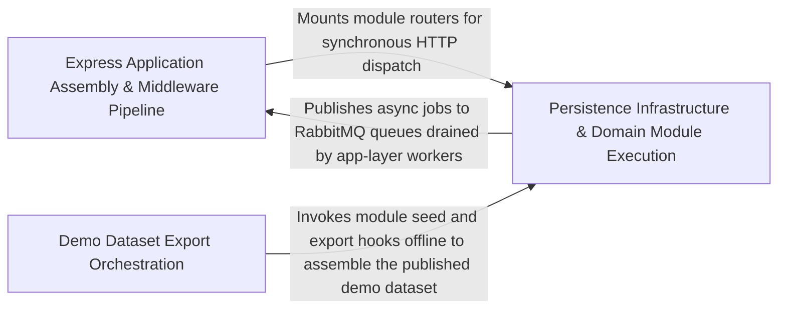

---
tags:
  - 2repo
  - 2repo/arch
  - project/boilerplate-node-backend
type: architecture
component: App_Composition_Demo_Dataset_Assembly
---

## Details

The composition root of the demo pipeline. It owns the broadest surface (39 files, 138 symbols) and is the single entry point that assembles the demo dataset by walking every registered module's seed contribution, sorts keys deterministically, and produces a single canonical JSON document. It wires the Express app by mounting module route trees, serving the EJS-rendered reference UI, injecting per-request correlation metadata, and configuring CORS. It also provides the export entry point that orchestrates the full sequence: clear cache, assemble, seed, and emit the artefact. Architecturally this group is the hub of the subsystem: every other sub-component either feeds data into it or consumes its output.

### Express Application Assembly & Middleware Pipeline
The runtime composition layer that wires the Express application into a serving state. It installs the ordered middleware stack (trust-proxy, helmet, CORS, body parsers, rate limiter), attaches per-request correlation metadata (request-id, access log, locale negotiation), mounts every registered domain module's router at its declared basePath, serves the EJS-rendered reference UI and static assets, and registers the RabbitMQ queue consumers (email, PDF) that drain async jobs. The ordering of installs is load-bearing: request-context must precede routes, security must precede body parsing, and the 404 catch-all must be the last route registered.

**Related Classes/Methods**:

- `src.app.routes.installRoutes`:26-48
- `src.app.request-context.installRequestContext`:19-40
- `src.app.workers.registerWorkers`:20-30
- `src.app.static-assets.installStatic`:13-40

**Source Files:**

- `db/demo/index.ts`
  - `db.demo.index.runScript() callback` (L100-L100) - Function
- `src/app/request-context.ts`
  - `src.app.request-context.installRequestContext` (L19-L40) - Class
  - `src.app.request-context.installRequestContext.app.use() callback` (L23-L28) - Function
- `src/app/routes.ts`
  - `src.app.routes.installRoutes` (L26-L48) - Class
  - `src.app.routes.installRoutes.app.use() callback` (L45-L47) - Function
- `src/app/security.ts`
  - `src.app.security.allowedOrigins` (L27-L32) - Class
  - `src.app.security.allowedOrigins.map() callback` (L30-L30) - Function
- `src/app/static-assets.ts`
  - `src.app.static-assets.installStatic` (L13-L40) - Class
  - `src.app.static-assets.installStatic.setHeaders` (L35-L37) - Method
- `src/app/workers.ts`
  - `src.app.workers.registerWorkers` (L20-L30) - Class
  - `src.app.workers.registerWorkers.then() callback` (L27-L29) - Function
- `src/infrastructure/adapters/email.worker.ts`
  - `src.infrastructure.adapters.email.worker.handleEmailJob` (L23-L49) - Class
  - `src.infrastructure.adapters.email.worker.handleEmailJob.then() callback` (L42-L42) - Function
  - `src.infrastructure.adapters.email.worker.handleEmailJob.catch() callback` (L43-L48) - Function
- `src/infrastructure/adapters/mailer.ts`
  - `src.infrastructure.adapters.mailer.nodemailer` (L148-L212) - Class
  - `src.infrastructure.adapters.mailer.nodemailer.withSpan('email.send') callback` (L160-L211) - Function
  - `src.infrastructure.adapters.mailer.nodemailer.withSpan('email.send') callback.then() callback` (L202-L207) - Function
  - `src.infrastructure.adapters.mailer.enqueueEmail` (L282-L310) - Class
  - `src.infrastructure.adapters.mailer.enqueueEmail.then() callback` (L298-L309) - Function
  - `src.infrastructure.adapters.mailer.enqueueEmail.then() callback.then() callback` (L301-L301) - Function
- `src/infrastructure/adapters/pdf.worker.ts`
  - `src.infrastructure.adapters.pdf.worker.then() callback` (L36-L36) - Function
- `src/infrastructure/adapters/queue.ts`
  - `src.infrastructure.adapters.queue.assertJobQueue` (L225-L240) - Class
  - `src.infrastructure.adapters.queue.assertJobQueue.then() callback` (L240-L240) - Function
  - `src.infrastructure.adapters.queue.publishToQueue` (L271-L304) - Class
  - `src.infrastructure.adapters.queue.publishToQueue.then() callback` (L274-L304) - Function
  - `src.infrastructure.adapters.queue.publishToQueue.then() callback.then() callback` (L283-L291) - Function
  - `src.infrastructure.adapters.queue.publishToQueue.then() callback.catch() callback` (L299-L302) - Function
  - `src.infrastructure.adapters.queue.consumeFromQueue` (L339-L405) - Class
  - `src.infrastructure.adapters.queue.consumeFromQueue.then() callback` (L342-L405) - Function
  - `src.infrastructure.adapters.queue.consumeFromQueue.then() callback.then() callback.ch.consume() callback` (L357-L400) - Function
  - `src.infrastructure.adapters.queue.consumeFromQueue.then() callback.then() callback.ch.consume() callback.then() callback` (L391-L396) - Function
  - `src.infrastructure.adapters.queue.consumeFromQueue.then() callback.then() callback.ch.consume() callback.catch() callback` (L399-L399) - Function
  - `src.infrastructure.adapters.queue.consumeFromQueue.then() callback.then() callback` (L403-L403) - Function
- `src/infrastructure/runtime/otel-sdk.ts`
  - `src.infrastructure.runtime.otel-sdk.buildProcessors.headers.map() callback` (L67-L72) - Function
- `src/modules/account/controllers/delete-account-request.ts`
  - `src.modules.account.controllers.delete-account-request.deleteAccountRequest` (L23-L47) - Class
  - `src.modules.account.controllers.delete-account-request.deleteAccountRequest.then() callback` (L29-L45) - Function
  - `src.modules.account.controllers.delete-account-request.deleteAccountRequest.then() callback.then() callback` (L36-L44) - Function
  - `src.modules.account.controllers.delete-account-request.deleteAccountRequest.catch() callback` (L46-L46) - Function
- `src/modules/account/services/authentication.ts`
  - `src.modules.account.services.authentication.requestAccountDeletion` (L69-L89) - Class
  - `src.modules.account.services.authentication.requestPasswordReset` (L116-L147) - Class
  - `src.modules.account.services.authentication.requestPasswordReset.then() callback` (L123-L146) - Function
  - `src.modules.account.services.authentication.requestPasswordReset.then() callback.then() callback` (L127-L144) - Function
- `src/modules/account/services/tokens.ts`
  - `src.modules.account.services.tokens.findLiveToken.then() callback.entry` (L69-L69) - Class
  - `src.modules.account.services.tokens.findLiveToken.then() callback.entry.user.tokens.find() callback` (L69-L69) - Function
- `src/modules/cart/services/checkout.ts`
  - `src.modules.cart.services.checkout.orderConfirm.then() callback.then() callback.then() callback.orderItems` (L167-L170) - Class
  - `src.modules.cart.services.checkout.orderConfirm.then() callback.then() callback.then() callback.orderItems.joined.map() callback` (L167-L170) - Function
  - `src.modules.cart.services.checkout.orderConfirm.then() callback.then() callback.then() callback.then() callback.then() callback` (L228-L264) - Function
- `src/modules/cart/services/reorder.ts`
  - `src.modules.cart.services.reorder.reorderIntoCart.<function>.then() callback.addable` (L99-L99) - Class
  - `src.modules.cart.services.reorder.reorderIntoCart.<function>.then() callback.addable.lines.filter() callback` (L99-L99) - Function
- `src/modules/locales/controllers/get-locale-entries.ts`
  - `src.modules.locales.controllers.get-locale-entries.getLocaleEntries` (L21-L53) - Class
  - `src.modules.locales.controllers.get-locale-entries.getLocaleEntries.then() callback` (L47-L50) - Function
- `src/modules/locales/controllers/get-locale-messages.ts`
  - `src.modules.locales.controllers.get-locale-messages.getLocaleMessages` (L24-L36) - Class
  - `src.modules.locales.controllers.get-locale-messages.getLocaleMessages.then() callback` (L31-L34) - Function
- `src/modules/locales/controllers/write-locale-entries.ts`
  - `src.modules.locales.controllers.write-locale-entries.createLocaleEntry` (L58-L75) - Class
  - `src.modules.locales.controllers.write-locale-entries.createLocaleEntry.then() callback` (L67-L73) - Function
  - `src.modules.locales.controllers.write-locale-entries.importEntries` (L109-L125) - Class
  - `src.modules.locales.controllers.write-locale-entries.importEntries.then() callback` (L118-L124) - Function
  - `src.modules.locales.controllers.write-locale-entries.importEntries.catch() callback` (L125-L125) - Function
- `src/modules/locales/controllers/write-locales.ts`
  - `src.modules.locales.controllers.write-locales.createLocale` (L40-L58) - Class
  - `src.modules.locales.controllers.write-locales.createLocale.then() callback` (L52-L56) - Function
- `src/modules/locales/model.ts`
  - `src.modules.locales.model.LocaleDocument` (L30-L33) - Interface
  - `src.modules.locales.model.LocaleMessageDocument` (L36-L40) - Interface
- `src/modules/locales/repository.ts`
  - `src.modules.locales.repository.importEntries.created` (L249-L249) - Class
  - `src.modules.locales.repository.importEntries.created.filter() callback` (L249-L249) - Function

### Persistence Infrastructure & Domain Module Execution
The execution substrate that domain modules depend on to read and write data, plus the concrete module implementations that contribute seed data and business logic. It provides the BaseRepository abstraction (CRUD + scoped queries), the text-search/filtering pipeline (addTextFilter), the i18n override refresh mechanism, and the authentication primitives. On top of this substrate, domain modules (orders, feedback, locales, etc.) implement their controllers, services, and repositories. This group represents the modules-to-kernel/infrastructure dependency edge: modules consume the persistence and i18n infrastructure, and the demo assembly consumes the modules' seed contributions.

**Related Classes/Methods**:

- `src.infrastructure.persistence.base-repository.BaseRepository`:164-209
- `src.infrastructure.persistence.search.addTextFilter`:133-143
- `src.infrastructure.i18n.overrides.refreshLocaleOverrides`:105-118
- `src.modules.orders.repository.findByIdScoped`:110-122
- `src.modules.locales.controllers.delete-locale-entry.deleteLocaleEntry`:21-37

**Source Files:**

- `db/demo/assemble.ts`
  - `db.demo.assemble.reconcileShapes.problems` (L150-L158) - Class
  - `db.demo.assemble.reconcileShapes.problems.unlabelled.map() callback` (L152-L153) - Function
  - `db.demo.assemble.reconcileShapes.problems.orphaned.map() callback` (L156-L156) - Function
- `src/infrastructure/i18n/overrides.ts`
  - `src.infrastructure.i18n.overrides.refreshLocaleOverrides` (L105-L118) - Class
  - `src.infrastructure.i18n.overrides.refreshLocaleOverrides.then() callback` (L109-L109) - Function
  - `src.infrastructure.i18n.overrides.refreshLocaleOverrides.catch() callback` (L110-L117) - Function
- `src/infrastructure/persistence/base-repository.ts`
  - `src.infrastructure.persistence.base-repository.BaseRepository` (L164-L209) - Interface
  - `src.infrastructure.persistence.base-repository.createBaseRepository.search.then() callback.then() callback` (L324-L327) - Function
  - `src.infrastructure.persistence.base-repository.createBaseRepository.buildWhere` (L344-L344) - Method
- `src/infrastructure/persistence/search.ts`
  - `src.infrastructure.persistence.search.addTextFilter` (L133-L143) - Class
  - `src.infrastructure.persistence.search.addTextFilter.fields.map() callback` (L140-L142) - Function
- `src/modules/account/services/authentication.ts`
  - `src.modules.account.services.authentication.outcome.then() callback` (L288-L302) - Function
- `src/modules/feedback/controllers/get-feedback.ts`
  - `src.modules.feedback.controllers.get-feedback.getFeedback` (L35-L66) - Class
  - `src.modules.feedback.controllers.get-feedback.getFeedback.then() callback` (L64-L64) - Function
- `src/modules/locales/controllers/delete-locale-entry.ts`
  - `src.modules.locales.controllers.delete-locale-entry.deleteLocaleEntry` (L21-L37) - Class
  - `src.modules.locales.controllers.delete-locale-entry.deleteLocaleEntry.then() callback` (L27-L36) - Function
- `src/modules/locales/controllers/delete-locale.ts`
  - `src.modules.locales.controllers.delete-locale.deleteLocale` (L21-L34) - Class
  - `src.modules.locales.controllers.delete-locale.deleteLocale.then() callback` (L24-L33) - Function
- `src/modules/locales/controllers/get-locales.ts`
  - `src.modules.locales.controllers.get-locales.getLocales` (L24-L30) - Class
  - `src.modules.locales.controllers.get-locales.getLocales.then() callback` (L29-L29) - Function
- `src/modules/locales/controllers/write-locale-entries.ts`
  - `src.modules.locales.controllers.write-locale-entries.updateLocaleEntry` (L84-L106) - Class
  - `src.modules.locales.controllers.write-locale-entries.updateLocaleEntry.then() callback` (L98-L104) - Function
- `src/modules/locales/controllers/write-locales.ts`
  - `src.modules.locales.controllers.write-locales.updateLocale` (L67-L85) - Class
  - `src.modules.locales.controllers.write-locales.updateLocale.then() callback` (L79-L83) - Function
- `src/modules/locales/demo.ts`
  - `src.modules.locales.demo.seedLocalesCollection.languages` (L273-L275) - Class
  - `src.modules.locales.demo.seedLocalesCollection.languages.localeFixtures.map() callback` (L274-L274) - Function
  - `src.modules.locales.demo.seedLocalesCollection.entries` (L276-L278) - Class
  - `src.modules.locales.demo.seedLocalesCollection.entries.localeEntryFixtures.map() callback` (L277-L277) - Function
- `src/modules/locales/repository.ts`
  - `src.modules.locales.repository.EntryInput` (L37-L40) - Interface
  - `src.modules.locales.repository.ImportCounts` (L43-L47) - Interface
  - `src.modules.locales.repository.importEntries.removedKeys` (L233-L233) - Class
  - `src.modules.locales.repository.importEntries.removedKeys.filter() callback` (L233-L233) - Function
- `src/modules/orders/controllers/get-order-invoice.ts`
  - `src.modules.orders.controllers.get-order-invoice.getOrderInvoice` (L20-L73) - Class
  - `src.modules.orders.controllers.get-order-invoice.getOrderInvoice.then() callback` (L30-L71) - Function
  - `src.modules.orders.controllers.get-order-invoice.getOrderInvoice.then() callback.then() callback` (L61-L70) - Function
- `src/modules/orders/controllers/get-order-item.ts`
  - `src.modules.orders.controllers.get-order-item.getOrderItem` (L25-L47) - Class
  - `src.modules.orders.controllers.get-order-item.getOrderItem.then() callback` (L37-L45) - Function
- `src/modules/orders/domain/rules.ts`
  - `src.modules.orders.domain.rules.checkOrderLines` (L23-L28) - Class
  - `src.modules.orders.domain.rules.checkOrderLines.lines.some() callback` (L25-L25) - Function
- `src/modules/orders/repository.ts`
  - `src.modules.orders.repository.search` (L57-L85) - Class
  - `src.modules.orders.repository.search.then() callback` (L72-L83) - Function
  - `src.modules.orders.repository.search.then() callback.then() callback` (L79-L82) - Function
  - `src.modules.orders.repository.findByIdScoped` (L110-L122) - Class
  - `src.modules.orders.repository.then() callback` (L114-L114) - Function
  - `src.modules.orders.repository.findByIdScoped.then() callback` (L117-L120) - Function
- `src/modules/orders/service.ts`
  - `src.modules.orders.service.create` (L131-L215) - Class
  - `src.modules.orders.service.create.items.map() callback` (L141-L142) - Function
  - `src.modules.orders.service.create.items.map() callback.then() callback` (L142-L142) - Function
  - `src.modules.orders.service.create.then() callback` (L144-L214) - Function
  - `src.modules.orders.service.create.then() callback.verdict` (L145-L147) - Class
  - `src.modules.orders.service.create.then() callback.verdict.resolvedItems.map() callback` (L146-L146) - Function
  - `src.modules.orders.service.create.then() callback.then() callback` (L174-L213) - Function
  - `src.modules.orders.service.update.updateItemsPromise` (L278-L306) - Class
  - `src.modules.orders.service.update.updateItemsPromise.then() callback.requestedItems.map() callback` (L290-L293) - Function
  - `src.modules.orders.service.update.updateItemsPromise.then() callback.requestedItems.map() callback.then() callback` (L293-L293) - Function
  - `src.modules.orders.service.update.updateItemsPromise.then() callback.then() callback.resolvedItems.map() callback` (L299-L302) - Function
  - `src.modules.orders.service.update.updateItemsPromise.then() callback` (L308-L321) - Function

### Demo Dataset Export Orchestration
The top-level entry point (npm run seed:export) that orchestrates the full demo-dataset publication pipeline. It spins up an in-memory MongoDB, connects via the app's own getDatabaseUri() path, runs every enabled module's seeds() in parallel, then calls assembleDemoDataset() which collects each module's seedExport() contribution, merges and normalizes to plain JSON, reconciles the _meta.shapes classification against published collections, validates that every *Id reference resolves to a seeded record, and applies deterministic sortKeys to produce a stable artefact. The script compares the result against the committed demo-data.json and either writes the file or fails the --check gate.

**Related Classes/Methods**:

- `scripts.export-demo-dataset.run`:34-71
- `db.demo.assemble.assembleDemoDataset`:167-206
- `db.demo.assemble.sortKeys`:74-82

**Source Files:**

- `db/demo/assemble.ts`
  - `db.demo.assemble.sortKeys` (L74-L82) - Class
  - `db.demo.assemble.sortKeys.value.map() callback` (L75-L75) - Function
  - `db.demo.assemble.sortKeys.toSorted() callback` (L79-L79) - Function
  - `db.demo.assemble.sortKeys.map() callback` (L80-L80) - Function
  - `db.demo.assemble.assembleDemoDataset` (L167-L206) - Class
  - `db.demo.assemble.assembleDemoDataset.dangling.map() callback` (L202-L202) - Function
- `scripts/export-demo-dataset.ts`
  - `scripts.export-demo-dataset.run` (L34-L71) - Class
  - `scripts.export-demo-dataset.run.enabledModules.map() callback` (L42-L42) - Function
- `src/infrastructure/adapters/storage.ts`
  - `src.infrastructure.adapters.storage.validateUploadedImages.then() callback.rejected` (L284-L288) - Class
  - `src.infrastructure.adapters.storage.validateUploadedImages.then() callback.rejected.paths.filter() callback` (L285-L287) - Function
  - `src.infrastructure.adapters.storage.validateUploadedImages.then() callback.rejected.map() callback` (L304-L304) - Function
