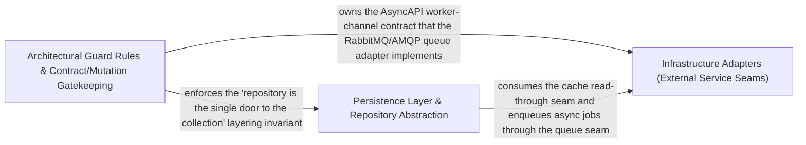

---
tags:
  - 2repo
  - 2repo/arch
  - project/boilerplate-node-backend
type: architecture
component: Architectural_ESLint_Rules_AsyncAPI_Section_Merge
---

## Details

The architectural-guard half of the subsystem. It defines the custom ESLint rules that encode the DDD layering invariants — no-persistence-imports (persistence handles/schema files stay behind the repository) and no-hardcoded-user-text (user-facing error copy must come from i18n). It also owns the AsyncAPI merge machinery that folds the per-section documents into the two scoped bundles (asyncapi.yaml / asyncapi.public.yaml) through the YAML AST with collision refusal, and the per-file mutation-baseline ratchet that turns Stryker's global thresholds into an actionable per-file gate.

### Architectural Guard Rules & Contract/Mutation Gatekeeping
The core of the subsystem. Defines project-local ESLint rules enforcing DDD layering invariants (no-persistence-imports, no-hardcoded-user-text), the AsyncAPI section-merge machinery that folds per-section documents into scoped bundles via the YAML AST with collision refusal, and the per-file mutation-baseline ratchet that converts Stryker's global thresholds into an actionable per-file gate. This is the guard axis that makes layering and contract boundaries machine-enforceable.

**Related Classes/Methods**:

- `eslint.rules.no-persistence-imports.noPersistenceImports`:58-118

**Source Files:**

- `eslint/rules/no-hardcoded-user-text.ts`
  - `eslint.rules.no-hardcoded-user-text.noHardcodedUserText.create.CallExpression.errors` (L36-L38) - Class
  - `eslint.rules.no-hardcoded-user-text.noHardcodedUserText.create.CallExpression.errors.node.arguments.find() callback` (L37-L37) - Function
- `eslint/rules/no-persistence-imports.ts`
  - `eslint.rules.no-persistence-imports.noPersistenceImports` (L58-L118) - Class
  - `eslint.rules.no-persistence-imports.noPersistenceImports.create` (L89-L117) - Method
  - `eslint.rules.no-persistence-imports.noPersistenceImports.create.ImportDeclaration` (L95-L115) - Method
- `scripts/contracts/asyncapi-bundles.ts`
  - `scripts.contracts.asyncapi-bundles.marker` (L72-L77) - Class
  - `scripts.contracts.asyncapi-bundles.marker.sections.map() callback` (L76-L76) - Function
- `scripts/mutation-baseline.ts`
  - `scripts.mutation-baseline.formatRegressions.regressed` (L181-L181) - Class
  - `scripts.mutation-baseline.formatRegressions.regressed.comparisons.filter() callback` (L181-L181) - Function
- `scripts/run-demo-server.ts`
  - `scripts.run-demo-server.then() callback.process.once() callback` (L65-L70) - Function
  - `scripts.run-demo-server.then() callback.process.once() callback.catch() callback` (L68-L68) - Function
  - `scripts.run-demo-server.then() callback.process.once() callback.then() callback` (L69-L69) - Function
  - `scripts.run-demo-server.then() callback.then() callback.waitForDatabase() callback` (L81-L81) - Function
  - `scripts.run-demo-server.then() callback.then() callback` (L84-L88) - Function
- `src/modules/account/module.ts`
  - `src.modules.account.module.<function>.then() callback` (L37-L37) - Function
- `src/modules/cart/domain/rules.ts`
  - `src.modules.cart.domain.rules.CartLineCandidate` (L7-L18) - Interface
  - `src.modules.cart.domain.rules.CheckoutShortfall` (L21-L26) - Interface
  - `src.modules.cart.domain.rules.evaluateCheckout` (L67-L86) - Class
  - `src.modules.cart.domain.rules.evaluateCheckout.lines.some() callback` (L69-L69) - Function
  - `src.modules.cart.domain.rules.shortfalls` (L75-L82) - Class
  - `src.modules.cart.domain.rules.evaluateCheckout.shortfalls.lines.filter() callback` (L76-L76) - Function
  - `src.modules.cart.domain.rules.evaluateCheckout.shortfalls.map() callback` (L77-L82) - Function
- `src/modules/cart/services/checkout.ts`
  - `src.modules.cart.services.checkout.orderConfirm.<function>.then() callback.then() callback` (L133-L266) - Function
- `src/modules/products/service.ts`
  - `src.modules.products.service.getByIdViewed` (L128-L141) - Class
  - `src.modules.products.service.getByIdViewed.then() callback` (L133-L141) - Function
  - `src.modules.products.service.remove` (L262-L282) - Class
  - `src.modules.products.service.remove.then() callback` (L281-L281) - Function
  - `src.modules.products.service.removeById` (L291-L298) - Class
  - `src.modules.products.service.removeById.then() callback` (L295-L298) - Function

### Infrastructure Adapters (External Service Seams)
The swappable adapter seams the architectural guards protect. Holds the infrastructure adapters wrapping external services and runtime concerns — the Redis cache adapter, the RabbitMQ/AMQP queue adapter, the image-signature detection adapter, and the PDF worker — each a ports-and-adapters boundary with a pluggable implementation behind the seams that the layering rules and contracts keep stable.

**Related Classes/Methods**:

- `src.infrastructure.adapters.queue.startQueue`

**Source Files:**

- `src/infrastructure/adapters/pdf.worker.ts`
  - `src.infrastructure.adapters.pdf.worker.handlePdfJob` (L19-L45) - Class
  - `src.infrastructure.adapters.pdf.worker.handlePdfJob.then() callback` (L37-L40) - Function
  - `src.infrastructure.adapters.pdf.worker.handlePdfJob.catch() callback` (L41-L44) - Function
- `src/infrastructure/adapters/queue.ts`
  - `src.infrastructure.adapters.queue.startQueue` (L173-L173) - Class
  - `src.infrastructure.adapters.queue.startQueue.then() callback` (L173-L173) - Function
- `src/modules/audit-logs/service.ts`
  - `src.modules.audit-logs.service.record` (L29-L39) - Class
  - `src.modules.audit-logs.service.record.catch() callback` (L30-L38) - Function
- `src/modules/orders/service.ts`
  - `src.modules.orders.service.create.then() callback.then() callback.outcome` (L175-L181) - Class
  - `src.modules.orders.service.create.then() callback.then() callback.outcome.resolvedItems.map() callback` (L177-L180) - Function

### Persistence Layer & Repository Abstraction
The persistence axis that the no-persistence-imports guard keeps behind the repository. Holds the shared persistence abstractions — the base repository, the search/pagination spec, the serialization schema, and the Mongoose model layer — plus the module service orchestration that consumes them. It is the single place a query shape can change, which is exactly the invariant the architectural guard enforces.

**Related Classes/Methods**:

- `src.infrastructure.persistence.base-repository.BaseRepositoryOptions`:150-155
- `src.infrastructure.persistence.search.PaginatedMeta`:23-28
- `src.infrastructure.persistence.serialize.SerializableSchema`:50-52

**Source Files:**

- `src/infrastructure/adapters/cache.ts`
  - `src.infrastructure.adapters.cache.startCache` (L138-L138) - Class
  - `src.infrastructure.adapters.cache.startCache.then() callback` (L138-L138) - Function
- `src/infrastructure/adapters/image-signatures.ts`
  - `src.infrastructure.adapters.image-signatures.ImageSignature` (L23-L27) - Interface
  - `src.infrastructure.adapters.image-signatures.HEADER_LENGTH` (L58-L60) - Class
  - `src.infrastructure.adapters.image-signatures.HEADER_LENGTH.IMAGE_SIGNATURES.map() callback` (L59-L59) - Function
  - `src.infrastructure.adapters.image-signatures.identifyImage` (L68-L73) - Class
  - `src.infrastructure.adapters.image-signatures.identifyImage.IMAGE_SIGNATURES.find() callback` (L70-L72) - Function
  - `src.infrastructure.adapters.image-signatures.identifyImage.IMAGE_SIGNATURES.find() callback.signature.bytes.every() callback` (L72-L72) - Function
- `src/infrastructure/persistence/base-repository.ts`
  - `src.infrastructure.persistence.base-repository.FindAllOptions` (L21-L26) - Interface
  - `src.infrastructure.persistence.base-repository.SearchSpec` (L38-L59) - Interface
  - `src.infrastructure.persistence.base-repository.PaginatedResult` (L145-L148) - Interface
  - `src.infrastructure.persistence.base-repository.BaseRepositoryOptions` (L150-L155) - Interface
- `src/infrastructure/persistence/search.ts`
  - `src.infrastructure.persistence.search.PaginationResult` (L17-L21) - Interface
  - `src.infrastructure.persistence.search.PaginatedMeta` (L23-L28) - Interface
- `src/infrastructure/persistence/serialize.ts`
  - `src.infrastructure.persistence.serialize.SerializeOptions` (L26-L40) - Interface
  - `src.infrastructure.persistence.serialize.SerializableSchema` (L50-L52) - Interface
  - `src.infrastructure.persistence.serialize.applySerialization` (L61-L94) - Class
  - `src.infrastructure.persistence.serialize.transform` (L65-L79) - Class
  - `src.infrastructure.persistence.serialize.applySerialization.transform.toString` (L68-L68) - Method
  - `src.infrastructure.persistence.serialize.applySerialization.transform` (L90-L90) - Method
- `src/modules/audit-logs/model.ts`
  - `src.modules.audit-logs.model.AuditLogDocument` (L39-L41) - Interface
  - `src.modules.audit-logs.model.applyAuditLogTransform` (L170-L177) - Class
  - `src.modules.audit-logs.model.applyAuditLogTransform.after` (L173-L176) - Method
- `src/modules/orders/domain/lifecycle.ts`
  - `src.modules.orders.domain.lifecycle.statusesLeadingTo` (L91-L92) - Class
  - `src.modules.orders.domain.lifecycle.statusesLeadingTo.filter() callback` (L92-L92) - Function
- `src/modules/orders/domain/totals.ts`
  - `src.modules.orders.domain.totals.LineItem` (L29-L33) - Interface
  - `src.modules.orders.domain.totals.LineItemTotals` (L35-L42) - Interface
  - `src.modules.orders.domain.totals.OrderTotalInput` (L69-L76) - Interface
- `src/modules/orders/model.ts`
  - `src.modules.orders.model.OrderDocumentItem` (L19-L29) - Interface
  - `src.modules.orders.model.OrderDocument` (L43-L66) - Interface
  - `src.modules.orders.model.applyOrderTransform` (L235-L240) - Class
  - `src.modules.orders.model.applyOrderTransform.after` (L236-L239) - Method
